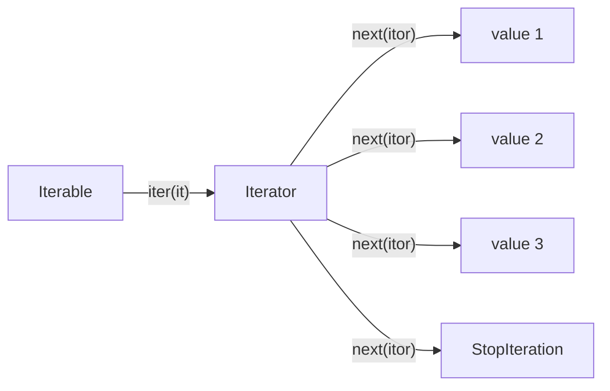
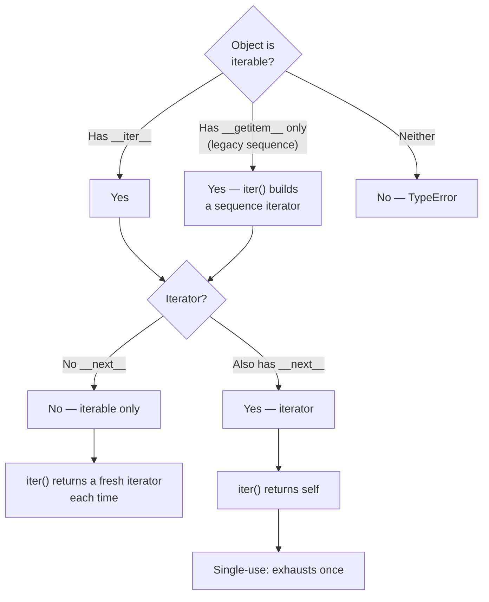
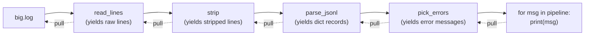
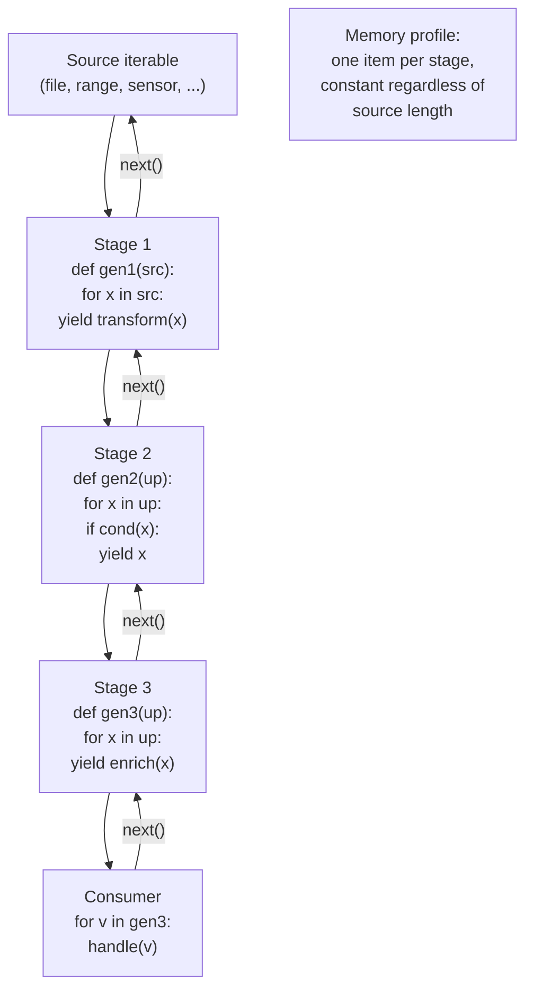
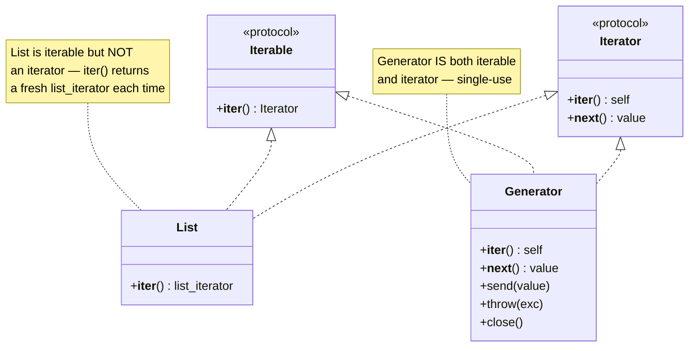

# 2. Generators and Iterators

> [!note] Why this note exists
> Iteration is the beating heart of Python's data model. The `for` loop, the `in` operator, `sum`, `list`, `dict`, `set`, `tuple`, `*` unpacking, `zip`, `enumerate`, `itertools`, and almost every modern API all funnel through one tiny pair of dunder methods — `__iter__` and `__next__`. Generators are the easiest way to implement iterators, but they are also far more than that: they let you build **lazy pipelines** that consume megabytes of input with constant memory, model **infinite streams**, and implement **cooperative concurrency** patterns. This note covers the iterator protocol, `yield`, `yield from`, generator pipelines, infinite generators, memory efficiency, and the subtle distinction between iterables and iterators.

## Why It Matters

Suppose you need to process a 50 GB CSV file. You cannot load it into memory. But you can read it line by line, parse each row, filter, transform, aggregate, and write the result. Every step can be a generator. The pipeline never holds more than a few rows in memory at a time, yet the code reads like a list of transformations.

```python
def read_rows(path):
    with open(path) as fh:
        for line in fh:
            yield line.strip().split(",")

def parse_rows(rows):
    for r in rows:
        yield [int(x) if x.lstrip("-").isdigit() else x for x in r]

def filter_active(rows):
    for r in rows:
        if r and r[0] != "INACTIVE":
            yield r

def sum_amounts(rows):
    total = 0
    for r in rows:
        total += r[2]
    yield total

pipeline = sum_amounts(filter_active(parse_rows(read_rows("big.csv"))))
print(next(pipeline))   # the grand total — without ever loading the whole file
```

Each stage is a tiny generator; the next stage pulls from the previous one. Memory usage stays flat regardless of file size. This is the **stream-processing** style that powers ETL jobs, log analysis, machine-learning data loaders, and functional reactive systems.

Generators also let you model **infinite sequences** naturally — Fibonacci numbers, prime numbers, sensor readings, message streams — without recursion-depth limits or pre-allocated buffers.

## Background

Python distinguishes between an **iterable** and an **iterator**:

- An **iterable** is anything that has an `__iter__` method (or implements the legacy `__getitem__` sequence protocol). Lists, dicts, sets, strings, files, and your own classes can be iterables. `iter(x)` calls `x.__iter__()` and returns an iterator.
- An **iterator** is the object returned by `__iter__`. It has both `__iter__` (which returns itself) and `__next__`. Each call to `next(it)` returns the next value or raises `StopIteration` when exhausted.

The `for` loop desugars as:

```python
for x in iterable:
    body

# Equivalent to:
_iter = iter(iterable)
while True:
    try:
        x = next(_iter)
    except StopIteration:
        break
    body
```



### Iterator protocol

To make a class iterable you implement `__iter__` returning an iterator. To make it an iterator you also implement `__next__`. A common pattern is to have `__iter__` return `self` and put the state in the same object:

```python
class Countdown:
    def __init__(self, start):
        self.n = start

    def __iter__(self):
        return self

    def __next__(self):
        if self.n <= 0:
            raise StopIteration
        self.n -= 1
        return self.n + 1

for x in Countdown(5):
    print(x)
# 5 4 3 2 1
```

Once exhausted, an iterator stays exhausted. `for x in countdown: ...` works only once. Iterables, by contrast, can be re-iterated because each `__iter__` call produces a fresh iterator.



## Generators with `yield`

A **generator function** is a function that contains at least one `yield` statement. When called, it does **not** execute the body — it returns a **generator object** that is its own iterator. Each call to `next()` runs the body up to the next `yield` and pauses, returning the yielded value. Calling `next()` again resumes after the `yield`:

```python
def countdown(n):
    while n > 0:
        yield n
        n -= 1

g = countdown(3)
print(next(g))   # 3
print(next(g))   # 2
print(next(g))   # 1
print(next(g))   # StopIteration
```

The state of local variables, the instruction pointer, and the `try`/`except`/`finally` blocks is preserved across suspensions. The generator pauses exactly where it was.

```python
import traceback

def echo():
    while True:
        try:
            received = yield
            print("got", received)
        except ValueError:
            print("value error caught inside generator")

g = echo()
next(g)                  # prime the generator — runs to first yield
g.send("hello")          # got hello
g.throw(ValueError)      # value error caught inside generator
g.close()                # stops the generator
```

The full generator API:

- `next(g)` — resume and return next yielded value.
- `g.send(value)` — resume, but the `yield` expression returns `value` instead of `None`.
- `g.throw(exc)` — raise `exc` at the paused `yield`.
- `g.close()` — raise `GeneratorExit` at the paused `yield`; the generator should clean up and return.
- `yield from sub` — delegate to a sub-iterator (see below).

## Generator Expressions vs List Comprehensions

A generator expression is just a compact generator function:

```python
squares_gen = (x * x for x in range(10))
squares_list = [x * x for x in range(10)]
```

- The list comprehension allocates a list of 10 ints immediately.
- The generator expression returns a single generator object. Values are produced lazily as you iterate.

Generator expressions are perfect for `sum`, `any`, `all`, `max`, `min`, `sorted`, `list`, `dict`, `set`, and `''.join`. They avoid building intermediate lists.

```python
# Memory-friendly
total = sum(x * x for x in range(1_000_000))
has_neg = any(x < 0 for x in measurements)
top10 = sorted((line.split()[0] for line in open("access.log")), key=...)[:10]
```

See [[1. Comprehensions Deep Dive]] for the syntax of generator expressions and when to pick them over materialised collections.

## `yield from` — Delegation

`yield from sub_iterable` delegates to a sub-iterator. It's equivalent to:

```python
for x in sub_iterable:
    yield x
```

…but it also forwards `send`, `throw`, and `return` values to the sub-iterator, which makes it suitable for delegating between coroutines or recursive generators.

```python
def flatten(nested):
    for item in nested:
        if isinstance(item, list):
            yield from flatten(item)     # recursive delegation
        else:
            yield item

list(flatten([1, [2, [3, 4], 5], 6]))
# [1, 2, 3, 4, 5, 6]
```

`yield from` also captures the sub-generator's `return` value (the argument of `StopIteration`):

```python
def sub():
    yield 1
    yield 2
    return "done"

def main():
    result = yield from sub()
    print("sub returned:", result)

g = main()
next(g); next(g); next(g)
# sub returned: done
# StopIteration
```

## Generator Pipelines

Generators compose beautifully. Each stage takes an upstream iterator and yields transformed or filtered items downstream. The pipeline is **pull-based**: the consumer drives the producer.

```python
def read_lines(path):
    with open(path) as fh:
        yield from fh

def strip(lines):
    for line in lines:
        yield line.strip()

def parse_jsonl(lines):
    import json
    for line in lines:
        if line:
            yield json.loads(line)

def pick_errors(records):
    for r in records:
        if r.get("level") == "ERROR":
            yield r["message"]

pipeline = pick_errors(parse_jsonl(strip(read_lines("app.log"))))
for msg in pipeline:
    print(msg)
```

Each generator consumes from its upstream source on demand. The whole pipeline stores at most one record per stage. Compare that to a non-lazy approach that would build a giant list of all parsed records before filtering — for a 50 GB log file the lazy version uses megabytes, the eager version uses gigabytes.



The arrows show **data flowing left to right**, but **control flows right to left**: the consumer asks the last generator for the next value, which recursively asks the previous one. Nothing is computed until somebody asks for it.

## Memory Efficiency

A list-based pipeline allocates intermediate lists:

```python
lines = open("big.log").read().splitlines()              # entire file in memory
stripped = [l.strip() for l in lines]                     # copy 2
records = [json.loads(l) for l in stripped if l]          # copy 3
errors = [r["message"] for r in records if r["level"]=="ERROR"]  # copy 4
```

Four copies of the data exist simultaneously. A generator pipeline keeps **one record in flight per stage**.

For 1 million records, the eager pipeline might consume several gigabytes; the lazy pipeline stays in the tens of megabytes regardless of input size.

> [!tip] Memory profiling
> Use `tracemalloc` to verify your generator pipeline's peak memory:
> ```python
> import tracemalloc
> tracemalloc.start()
> # ... run pipeline ...
> current, peak = tracemalloc.get_traced_memory()
> print(f"peak={peak/1e6:.1f} MB")
> ```

## Infinite Generators

Generators don't need a termination condition. You can model unbounded streams:

```python
def fibonacci():
    a, b = 0, 1
    while True:
        yield a
        a, b = b, a + b

fib = fibonacci()
print([next(fib) for _ in range(10)])
# [0, 1, 1, 2, 3, 5, 8, 13, 21, 34]
```

Combine with `itertools.islice` to take a finite number:

```python
from itertools import islice
list(islice(fibonacci(), 20))
```

`itertools.count`, `itertools.cycle`, and `itertools.repeat` are built-in infinite generators.

> [!warning] Don't call `list()` on an infinite generator
> `list(fibonacci())` will hang and consume all memory. Always pair infinite generators with `islice` or another terminating consumer.

## Generator Patterns

### Pipeline / map-filter-reduce

The classic streaming transformation. Each stage is a small generator function.

### State machines

```python
def traffic_light():
    state = "green"
    while True:
        yield state
        state = {"green": "amber", "amber": "red", "red": "green"}[state]

light = traffic_light()
[next(light) for _ in range(6)]
# ['green', 'amber', 'red', 'green', 'amber', 'red']
```

### Coroutines (consumer-style)

A generator that consumes via `send` can act as a coroutine. Modern code should prefer `async def` for true coroutine semantics, but `send`-based generators are still useful for stateful consumers.

### Recursive traversal

`yield from` enables elegant recursion over trees:

```python
def walk(node):
    yield node
    for child in node.children:
        yield from walk(child)
```

### Chunked iteration

```python
def chunks(it, size):
    batch = []
    for x in it:
        batch.append(x)
        if len(batch) == size:
            yield batch
            batch = []
    if batch:
        yield batch
```

## Mermaid: Generator Pipeline



## Mermaid: Iterable vs Iterator



## Advanced Generator Patterns

### Bidirectional generators with `send`

A generator can both yield values to the consumer and **receive** values from the consumer via `send`:

```python
def accumulator():
    total = 0
    while True:
        # yield the current total, then receive a new value to add
        value = yield total
        if value is None:
            break
        total += value

acc = accumulator()
next(acc)             # prime the generator — runs to first yield, returns 0
acc.send(10)          # returns 10
acc.send(20)          # returns 30
acc.send(5)           # returns 35
acc.send(None)        # breaks the loop, raises StopIteration
```

`send` resumes the generator and the `yield` expression evaluates to the sent value. The first `next()` (or `.send(None)`) is required to advance the generator to its first `yield` — you cannot send a non-`None` value to a fresh generator.

### `throw` and `close`

```python
def safe_loop():
    while True:
        try:
            value = yield
            process(value)
        except ValueError as e:
            print(f"skipping bad value: {e}")

g = safe_loop()
next(g)
g.send("good")           # processed
g.throw(ValueError("bad input"))   # caught inside, generator continues
g.send("more good")
g.close()                # raises GeneratorExit inside, generator stops
```

`g.throw(exc)` injects an exception at the `yield` point. `g.close()` raises `GeneratorExit`, which the generator should let propagate (or catch only to do cleanup, then re-raise or return).

### `itertools` recipes

The `itertools` module is full of generators that compose into pipelines. Highlights:

- `chain(*iters)` — concatenate iterables.
- `chain.from_iterable(iter_of_iters)` — flatten one level.
- `islice(iter, start, stop, step)` — slice an iterable.
- `takewhile(pred, iter)`, `dropwhile(pred, iter)` — take/drop while predicate is true.
- `filterfalse(pred, iter)` — keep elements where predicate is false.
- `starmap(func, iter_of_tuples)` — like `map` but unpacks each tuple.
- `accumulate(iter, func)` — running reduction.
- `groupby(iter, key)` — group consecutive equal keys (must sort first).
- `tee(iter, n)` — split one iterable into `n` independent iterators.
- `zip_longest(*iters, fillvalue)` — zip with padding.
- `product(*iters, repeat=1)` — Cartesian product.
- `permutations`, `combinations`, `combinations_with_replacement`.
- `count(start, step)`, `cycle(iter)`, `repeat(obj, times)` — infinite generators.
- `pairwise(iter)` (3.10+) — consecutive overlapping pairs.

See [[9. Standard Library Deep Dive/5. itertools]] for the full reference.

### Real-world pipelines

A typical ETL pipeline reads, parses, validates, transforms, batches, and writes:

```python
def read_jsonl(path):
    with open(path) as fh:
        for line in fh:
            line = line.strip()
            if line:
                yield json.loads(line)

def validate(records, schema):
    for r in records:
        try:
            yield schema(r)
        except ValidationError as e:
            logger.warning("skipping invalid record: %s", e)

def transform(records):
    for r in records:
        yield {**r, "processed_at": time.time()}

def batch(records, size):
    batch = []
    for r in records:
        batch.append(r)
        if len(batch) == size:
            yield batch
            batch = []
    if batch:
        yield batch

def write_batches(batches, path):
    with open(path, "w") as fh:
        for b in batches:
            fh.write(json.dumps(b) + "\n")

# Compose
pipeline = write_batches(
    batch(transform(validate(read_jsonl("in.jsonl"), schema)), 100),
    "out.jsonl",
)
```

Each stage is independent, testable, and lazy. The peak memory is `size + a few in-flight records`, regardless of input size.

## Common Pitfalls

1. **Iterating a generator twice.** Once exhausted, a generator cannot be reset. Store the results in a list if you need multiple passes:
   ```python
   g = (x * x for x in range(5))
   list(g)   # [0, 1, 4, 9, 16]
   list(g)   # []
   ```

2. **Forgetting to prime a coroutine.** A generator that uses `received = yield` must be advanced to the first `yield` before `send(value)` works. Use `next(g)` first, or use a decorator that does this.

3. **Returning early from a generator.** A `return value` inside a generator raises `StopIteration(value)`. The value is accessible via `yield from` or `try/except StopIteration`, but easy to miss.

4. **Resource cleanup on exception.** If a generator opens a file and yields lines, partial iteration without `close()` may delay the file close. Use `with` inside the generator or `contextlib.closing`.

5. **`yield` inside a `try`/`finally`.** `finally` runs when the generator is garbage-collected or explicitly closed. If you exhaust the generator normally, `finally` runs as expected. If you abandon it, `finally` may run much later.

6. **Generator performance vs list.** Generators have per-`yield` overhead. For small fixed inputs, a list comprehension is often faster. The win is when input is large or unknown in size.

7. **Mixing `yield` with `return value`.** `return` in a generator is fine, but pre-3.3 you couldn't return a value at all. Modern code uses it; older code may need restructuring.

8. **Generator state isn't thread-safe.** Calling `next(g)` from multiple threads is not atomic. Use a lock if generators are shared.

9. **Confusing iterables with iterators in APIs.** A function that accepts an iterator can only be called once with that iterator. If you accept an iterable, you can re-iterate internally.

10. **Accidentally consuming the upstream in a pipeline.** If a middle stage materialises the input (e.g. `list(upstream)`), the laziness is destroyed.

11. **`yield from` not forwarding `send`/`throw`.** If you manually iterate a sub-iterator with `for x in sub: yield x`, you lose the ability to `send` or `throw` into it. Use `yield from sub` instead.

12. **Closing a generator mid-iteration.** `g.close()` raises `GeneratorExit` inside the generator. If your generator catches `GeneratorExit` and yields anyway, you'll get a `RuntimeError`.

## Tips and Tricks

- **Use `yield from` for delegation.** It's faster than the manual `for x in sub: yield x` loop and correctly forwards `send`/`throw`/`return`.
- **Profile laziness with `tracemalloc`.** Verify your pipeline's peak memory actually stays flat as input grows.
- **`itertools.islice` for finite views of infinite generators.** Don't materialise an infinite stream.
- **`itertools.chain.from_iterable` for flattening.** Faster than a nested `yield from` for simple cases.
- **`more_itertools` for advanced recipes.** `chunked`, `windowed`, `peekable`, `sliced`, and many others extend generators ergonomically.
- **Type your generators.** `Generator[Yield, Send, Return]` (or `Iterator[T]` for simple cases) makes pipelines self-documenting. See [[1. Basic Type Hints]].
- **`async def` + `async for` for I/O-bound streams.** Sync generators block the event loop. Use async generators (PEP 525) when interleaving I/O.
- **Use `contextlib.closing` for explicit cleanup of generators that hold resources.** `with closing(gen) as g: ...` calls `g.close()` on exit.
- **Materialise only at the end of the pipeline.** Insert `list(...)` at the consumer, never at intermediate stages.
- **`tee` to fan-out one iterable to multiple consumers.** But beware — it caches consumed values in memory.

## Active Recall

1. What two dunder methods make up the iterator protocol?
2. What is the difference between an iterable and an iterator? Give one example of each.
3. Write a generator that yields the first `n` Fibonacci numbers.
4. What happens when you call `next()` on an exhausted generator?
5. Convert `def squares(n): return [x*x for x in range(n)]` into a generator function.
6. What does `yield from sub` do that `for x in sub: yield x` does not?
7. Write a 3-stage pipeline that reads a file, strips lines, and parses JSON.
8. Why does the lazy pipeline use less memory than the eager one?
9. Name two ways to take a finite slice of an infinite generator.
10. What is the role of `GeneratorExit`?
11. Can a generator return a value? If so, how is it accessed?
12. Why must coroutine-style generators be "primed" before `send()` works?
13. Write a generator that yields chunks of `size` items from an iterable.
14. What's wrong with `list(fibonacci())` where `fibonacci` is infinite?
15. When does the `finally` block of a generator run if the consumer stops early?
16. How can you check if an object is an iterator without consuming it?
17. Compare generator expressions and list comprehensions on memory and speed.
18. What does `itertools.tee` do, and what's its memory cost?
19. Write a recursive generator that walks a nested dict structure.
20. Why is `yield from` preferred over manual delegation for sub-coroutines?

## Next Steps

- [[1. Comprehensions Deep Dive]] — generator expressions are comprehensions; this is the flip side of the same coin.
- [[6. Higher Order Functions]] — `map`, `filter`, `reduce`, and `itertools` build on the iterator protocol.
- [[3. Context Managers]] — generators can be context managers via `@contextmanager`; they're also often wrapped in `with` for resource cleanup.
- [[5. Closures]] — generator functions are closures over their enclosing scope; understanding closure capture explains surprising resume behaviour.
- [[4. Decorators Deep Dive]] — generators and decorators combine in `@contextmanager`, `@asynccontextmanager`, and many testing fixtures.
