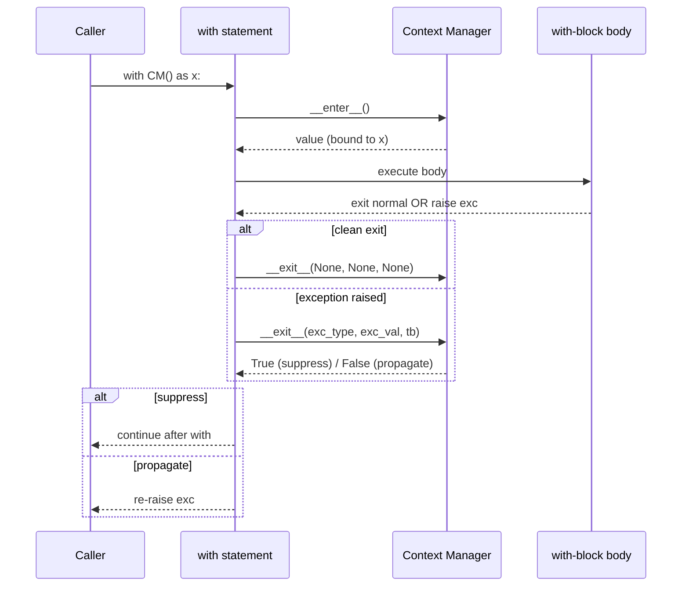
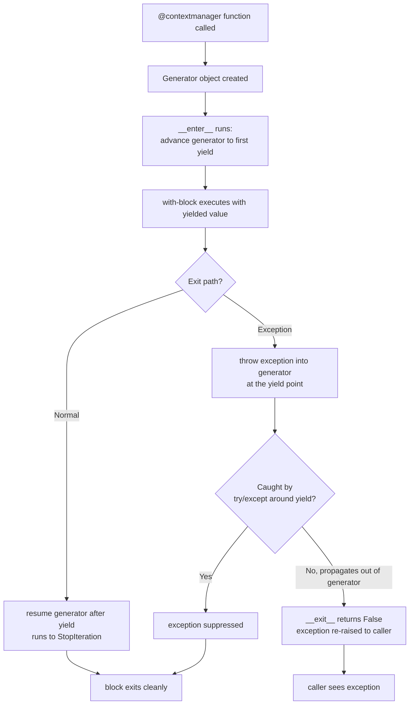
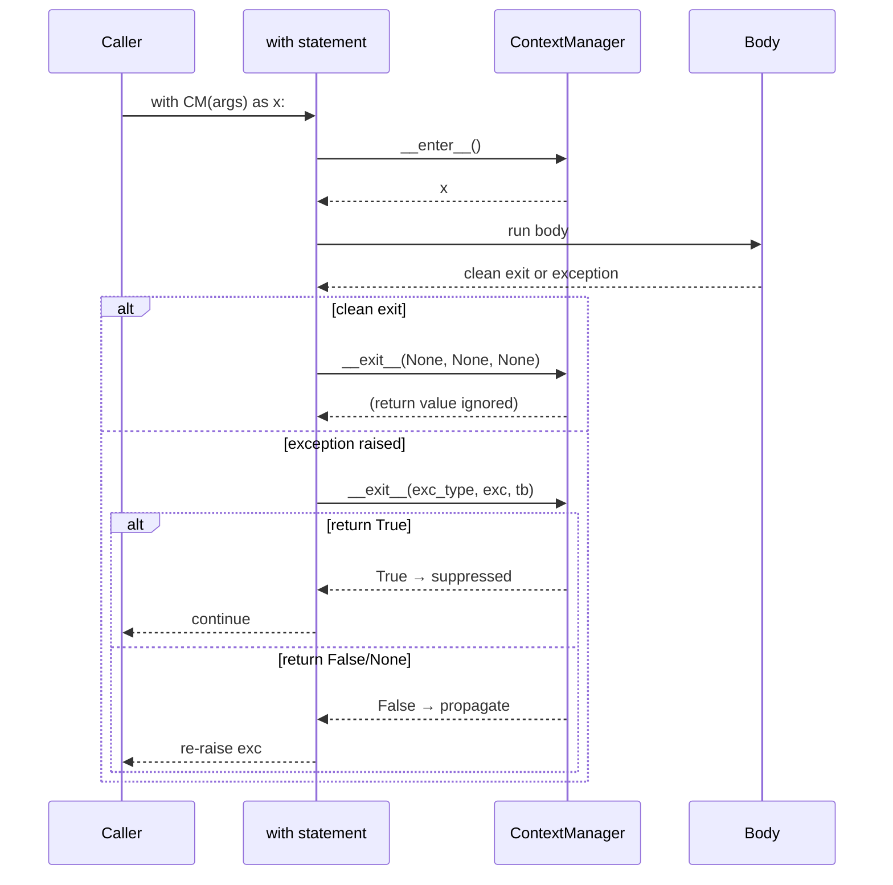
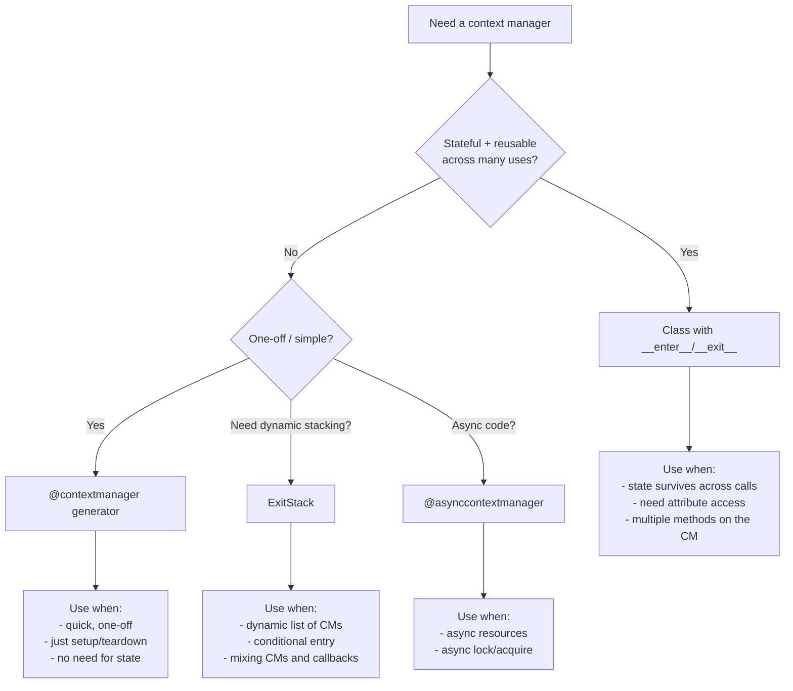
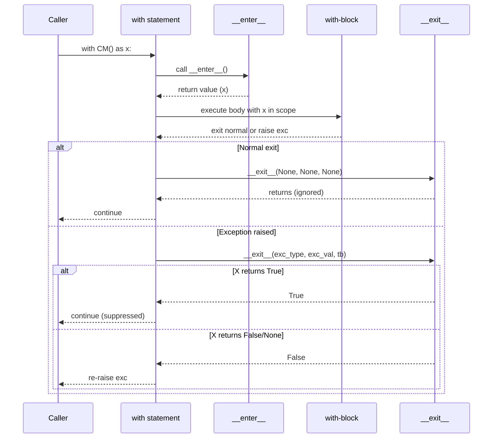

# 3. Context Managers

> [!note] Why this note exists
> A context manager guarantees that **setup** and **teardown** code both run, even when the block it wraps raises or returns early. The `with` statement is the user-facing syntax; the `__enter__` / `__exit__` protocol is the mechanism. This note goes past the basics covered in [[4. Context Managers]] of Chapter 5 (Error Handling): it covers implementing the protocol on a class, writing context managers as generator functions with `@contextlib.contextmanager`, stacking multiple managers, async context managers, and the powerful `contextlib` utilities — `suppress`, `redirect_stdout`, `redirect_stderr`, `ExitStack`, `AbstractContextManager`, `aclosing`, and `chdir` (Python 3.11+). Context managers are the Pythonic answer to RAII from C++ — predictable, deterministic, exception-safe resource management.

## Why It Matters

Without context managers, every resource acquisition needs a `try`/`finally`:

```python
f = open("data.txt")
try:
    process(f.read())
finally:
    f.close()
```

Multiply by every database cursor, network socket, lock acquisition, file handle, temporary directory, environment-variable override, redirect, timing context, and your code drowns in `finally` blocks. Worse, when a `finally` is forgotten, the resource leaks.

With a context manager, the boilerplate disappears:

```python
with open("data.txt") as f:
    process(f.read())
# f is guaranteed closed here, even if process() raised
```

The guarantee holds whether the block exits normally, raises an exception, or returns from a function. The context manager's `__exit__` always runs (modulo interpreter crash, `os._exit`, or power loss). This is the same guarantee C++ gives through destructors, expressed in Python's idiomatic form.

Beyond resource cleanup, context managers are a general-purpose **scoped side-effect** tool: temporarily redirect stdout, change the working directory, suppress specific exceptions, time a block, acquire a lock, run inside a transaction, switch a feature flag, or snapshot-then-restore global state.

## Background

A context manager is any object that implements:

- `__enter__(self)` — called when entering the `with` block. Returns the value bound by `as`. Often returns `self`.
- `__exit__(self, exc_type, exc_val, exc_tb)` — called when leaving the block. Receives the exception info if one was raised, or three `None` values if the block exited cleanly. Return a truthy value to **suppress** the exception; return a falsy value (or `None`) to propagate it.



The `with` statement itself is the syntactic sugar. `with cm as x: body` is roughly:

```python
manager = cm
x = manager.__enter__()
try:
    body
except Exception:
    if not manager.__exit__(*sys.exc_info()):
        raise
else:
    manager.__exit__(None, None, None)
```

## Implementing `__enter__` / `__exit__`

The most explicit form is a class:

```python
class OpenFile:
    def __init__(self, path, mode="r"):
        self.path = path
        self.mode = mode
        self.fh = None

    def __enter__(self):
        self.fh = open(self.path, self.mode)
        return self.fh

    def __exit__(self, exc_type, exc_val, exc_tb):
        if self.fh is not None:
            self.fh.close()
        # Return False (default None) → propagate any exception
        return False

with OpenFile("data.txt") as f:
    print(f.read())
```

To **suppress** a specific exception:

```python
class IgnoreKeyError:
    def __enter__(self):
        return self
    def __exit__(self, exc_type, exc_val, exc_tb):
        if exc_type is KeyError:
            print("swallowed KeyError:", exc_val)
            return True
        return False

with IgnoreKeyError():
    d = {}
    d["missing"]      # KeyError raised, swallowed by __exit__
print("still running")
```

> [!warning] Suppressing exceptions is dangerous
> Returning `True` from `__exit__` swallows the exception silently. Use it deliberately (e.g. `contextlib.suppress(FileNotFoundError)`) — never as a general "ignore errors" pattern.

## `contextlib.contextmanager` Decorator

Writing a class for every context manager is verbose. `contextlib.contextmanager` turns a generator function into a context manager:

```python
from contextlib import contextmanager

@contextmanager
def open_file(path, mode="r"):
    fh = open(path, mode)
    try:
        yield fh
    finally:
        fh.close()

with open_file("data.txt") as f:
    print(f.read())
```

The code **before** `yield` runs in `__enter__`. The `yield` value is bound by `as`. The code **after** `yield` runs in `__exit__`, inside a `finally`, so it always runs.

To suppress an exception, catch it explicitly:

```python
@contextmanager
def ignore_key_error():
    try:
        yield
    except KeyError as e:
        print("swallowed:", e)

with ignore_key_error():
    d = {}
    d["missing"]
```

If an exception is raised inside the `with` block, the generator is resumed at the `yield` point with that exception thrown. The `try`/`except` around the `yield` is how you intercept it.



## Multiple Context Managers

You can stack several `with` statements. The order matters: managers are entered left-to-right and exited right-to-left.

```python
with open("input.txt") as fin, open("output.txt", "w") as fout:
    for line in fin:
        fout.write(line.upper())
```

For more than two, the line gets long. Python 3.10+ allows parentheses to wrap:

```python
with (
    open("a.txt") as fa,
    open("b.txt") as fb,
    open("c.txt") as fc,
):
    ...
```

Before 3.10 you had to nest:

```python
with open("a.txt") as fa:
    with open("b.txt") as fb:
        with open("c.txt") as fc:
            ...
```

## `contextlib.ExitStack` — Dynamic Stacking

When the number of context managers is determined at runtime (e.g. opening all files in a directory), use `ExitStack`:

```python
from contextlib import ExitStack

files = ["a.txt", "b.txt", "c.txt"]
with ExitStack() as stack:
    handles = [stack.enter_context(open(f)) for f in files]
    # all files guaranteed closed on exit
    for fh in handles:
        print(fh.read())
```

`ExitStack` records every entered context manager and exits them all in reverse order when the outer `with` block ends. It also lets you register plain callbacks:

```python
with ExitStack() as stack:
    stack.callback(print, "cleanup step 1")
    stack.callback(print, "cleanup step 2")
    # ...
# prints "cleanup step 2" then "cleanup step 1" (LIFO)
```

`ExitStack` is the right tool when:
- The list of resources is dynamic.
- You want to compose callbacks and context managers uniformly.
- You want to defer "acquire" until inside a helper function but still guarantee cleanup.

## Async Context Managers (`async with`)

For async code (see asyncio), use `async with` with the `__aenter__` / `__aexit__` protocol:

```python
class AsyncDB:
    async def __aenter__(self):
        self.conn = await connect()
        return self.conn

    async def __aexit__(self, exc_type, exc, tb):
        await self.conn.close()

async def main():
    async with AsyncDB() as db:
        await db.query("SELECT 1")
```

`contextlib.asynccontextmanager` is the async counterpart of `@contextmanager`:

```python
from contextlib import asynccontextmanager

@asynccontextmanager
async def timed_async(label):
    start = time.perf_counter()
    try:
        yield
    finally:
        print(f"{label}: {time.perf_counter()-start:.3f}s")

async with timed_async("query"):
    await db.query(...)
```

You cannot mix sync and async context managers — `with` cannot drive an async CM, and `async with` cannot drive a sync one.

## `contextlib` Utilities

### `suppress(*exceptions)`

Ignore specific exceptions:

```python
from contextlib import suppress

with suppress(FileNotFoundError):
    os.remove("maybe_missing.tmp")
# equivalent to try/except FileNotFoundError: pass
```

### `redirect_stdout` / `redirect_stderr` / `redirect_stdin`

Temporarily redirect a stream to another file-like object:

```python
from contextlib import redirect_stdout
import io

buf = io.StringIO()
with redirect_stdout(buf):
    print("captured")
print("after:", buf.getvalue())   # after: captured\n
```

Great for testing CLI tools or capturing library output.

### `redirect_loguru`-style patterns

Combine `redirect_stdout` with `StringIO` to capture `print`-based output in tests:

```python
def test_greet():
    buf = io.StringIO()
    with redirect_stdout(buf):
        greet("Alice")
    assert "Hello, Alice" in buf.getvalue()
```

### `closing(thing)`

Call `thing.close()` on exit, even if `thing` doesn't implement the context-manager protocol:

```python
from contextlib import closing
from urllib.request import urlopen

with closing(urlopen("https://example.com")) as resp:
    data = resp.read()
```

### `aclosing(thing)` (3.10+)

Async counterpart of `closing` for async generators — calls `aclose()` on exit.

### `chdir(path)` (3.11+)

Temporarily change the working directory:

```python
from contextlib import chdir

with chdir("/tmp"):
    # cwd is /tmp here
    ...
# cwd restored
```

Before 3.11 you had to write this manually:

```python
@contextmanager
def chdir(path):
    old = Path.cwd()
    os.chdir(path)
    try:
        yield
    finally:
        os.chdir(old)
```

### `nullcontext(enter_result=None)`

A no-op context manager that yields `enter_result`. Useful as a stand-in for an optional context manager:

```python
cm = lock if needs_lock else nullcontext()
with cm:
    do_work()
```

### `AbstractContextManager` and `AbstractAsyncContextManager`

Base classes for typing your own context managers. Combine with `typing.Generic` for parameterised managers:

```python
from contextlib import AbstractContextManager
from typing import Generic, TypeVar

T = TypeVar("T")

class Pool(AbstractContextManager[T], Generic[T]):
    def __enter__(self) -> T: ...
    def __exit__(self, *exc): ...
```

## Mermaid: Context Manager Protocol



## Mermaid: Stacked Managers (LIFO Exit)


Exit runs in reverse order of entry — the innermost manager is notified first, the outermost last. This mirrors `try`/`finally` nesting and ensures the most recently acquired resource is released first.

## Real-World Patterns

### Database transactions

A transaction is the canonical context manager: begin on enter, commit on success, rollback on exception.

```python
@contextmanager
def transaction(conn):
    cur = conn.cursor()
    cur.execute("BEGIN")
    try:
        yield cur
        cur.execute("COMMIT")
    except Exception:
        cur.execute("ROLLBACK")
        raise
    finally:
        cur.close()

with transaction(conn) as cur:
    cur.execute("INSERT INTO users (name) VALUES (?)", ("Alice",))
    cur.execute("INSERT INTO audit (action) VALUES (?)", ("create_user",))
# commits if no exception; rolls back if either INSERT fails
```

Most real ORMs and database drivers ship their own transaction CMs (`psycopg2.connection`, SQLAlchemy `session.begin()`), but the pattern is the same.

### Timing and instrumentation

```python
import time, logging
from contextlib import contextmanager

@contextmanager
def timed(label: str, log=logging.info):
    start = time.perf_counter()
    try:
        yield
    finally:
        elapsed = time.perf_counter() - start
        log(f"{label}: {elapsed:.3f}s")

with timed("import_data"):
    data = load_csv("big.csv")
    normalise(data)
    persist(data)
```

The `finally` ensures the timing is logged even if `persist` raises.

### Environment overrides

```python
import os
from contextlib import contextmanager

@contextmanager
def env(**overrides):
    old = {k: os.environ.get(k) for k in overrides}
    os.environ.update({k: str(v) for k, v in overrides.items()})
    try:
        yield
    finally:
        for k, v in old.items():
            if v is None:
                os.environ.pop(k, None)
            else:
                os.environ[k] = v

with env(DATABASE_URL="postgres://test", DEBUG="1"):
    run_tests()
# original env restored
```

This is the right pattern for test fixtures that need to temporarily override environment variables.

### Temporary files and directories

`tempfile` ships CM versions of `TemporaryFile`, `NamedTemporaryFile`, and `TemporaryDirectory`:

```python
import tempfile

with tempfile.TemporaryDirectory() as tmpdir:
    # tmpdir exists; do work
    write_file(Path(tmpdir) / "out.txt", data)
# tmpdir is removed on exit, even on exception
```

### Locks

All `threading.Lock`, `RLock`, `Semaphore`, `Condition`, and `multiprocessing.Lock` objects are CMs:

```python
from threading import Lock

lock = Lock()
with lock:
    shared_resource.update()
# lock released on exit, even on exception
```

Never call `lock.acquire()` without a matching `release()` in a `finally`. The `with` form is safer and clearer.

### Testing with pytest fixtures

`pytest`'s `fixture` decorator builds CMs for setup/teardown:

```python
import pytest

@pytest.fixture
def db_connection():
    conn = connect()
    yield conn            # like @contextmanager: setup, yield, teardown
    conn.close()

def test_query(db_connection):
    assert db_connection.query("SELECT 1") == 1
```

The `yield` in a pytest fixture mirrors `@contextmanager` exactly.

## Mermaid: Choosing a Context Manager Style



## Mermaid: CM Lifecycle Inside the Interpreter



The interpreter itself manages this dance. The key invariant: `__exit__` always runs, regardless of how the block exits, as long as the interpreter stays alive (`os._exit` and segfaults aside).

## Common Pitfalls

### The static guarantee versus runtime reality

The `with` statement guarantees that `__exit__` runs — but only as long as the Python interpreter itself is alive. A few escape hatches bypass `__exit__`:

- `os._exit(status)` — terminates the process immediately without running `finally` blocks, `__exit__` methods, or `atexit` handlers. Used in forked children to avoid corrupting parent state.
- `os.fork()` followed by `_exit` in the child — same caveat.
- Segfaults, `SIGKILL`, or power loss — no cleanup is possible.
- `multiprocessing.Process.terminate()` sends `SIGTERM`, which Python converts to an exception in the target — `__exit__` may or may not run depending on signal handling.

For critical cleanup (database transactions, file flushes), don't rely solely on `__exit__`. Use explicit commit/rollback at the end of the block, plus `__exit__` as the safety net.

1. **Returning a truthy value accidentally from `__exit__`.** `return True` suppresses the exception. Always `return False` (or `None`) unless you intend to swallow.

2. **Forgetting `try`/`finally` around `yield` in `@contextmanager`.** If the cleanup code is outside a `try`, an exception in the `with` block won't trigger it. The pattern below shows the bug and the fix:
   ```python
   @contextmanager
   def bad():
       f = open(...)
       yield f
       f.close()         # NOT called if exception raised in block

   @contextmanager
   def good():
       f = open(...)
       try:
           yield f
       finally:
           f.close()     # Always runs
   ```
   Without the `try`/`finally`, the file handle leaks on any exception. The generator-based CM relies on the `try`/`finally` to translate "block exits cleanly or with exception" into "cleanup runs always".

3. **Yielding `None` and using `as`.** `@contextmanager` functions that don't yield a value bind `None`. If the user expects something, yield it explicitly.

4. **Mixing sync and async CMs.** `with` cannot enter an async CM, and `async with` cannot enter a sync one. Use the matching form.

5. **Relying on `__del__` for cleanup.** `__del__` is non-deterministic; `__exit__` is. Don't substitute one for the other.

6. **Re-entering a closed CM.** A context manager object that has been used once may not be reusable — `__enter__` may have consumed state. Read the docs; some CMs are reusable, some aren't.

7. **Nested `with` exits in the wrong order.** Stack exits run inside-out. If you need outermost cleanup first, restructure or use a single `ExitStack`.

8. **Suppression too broad.** `with suppress(Exception):` swallows everything including `KeyboardInterrupt` and `SystemExit` (which inherit from `BaseException`, not `Exception`, so this particular case is actually safe — but `with suppress(BaseException):` is not).

9. **Forgetting to release locks.** Locks are CMs (`with lock: ...`); acquiring without `with` and forgetting to release deadlocks.

10. **Exceptions inside `__exit__`.** If `__exit__` itself raises, the original exception is lost. Keep `__exit__` minimal and defensive.

11. **Not using `ExitStack` when the count is dynamic.** Nesting arbitrary numbers of `with` statements by hand is brittle. `ExitStack` is the right tool.

12. **Confusing `suppress` with swallowing all errors.** `suppress(FileNotFoundError)` is precise; a bare `except: pass` is a bug magnet. Prefer the explicit form.

## Tips and Tricks

- **Prefer `@contextmanager` over class-based CMs** for one-off cases — terser, easier to read.
- **Use `ExitStack` whenever the list of CMs is dynamic** — files from a glob, locks from a registry, etc.
- **`suppress` is the right replacement for `try/except: pass`.** It's explicit about which exceptions are ignored.
- **Combine CMs in tests:** `with ExitStack() as st:` lets you build up CMs conditionally inside test fixtures.
- **Time blocks with a CM** to keep timing code out of business logic:
   ```python
   @contextmanager
   def timed(label):
       t0 = time.perf_counter()
       try:
           yield
       finally:
           print(f"{label}: {time.perf_counter()-t0:.3f}s")
   ```
- **Use `nullcontext` for optional resources** in tests or feature-flagged code paths.
- **`chdir` (3.11+) is far safer than `os.chdir` + manual restore** — the restore always runs.
- **`@asynccontextmanager` mirrors `@contextmanager`** for async code. The patterns are identical, just with `await` and `async with`.
- **CMs compose** — write small ones and stack them. Don't write one mega-CM that does five things.
- **Type your CMs**: `def __enter__(self) -> Resource: ...` and `def __exit__(self, *exc) -> bool: ...`. See [[1. Basic Type Hints]] and [[2. Generics and TypeVar]].

## Active Recall

1. What two dunder methods implement the context manager protocol?
2. What does `__exit__` return to suppress an exception?
3. Write a class-based context manager that prints "entering" and "exiting".
4. Convert it to a generator-based CM using `@contextmanager`.
5. Why must the cleanup code go in a `try`/`finally` around the `yield`?
6. Write a CM that suppresses only `FileNotFoundError`.
7. What does `ExitStack` do that nested `with` cannot?
8. How do you enter 100 context managers whose list is computed at runtime?
9. What is the exit order for stacked context managers?
10. Write an async context manager that acquires and releases an async lock.
11. What is `nullcontext` for?
12. What does `contextlib.closing` do, and when would you use it?
13. Convert this `try`/`finally` to a `with`:
    ```python
    f = open("x")
    try: process(f)
    finally: f.close()
    ```
14. How does `redirect_stdout` work? Write a test that captures `print` output.
15. What goes wrong if `__exit__` returns `True` by accident?
16. When should you use `AbstractContextManager` as a base class?
17. What is `aclosing` for, and what's its sync counterpart?
18. Use `ExitStack.callback` to register two cleanup functions and verify they run in reverse order.
19. Why is `chdir` (3.11+) safer than `os.chdir` followed by manual restore?
20. Can a sync `with` enter an async context manager? Why or why not?

## Next Steps

- [[4. Context Managers]] (Chapter 5) — the foundational treatment of `with` for error handling. Read this if you haven't.
- [[4. Decorators Deep Dive]] — `@contextmanager` is itself a decorator; the two concepts are deeply intertwined.
- [[2. Generators and Iterators]] — `@contextmanager` is built on generator-based pausing at `yield`.
- [[7. EAFP and Duck Typing]] — `try`/`except` patterns and `suppress` belong to the EAFP style.
- [[1. Basic Type Hints]] and [[2. Generics and TypeVar]] — typing `__enter__`/`__exit__` for generic context managers.
