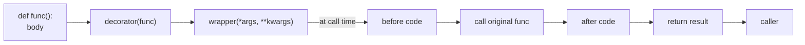
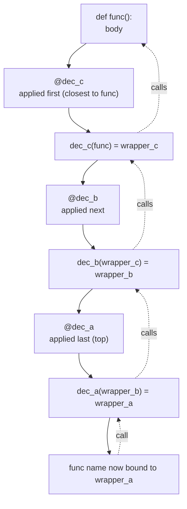
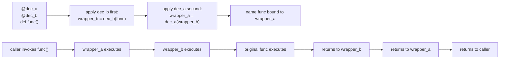
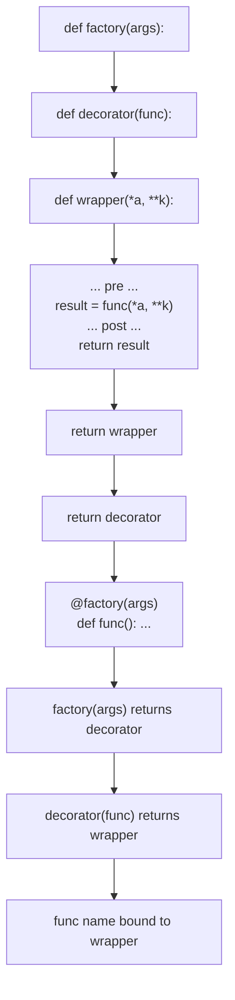
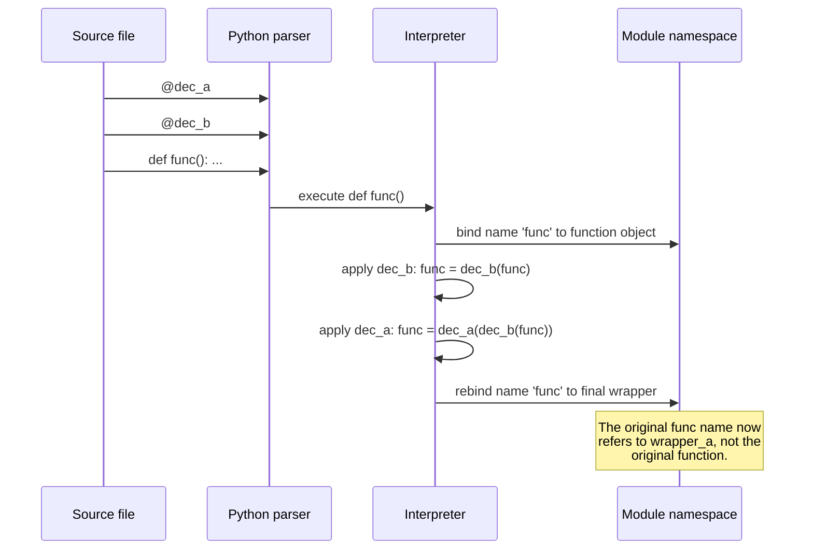

# 4. Decorators Deep Dive

> [!note] Why this note exists
> The basics of decorators — what they are, how to use them, `functools.wraps`, and a few common patterns — are covered in [[7. Decorators]] of Chapter 3 (Functions). This note goes deeper: **decorator factories** (decorators that take arguments), **class-based decorators**, **stacked decorators** and their evaluation order, the **practical patterns** every Python developer should recognise (timing, logging, caching, retry, validation, registration), debugging decorators that hide the original function, `ParamSpec` for type-preserving wrappers, and the gotchas around `functools.wraps`, `__wrapped__`, and introspection. Decorators are Python's most-used metaprogramming tool; mastering them unlocks frameworks like FastAPI, pytest, Flask, dataclasses, attrs, and Pydantic.

## Why It Matters

Decorators let you cross-cut concerns — logging, timing, caching, retry, auth, validation, routing, transaction management — without touching the body of the function they wrap. A web framework's `@app.get("/users")` doesn't change what your handler does; it **registers** the handler with the router. A test framework's `@pytest.fixture` doesn't change the function; it **marks** it as a fixture. A caching layer's `@lru_cache(maxsize=128)` doesn't change the function; it **wraps** it with a memoisation layer.

The mechanism is uniform: a decorator is a callable that takes a callable and returns a callable. The `@decorator` syntax is sugar for `name = decorator(name)`. Once you internalise that, every decorator pattern becomes a variation on the same theme.

But decorators have subtleties:
- Decorator factories require **three** levels of nesting (factory → decorator → wrapper).
- Stacked decorators apply **bottom-up** but appear **top-down** in source.
- Class-based decorators can intercept attribute access, not just calls.
- Without `functools.wraps`, the wrapped function loses its name, docstring, signature, and annotations.
- Type-preserving wrappers need `ParamSpec` and `TypeVar` (PEP 612) — without them, mypy and pyright give up.

This note covers all of that, plus the patterns you'll see in production code.

## Background

A **decorator** is a callable that takes a callable and returns a callable (usually wrapping the original). The `@` syntax:

```python
@decorator
def func():
    ...
```

is exactly equivalent to:

```python
def func():
    ...
func = decorator(func)
```

The decorator is applied at **definition time** — when the `def` runs — not at call time. The original `func` name is rebound to whatever `decorator` returns.

A **class decorator** is the same idea applied to a class:

```python
@dataclass
class Point:
    x: int
    y: int
```

is equivalent to:

```python
class Point:
    x: int
    y: int
Point = dataclass(Point)
```

See [[7. Decorators]] in Chapter 3 for the foundational mechanics, `functools.wraps`, and simple decorator examples.



## Decorator Factories

A decorator factory is a function that **returns** a decorator. It lets the decorator take arguments:

```python
def repeat(times):
    def decorator(func):
        @functools.wraps(func)
        def wrapper(*args, **kwargs):
            result = None
            for _ in range(times):
                result = func(*args, **kwargs)
            return result
        return wrapper
    return decorator

@repeat(3)
def greet(name):
    print(f"Hello, {name}")

greet("Alice")
# Hello, Alice
# Hello, Alice
# Hello, Alice
```

Read it carefully: `repeat(3)` returns `decorator`, which is then applied to `greet` to produce `wrapper`. The `times` argument is captured by the closure.

The three-level structure is:

```python
def factory(args):           # called with @factory(args)
    def decorator(func):     # called with func as argument
        def wrapper(*a, **k): # the actual replacement
            ...
        return wrapper
    return decorator
```

Common factory-decorator patterns:
- `@app.route("/users")` (Flask) — registers a route handler.
- `@lru_cache(maxsize=128)` — caches results.
- `@retry(times=3, delay=1.0)` — retries on failure.
- `@validate(schema)` — validates arguments against a schema.

## Class-Based Decorators

A class can be a decorator if it implements `__call__` and accepts the wrapped function in `__init__`:

```python
class CountCalls:
    def __init__(self, func):
        self.func = func
        self.count = 0
        functools.update_wrapper(self, func)

    def __call__(self, *args, **kwargs):
        self.count += 1
        print(f"call #{self.count} to {self.func.__name__}")
        return self.func(*args, **kwargs)

@CountCalls
def say_hi():
    print("hi")

say_hi(); say_hi(); say_hi()
# call #1 to say_hi / hi
# call #2 to say_hi / hi
# call #3 to say_hi / hi
```

Class-based decorators are useful when you need to maintain state across calls (the `self.count` above) or expose additional attributes on the decorated object.

A class-based **factory** decorator combines a factory function with a class:

```python
class Retry:
    def __init__(self, times):
        self.times = times

    def __call__(self, func):
        @functools.wraps(func)
        def wrapper(*args, **kwargs):
            last_exc = None
            for _ in range(self.times):
                try:
                    return func(*args, **kwargs)
                except Exception as e:
                    last_exc = e
            raise last_exc
        return wrapper

@Retry(times=3)
def flaky():
    ...
```

## Stacked Decorators

Multiple decorators stack. They apply **bottom-up** (closest to the function first), so reading source top-to-bottom is like reading nested calls inside-out:

```python
@dec_a
@dec_b
@dec_c
def func():
    ...
```

is equivalent to:

```python
func = dec_a(dec_b(dec_c(func)))
```

At call time, `dec_a`'s wrapper runs first, then `dec_b`'s, then `dec_c`'s, then the original.



> [!tip] Reading stacked decorators
> Read stacked decorators **bottom-up** to see the application order. Read them **top-down** to see the call order at runtime.

## `functools.wraps` and Metadata Preservation

When a decorator returns `wrapper`, the wrapper has its own `__name__`, `__doc__`, `__module__`, `__qualname__`, `__annotations__`, and `__dict__`. This breaks `help()`, IDE tooltips, introspection, and debugging.

`functools.wraps(func)` is itself a decorator that copies these attributes from `func` to `wrapper`:

```python
import functools

def my_decorator(func):
    @functools.wraps(func)
    def wrapper(*args, **kwargs):
        return func(*args, **kwargs)
    return wrapper

@my_decorator
def greet(name):
    """Greet someone."""
    return f"Hello, {name}"

print(greet.__name__)   # greet      (not wrapper)
print(greet.__doc__)    # Greet someone.
```

`functools.wraps` also sets `wrapper.__wrapped__ = func`, which lets `inspect.signature` follow the chain to the original signature. Without it, `inspect.signature(greet)` would show `(*args, **kwargs)`.

## Common Decorator Patterns

### Timing

```python
import time, functools

def timed(func):
    @functools.wraps(func)
    def wrapper(*args, **kwargs):
        t0 = time.perf_counter()
        try:
            return func(*args, **kwargs)
        finally:
            print(f"{func.__name__}: {time.perf_counter()-t0:.3f}s")
    return wrapper
```

### Logging

```python
import logging, functools

def logged(level=logging.INFO):
    def decorator(func):
        @functools.wraps(func)
        def wrapper(*args, **kwargs):
            logging.log(level, f"→ {func.__name__}({args}, {kwargs})")
            try:
                result = func(*args, **kwargs)
                logging.log(level, f"← {func.__name__} = {result!r}")
                return result
            except Exception:
                logging.exception(f"{func.__name__} raised")
                raise
        return wrapper
    return decorator
```

### Caching

`functools.lru_cache` and `functools.cache` are built-in. To roll your own:

```python
def memoize(func):
    cache = {}
    @functools.wraps(func)
    def wrapper(*args):
        if args not in cache:
            cache[args] = func(*args)
        return cache[args]
    return wrapper
```

But just use `@functools.lru_cache(maxsize=128)` or `@functools.cache` — they're battle-tested.

### Retry

```python
import time, functools

def retry(times=3, delay=0.1, exceptions=(Exception,)):
    def decorator(func):
        @functools.wraps(func)
        def wrapper(*args, **kwargs):
            last_exc = None
            for attempt in range(times):
                try:
                    return func(*args, **kwargs)
                except exceptions as e:
                    last_exc = e
                    time.sleep(delay * (2 ** attempt))   # exponential backoff
            raise last_exc
        return wrapper
    return decorator

@retry(times=5, delay=0.5, exceptions=(ConnectionError, TimeoutError))
def fetch(url):
    ...
```

### Validation

```python
def validate_args(*validators):
    def decorator(func):
        @functools.wraps(func)
        def wrapper(*args, **kwargs):
            for val, validator in zip(args, validators):
                if not validator(val):
                    raise ValueError(f"invalid arg: {val!r}")
            return func(*args, **kwargs)
        return wrapper
    return decorator

@validate_args(lambda x: x > 0, lambda y: isinstance(y, str))
def process(amount, label):
    ...
```

### Registration

A common pattern for plugin systems and route handlers:

```python
handlers = {}

def register(name):
    def decorator(func):
        handlers[name] = func
        return func            # note: returns func unchanged!
    return decorator

@register("greet")
def greet(name):
    print(f"Hello, {name}")

@register("bye")
def bye(name):
    print(f"Bye, {name}")
```

Note: registration decorators typically **return the original function unchanged**, not a wrapper. Their purpose is to mutate external state at definition time.

## Mermaid: Decorator Stacking Order



## Mermaid: Decorator Factory Anatomy



## Type-Preserving Decorators with `ParamSpec`

A simple decorator's wrapper has the signature `(*args, **kwargs)`, which throws away the wrapped function's argument types. mypy and pyright will refuse to type-check calls through the wrapper.

`ParamSpec` (PEP 612, Python 3.10+) captures the full parameter list:

```python
from typing import ParamSpec, TypeVar, Callable
import functools

P = ParamSpec("P")
R = TypeVar("R")

def log_calls(func: Callable[P, R]) -> Callable[P, R]:
    @functools.wraps(func)
    def wrapper(*args: P.args, **kwargs: P.kwargs) -> R:
        print(f"calling {func.__name__}")
        return func(*args, **kwargs)
    return wrapper

@log_calls
def add(a: int, b: int) -> int:
    return a + b

add(1, 2)        # OK
add("x", 2)      # type error: argument 1 must be int
```

Without `ParamSpec`, the wrapper would be typed as `Callable[..., R]` and the call `add("x", 2)` would type-check successfully even though it's wrong.

See [[2. Generics and TypeVar]] for `TypeVar` and [[9. typing]] (Standard Library) for the broader typing module.

## Debugging Decorators

Decorators hide the original function. Common debugging problems:

1. **`help(func)` shows wrapper's docstring.** Fix with `functools.wraps`.
2. **`inspect.signature(func)` shows `(*args, **kwargs)`.** `functools.wraps` sets `__wrapped__`; `inspect.signature` follows it. If you used `update_wrapper` manually or skipped it, the signature is lost.
3. **Tracebacks show `wrapper` instead of `func`.** Use `functools.wraps` (it copies `__qualname__`). For deeper debugging, `__wrapped__` lets tools unwrap.
4. **Breakpoints inside the wrapper fire on every call.** That's usually what you want; if not, check your decorator logic.
5. **Stacked decorators hide which one raised.** Use `traceback.print_exc()` and inspect `__wrapped__` chain to find the source.

A useful debugging helper:

```python
def unwrap_to_original(func):
    while hasattr(func, "__wrapped__"):
        func = func.__wrapped__
    return func
```

## Real-World Decorator Catalogue

Beyond the patterns above, here are decorators you'll encounter in real codebases.

### Built-in decorators

| Decorator | Purpose |
| --- | --- |
| `@property` | Define a getter; pairs with `@x.setter` and `@x.deleter` |
| `@staticmethod` | Method without `self` |
| `@classmethod` | Method receiving the class as first arg |
| `@abstractmethod` (abc) | Force subclasses to implement |
| `@dataclass` | Auto-generate `__init__`, `__repr__`, `__eq__` |
| `@functools.lru_cache(maxsize=128)` | Memoise function results |
| `@functools.cache` | Unbounded memoisation (3.9+) |
| `@functools.cached_property` | Compute-once property |
| `@functools.wraps(func)` | Copy metadata when defining a wrapper |
| `@functools.singledispatch` | Type-based function dispatch |
| `@functools.total_ordering` | Fill in missing comparison methods |
| `@contextlib.contextmanager` | Turn a generator into a context manager |
| `@contextlib.asynccontextmanager` | Async version |
| `@atexit.register` | Run function at interpreter exit |
| `@final` (typing) | Forbid subclassing / override |
| `@override` (typing, 3.12+) | Declare method as overriding a base |
| `@overload` (typing) | Multiple signatures for one implementation |

### Framework decorators

- **Flask / FastAPI**: `@app.route`, `@app.get`, `@app.post` — register route handlers.
- **Django**: `@login_required`, `@permission_required`, `@csrf_exempt`.
- **pytest**: `@pytest.fixture`, `@pytest.mark.parametrize`, `@pytest.mark.skip`.
- **SQLAlchemy**: `@hybrid_property`, `@event.listens_for`.
- **Pydantic**: `@field_validator`, `@model_validator`, `@computed_field`.
- **attrs / dataclasses**: `@define`, `@dataclass`.
- **Celery**: `@app.task` — register a function as an async task.

### Custom patterns you'll write

- **`@deprecated("use new_func instead")`** — emit a `DeprecationWarning` on call.
- **`@rate_limit(calls=10, period=60)`** — enforce API rate limits.
- **`@cache_key("user:{user_id}")`** — annotate functions for cache key generation.
- **`@metric("api.request")`** — instrument functions for Prometheus.
- **`@transactional`** — wrap a function in a DB transaction.
- **`@retry(times=3)`** — auto-retry on failure.
- **`@ authorised`** — check user permissions before running.

### Deprecation warning decorator

```python
import warnings, functools

def deprecated(message: str = ""):
    def decorator(func):
        @functools.wraps(func)
        def wrapper(*args, **kwargs):
            warnings.warn(
                f"{func.__name__} is deprecated. {message}",
                DeprecationWarning,
                stacklevel=2,
            )
            return func(*args, **kwargs)
        return wrapper
    return decorator

@deprecated("use new_endpoint() instead")
def old_endpoint():
    return "old response"
```

### Rate limiter

```python
import time, functools
from collections import deque

def rate_limit(calls: int, period: float):
    def decorator(func):
        history: deque = deque()
        @functools.wraps(func)
        def wrapper(*args, **kwargs):
            now = time.monotonic()
            while history and history[0] < now - period:
                history.popleft()
            if len(history) >= calls:
                raise RuntimeError("rate limit exceeded")
            history.append(now)
            return func(*args, **kwargs)
        return wrapper
    return decorator

@rate_limit(calls=10, period=60)
def api_call():
    ...
```

## Mermaid: Decorator Resolution at Definition Time



The decorators run **once**, at definition time, in source order bottom-up. After module import, `func` is the final wrapper; the original is reachable only via `__wrapped__` (if `functools.wraps` was used).

## Common Pitfalls

### The hidden cost of forgetting `functools.wraps`

A surprising number of production bugs trace back to decorators that skip `@functools.wraps`. The wrapper replaces the original function in the module namespace, so every introspection tool sees the wrapper's metadata: `__name__` is `"wrapper"`, `__doc__` is `None`, `inspect.signature` shows `(*args, **kwargs)`. IDE tooltips stop working. pytest's fixture discovery fails. Documentation generators produce wrong output. Debugging tracebacks show `wrapper` instead of the real function name. Always use `@functools.wraps(func)` on the innermost wrapper — make it a reflex.

1. **Forgetting `@functools.wraps`.** The wrapper replaces the original; without `wraps`, `__name__`, `__doc__`, `__annotations__`, and `inspect.signature` are all wrong.

2. **Returning `None` from the wrapper.** If you forget `return func(*args, **kwargs)`, the decorated function silently returns `None`.

3. **Stacked decorator order confusion.** `@a\n@b\ndef f()` is `a(b(f))`. At call time, `a`'s wrapper runs first.

4. **Class-based decorators not preserving metadata.** Use `functools.update_wrapper(self, func)` in `__init__` (the class-based equivalent of `@functools.wraps`).

5. **Decorator side effects at import time.** A `@register("name")` decorator mutates a global registry when the module is imported. If two modules each register a handler with the same name, the later import wins — silently.

6. **Decorators that don't return the function.** A registration decorator that forgets `return func` replaces the function with `None` — every call fails.

7. **Mutable default arguments in decorator factories.** `def factory(items=[]):` is the classic Python footgun, even inside a decorator factory.

8. **Losing the signature with a class decorator.** `__call__` accepts `*args, **kwargs`; `inspect.signature` can't recover the original. Apply `functools.update_wrapper` in `__init__`.

9. **Closures over loop variables.** If you build decorators in a loop, all of them capture the same loop variable. Use a default-argument trick or `functools.partial` to bind it.

10. **Decorators that aren't picklable.** Lambdas and local closures can't be pickled. If your decorated function must be picklable (multiprocessing, distributed frameworks), keep the wrapper at module level.

11. **Re-decorating on hot reload.** Reloading a module re-runs the decorators, which can double-register handlers. Use a set or check for duplicates.

12. **Type-checkers complaining about decorators.** Plain `Callable` wrappers lose the original signature. Use `ParamSpec`/`TypeVar` to preserve it.

## Tips and Tricks

- **Always use `@functools.wraps(func)`** on the innermost wrapper. Make this a reflex.
- **Prefer `@lru_cache` over hand-rolled memoisation** unless you need custom eviction logic.
- **Use class-based decorators for stateful cross-cutting concerns** (counters, rate limiters, circuit breakers). Use function-based for stateless transformations.
- **`@contextlib.contextmanager`** is the cheapest way to write a context manager; it's also a great example of a decorator that uses generator semantics.
- **Keep decorators small and composable.** A `@timed` decorator, a `@logged` decorator, and a `@cached` decorator compose better than one mega-decorator that does all three.
- **Use `inspect.signature` in tests** to verify your decorator preserves the wrapped signature.
- **`__wrapped__` chain** lets tools (pytest, hypothesis, FastAPI) introspect the original. Don't manually delete it.
- **For async functions, write `async def wrapper`.** Sync decorators applied to async functions break in subtle ways.
- **Decorator factories can take keyword-only arguments** to make call sites self-documenting: `@retry(times=3, delay=1.0)`.
- **Use `ParamSpec`** for any decorator meant to wrap arbitrary callables while preserving types.

## Active Recall

1. What is `@decorator` syntactic sugar for?
2. Write a decorator `@shout` that uppercases the string returned by the wrapped function.
3. Convert `@shout` into a decorator factory `@uppercase(mode)` where `mode` is "upper" or "lower".
4. Why is `functools.wraps` necessary? What does it copy?
5. What is the application order of `@a\n@b\ndef f()`? What is the call order at runtime?
6. Write a class-based decorator `CountCalls` that tracks how many times the wrapped function is called.
7. What is `__wrapped__`, and which tools use it?
8. Use `ParamSpec` to write a type-preserving `@log_calls` decorator.
9. Write a `@retry(times=3, exceptions=(ConnectionError,))` decorator with exponential backoff.
10. What goes wrong if a registration decorator forgets `return func`?
11. Write a `@validate(positive, non_empty_str)` decorator that validates positional arguments.
12. How do you debug a decorated function whose `__name__` shows `wrapper`?
13. Convert a class decorator into a class-based factory decorator that takes arguments.
14. Why is `inspect.signature` returning `(*args, **kwargs)` a problem, and how do you fix it?
15. What is the difference between `@lru_cache()` (with parens) and `@lru_cache` (without)?
16. How do stacked decorators interact with exceptions raised by the inner function?
17. Write a decorator that works for both sync and async functions.
18. What is `functools.update_wrapper`, and when do you use it directly?
19. Why must decorators applied to async functions be `async def wrapper` themselves?
20. Describe three real-world frameworks that rely heavily on decorators and what each decorator does.

## Next Steps

- [[7. Decorators]] (Chapter 3) — the foundational treatment of decorators, `functools.wraps`, and basic patterns.
- [[5. Closures]] — decorators are closures over the wrapped function and any factory arguments.
- [[6. Higher Order Functions]] — decorators are higher-order functions; this note is the natural extension.
- [[3. Context Managers]] — `@contextmanager` is one of the most-used decorator-driven patterns.
- [[2. Generics and TypeVar]] — `ParamSpec` and `TypeVar` are how you make decorators type-safe.
- [[4. Decorators Deep Dive]] — this note; revisit after reading [[5. Closures]] to see how closure capture explains decorator semantics.
