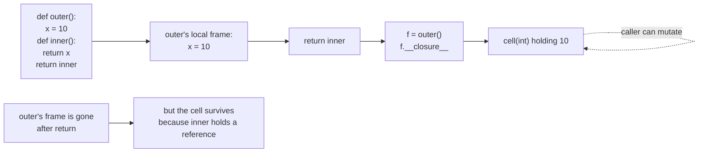
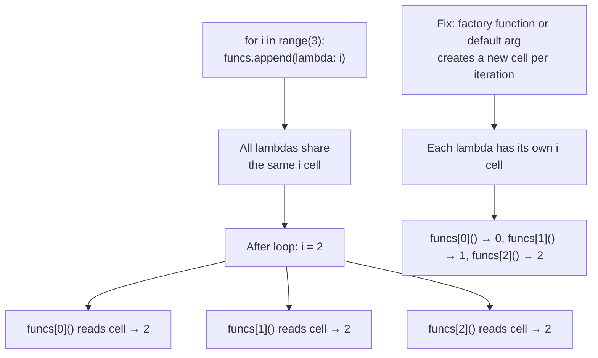
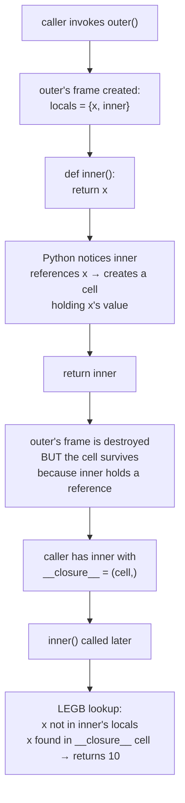
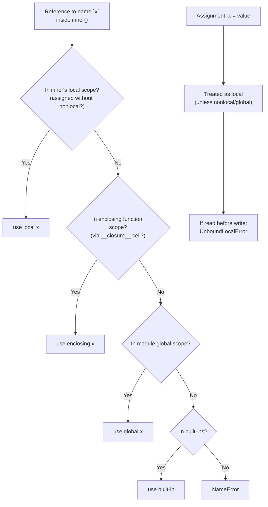

# 5. Closures

> [!note] Why this note exists
> A closure is a function that **remembers** the variables of the enclosing scope in which it was defined, even after that scope has finished executing. Closures are not a Python-specific idea — they appear in JavaScript, Scheme, Haskell, Rust, Go, and most modern languages — but Python's flavour has its own quirks: `__closure__` cells, the LEGB lookup rule, `nonlocal` for writing to enclosing variables, late-binding bugs in lambdas, and accidental sharing of mutable state. Understanding closures is the prerequisite for understanding decorators (see [[4. Decorators Deep Dive]]), partial application, callbacks, function factories, and most metaprogramming patterns. This note covers the definition, the `__closure__` attribute, free variables, when closures are useful, and the common pitfalls.

## Why It Matters

Without closures, every callback would need to be a class. Every decorator would need an object. Every function factory would need a `MakeAdder` class with `__init__` and `__call__`. Closures collapse all of that into a few lines:

```python
def make_adder(n):
    def adder(x):
        return x + n
    return adder

add5 = make_adder(5)
add10 = make_adder(10)
add5(3)    # 8
add10(3)   # 13
```

`make_adder` returns a function that remembers `n`. Each call to `make_adder` creates a new closure with its own `n`. There's no class, no `__init__`, no shared state — just a function that captured its environment.

Closures are the mechanism behind:

- **Decorators** — the wrapper closes over the wrapped function (see [[4. Decorators Deep Dive]]).
- **`functools.partial`** — partial application is a closure over the pre-supplied arguments.
- **Callbacks** — event handlers close over the data they need.
- **Function factories** — `make_*` functions produce customised functions.
- **Stateful generators** — generator functions close over their internal state.
- **Encapsulation without classes** — closures can hide private state more strictly than `__private` attributes.

The flip side: closures have subtle pitfalls. The classic **late-binding-in-lambda** bug bites every Python developer once. Mutable closure state can be shared accidentally. The distinction between `nonlocal`, `global`, and ordinary assignment is fuzzy until you've debugged an `UnboundLocalError` caused by an assignment in a nested function.

## Background

Python's scope rule is **LEGB** (Local, Enclosing, Global, Built-in):

1. **L — Local**: names assigned inside the current function.
2. **E — Enclosing**: names in enclosing function definitions (only for nested functions).
3. **G — Global**: module-level names.
4. **B — Built-in**: `len`, `print`, `int`, `True`, etc.

When you reference a name, Python searches L → E → G → B and uses the first match. When you **assign** to a name (`x = ...`), Python treats it as local to the current function (unless `global` or `nonlocal` is declared).

A **closure** is created when:

1. You define a function nested inside another function.
2. The inner function references a variable from the enclosing function.
3. The enclosing function returns the inner function (or passes it somewhere).

The inner function is then a **closure** — it carries a reference to the enclosing variable even after the enclosing function has returned.

```python
def outer():
    captured = "I am captured"
    def inner():
        return captured
    return inner

f = outer()
print(f())   # I am captured
```

`outer` has returned. Its local frame is gone. But `inner` still has access to `captured` — because `captured` lives in a **closure cell** that `inner` references.

## Free Variables

A **free variable** is a name used inside a function but not defined there. Python resolves free variables via the enclosing scope at the time the inner function is **defined**, not when it's called.

```python
def make_counter():
    count = 0
    def step():
        nonlocal count
        count += 1
        return count
    return step

c = make_counter()
c(); c(); c()    # 1, 2, 3
```

Without `nonlocal count`, the assignment `count += 1` would create a local `count` and raise `UnboundLocalError` (because you're reading `count` before assigning it).

Inspect free variables at runtime:

```python
def outer():
    x = 10
    y = 20
    def inner():
        return x + y       # x and y are free
    return inner

f = outer()
print(f.__code__.co_freevars)   # ('x', 'y')
print(f.__closure__)            # (<cell at 0x... int>, <cell at 0x... int>)
print(f.__closure__[0].cell_contents)   # 10
```

`__closure__` is a tuple of `cell` objects. Each cell holds the current value of one free variable. Reading `cell_contents` gives you the live value — modifying it changes what the closure sees.



## The `__closure__` Attribute

Every function object has a `__closure__` attribute. For a non-closure function it's `None`. For a closure it's a tuple of cell objects, one per free variable, in the order of `co_freevars`.

```python
def outer():
    a, b, c = 1, 2, 3
    def inner():
        return a + b + c
    return inner

f = outer()
print(f.__code__.co_freevars)   # ('a', 'b', 'c')
print(f.__closure__)            # (<cell ...>, <cell ...>, <cell ...>)
for name, cell in zip(f.__code__.co_freevars, f.__closure__):
    print(name, cell.cell_contents)
# a 1
# b 2
# c 3
```

You can mutate closure cells from outside (though it's a hack):

```python
f.__closure__[0].cell_contents = 99
# Now `a` inside the closure reads as 99.
```

This is occasionally useful for testing or hot-patching, but breaks encapsulation. Don't do it in production code.

## `nonlocal` vs `global`

- `nonlocal x` — `x` lives in an enclosing function's scope. Python searches enclosing scopes (not global, not built-in) for an existing `x` to bind. If none exists, `SyntaxError`.
- `global x` — `x` lives at module level. The assignment writes to the module's namespace.

```python
x = "module"

def outer():
    x = "enclosing"
    def reader():
        return x            # reads enclosing x
    def writer_nonlocal():
        nonlocal x
        x = "modified by nonlocal"
    def writer_global():
        global x
        x = "modified by global"
    return reader, writer_nonlocal, writer_global

r, wn, wg = outer()
print(r())    # enclosing
wn()
print(r())    # modified by nonlocal
wg()
print(x)      # modified by global (module-level x changed)
```

> [!warning] `nonlocal` requires the variable to exist
> `nonlocal x` raises `SyntaxError` at compile time if no enclosing function defines `x`. `global x` never does — it just creates the binding on first assignment.

## When Closures Are Useful

### Decorators

The wrapper inside a decorator closes over the wrapped function:

```python
def log_calls(func):
    def wrapper(*args, **kwargs):
        print(f"calling {func.__name__}")
        return func(*args, **kwargs)
    return wrapper
```

`wrapper` closes over `func`. See [[4. Decorators Deep Dive]].

### Function factories

```python
def make_multiplier(factor):
    def multiply(x):
        return x * factor
    return multiply

double = make_multiplier(2)
triple = make_multiplier(3)
```

Each call to `make_multiplier` creates a fresh closure with its own `factor`.

### Partial application

`functools.partial` is a closure (technically a C-implemented callable, but conceptually identical) that fixes some arguments of a function:

```python
from functools import partial

def power(base, exponent):
    return base ** exponent

square = partial(power, exponent=2)
cube = partial(power, exponent=3)
square(5)    # 25
cube(5)      # 125
```

See [[6. Higher Order Functions]] for the broader context.

### Callbacks

```python
def on_click(button_id):
    def handler(event):
        print(f"Button {button_id} clicked at {event.x},{event.y}")
    return handler

button1.bind("<Button-1>", on_click("btn1"))
button2.bind("<Button-1>", on_click("btn2"))
```

Each handler closes over its `button_id`. No need for a class.

### Encapsulation without classes

Closures can hide private state more strictly than classes (which expose everything via `__dict__`):

```python
def make_account(balance=0):
    def deposit(amount):
        nonlocal balance
        if amount <= 0:
            raise ValueError("deposit must be positive")
        balance += amount
        return balance
    def withdraw(amount):
        nonlocal balance
        if amount > balance:
            raise ValueError("insufficient funds")
        balance -= amount
        return balance
    def get_balance():
        return balance
    return SimpleNamespace(deposit=deposit, withdraw=withdraw, get_balance=get_balance)

acc = make_account(100)
acc.deposit(50)       # 150
acc.withdraw(30)      # 120
acc.get_balance()     # 120
acc.balance           # AttributeError — there is no .balance attribute
```

The `balance` variable is accessible only through the three exposed methods. You cannot reach it from outside.

### Stateful generators

A generator function closes over its local variables across `yield` suspensions:

```python
def make_counter(start=0):
    n = start
    while True:
        yield n
        n += 1
```

`n` lives in the generator's frame, which is preserved between `next()` calls.

## Closure Internals: Cells and `__closure__`

To truly understand closures, look at how Python implements them at the bytecode level. When the compiler detects a nested function referencing an enclosing variable, it creates a **cell object** — a small mutable container that holds the value. Both the enclosing function's local and the nested function's free variable refer to the **same cell**.

```python
def outer():
    x = 10
    def inner():
        return x
    return inner

f = outer()

# Inspect the cell
print(f.__closure__)                  # (<cell at 0x... int object at 0x...>,)
print(f.__closure__[0].cell_contents) # 10

# The cell is shared with outer's now-destroyed frame.
# Mutating the cell from outside changes what inner sees (a hack).
f.__closure__[0].cell_contents = 99
print(f())   # 99
```

The cell survives the enclosing function's return because both `outer`'s local scope and `inner`'s closure hold references to it. `inner` keeps the cell alive; the cell keeps `x` alive.

### Comparing closures to objects

A closure with mutable state is morally equivalent to an object with private state:

```python
# Closure-based counter
def make_counter():
    count = 0
    def inc():
        nonlocal count
        count += 1
        return count
    return inc

# Class-based counter
class Counter:
    def __init__(self):
        self._count = 0
    def inc(self):
        self._count += 1
        return self._count

c1 = make_counter()
c2 = Counter()
c1(); c1(); c1()       # 1, 2, 3
c2.inc(); c2.inc()     # 1, 2
```

The class is more discoverable (IDE shows `_count`); the closure is terser and hides state more strictly (no `__dict__` to inspect).

### Closure-based memoization

Before `functools.lru_cache`, hand-rolled memoization used a closure over a cache dict:

```python
def memoize(func):
    cache = {}
    @functools.wraps(func)
    def wrapper(*args):
        if args not in cache:
            cache[args] = func(*args)
        return cache[args]
    return wrapper

@memoize
def fib(n):
    if n < 2: return n
    return fib(n - 1) + fib(n - 2)

print(fib(100))   # fast — calls memoized
```

The `cache` dict is captured by `wrapper` and persists across calls. The recursive `fib` calls also go through the cache because `fib` is decorated.

## Common Pitfalls

### Late binding in lambdas (and loops)

The classic Python gotcha:

```python
funcs = [lambda: i for i in range(3)]
print([f() for f in funcs])
# [2, 2, 2]   ← NOT [0, 1, 2]
```

All three lambdas close over the **same** `i` cell, which by the time the lambdas are called holds the final value `2`.

Fix 1 — default argument binds at definition time:

```python
funcs = [lambda i=i: i for i in range(3)]
# [0, 1, 2]
```

Fix 2 — `functools.partial`:

```python
from functools import partial
funcs = [partial(lambda i: i, i) for i in range(3)]
```

Fix 3 — explicit factory function:

```python
def make_func(i):
    return lambda: i
funcs = [make_func(i) for i in range(3)]
```

Each call to `make_func` creates a fresh closure cell for `i`.



### Mutable closure state shared accidentally

A single mutable object captured by multiple closures is shared:

```python
def make_counters():
    state = {"count": 0}
    def inc():
        state["count"] += 1
        return state["count"]
    def dec():
        state["count"] -= 1
        return state["count"]
    return inc, dec

inc, dec = make_counters()
inc(); inc(); dec()    # 1, 2, 1 — both share state["count"]
```

This is sometimes what you want (the inc/dec pair shares state). But if you wanted independent counters, you'd need a fresh `state` per closure.

### Forgetting `nonlocal`

Without `nonlocal`, an assignment in an inner function creates a **local** variable, not a write to the enclosing one. The classic symptom is `UnboundLocalError` when you try to read the variable before assigning:

```python
def outer():
    count = 0
    def inner():
        count += 1     # UnboundLocalError: cannot access local variable 'count'
        return count
    return inner
```

Python sees `count` assigned in `inner`, decides it's local, and then fails because you read it before writing. Add `nonlocal count` to fix.

### Closures over loop variables in nested functions

The late-binding bug also bites `def` inside loops:

```python
handlers = []
for item in items:
    def handle():
        process(item)
    handlers.append(handle)
# All handlers will process the LAST item.
```

Same fixes as the lambda case.

### Mutable default arguments inside closures

`def f(x=[]):` inside a closure still has the mutable-default problem. It's not closure-specific, but closures can hide it.

### Unpicklable closures

Closures can't be pickled because their `__closure__` cells reference local frames. This breaks `multiprocessing` and distributed frameworks that pickle functions.

### Memory leaks via long-lived closures

A closure that captures a large object holds it alive forever. If the closure is stored in a long-lived registry, the captured object never gets garbage-collected.

## Mermaid: Closure Capture



## Mermaid: LEGB Lookup with Closures



## Common Pitfalls (continued)

1. **Late binding in loops** — all closures share the final value. Use a factory function or default arg.
2. **Forgetting `nonlocal`** — `UnboundLocalError` when assigning to an enclosing variable.
3. **`nonlocal` searches only enclosing functions**, not the module scope. Use `global` for module-level.
4. **Mutable shared state** — multiple closures over the same dict share it. Sometimes wanted, sometimes not.
5. **`__closure__` is read-only-ish** — `cell_contents` can be replaced, but it's a hack.
6. **Closures can't be pickled** — breaks multiprocessing.
7. **Long-lived closures hold captured objects alive** — memory leak if a registry stores many closures.
8. **`nonlocal` with no enclosing binding** raises `SyntaxError` at compile time, not runtime.
9. **Recursive closures** — a closure that references itself must use its own name, which won't be in scope yet at definition time. Use a Y-combinator pattern or a class.
10. **Closures vs classes for stateful objects** — closures are terser, but classes are more discoverable (IDE autocomplete, type checkers). Pick based on audience.

## Tips and Tricks

- **Prefer closures for tiny stateful callables.** A 3-line closure beats a 30-line class.
- **Use a factory function** to fix the late-binding-in-loops bug:
  ```python
  def make_handler(item):
      def handle():
          process(item)
      return handle
  handlers = [make_handler(i) for i in items]
  ```
- **`nonlocal` is for writing, not reading.** Reading is automatic via LEGB.
- **Inspect closures with `__closure__` and `co_freevars`** when debugging "where did this value come from?".
- **`functools.partial` is often cleaner than a hand-written closure** for partial application.
- **For long-lived state, prefer a class** — closures hide state, but classes make it discoverable.
- **Use `weakref` if a closure must hold a large object** without preventing garbage collection.
- **Test closures the same way you test classes** — feed inputs, check outputs, verify state via accessor methods.
- **Closures + `nonlocal` give you generators' state** — every generator is conceptually a closure that yields.
- **Avoid mutating closure cells from outside** — it's a debugging nightmare.

## Active Recall

1. Define "closure" in one sentence.
2. What three conditions must hold for a closure to be created?
3. What does the `__closure__` attribute contain?
4. Write a `make_multiplier(n)` that returns a function multiplying its argument by `n`.
5. What does `co_freevars` tell you about a function?
6. Why does this raise `UnboundLocalError`?
   ```python
   def outer():
       x = 0
       def inner():
           x += 1
           return x
       return inner
   ```
7. Fix it using `nonlocal`.
8. Explain the late-binding-in-lambdas bug. Why does `[lambda: i for i in range(3)]` produce `[2, 2, 2]`?
9. Give three ways to fix the late-binding bug.
10. What is the difference between `nonlocal` and `global`?
11. Write a closure-based counter with `inc()` and `dec()` methods sharing state.
12. Why can't closures be pickled?
13. How can you inspect the captured value of a free variable from outside the closure?
14. Convert this class to a closure:
    ```python
    class Adder:
        def __init__(self, n): self.n = n
        def __call__(self, x): return x + self.n
    ```
15. When would you prefer a class over a closure for stateful behaviour?
16. What happens if a closure captures a large list and is stored in a long-lived registry?
17. Write a closure that returns a function which prints "hello" the first time it's called and "hi" subsequently.
18. Why does `nonlocal x` raise `SyntaxError` if no enclosing function defines `x`?
19. How do decorators use closures?
20. Show how `functools.partial` is conceptually a closure.

## Next Steps

- [[4. Decorators Deep Dive]] — decorators are built on closures; this note is the prerequisite.
- [[6. Higher Order Functions]] — closures and higher-order functions are two sides of the same coin.
- [[2. Generators and Iterators]] — generator functions are closures over their internal state.
- [[1. Comprehensions Deep Dive]] — the walrus operator's binding semantics interact with closure scoping.
- [[3. Context Managers]] — `@contextmanager` is a decorator that uses closure capture over the generator's local state.
