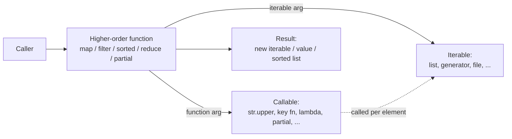
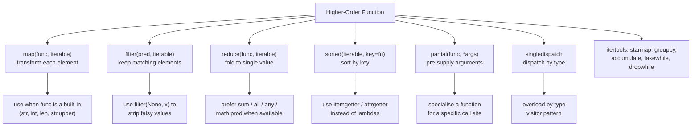
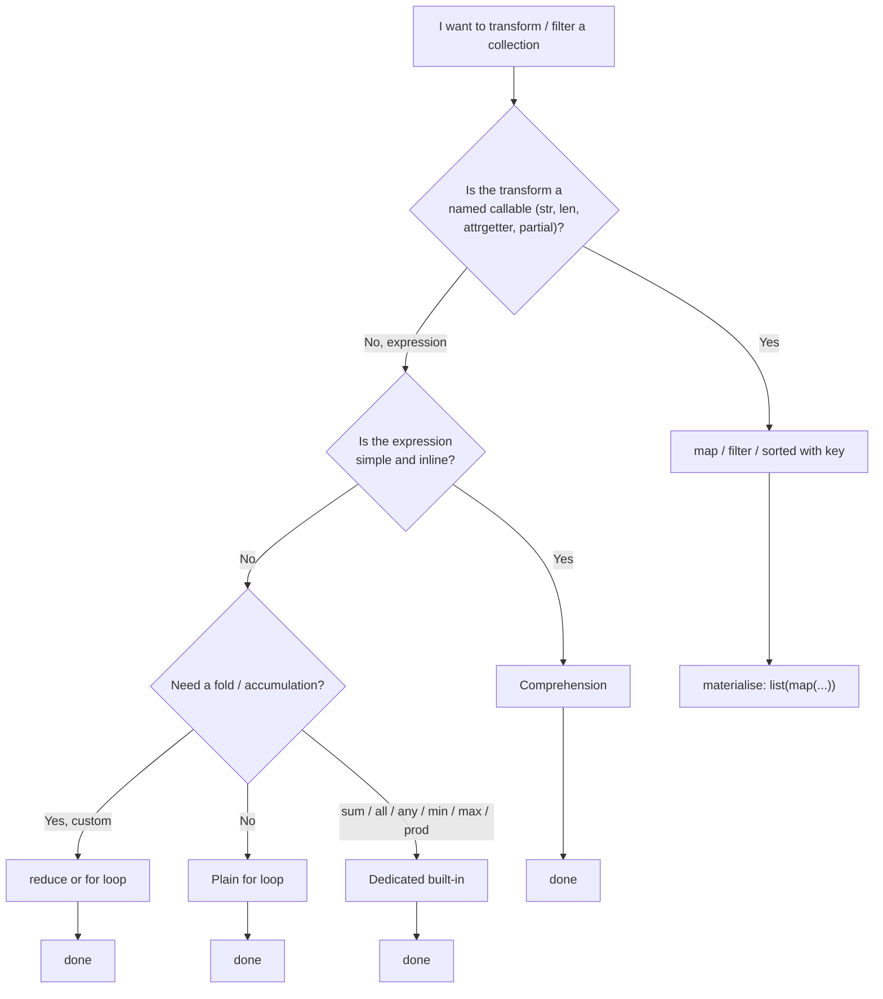

# 6. Higher Order Functions

> [!note] Why this note exists
> A **higher-order function** (HOF) is a function that takes one or more functions as arguments, returns a function, or both. Python treats functions as first-class objects — they can be assigned to variables, passed as arguments, returned from functions, and stored in data structures. This makes higher-order functions a natural part of the language. The classic HOFs are `map`, `filter`, and `reduce` (from `functools`); `sorted` with a `key` function is the most-used HOF in everyday code; `functools.partial` is the standard partial-application tool. This note covers the HOF landscape, the comparison with comprehensions (when to use which), `functools.partial`, `operator` module helpers, `itertools.groupby`, `functools.singledispatch`, and the patterns that make HOFs Pythonic rather than functional-programming-by-force.

## Why It Matters

Higher-order functions let you **parameterise behaviour**. Instead of writing three nearly-identical loops, you write one and pass the variation as a function:

```python
def process(items, transform):
    return [transform(x) for x in items]

process(nums, str)         # convert to strings
process(nums, lambda x: x*x)   # square
process(nums, abs)         # absolute value
```

The built-in HOFs `map`, `filter`, and `functools.reduce` cover the three fundamental operations on iterables: **transform each element**, **keep elements matching a predicate**, and **combine elements into a single value**. Combined with `sorted`'s `key`, `min`/`max`'s `key`, `itertools.groupby`, and `functools.partial`, they form a small but complete vocabulary for working with collections.

The Pythonic question is: **when do you reach for a HOF versus a comprehension?** Python's answer is nuanced. Comprehensions are usually clearer for simple transforms and filters. HOFs shine when the transformation is itself a configurable parameter, when you're working with `itertools` pipelines, or when the function is already a named callable (`str.upper`, `int`, `len`).

## Background

A **first-class object** can be:
- Assigned to a variable.
- Passed as an argument.
- Returned from a function.
- Stored in a data structure.

Python functions are first-class. This is the foundation of higher-order programming:

```python
def square(x): return x * x
def negate(x): return -x

ops = [square, negate, abs, str]
for op in ops:
    print(op(5))   # 25, -5, 5, '5'
```

A **higher-order function** is any function that takes or returns a function. The simplest:

```python
def apply_twice(f, x):
    return f(f(x))

apply_twice(lambda x: x + 1, 5)   # 7
```

`apply_twice` is higher-order because its first argument is a function.



## `map`

`map(func, *iterables)` applies `func` to each element of the iterables and returns an iterator:

```python
nums = [1, 2, 3, 4, 5]
squared = map(lambda x: x * x, nums)
list(squared)   # [1, 4, 9, 16, 25]
```

With multiple iterables, `map` calls `func` with one element from each:

```python
list(map(lambda a, b: a + b, [1, 2, 3], [10, 20, 30]))
# [11, 22, 33]
```

`map` is **lazy** — it returns an iterator, not a list. You must materialise with `list`, `tuple`, `set`, or iterate directly.

`map` with a **built-in** callable (`str`, `int`, `len`, `str.upper`) is often faster than a comprehension because the call happens at C level without a Python frame. `map` with a **lambda** is usually slower than a comprehension because each call still pays for the Python function call.

```python
# Fast: built-in callable
list(map(str.upper, words))

# Often clearer as a comprehension
[w.upper() for w in words]

# Slower than comprehension
list(map(lambda w: w.upper(), words))
```

## `filter`

`filter(predicate, iterable)` keeps only elements for which `predicate` returns truthy:

```python
nums = [1, 2, 3, 4, 5, 6]
evens = filter(lambda x: x % 2 == 0, nums)
list(evens)   # [2, 4, 6]
```

`filter(None, iterable)` removes falsy values (`None`, `0`, `""`, `[]`, `{}`, etc.):

```python
list(filter(None, [0, 1, "", "a", None, [], [1]]))
# [1, 'a', [1]]
```

`filter` is also lazy.

In modern Python, comprehensions are usually preferred over `filter`:

```python
# filter
evens = filter(lambda x: x % 2 == 0, nums)

# comprehension — clearer
evens = [x for x in nums if x % 2 == 0]
```

## `functools.reduce`

`reduce(func, iterable, initializer=None)` applies `func` cumulatively to the items, reducing the iterable to a single value:

```python
from functools import reduce

nums = [1, 2, 3, 4, 5]
product = reduce(lambda a, b: a * b, nums)
# ((((1 * 2) * 3) * 4) * 5) = 120

total = reduce(lambda a, b: a + b, nums, 0)   # 15
```

`reduce` is famously overused. Most reductions are clearer as a `for` loop or with the dedicated built-ins (`sum`, `all`, `any`, `min`, `max`, `math.prod`):

```python
# Don't write this
total = reduce(lambda a, b: a + b, nums, 0)
# Write this
total = sum(nums)

# Don't write this
product = reduce(lambda a, b: a * b, nums)
# Write this (3.8+)
import math
product = math.prod(nums)

# Don't write this
all_positive = reduce(lambda a, b: a and b > 0, nums, True)
# Write this
all_positive = all(b > 0 for b in nums)
```

`reduce` is appropriate when the reduction is genuinely a fold over a non-trivial operation — e.g. merging a list of dicts, building a trie, or accumulating state in a parser.

## `sorted`, `min`, `max` with `key`

The most-used HOF in everyday Python is `sorted` with a `key` function:

```python
words = ["banana", "apple", "cherry", "date"]
sorted(words, key=len)               # ['date', 'apple', 'banana', 'cherry']
sorted(words, key=str.lower)         # ['apple', 'banana', 'cherry', 'date']
sorted(words, key=lambda w: w[-1])   # sort by last letter

people = [{"name": "Alice", "age": 30}, {"name": "Bob", "age": 25}]
sorted(people, key=lambda p: p["age"])    # Bob, Alice
sorted(people, key=lambda p: (p["age"], p["name"]))   # multi-key
```

`min` and `max` also accept `key`:

```python
min(words, key=len)               # 'date'
max(people, key=lambda p: p["age"])   # Alice
```

For multi-key sorting, prefer a tuple in the key function over chained `sorted` calls:

```python
# Single pass, multi-key
sorted(rows, key=lambda r: (r["department"], -r["salary"]))

# Equivalent but slower — two sorted passes
sorted(sorted(rows, key=lambda r: -r["salary"]), key=lambda r: r["department"])
```

For complex key functions, use `operator.itemgetter` and `operator.attrgetter`:

```python
from operator import itemgetter, attrgetter

sorted(rows, key=itemgetter("department", "salary"))
sorted(objects, key=attrgetter("name", "age"))
```

## `functools.partial`

`partial(func, *args, **kwargs)` returns a new callable with some arguments pre-supplied:

```python
from functools import partial

def power(base, exponent):
    return base ** exponent

square = partial(power, exponent=2)
cube = partial(power, exponent=3)
square(5)    # 25
cube(5)      # 125

# Pre-supply positional args
def log(level, message):
    print(f"[{level}] {message}")

info = partial(log, "INFO")
warn = partial(log, "WARN")
info("started")    # [INFO] started
warn("low disk")   # [WARN] low disk
```

`partial` is conceptually a closure (see [[5. Closures]]) but implemented in C for speed. It's the standard way to specialise a function for a specific use case without rewriting it.

Common uses:
- Pre-bind a logger or config.
- Pre-bind a method's `self` (rare but useful in callbacks).
- Convert a multi-arg function into a single-arg one for `map` or `sorted`'s `key`.

```python
# Convert str.split into a single-arg callable that splits on comma
split_comma = partial(str.split, sep=",")
list(map(split_comma, ["a,b", "c,d", "e"]))
# [['a', 'b'], ['c', 'd'], ['e']]
```

`partialmethod` (3.4+) is the equivalent for methods — useful when defining a class with several pre-bound methods.

## `operator` Module

The `operator` module provides function versions of Python's operators, eliminating many lambdas:

```python
from operator import add, mul, itemgetter, attrgetter, methodcaller

# Instead of lambda a, b: a + b
reduce(add, nums)

# Instead of lambda x: x[1]
itemgetter(1)(["a", "b", "c"])   # 'b'

# Instead of lambda obj: obj.name
attrgetter("name")(obj)

# Instead of lambda s: s.upper()
methodcaller("upper")("hello")    # 'HELLO'
```

`itemgetter` and `attrgetter` are particularly useful as `key` arguments to `sorted`, `min`, `max`, and `itertools.groupby`.

## `itertools` — Higher-Order Tools for Iterables

`itertools` is the standard library's HOF toolkit for iterables. Highlights:

```python
from itertools import (
    starmap, groupby, accumulate, chain, dropwhile,
    takewhile, islice, pairwise, zip_longest
)

# starmap: like map but unpacks tuples
list(starmap(lambda a, b: a + b, [(1, 2), (3, 4)]))   # [3, 7]

# groupby: group consecutive elements by key
for key, group in groupby(sorted(items, key=...), key=...):
    print(key, list(group))

# accumulate: running reduction
list(accumulate([1, 2, 3, 4], lambda a, b: a + b))   # [1, 3, 6, 10]
list(accumulate([1, 2, 3, 4], mul))                  # [1, 2, 6, 24]

# dropwhile / takewhile
list(dropwhile(lambda x: x < 3, [1, 2, 3, 4, 5]))   # [3, 4, 5]
list(takewhile(lambda x: x < 3, [1, 2, 3, 4, 5]))   # [1, 2]

# islice: slice an iterable
list(islice(range(100), 5, 10))   # [5, 6, 7, 8, 9]

# pairwise (3.10+): consecutive pairs
list(pairwise([1, 2, 3, 4]))   # [(1, 2), (2, 3), (3, 4)]

# zip_longest: zip with fill value
list(zip_longest([1, 2, 3], ["a", "b"], fillvalue="?"))
# [(1, 'a'), (2, 'b'), (3, '?')]
```

`groupby` requires sorted input — it groups **consecutive** equal keys. Forget to sort and you get unexpected groups.

## `functools.singledispatch`

`functools.singledispatch` transforms a function into a generic function that dispatches on the type of its first argument:

```python
from functools import singledispatch

@singledispatch
def to_json(obj):
    raise TypeError(f"cannot serialise {type(obj)}")

@to_json.register(str)
def _(obj):
    return f'"{obj}"'

@to_json.register(int)
def _(obj):
    return str(obj)

@to_json.register(list)
def _(obj):
    return "[" + ", ".join(to_json(x) for x in obj) + "]"

to_json("hi")        # '"hi"'
to_json([1, "a", 2]) # '[1, "a", 2]'
to_json(3.14)        # TypeError
```

This is Python's answer to function overloading by type. It's especially useful when you can't modify a class to add a method (e.g. serialising third-party types).

`singledispatchmethod` (3.8+) is the equivalent for methods — useful for visitor patterns.

## Mermaid: Higher-Order Function Patterns



## Mermaid: Choosing HOF vs Comprehension



## Comparison with Comprehensions

Python's comprehensions cover the same ground as `map` and `filter`. When to choose which?

| Situation | Preferred tool |
| --- | --- |
| Transform with a built-in callable (`str`, `int`, `len`) | `map` (slightly faster) |
| Transform with a lambda | Comprehension (clearer) |
| Filter with a simple predicate | Comprehension |
| Strip falsy values (`None`, `0`, `""`) | `filter(None, x)` |
| Multi-step transform + filter | Comprehension (one pass) |
| Function is a configurable parameter | `map` / `filter` (pass the callable in) |
| Lazy evaluation needed | Generator expression or `map` |
| Sort by a key | `sorted` with `key` |
| Fold / accumulation | `reduce` or `for` loop |
| Type-based dispatch | `singledispatch` |

The Zen of Python says "there should be one — and preferably only one — obvious way to do it." In practice, the choice between `map` and comprehension is a stylistic one. Comprehensions tend to win on readability; `map` wins when the callable is already named and you want to avoid a `for` clause.

## Decorators and HOFs

Decorators are higher-order functions: they take a function and return a function. See [[4. Decorators Deep Dive]] for the full treatment. The connection is direct: every decorator is a HOF; not every HOF is a decorator.

```python
# A decorator is a HOF that's applied with @ syntax
def log_calls(func):    # HOF: takes a function
    def wrapper(*a, **k):
        print(f"calling {func.__name__}")
        return func(*a, **k)
    return wrapper      # returns a function

@log_calls
def add(a, b): return a + b
```

## Real-World HOF Examples

### Configurable sort keys

HOFs let you parameterise sorting without writing custom comparators:

```python
from operator import itemgetter

# Sort products by (category, -price) — descending price within each category
products.sort(key=lambda p: (p["category"], -p["price"]))

# Same with itemgetter + a key transform
products.sort(key=lambda p: (p["category"], -p["price"]))

# Multi-column sort with mixed directions: sort by name asc, then age desc
people.sort(key=lambda p: (p["name"], -p["age"]))
```

### `defaultdict` and `Counter` use callables

`collections.defaultdict` and `Counter` accept factory callables:

```python
from collections import defaultdict, Counter

# defaultdict takes a no-arg callable that produces the default value
word_lengths = defaultdict(int)
for word in words:
    word_lengths[word] = len(word)

# Custom factory
tree = lambda: defaultdict(tree)   # recursive defaultdict
data = tree()
data["a"]["b"]["c"] = 1   # auto-creates nested dicts

# Counter counts hashable items
counts = Counter("abracadabra")
counts.most_common(3)   # [('a', 5), ('b', 2), ('r', 2)]
```

### `singledispatch` for type-based visitor

```python
from functools import singledispatch

@singledispatch
def to_json(obj):
    raise TypeError(f"cannot serialise {type(obj)}")

@to_json.register
def _(obj: str): return f'"{obj}"'

@to_json.register
def _(obj: int): return str(obj)

@to_json.register
def _(obj: list): return "[" + ", ".join(map(to_json, obj)) + "]"

@to_json.register
def _(obj: dict): return "{" + ", ".join(f'"{k}": {to_json(v)}' for k, v in obj.items()) + "}"
```

### `partial` for loggers

```python
from functools import partial
import logging

logger = logging.getLogger("app")
info = partial(logger.info)
warn = partial(logger.warning)

# Pre-bind context
request_logger = partial(logger.info, extra={"component": "request_handler"})
request_logger("incoming request")
```

### `map` over a list of functions

A nice pattern for applying multiple transformations:

```python
def normalise(s): return s.strip().lower()
def to_words(s): return s.split()
def count_words(words): return len(words)

pipeline = [normalise, to_words, count_words]

def run_pipeline(value, functions):
    result = value
    for f in functions:
        result = f(result)
    return result

# Or, functionally
from functools import reduce
run = lambda value: reduce(lambda v, f: f(v), pipeline, value)
```

## Common Pitfalls

1. **Using `reduce` for `sum`/`prod`/`all`/`any`.** Use the dedicated built-ins — they're clearer and faster.
2. **`map`/`filter` returning iterators.** In Python 3 they're lazy. If you need a list, wrap with `list(...)`.
3. **Forgetting to materialise before reusing.** `m = map(str, nums); list(m); list(m)` returns `[]` the second time.
4. **`groupby` requires sorted input.** It groups consecutive equal keys. Sort first or you'll get unexpected groups.
5. **Lambdas capturing loop variables.** Same late-binding bug as closures; see [[5. Closures]].
6. **`partial` doesn't bind `self`.** To bind a method, use `partialmethod` or a small wrapper.
7. **`map` with multiple iterables stops at the shortest.** Use `zip_longest` for fill behaviour.
8. **Comparing `key` functions in `sorted`.** `key` must be deterministic and total — Python 3 raises `TypeError` if `key` returns values of incomparable types.
9. **`lambda` in `key` is fine; `lambda` in `if` filter is confusing.** Prefer `[x for x in xs if pred(x)]` over `filter(lambda x: pred(x), xs)`.
10. **`reduce` without an initializer.** The first element is used as the initializer, which is wrong if the iterable is empty (raises `TypeError`) or if the operation isn't associative.
11. **`singledispatch` only dispatches on the first argument.** For multi-argument dispatch, use `functools.singledispatchmethod` or a manual dispatch table.
12. **`partial` of a partial is fine but accumulates kwargs silently.** Audit the chain.

## Tips and Tricks

- **Prefer comprehensions for inline transforms.** Reserve `map`/`filter` for when the callable is already named.
- **Use `operator.itemgetter` and `attrgetter`** instead of lambdas for key functions — they're faster and clearer.
- **`filter(None, x)` is the canonical way to strip falsy values.**
- **`itertools.starmap` is `map` for unpacked tuples** — perfect for `[(a, b), (c, d), ...]`.
- **`functools.partial` is faster than a lambda** for specialising a function — it's implemented in C.
- **`sorted(multi_key_data, key=itemgetter("a", "b"))`** beats a lambda for multi-key sort.
- **`singledispatch` is the Pythonic visitor pattern.** Use it instead of `isinstance` chains.
- **`itertools.accumulate` with `min` or `max`** gives running min/max in one line.
- **`itertools.chain.from_iterable`** flattens a list of iterables faster than a nested comprehension.
- **`more_itertools` extends `itertools`** with `chunked`, `windowed`, `peekable`, `sliced`, and dozens of other recipes.
- **Type-check your HOF signatures.** `Callable[[T], R]` for the function, `Iterable[T]` for the input. See [[1. Basic Type Hints]] and [[2. Generics and TypeVar]].

## Active Recall

1. Define "higher-order function".
2. Write `apply_twice(f, x)` that applies `f` to `x` twice.
3. What does `map(str.upper, words)` return? What type is it?
4. Convert `[x * x for x in nums]` to `map` form.
5. Why is `map(str, nums)` often faster than `[str(x) for x in nums]`?
6. What does `filter(None, [0, 1, "", "a", None])` return?
7. Convert `[x for x in nums if x % 2 == 0]` to `filter` form.
8. Use `reduce` to compute the product of `[1, 2, 3, 4, 5]`.
9. Why should you prefer `sum(nums)` over `reduce(lambda a, b: a + b, nums)`?
10. Sort `["banana", "apple", "cherry"]` by length using `sorted` with `key`.
11. Sort a list of dicts by `("department", "salary")` using `itemgetter`.
12. Use `functools.partial` to create `info = log` pre-bound to level "INFO".
13. What does `operator.attrgetter("name", "age")` return when called?
14. Why does `itertools.groupby` need sorted input?
15. Write `singledispatch` for `to_json` handling `str`, `int`, `list`.
16. When would you choose `map` over a comprehension?
17. When would you choose a comprehension over `filter`?
18. What does `itertools.starmap` do that `map` doesn't?
19. Use `itertools.accumulate` to compute running max of `[3, 1, 4, 1, 5, 9, 2, 6]`.
20. How are decorators related to higher-order functions?

## Next Steps

- [[1. Comprehensions Deep Dive]] — the alternative to `map`/`filter` for simple transforms.
- [[4. Decorators Deep Dive]] — decorators are the most common HOFs in Python.
- [[5. Closures]] — `partial`, decorators, and most HOFs are built on closures.
- [[2. Generators and Iterators]] — `map` and `filter` return iterators; generator pipelines compose HOFs with generators.
- [[9. Standard Library Deep Dive/5. itertools]] and [[9. Standard Library Deep Dive/6. functools]] — the standard-library HOF toolkit.
