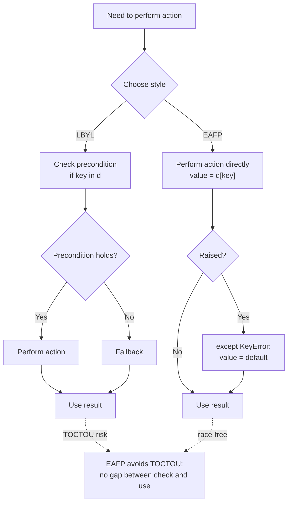
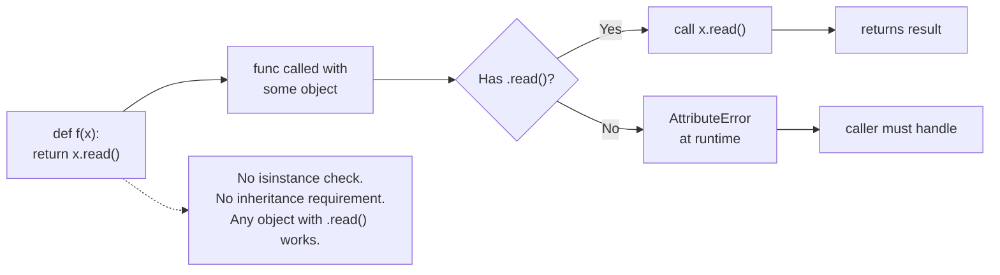
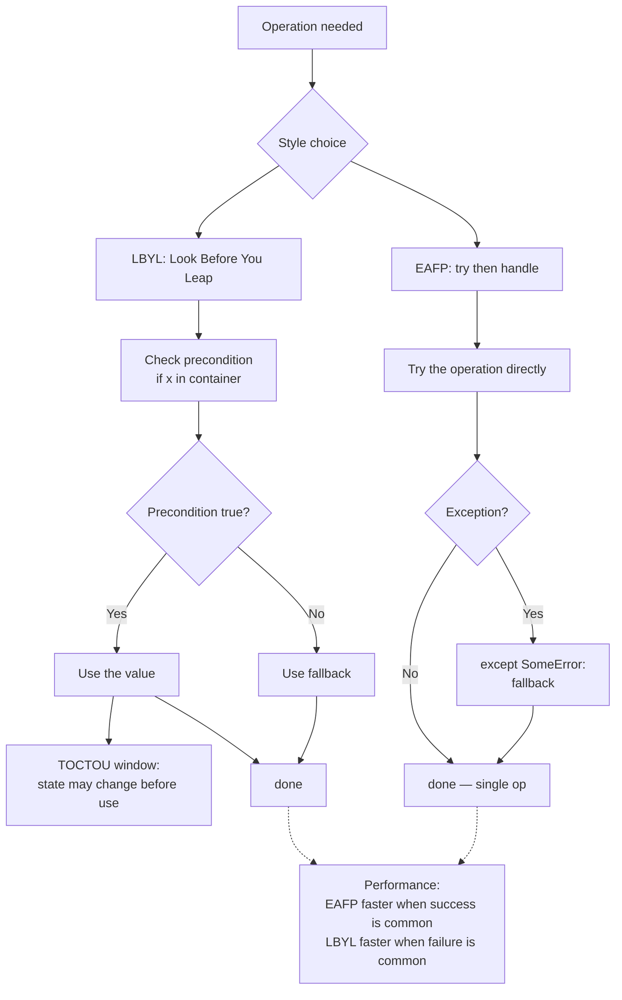
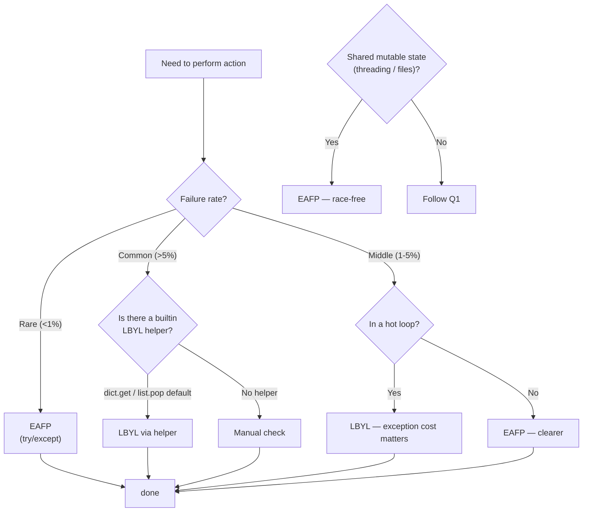

# 7. EAFP and Duck Typing

> [!note] Why this note exists
> Two idioms define Pythonic style more than any others: **EAFP** ("Easier to Ask Forgiveness than Permission") and **duck typing** ("if it walks like a duck and quacks like a duck, it's a duck"). Together they explain why Python code reads the way it does — why we write `try: x = d[key] except KeyError:` instead of `if key in d:`, why `len(x)` works on any object with `__len__`, why `for x in thing:` works on lists, files, generators, and your own classes alike, and why Python has no `instanceof` chains in idiomatic code. This note covers the EAFP/LBYL dichotomy, the duck typing model, when EAFP beats LBYL (and when it doesn't), performance implications of `try`/`except` in hot loops, the `Protocol` classes that bring static typing to duck-typed code, and the cultural reasons Python prefers forgiveness.

## Why It Matters

Consider two ways to look up a key in a dict:

```python
# LBYL — Look Before You Leap
if key in d:
    value = d[key]
else:
    value = default

# EAFP — Easier to Ask Forgiveness than Permission
try:
    value = d[key]
except KeyError:
    value = default
```

Both are correct. The LBYL version does **two** dict lookups (one for `in`, one for `[key]`). The EAFP version does **one** lookup in the common case (key present), and pays the exception cost only when the key is missing.

In Python, **EAFP is preferred** when the common case is success and failures are rare. It's faster (no double check), it's race-free (no TOCTOU window between check and use), and it composes with `try`/`except`'s ability to handle multiple failure modes at once.

Duck typing is the matching philosophy on the type side. Instead of asking "is this object a `FileReader`?", you ask "does this object have a `.read()` method?". Any object with a `.read()` method works wherever a file-like object is expected. This is why `json.load` accepts both real files and `StringIO`, why `for x in obj:` works on anything iterable, and why you can swap `list` for `tuple` for `set` in most code without touching the logic.

Together, EAFP and duck typing define the Pythonic aesthetic: **trust the object, try the operation, handle failure if it happens**. They are also why Python's type system is dynamic by default and why type hints (see [[1. Basic Type Hints]]) are optional and structural (see [[3. Protocols and Structural Typing]]).

## Background: LBYL vs EAFP

The two styles are:

- **LBYL (Look Before You Leap)** — check preconditions, then act. Common in C, Java, Go.
- **EAFP (Easier to Ask Forgiveness than Permission)** — act, then handle failure. Common in Python, Ruby, Smalltalk.

The canonical contrast:

```python
# LBYL
if os.path.exists(filename):
    with open(filename) as f:
        data = f.read()
else:
    data = None

# EAFP
try:
    with open(filename) as f:
        data = f.read()
except FileNotFoundError:
    data = None
```

The EAFP version is **race-free**: between `os.path.exists(filename)` and `open(filename)` in the LBYL version, another process can delete the file, creating a TOCTOU (time-of-check-to-time-of-use) bug. The EAFP version atomically opens the file; if it's gone, the `FileNotFoundError` is caught.



## Why Python Prefers EAFP

Three reasons:

### 1. Race-free

There is no gap between check and use. The action either succeeds or fails atomically. This matters for files (deleted between `exists` and `open`), dicts (key added/removed between `in` and `[]`), network sockets, and any mutable state shared between threads.

### 2. Faster in the common case

Python's `try` block is essentially free in CPython when no exception is raised — the runtime just sets up an exception handler and proceeds. The cost is paid only when an exception actually fires. If the common case is success, EAFP is faster than LBYL because you skip the precondition check.

```python
import timeit

d = {i: i for i in range(1000)}

def lbbl():
    if 500 in d:
        return d[500]
    return None

def eafp():
    try:
        return d[500]
    except KeyError:
        return None

# timeit: eafp is typically ~30% faster than lbbl for the present-key case
```

### 3. Composable

A single `try`/`except` can catch multiple failure modes from different operations. LBYL would need a check for each.

```python
try:
    value = parse(input_string)
    result = transform(value)
    save(result)
except ParseError:
    log("bad input")
except TransformError:
    log("transform failed")
except IOError:
    log("save failed")
```

The same code in LBYL form would need to check three preconditions before each operation — and would still race.

## When to Prefer LBYL

EAFP isn't always right. Use LBYL when:

1. **Failure is the common case.** If 90% of your keys are missing, the exception cost dominates. Use `dict.get(key, default)` or `if key in d:`.
2. **The exception is expensive.** Constructing an exception object captures a traceback, which is slow. In tight loops where failure is common, LBYL wins.
3. **You're in a hot loop and exceptions are unpredictable.** The CPython `try` block is cheap, but the exception path is not. Profile before assuming.
4. **The check is cheap and the use is expensive.** If `if not data: return` saves you a 100ms computation, the LBYL is worth it.
5. **The exception would cross a library boundary.** Don't let `KeyError` from a deep helper propagate as your public API's contract; catch and re-raise or convert early.

A classic Python compromise is `dict.get`:

```python
# Cheap, no exception, defaultable
value = d.get(key, default)
```

Use `get` when the missing-key case is unremarkable. Use `try`/`except KeyError` when missing is an error you want to handle separately.

## Performance of `try`/`except` in Hot Loops

CPython's exception setup is cheap (a few nanoseconds) when no exception fires. The cost rises sharply when an exception is raised — building the exception object, walking the stack to capture the traceback, and unwinding.

```python
import timeit

# Lookup a list of 1000 keys; 10% are missing
keys = list(range(900)) + [10_000 + i for i in range(100)]  # 10% missing
d = {i: i for i in range(900)}

def eafp_loop():
    total = 0
    for k in keys:
        try:
            total += d[k]
        except KeyError:
            pass
    return total

def get_loop():
    total = 0
    for k in keys:
        v = d.get(k)
        if v is not None:
            total += v
    return total

# get_loop is typically 3-5x faster than eafp_loop here
# because 10% of keys raise KeyError, and exceptions are expensive.
```

If the failure rate is 0.01%, EAFP is faster. If it's 10%, LBYL (or `get`) is faster. The crossover depends on your hardware and Python version, but the rule of thumb is: **exceptions for exceptional cases, not for control flow**.

> [!tip] Optimise the common path
> Use EAFP when success is the norm. Switch to `get` or `in` when missing is common enough that the exception cost dominates.

## Duck Typing

Duck typing means: **the type of an object is what it can do, not what it inherits from**. The name comes from the saying "if it walks like a duck and quacks like a duck, it's a duck."

```python
def read_all(source):
    return source.read()

# Works for files
with open("data.txt") as f:
    print(read_all(f))

# Works for StringIO
import io
buf = io.StringIO("hello")
print(read_all(buf))

# Works for any class with a .read() method
class FakeFile:
    def read(self):
        return "fake data"

print(read_all(FakeFile()))
```

`read_all` doesn't care whether `source` is a `TextIOWrapper`, `StringIO`, or `FakeFile`. It only cares that `source` has a `.read()` method. This is duck typing.

The Python data model formalises many duck types via dunder methods:

| Duck type | Method(s) | Example use |
| --- | --- | --- |
| Iterable | `__iter__` | `for x in obj:` |
| Iterator | `__iter__`, `__next__` | `next(obj)` |
| Sized | `__len__` | `len(obj)` |
| Container | `__contains__` | `x in obj` |
| Callable | `__call__` | `obj(...)` |
| Sequence | `__getitem__`, `__len__` | `obj[0]`, `len(obj)` |
| Mapping | `__getitem__`, `__len__`, `__iter__`, `keys` | `obj["k"]` |
| Hashable | `__hash__`, `__eq__` | `dict` keys, `set` members |
| Context manager | `__enter__`, `__exit__` | `with obj:` |
| Comparable | `__lt__`, `__eq__`, etc. | `sorted`, `min`, `max` |

See [[6. Magic Methods]] (Chapter 8) for the full catalogue.



## Duck Typing vs `isinstance`

Duck typing says "don't check the type, just try the operation." But sometimes you do want a type check — for example, to give a better error message, or to choose between code paths.

Use `isinstance` sparingly:

```python
def total(x):
    # Accepts int, float, list of numbers, etc.
    if isinstance(x, (int, float)):
        return x
    return sum(x)
```

This is acceptable because the alternative — `try: return sum(x); except TypeError: return x` — is convoluted. But prefer duck typing when the operation itself is the test:

```python
def total(x):
    # If x is iterable, sum it; otherwise return x.
    try:
        return sum(x)
    except TypeError:
        return x
```

Or better, make the caller responsible for passing the right type:

```python
def total(numbers: Iterable[int]) -> int:
    return sum(numbers)
```

## Duck Typing and `Protocol`

Python 3.8 added `typing.Protocol`, which gives duck typing a static-checkable form. A `Protocol` is an interface defined by the methods it has, not the class it inherits from:

```python
from typing import Protocol

class Reader(Protocol):
    def read(self) -> str: ...

def read_all(source: Reader) -> str:
    return source.read()

class FakeFile:
    def read(self) -> str:
        return "fake"

read_all(FakeFile())   # type-checks! No inheritance needed.
```

`FakeFile` doesn't inherit from `Reader`. It just has a `read` method with a compatible signature. mypy and pyright recognise this as structural conformance.

See [[3. Protocols and Structural Typing]] for the full treatment.

## EAFP + Duck Typing = Pythonic

The two idioms combine. Want to handle both a list and a single value? Don't `isinstance`-check; try to iterate:

```python
def process(items):
    # If items is a single string, treat as one item.
    try:
        iter(items)
    except TypeError:
        items = [items]
    for item in items:
        handle(item)
```

Or, more idiomatically:

```python
def process(items):
    if isinstance(items, str):
        items = [items]
    items = list(items)
    for item in items:
        handle(item)
```

Strings are iterable (character by character), which is rarely what you want, so the `isinstance(items, str)` check is a pragmatic exception.

## EAFP Patterns

### Dict lookups

```python
# Don't
if key in d:
    value = d[key]
else:
    value = default

# Do
value = d.get(key, default)
# or
try:
    value = d[key]
except KeyError:
    value = default
```

### Optional imports

```python
try:
    import ujson as json
except ImportError:
    import json
```

### Optional dependencies

```python
try:
    import pandas as pd
    HAS_PANDAS = True
except ImportError:
    HAS_PANDAS = False
```

### File operations

```python
try:
    with open(path) as f:
        data = f.read()
except FileNotFoundError:
    data = ""
```

### Conversions

```python
def to_int(s):
    try:
        return int(s)
    except (TypeError, ValueError):
        return None
```

### `contextlib.suppress`

```python
from contextlib import suppress

with suppress(FileNotFoundError):
    os.remove(maybe_missing_path)
```

`suppress` is the canonical EAFP-for-noise-reduction tool. See [[3. Context Managers]].

## Mermaid: EAFP vs LBYL Flow



## EAFP Patterns (continued)

### Multi-step conversion

Convert a value through several types, each possibly failing:

```python
def parse_number(s: str) -> int | float | None:
    """Try int, then float, then give up."""
    try:
        return int(s)
    except ValueError:
        pass
    try:
        return float(s)
    except ValueError:
        return None
```

The EAFP form is clearer than checking `s.isdigit()` (which doesn't handle negatives, decimals, or scientific notation).

### Optional method calls

Call a method if it exists, otherwise skip:

```python
# EAFP
try:
    obj.close()
except AttributeError:
    pass

# Or, more idiomatic
close = getattr(obj, "close", None)
if close is not None:
    close()
```

### Optional imports with feature detection

```python
try:
    import importlib.metadata as md
except ImportError:
    import importlib_metadata as md   # backport for 3.7
```

### Iterating with index

`enumerate` is the EAFP way to iterate with an index — no `range(len(...))`:

```python
for i, item in enumerate(items):
    print(f"{i}: {item}")
```

### Dict-of-callables dispatch

```python
handlers = {
    "create": handle_create,
    "update": handle_update,
    "delete": handle_delete,
}

def dispatch(action, *args):
    try:
        return handlers[action](*args)
    except KeyError:
        raise ValueError(f"unknown action: {action}")
```

This is a common alternative to long `if`/`elif` chains.

## EAFP vs LBYL: Decision Guide



## Common Pitfalls

1. **Catching `Exception` too broadly.** `except Exception:` swallows everything including bugs. Catch the specific exception you expect (`KeyError`, `FileNotFoundError`, `ValueError`).
2. **Bare `except:`.** Even worse — catches `KeyboardInterrupt` and `SystemExit`. Never use it.
3. **Using `try`/`except` for control flow in hot loops.** Exception construction is expensive; if 10% of iterations raise, you're paying 10x the cost.
4. **LBYL on shared state.** TOCTOU bugs in multi-threaded or multi-process code. Use EAFP or a lock.
5. **Forgetting that `try` blocks have scope.** Variables assigned inside `try` are visible outside; if the assignment failed, the variable may not exist.
6. **Checking `isinstance` when duck typing would do.** `isinstance(x, list)` rejects tuples, sets, generators; `iter(x)` accepts them all.
7. **Duck typing into `AttributeError` ambiguity.** If `obj.method()` raises `AttributeError`, was it because `obj` lacks `method`, or because `method` raised `AttributeError` internally? Use specific exceptions where possible.
8. **Strings are iterable.** `for c in "hello":` iterates characters. This bites recursive flatten functions. Check for `str` (and `bytes`) first.
9. **`hasattr` lies.** `hasattr(obj, "x")` returns `False` if `obj.x` raises any exception (including unrelated ones) during lookup. Use `getattr(obj, "x", default)` for safer defaults.
10. **`Protocol` not `@runtime_checkable` by default.** `isinstance(x, SomeProtocol)` fails unless you decorate the protocol with `@runtime_checkable`. See [[3. Protocols and Structural Typing]].
11. **EAFP catching unrelated exceptions from called code.** `try: x = parse(s) except Exception:` may swallow bugs in `parse` itself. Catch only what you expect.
12. **Mixing EAFP and LBYL inconsistently.** Pick one style per concern; mixing creates noise.

## Tips and Tricks

- **Default to EAFP.** It's the Pythonic style.
- **Switch to LBYL when failure is common** (more than ~5% of the time) or when the exception is expensive.
- **Use `dict.get(key, default)`** for the common "missing key, use default" pattern.
- **Use `contextlib.suppress(SpecificError)`** to silently ignore a known exception.
- **Catch specific exceptions**, never bare `except:`.
- **Don't catch `Exception` to silence bugs.** Catch what you can handle; let the rest propagate.
- **Combine `try`/`except`/`else`/`finally`** for clean separation: `try` the risky operation, `else` the success-only code, `finally` the always-run cleanup.
- **Duck-type when you can; `Protocol`-type when the checker is watching.** See [[3. Protocols and Structural Typing]].
- **Prefer `getattr(obj, "attr", default)` over `hasattr` + `getattr`.** It avoids a double lookup and the `hasattr` exception-swallowing footgun.
- **For "is iterable?" checks, use `iter(x)`** — it's the canonical test and works for any iterable.
- **Profile before optimising.** The EAFP vs LBYL performance difference is real but usually small outside hot loops.
- **Use `singledispatch`** for type-based dispatch instead of `isinstance` chains. See [[6. Higher Order Functions]].

## Active Recall

1. What does EAFP stand for? What about LBYL?
2. Why does Python prefer EAFP over LBYL for race-free code?
3. What is a TOCTOU bug? Give an example.
4. Convert this LBYL to EAFP:
   ```python
   if key in d:
       v = d[key]
   else:
       v = 0
   ```
5. When is LBYL faster than EAFP?
6. Why is `try`/`except` in a hot loop with 10% failure slower than `dict.get`?
7. Define duck typing in one sentence.
8. Why does `len(x)` work on strings, lists, tuples, dicts, sets, NumPy arrays, and your own classes?
9. Write a function `read_all(source)` that works for any object with a `.read()` method.
10. What does `isinstance(x, list)` reject that `iter(x)` accepts?
11. Why are strings a footgun in duck-typed flatten functions?
12. What is `typing.Protocol` for?
13. Write a `Protocol` named `Closeable` with a `close()` method.
14. Why is bare `except:` dangerous?
15. What's wrong with `hasattr(obj, "x")`?
16. Use `contextlib.suppress` to ignore `FileNotFoundError` on `os.remove`.
17. When should you use `singledispatch` instead of an `isinstance` chain?
18. Convert `try: x = int(s) except ValueError: x = None` to a one-liner using a helper.
19. Why does EAFP compose better than LBYL for multi-step operations?
20. Name three Python idioms that exemplify EAFP.

## Next Steps

- [[3. Context Managers]] — `suppress`, `closing`, and the EAFP-friendly resource patterns.
- [[3. Protocols and Structural Typing]] — duck typing made statically checkable.
- [[4. Polymorphism and Duck Typing]] (Chapter 8) — the OOP-side treatment of duck typing.
- [[5. Error Handling]] (Chapter 5) — `try`/`except`/`else`/`finally` in depth.
- [[1. Basic Type Hints]] — how type hints interact with the dynamic, duck-typed runtime.
