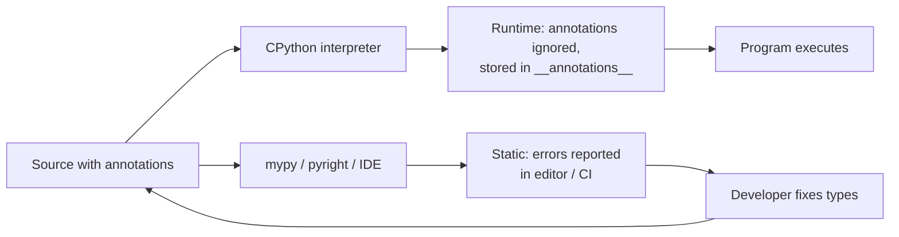
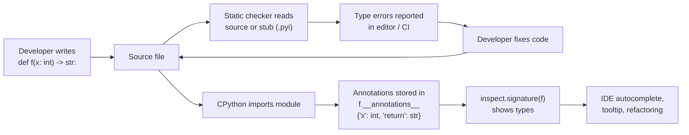
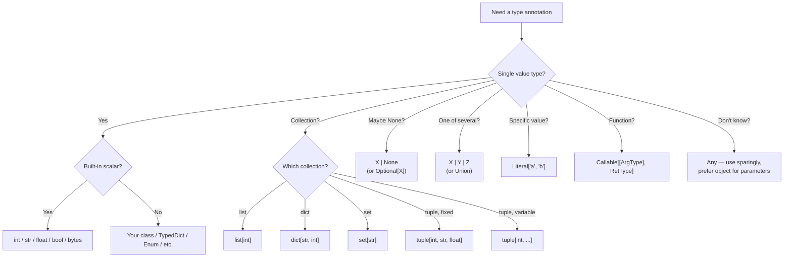

# 1. Basic Type Hints

> [!note] Why this note exists
> Type hints are **optional annotations** that describe the types of variables, function parameters, and return values. They are ignored at runtime (mostly) but consumed by static type checkers like mypy and pyright, by IDEs for autocomplete and inline error reporting, and by documentation generators. This note is the entry point to Chapter 11: it covers **why** you'd add type hints, the built-in scalar types, the modern collection generics (`list`, `dict`, `tuple`, `set` — Python 3.9+), `Optional` and `Union` (and the `X | Y` form since 3.10), function annotations, variable annotations, `Any`, `None`, and the runtime-vs-static distinction that everyone trips over once. Subsequent notes go deeper: [[2. Generics and TypeVar]] (generic functions and classes), [[3. Protocols and Structural Typing]] (duck typing in static form), [[4. TypedDict and Literal]] (typed dicts and value-as-type), and [[5. mypy and pyright]] (the checkers themselves).

## Why It Matters

Without type hints, this function is a mystery:

```python
def process(data):
    return data.get("items", [])
```

What is `data`? A dict? A `defaultdict`? Something with a `.get` method? What does it return — a list? Of what? You can't tell without reading the implementation or every call site.

With type hints:

```python
def process(data: dict[str, list[int]]) -> list[int]:
    return data.get("items", [])
```

You can read the contract at a glance. The type checker can verify that callers pass the right thing. The IDE can autocomplete `data.[Tab]` with `dict`'s methods. Refactoring is safe — change the return type and the checker tells you every call site that broke. Documentation generators can produce accurate API docs.

Types are **opt-in** in Python: the runtime ignores them (mostly — they're stored in `__annotations__` and `inspect.signature` reads them). They are a development aid, not a runtime safety net. The benefit is in the editor, in CI, and in communication with future readers (including yourself in six months).



## Background

Python's type-hint system was formalised in PEP 484 (2014). The `typing` module landed in Python 3.5. Since then, several PEPs have simplified the syntax:

- **PEP 484** (3.5): the original type-hinting proposal, `typing` module, `Optional`, `Union`, `Callable`, `TypeVar`, `Generic`.
- **PEP 526** (3.6): variable annotations (`x: int = 5`).
- **PEP 563** (3.7+, future): postponed evaluation of annotations — annotations stored as strings.
- **PEP 585** (3.9): built-in collections as generics (`list[int]` instead of `List[int]`).
- **PEP 604** (3.10): `X | Y` instead of `Union[X, Y]`, `X | None` instead of `Optional[X]`.
- **PEP 612** (3.10): `ParamSpec` for parameter-list-preserving decorators.
- **PEP 646** (3.11): `TypeVarTuple` for variadic generics.
- **PEP 673** (3.11): `Self` for "the same class" return types.
- **PEP 675** (3.11): `LiteralString` for type-safe string formatting.
- **PEP 692** (3.11): `TypedDict` for `**kwargs`.
- **PEP 695** (3.12): native generic syntax (`def f[T](x: T) -> T:`).

This note sticks to the **modern** style: `list[int]`, `int | None`, `dict[str, int]`. The legacy `typing.List[int]`, `typing.Optional[int]` forms still work but are no longer needed.

## Built-in Scalar Types

The simplest type hints are just the types themselves:

```python
def add(a: int, b: int) -> int:
    return a + b

def greet(name: str) -> str:
    return f"Hello, {name}"

def is_even(n: int) -> bool:
    return n % 2 == 0

def square(x: float) -> float:
    return x * x

def to_bytes(s: str) -> bytes:
    return s.encode("utf-8")
```

The basic scalars are:

| Type | Example values |
| --- | --- |
| `int` | `0`, `42`, `-7`, `2**100` |
| `float` | `3.14`, `-0.0`, `1e10` |
| `bool` | `True`, `False` (subclass of `int`) |
| `str` | `"hello"`, `''` |
| `bytes` | `b"data"`, `b""` |
| `complex` | `1 + 2j` |
| `None` (as a type) | only `None` |

Note that `None` is both a value and its own type. The return type annotation `-> None` means the function returns `None`.

## Collection Types (Python 3.9+)

Since Python 3.9, the built-in collections support **subscripting** directly:

```python
def sum_list(xs: list[int]) -> int:
    return sum(xs)

def word_counts(d: dict[str, int]) -> int:
    return sum(d.values())

def unique_words(words: set[str]) -> set[str]:
    return words

def first_pair(pairs: list[tuple[str, int]]) -> tuple[str, int] | None:
    return pairs[0] if pairs else None
```

The full set of built-in generics:

| Annotation | Meaning |
| --- | --- |
| `list[int]` | list of ints |
| `dict[str, int]` | dict with str keys and int values |
| `set[str]` | set of strings |
| `frozenset[int]` | frozen set of ints |
| `tuple[int, str]` | 2-tuple of (int, str) — fixed length |
| `tuple[int, ...]` | tuple of any length, all ints |
| `tuple[()]` | empty tuple |
| `list[list[int]]` | list of lists of ints |

Before Python 3.9 you had to use `typing.List[int]`, `typing.Dict[str, int]`, etc. The modern style is preferred; the `typing` aliases are deprecated.

### Tuples: fixed vs variable length

`tuple[int, str]` is a **2-tuple** with the first element an int and the second a str. The length is part of the type.

`tuple[int, ...]` is a tuple of any length where every element is an int. The `...` (ellipsis) is the conventional marker.

```python
def rgb() -> tuple[int, int, int]:
    return (255, 128, 0)

def all_ints(xs: tuple[int, ...]) -> int:
    return sum(xs)
```

## `Optional` and `Union`

`Optional[X]` means "X or None". Since Python 3.10 you can write `X | None`:

```python
from typing import Optional

def find(xs: list[int], target: int) -> Optional[int]:
    # Same as: int | None
    for i, x in enumerate(xs):
        if x == target:
            return i
    return None
```

`Union[X, Y]` means "X or Y". Since Python 3.10 you can write `X | Y`:

```python
from typing import Union

def parse(s: str) -> Union[int, float, str]:
    try:
        return int(s)
    except ValueError:
        try:
            return float(s)
        except ValueError:
            return s

# Modern equivalent
def parse(s: str) -> int | float | str:
    ...
```

`Optional[X]` is exactly `Union[X, None]`, and `X | None` is the modern form.

```python
# All three are equivalent
def f(x: Optional[int]) -> Optional[int]: ...
def f(x: Union[int, None]) -> Union[int, None]: ...
def f(x: int | None) -> int | None: ...
```

> [!tip] Prefer the `|` syntax
> In Python 3.10+, `int | None` is clearer and shorter than `Optional[int]`. Reserve `Optional` and `Union` for code that must run on 3.9 or older.

## Function Annotations

Function annotations live after the parameter colon and after `->` for the return type:

```python
def repeat(s: str, times: int = 1) -> str:
    return s * times
```

Default values still work alongside annotations:

```python
def greet(name: str = "world") -> str:
    return f"Hello, {name}"
```

`*args` and `**kwargs` annotations describe the **types of the elements**, not the tuple/dict wrapper:

```python
def log_call(name: str, *args: int, **kwargs: str) -> None:
    print(name, args, kwargs)

log_call("test", 1, 2, 3, x="a", y="b")   # OK
log_call("test", "not int")               # type error
```

Annotations are stored on `__annotations__`:

```python
print(repeat.__annotations__)
# {'s': <class 'str'>, 'times': <class 'int'>, 'return': <class 'str'>}
```

## Variable Annotations

Variables can be annotated too:

```python
count: int = 0
name: str = "Alice"
items: list[int] = [1, 2, 3]
config: dict[str, int | None] = {"port": 8080, "timeout": None}
```

Without an initialiser, the annotation declares the type but **does not create the variable**:

```python
total: int        # declares the type but doesn't bind 'total'
print(total)      # NameError — 'total' is not defined
```

Variable annotations are mostly for module-level and class-level declarations. Inside functions they're legal but rarely useful — the type can usually be inferred from the assignment.

```python
# Module-level
PORT: int = 8080
DEBUG: bool = True

# Class-level
class Config:
    host: str = "localhost"
    port: int = 8080
```

## `Any`, `None`, `object`

- `Any` — opts out of type checking. Anything is compatible with `Any`, and `Any` is compatible with anything. Use sparingly; it's the "I don't know" escape hatch.
- `None` — only the value `None`. Used as a return type for side-effectful functions.
- `object` — the top type. Every type is a subtype of `object`, but to use a method on an `object` you must narrow it first.

```python
from typing import Any

def debug(value: Any) -> None:
    print(repr(value))

def noop() -> None:
    pass

def anything(o: object) -> None:
    # o is some object; we know nothing about its methods
    print(o)   # OK — print accepts anything
    # o.upper()   # type error — 'object' has no method 'upper'
```

`Any` and `object` are subtly different. `Any` is permissive in both directions — you can call any method on it. `object` is permissive only as a parameter — callers can pass anything, but you can only call `object` methods on it. Prefer `object` when you mean "anything goes, but I won't call methods on it"; prefer `Any` only when you genuinely don't know.

## `Callable`

To type a function or callable, use `Callable`:

```python
from typing import Callable

def apply(func: Callable[[int, int], int], a: int, b: int) -> int:
    return func(a, b)

apply(lambda x, y: x + y, 2, 3)   # 5
apply(max, 2, 3)                   # 3
```

`Callable[[int, int], int]` means "a callable taking two ints and returning an int".

Since Python 3.9 you can also write `Callable[..., int]` to mean "any callable returning int, regardless of parameters".

For more advanced callable typing (preserving signatures through decorators), see [[2. Generics and TypeVar]] and the `ParamSpec` section in [[9. Standard Library Deep Dive/10. typing]].

## `Literal`

`Literal` lets you use specific values as types:

```python
from typing import Literal

def set_mode(mode: Literal["read", "write", "append"]) -> None:
    ...

set_mode("read")    # OK
set_mode("delete")  # type error
```

See [[4. TypedDict and Literal]] for the full treatment.

## Forward References

If you need to reference a type that's defined later in the file (e.g. the return type of a method that returns the same class), you can use a string:

```python
class Node:
    def __init__(self, value: int):
        self.value = value
        self.next: "Node | None" = None   # forward reference as string
```

Or add `from __future__ import annotations` at the top of the file. This makes all annotations **strings** by default, evaluated lazily:

```python
from __future__ import annotations

class Node:
    def __init__(self, value: int):
        self.value = value
        self.next: Node | None = None   # no quotes needed
```

`from __future__ import annotations` is recommended in new modules — it avoids the cost of evaluating complex types at import time and eliminates most forward-reference quoting.

## Mermaid: Type Hint Value Chain



## Mermaid: Choosing a Type Expression



## Real-World Annotation Patterns

### Typed API surface

A function with type hints is self-documenting. Compare:

```python
# Untyped
def get_user(user_id, include_profile=False):
    ...

# Typed
def get_user(user_id: int, include_profile: bool = False) -> User | None:
    ...
```

The second form is a contract: callers know what to pass, what they get back, and what happens when the user doesn't exist. IDEs surface this in tooltips; documentation generators produce accurate API docs.

### Gradual typing in legacy code

You don't have to annotate everything at once. A common strategy:

1. Annotate the **public API** of each module first — functions and classes that callers use.
2. Annotate **new code** as you write it.
3. Annotate **changed code** when you touch it.
4. Run mypy in **non-strict** mode initially; tighten the flags as coverage grows.
5. Use `# type: ignore` sparingly for third-party code that lacks stubs.

### Type narrowing in practice

```python
def process_user(user: User | None) -> str:
    if user is None:
        return "guest"
    # user is now narrowed to User
    return user.name

def first_word(text: str | list[str]) -> str:
    if isinstance(text, str):
        # text narrowed to str
        return text.split()[0] if text else ""
    # text narrowed to list[str]
    return text[0] if text else ""
```

The checker follows the control flow and tracks what `user` and `text` are in each branch.

### Annotating module-level constants

```python
# config.py
import os
from typing import Final

DATABASE_URL: Final[str] = os.environ["DATABASE_URL"]
MAX_CONNECTIONS: Final[int] = 10
DEBUG: Final[bool] = os.environ.get("DEBUG", "").lower() in ("1", "true")

# `Final` tells the checker these shouldn't be reassigned
DATABASE_URL = "something else"   # type error
```

`Final` (PEP 591, Python 3.8+) marks a name as not-to-be-reassigned. Useful for module-level constants.

### Annotating class attributes

```python
class User:
    # Class-level type declarations
    id: int
    name: str
    email: str | None

    def __init__(self, id: int, name: str, email: str | None = None) -> None:
        self.id = id
        self.name = name
        self.email = email
```

The class-level declarations document the instance attributes without assigning class-level defaults. The `__init__` body then sets them.

### `overload` for variant signatures

When a function's return type depends on its arguments in a way `TypeVar` can't capture, use `@overload`:

```python
from typing import overload, Literal

@overload
def parse(s: str, mode: Literal["int"]) -> int: ...
@overload
def parse(s: str, mode: Literal["float"]) -> float: ...
@overload
def parse(s: str, mode: Literal["str"]) -> str: ...

def parse(s: str, mode: str) -> int | float | str:
    if mode == "int":
        return int(s)
    elif mode == "float":
        return float(s)
    return s

# At call sites, the checker picks the right overload:
x: int = parse("42", "int")        # OK
y: float = parse("3.14", "float")  # OK
z: int = parse("3.14", "float")    # type error — float, not int
```

The `@overload`-decorated stubs are the **public** signatures; the undecorated final definition is the **implementation**. The checker uses the overloads; the runtime uses the implementation.

## Common Pitfalls

1. **Using legacy `typing.List`/`Dict`/`Tuple`/`Set` in 3.9+ code.** Use `list`, `dict`, `tuple`, `set` directly. The `typing` aliases are deprecated.

2. **Using `Optional[X]` when you mean "default is None".** `Optional[X]` is a **type** meaning `X | None`. The default value is a separate concept:
   ```python
   # Wrong: type says int, but default is None
   def f(x: int = None) -> None: ...

   # Right
   def f(x: int | None = None) -> None: ...
   ```

3. **Forgetting that annotations are evaluated at definition time.** Without `from __future__ import annotations`, `Node | None` inside the `Node` class body raises `NameError` because `Node` doesn't exist yet. Use a string `"Node | None"` or the future import.

4. **Confusing `Any` with `object`.** `Any` disables checking; `object` is the top type but you can only call `object` methods on it. Prefer `object` for "any value" parameters.

5. **`tuple[int]` is a 1-tuple, not a tuple of ints.** For "tuple of any length", use `tuple[int, ...]`.

6. **`list[int]` vs `list[int | None]`.** The former rejects `None`; the latter allows it. Be precise.

7. **Annotating local variables unnecessarily.** Inside a function, `x = 5` already infers `int`. Adding `x: int = 5` is noise. Reserve annotations for module/class level or for narrowing.

8. **Storing annotations that aren't valid expressions.** `from __future__ import annotations` makes them strings, so they don't need to be valid Python — but `inspect.get_type_hints` will try to evaluate them, and forward-reference errors only show up then.

9. **Confusing runtime with static.** `isinstance(x, int)` is runtime; `x: int` is static. The two don't enforce each other.

10. **Using `Callable` without parameter types.** `Callable[..., int]` is fine when you mean "any callable returning int", but it discards parameter checking.

11. **Missing return type on `__init__`.** `__init__` should be `-> None`. Most checkers will warn if you omit it.

12. **Forgetting `-> None` on side-effectful functions.** Functions without an explicit return type get `Unknown` in strict mode. Always annotate the return type.

## Tips and Tricks

- **Add `from __future__ import annotations` at the top of every new module.** It avoids forward-reference quoting and is the default in a future Python version.
- **Prefer `X | Y` over `Union[X, Y]`** in Python 3.10+ code.
- **Prefer `X | None` over `Optional[X]`** in 3.10+ code.
- **Use `list[int]`, not `List[int]`**, in 3.9+ code.
- **Annotate all function signatures.** Even `-> None` for side-effectful functions helps the checker.
- **Don't annotate every local variable.** Let the checker infer from the assignment.
- **Use `Literal` for enum-like string parameters** instead of free-form `str`.
- **Use `TypedDict` for dict-of-known-shape data** instead of `dict[str, Any]`. See [[4. TypedDict and Literal]].
- **Use `Protocol` for duck-typed parameters** instead of `Any`. See [[3. Protocols and Structural Typing]].
- **Run mypy or pyright in CI.** See [[5. mypy and pyright]] for setup.
- **Document types in docstrings as a backup**, but type hints are the source of truth.
- **Use `reveal_type(x)`** in mypy to debug type inference:
  ```python
  x = some_function()
  reveal_type(x)   # mypy prints the inferred type
  ```
- **Stubs (.pyi files) let you type-check untyped libraries.** See [[5. mypy and pyright]].

## Active Recall

1. What does `def f(x: int) -> str: ...` tell the type checker?
2. What changed in Python 3.9 about collection types?
3. What changed in Python 3.10 about `Union` and `Optional`?
4. Write a function annotation for a function that takes a list of strings and returns a dict mapping each string to its length.
5. What is the difference between `tuple[int, str]` and `tuple[int, ...]`?
6. What does `Optional[int]` mean, and what's the modern equivalent?
7. Why might you add `from __future__ import annotations` to a module?
8. What is the difference between `Any` and `object`?
9. Annotate `def log_call(name, *args, **kwargs)` where args are ints and kwargs are strings.
10. What does `Callable[[int, int], int]` mean?
11. Why does `def f(x: int = None) -> None:` have a type error?
12. What does `reveal_type(x)` do in mypy?
13. Write a `Literal` type for "yes" / "no" / "maybe".
14. Where are annotations stored at runtime?
15. Does Python enforce type hints at runtime? Explain.
16. Why is annotating every local variable unnecessary?
17. Write a forward-reference annotation for `Node` inside the `Node` class body without using the future import.
18. What is `inspect.get_type_hints` for?
19. How does the IDE use type hints?
20. Why is `tuple[int]` not "a tuple of ints"?

## Next Steps

- [[2. Generics and TypeVar]] — `TypeVar` and `Generic` for reusable, type-preserving functions and classes.
- [[3. Protocols and Structural Typing]] — duck typing made statically checkable.
- [[4. TypedDict and Literal]] — typed dicts and value-as-type.
- [[5. mypy and pyright]] — the type checkers themselves, strict mode, stubs, typeshed.
- [[9. Standard Library Deep Dive/10. typing]] — the broader `typing` module reference.
