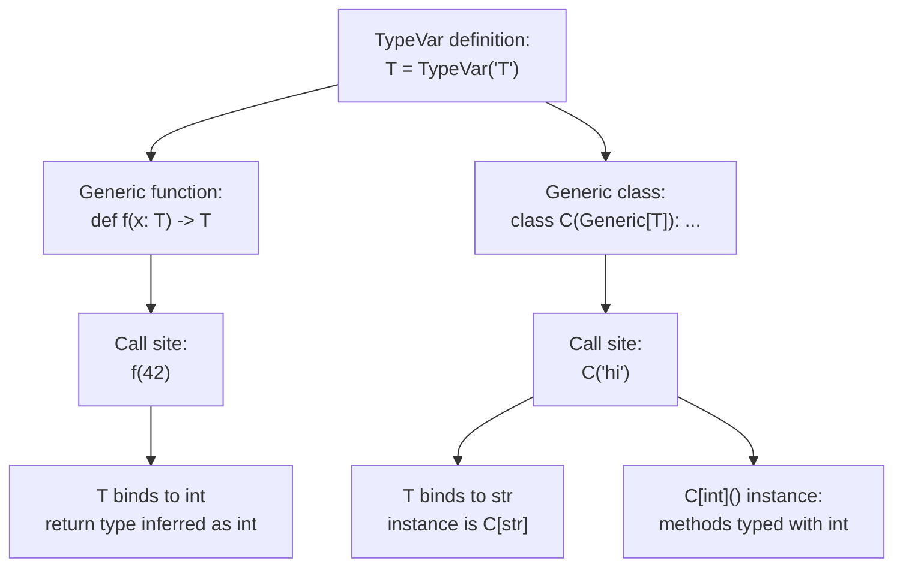
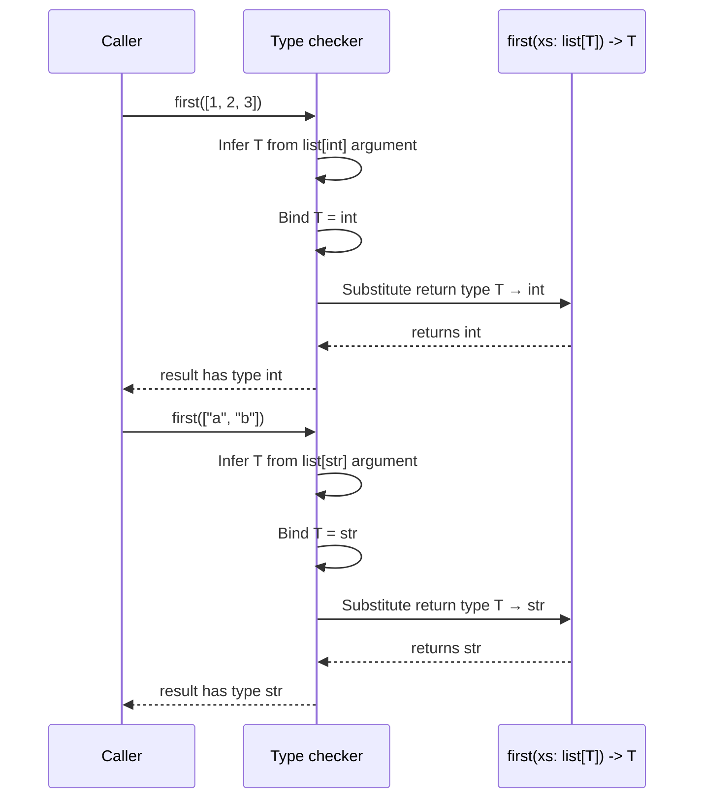
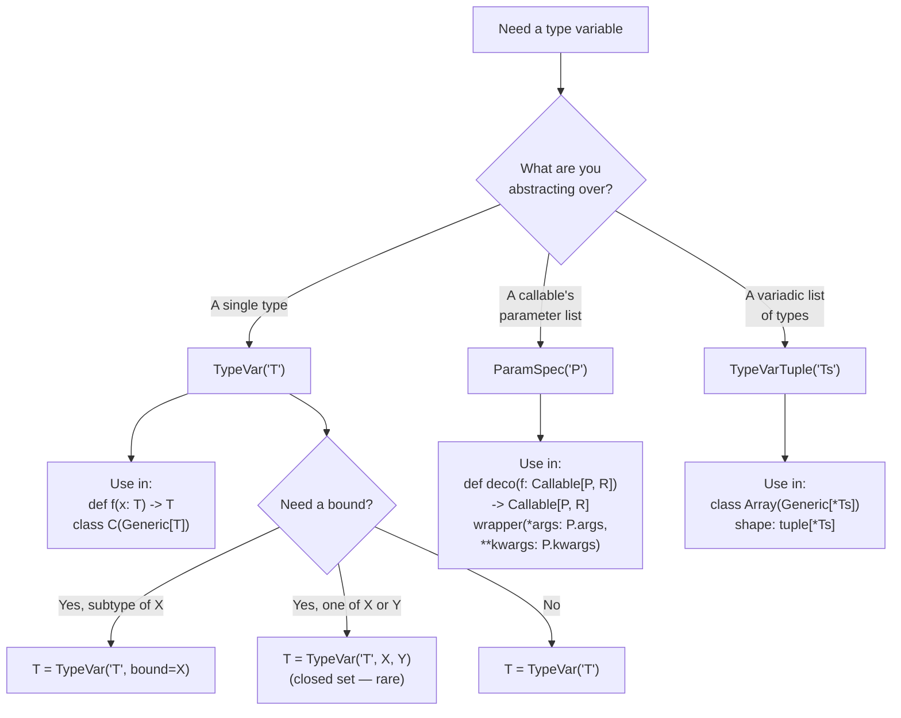

# 2. Generics and TypeVar

> [!note] Why this note exists
> Generics let you write **type-preserving** functions and classes — code where the output type depends on the input type, without losing type information. Without generics, `def first(xs): return xs[0]` returns `Any`; the type checker cannot tell callers what the element type is. With generics, `def first(xs: list[T]) -> T` says "if you give me a list of ints, you get an int back; if you give me a list of strings, you get a string back." This note covers `TypeVar`, generic functions, generic classes (`Generic[T]`), `TypeVar` bounds and constraints, multiple `TypeVar`s, `ParamSpec` (preserving callable signatures for decorators), `TypeVarTuple` (variadic generics), and the PEP 695 native generic syntax introduced in Python 3.12. This is the foundation for the rest of the type system: `Protocol` and `Generic` combine to express structural-generic interfaces, `TypedDict` is technically a special form of `Generic`, and `mypy`/`pyright` cannot do their work without `TypeVar`.

## Why It Matters

Consider this non-generic helper:

```python
def first(xs):
    return xs[0]

result = first([1, 2, 3])   # result has type Any — caller has no info
```

The caller has no idea what `result` is. They might assume it's an `int`, but the type checker can't verify that, and the IDE offers no autocomplete.

Now make it generic:

```python
from typing import TypeVar

T = TypeVar("T")

def first(xs: list[T]) -> T:
    return xs[0]

result = first([1, 2, 3])   # result is inferred as int
result2 = first(["a", "b"]) # result2 is inferred as str
```

The `T` is a **type variable** — a placeholder for a type that's filled in at each call site. When you call `first([1, 2, 3])`, `T` is bound to `int`, so the return type is `int`. When you call `first(["a", "b"])`, `T` is bound to `str`.

Without generics, every collection-manipulation utility either returns `Any` (losing type safety) or is duplicated per type (one `first_int`, one `first_str`, etc.). Generics let you write the function once and have it work for any element type while preserving type information end-to-end.

Generic classes are equally important. A `Stack[int]` should be a stack that holds ints; pushing a string should be a type error:

```python
class Stack(Generic[T]):
    def __init__(self) -> None:
        self._items: list[T] = []
    def push(self, x: T) -> None:
        self._items.append(x)
    def pop(self) -> T:
        return self._items.pop()

s: Stack[int] = Stack()
s.push(1)         # OK
s.push("x")       # type error
x = s.pop()       # x is int
```

## Background

`TypeVar` is the construct that introduces a type variable. It comes from `typing`:

```python
from typing import TypeVar

T = TypeVar("T")
```

The string argument is the **name** of the type variable. It must match the variable name on the left side (`T = TypeVar("T")`). Mismatches cause confusing error messages.

Once defined, `T` can appear in function signatures and class definitions:

```python
# Generic function
def identity(x: T) -> T:
    return x

# Generic class
class Box(Generic[T]):
    def __init__(self, value: T) -> None:
        self.value = value
    def get(self) -> T:
        return self.value
```

The `Generic[T]` base class marks `Box` as generic. The type variable `T` is in scope throughout the class body.



## Generic Functions

The simplest use of `TypeVar`:

```python
from typing import TypeVar

T = TypeVar("T")

def first(xs: list[T]) -> T:
    return xs[0]

def last(xs: list[T]) -> T:
    return xs[-1]

def identity(x: T) -> T:
    return x
```

Each call binds `T` to the concrete type:

```python
first([1, 2, 3])      # int
first(["a", "b"])     # str
first([1.0, 2.0])     # float
identity(42)          # int
identity("hello")     # str
```

The type checker **infers** the binding from the argument. You usually don't need to specify it explicitly.

If you want to force a specific binding (rare), you can:

```python
first[int]([1, 2, 3])   # explicit binding — Python 3.12+ supports this syntax
```

### Multiple `TypeVar`s

Functions can use multiple type variables:

```python
T = TypeVar("T")
U = TypeVar("U")

def pair(a: T, b: U) -> tuple[T, U]:
    return (a, b)

pair(1, "hello")   # tuple[int, str]
pair("x", 3.14)    # tuple[str, float]
```

Each `TypeVar` is independent. The checker infers each from its corresponding argument.

### Functions returning the input type

A common pattern: a function that takes a value of type `T` and returns a value of the same type `T`:

```python
T = TypeVar("T")

def copy(x: T) -> T:
    return x

copy(42)        # int
copy("hello")   # str
```

Without `TypeVar`, you'd have to write `def copy(x: Any) -> Any` — losing the relationship between input and output.

## Generic Classes

A class becomes generic by inheriting from `Generic[T]`:

```python
from typing import Generic, TypeVar

T = TypeVar("T")

class Stack(Generic[T]):
    def __init__(self) -> None:
        self._items: list[T] = []
    def push(self, item: T) -> None:
        self._items.append(item)
    def pop(self) -> T:
        if not self._items:
            raise IndexError("pop from empty stack")
        return self._items.pop()
    def peek(self) -> T:
        return self._items[-1]

# Usage
int_stack: Stack[int] = Stack()
int_stack.push(1)
int_stack.push(2)
n = int_stack.pop()   # n is int

str_stack: Stack[str] = Stack()
str_stack.push("hello")
s = str_stack.pop()   # s is str
```

Once you annotate `int_stack: Stack[int]`, the type checker knows that `push` takes `int`, `pop` returns `int`, etc.

### Multiple type parameters

A class can have multiple type parameters:

```python
K = TypeVar("K")
V = TypeVar("V")

class BiMap(Generic[K, V]):
    def __init__(self) -> None:
        self._forward: dict[K, V] = {}
        self._reverse: dict[V, K] = {}
    def put(self, k: K, v: V) -> None:
        self._forward[k] = v
        self._reverse[v] = k
    def get_by_key(self, k: K) -> V:
        return self._forward[k]
    def get_by_value(self, v: V) -> K:
        return self._reverse[v]

m: BiMap[str, int] = BiMap()
m.put("one", 1)
m.get_by_key("one")      # int
m.get_by_value(1)        # str
```

### Generic methods

Methods inside a generic class can use the class's type variables, and they can also introduce their own:

```python
T = TypeVar("T")
U = TypeVar("U")

class Box(Generic[T]):
    def __init__(self, value: T) -> None:
        self.value = value
    def get(self) -> T:
        return self.value
    def map(self, f: Callable[[T], U]) -> "Box[U]":
        return Box(f(self.value))
```

`map` introduces a new type variable `U` for the function's return type, and uses it to type the returned `Box[U]`.

## `TypeVar` Bounds and Constraints

Sometimes you need to restrict what `T` can be.

### Bounds (`bound=...`)

`T = TypeVar("T", bound=SomeClass)` means `T` must be `SomeClass` or a subtype:

```python
from typing import TypeVar

class Comparable:
    def __lt__(self, other: "Comparable") -> bool: ...

T = TypeVar("T", bound=Comparable)

def sort(xs: list[T]) -> list[T]:
    return sorted(xs)
```

Inside the function, `T`'s values are known to support `__lt__` (because `Comparable` does), so `sorted` is well-typed.

A common bound is `bound=str` to enforce strings, or `bound="SomeProtocol"` to enforce a Protocol.

### Constraints (positional args)

`T = TypeVar("T", int, str)` means `T` must be **exactly** one of `int` or `str` (not subtypes). This is much more restrictive than bounds:

```python
T = TypeVar("T", int, str)

def double(x: T) -> T:
    return x + x

double(5)        # int — OK
double("ab")     # str — OK
double(3.14)     # type error — float not in constraints
```

Constraints are rarely useful; bounds are more common. Use constraints only when you genuinely need a closed set of types.

## `ParamSpec` — Preserving Callable Signatures

A plain `TypeVar` cannot capture a function's full parameter list. If you write a decorator that wraps `f` and returns a new function with the same signature, `TypeVar` alone loses the parameter types:

```python
T = TypeVar("T")
R = TypeVar("R")

def log_calls(func: Callable[..., R]) -> Callable[..., R]:
    # The ... discards parameter info — callers can pass anything!
    ...
```

`ParamSpec` (PEP 612, Python 3.10+) captures the parameter list as a first-class type:

```python
from typing import ParamSpec, TypeVar, Callable
import functools

P = ParamSpec("P")
R = TypeVar("R")

def log_calls(func: Callable[P, R]) -> Callable[P, R]:
    @functools.wraps(func)
    def wrapper(*args: P.args, **kwargs: P.kwargs) -> R:
        print(f"calling {func.__name__}")
        return func(*args, **kwargs)
    return wrapper

@log_calls
def add(a: int, b: int) -> int:
    return a + b

add(1, 2)        # OK
add("x", 2)      # type error — argument 1 must be int
```

`P.args` and `P.kwargs` expand to the captured parameter list. The wrapper's signature is now the **same** as the original function's signature, from the type checker's perspective.

See [[4. Decorators Deep Dive]] for the broader context of typed decorators.

## `TypeVarTuple` — Variadic Generics

`TypeVarTuple` (PEP 646, Python 3.11+) lets you express variadic type parameters — useful for arrays with shape information:

```python
from typing import TypeVarTuple, Generic

Ts = TypeVarTuple("Ts")

class Array(Generic[*Ts]):
    def __init__(self, shape: tuple[*Ts]) -> None:
        self.shape = shape
    def __getitem__(self, idx: tuple[*Ts]) -> int: ...

arr2d: Array[int, int] = Array((10, 20))
arr3d: Array[int, int, int] = Array((10, 20, 30))
```

`*Ts` is the type-level equivalent of `*args`. NumPy, JAX, and PyTorch type stubs use it to express tensor shapes.

This is an advanced feature; most application code never needs it.

## PEP 695 — Native Generic Syntax (Python 3.12+)

Python 3.12 introduced native syntax for type parameters, removing the need to declare `TypeVar` and `Generic` explicitly:

```python
# 3.12+ syntax — no TypeVar, no Generic
def first[T](xs: list[T]) -> T:
    return xs[0]

class Stack[T]:
    def __init__(self) -> None:
        self._items: list[T] = []
    def push(self, item: T) -> None:
        self._items.append(item)
    def pop(self) -> T:
        return self._items.pop()

# TypeVar with bound
def sort[T: Comparable](xs: list[T]) -> list[T]:
    return sorted(xs)

# Multiple type parameters
class BiMap[K, V]:
    ...

# ParamSpec
def log_calls[**P, R](func: Callable[P, R]) -> Callable[P, R]:
    ...
```

The `[T]` syntax creates a new `TypeVar` scoped to the function or class. The legacy `T = TypeVar("T")` form still works; PEP 695 is a cleaner alternative.

> [!tip] Use PEP 695 syntax in 3.12+ codebases
> It's terser and removes the duplication of `T = TypeVar("T")`. For libraries that must support older Python, stick with the legacy form.

## Mermaid: Generic Type Parameter Binding



## Mermaid: TypeVar, ParamSpec, TypeVarTuple



## Real-World Generic Examples

### Generic repository pattern

```python
from typing import TypeVar, Generic, Protocol

T = TypeVar("T", bound="Entity")

class Entity(Protocol):
    id: int

class Repository(Generic[T]):
    def __init__(self) -> None:
        self._data: dict[int, T] = {}
    def add(self, entity: T) -> None:
        self._data[entity.id] = entity
    def get(self, id: int) -> T | None:
        return self._data.get(id)
    def all(self) -> list[T]:
        return list(self._data.values())

class User:
    def __init__(self, id: int, name: str) -> None:
        self.id = id
        self.name = name

user_repo: Repository[User] = Repository()
user_repo.add(User(1, "Alice"))
u = user_repo.get(1)   # u is User | None
```

The `Repository` class works for any `Entity`-shaped class. The `bound=Entity` ensures `T` has an `id` attribute.

### Generic result type

A common pattern for fallible operations:

```python
from typing import TypeVar, Generic, Union

T = TypeVar("T")
E = TypeVar("E")

class Ok(Generic[T]):
    def __init__(self, value: T) -> None:
        self.value = value

class Err(Generic[E]):
    def __init__(self, error: E) -> None:
        self.error = error

Result = Union[Ok[T], Err[E]]

def divide(a: int, b: int) -> Result[int, str]:
    if b == 0:
        return Err("division by zero")
    return Ok(a // b)

result = divide(10, 0)
if isinstance(result, Ok):
    print(result.value)
else:
    print(result.error)
```

This is Rust-style `Result` typing in Python.

### Generic container with covariant TypeVar

```python
from typing import TypeVar, Generic

# covariant=True: Container[Dog] is a subtype of Container[Animal]
# (read-only containers)
T_co = TypeVar("T_co", covariant=True)

class Box(Generic[T_co]):
    def __init__(self, value: T_co) -> None:
        self._value = value
    def get(self) -> T_co:
        return self._value
    # No setter — covariant requires read-only

class Animal: ...
class Dog(Animal): ...

dog_box: Box[Dog] = Box(Dog())
animal_box: Box[Animal] = dog_box   # OK — covariant
```

Covariance matters when you want subtype relationships to flow through the container. Use `covariant=True` only for read-only containers (no methods that take `T` as a parameter).

### Generic with `ParamSpec` for typed decorators

```python
from typing import TypeVar, ParamSpec, Callable, Awaitable
import functools

P = ParamSpec("P")
R = TypeVar("R")

def log_calls(func: Callable[P, R]) -> Callable[P, R]:
    @functools.wraps(func)
    def wrapper(*args: P.args, **kwargs: P.kwargs) -> R:
        print(f"calling {func.__name__}")
        return func(*args, **kwargs)
    return wrapper

# Async version
def log_async_calls(func: Callable[P, Awaitable[R]]) -> Callable[P, Awaitable[R]]:
    @functools.wraps(func)
    async def wrapper(*args: P.args, **kwargs: P.kwargs) -> R:
        print(f"calling {func.__name__}")
        return await func(*args, **kwargs)
    return wrapper
```

Both sync and async decorators preserve the wrapped function's signature through `ParamSpec`.

## Common Pitfalls

1. **Name mismatch in `TypeVar`.** `T = TypeVar("X")` confuses the checker. The string must match the variable name.

2. **Forgetting `Generic[T]` on classes.** `class Stack: def push(self, x: T) -> None: ...` is not a generic class. You need `class Stack(Generic[T]):` to mark it as such.

3. **Using `TypeVar` at module level instead of class scope.** A `TypeVar` declared at module level is shared by all functions that use it. For class-private type variables, declare them inside the class (PEP 695 makes this natural) or use distinct names.

4. **Confusing bounds with constraints.** `TypeVar("T", bound=X)` allows `T = X` or any subtype. `TypeVar("T", X, Y)` allows `T = X` or `T = Y` exactly (a closed set). The latter is rarely what you want.

5. **Returning `T` when you actually return a wider type.** `def f(x: T) -> T: return some_other_value` is a type error if `some_other_value` isn't `T`.

6. **Forgetting to forward `TypeVar` in subclasses.** `class IntStack(Stack[int]):` fixes `T = int`. `class MyStack(Stack[T]):` requires `MyStack` to also be `Generic[T]` (or use PEP 695).

7. **Losing parameter info in decorators.** `def deco(f: Callable[..., R]) -> Callable[..., R]:` lets the wrapper accept anything. Use `ParamSpec` to preserve the signature.

8. **`TypeVar` with no callers using it.** If `T` appears only in the return type, the checker can't infer it. Either add a parameter that uses `T` or specify the type argument explicitly.

9. **Mutating a generic collection with the wrong type.** `s: Stack[int] = Stack(); s.push("x")` is a type error. The checker catches it; the runtime doesn't.

10. **PEP 695 syntax in pre-3.12 code.** `def f[T](x: T) -> T:` raises `TypeError` on 3.11 and earlier. Use the legacy form for compatibility.

11. **`TypeVar` scope leaks across modules.** Two modules that both define `T = TypeVar("T")` have two distinct `T`s, but the names look identical in error messages. Use descriptive names (`T_co`, `T_in`, `KeyT`, `ValueT`) for clarity.

12. **Forward references inside generic classes.** Inside `class Box(Generic[T]):`, a method that returns `Box[int]` needs the string form `"Box[int]"` unless `from __future__ import annotations` is active.

## Tips and Tricks

- **Use PEP 695 syntax in Python 3.12+ codebases.** It's cleaner and removes `TypeVar` declaration boilerplate.
- **Prefer bounds over constraints** unless you genuinely need a closed set of types.
- **Use `ParamSpec` for any decorator that wraps arbitrary callables.** It's the only way to preserve parameter types.
- **Use `TypeVarTuple` for variadic generics** like arrays with shape information.
- **Name your `TypeVar`s descriptively** when there are several: `KeyT`, `ValueT`, `ResultT`, `InputT`.
- **Mark invariant vs covariant vs contravariant deliberately.** `TypeVar("T", covariant=True)` for read-only containers; `TypeVar("T", contravariant=True)` for callbacks that consume `T`. Default is invariant.
- **Document generic type parameters in docstrings** for libraries: `"""A stack of elements of type T."""`.
- **Test generic classes with multiple concrete types** — `Stack[int]`, `Stack[str]`, `Stack[MyClass]` — to ensure the implementation is truly type-agnostic.
- **Use `Generic[T]` composition with `Protocol`** for structural-generic interfaces. See [[3. Protocols and Structural Typing]].
- **Profile first; generics have no runtime cost.** Type variables are erased at runtime in pre-3.12 code; PEP 695 introduces real type parameter objects but they're not used for dispatch.

## Active Recall

1. Define `TypeVar` and explain what it's for.
2. Write a generic `first(xs)` that returns the first element of a list.
3. What is the difference between `TypeVar("T", bound=X)` and `TypeVar("T", X, Y)`?
4. Make a generic `Stack[T]` class with `push` and `pop`.
5. Write a generic `pair(a, b)` that returns `tuple[T, U]`.
6. Why does `def deco(f: Callable[..., R]) -> Callable[..., R]:` lose parameter info?
7. Use `ParamSpec` to write a type-preserving `@log_calls` decorator.
8. What does `TypeVarTuple` add that `TypeVar` doesn't?
9. Convert this to PEP 695 syntax:
   ```python
   T = TypeVar("T")
   def first(xs: list[T]) -> T: ...
   ```
10. What is `Generic[T]` for in a class definition?
11. Why does `T = TypeVar("X")` cause problems?
12. Write a generic `BiMap[K, V]` class with `put`, `get_by_key`, `get_by_value`.
13. Inside a generic class, can a method introduce its own `TypeVar`?
14. When would you use `covariant=True` on a `TypeVar`?
15. What's wrong with `def f(x: T) -> T: return 0`?
16. Why is `class Stack:` (without `Generic[T]`) not a generic class even if methods use `T`?
17. How does PEP 695 handle `ParamSpec` and `TypeVarTuple`?
18. Write a `Comparable`-bound `TypeVar` and use it in a `sort` function.
19. Convert `class Box(Generic[T])` to PEP 695 syntax.
20. Why do type variables have no runtime cost in pre-3.12 code?

## Next Steps

- [[1. Basic Type Hints]] — the foundations this note builds on.
- [[3. Protocols and Structural Typing]] — `Protocol` + `TypeVar` gives structural-generic interfaces.
- [[4. TypedDict and Literal]] — `TypedDict` is a special form of `Generic`; `Literal` is its own special form.
- [[5. mypy and pyright]] — the checkers that enforce generic types.
- [[9. Standard Library Deep Dive/10. typing]] — the `typing` module reference, including covariance/contravariance.
- [[4. Decorators Deep Dive]] — `ParamSpec` is the typed-decorator tool.
