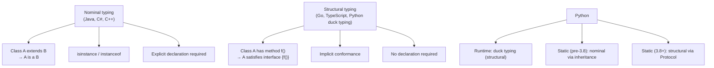
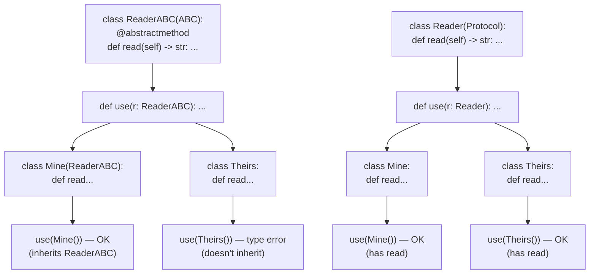
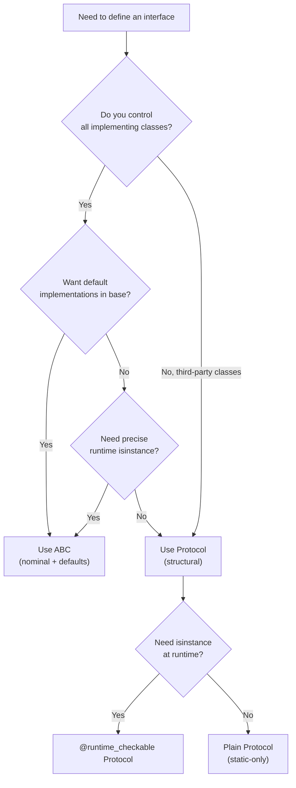
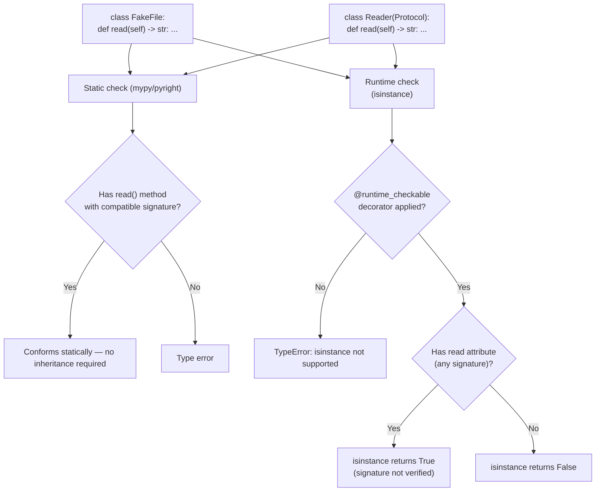
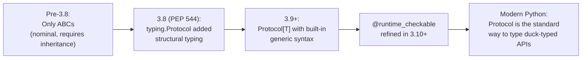

# 3. Protocols and Structural Typing

> [!note] Why this note exists
> Most typed languages use **nominal typing**: a class `Dog` is an `Animal` only if it explicitly inherits from `Animal`. Python's runtime uses **structural typing** (duck typing): a class is an `Animal` if it has all the methods `Animal` defines, regardless of inheritance. For most of Python's history, this duck typing was purely a runtime concept — type checkers couldn't see it. `typing.Protocol` (PEP 544, Python 3.8+) brings structural typing into the static type system: you define an interface by listing its methods, and **any class with matching methods satisfies the protocol automatically**, no inheritance required. This note covers structural vs nominal typing, defining `Protocol` classes, `@runtime_checkable`, protocol composition, comparison with ABCs, when to use each, and the subtle differences between static and runtime protocol checks.

## Why It Matters

Suppose you write a function that takes any "file-like" object:

```python
def read_all(source):
    return source.read()
```

It works with files, `StringIO`, `BytesIO`, third-party file-like classes, and your own mocks. The runtime doesn't care about the type — only that `source` has a `.read()` method. This is duck typing (see [[7. EAFP and Duck Typing]]).

But how do you **type** this? You could use `Any` and lose all checking. You could use `io.TextIOBase` and reject `StringIO` (which is a `TextIOBase` subclass, actually — but third-party mocks might not be). You could create an ABC `FileLike` and require every class to inherit — but you can't make third-party classes inherit from your ABC.

The right answer is a **Protocol**:

```python
from typing import Protocol

class Reader(Protocol):
    def read(self) -> str: ...

def read_all(source: Reader) -> str:
    return source.read()

# Now any class with a read() -> str method satisfies Reader:
class FakeFile:
    def read(self) -> str:
        return "fake data"

read_all(FakeFile())   # type-checks!
read_all(open("data.txt"))   # type-checks! (TextIOWrapper has read)
read_all("not a reader")     # type error
```

`FakeFile` doesn't inherit from `Reader`. It just has a `read` method with a compatible signature. mypy and pyright recognise this as **structural conformance** and accept it.

This is the static-typing equivalent of duck typing. It's how Python's type system reconciles its dynamic, structural runtime with the safety of static checking.

## Background: Nominal vs Structural Typing

Two ways to think about type compatibility:

- **Nominal**: types are compatible if their declarations say so (inheritance, interface implementation). Java, C#, C++ (mostly), Python's `isinstance`.
- **Structural**: types are compatible if they have the same shape (methods, attributes). Go interfaces, TypeScript, Python's duck typing.



Python is interesting because it's **both**:
- The runtime uses structural duck typing — `len(x)` works on any object with `__len__`, regardless of inheritance.
- The static type system was originally nominal (`isinstance`-style: a class is a subtype only if it inherits).
- `Protocol` adds structural typing to the static system, matching the runtime model.

## Defining a Protocol

A `Protocol` class looks like an ABC but uses `Protocol` as a base:

```python
from typing import Protocol

class SupportsClose(Protocol):
    def close(self) -> None: ...

class SupportsRead(Protocol):
    def read(self, size: int = -1) -> bytes: ...
```

Method bodies are `...` (or `pass`) — they're signatures only, like an interface in Java or TypeScript.

A class satisfies the protocol if it has methods with **compatible** signatures:

```python
class FileHandle:
    def close(self) -> None:
        ...
    def read(self, size: int = -1) -> bytes:
        ...

def use(x: SupportsClose) -> None:
    x.close()

use(FileHandle())   # OK — FileHandle satisfies SupportsClose
use("string")       # type error — str has no close()
```

Notice `FileHandle` doesn't inherit from `SupportsClose`. The conformance is structural.

### Properties and attributes

Protocols can declare attributes and properties:

```python
class Named(Protocol):
    name: str

class Person:
    def __init__(self, name: str) -> None:
        self.name = name

def greet(x: Named) -> str:
    return f"Hello, {x.name}"

greet(Person("Alice"))   # OK
greet(42)                # type error
```

### Methods with `self`

Protocol methods can use `self` typed as the protocol itself, which is the default:

```python
class Comparable(Protocol):
    def __lt__(self, other: "Comparable") -> bool: ...
```

Inside the protocol, `self` is the protocol type. Outside, the actual type is whatever satisfies the protocol.

### Generic protocols

Protocols can be generic:

```python
from typing import Protocol, TypeVar

T = TypeVar("T")

class Container(Protocol[T]):
    def __contains__(self, item: T) -> bool: ...

def contains(xs: Container[T], item: T) -> bool:
    return item in xs

# list[int] satisfies Container[int] because list has __contains__ with int
contains([1, 2, 3], 2)   # OK
```

See [[2. Generics and TypeVar]] for the broader generics story.

## `@runtime_checkable`

By default, `isinstance(x, SomeProtocol)` raises `TypeError`. To enable runtime checks, decorate the protocol with `@runtime_checkable`:

```python
from typing import Protocol, runtime_checkable

@runtime_checkable
class SupportsClose(Protocol):
    def close(self) -> None: ...

class FileHandle:
    def close(self) -> None: ...

isinstance(FileHandle(), SupportsClose)   # True
isinstance("string", SupportsClose)       # False
```

`@runtime_checkable` only checks for **attribute presence** at runtime, not signature compatibility. It's a coarse check — useful but not a substitute for static checking.

```python
@runtime_checkable
class Named(Protocol):
    name: str

class Bad:
    name = 123   # wrong type, but isinstance still returns True

isinstance(Bad(), Named)   # True — runtime doesn't verify type
```

> [!warning] `@runtime_checkable` only checks method/attribute existence
> It does not verify signatures, parameter types, or return types. Use it for coarse duck-type checks; rely on the static checker for the real verification.

## Protocol Composition

Protocols can inherit from each other to compose:

```python
class SupportsClose(Protocol):
    def close(self) -> None: ...

class SupportsRead(Protocol):
    def read(self, size: int = -1) -> bytes: ...

class FileLike(SupportsClose, SupportsRead, Protocol):
    """Both closeable and readable."""
    pass

def process(f: FileLike) -> bytes:
    data = f.read()
    f.close()
    return data
```

A class satisfies `FileLike` if it satisfies both `SupportsClose` and `SupportsRead`. Multiple inheritance of protocols is composition — the resulting protocol is the intersection of all members.

## Protocols vs ABCs

Both `Protocol` and `ABC` define interfaces, but they differ in conformance model:

| Aspect | `Protocol` | `ABC` |
| --- | --- | --- |
| Conformance | Structural (has the methods) | Nominal (inherits from ABC) |
| Works with third-party classes | Yes | No (unless they inherit) |
| Runtime check | Via `@runtime_checkable` (coarse) | Via `isinstance` (precise) |
| Default implementations | No | Yes (`@abstractmethod` with bodies) |
| Multiple inheritance | Composition | Mixin-style |
| Use case | Duck-typed interfaces | Inheritance-based contracts |

```python
from abc import ABC, abstractmethod

class ReaderABC(ABC):
    @abstractmethod
    def read(self) -> str: ...

class MyReader(ReaderABC):
    def read(self) -> str:
        return "data"

# Third-party class with read() doesn't satisfy ReaderABC
class ThirdPartyReader:
    def read(self) -> str:
        return "third-party"

def use(r: ReaderABC) -> str:
    return r.read()

use(MyReader())              # OK
use(ThirdPartyReader())      # type error — doesn't inherit ReaderABC
```

Compare to the `Protocol` version where `ThirdPartyReader` would be accepted.

Use ABCs when:
- You control the class hierarchy.
- You want default implementations in the base.
- You want precise `isinstance` checks at runtime.

Use Protocols when:
- You want to accept any class with the right shape.
- You're typing against third-party classes you can't modify.
- You want structural conformance (duck typing made static).

## Mermaid: Nominal vs Structural Typing



## Mermaid: When to Use Protocol vs ABC



## Built-in Protocols

`typing` and `collections.abc` provide many ready-made protocols:

| Protocol | Method(s) |
| --- | --- |
| `Iterable[T]` | `__iter__` |
| `Iterator[T]` | `__iter__`, `__next__` |
| `Sized` | `__len__` |
| `Container[T]` | `__contains__` |
| `Collection[T]` | `__len__`, `__iter__`, `__contains__` |
| `Sequence[T]` | `__getitem__`, `__len__` |
| `MutableSequence[T]` | Sequence + `__setitem__`, `__delitem__`, insert, append |
| `Mapping[K, V]` | `__getitem__`, `__len__`, `__iter__` |
| `MutableMapping[K, V]` | Mapping + `__setitem__`, `__delitem__` |
| `Hashable` | `__hash__`, `__eq__` |
| `Callable[..., R]` | `__call__` |
| `Awaitable[T]` | `__await__` |
| `AsyncIterable[T]` | `__aiter__` |
| `Reversible[T]` | `__reversed__` |

These come in two flavours:
- `collections.abc` versions are ABCs (nominal, support `isinstance`).
- `typing` versions are aliases that work both as ABCs and (since 3.9) as protocols.

Use them as parameter types wherever you want duck typing:

```python
from collections.abc import Iterable, Mapping

def count_all(xs: Iterable[int]) -> int:
    return sum(xs)

def get_keys(m: Mapping[str, int]) -> list[str]:
    return list(m.keys())
```

## Real-World Protocol Examples

### The `SupportsRead` / `SupportsWrite` family

The standard library uses Protocols (or their ABC equivalents) to express "file-like" interfaces:

```python
from typing import Protocol, runtime_checkable

@runtime_checkable
class SupportsRead(Protocol):
    def read(self, size: int = -1) -> bytes: ...

@runtime_checkable
class SupportsWrite(Protocol):
    def write(self, data: bytes) -> int: ...

@runtime_checkable
class SupportsClose(Protocol):
    def close(self) -> None: ...

# Compose
class FileLike(SupportsRead, SupportsWrite, SupportsClose, Protocol):
    """A binary file-like object."""
    pass

def copy(src: SupportsRead, dst: SupportsWrite) -> None:
    while True:
        chunk = src.read(4096)
        if not chunk:
            break
        dst.write(chunk)
```

`copy` accepts any pair of objects with the right `read`/`write` methods — files, `BytesIO`, network sockets, custom streams.

### The `Hashable` and `Sized` family

`collections.abc` ships Protocols for the common dunder-based interfaces. Their `typing` aliases are also usable as Protocols:

```python
from collections.abc import Hashable, Sized, Container, Iterable

def dedupe(items: Iterable[Hashable]) -> list[Hashable]:
    seen: set[Hashable] = set()
    result = []
    for x in items:
        if x not in seen:
            seen.add(x)
            result.append(x)
    return result

def total_size(things: Sized) -> int:
    return len(things)
```

### The `SupportsInt` / `SupportsFloat` family

`typing` ships `SupportsInt`, `SupportsFloat`, `SupportsComplex`, `SupportsBytes`, `SupportsIndex` — Protocols for "has an `__int__` method", etc.:

```python
from typing import SupportsInt, SupportsFloat

def sum_as_float(xs: list[SupportsFloat]) -> float:
    return sum(float(x) for x in xs)

sum_as_float([1, 2.5, "3.14", Decimal("0.1")])  # all support float()
```

### Custom Protocol for plugin systems

```python
from typing import Protocol, TypeVar

C = TypeVar("C")

class Plugin(Protocol):
    name: str
    def initialize(self, config: dict) -> None: ...
    def run(self) -> None: ...
    def shutdown(self) -> None: ...

def load_plugins(paths: list[str]) -> list[Plugin]:
    plugins = []
    for path in paths:
        module = importlib.import_module(path)
        # Expect module.Plugin to satisfy the Protocol
        plugin = module.Plugin()
        plugins.append(plugin)
    return plugins
```

Any class with the right shape works as a plugin, regardless of inheritance.

### Generic Protocol example

```python
from typing import Protocol, TypeVar

T = TypeVar("T")

class StackLike(Protocol[T]):
    def push(self, item: T) -> None: ...
    def pop(self) -> T: ...
    def peek(self) -> T: ...

def transfer(src: StackLike[T], dst: StackLike[T]) -> None:
    while True:
        try:
            dst.push(src.pop())
        except IndexError:
            break

# list[int] doesn't quite satisfy (no peek), but a custom Stack[int] does
class Stack:
    def __init__(self): self._items = []
    def push(self, x): self._items.append(x)
    def pop(self): return self._items.pop()
    def peek(self): return self._items[-1]

s1: Stack[int] = Stack(); s1.push(1); s1.push(2)
s2: Stack[int] = Stack()
transfer(s1, s2)   # type-checks
```

## Mermaid: Protocol Conformance Check (Static vs Runtime)



The static check is precise (signature-aware); the runtime check is coarse (attribute-presence only). This asymmetry is the source of most Protocol-related confusion.

## Mermaid: Protocol Evolution Over Time



## Common Pitfalls

### Mistaking Protocol for an ABC

A frequent source of confusion is treating a Protocol like an ABC and inheriting from it explicitly. This works but is misleading:

```python
class Reader(Protocol):
    def read(self) -> str: ...

# This is legal but unnecessary:
class MyFile(Reader):
    def read(self) -> str:
        return "data"
```

The explicit inheritance is redundant — `MyFile` would satisfy `Reader` structurally even without it. The only reason to inherit explicitly is to opt into the ABC-style behaviour (like `isinstance` without `@runtime_checkable`, or using the Protocol as a mixin with default method bodies — but Protocols don't support the latter).

### Using Protocols as base classes with state

Protocols can't have instance state (`__init__`, instance attributes). They are pure interfaces. If you need state, use an ABC:

```python
# This does NOT work — Protocol is not a regular base class
class Base(Protocol):
    def __init__(self, x: int): ...   # ignored
    value: int                        # declared as attribute, not state

# Use an ABC instead
class Base(ABC):
    def __init__(self, x: int):
        self.value = x
    @abstractmethod
    def process(self) -> None: ...
```

### Inheriting from `Protocol` and a concrete class

You can inherit a Protocol from another Protocol or from `Protocol` itself, but mixing in concrete classes is fragile. Stick to interface-only inheritance.

## Common Pitfalls (original list)

(See items below; the additional pitfalls above complement this list.)

1. **Forgetting `@runtime_checkable` for `isinstance` checks.** Without it, `isinstance(x, SomeProtocol)` raises `TypeError`.

2. **Trusting `@runtime_checkable` to verify signatures.** It only checks attribute/method **existence**, not types. Use the static checker for real verification.

3. **Expecting Protocol to provide default implementations.** Protocols are interfaces only; they don't have state or default method bodies. Use an ABC if you need defaults.

4. **Confusing `Protocol` with `ABC`.** ABCs require explicit inheritance; Protocols are structural. They look similar but have different conformance rules.

5. **Putting real bodies in Protocol methods.** The body of a protocol method should be `...` or `pass`. A real body has no effect (the protocol doesn't run; only implementing classes do).

6. **Protocol method `self` type.** Inside a Protocol, `self` is the protocol type by default. Don't try to annotate it as the implementing class — there's no implementing class.

7. **Module-level protocol vs class-level.** Protocols are usually defined at module level. Defining them inside a class is legal but limits visibility.

8. **Generic protocols without explicit `Generic`.** `class Container(Protocol[T]):` requires `T = TypeVar("T")` at module level (or PEP 695 syntax in 3.12+). Forgetting the `TypeVar` gives confusing errors.

9. **Mixing structural and nominal conformance.** A class can satisfy a Protocol structurally and also inherit from a different ABC nominally. The two systems coexist; just be clear which you're using.

10. **`isinstance(x, Protocol)` without `@runtime_checkable`.** Even with `@runtime_checkable`, only attribute presence is checked — signatures are ignored.

11. **Protocol classes being instantiated.** You shouldn't instantiate a Protocol class directly — it's an interface, not a concrete class. mypy will warn if you try.

12. **Protocol methods that should be `staticmethod` or `classmethod`.** Annotate them as such inside the protocol:

    ```python
    class Factory(Protocol):
        @classmethod
        def create(cls) -> "Factory": ...
    ```

## Tips and Tricks

- **Use `Protocol` for duck-typed parameters** instead of `Any` or a too-specific class.
- **Use `@runtime_checkable` only when you need `isinstance` checks.** It's a coarse check; don't rely on it for type safety.
- **Compose Protocols via multiple inheritance** to express intersection types.
- **Use built-in protocols from `collections.abc`** (`Iterable`, `Mapping`, `Sequence`) — they're well-tested and widely understood.
- **Prefer `Protocol` over `Union` of concrete types** when the unifying concept is "has these methods".
- **Document Protocols clearly.** They're contracts; readers need to know what's expected.
- **Mark Protocol classes explicitly as such** (`class X(Protocol):`) so they're not mistaken for ABCs.
- **Don't put logic in Protocols.** They're interfaces; logic lives in implementing classes or in helper functions.
- **Use `Protocol` + `TypeVar`** to express structural-generic interfaces (e.g. `Container[T]`).
- **Test structural conformance** by writing small fixture classes that satisfy the protocol but don't inherit.

## Active Recall

1. Define "structural typing" vs "nominal typing" in one sentence each.
2. Write a `Protocol` named `Closeable` with a `close()` method.
3. Why doesn't `FakeFile` need to inherit from `Reader` to satisfy the `Reader` protocol?
4. What does `@runtime_checkable` enable?
5. Why is `@runtime_checkable` not a substitute for static checking?
6. Compose two protocols (`SupportsRead`, `SupportsClose`) into `FileLike`.
7. When would you use an ABC instead of a Protocol?
8. When would you use a Protocol instead of an ABC?
9. Name three built-in protocols from `collections.abc`.
10. Can a Protocol have default method implementations? Explain.
11. Write a generic `Container[T]` protocol with `__contains__`.
12. Why shouldn't you instantiate a Protocol class?
13. What goes in the body of a Protocol method — `...` or `pass`?
14. Convert this ABC to a Protocol:
    ```python
    class Greeter(ABC):
        @abstractmethod
        def greet(self) -> str: ...
    ```
15. How does a Protocol interact with `isinstance`?
16. What is the difference between `collections.abc.Iterable` and `typing.Iterable`?
17. Write a Protocol with a class method.
18. Can a class satisfy a Protocol without inheriting from it?
19. What happens if you add a real body to a Protocol method?
20. Why is `Protocol` the static-typing equivalent of duck typing?

## Next Steps

- [[1. Basic Type Hints]] — the foundations this note builds on.
- [[2. Generics and TypeVar]] — generic protocols (`Protocol[T]`).
- [[4. TypedDict and Literal]] — another structural typing tool for dicts.
- [[5. mypy and pyright]] — the checkers that verify Protocol conformance.
- [[7. EAFP and Duck Typing]] — the runtime duck-typing story that Protocols formalise.
- [[4. Polymorphism and Duck Typing]] (Chapter 8) — the OOP-side treatment of duck typing.
