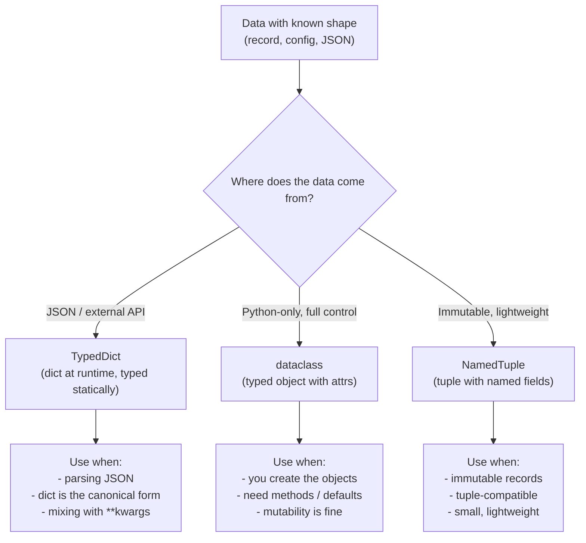
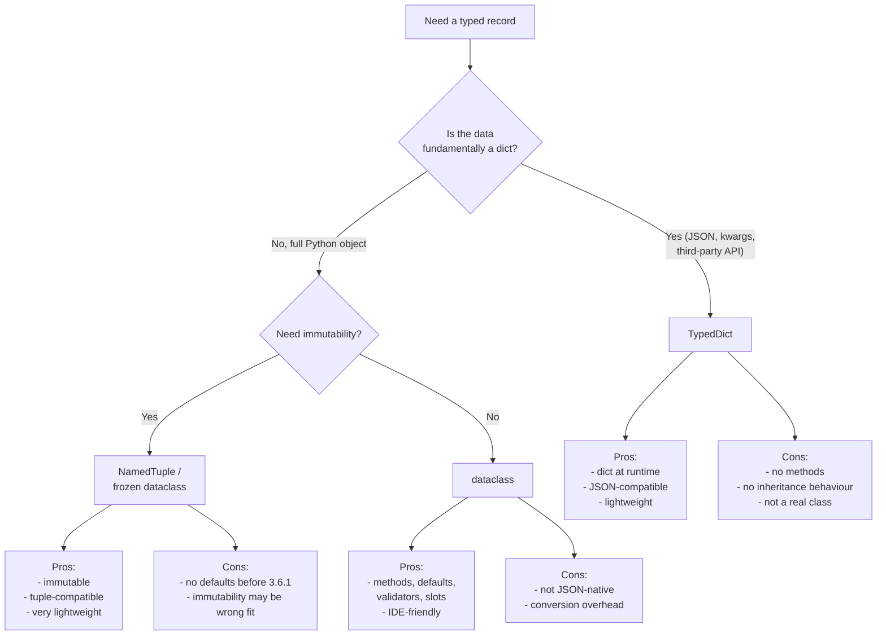
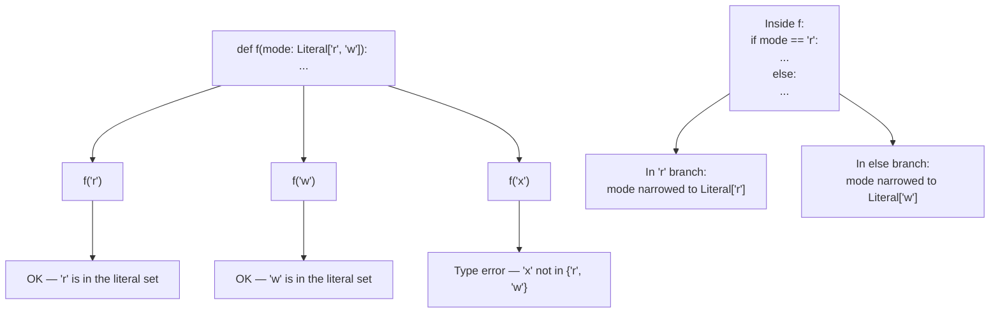
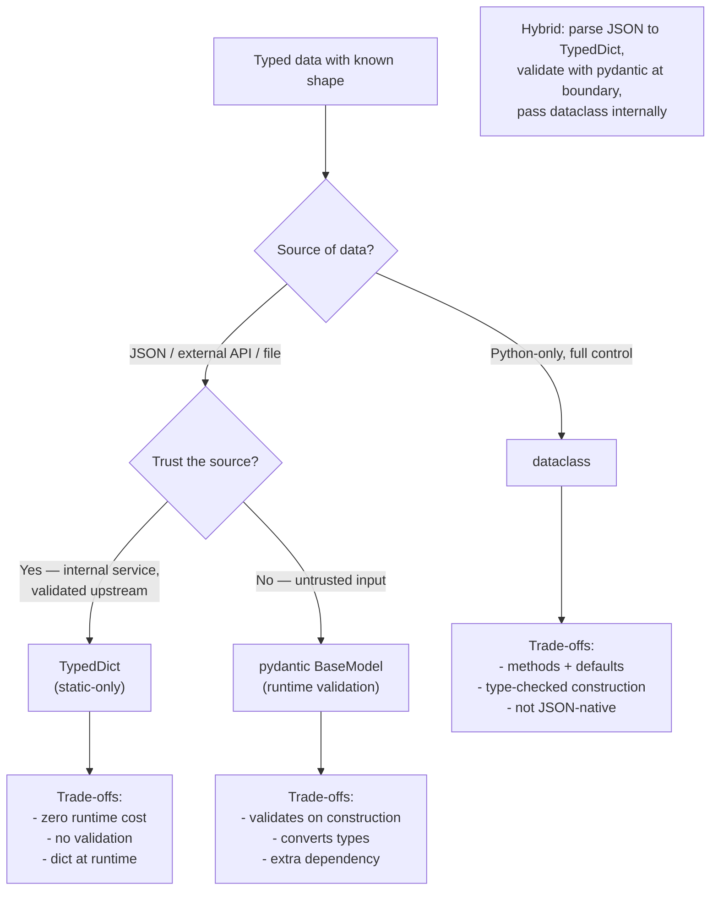

# 4. TypedDict and Literal

> [!note] Why this note exists
> Python dicts are ubiquitous — they're the JSON of the language, the default shape for configuration, request bodies, and parsed data. But `dict[str, Any]` throws away everything you know about the keys and their value types. `TypedDict` (PEP 589, Python 3.8+) brings static typing to dicts of known shape: you declare which keys exist, what type each value is, and whether each key is required or optional. `Literal` (PEP 586, Python 3.8+) is the matching tool for value-as-type: instead of `mode: str` (any string), you write `mode: Literal["read", "write"]` (only those two strings). Together they let you type the most common "struct-like" data in Python without giving up the dict's flexibility. This note covers `TypedDict` syntax (class and functional), `total=True/False`, `Required` and `NotRequired` (Python 3.11+), `Literal` for enum-like strings and ints, using `Literal` for branching type narrowing, and the comparison with `dataclass` and `NamedTuple`.

## Why It Matters

Consider a function that takes a user record:

```python
def display(user):
    print(f"{user['name']} (age {user['age']})")
    if user.get("email"):
        print(f"  email: {user['email']}")
```

What's the shape of `user`? You can't tell. Does it always have `name` and `age`? Is `email` optional? Are ages ints or strings? The function will crash at runtime if a key is missing or the wrong type.

With `TypedDict`:

```python
from typing import TypedDict, NotRequired

class User(TypedDict):
    name: str
    age: int
    email: NotRequired[str]

def display(user: User) -> None:
    print(f"{user['name']} (age {user['age']})")
    if "email" in user:
        print(f"  email: {user['email']}")
```

Now the type checker verifies:
- Every `User` passed to `display` has `name: str` and `age: int`.
- `email` is optional but, if present, is a `str`.
- `display` doesn't access keys that don't exist on `User`.

And `Literal` lets you constrain values to a closed set:

```python
from typing import Literal

def set_mode(mode: Literal["read", "write", "append"]) -> None:
    ...

set_mode("read")     # OK
set_mode("delete")   # type error
```

Together, `TypedDict` and `Literal` cover the most common "shape" typing needs in real Python code: typed dicts for JSON-like data, and literal types for enum-like values. They're the alternative to `dict[str, Any]` and bare `str` parameters.

## Background

### Why not just `dict[str, X]`?

`dict[str, int]` says "all values are ints". It doesn't say which keys exist or that different keys have different value types. For data with a fixed shape — a record, a config object, a parsed JSON object — you want **per-key typing**, which `dict[K, V]` cannot express.

### Why not just `dataclass`?

`dataclass` is great when you control the data's lifecycle in Python. But:
- JSON parsing produces `dict`, not dataclass instances. You'd have to convert.
- APIs that accept arbitrary kwargs often pass `**kwargs: Any` — `TypedDict` can type this (PEP 692).
- Migration: existing code uses dicts everywhere; converting to dataclasses is invasive.

`TypedDict` lets you type the dict in place without changing the runtime representation.



## `TypedDict` Syntax

### Class syntax (preferred)

```python
from typing import TypedDict

class User(TypedDict):
    name: str
    age: int
    email: str
```

This declares a `TypedDict` named `User` with three required keys. At runtime, `User` is just `dict` — `isinstance(user, dict)` is `True`, and `isinstance(user, User)` raises `TypeError` (TypedDicts aren't real classes).

```python
u: User = {"name": "Alice", "age": 30, "email": "alice@example.com"}
print(u["name"])   # Alice
print(type(u))     # <class 'dict'>  — at runtime, it's a dict
```

### Functional syntax

For when the class syntax is awkward (e.g. keys that aren't valid identifiers):

```python
from typing import TypedDict

User = TypedDict("User", {"name": str, "age": int, "email": str})

# With a key that's not a valid identifier
Headers = TypedDict("Headers", {"Content-Type": str, "X-Request-Id": str})
```

### `total=True` (default)

By default, all keys are required. `total=False` makes all keys optional:

```python
class UpdateUser(TypedDict, total=False):
    name: str
    age: int
    email: str

# All of these are valid:
u1: UpdateUser = {}
u2: UpdateUser = {"name": "Alice"}
u3: UpdateUser = {"name": "Bob", "age": 25, "email": "bob@example.com"}
```

### `Required` and `NotRequired` (Python 3.11+)

For mixed required/optional keys, use `Required` and `NotRequired` instead of `total=False`:

```python
from typing import TypedDict, Required, NotRequired

class User(TypedDict):
    name: Required[str]       # always required
    age: NotRequired[int]     # optional
    email: NotRequired[str]   # optional

# Valid:
u1: User = {"name": "Alice"}
u2: User = {"name": "Bob", "age": 25}

# Invalid:
u3: User = {"age": 25}   # type error — name is required
```

Before 3.11, you'd use `total=False` on a subclass or use `typing_extensions.NotRequired`.

### Inheritance

`TypedDict` classes can inherit from each other:

```python
class BaseUser(TypedDict):
    id: int
    name: str

class UserWithEmail(BaseUser):
    email: str

# UserWithEmail has id, name, email — all required
```

Inheritance composes the keys. `total` is per-class; you can mix required and optional by inheriting.

### Readonly (Python 3.13+)

PEP 705 adds `ReadOnly` for keys that shouldn't be mutated:

```python
from typing import TypedDict, ReadOnly

class Config(TypedDict):
    host: ReadOnly[str]
    port: int

# port can be changed; host cannot (statically)
```

## Using `TypedDict` Values

```python
def greet(user: User) -> str:
    return f"Hello, {user['name']}"

def maybe_email(user: User) -> str | None:
    if "email" in user:
        return user["email"]
    return None
```

The type checker narrows `user` based on key checks. After `if "email" in user:`, the `email` key is known to be present.

### Constructing a `TypedDict`

You can use the class as a constructor:

```python
u = User(name="Alice", age=30, email="alice@example.com")
```

Or pass a dict literal — the checker validates the keys:

```python
u: User = {"name": "Alice", "age": 30, "email": "alice@example.com"}
```

Extra keys are an error:

```python
u: User = {"name": "Alice", "age": 30, "email": "...", "extra": True}  # type error
```

### `**kwargs` with `TypedDict` (PEP 692, Python 3.11+)

```python
from typing import TypedDict, Unpack

class UserKwargs(TypedDict):
    name: str
    age: int
    email: NotRequired[str]

def create_user(**kwargs: Unpack[UserKwargs]) -> User:
    return kwargs   # type-checks as User
```

This lets you type functions that accept `**kwargs` of a known shape.

## `Literal` Type

`Literal` lets you use specific values as types. It works with strings, ints, bytes, bools, `None`, and `Enum` members:

```python
from typing import Literal

def set_mode(mode: Literal["read", "write", "append"]) -> None:
    ...

def set_color(color: Literal["red", "green", "blue"]) -> None:
    ...

def set_log_level(level: Literal[10, 20, 30, 40, 50]) -> None:
    ...

def set_flag(flag: Literal[True]) -> None:   # only True accepted
    ...
```

Callers can pass only the listed values:

```python
set_mode("read")      # OK
set_mode("delete")    # type error
set_log_level(20)     # OK
set_log_level(15)     # type error
```

### Literal for branching

`Literal` enables type narrowing in conditional branches:

```python
from typing import Literal

def process(shape: Literal["circle", "square"]):
    if shape == "circle":
        # shape is narrowed to Literal["circle"]
        ...
    else:
        # shape is narrowed to Literal["square"]
        ...
```

The checker knows which branch corresponds to which literal value.

### Literal composition

`Literal["a"] | Literal["b"]` is equivalent to `Literal["a", "b"]`. You can compose:

```python
Mode = Literal["read", "write"]
Special = Literal["append"]
AllModes = Mode | Special   # Literal["read", "write", "append"]
```

### `Literal` vs `Enum`

`Literal` and `Enum` solve similar problems. Tradeoffs:

| Aspect | `Literal` | `Enum` |
| --- | --- | --- |
| Runtime representation | Plain string/int | `Enum` member |
| Iterability | Not iterable | `Enum.__members__` |
| Comparison | `mode == "read"` | `mode == Mode.READ` |
| IDE autocomplete | Yes (in type context) | Yes |
| Serialization | Already a string | Need `.value` |
| Backwards compat with old code | Yes (strings still work) | No (must use enum) |

Use `Literal` when:
- You're typing existing string parameters.
- The values are part of an external API (JSON, CLI flags).
- You don't need iteration or methods.

Use `Enum` when:
- You need iteration (`for mode in Mode:`).
- You want methods on the members.
- The values are internal to your codebase.

### `LiteralString` (Python 3.11+)

PEP 675 adds `LiteralString` for type-safe string formatting — a string known at type-check time:

```python
from typing import LiteralString

def query(sql: LiteralString) -> None:
    # Only string literals accepted, preventing SQL injection
    ...

query("SELECT * FROM users")        # OK
query(f"SELECT * FROM {table}")     # type error — not a literal
query(user_input)                   # type error
```

Useful for security-sensitive APIs that must reject dynamic strings.

## Mermaid: TypedDict vs dataclass vs NamedTuple



## Mermaid: Literal Narrowing Flow



## Real-World Patterns

### Typing JSON responses

A common use case is typing the shape of a JSON response from an API:

```python
from typing import TypedDict, Literal, NotRequired

class Address(TypedDict):
    street: str
    city: str
    postal_code: str
    country: str

class User(TypedDict):
    id: int
    name: str
    email: str
    role: Literal["admin", "member", "guest"]
    address: NotRequired[Address]
    tags: NotRequired[list[str]]

def fetch_user(user_id: int) -> User:
    response = requests.get(f"https://api.example.com/users/{user_id}")
    return response.json()   # mypy can't verify the shape, but the type annotation documents it
```

For runtime validation of untrusted JSON, use **pydantic** — it validates and converts:

```python
from pydantic import BaseModel, EmailStr

class User(BaseModel):
    id: int
    name: str
    email: EmailStr
    role: Literal["admin", "member", "guest"]

user = User.model_validate_json(response.text)   # validates and parses
```

Use `TypedDict` when you trust the source and just want static typing; use `pydantic` when you need runtime validation.

### Typing `**kwargs` for keyword argument groups

```python
from typing import TypedDict, Unpack

class DatabaseConfig(TypedDict):
    host: str
    port: int
    user: str
    password: str
    database: str
    timeout: NotRequired[float]

def connect(**kwargs: Unpack[DatabaseConfig]) -> Connection:
    return Connection(**kwargs)

connect(host="localhost", port=5432, user="alice", password="secret", database="app")
connect(host="localhost", port=5432, user="alice", password="secret", database="app", timeout=30.0)
connect(host="localhost", port=5432)   # type error — missing required keys
```

This is much safer than `**kwargs: Any`.

### CLI argument shapes

```python
class CLIArgs(TypedDict):
    input_file: str
    output_file: str
    verbose: bool
    mode: Literal["fast", "thorough"]
    max_retries: NotRequired[int]

def run(args: CLIArgs) -> None:
    if args["mode"] == "fast":
        ...
    elif args["mode"] == "thorough":
        ...
```

### Configuration files

```python
class ServerConfig(TypedDict):
    host: str
    port: int
    workers: int
    debug: bool
    allowed_origins: list[str]

def load_config(path: str) -> ServerConfig:
    with open(path) as f:
        return json.load(f)   # type: ServerConfig
```

### Literal for state machines

```python
from typing import Literal

State = Literal["idle", "loading", "ready", "error"]
Event = Literal["start", "success", "failure", "reset"]

def transition(state: State, event: Event) -> State:
    if state == "idle" and event == "start":
        return "loading"
    if state == "loading" and event == "success":
        return "ready"
    if state == "loading" and event == "failure":
        return "error"
    if state in ("ready", "error") and event == "reset":
        return "idle"
    return state   # no transition
```

The checker verifies that you handle every combination, and that the returned state is one of the valid `State` literals.

### Literal for tagged unions

A common pattern for variant types:

```python
from typing import TypedDict, Literal, Union

class Circle(TypedDict):
    kind: Literal["circle"]
    radius: float

class Square(TypedDict):
    kind: Literal["square"]
    side: float

class Triangle(TypedDict):
    kind: Literal["triangle"]
    base: float
    height: float

Shape = Union[Circle, Square, Triangle]

def area(shape: Shape) -> float:
    if shape["kind"] == "circle":
        return 3.14159 * shape["radius"] ** 2
    elif shape["kind"] == "square":
        return shape["side"] ** 2
    elif shape["kind"] == "triangle":
        return 0.5 * shape["base"] * shape["height"]
```

The `kind` field is a **discriminator**; the checker narrows to the right `TypedDict` based on its value. This is the Python equivalent of a sum type or tagged union.

### Literal for type-safe IDs

```python
from typing import Literal, NewType

UserId = NewType("UserId", int)
OrderId = NewType("OrderId", int)

def get_user(uid: UserId) -> User: ...
def get_order(oid: OrderId) -> Order: ...

uid = UserId(42)
oid = OrderId(99)
get_user(uid)   # OK
get_user(oid)   # type error — expected UserId, got OrderId
```

`NewType` creates a distinct type at the static level; at runtime it's just `int`. Combined with `Literal`, you can build very precise type-safe APIs.

## Mermaid: When to Use TypedDict vs pydantic vs dataclass



## Common Pitfalls

### The static-vs-runtime asymmetry

`TypedDict` and `Literal` are static-only constructs. The runtime sees a `TypedDict` instance as a plain `dict`, and a `Literal["a", "b"]` parameter as accepting any value of the underlying type. This means:

- `isinstance({"name": "Alice"}, User)` raises `TypeError` — TypedDicts aren't runtime classes.
- A function annotated `mode: Literal["read", "write"]` will accept `mode="delete"` at runtime — the check is static only.
- `json.loads` returns a `dict`, not a `User` — the type annotation is documentation for the checker, not a runtime cast.

For runtime enforcement, pair these types with **pydantic** (validates and converts) or manual `isinstance` checks at the boundary.

1. **Forgetting that `TypedDict` is a dict at runtime.** `isinstance(x, User)` raises `TypeError`. Use `isinstance(x, dict)` or check keys manually.

2. **Assuming `TypedDict` enforces at runtime.** It doesn't. The checker enforces statically; at runtime, a `User` is just a `dict`.

3. **Confusing `total=True` (default) with `total=False`.** With `total=True`, all keys are required; with `total=False`, all are optional. Mixing requires `Required`/`NotRequired` (3.11+).

4. **Adding extra keys at construction.** `User(name=..., age=..., email=..., extra=...)` is a type error. TypedDicts are closed by default.

5. **Using `TypedDict` as a real class.** You can't add methods, `__init__`, or `__repr__` to a TypedDict. It's a type-level construct, not a runtime class.

6. **Confusing `Literal` with `Enum`.** `Literal` is for closed sets of plain values; `Enum` is for closed sets of named members. Pick based on whether you need member names.

7. **Using `Literal` with mutable values.** `Literal[[], {}]` is invalid — only immutable scalars are allowed.

8. **Forgetting that `Literal[True]` and `Literal[1]` are different.** `True == 1` but `Literal[True]` and `Literal[1]` are distinct types because `True` is `bool` and `1` is `int`.

9. **Narrowing on `Literal` requires `==`, not `is`.** `if mode is "r":` doesn't narrow in all checkers; use `if mode == "r":`.

10. **`Unpack[TypedDict]` for `**kwargs` requires Python 3.11+.** Before that, use `typing_extensions.Unpack`.

11. **`Required` and `NotRequired` are 3.11+.** Before that, only `total=True/False` is available natively; use `typing_extensions` for older versions.

12. **Inheriting from `TypedDict` and a regular class.** TypedDicts can only inherit from other TypedDicts. Mixing with regular classes is a type error.

## Tips and Tricks

- **Use `TypedDict` for JSON shapes** — the natural fit for parsed JSON.
- **Use `dataclass` for Python-native records** where you control creation and want methods.
- **Use `NamedTuple` for immutable, tuple-compatible records** — especially when interfacing with code that expects tuples.
- **Use `Required` and `NotRequired` (3.11+)** to mix required and optional keys in one TypedDict.
- **Use `Unpack[TypedDict]` (3.11+)** to type `**kwargs` of a known shape.
- **Use `Literal` for closed-set string parameters** instead of free-form `str`.
- **Use `Literal` for branching** — the checker narrows in each branch.
- **Use `LiteralString` (3.11+) for security-sensitive APIs** that must reject dynamic strings.
- **Prefer `Literal` over `Enum` when interfacing with JSON or external APIs** — strings stay strings.
- **Document TypedDicts clearly** — they're often your public API's shape.
- **Validate at boundaries** — TypedDicts are static; if data comes from an untrusted source, validate at runtime (e.g. with pydantic).
- **Combine `TypedDict` with `Protocol`** for fully structural-typed interfaces.

## Active Recall

1. What problem does `TypedDict` solve that `dict[str, X]` cannot?
2. Write a `TypedDict` named `User` with `name: str`, `age: int`, `email: str`.
3. What does `total=False` do on a `TypedDict`?
4. Use `Required` and `NotRequired` (3.11+) to make `name` required and `email` optional in the same `User` TypedDict.
5. Write the functional syntax for a `TypedDict` with a `"Content-Type"` key.
6. Can you call `isinstance(x, User)` on a TypedDict? Explain.
7. Write a `Literal` type accepting only `"GET"`, `"POST"`, `"PUT"`, `"DELETE"`.
8. Why is `Literal[True]` different from `Literal[1]`?
9. Use `Literal` to narrow `mode` in an `if mode == "r":` branch.
10. When would you use `Literal` instead of `Enum`?
11. When would you use `Enum` instead of `Literal`?
12. What does `Unpack[UserKwargs]` enable in a function signature?
13. Convert this dict to a `TypedDict`:
    ```python
    config = {"host": "localhost", "port": 8080, "debug": True}
    ```
14. What is `LiteralString` (3.11+) for?
15. Can a `TypedDict` inherit from a regular class? From another `TypedDict`?
16. Write a function that accepts a `User` TypedDict and prints the email only if it's present.
17. Compare `TypedDict`, `dataclass`, and `NamedTuple` for representing a parsed JSON object.
18. Why can't you add methods to a `TypedDict`?
19. What happens at runtime when you construct `User(name="Alice", age=30)` for a TypedDict?
20. Use `Literal` to type a function that takes a direction `"up" | "down" | "left" | "right"`.

## Next Steps

- [[1. Basic Type Hints]] — the foundations this note builds on.
- [[2. Generics and TypeVar]] — generic TypedDicts are possible.
- [[3. Protocols and Structural Typing]] — another structural-typing tool.
- [[5. mypy and pyright]] — the checkers that verify TypedDicts and Literal narrowing.
- [[9. Standard Library Deep Dive/10. typing]] — the `typing` module reference.
