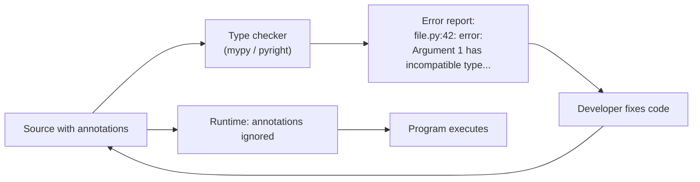
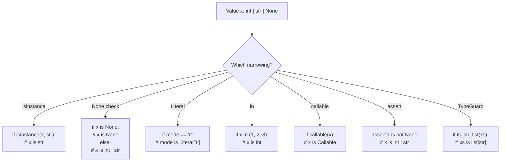
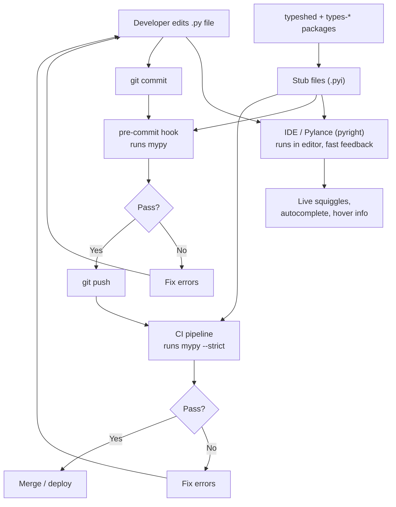
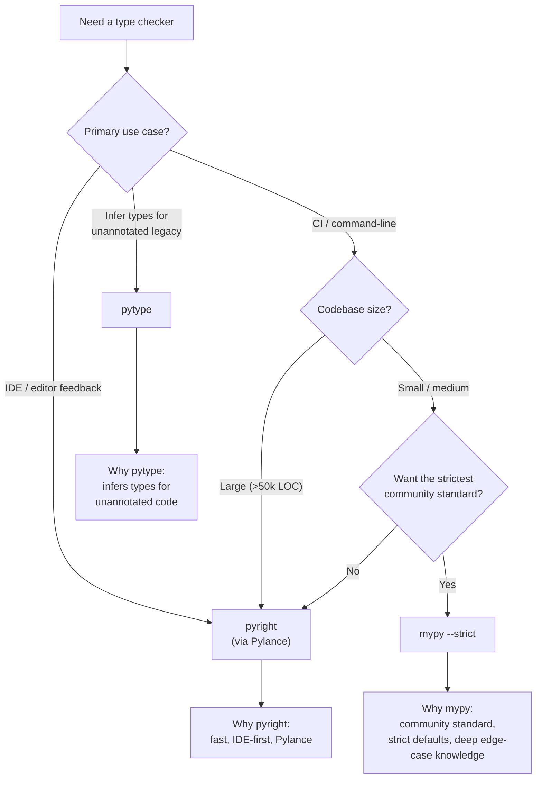
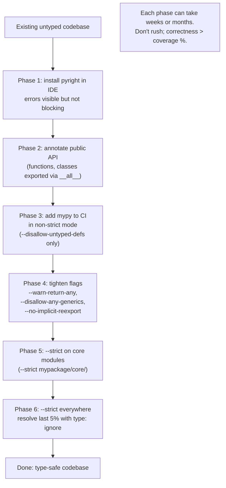

# 5. mypy and pyright

> [!note] Why this note exists
> Type hints are inert without a tool to check them. **mypy** is the original Python type checker — slow but thorough, with the strictest defaults and the deepest understanding of edge cases. **pyright** (Microsoft) is the modern fast checker that powers VS Code's Pylance extension and is increasingly the default in industry. **pytype** (Google) infers types for unannotated code. Together they make type hints actionable. This note covers what each tool does, how to configure them, strict-mode flags, type narrowing (how checkers follow `isinstance`, `None` checks, and `Literal` branches), type stubs (`.pyi` files), the typeshed repository, common error categories, and how to integrate them into CI. If [[1. Basic Type Hints]] through [[4. TypedDict and Literal]] are the language, this note is the compiler.

## Why It Matters

Type hints without a checker are documentation, not enforcement. A function annotated `def f(x: int) -> str:` can still be called with `f("hello")` and the runtime won't complain. To get the safety benefits, you need a tool that reads your code and reports violations.



The checker reads your source (or compiled stubs) and verifies that:
- Function arguments match their declared types.
- Return values match their declared return types.
- Variable assignments respect declared or inferred types.
- Operations are valid for the types involved (`"x" + 1` is an error).
- Generic type parameters are consistent.
- `Optional` values are narrowed before use.

Without a checker in your workflow, type hints are decoration. With one, they become a real safety net — bugs are caught at edit time, refactors are safe, and the type annotations serve as machine-checked documentation.

## Background

Python's type-hint system was formalised in PEP 484 (2014), but PEP 484 was deliberately **agnostic** about which tool would check the annotations. The PEP defined the *language* of types (`Optional`, `Union`, `Callable`, `TypeVar`, `Generic`); the *checker* was left to the ecosystem. Three projects rose to prominence:

- **mypy** (2012-, Jukka Lehtosalo) — originally a research project for a Python-like gradually-typed language, then refactored into a type checker for standard Python. The reference implementation; PEP 484's semantics are essentially "what mypy does".
- **pyright** (2017-, Microsoft) — a fast TypeScript-based checker built for VS Code's Pylance extension. Faster than mypy, with strong incremental analysis.
- **pytype** (2017-, Google) — a tool that **infers** types for unannotated code, suitable for gradually adding types to legacy codebases.

All three consume the same PEP 484 type-hint language. They differ in implementation language, performance, defaults, and edge-case interpretation, but a well-typed codebase should pass all three.

The two dominant workflows are:
1. **pyright in the IDE** (fast feedback as you type) **+ mypy in CI** (strict enforcement on every push).
2. **pyright everywhere** (single tool, simpler config, slightly less strict defaults).

This note covers both tools equally, plus the runtime-side concepts (type narrowing, stubs, typeshed) that all checkers share.

## The Three Main Checkers

### mypy

- **Origin**: The original Python static type checker, maintained by the Python community. Created by Jukka Lehtosalo, the same person who led PEP 484.
- **Implementation**: Python (with C extensions for speed in some places).
- **Speed**: Slower than pyright. Large codebases can take minutes per check.
- **Strictness**: Configurable, with the strictest defaults when `--strict` is enabled.
- **Best for**:CI pipelines, projects where correctness matters more than speed, integration with the broader Python typing community.

### pyright

- **Origin**: Microsoft, written in TypeScript. Powers Pylance (the VS Code Python extension).
- **Implementation**: TypeScript, runs on Node.js.
- **Speed**: Fast — typically 10x or more faster than mypy. Incremental checking is excellent.
- **Strictness**: Configurable, with three presets (`off`, `basic`, `strict`).
- **Best for**: IDE integration, large codebases, developers who want fast feedback.
- **Pyright is also the basis for `basedpyright`** — a community fork with stricter defaults and additional features.

### pytype

- **Origin**: Google.
- **Implementation**: Python.
- **Special feature**: **Infers types** for unannotated code. You can run pytype on a codebase with no annotations and get useful type information.
- **Best for**: Gradually adding types to legacy code; Google-internal workflows.

### Comparison table

| Tool | Speed | Strictness | Infers types | IDE | Best for |
| --- | --- | --- | --- | --- | --- |
| mypy | Slow | Very strict (with `--strict`) | No | Limited | CI, correctness |
| pyright | Fast | Configurable | No | Excellent (Pylance) | IDE, large codebases |
| pytype | Medium | Medium | Yes | Limited | Legacy codebases |

Most projects pick **one** of mypy or pyright and stick with it. Some use pyright in the IDE (fast feedback) and mypy in CI (strict enforcement).

## Installing and Running

### mypy

```bash
pip install mypy
mypy mypackage/
mypy --strict mypackage/
mypy --strict --disallow-any-explicit mypackage/
```

Configuration via `mypy.ini`, `setup.cfg`, or `pyproject.toml`:

```toml
# pyproject.toml
[tool.mypy]
python_version = "3.11"
strict = true
warn_return_any = true
warn_unused_ignores = true
disallow_untyped_defs = true

[[tool.mypy.overrides]]
module = "third_party_lib.*"
ignore_missing_imports = true
```

### pyright

```bash
npm install -g pyright
pyright mypackage/
```

Or as a Python package:

```bash
pip install pyright
pyright mypackage/
```

Configuration via `pyproject.toml` or `pyrightconfig.json`:

```json
{
  "include": ["mypackage"],
  "exclude": ["**/node_modules", "**/__pycache__"],
  "strict": ["mypackage/core"],
  "typeCheckingMode": "strict",
  "reportMissingTypeStubs": true,
  "reportUnknownMemberType": "warning"
}
```

VS Code's Pylance extension uses pyright under the hood; install it and you get live type checking in the editor.

## Strict Mode Flags

mypy's `--strict` enables a bundle of strictness flags. Important ones include:

| Flag | Effect |
| --- | --- |
| `--disallow-untyped-defs` | All functions must have annotations |
| `--disallow-incomplete-defs` | Partially-annotated functions are errors |
| `--disallow-untyped-decorators` | Decorators must be typed |
| `--disallow-any-expr` | Forbid `Any` in expressions |
| `--disallow-any-explicit` | Forbid explicit `Any` annotations |
| `--disallow-any-generics` | Forbid bare `list` (must be `list[int]`) |
| `--warn-return-any` | Warn when a function returns `Any` from a `-> X` signature |
| `--warn-unused-ignores` | `# type: ignore` comments that aren't needed are errors |
| `--warn-redundant-casts` | `cast(int, x)` where `x` is already `int` is an error |
| `--no-implicit-reexport` | Imports are private unless explicitly re-exported |
| `--strict-equality` | Forbid comparisons between unrelated types |

For gradual typing, start with `--disallow-untyped-defs` and `--warn-return-any`, then add more flags as your codebase gets cleaner.

pyright's `typeCheckingMode` presets:
- `off`: no checking.
- `basic`: checks for syntax-level type errors.
- `standard`: most checks.
- `strict`: all checks, similar to mypy `--strict`.

## Type Narrowing

Type checkers narrow types based on control flow. Understanding narrowing is essential for writing checkable code.

### `isinstance` narrowing

```python
def f(x: int | str) -> int:
    if isinstance(x, str):
        # x is narrowed to str
        return len(x)
    else:
        # x is narrowed to int
        return x + 1
```

### `None` checks

```python
def f(x: int | None) -> int:
    if x is None:
        return 0
    # x is narrowed to int
    return x + 1
```

The checker treats `if x is None:` and `if x is not None:` as complementary. After `if x is not None:`, `x` is narrowed to the non-`None` type.

### `Literal` narrowing

```python
from typing import Literal

def f(mode: Literal["r", "w"]) -> int:
    if mode == "r":
        # mode is narrowed to Literal["r"]
        return 1
    else:
        # mode is narrowed to Literal["w"]
        return 2
```

### `in` checks

```python
def f(x: int | str) -> int:
    if x in (1, 2, 3):
        # x is narrowed to int
        return x
    # x is str here
    return len(x)
```

### `callable()` and `hasattr()` narrowing

```python
def f(x: int | Callable[[], int]) -> int:
    if callable(x):
        return x()
    return x
```

### `assert` narrowing

```python
def f(x: int | None) -> int:
    assert x is not None
    # x is narrowed to int
    return x
```

### TypeGuard and TypeIs (Python 3.10+/3.13+)

Custom narrowing functions:

```python
from typing import TypeGuard

def is_str_list(xs: list[object]) -> TypeGuard[list[str]]:
    return all(isinstance(x, str) for x in xs)

def process(xs: list[object]) -> None:
    if is_str_list(xs):
        # xs is narrowed to list[str]
        for s in xs:
            print(s.upper())
```

`TypeIs` (PEP 742, Python 3.13+) is stricter — it narrows in both the `True` and `False` branches.



## Type Stubs (`.pyi` files)

A **type stub** is a file with the `.pyi` extension that contains type annotations but no implementation. Stub files let you type-check against libraries that don't ship with type hints.

```python
# mymodule.pyi
def square(x: int) -> int: ...
def greet(name: str) -> str: ...

class User:
    name: str
    age: int
    def __init__(self, name: str, age: int) -> None: ...
```

Stub files use `...` for bodies. The checker reads the stub; the runtime reads the `.py` file.

### When to write stubs

1. **Third-party libraries without type hints** — write a stub for the parts you use.
2. **C extensions** — they have no Python source to annotate; stubs are the only way.
3. **Public API of your own library** — stubs let you ship type hints without coupling them to the implementation.

### Where stubs live

- **Inline**: in the `.py` file as annotations.
- **Side-by-side**: `mymodule.py` and `mymodule.pyi` in the same directory.
- **Stub-only packages**: `mypackage-stubs/` installed via pip.
- **typeshed**: the central repository of stubs for the standard library and many third-party packages.

## typeshed

**typeshed** (https://github.com/python/typeshed) is the central repository of type stubs for:
- The Python standard library.
- Many popular third-party packages (requests, six, etc.).
- Older Python versions' stdlib.

mypy and pyright bundle a copy of typeshed, so you get type hints for `os`, `sys`, `json`, `pathlib`, `datetime`, etc., automatically. When you `import json` and call `json.loads(...)`, the checker reads the stub from typeshed to verify the call.

If a third-party library you use has no type hints and no stubs in typeshed, install `types-<package>` from PyPI — many packages have community-maintained stub packages:

```bash
pip install types-requests types-python-dateutil types-PyYAML
```

## Common Error Categories

### `error: Missing return statement [return]`

A function declared `-> int` has a code path that doesn't return.

```python
def f(x: int) -> int:
    if x > 0:
        return x
    # error: Missing return statement
```

### `error: Argument 1 has incompatible type... [arg-type]`

You passed a value of the wrong type:

```python
def add(a: int, b: int) -> int: return a + b
add("x", 2)   # error: Argument 1 has incompatible type "str"; expected "int"
```

### `error: Item "None" of "Optional[int]" has no attribute... [union-attr]`

You used an `Optional` value without narrowing:

```python
def f(x: int | None) -> int:
    return x + 1   # error: Item "None" of "Optional[int]" has no attribute "__add__"
```

Fix by narrowing first: `if x is None: return 0; return x + 1`.

### `error: Unsupported operand types for + ("str" and "int") [operator]`

Type mismatch in an operator.

### `error: Function is missing a return type annotation [no-untyped-def]`

Strict mode requires return types on all functions.

### `error: Function is missing a type annotation for one or more arguments [no-untyped-def]`

Strict mode requires parameter types.

### `error: Returning Any from function declared to return "int" [no-any-return]`

The function's body returns `Any` (often from an untyped call), but the signature promises `int`. Either fix the upstream type or use `cast`.

### `error: Module has no attribute ... [attr-defined]`

You accessed an attribute the checker can't find on the module. Often a missing stub or a dynamically-added attribute.

### `error: Name "x" is not defined [name-defined]`

Typo or missing import.

### `error: Incompatible types in assignment [assignment]`

```python
x: int = "hello"   # error: Incompatible types in assignment
```

### `note: ...`

mypy emits `note:` lines for additional context. Read them — they often explain the actual cause.

## CI Integration

Add type checking to your CI pipeline:

```yaml
# .github/workflows/ci.yml
name: CI
on: [push, pull_request]
jobs:
  typecheck:
    runs-on: ubuntu-latest
    steps:
      - uses: actions/checkout@v4
      - uses: actions/setup-python@v5
        with:
          python-version: "3.12"
      - run: pip install mypy
      - run: mypy --strict mypackage/
```

Run mypy with `--install-types --non-interactive` to auto-install missing stub packages:

```bash
mypy --install-types --non-interactive mypackage/
```

For pre-commit hooks:

```yaml
# .pre-commit-config.yaml
repos:
  - repo: https://github.com/pre-commit/mirrors-mypy
    rev: v1.10.0
    hooks:
      - id: mypy
        args: [--strict]
        additional_dependencies: [types-requests]
```

## Mermaid: Type Checking Workflow



## Mermaid: Choosing Between mypy and pyright



## Mermaid: Type-Checking Adoption Strategy



## Common Pitfalls

### Treating type hints as runtime enforcement

They aren't. `def f(x: int): f("x")` runs fine. The checker is a separate tool — it reads your source and reports violations statically. The runtime mostly ignores annotations (they're stored in `__annotations__` for introspection, but not enforced).

1. **Treating type hints as runtime enforcement.** They aren't. `def f(x: int): f("x")` runs fine. The checker is a separate tool.

2. **`Any` creeping in via untyped libraries.** If you call a function from an untyped library, its return type is `Any`. `--warn-return-any` catches this.

3. **Ignoring `# type: ignore` comments.** They silence real errors. Use `--warn-unused-ignores` to flag comments that are no longer needed.

4. **`cast` as a sledgehammer.** `cast(int, x)` tells the checker "trust me", bypassing verification. Use sparingly; prefer narrowing.

5. **Forgetting to install stub packages.** `import requests` without `types-requests` installed gives "untyped library" errors.

6. **Misconfiguring `python_version`.** If your project targets 3.10 but mypy checks as 3.12, you'll miss 3.11+ features you accidentally used (or vice versa).

7. **Running the checker too rarely.** If type checking is slow and only runs in CI, developers won't iterate on it. Run pyright in the IDE for instant feedback.

8. **Adding `# type: ignore` instead of fixing.** Each `ignore` is technical debt. Investigate the cause; either fix the type or report the upstream bug.

9. **Confusing `Optional[X]` with `X | None`.** They're the same. Don't mix the two styles in one codebase.

10. **Strict mode without a migration plan.** Turning on `--strict` on an existing codebase produces hundreds of errors. Adopt strict mode gradually: enable one flag at a time, fix the new errors, repeat.

11. **Stub files diverging from implementation.** If you ship both `mymodule.py` and `mymodule.pyi`, they must stay in sync. Use a tool like `stubtest` (mypy) to verify.

12. **Believing the checker replaces tests.** It doesn't. Type checking catches type errors; tests catch logic errors. You need both.

## Tips and Tricks

- **Run pyright in the IDE; run mypy in CI.** Best of both worlds: fast feedback in the editor, strict enforcement in the pipeline.
- **Adopt strict mode gradually.** Enable flags one at a time and fix the resulting errors.
- **Use `reveal_type(x)` to debug inference.** mypy and pyright both support it; they print the inferred type to stderr.
- **Install `types-*` packages for untyped third-party libs.** They fill in stubs that typeshed doesn't ship.
- **Use `stubtest` (mypy) to verify stubs match implementation.** Catches drift between `.py` and `.pyi`.
- **Add `from __future__ import annotations` to new modules.** Avoids forward-reference quoting.
- **Use `# type: ignore[code]` to silence specific errors.** Easier to audit than bare `# type: ignore`.
- **Pin your checker version.** Type checking behaviour changes between versions; pin to avoid surprises.
- **Profile slow mypy runs.** `mypy --stats` shows where time is spent. Use `--fast-exit` for CI fail-fast.
- **Cache mypy results.** `mypy --cache-dir=.mypy_cache` speeds up incremental runs.
- **Document your type-checking policy** — what's enforced, what's not, how to add new code.
- **Use `ParamSpec` and `TypeVar` correctly** — see [[2. Generics and TypeVar]].
- **Test your public types with examples** — write small scripts that exercise the API and run the checker on them.

## Active Recall

1. Name the three main Python type checkers and one distinguishing feature of each.
2. Which checker powers VS Code's Pylance extension?
3. Write a `pyproject.toml` `[tool.mypy]` section enabling strict mode.
4. What does `--disallow-untyped-defs` do?
5. What does `--warn-unused-ignores` flag?
6. Write a stub file for a module with one function `square(x: int) -> int`.
7. What is typeshed? Where does it live?
8. Install stubs for `requests` via pip — what's the package name?
9. Show how `isinstance` narrowing works inside an `if` branch.
10. Show how `None` narrowing works with `if x is None: return 0`.
11. Show how `Literal` narrowing works in `if mode == "r":`.
12. What is `TypeGuard` for? Write a simple example.
13. What's the difference between `TypeGuard` and `TypeIs`?
14. Why does `def f(x: int | None) -> int: return x + 1` produce a type error?
15. Use `cast` to force a type — and explain why it's a last resort.
16. Why is `# type: ignore[code]` better than `# type: ignore`?
17. How do you silence missing-import errors for a specific third-party module in mypy?
18. What does `reveal_type(x)` do, and when do you use it?
19. Describe a CI workflow that runs mypy on every push.
20. Why shouldn't type hints replace tests?

## Next Steps

- [[1. Basic Type Hints]] — the annotations mypy and pyright verify.
- [[2. Generics and TypeVar]] — generic types and how checkers infer them.
- [[3. Protocols and Structural Typing]] — Protocol conformance checking.
- [[4. TypedDict and Literal]] — typed dicts and literal narrowing.
- [[9. Standard Library Deep Dive/10. typing]] — the `typing` module reference.
- [[7. Modules and Packages/4. pyproject.toml and Packaging]] — where mypy/pyright config lives.
