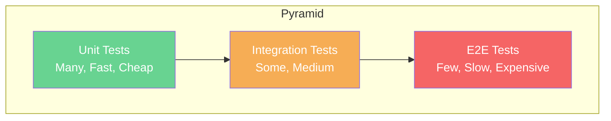
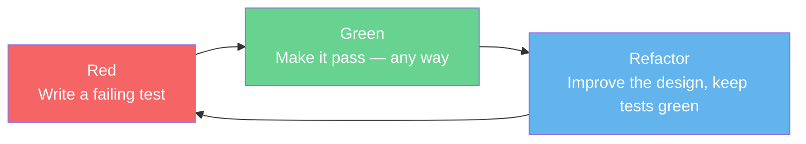
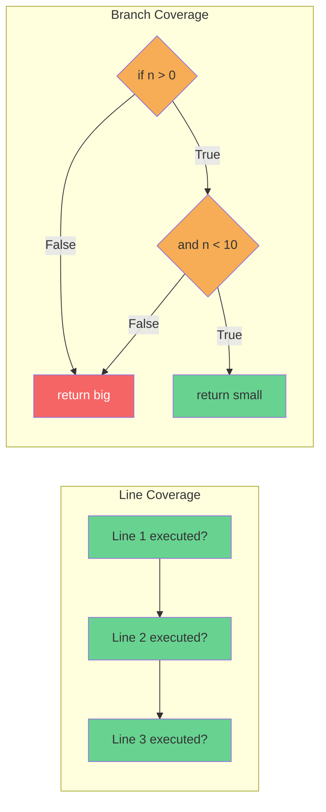
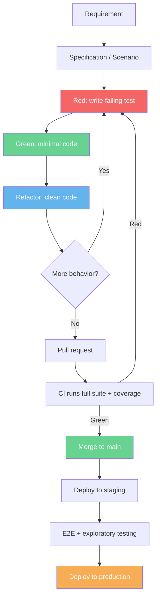
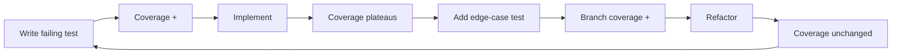
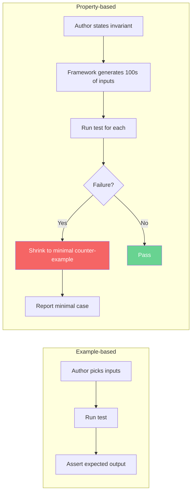

# 1. Testing Concepts

> [!note] Why this note exists
> Testing is the discipline that lets you change code without fear. This note covers the conceptual foundation that every other note in [[12. Testing]] builds on: the test pyramid, the differences between unit, integration, and end-to-end tests, the AAA (Arrange-Act-Assert) pattern, Test-Driven Development (TDD) and Behavior-Driven Development (BDD), coverage metrics (line vs branch), property-based testing with Hypothesis, and fuzzing. Master this vocabulary before you reach for any framework — [[2. unittest]] and [[3. pytest]] are just tools; this note is the theory that tells you *what* to test and *why*.

## Why It Matters

Un-tested code is a black box: you can change it, but you cannot know what you broke. The cost of an undetected bug grows roughly an order of magnitude per stage it survives — a bug caught by the developer at the keyboard costs minutes; a bug caught in code review costs an hour; a bug caught in QA costs a day; a bug caught in production costs a customer. Tests are the cheapest possible way to find bugs early.

But "write tests" is not actionable. The real questions are:

- How big should each test be? (Answer: as small as possible.)
- How many of each kind do you need? (Answer: lots of small ones, fewer medium ones, very few large ones — the pyramid.)
- How do you structure a test so it reads like a spec? (Answer: AAA.)
- When do you write the test — before or after the code? (Answer: ideally before, in TDD style.)
- How do you know your tests are good? (Answer: they fail when the code is wrong, they pass when it's right, they cover both the happy path and the edges, and they exercise properties, not just examples.)
- How much is "enough" coverage? (Answer: 100% line coverage is necessary but not sufficient; you need branch coverage too, and even then, coverage measures *executed* code, not *verified* behavior.)

This note gives you the vocabulary and mental models to answer those questions. The remaining notes in [[12. Testing]] show you the tools.

## Background

### The three layers of tests

| Layer              | Scope                                                  | Speed        | Cost        | Count        |
|--------------------|--------------------------------------------------------|--------------|-------------|--------------|
| **Unit**           | A single function or class in isolation.               | Microseconds | Low         | Many (1000s) |
| **Integration**    | Several units together, real dependencies or stubs.    | Milliseconds | Medium      | Some (100s)  |
| **End-to-end (E2E)**| The whole system through its public boundary (HTTP, CLI).| Seconds      | High        | Few (10s)    |

- **Unit tests** are the foundation. They should run in milliseconds, never touch the network or the disk, and pinpoint exactly which line of code is wrong when they fail.
- **Integration tests** verify that units compose correctly. "Does the repository load the right row from the database? Does the API handler serialize the response the way the client expects?"
- **End-to-end tests** verify that the user-visible behavior works. They are slow, brittle, and expensive — but they catch wiring issues that unit tests cannot.

### The test pyramid



The pyramid says: most of your tests should be unit tests, fewer integration, very few E2E. The reasoning is purely economic:

- A unit test that runs in 1 ms and breaks in 1 ms encourages tight feedback loops.
- An E2E test that runs in 5 s and breaks in 5 s discourages running it on every keystroke.
- When an E2E test fails, you don't know *which* layer broke — you have to debug the whole stack. When a unit test fails, you know exactly which function is wrong.

Inverting the pyramid — many E2E tests, few unit tests — produces the **ice-cream cone** anti-pattern: slow, brittle suites that nobody trusts.

### The AAA pattern (Arrange-Act-Assert)

Every test should have three clearly delimited phases:

```python
def test_withdraw_reduces_balance():
    # Arrange — set up the world
    account = Account(balance=100)

    # Act — do the thing under test
    account.withdraw(30)

    # Assert — verify the outcome
    assert account.balance == 70
```

- **Arrange** creates the inputs, fakes, and preconditions.
- **Act** invokes exactly one behavior — usually one method call. If you have two `Act` lines, you have two tests in disguise.
- **Assert** checks the result. Prefer a single logical assertion per test (multiple physical `assert`s that verify the same outcome are fine).

Some teams add a fourth **A** — **Annihilate** or **After** — for teardown, but modern fixtures (see [[4. Fixtures and Parameterization]]) make this unnecessary.

### TDD: red, green, refactor

Test-Driven Development is a *design* discipline, not a testing one. The cycle is:



1. **Red.** Write a test for the next slice of behavior you want. Run it. Watch it fail. If it doesn't fail, you've either already implemented the behavior or your test is wrong.
2. **Green.** Write the smallest amount of production code that makes the test pass. Resist the urge to generalize; do the simplest thing that could possibly work.
3. **Refactor.** With the test green as a safety net, improve the code: extract methods, rename, remove duplication. The tests must stay green.

Why TDD works:

- The **red** step forces you to think about the interface *before* the implementation — you write the call site first, which is the user's perspective.
- The **green** step prevents over-engineering. You only build what the test demands.
- The **refactor** step keeps the code clean without fear, because the tests catch regressions.

### BDD: behavior, not functions

Behavior-Driven Development generalizes TDD to a higher level of abstraction. Instead of "test the `withdraw` method," BDD writes **scenarios** in a shared language:

```gherkin
Feature: Account withdrawal
  Scenario: Withdrawing within balance
    Given an account with balance 100
    When I withdraw 30
    Then the balance should be 70
```

Tools like `behave` (Python), `pytest-bdd`, and Cucumber (Ruby/JVM) parse these scenarios and map each step to a Python function. BDD shines when non-developers (product owners, QA) need to read or write specifications. For pure developer TDD it adds ceremony without much benefit.

### Coverage: line vs branch

**Line coverage** is the fraction of executable lines that were executed by the test suite.

**Branch coverage** is the fraction of *control-flow branches* (both sides of every `if`, the body and the alternative of every `for`/`while`, every `except` arm) that were taken.

Consider:

```python
def classify(n):
    if n > 0 and n < 10:
        return "small"
    return "big"
```

A test `classify(5)` gives 100% line coverage but only 50% branch coverage — the `False` side of both `n > 0` and `n < 10` is never exercised (because `and` short-circuits). Branch coverage forces you to write `classify(-1)` and `classify(100)` as well.



Neither metric proves your tests are *good* — only that they *executed* the code. You can have 100% coverage and still ship bugs, because coverage says nothing about whether your assertions are correct, whether you exercised edge cases, or whether you tested the right thing at all. See [[6. Coverage and CI]] for the full treatment.

### Property-based testing (Hypothesis)

Example-based testing checks the code against a list of inputs you thought of. Property-based testing checks the code against *properties* that must hold for *all* inputs in a generated domain.

```python
from hypothesis import given, strategies as st

@given(st.lists(st.integers()))
def test_sort_idempotent(lst):
    once = sorted(lst)
    twice = sorted(once)
    assert once == twice      # sorting a sorted list is a no-op

@given(st.lists(st.integers()))
def test_sort_preserves_length(lst):
    assert len(sorted(lst)) == len(lst)

@given(st.lists(st.integers()))
def test_sort_orders(lst):
    s = sorted(lst)
    assert s == sorted(s)      # and is itself sorted
```

Hypothesis generates hundreds of random inputs, including edge cases you didn't think of (empty lists, lists with `min == max`, very large integers, duplicates). When it finds a counter-example, it **shrinks** the input to the smallest failing case and reports it:

```
Falsifying example: test_sort_orders(lst=[0, 1, 1])
```

Property-based testing is invaluable for:

- Pure functions (parsers, codecs, math, state machines).
- Anything with a specification you can state as an invariant.
- Round-trip properties: `encode(decode(x)) == x`.

### Fuzzing

Fuzzing is property-based testing on steroids, aimed at finding crashes and security bugs. A fuzzer feeds malformed, random, or mutated inputs to a program and watches for crashes, hangs, or memory errors. Python fuzzers include:

- **Atheris** — coverage-guided fuzzer (LibFuzzer port) for Python.
- **Hypothesis** with `@given(st.from_regex(...))` for input-shape fuzzing.
- **python-afl** — American Fuzzy Lop integration.

Fuzzing is most useful for parsers, decoders, network protocol handlers, and any code that consumes untrusted input. It is complementary to unit tests, not a replacement.

## Main content

### A worked example: testing a small bank account

```python
# accounts.py
from dataclasses import dataclass, field

@dataclass
class Account:
    balance: float = 0.0
    history: list = field(default_factory=list)

    def deposit(self, amount):
        if amount <= 0:
            raise ValueError("deposit must be positive")
        self.balance += amount
        self.history.append(("deposit", amount))

    def withdraw(self, amount):
        if amount <= 0:
            raise ValueError("withdraw must be positive")
        if amount > self.balance:
            raise ValueError("insufficient funds")
        self.balance -= amount
        self.history.append(("withdraw", amount))
```

Layered tests:

```python
# test_accounts_unit.py — fast, isolated, no I/O
import pytest
from accounts import Account

def test_deposit_increases_balance():
    a = Account(balance=100)         # Arrange
    a.deposit(50)                    # Act
    assert a.balance == 150          # Assert

def test_withdraw_reduces_balance():
    a = Account(balance=100)
    a.withdraw(30)
    assert a.balance == 70

def test_withdraw_too_much_raises():
    a = Account(balance=10)
    with pytest.raises(ValueError, match="insufficient"):
        a.withdraw(20)

# Parameterized tests cover the edges compactly
@pytest.mark.parametrize("amount", [0, -1, -100])
def test_deposit_non_positive_raises(amount):
    a = Account(balance=0)
    with pytest.raises(ValueError):
        a.deposit(amount)
```

```python
# test_accounts_integration.py — exercises persistence too
def test_account_can_be_saved_and_loaded(repo):
    a = Account(balance=42)
    repo.save(a)
    loaded = repo.load(a.id)
    assert loaded.balance == 42
```

```python
# test_accounts_e2e.py — exercises the HTTP API
def test_withdraw_via_api(client):
    client.post("/accounts", json={"balance": 100})
    r = client.post("/accounts/1/withdraw", json={"amount": 30})
    assert r.status_code == 200
    assert r.json()["balance"] == 70
```

### Property-based test for the account

```python
from hypothesis import given, strategies as st
from accounts import Account

@given(
    initial=st.floats(min_value=0, max_value=1e6, allow_nan=False, allow_infinity=False),
    deposits=st.lists(
        st.floats(min_value=0.01, max_value=1e4, allow_nan=False, allow_infinity=False),
        max_size=20,
    ),
)
def test_balance_equals_sum_of_deposits(initial, deposits):
    a = Account(balance=initial)
    for d in deposits:
        a.deposit(d)
    assert a.balance == pytest.approx(initial + sum(deposits))
```

Hypothesis will run this hundreds of times with floats you didn't think to try, including values that expose floating-point rounding bugs. The `pytest.approx` is critical — direct `==` on floats fails.

### TDD walk-through: building `withdraw` from scratch

1. **Red** — write the simplest failing test:

   ```python
   def test_withdraw_reduces_balance():
       a = Account(balance=100)
       a.withdraw(30)
       assert a.balance == 70
   ```

   Run it. `AttributeError: 'Account' has no attribute 'withdraw'`. Red confirmed.

2. **Green** — add the minimum that passes:

   ```python
   def withdraw(self, amount):
       self.balance -= amount
   ```

   Run it. Green.

3. **Red again** — add a test for the over-draft case:

   ```python
   def test_withdraw_too_much_raises():
       a = Account(balance=10)
       with pytest.raises(ValueError):
           a.withdraw(20)
   ```

   Run it. Fails (no exception raised).

4. **Green** — add the guard:

   ```python
   def withdraw(self, amount):
       if amount > self.balance:
           raise ValueError("insufficient funds")
       self.balance -= amount
   ```

5. **Refactor** — extract a `_check_sufficient` helper, parameterize, etc. Tests stay green throughout.

Each red-green cycle is 30-60 seconds. The class is built incrementally, with every line of production code justified by a failing test.

### What to test, what not to test

| Test it                                 | Don't test it                          |
|-----------------------------------------|----------------------------------------|
| Public API of your modules              | Private helpers (covered via public API)|
| Edge cases: empty, None, zero, max int  | The standard library                   |
| Error paths: bad input, missing files   | Third-party libraries                  |
| Bugs you've fixed (regression tests)    | Framework internals (Django's ORM)     |
| Anything you'd be afraid to change      | Trivial getters/setters                |
| Anything reported by users              | Code you don't own                     |

### Test doubles: stubs, mocks, fakes, spies

The vocabulary matters. People say "mock" when they mean any of these:

| Double | Behavior                                                            |
|--------|---------------------------------------------------------------------|
| **Dummy** | Passed but never used. Fills a parameter slot.                  |
| **Stub**  | Returns canned answers to calls.                                |
| **Spy**   | Records calls so you can assert on them later. Wraps the real obj.|
| **Mock**  | A stub + a spy — pre-programmed expectations with verification. |
| **Fake**  | A working but simplified implementation (in-memory DB).        |

[[5. Mocking with unittest.mock]] covers the `Mock`/`MagicMock`/`patch` machinery. The principle is: prefer **fakes** and **stubs** to **mocks**; every mock is a coupling to a specific call shape, and over-mocked suites break under innocent refactors.

## Mermaid diagrams

### The full testing lifecycle



### Coverage growth under TDD



### Property-based vs example-based testing



## Code examples

### A property-based test that found a real bug

```python
# buggy.py
def unique(items):
    """Return items with duplicates removed, preserving order."""
    seen = set()
    result = []
    for x in items:
        if x not in seen:
            seen.add(x)
            result.append(x)
    return result
```

Seems fine. The example test passes:

```python
def test_unique_basic():
    assert unique([1, 2, 2, 3]) == [1, 2, 3]
```

But Hypothesis finds:

```python
from hypothesis import given, strategies as st

@given(st.lists(st.integers()))
def test_unique_preserves_count_of_distinct(lst):
    assert len(unique(lst)) == len(set(lst))

# Falsifying example: unique([1, 1.0]) — because 1 == 1.0 but they're different objects
# In Python, {1, 1.0} collapses to {1}, but the list still contains both!
```

This is a real bug if your data ever mixes ints and floats that compare equal. Property-based testing surfaces it without you having to think of it.

### Fuzzing a parser with Atheris

```python
# fuzz_parser.py
import atheris
import sys

with atheris.instrument_imports():
    import my_parser  # the module under test

def TestOneInput(data):
    try:
        my_parser.parse(data.decode("utf-8", errors="ignore"))
    except my_parser.ParseError:
        return  # expected — only crashes count
    # any other exception is a bug

atheris.Setup(sys.argv, TestOneInput)
atheris.Fuzz()
```

Run with `python fuzz_parser.py -max_total_time=60`. Atheris mutates inputs guided by coverage and reports any input that crashes your parser.

### A BDD-style scenario with `pytest-bdd`

```python
# features/account.feature
Feature: Account withdrawal
  Scenario: Withdrawing within balance
    Given an account with balance 100
    When I withdraw 30
    Then the balance should be 70

# test_account_bdd.py
from pytest_bdd import scenarios, given, when, then
from accounts import Account

scenarios("account.feature")

@given("an account with balance 100", target_fixture="account")
def _():
    return Account(balance=100)

@when("I withdraw 30")
def _(account):
    account.withdraw(30)

@then("the balance should be 70")
def _(account):
    assert account.balance == 70
```

The feature file is plain English; stakeholders can read it. The Python file is glue.

## Common Pitfalls

> [!warning] The ice-cream cone
> Many teams end up with 80% E2E tests, 15% integration, 5% unit. The suite takes 40 minutes to run, fails randomly because of network flakiness, and is too slow to run on every keystroke. Force yourself to write a unit test first; only fall back to integration/E2E when unit testing is genuinely impossible.

> [!warning] Testing the implementation, not the behavior
> `assert obj._internal_state == expected` couples the test to the implementation. Refactoring the internal representation breaks the test even though behavior didn't change. Test through the public API.

> [!warning] Coverage as a target, not a metric
> "We need 80% coverage" produces tests that exercise code without asserting anything meaningful. Coverage measures *executed lines*, not *verified behavior*. Use it as a signal of where you haven't looked, not as a finish line. A 100%-covered function can still have bugs.

> [!warning] Over-mocking
> Mocking every collaborator couples tests to call shapes. After a refactor that swaps a method name, every test breaks even though behavior is unchanged. Prefer fakes (in-memory repositories) over mocks; only mock what crosses a process or network boundary. See [[5. Mocking with unittest.mock]].

> [!warning] Tests that depend on order
> If `test_a` must run before `test_b`, your suite has hidden state. Tests must be independent — each should set up its own world and tear it down. Pytest randomizes order with `pytest-randomly`; if that breaks your suite, you have coupled tests.

> [!warning] Sleeping in tests
> `time.sleep(2)` to wait for an async result makes the suite slow and flaky. Poll with a timeout, use `pytest.mark.asyncio` and `await` directly, or use `tenacity.retry`. See [[4. Fixtures and Parameterization]].

> [!warning] Excessive setup in test bodies
> If every test starts with 15 lines of object construction, extract a fixture or a builder. Tests should read like specs, not setup scripts.

> [!warning] Asserting on multiple unrelated things
> One test, one logical assertion. `test_account_works` that checks balance, history, and statement is three tests hiding as one — when it fails, you don't know which behavior broke.

> [!warning] Testing only the happy path
> The happy path is the one the code was written for; it almost always works. The bugs are in the edges: empty input, None, zero, negative, very large, concurrent access. Always ask "what's the weirdest valid input?"

## Tips and Tricks

- **Name tests as sentences.** `test_withdraw_more_than_balance_raises_insufficient_funds_error` reads as a spec. When it fails, the failure message is a sentence describing broken behavior.
- **Use `pytest.approx` for floats.** `assert 0.1 + 0.2 == 0.3` fails. `assert 0.1 + 0.2 == pytest.approx(0.3)` passes.
- **Test the message, not just the type.** `with pytest.raises(ValueError, match="insufficient"):` confirms the error is the *right* ValueError, not any ValueError.
- **Use `tmp_path` for filesystem tests.** It's a built-in pytest fixture that gives you a fresh directory per test, auto-cleaned. See [[4. Fixtures and Parameterization]].
- **Pin random seeds in tests.** `random.seed(42)` at the top of stochastic tests makes them reproducible. Hypothesis accepts an explicit `--hypothesis-seed`.
- **Use `freezegun` for time.** `with freeze_time("2024-01-01"):` makes `datetime.now()` deterministic — no more "passes at 3pm, fails at midnight."
- **Group tests by behavior, not by method.** A `TestWithdraw` class for all withdrawal tests, a `TestDeposit` class for deposits. Don't put every test for `Account` in one giant class.
- **Make failure messages useful.** `assert x == y, f"expected {y}, got {x}"`. Pytest's assertion rewriting already does this for many cases, but custom messages help for complex objects.
- **Run only what changed.** `pytest --testmon` runs only tests affected by your last commit. `pytest -k withdraw` runs only tests matching the pattern.
- **Property-test pure functions aggressively.** They're cheap to write and find bugs example-based tests miss.
- **Treat bug reports as test specs.** Every bug ticket should produce a failing test that reproduces the bug, then a fix that makes it pass. Without the test, the bug will regress.
- **Don't aim for 100% coverage; aim for *useful* coverage.** 90% with thoughtful assertions beats 100% with smoke tests.
- **Set a coverage *floor*, not a *ceiling*.** In CI, fail if coverage drops below your floor (e.g. 80%). Don't fail if it's too high — that's never the problem.

## Active Recall

1. Name the three layers of the test pyramid, in order from most to fewest.
2. Why does an inverted pyramid (ice-cream cone) cause pain in the long run?
3. What are the three A's in AAA? Why is "one Act per test" a useful rule?
4. Describe the TDD cycle. Why must the test fail *before* you write the implementation?
5. What's the difference between line coverage and branch coverage? Give an example where line is 100% but branch is 50%.
6. Why does 100% coverage not guarantee bug-free code?
7. What is property-based testing? How does Hypothesis find inputs you didn't think of?
8. What does it mean for Hypothesis to "shrink" a counter-example?
9. Distinguish between a stub, a mock, a spy, and a fake. When would you reach for each?
10. What's the difference between TDD and BDD? When is BDD more appropriate?
11. Why is fuzzing complementary to unit tests rather than a replacement?
12. Name three pitfalls that turn a green test suite into a brittle one.
13. How would you test a function that calls `datetime.now()`? `time.sleep()`?
14. Why should tests be order-independent? How can you enforce that?

## Next Steps

- Now that you have the vocabulary, learn the standard-library tool: [[2. unittest]].
- Or skip straight to the more pythonic third-party choice: [[3. pytest]].
- Once you've picked pytest, master dependency injection in [[4. Fixtures and Parameterization]].
- Learn to isolate dependencies with [[5. Mocking with unittest.mock]].
- Wire it all into a pipeline with [[6. Coverage and CI]].
- For the sibling topic of observability — what to do when tests don't catch the bug in production — see [[13. Logging]], especially [[1. The logging Module]] and [[3. Structured Logging]].
