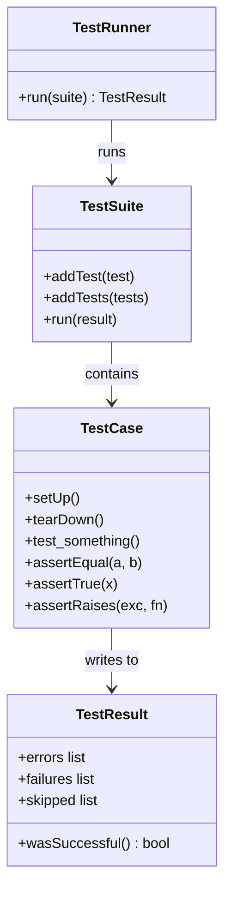
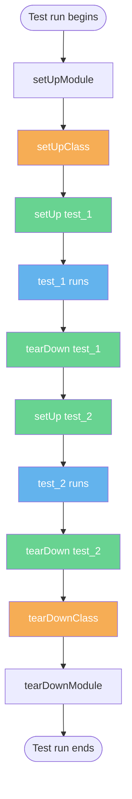
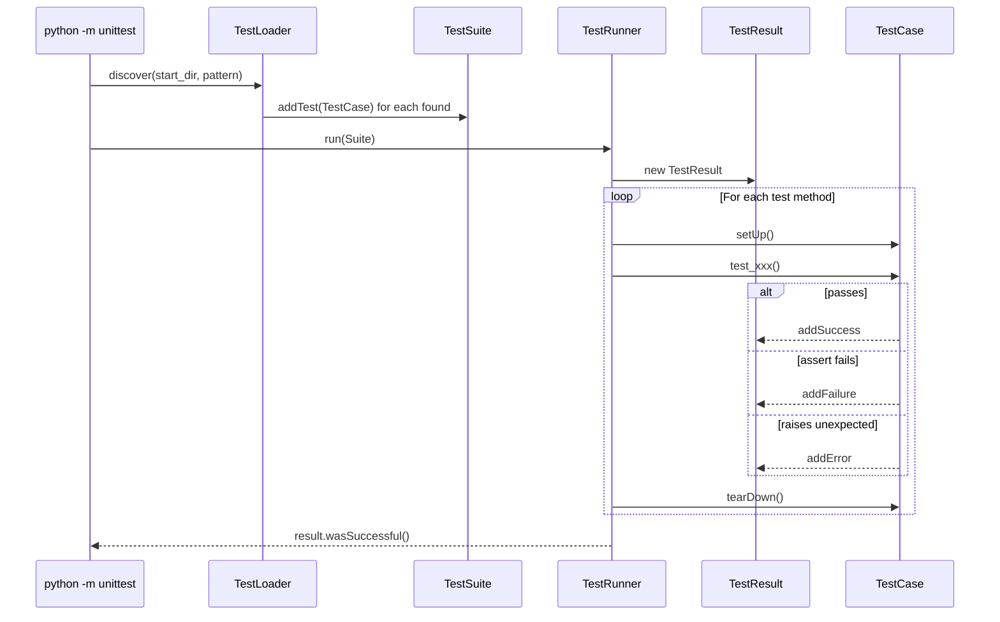
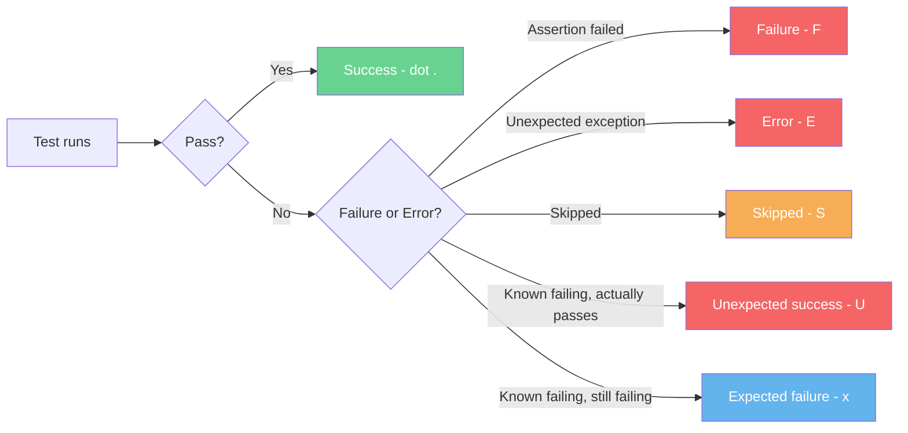

# 2. unittest

> [!note] Why this note exists
> `unittest` is Python's batteries-included testing framework — descended from JUnit, shipped with the standard library, available in every Python install since 2.1. This note covers the `TestCase` class, the assertion methods (`assertEqual`, `assertTrue`, `assertRaises`, and friends), the setup/teardown lifecycle (`setUp`, `tearDown`, `setUpClass`, `tearDownClass`, `setUpModule`), test discovery, and the `python -m unittest` runner. By the end, you'll be able to read and write any `unittest`-based test suite, and you'll understand why many teams eventually migrate to [[3. pytest]] despite `unittest` being perfectly capable.

## Why It Matters

`pytest` is more popular in new codebases, but `unittest` is unavoidable for three reasons:

1. **It's in the standard library.** No `pip install`, no virtual-env dance. If you can run Python, you can run `unittest`. This matters for CI on locked-down environments, embedded interpreters, and quick scripts on remote machines.
2. **Existing code uses it.** Django's test suite, the standard library's own tests, and a generation of corporate Python codebases are written in `unittest`. You will need to read it.
3. **`pytest` runs `unittest` tests.** A `unittest.TestCase` subclass is fully runnable under `pytest`, so migrating is gradual — you can use `unittest` today and `pytest` tomorrow on the same codebase.

Knowing `unittest` is therefore not optional. It's the lingua franca of Python testing.

## Background

### JUnit lineage

`unittest` (originally `PyUnit`, by Steve Purcell, 1999) was modeled on JUnit's pattern of:

- A **TestCase** class holds related test methods.
- Each test method follows AAA (see [[1. Testing Concepts]]) — but with optional `setUp`/`tearDown` hooks.
- Assertions are methods on `TestCase` (not the bare `assert` statement), so the framework can render informative diffs.
- A **TestSuite** groups test cases; a **TestRunner** executes them and reports results.

The XUnit family (JUnit, NUnit, PHPUnit, RSpec's `describe` form, unittest) all share this shape. Once you learn one, the others translate.

### The four objects



You rarely construct `TestSuite` or `TestResult` by hand — the runner does that. Your job is to write `TestCase` subclasses.

## Main content

### Anatomy of a TestCase

```python
# test_account_unittest.py
import unittest
from accounts import Account

class TestAccount(unittest.TestCase):
    def setUp(self):
        # Runs before EACH test method
        self.account = Account(balance=100)

    def tearDown(self):
        # Runs after EACH test method (even on failure)
        pass

    def test_deposit_increases_balance(self):
        self.account.deposit(50)
        self.assertEqual(self.account.balance, 150)

    def test_withdraw_reduces_balance(self):
        self.account.withdraw(30)
        self.assertEqual(self.account.balance, 70)

    def test_withdraw_too_much_raises(self):
        with self.assertRaises(ValueError) as ctx:
            self.account.withdraw(200)
        self.assertIn("insufficient", str(ctx.exception))

if __name__ == "__main__":
    unittest.main()
```

Run it:

```bash
python -m unittest test_account_unittest      # by module name
python -m unittest test_account_unittest.TestAccount.test_deposit_increases_balance
python test_account_unittest.py                # via __main__
python -m unittest discover                    # auto-discover
```

### The assertion catalog

`unittest.TestCase` provides ~30 assertion methods. The most-used:

| Method                              | What it checks                                |
|-------------------------------------|-----------------------------------------------|
| `assertEqual(a, b)`                 | `a == b`                                       |
| `assertNotEqual(a, b)`              | `a != b`                                       |
| `assertTrue(x)` / `assertFalse(x)`  | `bool(x)` is True/False                       |
| `assertIs(a, b)` / `assertIsNot`    | `a is b`                                       |
| `assertIsNone(x)` / `assertIsNotNone`| `x is None`                                   |
| `assertIn(a, b)` / `assertNotIn`    | `a in b`                                       |
| `assertIsInstance(x, cls)`          | `isinstance(x, cls)`                          |
| `assertRaises(exc, fn, *args, **kw)`| `fn(*args, **kw)` raises `exc`                |
| `assertWarns(warning, fn, ...)`     | `fn(...)` warns                                |
| `assertGreater(a, b)` / `assertLess`| `a > b` / `a < b`                              |
| `assertAlmostEqual(a, b)`           | `round(a-b, 7) == 0` (for floats)             |
| `assertRegex(s, pattern)`           | `re.search(pattern, s)`                        |
| `assertCountEqual(a, b)`            | Same elements, any order (multiset equality)   |
| `assertDictEqual`, `assertListEqual`| With structural diff display                   |

Each has a negated counterpart where it makes sense (`assertNotEqual`, `assertNotIn`, `assertNotRegex`, `assertNotIsInstance`).

Every assertion accepts an optional `msg=` argument for custom failure messages. **But** `unittest`'s diffs are already excellent:

```python
self.assertEqual({"a": 1, "b": [2, 3]}, {"a": 1, "b": [2, 4]})
```

prints:

```
AssertionError: {'a': 1, 'b': [2, 3]} != {'a': 1, 'b': [2, 4]}
- {'a': 1, 'b': [2, 3]}
?                  ^
+ {'a': 1, 'b': [2, 4]}
?                  ^
```

The caret points at the differing character. This is `unittest`'s chief advantage over naive `assert x == y`.

### The `assertRaises` forms

Three equivalent ways:

```python
# 1. Context manager (modern, preferred)
with self.assertRaises(ValueError):
    self.account.withdraw(1_000_000)

# 2. With exception object — inspect message
with self.assertRaises(ValueError) as ctx:
    self.account.withdraw(1_000_000)
self.assertIn("insufficient", str(ctx.exception))

# 3. Old-style direct call (rarely needed)
self.assertRaises(ValueError, self.account.withdraw, 1_000_000)
```

The context manager form lets you put arbitrary assertions inside the `with` block and inspect the exception via `ctx.exception`, `ctx.exception.args`.

### Setup and teardown lifecycle

`unittest` offers three levels of setup/teardown:

```python
class TestDb(unittest.TestCase):
    @classmethod
    def setUpClass(cls):
        # ONCE per TestCase class — before any test method runs.
        # Use for expensive resources: spin up Postgres in Docker, load fixtures.
        cls.db = create_test_db()

    @classmethod
    def tearDownClass(cls):
        # ONCE per TestCase class — after all methods.
        cls.db.drop()

    def setUp(self):
        # BEFORE each test method.
        self.conn = self.db.connect()

    def tearDown(self):
        # AFTER each test method.
        self.conn.close()

    def test_select(self):
        ...

    def test_insert(self):
        ...
```

There's also a module-level hook:

```python
def setUpModule():
    """Runs once when the test module is imported."""

def tearDownModule():
    """Runs once after all tests in the module finish."""
```



> [!info] setUp failures
> If `setUp` raises, the test method is marked as an **ERROR** (not a FAILURE), and `tearDown` does not run for that method. `setUpClass` failure marks every method in the class as ERROR. This is correct — if the world couldn't be set up, no test could meaningfully run.

### Test discovery

`python -m unittest discover` walks the file tree, imports any module matching `test*.py`, finds `TestCase` subclasses, and runs their `test_*` methods. Default rules:

| Setting        | Default              | Override flag                          |
|----------------|----------------------|----------------------------------------|
| Start dir      | `.`                  | `-s <dir>`                              |
| Pattern        | `test*.py`           | `-p <pattern>`                          |
| Top-level dir   | (start dir's parent) | `-t <dir>`                              |

Typical usage:

```bash
python -m unittest discover -s tests -p "test_*.py" -t .
```

This means: top-level package root is `.`, start discovering in `tests/`, treat files named `test_*.py` as test modules.

For discovery to work, your test files must be **importable** — they need their package `__init__.py` (or be in a directory on `sys.path`).

### The `unittest.main()` entry point

```python
if __name__ == "__main__":
    unittest.main()
```

`unittest.main()` discovers tests in the current module and runs them. It accepts the same flags as the command line:

```python
unittest.main(verbosity=2, failfast=True, exit=False)
```

- `verbosity=0` — quiet (just dots)
- `verbosity=1` — default (dots and `F`/`E` for failures/errors)
- `verbosity=2` — verbose (full test names)
- `failfast=True` — stop on first failure
- `exit=False` — don't call `sys.exit`, useful when running tests from a REPL or notebook

### Command-line flags

```bash
python -m unittest                            # discover and run all
python -m unittest -v                         # verbose
python -m unittest -f                         # failfast (stop on first failure)
python -m unittest -b                         # buffer stdout/stderr during tests
python -m unittest -c                         # catch Ctrl-C, report results
python -m unittest -k pattern                 # only run tests matching pattern (3.7+)
python -m unittest --locals                   # show local vars in tracebacks (3.9+)
```

The `-b` (buffer) flag is essential when your code prints — by default, output from tests is shown even on success, which clutters. With `-b`, output is suppressed unless the test fails.

### Skipping tests

```python
import sys, unittest

class TestPlatform(unittest.TestCase):
    @unittest.skip("not implemented yet")
    def test_future_feature(self):
        ...

    @unittest.skipUnless(sys.platform == "linux", "linux only")
    def test_linux_epoll(self):
        ...

    @unittest.skipIf(sys.version_info < (3, 10), "uses match/case")
    def test_match_case(self):
        ...

    def test_optional_dependency(self):
        try:
            import numpy
        except ImportError:
            self.skipTest("numpy not installed")
        # ... test using numpy
```

Skipped tests appear as `S` in the output and are reported separately from failures. `expectedFailure` marks a test that's known to fail — if it unexpectedly passes, it's reported as `unexpected success` (`U`), alerting you to remove the decorator.

### Subtests — running the same assertion many times

```python
class TestTable(unittest.TestCase):
    def test_fahrenheit_to_celsius(self):
        for f, expected in [(32, 0), (212, 100), (98.6, 37), (-40, -40)]:
            with self.subTest(f=f):
                self.assertEqual(fahrenheit_to_celsius(f), expected)
```

Without `subTest`, the first failure stops the loop. With `subTest`, each iteration runs independently and a failure only fails that one case — you see all four results in the report.

### Tests as data with `ddt`

The `ddt` library (third-party) brings pytest-style parameterization to `unittest`:

```python
from ddt import ddt, data, unpack

@ddt
class TestAdd(unittest.TestCase):
    @data((1, 2, 3), (10, 20, 30), (-1, 1, 0))
    @unpack
    def test_add(self, a, b, expected):
        self.assertEqual(add(a, b), expected)
```

This is what most teams that stay on `unittest` reach for. But if you're installing third-party packages anyway, [[3. pytest]] is the more idiomatic choice.

### Mocking integration

`unittest.mock` is part of the standard library and pairs naturally with `unittest.TestCase`. See [[5. Mocking with unittest.mock]] for the full treatment. The shortest example:

```python
from unittest.mock import patch

class TestApi(unittest.TestCase):
    @patch("myapp.api.requests.get")
    def test_get_user_returns_name(self, mock_get):
        mock_get.return_value.json.return_value = {"name": "Alice"}
        self.assertEqual(get_user(1).name, "Alice")
        mock_get.assert_called_once_with("https://api.example.com/users/1")
```

### Running tests in parallel

`unittest` does not natively run tests in parallel. Options:

- `pytest-xdist` — runs `unittest` tests in parallel under pytest.
- `unittest-parallel` — third-party runner.
- `concurrent.futures` — roll your own; finicky.

For most suites, parallelism isn't worth the complexity — `unittest` tests are fast when they're true unit tests.

## Mermaid diagrams

### unittest execution model



### Test outcome taxonomy



## Code examples

### Example 1: A complete, idiomatic unittest module

```python
# test_stack.py
import unittest
from stack import Stack


class TestStack(unittest.TestCase):
    def setUp(self):
        self.s = Stack()

    def test_new_stack_is_empty(self):
        self.assertTrue(self.s.is_empty())
        self.assertEqual(self.s.size(), 0)

    def test_push_increases_size(self):
        self.s.push(1)
        self.assertEqual(self.s.size(), 1)
        self.assertFalse(self.s.is_empty())

    def test_pop_returns_last_pushed(self):
        self.s.push(1)
        self.s.push(2)
        self.assertEqual(self.s.pop(), 2)
        self.assertEqual(self.s.pop(), 1)

    def test_pop_empty_raises(self):
        with self.assertRaises(IndexError):
            self.s.pop()

    def test_peek_does_not_remove(self):
        self.s.push(42)
        self.assertEqual(self.s.peek(), 42)
        self.assertEqual(self.s.size(), 1)

    @unittest.skipUnless(__import__("sys").platform == "linux",
                         "uses Linux-specific behavior")
    def test_linux_specific(self):
        ...


if __name__ == "__main__":
    unittest.main(verbosity=2)
```

### Example 2: setUpClass for expensive fixtures

```python
# test_repository.py
import unittest
import tempfile
import os
from myapp.db import Database
from myapp.repository import UserRepository


class TestUserRepository(unittest.TestCase):
    @classmethod
    def setUpClass(cls):
        cls.tmpdir = tempfile.TemporaryDirectory()
        cls.db = Database(f"sqlite://{cls.tmpdir.name}/test.db")
        cls.db.connect()
        cls.db.migrate()

    @classmethod
    def tearDownClass(cls):
        cls.db.close()
        cls.tmpdir.cleanup()

    def setUp(self):
        # Clean slate per test
        self.db.execute("DELETE FROM users")
        self.repo = UserRepository(self.db)

    def test_save_and_load(self):
        self.repo.save({"id": 1, "name": "Alice"})
        loaded = self.repo.get(1)
        self.assertEqual(loaded["name"], "Alice")

    def test_count(self):
        self.repo.save({"id": 1, "name": "Alice"})
        self.repo.save({"id": 2, "name": "Bob"})
        self.assertEqual(self.repo.count(), 2)
```

### Example 3: Subtests for table-driven tests

```python
class TestRoman(unittest.TestCase):
    CASES = [
        (1, "I"), (2, "II"), (4, "IV"), (5, "V"),
        (9, "IX"), (10, "X"), (40, "XL"), (90, "XC"),
        (400, "CD"), (900, "CM"), (3999, "MMMCMXCIX"),
    ]

    def test_to_roman(self):
        for arabic, expected in self.CASES:
            with self.subTest(arabic=arabic):
                self.assertEqual(to_roman(arabic), expected)

    def test_from_roman_round_trip(self):
        for arabic, _ in self.CASES:
            with self.subTest(arabic=arabic):
                self.assertEqual(from_roman(to_roman(arabic)), arabic)

    def test_zero_raises(self):
        with self.assertRaises(ValueError):
            to_roman(0)

    def test_too_large_raises(self):
        with self.assertRaises(ValueError):
            to_roman(4000)
```

### Example 4: Custom assertion methods

When several tests share a complex check, factor it into a helper method:

```python
class TestHttpResponse(unittest.TestCase):
    def assertJsonResponse(self, response, expected_status, expected_body):
        self.assertEqual(response.status_code, expected_status)
        self.assertEqual(response.headers["Content-Type"], "application/json")
        self.assertEqual(response.json(), expected_body)

    def test_get_user(self):
        resp = self.client.get("/users/1")
        self.assertJsonResponse(resp, 200, {"id": 1, "name": "Alice"})

    def test_get_missing_user(self):
        resp = self.client.get("/users/999")
        self.assertJsonResponse(resp, 404, {"error": "not found"})
```

Custom assertion methods also produce clearer failure messages — subclass `TestCase` once and reuse across the suite.

### Example 5: `assertLogs` — testing log output

```python
class TestLogin(unittest.TestCase):
    def test_login_logs_warning_on_bad_password(self):
        with self.assertLogs("myapp.auth", level="WARNING") as cm:
            login("alice", "wrong password")
        self.assertEqual(len(cm.records), 1)
        self.assertIn("failed login", cm.output[0])
```

`assertLogs` captures log records emitted during the block and exposes them via `cm.records` (the `LogRecord` objects) and `cm.output` (formatted strings). See [[1. The logging Module]] for context.

## Common Pitfalls

> [!warning] Forgetting to inherit from `TestCase`
> ```python
> class TestFoo:                       # missing (unittest.TestCase)
>     def test_bar(self):
>         self.assertEqual(1, 1)
> ```
> Discovery finds the class but never runs its methods — they look like plain methods. Always inherit `unittest.TestCase`.

> [!warning] Naming methods without `test_` prefix
> `def deposit_works(self):` is a helper method, not a test. Only methods starting with `test_` (lowercase) are picked up. Common typo: `def Test_thing(self):` (capital T) is not a test.

> [!warning] setUp that leaks between tests
> If `setUp` creates an object stored on a class attribute (instead of instance), tests share state and become order-dependent. Use `self.x = ...`, not `cls.x = ...` in `setUp`.

> [!warning] Calling `super().setUp()` late
> If you subclass another `TestCase` that has setUp logic, call `super().setUp()` first — before your own setup — so the parent's preconditions hold. Calling it last means your setup runs against an uninitialized parent.

> [!warning] Using `assertEqual` with `None`
> `self.assertEqual(x, None)` works but `self.assertIsNone(x)` is more idiomatic and gives a clearer failure message. Same for `True`/`False` — use `assertTrue`/`assertFalse`.

> [!warning] Comparing floats with `assertEqual`
> `self.assertEqual(0.1 + 0.2, 0.3)` fails due to float rounding. Use `self.assertAlmostEqual(0.1 + 0.2, 0.3)` (7 decimal places) or `self.assertAlmostEqual(a, b, places=10)`.

> [!warning] Misusing `assertRaises` as a context manager without `as`
> ```python
> with self.assertRaises(ValueError):
>     do_thing()
> self.assertIn("msg", str(ctx.exception))   # NameError: ctx not defined
> ```
> You need `with self.assertRaises(ValueError) as ctx:`. Without `as ctx`, you can't inspect the exception.

> [!warning] Discovery fails because of `__init__.py` issues
> Test files in packages need `__init__.py` (or a properly-configured `src/` layout). Otherwise discovery silently skips them. If your test count drops unexpectedly, check `__init__.py`.

> [!warning] Tests printing
> `print` output appears in the test report, cluttering it. Either remove the `print`, or run with `-b` to buffer stdout/stderr.

> [!warning] `assertEqual` on long lists/dicts without `assertCountEqual`
> `assertCountEqual([1, 2, 3], [3, 2, 1])` passes (it's a multiset comparison). `assertEqual([1, 2, 3], [3, 2, 1])` fails. If you care about elements regardless of order, use the right one.

> [!warning] Treating `assertEqual` failure as a thrown exception
> It raises `AssertionError`, which means a `try/except AssertionError:` around your test code will silently swallow failures. Don't catch `AssertionError` inside tests.

## Tips and Tricks

- **Use `verbosity=2` for local runs.** You get the full test name on its own line, which makes finding slow or failing tests easier.
- **Add `-b` (buffer) to CI runs.** Cleaner output, and stdout from failed tests is shown after the traceback.
- **Use `-f` (failfast) for local TDD.** Stop at the first failure so you don't have to scroll past a wall of red.
- **Subclass `TestCase` for shared helpers.** `class BaseApiTest(unittest.TestCase)` with `assertJsonResponse`, `make_client`, etc. Subclass it per resource.
- **Use `addCleanup` for resource teardown.** Cleaner than overriding `tearDown` when setup is dynamic:
   ```python
   def test_temp_file(self):
       path = create_temp_file()
       self.addCleanup(os.unlink, path)
       ...
   ```
   `addCleanup` runs even if the test raises, in LIFO order. Multiple cleanups are fine.
- **`addTypeEqualityFunc` for custom diff.** Register a comparison function for your domain objects:
   ```python
   class TestFoo(unittest.TestCase):
       def __init__(self, *a, **kw):
           super().__init__(*a, **kw)
           self.addTypeEqualityFunc(MyClass, self.assertMyClassEqual)

       def assertMyClassEqual(self, a, b, msg=None):
           ...
   ```
- **Use `unittest.mock.patch` as a decorator on test methods.** The mock is passed as an extra argument and is auto-restored at the end. See [[5. Mocking with unittest.mock]].
- **`self.maxDiff = None`** to show full diffs on failure (default truncates long ones).
- **`self.longMessage = True`** (default in 3.2+) prepends your `msg=` to the auto-generated message instead of replacing it.
- **Run a single test by full dotted path:**
   ```bash
   python -m unittest mypkg.tests.test_module.TestClass.test_method
   ```
- **Use `--locals` (3.9+) to see local variables in tracebacks** — invaluable for debugging failing tests.
- **For TDD, write `unittest.main(failfast=True)` at the bottom of your test file and run the file directly.** Quickest possible feedback loop with no extra tooling.
- **`assertCountEqual` is your friend for unordered comparison.** Beats `assertEqual(sorted(a), sorted(b))`.
- **Cache expensive setup with `@cached_property`** if you must use instance-level setup but want to compute lazily.
- **For asyncio tests, use `IsolatedAsyncioTestCase`** (3.8+):
   ```python
   class TestAsync(unittest.IsolatedAsyncioTestCase):
       async def test_async_fetch(self):
           result = await fetch("https://example.com")
           self.assertEqual(result.status, 200)
   ```

## Active Recall

1. Why is `unittest` still worth learning even if you plan to use `pytest`?
2. List four assertion methods on `TestCase` and what each checks.
3. What's the difference between `setUp`/`tearDown` and `setUpClass`/`tearDownClass`? When do you reach for the class-level versions?
4. What does `assertRaises` return as a context manager? Why is the `as ctx:` form useful?
5. What are the default discovery rules? How do you override the pattern?
6. What does `failfast=True` do? When would you not want it?
7. What's the difference between a *Failure* and an *Error* in `unittest`?
8. What does `subTest` buy you? Give an example where it shines.
9. Why does `assertEqual(0.1 + 0.2, 0.3)` fail? What's the fix?
10. How do you skip a test conditionally on Python version?
11. What does the `-b` flag do, and why is it useful in CI?
12. How would you test that a function logs at WARNING level?
13. What's the role of `addCleanup`? How does it differ from `tearDown`?
14. Why is `assertTrue(x is None)` worse than `assertIsNone(x)`?

## Next Steps

- For a more pythonic alternative, see [[3. pytest]] — it runs your `unittest` tests and lets you migrate gradually.
- For shared setup across many tests, see [[4. Fixtures and Parameterization]] (the pytest way of doing what `setUp`/`tearDown` does).
- For replacing dependencies in tests, see [[5. Mocking with unittest.mock]] — `unittest.mock` ships with the standard library and works seamlessly with `unittest.TestCase`.
- For measuring how much of your code the tests exercise, see [[6. Coverage and CI]].
- For the conceptual foundation (test pyramid, AAA, TDD), revisit [[1. Testing Concepts]].
