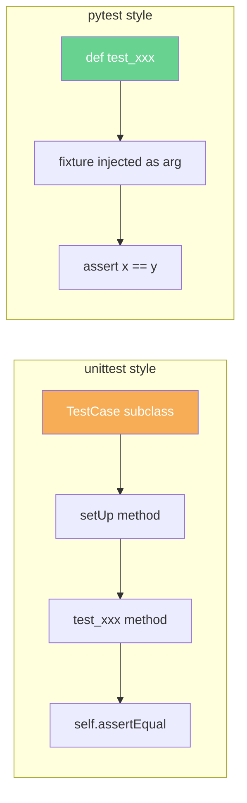
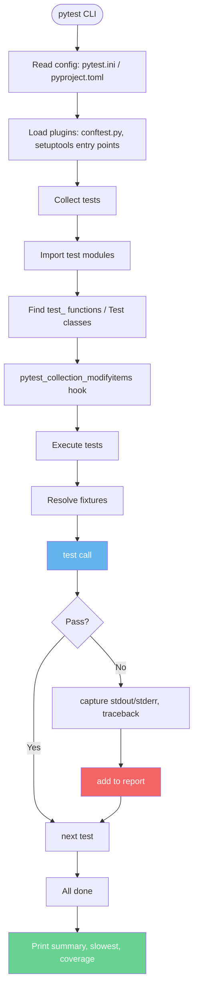
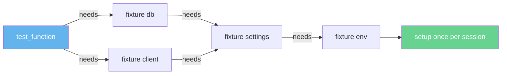
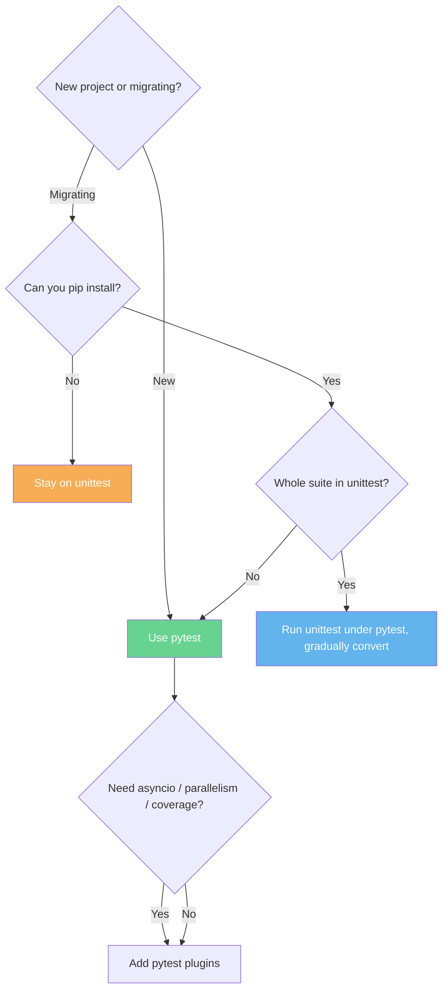

# 3. pytest

> [!note] Why this note exists
> `pytest` is the de-facto Python testing framework for new codebases. It runs `unittest` tests (so you can migrate gradually), it uses plain `assert` statements (so tests look like Python, not framework DSL), it has best-in-class fixtures and parameterization, and it has the richest plugin ecosystem of any Python testing tool. This note covers installation, the `assert`-based style, discovery rules, the `pytest.ini` / `pyproject.toml` configuration, marks, parameterization basics, the plugin ecosystem, and the `pytest` vs `unittest` decision. Fixtures are deep enough to deserve their own note — see [[4. Fixtures and Parameterization]].

## Why It Matters

`unittest` works. But it has friction:

- Tests inherit from `TestCase`, which is framework-shaped, not Python-shaped.
- Assertions are methods: `self.assertEqual(a, b)`, not `assert a == b`.
- Setup/teardown is class-based, even when you're testing a single function.
- Parameterization requires third-party `ddt`.
- Failure messages are good but verbose.

`pytest` strips all of that away. A pytest test is just a function with `test_` in its name, using `assert`. The framework rewrites `assert` statements at import time to produce rich failure messages:

```python
def test_add():
    assert add(1, 2) == 4
```

fails with:

```
>       assert add(1, 2) == 4
E       assert 3 == 4
E        +  where 3 = add(1, 2)
```

That's the same information `unittest` gives you, but with no class, no method, no `self.`. The test reads like a spec.

Beyond the syntax, pytest's real power is the ecosystem: `pytest-cov` for coverage, `pytest-xdist` for parallelism, `pytest-mock` for `mocker` fixture, `pytest-asyncio` for `async`, `pytest-django` / `pytest-flask` for frameworks, `hypothesis` for property-based testing, `pytest-randomly` for order randomization. Over 1,000 plugins exist.

## Background

### Where pytest came from

Holger Krekel wrote pytest in 2000 (originally as `py.test`) to explore a "no boilerplate" style of testing. The project matured into the modern `pytest` package, which is now maintained by a community and released independently. Today it's the recommended choice for new Python projects per the [Hitchhiker's Guide to Python](https://docs.python-guide.org/writing/tests/) and most modern tutorials.

### How it differs from unittest at a glance

| Aspect                      | `unittest`                              | `pytest`                                       |
|-----------------------------|-----------------------------------------|------------------------------------------------|
| Test style                  | Methods on a `TestCase` subclass         | Plain functions or methods                     |
| Assertion                   | `self.assertEqual(a, b)`                | `assert a == b` (rewritten by pytest)          |
| Setup/teardown              | `setUp` / `tearDown` methods            | Fixtures (dependency injection)                |
| Parameterization            | `subTest` or third-party `ddt`           | `@pytest.mark.parametrize` (built-in)          |
| Discovery                   | `python -m unittest discover`           | `pytest` (auto)                                |
| Skips                       | `@unittest.skipIf(...)`                 | `@pytest.mark.skipif(...)`                     |
| Plugins                     | Few                                      | 1000+ on PyPI                                  |
| Runs unittest tests?        | Yes (it *is* unittest)                  | Yes — pytest runs `TestCase` subclasses        |
| Async support               | `IsolatedAsyncioTestCase`               | `pytest-asyncio` plugin                        |
| Parallel execution          | None built-in                           | `pytest-xdist`                                 |
| Fixture scope               | Per-class or per-method                 | function / class / module / session            |
| Mental model                | Object-oriented XUnit                   | Functional, dependency-injected                |



### Discovery rules

Pytest discovers tests without any explicit configuration:

- **Test files** — named `test_*.py` or `*_test.py` (configured via `python_files`).
- **Test functions** — named `test_*` at module level.
- **Test classes** — named `Test*` at module level, *without* an `__init__` method. Methods named `test_*` on such classes are tests.
- **Test methods** — named `test_*` on a discovered class.

Run pytest from the project root:

```bash
pytest                          # discover and run everything
pytest tests/                   # only in tests/
pytest tests/test_account.py    # one file
pytest tests/test_account.py::test_deposit  # one test
pytest -k withdraw              # tests matching "withdraw"
pytest -m slow                  # tests marked "slow"
pytest -x                       # stop on first failure
pytest --lf                     # only the tests that failed last time
pytest --ff                     # run failed tests first, then the rest
pytest -v                       # verbose
pytest -q                       # quiet
pytest --tb=short               # short tracebacks
pytest --tb=line                # one line per failure
pytest -s                       # don't capture stdout (see prints)
pytest --maxfail=3              # stop after 3 failures
```

## Main content

### Installation

```bash
pip install pytest
pip install pytest-cov          # coverage
pip install pytest-xdist        # parallel
pip install pytest-mock         # mocker fixture
pip install pytest-asyncio      # async tests
pip install pytest-randomly     # randomize order
pip install hypothesis          # property-based
```

Or all at once:

```bash
pip install pytest pytest-cov pytest-xdist pytest-mock pytest-asyncio
```

### A first test

```python
# test_account.py
from accounts import Account

def test_deposit_increases_balance():
    a = Account(balance=100)
    a.deposit(50)
    assert a.balance == 150

def test_withdraw_too_much_raises():
    a = Account(balance=10)
    import pytest
    with pytest.raises(ValueError, match="insufficient"):
        a.withdraw(20)
```

Run:

```bash
pytest test_account.py -v
```

Output:

```
test_account.py::test_deposit_increases_balance PASSED
test_account.py::test_withdraw_too_much_raises PASSED
```

### The assert rewriting magic

Pytest hooks into Python's import machinery (via an import hook installed in `sys.meta_path`) and rewrites `assert` statements in test modules before they're compiled. So:

```python
assert a + b == expected
```

becomes (roughly) a function call that, on failure, prints:

```
>       assert a + b == expected
E       assert 7 == 9
E        +  where 7 = a + b
```

Pytest understands:

- `assert x == y` / `!=` — shows both sides.
- `assert a in b` — shows the container.
- `assert isinstance(x, cls)` — shows the actual type.
- `assert f(g(x)) == y` — unwraps the call chain.
- `assert x.attr == y` — shows `x.attr` evaluated.

This rewriting **only** applies to test modules (named `test_*`). If you put `assert` in production code expecting this rich output, you won't get it — unless you install `pytest-assert-utils` or use `python -O` (which strips asserts entirely). For everyday tests, the rewriting is silent and excellent.

> [!info] Disabling assert rewriting
> If rewriting breaks something (rare; usually a debugger issue), set `PYTHONASSERTIONS=0` or pass `-p no:cacheprovider --assert=plain`. The plain mode falls back to bare `AssertionError` with no extras.

### The `pytest.raises` context manager

```python
import pytest

def test_withdraw_too_much_raises():
    a = Account(balance=10)
    with pytest.raises(ValueError) as exc_info:
        a.withdraw(20)
    assert "insufficient" in str(exc_info.value)
    assert exc_info.type is ValueError
```

`pytest.raises` accepts:

- An exception class or tuple of classes.
- `match=<regex>` — checks the stringified exception matches.
- The returned `ExceptionInfo` exposes `.type`, `.value`, `.traceback`, `.exconly()`.

There's also `pytest.warns` for warnings:

```python
with pytest.warns(DeprecationWarning, match="deprecated"):
    legacy_function()
```

### Marks

Marks are decorators that tag tests with metadata. Built-in marks:

- `@pytest.mark.skip(reason="...")` — always skip.
- `@pytest.mark.skipif(condition, reason="...")` — skip if condition is truthy.
- `@pytest.mark.xfail(reason="...", condition=..., strict=True)` — expected to fail; reports `xfailed` instead of `failed`.
- `@pytest.mark.parametrize` — see below.
- `@pytest.mark.usefixtures("fixture_name")` — apply a fixture without taking it as an argument.

Custom marks are easy:

```python
# pytest.ini or pyproject.toml
[pytest]
markers =
    slow: marks tests as slow (deselect with '-m "not slow"')
    integration: integration tests
    network: tests that hit the network
```

```python
# test_something.py
import pytest

@pytest.mark.slow
def test_big_dataset():
    ...

@pytest.mark.integration
def test_database_round_trip():
    ...

@pytest.mark.network
def test_real_api():
    ...
```

Run subsets:

```bash
pytest -m "not slow"            # all tests except slow
pytest -m integration           # only integration
pytest -m "integration and not network"
```

### Parameterization

The headline feature for compact test suites:

```python
@pytest.mark.parametrize("a, b, expected", [
    (1, 2, 3),
    (10, 20, 30),
    (-1, 1, 0),
    (0, 0, 0),
    (1_000_000, 1, 1_000_001),
])
def test_add(a, b, expected):
    assert add(a, b) == expected
```

Each row becomes a separate test, reported independently:

```
test_add.py::test_add[1-2-3] PASSED
test_add.py::test_add[10-20-30] PASSED
test_add.py::test_add[-1-1-0] PASSED
test_add.py::test_add[0-0-0] PASSED
test_add.py::test_add[1000000-1-1000001] PASSED
```

The bracketed ID is auto-generated from the parameters. To make it readable:

```python
@pytest.mark.parametrize("a, b, expected", [
    (1, 2, 3),
    (10, 20, 30),
], ids=["small", "large"])
def test_add(a, b, expected):
    ...
```

Or generate IDs with `idfunc`:

```python
def id_user(user):
    return f"user-{user['id']}"

@pytest.mark.parametrize("user", USERS, ids=id_user)
def test_user_serialization(user):
    ...
```

You can also use `pytest.param` to bundle a mark with the parameters:

```python
@pytest.mark.parametrize("a, b, expected", [
    (1, 2, 3),
    pytest.param(0, 0, 0, marks=pytest.mark.skip(reason="known bug #42")),
    (10, 20, 30),
])
def test_add(a, b, expected):
    ...
```

### Stacking parameterizations (combinatorial)

```python
@pytest.mark.parametrize("user", ["alice", "bob"])
@pytest.mark.parametrize("env", ["dev", "staging", "prod"])
def test_login(user, env):
    ...
```

This produces 6 tests: `(dev, alice)`, `(dev, bob)`, `(staging, alice)`, etc. Useful when the two axes are independent.

### Configuration: `pytest.ini`, `pyproject.toml`, `tox.ini`

Pytest reads configuration from (in priority order):

1. `pytest.ini`
2. `pyproject.toml` under `[tool.pytest.ini_options]`
3. `tox.ini` under `[pytest]`

Modern projects prefer `pyproject.toml`:

```toml
# pyproject.toml
[tool.pytest.ini_options]
minversion = "7.0"
testpaths = ["tests"]
python_files = ["test_*.py"]
python_classes = ["Test*"]
python_functions = ["test_*"]
addopts = [
    "-ra",
    "--strict-markers",
    "--strict-config",
    "--cov=myapp",
    "--cov-report=term-missing",
    "--cov-report=html",
]
markers = [
    "slow: marks tests as slow",
    "integration: requires a database",
    "network: hits the real network",
]
filterwarnings = [
    "error",
    "ignore::DeprecationWarning:myapp.legacy.*",
]
```

Key options:

- `testpaths` — where to discover tests.
- `addopts` — default flags appended to every invocation.
- `markers` — declare custom marks; with `--strict-markers`, typos error out.
- `filterwarnings` — turn warnings into errors (or filter specific ones).
- `log_cli = true` — show logs live as tests run (see [[1. The logging Module]]).

### The conftest.py file

`conftest.py` is a special pytest module: it's auto-loaded by pytest (no need to import) and provides:

- Fixtures shared across test files in the same directory or below.
- Hooks (e.g., `pytest_collection_modifyitems`) to modify collected tests.
- Plugin registration.

Fixtures defined in `tests/conftest.py` are available to every test under `tests/`. Fixtures in `tests/unit/conftest.py` are only available to `tests/unit/`. This is how you scope shared setup. See [[4. Fixtures and Parameterization]].

### The pytest cache

Pytest caches per-test results in `.pytest_cache/`. The most useful consumers:

- `pytest --lf` (last-failed) — re-run only the tests that failed last time. Great for TDD: write a failing test, iterate on the implementation, only re-run what broke.
- `pytest --ff` (failed-first) — run failed tests first, then the rest. Catches regressions in previously-failing tests quickly.
- `pytest --cache-show` — inspect the cache.
- `pytest --cache-clear` — wipe it.

### Capturing stdout

By default, pytest captures stdout/stderr per test and only shows it on failure. To disable capture (e.g., for debugging):

```bash
pytest -s              # equivalent to --capture=no
pytest --capture=tee-sys   # capture but also echo live
```

Inside tests, use the `capsys` fixture to assert on captured output:

```python
def test_greeting(capsys):
    print("Hello, world!")
    captured = capsys.readouterr()
    assert "Hello" in captured.out
```

`capfd` does the same for file descriptors (works for C-level output, e.g., from `subprocess`).

### Plugins worth knowing

| Plugin             | What it does                                          |
|--------------------|-------------------------------------------------------|
| `pytest-cov`       | Coverage integration (see [[6. Coverage and CI]])     |
| `pytest-xdist`     | Parallel execution (`pytest -n auto`)                 |
| `pytest-mock`      | Provides `mocker` fixture (a thin `unittest.mock` wrapper) |
| `pytest-asyncio`   | `async def test_*` support                            |
| `pytest-django`    | Django fixture and DB setup                           |
| `pytest-flask`     | Flask test client fixture                             |
| `pytest-randomly`  | Randomize test order (catches hidden state coupling)  |
| `pytest-repeat`    | `@pytest.mark.repeat(100)`                            |
| `pytest-benchmark` | Micro-benchmark suite                                  |
| `pytest-timeout`   | Fail tests that exceed a timeout                       |
| `pytest-sugar`     | Prettier progress bar and immediate failure display   |
| `hypothesis`       | Property-based testing (see [[1. Testing Concepts]])   |
| `pytest-testmon`   | Run only tests affected by recent changes             |
| `pytest-deadfixtures` | Detect unused fixtures                              |
| `pytest-clarity`   | Even richer diff output for failed asserts            |

### Writing a tiny plugin

Pytest plugins are just Python modules with hook functions. A plugin that prints the slowest tests:

```python
# conftest.py or a separate package
def pytest_terminal_summary(terminalreporter, exitstatus, config):
    durations = []
    for report in terminalreporter.reports.values():
        if report.when == "call":
            durations.append((report.duration, report.nodeid))
    durations.sort(reverse=True)
    terminalreporter.write_line("\nSlowest 5 tests:")
    for d, nid in durations[:5]:
        terminalreporter.write_line(f"  {d:.2f}s  {nid}")
```

The hook system is documented at [pytest.org](https://docs.pytest.org/en/stable/reference.html#hooks); there are ~50 hooks covering collection, execution, reporting, and configuration.

## Mermaid diagrams

### pytest's execution flow



### Fixture resolution as dependency injection



Pytest builds a dependency graph from the parameter names of the test function and each fixture, resolves them in order, and injects the values. This is much more flexible than `setUp` — see [[4. Fixtures and Parameterization]].

### unittest vs pytest decision tree



## Code examples

### Example 1: A complete pytest-style module

```python
# test_account_pytest.py
import pytest
from accounts import Account


@pytest.fixture
def account():
    """A fresh account with balance 100, reset per test."""
    return Account(balance=100)


def test_deposit_increases_balance(account):
    account.deposit(50)
    assert account.balance == 150


def test_withdraw_reduces_balance(account):
    account.withdraw(30)
    assert account.balance == 70


@pytest.mark.parametrize("amount", [0, -1, -100])
def test_deposit_non_positive_raises(account, amount):
    with pytest.raises(ValueError, match="positive"):
        account.deposit(amount)


@pytest.mark.parametrize("balance, withdraw_amount", [
    (100, 50),     # ok
    (10, 10),      # exactly the balance — ok
    (0.01, 0.01),  # tiny but ok
])
def test_withdraw_within_balance(balance, withdraw_amount):
    a = Account(balance=balance)
    a.withdraw(withdraw_amount)
    assert a.balance == pytest.approx(balance - withdraw_amount)


def test_withdraw_more_than_balance_raises(account):
    with pytest.raises(ValueError) as exc_info:
        account.withdraw(200)
    assert "insufficient" in str(exc_info.value)
```

### Example 2: Skipping and xfailing

```python
import sys
import pytest

@pytest.mark.skipif(sys.platform == "win32", reason="POSIX only")
def test_unix_socket():
    ...

@pytest.mark.skip(reason="not implemented yet — see ticket #42")
def test_future_feature():
    ...

@pytest.mark.xfail(reason="known bug #43 — flaky on Mondays", strict=True)
def test_known_bug():
    ...
```

`strict=True` means an unexpected pass is reported as a failure, forcing you to remove the `xfail` once the bug is fixed.

### Example 3: Using `capsys`, `tmp_path`, `monkeypatch`

```python
import os

def test_print_output(capsys):
    greet("Alice")
    out, err = capsys.readouterr()
    assert "Hello, Alice" in out


def test_writes_file(tmp_path):
    # tmp_path is a pathlib.Path to a unique temp directory
    f = tmp_path / "data.txt"
    f.write_text("hello")
    assert f.read_text() == "hello"


def test_env_override(monkeypatch):
    monkeypatch.setenv("DATABASE_URL", "sqlite:///test.db")
    assert os.environ["DATABASE_URL"] == "sqlite:///test.db"
# DATABASE_URL is restored after the test automatically.


def test_attribute_override(monkeypatch):
    monkeypatch.setattr("myapp.settings.DEBUG", True)
    assert myapp.settings.DEBUG is True
# Restored after the test.
```

These three built-in fixtures cover 80% of test setup needs. No mocking library required.

### Example 4: Async tests

```python
# pip install pytest-asyncio
import pytest

@pytest.mark.asyncio
async def test_async_fetch():
    result = await fetch("https://example.com")
    assert result.status == 200
```

In `pyproject.toml`:

```toml
[tool.pytest.ini_options]
asyncio_mode = "auto"   # auto: every async def test_* is awaited
```

### Example 5: Parallel execution

```bash
pip install pytest-xdist
pytest -n auto          # one worker per CPU core
pytest -n 4             # four workers
pytest -n auto --dist=loadgroup   # tests sharing a marker run on the same worker
```

Parallel execution changes test order, which can expose hidden coupling. Combined with `pytest-randomly`, you get a robust suite.

### Example 6: Coverage in one command

```bash
pip install pytest-cov
pytest --cov=myapp --cov-report=term-missing --cov-report=html
```

The `htmlcov/index.html` report shows every line, color-coded by coverage. See [[6. Coverage and CI]].

### Example 7: A `conftest.py` with shared fixtures

```python
# tests/conftest.py
import pytest
from myapp.db import Database
from myapp.app import create_app


@pytest.fixture(scope="session")
def db():
    """One in-memory DB per test session."""
    database = Database("sqlite:///:memory:")
    database.connect()
    database.migrate()
    yield database
    database.close()


@pytest.fixture
def clean_db(db):
    """Per-test: empty all tables."""
    db.execute("DELETE FROM users")
    db.execute("DELETE FROM orders")
    yield db


@pytest.fixture
def app(clean_db):
    return create_app(testing=True)


@pytest.fixture
def client(app):
    return app.test_client()
```

Any test in `tests/` can now request `client`, `app`, `clean_db`, or `db` by name as a function parameter. Fixtures compose — `client` depends on `app` which depends on `clean_db` which depends on `db`. Pytest resolves the chain.

## Common Pitfalls

> [!warning] Test classes with `__init__`
> Pytest refuses to collect `Test*` classes that define `__init__`. If you need per-instance setup, use a fixture instead. The error message is: `cannot collect test class TestFoo because it has a __init__ constructor`.

> [!warning] Test functions outside a class but with `self`
> `def test_foo(self):` at module level fails — `self` is undefined. Either put the function in a `Test*` class or drop the `self`.

> [!warning] Assert in non-test modules
> Pytest's assert rewriting only applies to `test_*` modules. If you call `assert x == y` in `conftest.py` or in a fixture, you get the bare `AssertionError` with no diff. Workaround: name your assertion helper `test_*` (no), or use the `assert_*` helpers from `pytest` (yes, but verbose).

> [!warning] Importing tests as a package
> Test discovery depends on `sys.path` and `rootdir`. If pytest can't find your tests, run `pytest --collect-only` to see what it found, and `pytest --rootdir=.` to be explicit. A `src/` layout requires `pythonpath` configuration.

> [!warning] Fixture name typos
> ```python
> def test_foo(acconut):   # typo
> ```
> Pytest errors: `fixture 'acconut' not found`. With `--strict-config`, this is loud; otherwise you might puzzle for a while.

> [!warning] Forgetting to yield in a fixture
> ```python
> @pytest.fixture
> def db():
>     db = Database()
>     db.connect()    # no yield, no teardown
> ```
> The fixture returns `None`, and the test gets `None` instead of the database. Always `yield db` and put teardown after.

> [!warning] Using `print` to debug and being surprised by `-s`
> By default pytest captures stdout; `print` output appears only on failure. Use `-s` to see it live, or use the `pytest` logger (see [[1. The logging Module]]).

> [!warning] Mixing `unittest` and pytest fixtures
> Pytest fixtures don't work in `unittest.TestCase` subclasses — `setUp`/`tearDown` does. If you need a pytest fixture in a `TestCase`, use `@pytest.mark.usefixtures("name")` on the class, but you can't get the return value. Migrate to plain functions for full fixture power.

> [!warning] Coverage dropped after parallelization
> `pytest-xdist` and `pytest-cov` need `--cov` on every worker; coverage data is combined at the end. If you see 0% coverage with `-n auto`, ensure you're using `pytest-cov >= 2.5` and that `--cov` is in `addopts`.

> [!warning] `pytest.raises` swallowing too much
> ```python
> with pytest.raises(Exception):
>     do_something()
> ```
> This passes if *anything* raises, including a `TypeError` from a typo in the test. Catch the specific exception (`ValueError`), or use `match=` to constrain the message.

> [!warning] Hidden state in module-scoped fixtures
> A `scope="module"` fixture is created once per test file and shared across all tests in it. If a test mutates it, later tests see the mutation. Either reset in the fixture body, or use `scope="function"` (the default).

> [!warning] Running pytest from the wrong directory
> Pytest adds `rootdir` to `sys.path` based on where it's invoked. If you run `pytest tests/` from `src/`, imports may fail. Run from the project root, or set `pythonpath = ["src"]` in `pyproject.toml`.

## Tips and Tricks

- **`pytest --lf` is your TDD friend.** Re-runs only the tests that failed last time — instant feedback while you fix a bug.
- **`pytest --ff` runs failed tests first.** Catches regressions in previously-broken tests quickly.
- **`pytest -x --ff`** — stop at the first failure, but prioritize previously-failed tests. The fastest path to a green suite.
- **`pytest --tb=short`** for less verbose tracebacks; `--tb=line` for one-liners. Use `--tb=long` (default) for unfamiliar failures.
- **Use `pytest -rA`** to see the skip/xfail reasons in the summary (`-rs` for skips only, `-rx` for xfails).
- **Pin `pytest-randomly` in CI.** Randomized order catches hidden coupling. If a test fails only sometimes, you have shared state.
- **Use `pytest --pdb` to drop into a debugger on failure.** `--pdbcls=IPython.terminal.debugger:Pdb` for ipython-flavored pdb.
- **`pytest --trace`** drops into pdb at the *start* of each test — useful for stepping through.
- **`pytest -p no:cacheprovider`** disables the cache entirely (useful in CI where you want a clean run).
- **Add `--strict-markers` and `--strict-config` to `addopts`.** Typos in mark names and config keys become errors instead of silent no-ops.
- **Use `filterwarnings = ["error"]`** in `pyproject.toml`. Every `DeprecationWarning` becomes a test failure, forcing you to fix them before they become real breaks.
- **Use `log_cli = true`** with `log_cli_level = INFO` to see log output live in the terminal. Great for debugging tests.
- **`pytest --co`** (collect-only) lists all tests without running them. Sanity-check your discovery before a long run.
- **For large parametrizations, use `pytest --setup-show`** to trace which fixtures run when.
- **Custom `conftest.py` per directory** scopes fixtures appropriately. Don't dump everything in the root `conftest.py`.
- **`pytest -p no:randomly`** disables `pytest-randomly` when you need a reproducible order (it accepts `--randomly-seed=42` for pinned randomness).
- **Profile your tests**: `pytest --durations=10` shows the 10 slowest tests and setups. Targets for optimization.
- **`pytest --sw` (stepwise)** stops at the first failure and continues from there on the next run. Good for fixing a long suite one test at a time.
- **Don't over-rely on marks for test selection.** If you constantly run `pytest -m "not slow"`, consider splitting slow tests into a separate directory (`tests/integration/`) and running them in a separate CI job.
- **Use `pytest --co -q | wc -l`** to count tests. Useful for sanity-checking that a refactor didn't accidentally lose tests.

## Active Recall

1. What are pytest's default discovery rules for files, classes, and functions?
2. How does pytest rewrite `assert` statements, and what does it buy you?
3. How do you run only the tests that failed last time?
4. Write a parameterized test for `add(a, b)` with three input rows.
5. What's the difference between `pytest.raises` and `pytest.warns`?
6. What does `@pytest.mark.xfail(strict=True)` do that `xfail` without strict doesn't?
7. Where does pytest read its configuration from, and in what priority?
8. What is `conftest.py` for? What's special about how it's loaded?
9. Name three pytest plugins and what they do.
10. Why does pytest refuse to collect `Test*` classes with `__init__`?
11. How do you test async functions with pytest?
12. How do you parallelize a pytest run?
13. How do you make `DeprecationWarning` into a test failure?
14. Why does `pytest -s` exist? When do you reach for it?
15. What does `--strict-markers` protect you from?

## Next Steps

- Fixtures are pytest's killer feature — go deep in [[4. Fixtures and Parameterization]].
- For replacing dependencies, see [[5. Mocking with unittest.mock]] — works seamlessly with pytest via the `mocker` fixture from `pytest-mock`.
- For measuring what your suite covers and wiring it into CI, see [[6. Coverage and CI]].
- For the conceptual foundation (test pyramid, TDD, property-based testing), see [[1. Testing Concepts]].
- For the standard-library alternative, see [[2. unittest]] — useful when you can't install third-party packages.
