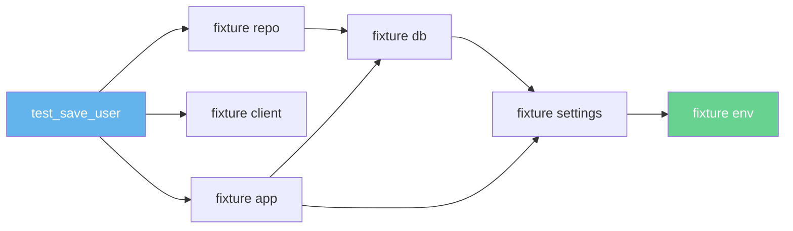
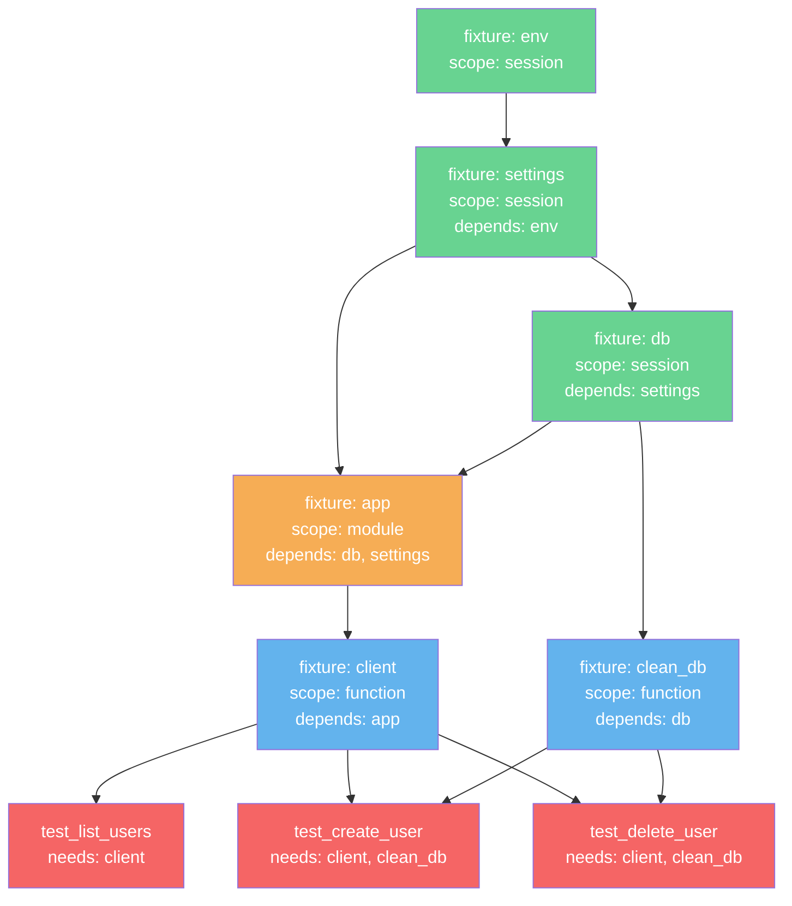
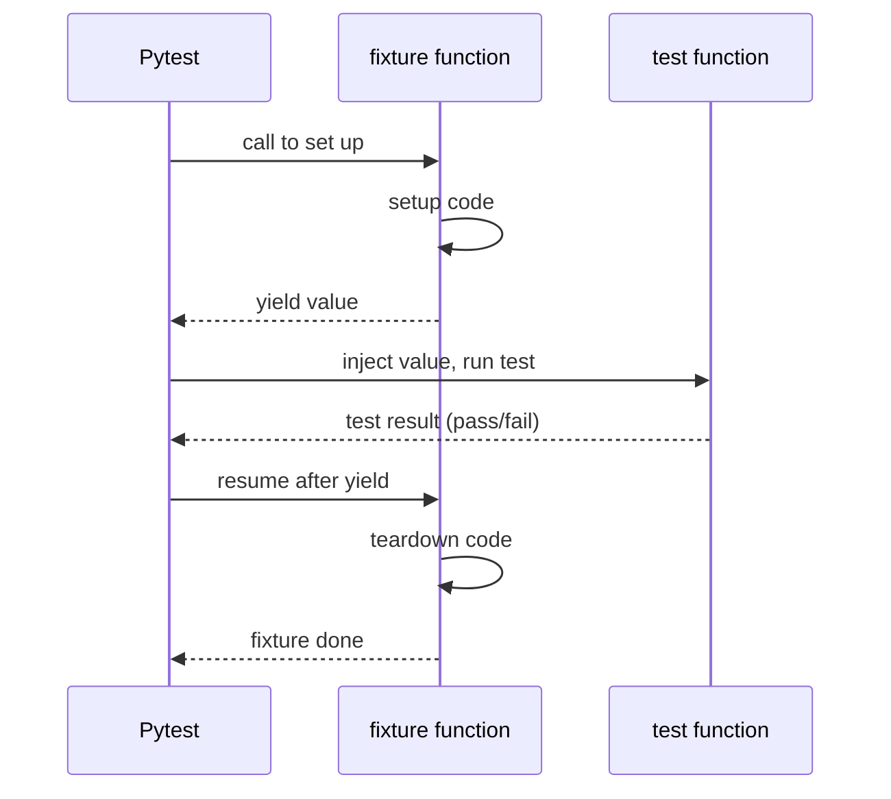
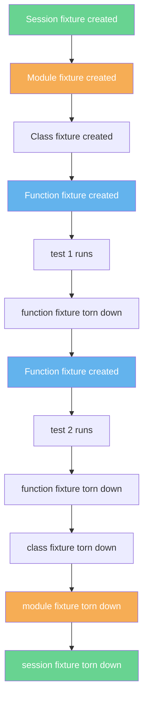

# 4. Fixtures and Parameterization

> [!note] Why this note exists
> Fixtures and parameterization are the two pytest features that, once internalized, make you never want to go back to `unittest`. **Fixtures** replace `setUp`/`tearDown` with composable, dependency-injected, scope-aware setup. **Parameterization** replaces `subTest` loops with first-class test cases that each get their own pass/fail line in the report. This note covers `@pytest.fixture`, the four scopes (`function`, `class`, `module`, `session`), fixture dependencies (fixtures using fixtures), the `conftest.py` mechanism, `@pytest.mark.parametrize`, parameter IDs, the `params` argument to fixtures, `pytest.param` for marks, `indirect` parameterization, and the patterns for testing without leaks. By the end, you'll write tests that read like specs and share expensive setup without hidden coupling.

## Why It Matters

Consider this `unittest` test:

```python
class TestUserRepo(unittest.TestCase):
    def setUp(self):
        self.db = Database("sqlite:///:memory:")
        self.db.connect()
        self.db.migrate()
        self.repo = UserRepository(self.db)

    def tearDown(self):
        self.db.close()

    def test_save(self):
        ...
```

The DB is created and destroyed for every test method. For 50 tests, that's 50 migrations. Tests take 30 seconds, even though each one needs only a few rows.

A pytest fixture fixes this with one keyword: `scope="session"`.

```python
@pytest.fixture(scope="session")
def db():
    database = Database("sqlite:///:memory:")
    database.connect()
    database.migrate()
    yield database
    database.close()

@pytest.fixture
def repo(db):    # depends on db
    db.execute("DELETE FROM users")   # clean slate per test
    return UserRepository(db)
```

Now the DB is created once. Each test gets a clean `repo` (because the per-function fixture truncates), but the expensive migrate runs only once. Suite time drops from 30 s to 2 s.

This is what fixtures buy you: **explicit, composable, scope-aware dependency injection**, replacing the implicit, class-bound, per-method setup of XUnit frameworks.

## Background

### The XUnit problem

In `unittest`, setup and teardown are methods on the test class. Every test in the class pays the cost. To share expensive setup across classes you need module-level `setUpModule`, which is awkward and untyped. Fixtures solve this by being **first-class objects** with their own identity, scope, and dependencies.

### Dependency injection, the pytest way

A pytest test declares what it needs by listing fixture names as parameters:

```python
def test_save_user(repo, app, client):
    ...
```

Pytest sees `repo`, `app`, `client` — looks them up in the fixture registry — and resolves them in dependency order. `repo` might need `db`, which might need `settings`, which might need `env`. Pytest builds the graph and injects values.



This is textbook **dependency injection**: the test doesn't construct its dependencies; it asks for them. The fixture graph handles construction.

### Fixture scopes

| Scope       | When the fixture is created                  | When it's torn down                  | Typical use                       |
|-------------|----------------------------------------------|--------------------------------------|-----------------------------------|
| `function`  | Once per test function (default)             | After each test function             | Per-test state, mocks, tmp files  |
| `class`     | Once per `Test*` class                        | After all methods in the class       | Class-shared resources            |
| `module`    | Once per test module (file)                   | After all tests in the file          | File-shared resources             |
| `session`   | Once per pytest run                           | At the end of the run                | DB connections, docker containers |
| `package`   | Once per test package (directory)             | After all tests in the package       | Package-level setup               |

The cost/benefit tradeoff: bigger scope = faster suite, but more risk of cross-test contamination. Mitigate by having a thin `function`-scoped fixture that resets state on top of the heavy `session`-scoped one.

### Fixture teardown: `yield`, not `return`

A fixture with teardown uses `yield` instead of `return`:

```python
@pytest.fixture
def db():
    db = Database()
    db.connect()
    yield db              # value handed to the test
    db.close()            # runs after the test, even on failure
```

Setup code runs *before* `yield`; teardown runs *after*. If the test raises, pytest still runs the teardown. Multiple teardowns are supported via `yield` in sequence (rare) or via `request.addfinalizer`.

### The `request` fixture

Every fixture can take a magic parameter named `request` to introspect the calling test:

```python
@pytest.fixture
def user(request):
    u = create_user(name=request.node.name)   # test name as username
    yield u
    u.delete()
```

`request` also gives you `request.param` (used with `params=`), `request.config` (pytest config), `request.cls` (the test class, if any), and `request.addfinalizer(fn)` (alternative to yield-based teardown).

## Main content

### Defining and using a fixture

```python
import pytest

@pytest.fixture
def account():
    """A fresh account with balance 100."""
    return Account(balance=100)

def test_deposit(account):
    account.deposit(50)
    assert account.balance == 150

def test_withdraw(account):
    account.withdraw(30)
    assert account.balance == 70
```

`account` is rebuilt for each test. If a test mutates it, the next test sees a fresh copy.

### Scopes in action

```python
@pytest.fixture(scope="session")
def spark():
    """Spark session — costs ~5s to start. Once per session."""
    from pyspark.sql import SparkSession
    spark = SparkSession.builder.appName("tests").getOrCreate()
    yield spark
    spark.stop()

@pytest.fixture(scope="module")
def sample_df(spark):
    """Load a small DataFrame once per test module."""
    return spark.read.csv("tests/fixtures/sample.csv", header=True)

@pytest.fixture
def clean_df(sample_df):
    """Per-test: ensure no rows have been deleted by previous tests."""
    # copy or recreate so tests don't share mutation
    return sample_df.alias("copy")
```

### Fixture dependencies (fixtures using fixtures)

```python
@pytest.fixture
def db():
    db = Database("sqlite:///:memory:")
    db.connect()
    db.migrate()
    yield db
    db.close()

@pytest.fixture
def repo(db):
    return UserRepository(db)

@pytest.fixture
def service(repo):
    return UserService(repo)

def test_create_user(service):
    user = service.create("alice@example.com")
    assert user.id is not None
```

Pytest sees `service` → `repo` → `db`, resolves them top-down. If `db` is `session`-scoped and `repo`/`service` are `function`-scoped, the database is created once and the repositories/services are recreated per test.

> [!info] Scope rule
> A fixture may only depend on fixtures of **equal or wider** scope. `function` can depend on `session`, but `session` cannot depend on `function` (a session fixture lives longer than a function fixture — the dependency would be stale). Pytest raises a `ScopeMismatch` error if you violate this.

### The `params` argument: parameterized fixtures

A fixture can run multiple times — once per parameter — by passing `params=`:

```python
@pytest.fixture(params=[
    {"driver": "sqlite", "url": "sqlite:///:memory:"},
    {"driver": "postgres", "url": "postgresql://localhost/test"},
    {"driver": "mysql", "url": "mysql://localhost/test"},
])
def db(request):
    db = Database(request.param["url"])
    db.connect()
    db.migrate()
    yield db
    db.drop()
    db.close()

def test_save(db):
    db.execute("INSERT INTO users (name) VALUES ('alice')")
    assert db.query("SELECT COUNT(*) FROM users")[0][0] == 1
```

Every test that uses `db` runs once per parameter. The test report shows:

```
test_save[sqlite] PASSED
test_save[postgres] PASSED
test_save[mysql] PASSED
```

This is how you test the same logic against multiple backends, configurations, or data shapes.

### `pytest.param` for per-parameter marks

```python
@pytest.fixture(params=[
    pytest.param("sqlite", id="sqlite"),
    pytest.param("postgres", id="postgres", marks=pytest.mark.slow),
    pytest.param("mysql", id="mysql", marks=pytest.mark.skip(reason="no mysql server")),
])
def db(request):
    ...
```

The `id=` controls the test ID in the report; `marks=` applies marks (slow, skip, xfail) to just that parameter's tests.

### `conftest.py`: shared fixtures

```python
# tests/conftest.py
import pytest
from myapp.app import create_app
from myapp.db import Database


@pytest.fixture(scope="session")
def db():
    db = Database("sqlite:///:memory:")
    db.connect()
    db.migrate()
    yield db
    db.close()


@pytest.fixture
def app(db):
    return create_app(testing=True, db=db)


@pytest.fixture
def client(app):
    return app.test_client()
```

Now any test in `tests/` (or its subdirectories) can request `db`, `app`, `client` by name — without importing anything. Pytest auto-loads `conftest.py` files, walking up the directory tree.

```python
# tests/api/test_users.py
def test_create_user(client):
    resp = client.post("/users", json={"name": "alice"})
    assert resp.status_code == 201
```

### Nested `conftest.py`

```
tests/
├── conftest.py              # shared by everything under tests/
├── unit/
│   ├── conftest.py          # shared by tests/unit/ only
│   └── test_thing.py
└── integration/
    ├── conftest.py          # shared by tests/integration/ only
    └── test_db.py
```

Fixtures defined in a deeper `conftest.py` override ones from a shallower file. This is fixture inheritance: a `client` fixture in `tests/integration/conftest.py` can extend the `client` from `tests/conftest.py` by depending on it.

### The `autouse` flag

```python
@pytest.fixture(autouse=True)
def reset_db(db):
    """Automatically runs before every test in this module/package."""
    db.execute("DELETE FROM users")
    db.execute("DELETE FROM orders")
    yield
```

`autouse=True` makes the fixture apply to every test in scope without being requested. Useful for cleanup that *must* always happen — but use sparingly, because it's invisible magic. A test that fails because of an autouse fixture's side effect is hard to debug.

### The `tmp_path` and `tmp_path_factory` fixtures

Built-in fixtures for filesystem isolation:

```python
def test_writes_file(tmp_path):
    # tmp_path is a unique pathlib.Path, fresh per test, auto-cleaned
    f = tmp_path / "out.txt"
    f.write_text("hello")
    assert f.read_text() == "hello"


@pytest.fixture(scope="session")
def shared_data_dir(tmp_path_factory):
    # tmp_path_factory gives session-scoped temp dirs
    return tmp_path_factory.mktemp("data")
```

Never write tests that touch the project's real files. Always use `tmp_path`.

### The `monkeypatch` fixture

Built-in for safe mutation of global state:

```python
def test_with_env(monkeypatch):
    monkeypatch.setenv("API_KEY", "test-key")
    monkeypatch.setattr("myapp.config.TIMEOUT", 5)
    monkeypatch.setattr("myapp.api.requests.get", fake_get)
    # ... test ...
# env, attribute, and patch are all restored after the test.
```

`monkeypatch` is the safe alternative to manual `unittest.mock.patch` for environment variables and module attributes. See [[5. Mocking with unittest.mock]] for the more powerful mock machinery.

### The `capsys`, `capfd`, `caplog` fixtures

```python
def test_stdout(capsys):
    print("hello")
    captured = capsys.readouterr()
    assert "hello" in captured.out

def test_logs(caplog):
    with caplog.at_level(logging.WARNING):
        login("alice", "wrong password")
    assert any("failed login" in r.message for r in caplog.records)
```

- `capsys` captures `sys.stdout` / `sys.stderr` (Python-level).
- `capfd` captures file descriptors 1/2 (C-level — for subprocess output).
- `caplog` captures log records. See [[1. The logging Module]] for context.

### `@pytest.mark.parametrize` — first-class parameterization

```python
@pytest.mark.parametrize("text, expected", [
    ("", 0),
    ("hello", 5),
    ("héllo", 5),                # Unicode-aware
    ("a b c", 5),                # counts spaces
    ("line1\nline2", 11),        # counts newline
], ids=["empty", "ascii", "unicode", "with-spaces", "with-newline"])
def test_length(text, expected):
    assert len(text) == expected
```

Each row is a separate test in the report. Failure of one doesn't stop the others.

### Combining fixtures with parameterization

Fixtures and `parametrize` compose:

```python
@pytest.mark.parametrize("user_id", [1, 2, 3])
def test_get_user(client, user_id):
    resp = client.get(f"/users/{user_id}")
    assert resp.status_code == 200
```

The fixture `client` is created per test; `user_id` varies. Three tests run, each with a fresh client.

### Indirect parameterization

Sometimes the parameter is too complex for `parametrize` to construct directly. Use `indirect=True` to defer to a fixture:

```python
@pytest.fixture
def user(request):
    """request.param is the dict from parametrize."""
    return User(**request.param)

@pytest.mark.parametrize("user, expected_role", [
    ({"name": "alice", "is_admin": True}, "admin"),
    ({"name": "bob", "is_admin": False}, "member"),
], indirect=["user"])
def test_user_role(user, expected_role):
    assert user.role == expected_role
```

The `indirect=["user"]` argument tells pytest: "for the `user` parameter, pass the value to the `user` fixture as `request.param` instead of using it directly."

### `pytest.fixture(params=...)` vs `pytest.mark.parametrize`

When to use which?

| Need                                                  | Use                          |
|-------------------------------------------------------|------------------------------|
| Same setup, multiple inputs to the test function      | `@pytest.mark.parametrize`   |
| Multiple variants of a *fixture* (e.g., DB backends)  | `@pytest.fixture(params=...)`|
| One test, one input, but the input requires setup     | Plain fixture                |
| Test needs *different* setups per case                | `parametrize` + `indirect`   |

Rule of thumb: if the variation is in the *data* the test consumes, use `parametrize`. If the variation is in the *environment* the test runs in, use a parameterized fixture.

### Yielding multiple values

A fixture can `yield` exactly once. For multiple-phase setup (rare), use `request.addfinalizer`:

```python
@pytest.fixture
def complex_resource(request):
    res = Resource()
    res.start_phase_1()
    request.addfinalizer(res.stop_phase_1)
    res.start_phase_2()
    request.addfinalizer(res.stop_phase_2)
    return res
```

Finalizers run in LIFO order — phase 2 stops before phase 1, which is what you want for nested setup.

## Mermaid diagrams

### Fixture dependency graph (a realistic example)



Green = session-scoped (created once per run). Orange = module-scoped (once per file). Blue = function-scoped (once per test). Red = tests themselves.

### Fixture lifecycle



### Scopes visualized



### Parameterization as combinatorial expansion

```mermaid
flowchart LR
    P[@pytest.mark.parametrize<br/>3 rows] --> T1[test_f[case1]]
    P --> T2[test_f[case2]]
    P --> T3[test_f[case3]]
    F[fixture db<br/>params=2 backends] --> F1[db variant: sqlite]
    F --> F2[db variant: postgres]
    F1 --> T1
    F1 --> T2
    F1 --> T3
    F2 --> T1
    F2 --> T2
    F2 --> T3
    style P fill:#63b3ed,color:#fff
    style F fill:#68d391,color:#fff
```

A test that takes both a parameterized fixture and `@parametrize` runs `rows × params` times. Beware: 5 parameters × 4 fixture variants × 10 tests = 200 tests. Use marks to keep the suite fast.

## Code examples

### Example 1: A session-scoped DB with per-test cleanup

```python
# tests/conftest.py
import pytest
from sqlalchemy import create_engine, text
from sqlalchemy.orm import sessionmaker
from myapp.models import Base


@pytest.fixture(scope="session")
def engine():
    eng = create_engine("sqlite:///:memory:")
    Base.metadata.create_all(eng)
    yield eng
    eng.dispose()


@pytest.fixture(scope="session")
def connection(engine):
    """One shared connection — sqlite :memory: would otherwise lose data per connection."""
    conn = engine.connect()
    yield conn
    conn.close()


@pytest.fixture
def db(connection):
    """Per-test transaction, rolled back at the end."""
    trans = connection.begin()
    Session = sessionmaker(bind=connection)
    session = Session()
    # Nest the transaction so the rollback doesn't close the connection
    nested = connection.begin_nested()
    @event.listens_for(session, "after_transaction_end")
    def restart_savepoint(session, transaction):
        if not nested.is_active:
            connection.begin_nested()
    yield session
    session.close()
    trans.rollback()
```

This is the famous **transactional test pattern**: each test runs in a savepoint that's rolled back at the end, so the schema (expensive) is created once but the data (cheap) is fresh per test.

### Example 2: Parameterized fixture with multiple backends

```python
@pytest.fixture(params=[
    pytest.param("sqlite", id="sqlite"),
    pytest.param("postgres", id="postgres", marks=pytest.mark.slow),
], scope="session")
def db(request):
    if request.param == "sqlite":
        url = "sqlite:///:memory:"
    elif request.param == "postgres":
        url = "postgresql://localhost/test"
    db = Database(url)
    db.connect()
    db.migrate()
    yield db
    db.close()


def test_save_and_load(db):
    db.execute("INSERT INTO users (name) VALUES ('alice')")
    rows = db.query("SELECT name FROM users")
    assert rows == [("alice",)]
```

### Example 3: A fixture that uses `request.param` and `request.getfixturevalue`

```python
@pytest.fixture
def storage(request):
    """Return a storage backend by name, set up just-in-time."""
    backend = request.param
    if backend == "memory":
        return MemoryStorage()
    elif backend == "disk":
        # delegate to another fixture
        return request.getfixturevalue("tmp_path") / "store.json"
    raise ValueError(backend)


@pytest.mark.parametrize("storage", ["memory", "disk"], indirect=True)
def test_save(storage):
    storage.save("key", "value")
    assert storage.load("key") == "value"
```

`request.getfixturevalue("name")` lets you call a fixture by name dynamically — useful when one fixture orchestrates others.

### Example 4: Marking slow tests via parametrize

```python
@pytest.mark.parametrize("size, expected_complexity", [
    (10, "fast"),
    (1_000, "fast"),
    pytest.param(100_000, "slow", marks=pytest.mark.slow),
    pytest.param(10_000_000, "slow", marks=pytest.mark.slow),
])
def test_sort(size, expected_complexity):
    data = list(range(size, 0, -1))
    sorted_data = sorted(data)
    assert sorted_data == list(range(1, size + 1))
```

`pytest -m "not slow"` skips the heavy cases; `pytest -m slow` runs only them.

### Example 5: Combinatorial parameterization with `pytest.param`

```python
COMPRESSORS = ["gzip", "brotli", "zstd"]
LEVELS = [1, 6, 9]

@pytest.mark.parametrize("compressor, level", [
    (c, l) for c in COMPRESSORS for l in LEVELS
], ids=[f"{c}-{l}" for c in COMPRESSORS for l in LEVELS])
def test_round_trip(compressor, level):
    data = b"hello " * 1000
    compressed = compress(data, compressor, level)
    assert decompress(compressed, compressor) == data
```

Nine tests, each with a readable ID like `gzip-1`, `brotli-9`.

### Example 6: Using `tmp_path_factory` for session-scoped fixtures

```python
@pytest.fixture(scope="session")
def spark_session(tmp_path_factory):
    from pyspark.sql import SparkSession
    warehouse = tmp_path_factory.mktemp("warehouse")
    spark = (
        SparkSession.builder
        .appName("tests")
        .config("spark.sql.warehouse.dir", str(warehouse))
        .getOrCreate()
    )
    yield spark
    spark.stop()


@pytest.fixture
def spark(spark_session):
    """Per-test: clear all temp tables."""
    for name in spark_session.catalog.listTables("default"):
        spark_session.sql(f"DROP TABLE IF EXISTS {name.name}")
    return spark_session
```

### Example 7: Conditional fixtures with `pytest.fixture` and `params`

```python
@pytest.fixture(params=[
    {"format": "json"},
    {"format": "yaml"},
    {"format": "toml"},
], ids=lambda p: p["format"])
def serializer(request):
    fmt = request.param["format"]
    if fmt == "json":
        return JsonSerializer()
    elif fmt == "yaml":
        return YamlSerializer()
    elif fmt == "toml":
        return TomlSerializer()


def test_round_trip(serializer):
    data = {"name": "alice", "age": 30}
    assert serializer.loads(serializer.dumps(data)) == data
```

The `ids=lambda` form auto-generates IDs from the parameter object — `test_round_trip[json]`, `test_round_trip[yaml]`, `test_round_trip[toml]`.

### Example 8: `autouse` for always-on setup

```python
@pytest.fixture(autouse=True)
def freeze_time(freezer):
    """Every test in this module runs with frozen time."""
    freezer.move_to("2024-01-15 12:00:00")
    yield


def test_greeting_morning():
    assert get_greeting() == "Good afternoon"
```

With `freezegun` (the library, not the fixture) installed, this becomes: every test in the file gets a deterministic clock, no per-test boilerplate.

## Common Pitfalls

> [!warning] Scope mismatch
> ```python
> @pytest.fixture(scope="session")
> def s(small_fixture):    # small_fixture is function-scoped
>     ...
> ```
> `ScopeMismatch: Fixture small_fixture is requested by session-scoped fixture s, but it is function-scoped`. Fix: make `small_fixture` wider-scoped, or `s` narrower.

> [!warning] Forgetting `yield` (or `return`)
> ```python
> @pytest.fixture
> def db():
>     db = Database()
>     db.connect()
>     # no return, no yield — fixture returns None
> ```
> The test receives `None`. Easy to miss because the failure looks like `AttributeError: 'NoneType' object has no attribute 'execute'`. Always `yield` (or `return`) the value.

> [!warning] Teardown never runs because the setup raised
> If the code *before* `yield` raises, the teardown code *after* `yield` does not run. For critical resources, use `try`/`finally`:
> ```python
> @pytest.fixture
> def db():
>     db = Database()
>     try:
>         db.connect()
>         yield db
>     finally:
>         db.close()
> ```

> [!warning] Mutating a shared fixture
> ```python
> @pytest.fixture(scope="module")
> def users():
>     return [User("alice"), User("bob")]
>
> def test_add_carol(users):
>     users.append(User("carol"))   # mutates shared state
>
> def test_count(users):
>     assert len(users) == 2       # FAILS — carol is still there
> ```
> Either make the fixture `function`-scoped, or have each test work on a copy.

> [!warning] `autouse` surprises
> An `autouse=True` fixture silently applies to every test in scope. If it has a side effect (deletes files, mutates env), tests far away can break mysteriously. Reserve `autouse` for cleanup that *must* always run.

> [!warning] Parameterization explosion
> ```python
> @pytest.mark.parametrize("a", [1, 2, 3])
> @pytest.mark.parametrize("b", [4, 5])
> @pytest.mark.parametrize("c", [6, 7, 8, 9])
> def test_xyz(a, b, c): ...
> ```
> That's 3 × 2 × 4 = 24 tests for one function. Multiply by 100 test functions and you have 2,400 tests. Use sparingly; consider combining axes when they're not independent.

> [!warning] Fixture name collisions
> ```python
> # tests/conftest.py
> @pytest.fixture
> def user(): ...
>
> # tests/api/conftest.py
> @pytest.fixture
> def user(): ...    # overrides the parent
> ```
> The deeper `conftest.py` wins. Tests in `tests/api/` get the override; tests elsewhere get the parent. Document the override or use distinct names (`api_user`).

> [!warning] Yielding the wrong thing
> ```python
> @pytest.fixture
> def repo(db):
>     repo = UserRepository(db)
>     yield db     # WRONG — yields db, not repo
>     repo.close()
> ```
> Test gets the database, not the repository. Always `yield` the object the test expects.

> [!warning] Using `request.param` without `params=`
> ```python
> @pytest.fixture
> def f(request):
>     return request.param   # AttributeError: 'FixtureRequest' has no 'param'
> ```
> `request.param` is only set when the fixture has `params=` or is invoked via `indirect=`. Otherwise it doesn't exist.

> [!warning] `--cov` reports 0% coverage in a parameterized run
> With `pytest-xdist`, coverage data needs to be merged. Use `pytest-cov >= 2.5` and put `--cov` in `addopts` so every worker picks it up. The `.coverage` files from each worker are auto-merged.

> [!warning] Forgetting to clean up `tmp_path` data
> `tmp_path` itself is cleaned, but if you wrote files to other locations (`~/.config/...`), they persist. Use `monkeypatch.setattr` to redirect or `tmp_path` everywhere.

> [!warning] Tests that depend on each other through a fixture's state
> If `test_a` mutates a `module`-scoped fixture and `test_b` reads it, your suite is order-dependent. The fix is per-test cleanup, not module scope.

## Tips and Tricks

- **Default to `function` scope.** Only widen when you've measured that the setup is slow. Most fixtures should be per-test.
- **Use `scope="session"` for resources that take >1s to start.** Databases, Spark, Selenium, docker containers, SSH tunnels. The single creation saves minutes across a suite.
- **For DBs, use the transactional pattern.** Each test runs in a savepoint, rolled back at the end. Schema is created once per session, data is fresh per test.
- **Compose, don't inherit.** `def repo(db)` is better than `class TestRepoWithDb:` with `setUp`. Composition is more flexible.
- **Name fixtures by what they provide, not what they set up.** `client`, `db`, `repo`, `app` — not `setup_db_and_app`.
- **Document fixtures with docstrings.** They show up in `pytest --fixtures` output:
  ```bash
  pytest --fixtures
  ```
- **Use `pytest --fixtures-per-test`** to see which fixtures each test pulls in. Useful for debugging slow tests.
- **`pytest --setup-show`** traces fixture setup/teardown for each test. Invaluable for understanding scope interactions.
- **For `conftest.py`-only fixtures, consider extracting to a small in-house plugin.** A `pip install -e .` of a `mycompany-pytest-plugin` package lets all your projects share fixtures.
- **Use `pytest.param(..., id=..., marks=...)` aggressively.** Readable IDs make failures actionable. Marks let you skip slow parameter combinations.
- **`indirect=True` for parameters that need construction.** Cleaner than calling factories inside the test body.
- **Cache expensive fixture results.** `@functools.lru_cache` on a helper function, plus a thin fixture wrapper, gives you memoization without polluting the test API.
- **Use `pytest.fixture(autouse=True)` for module-wide invariants** like frozen time, fake filesystems, or disabled network — but document it loudly.
- **`pytest --co` (collect-only) sanity-checks parameterization.** Run it before a long suite to confirm the test count.
- **Profile fixtures with `pytest --durations=10`**. The slowest entries are usually session-scoped setup you can optimize.
- **Use `pytest-deadfixtures` to find unused fixtures.** Dead fixtures rot; remove them.
- **For async fixtures, use `pytest-asyncio`'s `@pytest_asyncio.fixture`.** Plain `@pytest.fixture` doesn't await async generators.
- **Reset mutable defaults explicitly.** `def f(items=[])` is a Python anti-pattern; `@pytest.fixture def items(): return []` is the fixture equivalent of fixing it.
- **For environment-variable-heavy tests, use `monkeypatch.setenv`.** Never `os.environ[...] = ...` directly — it leaks.
- **Factor repeated assertions into helper functions**, not fixtures. Fixtures are for setup; assertion helpers are just functions.

## Active Recall

1. What problem does a fixture solve that `setUp`/`tearDown` doesn't?
2. List the four fixture scopes. When is each appropriate?
3. Write a fixture that opens a database, yields it, and closes it on teardown — even if the test raises.
4. What's the scope rule for fixture dependencies? Can a `function` fixture depend on a `session` fixture? Vice versa?
5. What does `params=` do on `@pytest.fixture`? How is each parameter exposed inside the fixture?
6. What does `pytest.param(..., id=..., marks=...)` buy you over a plain tuple?
7. What's `conftest.py`? What's special about how pytest loads it?
8. What does `autouse=True` do? When should you avoid it?
9. Write a parameterized test for `add(a, b)` with three input rows and custom IDs.
10. What's the difference between `@pytest.fixture(params=...)` and `@pytest.mark.parametrize`? When do you use which?
11. What does `indirect=True` mean in `@pytest.mark.parametrize`?
12. Name three built-in pytest fixtures and what they do.
13. How do you test that a fixture's teardown runs even if the test fails?
14. How would you share a Spark session across a 1000-test suite without recreating it per test?
15. What's the transactional test pattern, and why does it make DB tests fast?

## Next Steps

- For replacing dependencies with controlled fakes, see [[5. Mocking with unittest.mock]] — mocks and fixtures compose naturally.
- For measuring what your suite actually exercises, see [[6. Coverage and CI]].
- For the bigger picture of test design, revisit [[1. Testing Concepts]].
- For pytest basics (assertion, marks, configuration), see [[3. pytest]].
- For the standard-library alternative, see [[2. unittest]] — `setUp`/`tearDown` is the XUnit way of doing what fixtures do.
