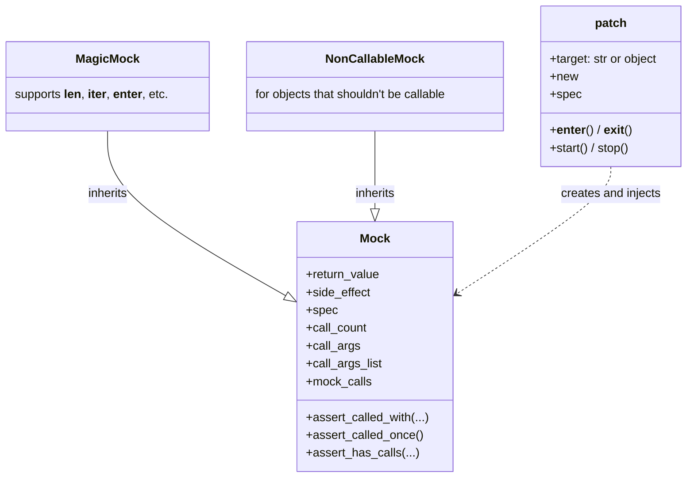
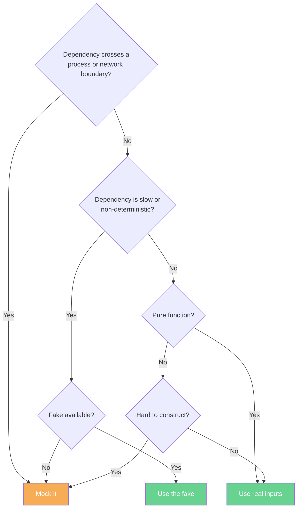
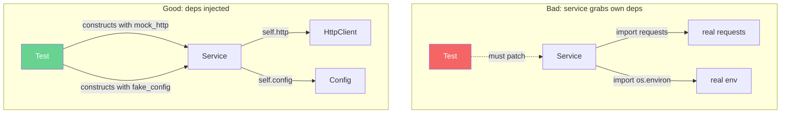
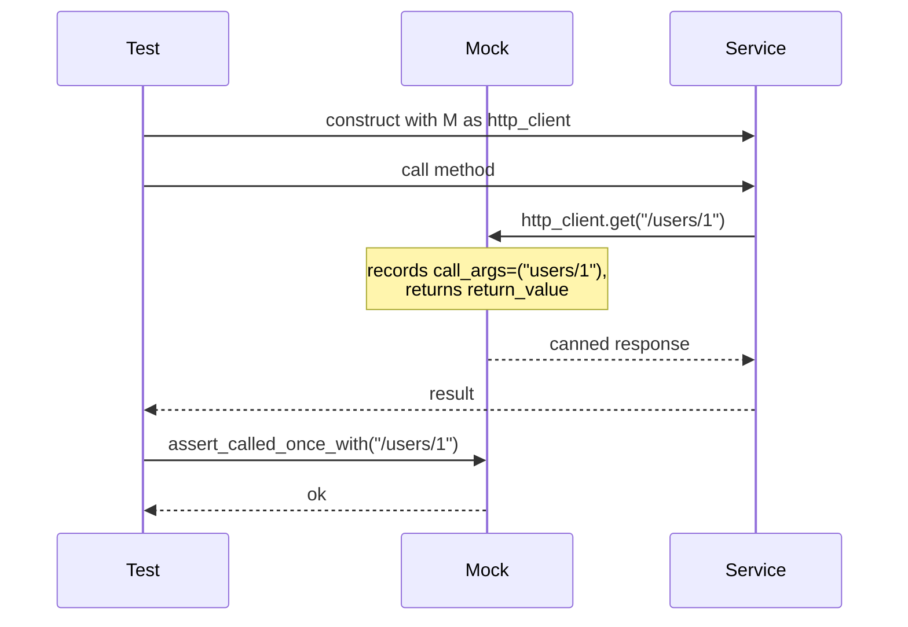
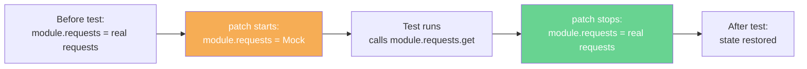

# 5. Mocking with unittest.mock

> [!note] Why this note exists
> `unittest.mock` is Python's standard-library answer to "I need to test code that calls things I don't want to actually call." It's the in-process equivalent of replacing the database, the network, the filesystem, or `datetime.now()` with a controllable stand-in. This note covers the core objects (`Mock`, `MagicMock`, `NonCallableMock`), the patching machinery (`@patch`, `patch.object`, `patch.dict`, `patch.multiple`), the assertion helpers (`assert_called_with`, `assert_called_once`, `assert_has_calls`), the configuration knobs (`return_value`, `side_effect`), the spec concept, and — most importantly — *when* to mock and when not to. By the end, you'll be able to isolate any dependency, and you'll know why over-mocking is one of the most common test-suite pathologies.

## Why It Matters

Consider:

```python
# pricing.py
import requests

def get_price(symbol):
    resp = requests.get(f"https://api.example.com/prices/{symbol}")
    resp.raise_for_status()
    return resp.json()["price"]
```

How do you test this? Options:

1. **Hit the real API.** Slow, flaky, rate-limited, requires network, breaks when the API changes. Reject.
2. **Spin up a fake API server.** Better, but heavyweight — `responses` or `VCR.py` do this for HTTP. Worth it for HTTP-heavy code.
3. **Mock `requests.get`.** Replace it with a fake that returns canned responses. Fast, isolated, deterministic.

Mocking is option 3. It's the right tool when:

- The dependency is slow (network, disk, DB).
- The dependency is non-deterministic (clock, random, real network).
- The dependency has side effects you don't want (sends email, charges a credit card).
- The dependency doesn't exist yet (you're writing the caller before the callee — TDD).

It's the *wrong* tool when:

- The code is pure (just use real inputs).
- A fake is available (in-memory DB, fake filesystem).
- The mock would be more complex than the code under test.

## Background

### What's a mock, really?

A **mock** is an object that:

1. Records every call made to it.
2. Returns configurable values.
3. Can raise exceptions on demand.
4. Can be configured to *look like* another object (its "spec").

In Python, `unittest.mock.Mock` is the base. `MagicMock` is `Mock` plus support for magic methods (`__len__`, `__iter__`, `__enter__`, etc.) — use `MagicMock` by default.

### The XUnit vocabulary recap

See [[1. Testing Concepts]] for the full table. Quick reminder:

- **Dummy** — passed but never used.
- **Stub** — returns canned answers.
- **Spy** — records calls, often wraps a real object.
- **Mock** — stub + spy + pre-programmed expectations.
- **Fake** — a working but simplified implementation (in-memory DB).

`unittest.mock` provides mock, stub, and spy capabilities. Fakes you write by hand.

### The four parts of `unittest.mock`



### Why dependency injection matters

Mocks work best when the code under test gets its dependencies from outside:

```python
# Good — dependency is injected
class PricingService:
    def __init__(self, http_client):
        self.http = http_client

    def get_price(self, symbol):
        return self.http.get(f"/prices/{symbol}").json()["price"]

# Test: pass a mock http_client
def test_get_price():
    mock_http = Mock()
    mock_http.get.return_value.json.return_value = {"price": 42}
    service = PricingService(mock_http)
    assert service.get_price("AAPL") == 42
```


When the code grabs its own dependencies (e.g., `import requests` at module level), you must **patch** the reference — see below.

## Main content

### Creating a Mock

```python
from unittest.mock import Mock, MagicMock

m = Mock()
m()                            # calls it — returns a new Mock by default
m.foo                          # any attribute access returns a Mock
m.foo.bar(1, 2).baz            # the chain is auto-created; all return Mocks
```

Every attribute access on a `Mock` returns the same child mock (it's memoized). So `m.foo is m.foo` is `True`. This is what lets you set up expectations before the call:

```python
m = Mock()
m.config.get.return_value = {"timeout": 30}

# ... code under test calls m.config.get() ...

assert m.config.get.return_value == {"timeout": 30}
```

### Configuring return values

```python
m = Mock()
m.get_user.return_value = {"id": 1, "name": "alice"}
assert m.get_user(1) == {"id": 1, "name": "alice"}
```

`return_value` is what the mock returns when called.

For attribute access (no call), just assign:

```python
m = Mock()
m.timeout = 5          # attribute, not call
assert m.timeout == 5
```

### `side_effect` — return sequence, raise, or call

`side_effect` overrides `return_value` and can be:

1. **A function** — called with the same args as the mock; its return value is returned.
2. **An iterable** — each call returns the next item; useful for returning different values per call.
3. **An exception** (instance or class) — raised on every call.

```python
# 1. Function — transform args
m = Mock()
m.side_effect = lambda x: x * 2
assert m(3) == 6

# 2. Iterable — return sequence
m = Mock()
m.side_effect = [1, 2, 3]
assert m() == 1
assert m() == 2
assert m() == 3
m()   # StopIteration

# 3. Exception — raise
m = Mock()
m.side_effect = ValueError("boom")
m()   # raises ValueError("boom")

# 3b. Exception class — instantiated with the call args
m = Mock()
m.side_effect = TypeError
m("foo")   # raises TypeError("foo")
```

`side_effect` is how you simulate "the API failed on the third call" or "the function should raise on bad input."

To return a value AND raise (rare), return `DEFAULT` from the function:

```python
from unittest.mock import DEFAULT

m = Mock()
m.side_effect = lambda x: (print(f"called with {x}"), DEFAULT)[1]
```

### Assertions on calls

```python
m = Mock()
m("alice")
m("bob", role="admin")

m.assert_called()                              # was called at least once
m.assert_called_once()                         # was called exactly once — fails here
m.assert_called_with("bob", role="admin")     # last call matched
m.assert_called_once_with("bob", role="admin") # exactly one call matching
m.assert_any_call("alice")                     # any call matched
m.assert_has_calls([
    call("alice"),
    call("bob", role="admin"),
], any_order=False)                            # these calls happened in order
```

`call` is a helper that constructs a call record. `assert_has_calls` checks a sequence of calls appeared in the call history (others may interleave).

### Inspecting calls

```python
m = Mock()
m("alice")
m("bob", role="admin")

m.called              # True
m.call_count          # 2
m.call_args           # call("bob", role="admin") — the last call
m.call_args_list      # [call("alice"), call("bob", role="admin")] — all calls
m.method_calls        # calls to methods on the mock
m.mock_calls          # full hierarchy of calls (including child mocks)
```

`call_args.args` and `call_args.kwargs` give you the unpacked call:

```python
m("bob", role="admin")
m.call_args.args    # ("bob",)
m.call_args.kwargs  # {"role": "admin"}
```

### `MagicMock` — magic methods supported

`Mock` does *not* support magic methods. `len(mock)`, `iter(mock)`, `with mock as x:` — all raise `TypeError`. Use `MagicMock`:

```python
from unittest.mock import MagicMock

m = MagicMock()
m.__len__.return_value = 3
assert len(m) == 3

m.__iter__.return_value = iter([1, 2, 3])
assert list(m) == [1, 2, 3]

m.__enter__.return_value = "context value"
with m as x:
    assert x == "context value"

m.__getitem__.return_value = "value"
assert m["any_key"] == "value"
```

`MagicMock` is the default for `@patch` unless you specify otherwise.

### `spec` — make a mock look like the real thing

A bare `Mock()` accepts any attribute or method call — typos go unnoticed. `spec=` constrains the mock to the attributes of the spec object:

```python
class HttpClient:
    def get(self, url): ...
    def post(self, url, data): ...

m = Mock(spec=HttpClient)
m.get("https://example.com")   # OK
m.potst("https://example.com") # AttributeError — "Mock object has no attribute 'potst'"
                                # spec caught the typo
```

`spec_set=True` is stricter: it also forbids *setting* attributes that don't exist on the spec.

`autospec=True` on `@patch` is even better: it creates a mock with the same signature as the real function, so calling with wrong args fails.

### Patching: replacing references with mocks

Mocking individual objects is fine for dependency-injected code. But when the code under test grabs its own dependencies (e.g., `import requests` at module top), you need to **patch** the reference at the location where it's looked up.

#### `@patch` decorator

```python
# pricing.py
import requests

def get_price(symbol):
    resp = requests.get(f"https://api.example.com/prices/{symbol}")
    resp.raise_for_status()
    return resp.json()["price"]


# test_pricing.py
from unittest.mock import patch, Mock

@patch("pricing.requests.get")
def test_get_price(mock_get):
    mock_get.return_value.json.return_value = {"price": 42}
    mock_get.return_value.raise_for_status.return_value = None

    assert get_price("AAPL") == 42
    mock_get.assert_called_once_with("https://api.example.com/prices/AAPL")
```

The string `"pricing.requests.get"` means: in the `pricing` module, find the `requests` attribute, then its `get` attribute, and replace it with a mock for the duration of the test. The mock is injected as the test function's argument (in reverse order of decorators).

> [!info] Where to patch
> The rule: **patch where the name is looked up, not where it's defined.** `requests` is *defined* in the `requests` package, but it's *looked up* in `pricing` (because `pricing` did `import requests`). Patching `requests.get` would not affect code in `pricing` if `pricing` had done `from requests import get` — in that case you'd patch `pricing.get`. The dotted path tells patch where the binding lives.

#### `with patch(...)` context manager

```python
def test_get_price():
    with patch("pricing.requests.get") as mock_get:
        mock_get.return_value.json.return_value = {"price": 42}
        assert get_price("AAPL") == 42
    # patch is undone here
```

Useful when you only want the patch for part of the test.

#### `patch.object` — patch an attribute of an object

```python
from myapp import settings

@patch.object(settings, "DEBUG", True)
def test_debug_mode():
    assert settings.DEBUG is True
```

`patch.object(obj, "attr", new_value)` is the same as `patch("module.obj.attr")` but more dynamic — useful when the object is computed at runtime.

#### `patch.dict` — patch a dictionary (e.g., `os.environ`)

```python
from unittest.mock import patch

@patch.dict("os.environ", {"API_KEY": "test-key", "NEW_VAR": "x"})
def test_with_env():
    import os
    assert os.environ["API_KEY"] == "test-key"
# API_KEY and NEW_VAR are restored (or removed, if they didn't exist before) after.
```

`patch.dict` is the safe way to test environment-variable-dependent code. It accepts a `clear=True` flag to wipe the dict entirely during the test.

#### `patch.multiple` — patch several names at once

```python
@patch.multiple("pricing", requests=Mock(), time=Mock())
def test_get_price(requests, time):
    ...
```

#### `patch` as a context manager with `start()` / `stop()`

For `setUp`/`tearDown` patterns:

```python
class TestPricing(unittest.TestCase):
    def setUp(self):
        patcher = patch("pricing.requests.get")
        self.mock_get = patcher.start()
        self.addCleanup(patcher.stop)

    def test_get_price(self):
        ...
```

`addCleanup` ensures the patch is undone even if the test fails.

### Configuring child mocks

```python
@patch("pricing.requests.get")
def test_get_price(mock_get):
    # mock_get.return_value is the response object
    response = mock_get.return_value
    response.json.return_value = {"price": 42}
    response.raise_for_status.return_value = None
    response.status_code = 200

    assert get_price("AAPL") == 42
```

The pattern: `mock.return_value` is the object the mocked function returns. Configure *its* attributes for the test.

### `side_effect` to simulate errors

```python
@patch("pricing.requests.get")
def test_get_price_retries_on_timeout(mock_get):
    mock_get.side_effect = [
        requests.Timeout("first attempt"),
        requests.Timeout("second attempt"),
        Mock(json=lambda: {"price": 42}, raise_for_status=lambda: None),
    ]
    assert get_price_with_retry("AAPL") == 42
    assert mock_get.call_count == 3
```

### `autospec=True` — patch with the real signature

```python
@patch("pricing.requests.get", autospec=True)
def test_get_price(mock_get):
    mock_get.return_value.json.return_value = {"price": 42}
    get_price("AAPL")
    mock_get.assert_called_once_with("https://api.example.com/prices/AAPL")
    # If the test called get(1, 2, 3) instead of get(url), autospec would fail
    # with TypeError — the real requests.get doesn't accept that signature.
```

`autospec=True` is a free correctness check — use it whenever you can.

### `create_autospec` — make a mock with the right signature

```python
from unittest.mock import create_autospec
from myapp import HttpClient

mock_client = create_autospec(HttpClient)
mock_client.get.return_value = {"price": 42}

# Code under test:
service = PricingService(mock_client)
service.get_price("AAPL")
mock_client.get.assert_called_once_with("/prices/AAPL")
```

The mock has the same interface as `HttpClient`; calling a non-existent method or passing wrong args fails.

### Spies: wrapping real objects

`wraps=` makes a mock that delegates to a real object, but records calls:

```python
real_list = [1, 2, 3]
spy = Mock(wraps=real_list)
spy.append(4)
assert spy.append.call_count == 1
assert real_list == [1, 2, 3, 4]   # the real call happened
```

Useful when you want to assert "this method was called" without disabling the real behavior.

### The `mocker` fixture (pytest-mock)

If you use `pytest`, install `pytest-mock` for a cleaner API:

```python
pip install pytest-mock

def test_get_price(mocker):
    mock_get = mocker.patch("pricing.requests.get")
    mock_get.return_value.json.return_value = {"price": 42}

    assert get_price("AAPL") == 42
    mock_get.assert_called_once_with("https://api.example.com/prices/AAPL")
```

`mocker` is a fixture that wraps `unittest.mock` and auto-stops patches at the end of the test. It also provides `mocker.spy`, `mocker.stub`, and `mocker.patch.object`.

### When to mock vs when not to



Rules of thumb:

- **Mock at the seams**: the boundaries of your system. Network, filesystem, clock, random, third-party SDKs.
- **Don't mock your own code** if you can test it through its public API. Mocking internals couples tests to call shape.
- **Prefer fakes to mocks** when a fake is easy (in-memory DB, fake filesystem). Fakes don't break under refactors.
- **Don't mock the SUT** (system under test). If you're mocking the thing you're testing, you're testing the mock.

## Mermaid diagrams

### Dependency injection for testability



### Mock call recording



### Patch lifecycle



## Code examples

### Example 1: Mocking a database

```python
from unittest.mock import MagicMock
from myapp.repository import UserRepository

def test_save_user_calls_db():
    mock_db = MagicMock()
    repo = UserRepository(mock_db)

    repo.save({"name": "alice"})

    mock_db.execute.assert_called_once()
    sql, params = mock_db.execute.call_args.args
    assert "INSERT INTO users" in sql
    assert params == ("alice",)
```

### Example 2: Mocking `datetime.now()`

```python
from unittest.mock import patch
from datetime import datetime
from myapp import greeting

@patch("myapp.greeting.datetime")
def test_morning_greeting(mock_dt):
    mock_dt.now.return_value = datetime(2024, 6, 15, 8, 0, 0)
    assert greeting.get_time_based_greeting() == "Good morning"

@patch("myapp.greeting.datetime")
def test_evening_greeting(mock_dt):
    mock_dt.now.return_value = datetime(2024, 6, 15, 20, 0, 0)
    assert greeting.get_time_based_greeting() == "Good evening"
```

> [!tip] `freezegun` is better
> For time mocking, prefer `freezegun.freeze_time("2024-06-15 08:00:00")`. It patches `datetime` correctly across the standard library, `time.time()`, and many third-party packages. Hand-rolling `@patch("...datetime")` is error-prone.

### Example 3: Mocking a chained call

```python
@patch("pricing.requests.get")
def test_get_price(mock_get):
    # Equivalent: mock_get.return_value.json.return_value = {"price": 42}
    # But more readable with configure_mock:
    mock_get.configure_mock(
        return_value=Mock(
            status_code=200,
            json=lambda: {"price": 42},
            raise_for_status=lambda: None,
        )
    )

    assert get_price("AAPL") == 42
```

### Example 4: `side_effect` for sequences and exceptions

```python
@patch("myapp.api.requests.post")
def test_retry_then_succeed(mock_post):
    mock_post.side_effect = [
        ConnectionError("network down"),
        ConnectionError("still down"),
        Mock(status_code=200, json=lambda: {"id": 1}),
    ]
    result = create_user_with_retry({"name": "alice"}, retries=5)
    assert result["id"] == 1
    assert mock_post.call_count == 3


@patch("myapp.api.requests.post")
def test_gives_up_after_max_retries(mock_post):
    mock_post.side_effect = ConnectionError("permanent")
    with pytest.raises(MaxRetriesExceeded):
        create_user_with_retry({"name": "alice"}, retries=3)
    assert mock_post.call_count == 3   # 1 initial + 2 retries
```

### Example 5: `assert_has_calls` for ordered call sequences

```python
from unittest.mock import patch, call

@patch("myapp.notifications.email.send")
@patch("myapp.notifications.sms.send")
def test_notify_both_channels(mock_sms, mock_email):
    notify(user="alice", message="hello")

    # Both should have been called, in this order
    mock_sms.assert_has_calls([call("+15551234", "hello")])
    mock_email.assert_has_calls([call("alice@example.com", "hello")])

    # Or check that the system made calls in a specific order across mocks
    # (use a parent Mock to record all calls)
```

### Example 6: `autospec` catches signature bugs

```python
from unittest.mock import patch

@patch("myapp.api.requests.get", autospec=True)
def test_signature_checked(mock_get):
    mock_get.return_value.json.return_value = {"price": 42}
    # If get_price internally called requests.get(url, timeout=30, headers=...)
    # but the test expects requests.get("..."), autospec will accept it
    # (because the real requests.get accepts those kwargs).
    # If the code calls requests.get(1, 2, 3) — positional where real takes
    # (url, params=None, **kwargs) — autospec raises TypeError.
    get_price("AAPL")
    mock_get.assert_called_once_with("https://api.example.com/prices/AAPL")
```

### Example 7: `patch.dict` for env vars

```python
from unittest.mock import patch

@patch.dict("os.environ", {
    "DATABASE_URL": "sqlite:///test.db",
    "DEBUG": "true",
    "SECRET_KEY": "test-secret",
})
def test_config_from_env():
    from myapp.config import Config
    cfg = Config.from_env()
    assert cfg.debug is True
    assert cfg.database_url == "sqlite:///test.db"
# Env vars restored after the test.
```

### Example 8: Spying on a real object

```python
from unittest.mock import Mock
from myapp.cache import Cache

def test_cache_hit_after_first_miss():
    real_cache = Cache()                  # real implementation, in-memory
    spy = Mock(wraps=real_cache)

    service = MyService(cache=spy)
    service.get("user:1")                 # miss — fetches from DB
    service.get("user:1")                 # hit — returns from cache

    assert spy.get.call_count == 2        # both calls went through
    # Verify that the underlying DB was only called once:
    # (use a spy on the DB, or count rows in a fake DB)
```

### Example 9: pytest-mock's `mocker` fixture

```python
def test_get_price(mocker):
    mock_get = mocker.patch("pricing.requests.get")
    mock_get.return_value.json.return_value = {"price": 42}

    assert get_price("AAPL") == 42

    mocker.patch("pricing.requests.post", return_value=Mock(status_code=201))
    # All patches are auto-stopped at the end of the test.
```

### Example 10: A custom fake

When a mock would be too verbose, write a fake:

```python
class FakeHttpClient:
    """A minimal in-memory HTTP client for tests."""
    def __init__(self):
        self.routes = {}     # (method, path) -> response
        self.calls = []      # recorded calls

    def register(self, method, path, response):
        self.routes[(method, path)] = response

    def get(self, url, **kwargs):
        self.calls.append(("GET", url, kwargs))
        for (method, path), resp in self.routes.items():
            if method == "GET" and url.endswith(path):
                return resp
        raise NotFound(url)

    def post(self, url, json=None, **kwargs):
        self.calls.append(("POST", url, json, kwargs))
        ...


def test_get_user():
    fake = FakeHttpClient()
    fake.register("GET", "/users/1", Mock(json=lambda: {"name": "alice"}))
    service = PricingService(fake)
    assert service.get_user_name(1) == "alice"
    assert ("GET", "/users/1", ...) in fake.calls
```

A fake gives you a working but simplified implementation that survives refactors better than mocks do.

## Common Pitfalls

> [!warning] Patching the wrong location
> ```python
> @patch("requests.get")    # WRONG if pricing.py did `import requests`
> ```
> Patch where the name is looked up, not where it's defined. For `import requests` in `pricing.py`, patch `pricing.requests.get`. For `from requests import get` in `pricing.py`, patch `pricing.get`. Get this wrong and the test passes but exercises the real `requests.get`.

> [!warning] Forgetting `autospec=True`
> A bare `Mock()` accepts any call signature. `m.get(1, 2, 3, foo="bar")` doesn't fail even if the real `get` only accepts `url`. With `autospec=True` (or `spec=`), the mock enforces the real signature — typos and arg-count bugs surface immediately.

> [!warning] Mock chaining too deep
> ```python
> mock.a.b.c.d.e.return_value = 42
> ```
> If you're configuring a five-deep chain, the code under test is probably too coupled. Refactor to inject the specific object you need.

> [!warning] Asserting on implementation, not behavior
> ```python
> mock.assert_called_with("SELECT * FROM users")   # SQL string in test
> ```
> Refactoring the SQL breaks the test even though behavior didn't change. Prefer to assert on the *outcome* (what the function returns, what's in the DB after) rather than the *call sequence*.

> [!warning] Over-mocking
> If every test patches five collaborators, the suite breaks under any refactor. The right response is usually to refactor the code: extract pure functions, inject dependencies, write fakes. See "When to mock" above.

> [!warning] Mocking `open()`
> ```python
> @patch("builtins.open", mock_open(read_data="hello"))
> ```
> This works but is fragile — it patches `open` globally. Prefer `tmp_path` (write a real file) for file-handling tests. Only use `mock_open` when you can't or shouldn't write a real file.

> [!warning] `MagicMock` vs `Mock`
> ```python
> m = Mock()
> with m as x: ...    # TypeError: object is not callable in context manager
> ```
> `Mock` doesn't support `__enter__`/`__exit__`. Use `MagicMock` for context managers, `len()`, iteration, indexing.

> [!warning] `side_effect` returning `None`
> ```python
> m = Mock()
> m.side_effect = lambda x: x > 0
> m(-1)   # returns False — not "raises"!
> ```
> If the function returns `None`, the mock returns `None` — it doesn't fall back to `return_value`. Returning `False` or `0` is also a real return value. To explicitly use `return_value`, return `DEFAULT` from the function.

> [!warning] Tests that pass when the code does nothing
> ```python
> @patch("pricing.requests.get")
> def test_get_price(mock_get):
>     mock_get.return_value.json.return_value = {"price": 42}
>     # ... forgot to actually call get_price ...
>     mock_get.assert_called_once_with("https://api.example.com/prices/AAPL")
> ```
> `assert_called_once_with` fails — but only because the test forgot to invoke the SUT. Always call the function under test before asserting on its effects.

> [!warning] Mocking things you don't own
> Patching `requests` is fine. Patching `pandas.DataFrame.groupby` is dangerous — the library's internals can change between minor versions, and your mock won't track them. Wrap third-party libraries in your own thin layer, then mock that layer.

> [!warning] `patch.stop()` not called
> If you start a patcher with `patcher.start()` and forget `patcher.stop()`, the patch leaks into other tests. Use `addCleanup(patcher.stop)` or the context-manager / decorator form.

> [!warning] Mock instances aren't equal
> ```python
> m1 = Mock()
> m2 = Mock()
> m1 == m2   # False — they're different mock objects
> ```
> Even with identical configuration, two `Mock` instances are not equal. If your code compares two mocks for equality, you'll get surprising results. Use `m1.assert_called_with(...)` to check call patterns.

> [!warning] `mock.return_value.foo = ...` vs `mock.foo.return_value = ...`
> The first sets an attribute on the return value of the mock. The second sets the return value of an attribute (method) on the mock. They mean different things:
> ```python
> m = Mock()
> m.foo.return_value = 1     # calling m.foo() returns 1
> m.return_value.foo = 2     # calling m().foo returns 2
> ```

## Tips and Tricks

- **Default to `MagicMock`.** Use plain `Mock` only when you explicitly want to forbid magic methods (rare).
- **Use `autospec=True` everywhere you can.** It catches typos, signature changes, and argument-count bugs for free.
- **Patch at the boundary.** Mock at the edges of your system (HTTP, DB, filesystem). Inside, use real objects.
- **Prefer fakes to mocks.** A `FakeHttpClient` is more refactor-resilient than `mocker.patch("requests.get")`.
- **Use `assert_has_calls` instead of multiple `assert_called_with`.** It checks the call sequence in one assertion.
- **Use `call_args.args` and `call_args.kwargs` for custom assertions.** `mock.call_args.kwargs["timeout"] == 30` is clearer than the call-record form.
- **`mocker.patch.object` is more refactor-safe than `mocker.patch("dotted.path")`.** If you rename the module, the import fails fast rather than the patch silently pointing at the wrong place.
- **Combine `monkeypatch` (pytest built-in) with mocks.** `monkeypatch.setattr("myapp.config.DEBUG", True)` is simpler than `patch.object` for one-shot attribute replacement.
- **Use `freezegun` for time, not `@patch("...datetime")`.** It handles all the edge cases.
- **Use `responses` or `httpretty` for HTTP.** They're purpose-built HTTP mocks that record real wire-level interactions — better than mocking `requests.get` directly.
- **Use `vcrpy` to record-and-replay.** It records real HTTP responses on the first run and replays them on subsequent runs. Great for integration tests against external APIs.
- **Reset mocks with `m.reset_mock()`** if a test reuses a session-scoped mock.
- **`m.configure_mock(**kwargs)`** sets multiple attributes in one call. Cleaner than three assignments.
- **For property mocks, use `@patch.object` with `new_callable=PropertyMock`.** Patching a property directly is tricky.
- **`m.assert_not_called()`** asserts the mock was never called — useful for negative tests.
- **Inspect `m.mock_calls` for the full call hierarchy.** `m.mock_calls[0]` is the first call; `[1]` is the next, including calls on child mocks.
- **Don't mock `print`.** Use `capsys` (pytest) or `redirect_stdout` (stdlib) to capture output. Mocking `builtins.print` is a leak hazard.
- **Use `autospec` on classes, not just functions.** `@patch("myapp.HttpClient", autospec=True)` returns a mock that enforces the class's constructor signature.
- **Test the mock setup itself.** If you find a long `setup_mock_xxx` helper, write a small test that the helper produces a mock that returns the right thing. Mock setup is code; code has bugs.

## Active Recall

1. What's the difference between `Mock` and `MagicMock`? When would you use the plain `Mock`?
2. What does `return_value` configure? What does `side_effect` configure?
3. Name three forms `side_effect` can take.
4. What does `autospec=True` do that a bare `Mock()` doesn't?
5. The rule "patch where the name is looked up, not where it's defined" — explain with an example.
6. Write a `@patch` test that asserts `requests.get` was called with a specific URL.
7. How would you make a mock raise `ValueError` on the third call only?
8. What's the difference between `assert_called_with` and `assert_called_once_with`?
9. What does `assert_has_calls` do that `assert_called_with` doesn't?
10. Why is mocking `pandas.DataFrame.groupby` a bad idea?
11. What's a "fake"? When is it preferable to a mock?
12. How would you mock `datetime.now()`? Why might `freezegun` be better?
13. What does `wraps=` do?
14. What's the danger of `@patch` leaks? How do you prevent them?
15. When should you NOT mock? Give three scenarios.

## Next Steps

- For the framework that hosts your mocks, see [[3. pytest]] and [[4. Fixtures and Parameterization]] — fixtures and `mocker` work hand-in-hand.
- For the standard-library `unittest` integration, see [[2. unittest]] — `unittest.mock` is part of the same package.
- For measuring whether your tests actually exercise the code under the mocks, see [[6. Coverage and CI]].
- For the conceptual foundation (test doubles, what to test), revisit [[1. Testing Concepts]].
- For what to do when tests *don't* catch a bug — i.e., how to observe the production system that the tests mocked away — see [[13. Logging]] and especially [[3. Structured Logging]].
