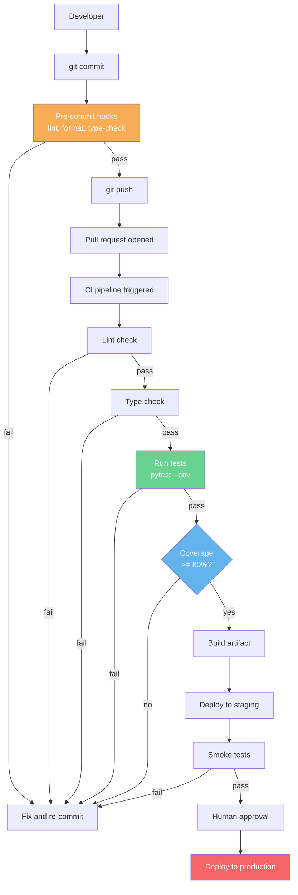
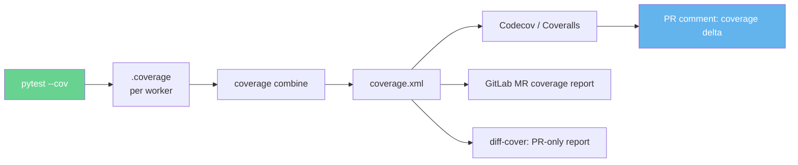
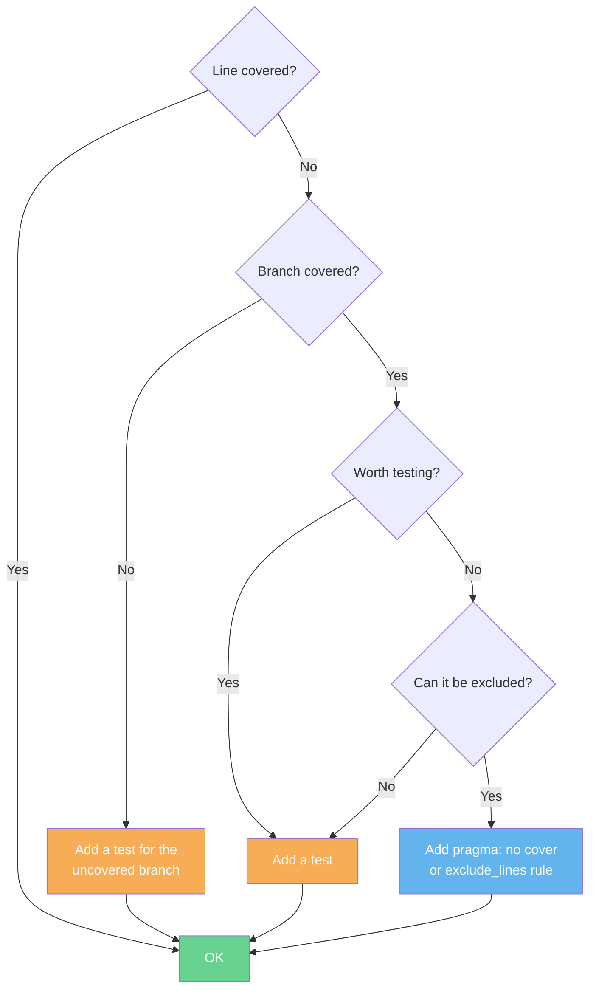

# 6. Coverage and CI

> [!note] Why this note exists
> A green test suite tells you "the tests we wrote pass." It does *not* tell you "we tested everything that matters." Coverage measurement — `coverage.py` and its `pytest-cov` integration — tells you which lines and branches your suite actually executed, so you can find the gaps. Continuous Integration (CI) — GitHub Actions, GitLab CI, Jenkins — runs the suite on every push, refuses merges on red, and gives you coverage trends over time. Pre-commit hooks stop problems before they reach CI. This note covers the tools, the metrics, the CI patterns, and the discipline of treating "no untested code reaches `main`" as a hard rule.

## Why It Matters

Two failure modes of testing:

1. **You don't write enough tests.** Coverage measurement surfaces the lines that never ran. It's not a perfect signal — 100% coverage doesn't prove correctness — but it's the only objective measurement you have of "did the suite touch this code at all."
2. **You write tests, but nobody runs them.** Without CI, "the tests pass on my machine" is the only signal. With CI, "the tests pass on every push to every branch" is enforced.

Coverage + CI together are the floor of a healthy testing culture. Without them, you have untested code that nobody knows about, and tests that may or may not be running.

## Background

### Coverage metrics, revisited

See [[1. Testing Concepts]] for the conceptual treatment. Recap:

- **Line coverage** — fraction of executable lines executed.
- **Branch coverage** — fraction of control-flow branches taken (both sides of `if`, body and alternative of loops, every `except` arm).
- **Path coverage** — fraction of all paths through the code. Computationally intractable; not measured in practice.
- **MC/DC (Modified Condition/Decision Coverage)** — used in aviation/safety-critical; ensures each boolean sub-condition independently affects the outcome. Not commonly used in Python.

`coverage.py` measures line and branch coverage. The relevant flags:

- `coverage run` measures lines by default.
- `coverage run --branch` measures branches too.

### The CI discipline

CI is the practice of merging every developer's working copy with a shared mainline several times a day, with automated builds and tests on every merge. The defining traits:

- **Automated.** No human runs the tests by hand.
- **On every change.** Every commit, every pull request.
- **Fast.** The full suite should complete in <10 minutes for a healthy project.
- **Fail-fast.** A red build blocks merges; the team treats red as a priority.

The test suite is just one CI stage. Others include: lint, type-check, build, security scan, deploy to staging, smoke tests, deploy to production.


### Pre-commit hooks

A pre-commit hook runs *locally* before the commit is created. If it fails, the commit is aborted. This catches issues before they reach CI, saving a full pipeline run. Common pre-commit checks:

- `black` / `autopep8` — formatting.
- `ruff` / `flake8` — linting.
- `mypy` / `pyright` — type checking.
- `pytest -x --lf` — quick failing-test check.
- `pre-commit-hooks` (the package) — trailing whitespace, large files, merge conflict markers, etc.

## Main content

### Installing and using `coverage.py`

```bash
pip install coverage
```

The standalone CLI:

```bash
# Run your tests under coverage
coverage run -m pytest                  # modern: pytest as the test runner
coverage run -m unittest discover       # or unittest

# View the report
coverage report                         # console summary
coverage report -m                      # with missing line numbers
coverage html                           # generate htmlcov/ directory
coverage xml                            # machine-readable Cobertura XML

# Combine parallel runs (from pytest-xdist or multiple CI shards)
coverage combine
coverage report

# Erase previous data
coverage erase
```

Sample output:

```
Name                          Stmts   Miss Branch BrPart  Cover   Missing
------------------------------------------------------------------------
myapp/__init__.py                 2      0      0      0   100%
myapp/accounts.py                35      3      8      1    91%   42-45, 51
myapp/api.py                     50      8     12      2    83%   23-30, 67-72
myapp/db.py                      40      0      6      0   100%
------------------------------------------------------------------
TOTAL                           127     11     26      3    91%
```

- `Stmts` — number of executable statements.
- `Miss` — statements not executed.
- `Branch` — number of branches.
- `BrPart` — branches partially covered (one side taken, the other not).
- `Cover` — percentage covered.
- `Missing` — line numbers (and branch IDs) that weren't covered.

### `.coveragerc` — configuration

```ini
# .coveragerc
[run]
source = myapp                  # only measure myapp/, not site-packages
branch = True                   # measure branch coverage too
parallel = True                 # for pytest-xdist / sharding
data_file = .coverage
omit =
    */tests/*
    */test_*.py
    myapp/_legacy/*
    */__init__.py

[report]
show_missing = True
skip_covered = False             # set True to hide fully-covered files
skip_empty = True
precision = 2
exclude_lines =
    pragma: no cover
    def __repr__
    raise NotImplementedError
    if __name__ == .__main__.:
    if TYPE_CHECKING:
    @abstractmethod

[html]
directory = htmlcov

[xml]
output = coverage.xml
```

`exclude_lines` is critical — it lets you mark lines that shouldn't count toward coverage. Common exclusions:

- `pragma: no cover` — the explicit opt-out.
- `if __name__ == "__main__":` — the script entry point, never tested.
- `if TYPE_CHECKING:` — typing-only imports.
- `raise NotImplementedError` — abstract methods.
- `def __repr__` — debugging helpers, low value to test.

### `pytest-cov` — the pytest integration

```bash
pip install pytest-cov
```

Run:

```bash
pytest --cov=myapp --cov-report=term-missing --cov-report=html
```

Or configure in `pyproject.toml`:

```toml
[tool.pytest.ini_options]
addopts = [
    "--cov=myapp",
    "--cov-branch",
    "--cov-report=term-missing",
    "--cov-report=html",
    "--cov-report=xml",
    "--cov-fail-under=80",
]
```

- `--cov=myapp` — measure coverage of the `myapp` package.
- `--cov-branch` — measure branch coverage too.
- `--cov-report=term-missing` — console output with missing lines.
- `--cov-report=html` — write `htmlcov/index.html`.
- `--cov-report=xml` — write `coverage.xml` for CI tools.
- `--cov-fail-under=80` — fail the pytest run if total coverage is below 80%.

`pytest-cov` integrates cleanly with `pytest-xdist`:

```bash
pytest -n auto --cov=myapp --cov-report=term-missing
```

Each worker writes its own `.coverage.*` file; `pytest-cov` combines them at the end.

### Branch coverage: the difference it makes

Consider:

```python
def classify(n):
    if n > 0 and n < 10:
        return "small"
    return "big"
```

A test `classify(5)`:

- Line coverage: 100% — every line ran.
- Branch coverage: 50% — the `False` side of `n > 0` was never taken (because `n < 10` was true and `and` short-circuited at... wait, no, both were true).

Actually, let's be careful. With `n=5`:
- `n > 0` → True (evaluated)
- `n < 10` → True (evaluated)
- → enters the if branch
- → returns "small"

The branches taken: `True` side of `n > 0`, `True` side of `n < 10`, the `return "small"` branch. The branches not taken: `False` side of `n > 0`, `False` side of `n < 10`, the implicit `return "big"` branch.

With `branch = True`, coverage.py would flag this and the report would show:

```
Missing: 41->exit, 41->42
```

(branch IDs: line 41 to exit, line 41 to line 42.)

You'd add tests for `classify(-1)` and `classify(100)` to cover the `False` sides. Without branch coverage, you'd ship the function "100% tested" and miss edge cases.

### The `# pragma: no cover` escape hatch

When a line genuinely shouldn't be tested:

```python
def load_config():
    if os.path.exists("/etc/myapp/config.yaml"):
        return yaml.safe_load(open("/etc/myapp/config.yaml"))
    elif os.environ.get("MYAPP_CONFIG"):
        return yaml.safe_load(os.environ["MYAPP_CONFIG"])
    else:
        return default_config()  # pragma: no cover - covered by integration test
```

Use sparingly. Each `pragma: no cover` is a debt: the next developer has to trust the comment. If you can test it, test it.

### Coverage trends over time

Coverage as a snapshot is informative. Coverage as a trend is gold. Tools:

- **Codecov** and **Coveralls** — third-party services that ingest `coverage.xml` from CI and produce dashboards, trend graphs, and per-PR coverage diffs ("this PR adds 12 lines, 8 of which are tested").
- **SonarQube** — self-hosted; coverage + complexity + code smells.
- **GitHub Actions artifacts** — store the XML and plot with a custom action.

The killer feature of Codecov et al. is the **PR comment**: when you open a PR, the bot posts "Coverage: 91.2% (+0.3%) — 8 of 12 new lines covered." This gives reviewers an objective criterion: "please add tests for the 4 uncovered lines."

### CI: GitHub Actions

```yaml
# .github/workflows/ci.yml
name: CI

on:
  push:
    branches: [main]
  pull_request:
    branches: [main]

jobs:
  test:
    runs-on: ubuntu-latest
    strategy:
      matrix:
        python-version: ["3.10", "3.11", "3.12"]
    steps:
      - uses: actions/checkout@v4

      - name: Set up Python
        uses: actions/setup-python@v5
        with:
          python-version: ${{ matrix.python-version }}
          cache: "pip"
          cache-dependency-path: pyproject.toml

      - name: Install
        run: |
          python -m pip install --upgrade pip
          pip install -e ".[test]"

      - name: Lint
        run: ruff check .

      - name: Type check
        run: mypy myapp

      - name: Test
        run: pytest -v --cov=myapp --cov-report=xml --cov-report=term

      - name: Upload coverage to Codecov
        if: matrix.python-version == '3.12'
        uses: codecov/codecov-action@v4
        with:
          files: ./coverage.xml
          token: ${{ secrets.CODECOV_TOKEN }}

      - name: Upload HTML report
        if: always()
        uses: actions/upload-artifact@v4
        with:
          name: htmlcov-${{ matrix.python-version }}
          path: htmlcov/
```

Key patterns:

- **Matrix across Python versions.** Confirm the code works on all supported versions, not just your laptop's.
- **Cache pip.** `actions/setup-python` with `cache: "pip"` reuses downloaded wheels — minutes saved per run.
- **Lint and type-check as separate steps.** If lint fails, you don't waste time running tests.
- **Upload coverage.** Send the XML to Codecov for trend tracking.
- **Upload HTML report as an artifact.** Even on failure — useful for debugging which lines weren't covered.
- **`if: always()` on artifact upload.** Ensures you get the HTML report even when tests fail.

### CI: GitLab CI

```yaml
# .gitlab-ci.yml
stages:
  - test
  - deploy

test:
  stage: test
  image: python:3.12
  cache:
    paths:
      - .pip-cache/
  variables:
    PIP_CACHE_DIR: "$CI_PROJECT_DIR/.pip-cache"
  before_script:
    - pip install -e ".[test]"
  script:
    - ruff check .
    - mypy myapp
    - pytest -v --cov=myapp --cov-report=xml --cov-report=term
  coverage: '/TOTAL.*\s+(\d+\.\d+)%$/'
  artifacts:
    paths:
      - htmlcov/
      - coverage.xml
    reports:
      coverage_report:
        coverage_format: cobertura
        path: coverage.xml
```

- `coverage:` regex extracts the total percentage from the test output — GitLab displays it in the MR.
- `artifacts.reports.coverage_report` parses the Cobertura XML and shows per-file coverage in merge-request diffs.

### CI: parallelism and sharding

For large suites, split tests across multiple CI jobs:

```yaml
# .github/workflows/ci.yml
jobs:
  test:
    runs-on: ubuntu-latest
    strategy:
      matrix:
        shard: [1, 2, 3, 4]
    steps:
      - uses: actions/checkout@v4
      - uses: actions/setup-python@v5
      - run: pip install -e ".[test]"
      - run: pytest -n auto --cov=myapp --cov-report=xml --splits=4 --group=${{ matrix.shard }}
        # requires pytest-split
      - uses: actions/upload-artifact@v4
        with:
          name: coverage-${{ matrix.shard }}
          path: .coverage

  combine:
    needs: test
    runs-on: ubuntu-latest
    steps:
      - uses: actions/download-artifact@v4
      - run: pip install coverage
      - run: coverage combine coverage-*/.coverage* && coverage xml
      - uses: codecov/codecov-action@v4
```

Each shard runs a quarter of the tests, producing a `.coverage.*` file. The `combine` job merges them and uploads the consolidated report.

### Pre-commit hooks with `pre-commit`

```bash
pip install pre-commit
pre-commit install        # installs the git hook
pre-commit run --all-files
```

```yaml
# .pre-commit-config.yaml
repos:
  - repo: https://github.com/pre-commit/pre-commit-hooks
    rev: v4.6.0
    hooks:
      - id: trailing-whitespace
      - id: end-of-file-fixer
      - id: check-yaml
      - id: check-added-large-files
      - id: check-merge-conflict

  - repo: https://github.com/astral-sh/ruff-pre-commit
    rev: v0.5.0
    hooks:
      - id: ruff
        args: [--fix]
      - id: ruff-format

  - repo: https://github.com/pre-commit/mirrors-mypy
    rev: v1.10.0
    hooks:
      - id: mypy
        additional_dependencies: [types-requests, pydantic]

  - repo: local
    hooks:
      - id: pytest
        name: pytest (quick)
        entry: pytest -x --lf -q
        language: system
        types: [python]
        pass_filenames: false
```

Pre-commit runs every hook on every commit. The local pytest hook runs *only previously-failing tests* (`--lf`) — a fast sanity check that you haven't broken anything you'd recently fixed.

> [!info] Pre-commit is opt-in
> Pre-commit hooks only run if the developer has run `pre-commit install`. CI should run the same checks as a fallback — never trust that the hook was installed.

### Coverage gates

Set a coverage floor in CI:

```toml
[tool.pytest.ini_options]
addopts = ["--cov-fail-under=80"]
```

If total coverage drops below 80%, the pytest run fails — blocking the PR. This is the *floor*, not a target. Each PR that drops coverage below the floor must either add tests or raise the floor with a separate PR.

> [!tip] Ratchet, don't target
> A "target" of 80% encourages the team to write 80%-quality tests. A "ratchet" that fails on drops but accepts improvements encourages monotonic progress. Use tools like `coverage-ratchet` or `diff-cover` to enforce "no new uncovered code."

### `diff-cover` — coverage on the diff

`pip install diff-cover` runs coverage and reports only on lines changed in the PR:

```bash
diff-cover coverage.xml --compare-branch=origin/main
```

Output:

```
-------------
Diff Coverage
Diff: origin/main...HEAD, staged and unstaged changes
-------------
myapp/accounts.py        (100.0%)
myapp/api.py             (75.0%)
myapp/new_feature.py     (0.0%)
-------------
Total:                   (66.7%)
```

This is the right metric for code review: "of the lines *you* added, how many are tested?" 100% diff coverage is achievable on every PR; 100% total coverage is a multi-year project.

## Mermaid diagrams

### CI/CD pipeline with tests and coverage



### Coverage data flow



### Coverage decision tree



## Code examples

### Example 1: Full `.coveragerc` for a real project

```ini
# .coveragerc
[run]
source = myapp
branch = True
parallel = True
omit =
    */tests/*
    */test_*.py
    */conftest.py
    myapp/__about__.py
    myapp/_compat.py

[report]
show_missing = True
skip_covered = False
skip_empty = True
precision = 2
exclude_lines =
    pragma: no cover
    \.\.\.             # Ellipsis in stubs
    raise NotImplementedError
    if TYPE_CHECKING:
    if __name__ == .__main__.:
    @abstractmethod
    @overload

[html]
directory = htmlcov
title = "MyApp Coverage"

[xml]
output = coverage.xml
```

### Example 2: A coverage-driven TDD session

```python
# myapp/gradebook.py
def letter_grade(score):
    if score >= 90:
        return "A"
    elif score >= 80:
        return "B"
    elif score >= 70:
        return "C"
    elif score >= 60:
        return "D"
    else:
        return "F"
```

Initial test:

```python
def test_letter_grade_a():
    assert letter_grade(95) == "A"
```

Run `pytest --cov=myapp.gradebook --cov-branch --cov-report=term-missing`:

```
Name                  Stmts   Miss Branch BrPart  Cover   Missing
----------------------------------------------------------------
myapp/gradebook.py        6      4      5      1    18%   4, 6, 8, 10
```

Lines 4, 6, 8, 10 (the B, C, D, F branches) were missed. Add tests:

```python
@pytest.mark.parametrize("score, expected", [
    (95, "A"), (85, "B"), (75, "C"), (65, "D"), (55, "F"),
    (90, "A"), (80, "B"), (70, "C"), (60, "D"), (0, "F"),
])
def test_letter_grade(score, expected):
    assert letter_grade(score) == expected
```

Re-run:

```
Name                  Stmts   Miss Branch BrPart  Cover   Missing
----------------------------------------------------------------
myapp/gradebook.py        6      0      5      0   100%
```

100% line and branch coverage. The test suite now exercises every branch — including the boundary conditions (`90` returns `"A"`, not `"B"`).

### Example 3: `--cov-fail-under` in CI

```bash
pytest --cov=myapp --cov-fail-under=80
```

If coverage drops to 79%, pytest exits with code 2 (failure) and CI marks the job red.

### Example 4: Parallel coverage with `pytest-xdist`

```bash
pytest -n auto --cov=myapp --cov-report=xml
```

Each worker writes `.coverage.<hostname>.<pid>.<rand>`. At the end of the run, `pytest-cov` calls `coverage combine` automatically. The `coverage.xml` file reflects the merged data.

### Example 5: `diff-cover` in CI

```yaml
# .github/workflows/ci.yml
- name: Diff coverage
  run: |
    pip install diff-cover
    diff-cover coverage.xml --compare-branch=origin/main --fail-under=100
```

This fails the build if any line added by the PR is not covered. 100% diff coverage is achievable per-PR — and over time, the project approaches 100% total.

### Example 6: Codecov upload

```yaml
- name: Upload to Codecov
  uses: codecov/codecov-action@v4
  with:
    files: ./coverage.xml
    token: ${{ secrets.CODECOV_TOKEN }}
    fail_ci_if_error: true
```

Codecov posts a comment on the PR with the coverage delta and per-file breakdowns.

### Example 7: Pre-commit with pytest

```yaml
# .pre-commit-config.yaml
repos:
  - repo: local
    hooks:
      - id: pytest-quick
        name: pytest (quick — last failed only)
        entry: pytest -x --lf -q
        language: system
        types: [python]
        pass_filenames: false
        stages: [commit]
      - id: pytest-full
        name: pytest (full — before push)
        entry: pytest -q
        language: system
        types: [python]
        pass_filenames: false
        stages: [push]
```

`pre-commit install --install-hooks -t pre-commit -t pre-push` installs both hooks. The quick one runs on every commit; the full suite runs only before push.

### Example 8: GitHub Actions matrix with coverage artifacts

```yaml
jobs:
  test:
    strategy:
      matrix:
        os: [ubuntu-latest, macos-latest, windows-latest]
        python: ["3.10", "3.11", "3.12"]
        exclude:
          - os: windows-latest
            python: "3.10"   # known issue
    runs-on: ${{ matrix.os }}
    steps:
      - uses: actions/checkout@v4
      - uses: actions/setup-python@v5
        with:
          python-version: ${{ matrix.python }}
          cache: pip
      - run: pip install -e ".[test]"
      - run: pytest --cov=myapp --cov-report=xml
      - uses: actions/upload-artifact@v4
        if: always()
        with:
          name: cov-${{ matrix.os }}-${{ matrix.python }}
          path: |
            coverage.xml
            htmlcov/
```

Each combination produces its own coverage artifact. Download and inspect any of them.

### Example 9: Custom coverage check in a Makefile

```makefile
# Makefile
.PHONY: test coverage lint ci

lint:
	ruff check .
	mypy myapp

test:
	pytest

coverage:
	pytest --cov=myapp --cov-branch --cov-report=term-missing --cov-report=html
	@echo "Open htmlcov/index.html in your browser"

ci: lint coverage
	pytest --cov=myapp --cov-fail-under=80 -q
```

Run `make ci` locally before pushing — same checks as CI, faster feedback.

## Common Pitfalls

> [!warning] Measuring coverage of test files
> Without `omit = */tests/*`, coverage includes your test code — and tests are 100% covered by definition. Always restrict `source` to your production code.

> [!warning] 100% line, 50% branch
> Without `branch = True` (or `--cov-branch`), you get line coverage only. Lines like `if x and y:` look fully covered even when only one side of each condition was tested. Always enable branch coverage.

> [!warning] Coverage of unused code
> Dead code that's never imported isn't measured — `coverage.py` only sees code that the test runner executed. Run `coverage report` against the production entry point (not just the test suite) for accurate numbers.

> [!warning] Coverage as a goal, not a metric
> "We need 90% coverage" produces tests that call functions without asserting anything. Each line is "covered" but no behavior is verified. Coverage measures *execution*, not *correctness*.

> [!warning] `pragma: no cover` overuse
> Sprinkling `# pragma: no cover` to hit a coverage target defeats the metric. Each exclusion should have a reason in a comment.

> [!warning] CI runs tests but not lint/type-check
> Tests are necessary but not sufficient. Lint catches dead code and unused imports; type-check catches None dereferences. Run all three in CI.

> [!warning] Caching gone wrong
> GitHub Actions caches can hide dependency drift. If `requirements.txt` is updated but the cache key doesn't change, CI runs against stale dependencies. Use `cache-dependency-path` and bump the key on dependency changes.

> [!warning] Tests pass on developer's machine, fail in CI
> Causes: hidden state (`~/.config/...`), timezone, locale, missing env var, file path case (macOS is case-insensitive, Linux isn't), Python version drift. Fix by making tests self-contained (use `tmp_path`, set `TZ=UTC` in CI, pin Python version).

> [!warning] `if TYPE_CHECKING:` blocks reported as uncovered
> Lines under `if TYPE_CHECKING:` are never executed at runtime (the `TYPE_CHECKING` constant is `False` at runtime). Exclude them: `exclude_lines = ... if TYPE_CHECKING: ...`.

> [!warning] Not uploading artifacts on failure
> ```yaml
> - uses: actions/upload-artifact@v4
>   if: success()   # default — but skips upload when tests fail
> ```
> Use `if: always()` so you can inspect the HTML report even on red builds.

> [!warning] Tests that depend on order
> With `pytest-randomly` or sharding, tests run in different orders. If a test passes alone but fails in the suite, you have hidden state. Use `pytest --pdb` to debug.

> [!warning] Forgetting to install the package itself
> ```bash
> pip install -r requirements.txt
> pytest
> ```
> This installs dependencies but not your own package. Import errors ensue. Use `pip install -e .` (editable install) so `myapp` is importable from anywhere.

> [!warning] CI takes 30 minutes
> Healthy CI is <10 minutes. Profile with `pytest --durations=10`. Common culprits: slow integration tests, real network calls, missing parallelism. Split the suite with sharding or move slow tests to a nightly job.

> [!warning] Coverage ratchet never ratchets
> If `--cov-fail-under=80` is set once and never updated, you have a static target. Use `diff-cover` for per-PR enforcement and let the floor drift up as the team improves.

## Tips and Tricks

- **Always enable `--cov-branch`.** Line-only coverage hides bugs in conditional logic.
- **Set `--cov-fail-under` to your *current* coverage, rounded down to the nearest whole percent.** Every PR that drops below is blocked; every PR that improves lets you bump the floor.
- **Use `diff-cover` for per-PR enforcement.** 100% diff coverage is achievable; 100% total is aspirational.
- **Upload `coverage.xml` and `htmlcov/` as CI artifacts**, even on failure. You'll want them for debugging.
- **Run `coverage erase` between unrelated runs.** Stale `.coverage` files combine in surprising ways.
- **`coverage report --skip-covered`** hides files at 100%, focusing attention on the gaps.
- **`coverage report --include="myapp/api/*"`** narrows to a subpackage. Useful when triaging a large codebase.
- **Add `# pragma: no cover` only with a comment explaining why.** Each exclusion is technical debt.
- **Exclude `__init__.py`, `__main__.py`, and `__about__.py` from coverage.** They're trivial or never executed.
- **Use `coverage json -o coverage.json` for machine-readable output** if you're building a custom dashboard.
- **Cache pip in CI.** It saves minutes per build.
- **Run lint and type-check before tests in CI.** They're faster and catch more bugs per second.
- **Matrix-test across Python versions.** A green build on 3.10 doesn't guarantee 3.12.
- **Set `TZ=UTC` and `LANG=C.UTF-8` in CI.** Eliminates timezone and locale flakiness.
- **Use `pytest-split` or `pytest-xdist` to parallelize.** Cuts wall-clock time dramatically.
- **Add `pytest --lf` to your pre-commit hook.** Quick sanity check before each commit.
- **Run the full suite pre-push.** Slower, but catches the regressions that `--lf` misses.
- **Pin pre-commit hook versions.** Same as dependencies — reproducibility matters.
- **`pre-commit autoupdate`** bumps hook versions periodically. Run it monthly.
- **For monorepos, use `pytest --rootdir` and per-package `conftest.py`.** Keeps test isolation clean.
- **Treat the CI badge in your README as a contract.** If it's red, fixing it is the team's top priority.

## Active Recall

1. What's the difference between line and branch coverage? Give an example where line is 100% but branch is 50%.
2. How do you enable branch coverage with `pytest-cov`?
3. What does `--cov-fail-under=80` do? What's the difference between this and `diff-cover --fail-under=100`?
4. Write a minimal `.coveragerc` that measures branch coverage of `myapp/` only.
5. What does `# pragma: no cover` do? When should you use it?
6. Name three lines you should exclude from coverage by default.
7. Why upload `htmlcov/` as an artifact even when tests fail?
8. Write a GitHub Actions workflow that runs pytest, generates coverage, and uploads it to Codecov.
9. Why run lint and type-check before tests in CI?
10. What does `coverage combine` do? When do you need it?
11. How do you parallelize tests across multiple CI jobs and still get a single coverage number?
12. What's a "coverage ratchet" and why is it better than a coverage "target"?
13. Why is `if TYPE_CHECKING:` flagged as uncovered? How do you fix the report?
14. What does `pre-commit install` do? What happens if a developer forgets to run it?
15. Name three reasons CI might fail when local tests pass.

## Next Steps

- You've finished Chapter 12. For the sibling topic — observability in production — see [[13. Logging]], starting with [[1. The logging Module]].
- For deeper background on what tests to write, revisit [[1. Testing Concepts]].
- For the test frameworks, see [[2. unittest]] and [[3. pytest]].
- For shared setup, see [[4. Fixtures and Parameterization]].
- For isolating dependencies, see [[5. Mocking with unittest.mock]].
- For the standard-library intro to `logging`, see [[9. Standard Library Deep Dive/7. logging]] — Ch 13 builds on it for production-grade setups.
