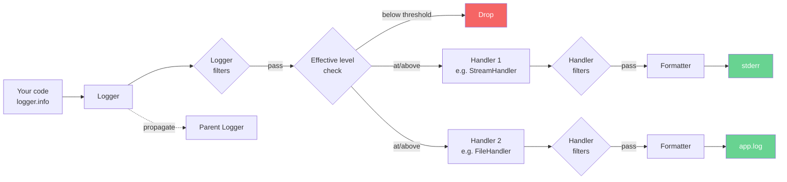
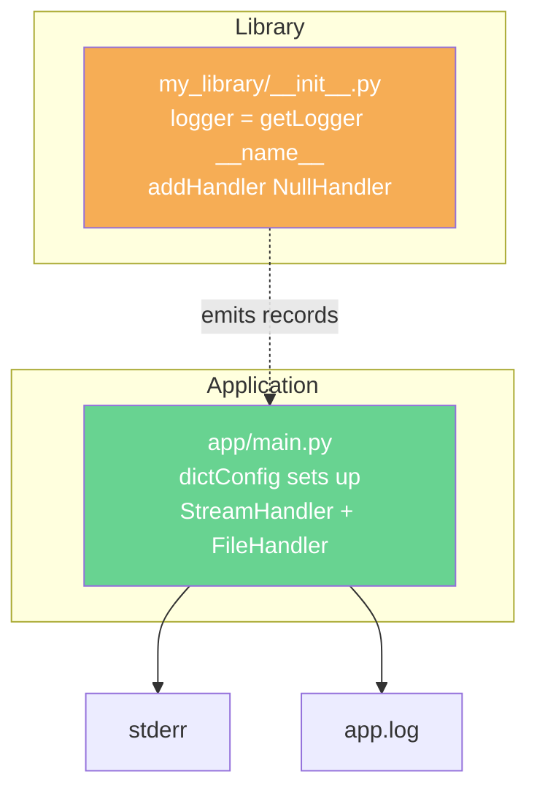
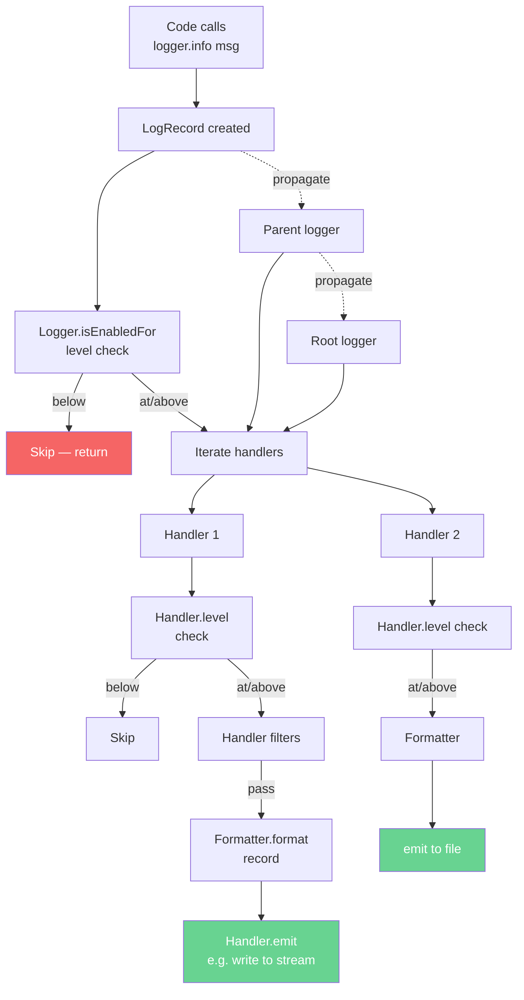
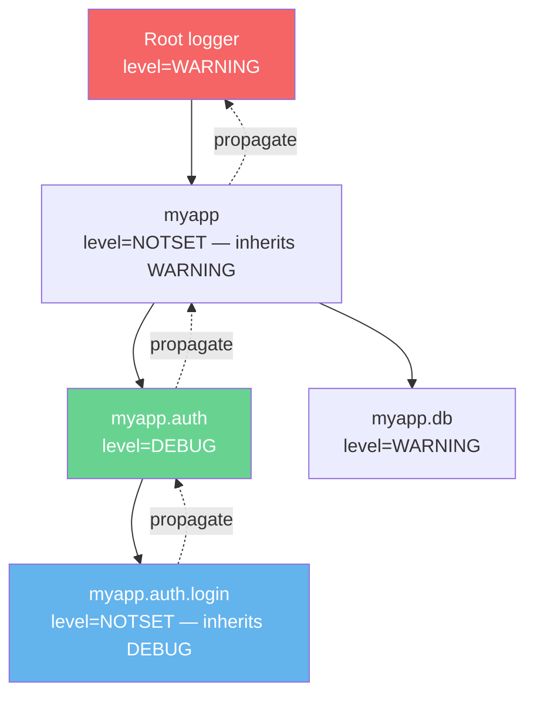
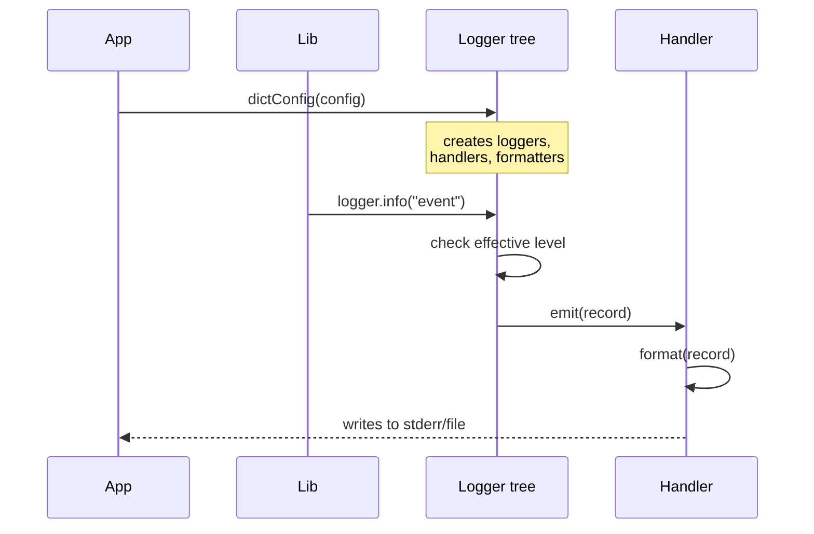

# 1. The logging Module

> [!note] Why this note exists
> This is the **production-grade** entry point to Python logging. The standard-library intro is in [[9. Standard Library Deep Dive/7. logging]] — that note covers `basicConfig`, the five levels, and the simplest cases. This chapter assumes you've read it and goes deeper: the four-component architecture (Logger, Handler, Formatter, Filter), the logger hierarchy and effective-level resolution, propagation, the root logger and why you should rarely log to it directly, `getLogger(__name__)` as a project convention, `basicConfig`'s limitations, and the `dictConfig` / `fileConfig` alternatives for non-trivial setups. After this note, you should be able to design a logging configuration for a real application — and you'll be ready for [[2. Log Levels and Handlers]] (handler types and formatters) and [[3. Structured Logging]] (JSON, structlog, correlation IDs).

## Why It Matters

Production observability has three pillars: logs, metrics, and traces. Logs are the oldest, the most ubiquitous, and — done badly — the most expensive. A poorly-configured logging setup causes:

- **Log floods** that cost real money (CloudWatch bills at $0.50/GB ingested).
- **Lost context** because the relevant log was emitted at `DEBUG` and silenced.
- **Brittle parsing** because every line is ad-hoc text and the alerting regex breaks on the next deployment.
- **Library/app config collisions** because the library's `basicConfig` call clobbered the app's.
- **Hidden state** because `print` statements were left in production code.

A well-configured logging setup, in contrast, gives you:

- Per-module log levels (verbose in the bug area, quiet everywhere else).
- Multiple destinations (DEBUG to local file, INFO to stdout, ERROR to PagerDuty).
- Consistent format that your log shipper can parse.
- Correlation IDs so you can follow a single request across services.
- Zero-cost when silenced (lazy formatting).

The `logging` module is the standard-library tool that delivers all of this — once you understand its architecture.

## Background

### The four moving parts

The `logging` module has a small but powerful object model:

| Object        | What it does                                                | Example                                     |
|---------------|-------------------------------------------------------------|---------------------------------------------|
| **Logger**    | The entry point. You call `logger.info(...)`.               | `logging.getLogger("myapp.auth")`           |
| **Handler**   | Where the log record goes (file, stderr, syslog, network). | `StreamHandler`, `FileHandler`, `SMTPHandler` |
| **Formatter** | How the record is rendered as a string.                     | `"%(asctime)s [%(levelname)s] %(message)s"` |
| **Filter**    | Decides whether a record is emitted.                        | Drop DEBUG, only emit from `"myapp.db"`     |

A logger has zero or more handlers; a handler has one formatter and any number of filters. Log records flow: `Logger` → (logger filters) → `Handler`s → (handler filters) → `Formatter` → destination.



### The logger hierarchy

Loggers form a tree, rooted at the **root logger** (the one you get from `logging.getLogger()` with no argument, or `logging.getLogger("")`). A logger named `"myapp.auth.login"` is a child of `"myapp.auth"`, which is a child of `"myapp"`, which is a child of the root.

When you call `logger.info("msg")`:

1. The logger creates a `LogRecord` with the message, level, timestamp, source location (file, line, function), thread/process ID, and (optionally) `extra` fields.
2. The logger checks its **effective level** — if its own level is `NOTSET` (0), it walks up the tree until it finds an ancestor with a non-`NOTSET` level, and uses that. If none found, the effective level is `WARNING` (the root's default).
3. If the record's level is at or above the effective level, the logger passes it to all its handlers.
4. By default, **the record also propagates to all parent loggers' handlers**, all the way to the root — unless `logger.propagate = False`.

This propagation is why `basicConfig` on the root logger affects everything: every logger (unless opted out) propagates to root.

### Effective level: the gotcha

```python
import logging
logging.basicConfig(level=logging.DEBUG)
logger = logging.getLogger("myapp.module")
logger.setLevel(logging.WARNING)
logger.info("you won't see me")    # logger's effective level is WARNING
logger.warning("you'll see me")    # passes
```

The logger's *own* level (`WARNING`) wins. If you set the logger to `NOTSET` (the default), it inherits from its parent — all the way up to the root.

```python
import logging
logging.basicConfig(level=logging.WARNING)
logger = logging.getLogger("myapp")
logger.setLevel(logging.DEBUG)        # be verbose for myapp
sub = logging.getLogger("myapp.sub")
sub.info("you'll see me")             # sub's effective level is DEBUG (inherited)
```

### Why `getLogger(__name__)` is the convention

```python
# myapp/auth/login.py
import logging
logger = logging.getLogger(__name__)    # __name__ is "myapp.auth.login"
```

`__name__` is the module's fully-qualified name. So every module gets a logger named after itself — and those names form the hierarchy automatically. The application can then configure loggers by name:

```python
logging.getLogger("myapp").setLevel(logging.INFO)
logging.getLogger("myapp.auth").setLevel(logging.DEBUG)   # debug auth specifically
logging.getLogger("myapp.db").setLevel(logging.WARNING)   # shut up DB
```

Without `__name__`, every module would log to root (no granularity) or use ad-hoc names (no consistency).

### Why `print` is worse than `logging`

| Aspect                  | `print`                          | `logging`                              |
|-------------------------|----------------------------------|----------------------------------------|
| Severity levels        | None                             | DEBUG / INFO / WARNING / ERROR / CRITICAL |
| Routing                | Always stdout                    | Per-handler: stdout, file, syslog, email, network |
| Timestamps             | Manual                           | Automatic, with `asctime`              |
| Source location         | Manual                           | Automatic, with `filename`, `lineno`, `funcName` |
| Lazy formatting        | No (`f""` always formats)        | Yes (`logger.info("%d", x)` skips if level is below) |
| Thread safety          | Not guaranteed                   | Yes                                    |
| Library/app config     | N/A                              | Library gets a child logger; app configures root |
| Pytest captures it?    | No                               | Yes (`caplog` fixture)                 |
| Sentry captures it?    | No                               | Yes                                    |
| Log shippers capture it| Only if redirected               | Yes, natively                          |

The single most important upgrade: **`print` always costs a string format**. `logger.debug("huge dict: %s", compute_huge_dict())` skips the format call if `DEBUG` is below the effective level — so you can leave debug logging in production code with zero overhead.

## Main content

### `basicConfig` — quick start, and its limits

```python
import logging

logging.basicConfig(
    level=logging.INFO,
    format="%(asctime)s [%(levelname)s] %(name)s: %(message)s",
    filename="app.log",
    filemode="a",
)
logging.info("started")
```

`basicConfig` configures the **root logger**. It's a one-shot, idempotent call — the first call wins; subsequent calls are no-ops unless you pass `force=True` (3.8+).

**Limits:**

- Only configures the root logger. If a library has already called `basicConfig` (anti-pattern, but it happens), your call does nothing.
- Only one handler — you can't have both a file handler and a stream handler with different formats.
- No per-logger level control.
- No filters.
- Awkward for non-trivial setups.

For anything beyond a script, use `dictConfig`.

### `dictConfig` — declarative configuration

```python
# logging_config.py
import logging.config

LOGGING_CONFIG = {
    "version": 1,
    "disable_existing_loggers": False,   # don't silence library loggers
    "formatters": {
        "standard": {
            "format": "%(asctime)s [%(levelname)s] %(name)s: %(message)s",
        },
        "verbose": {
            "format": "%(asctime)s [%(levelname)s] %(name)s %(filename)s:%(lineno)d: %(message)s",
        },
        "json": {
            "format": '{"time": "%(asctime)s", "level": "%(levelname)s", "logger": "%(name)s", "msg": "%(message)s"}',
            "class": "myapp.logging.JsonFormatter",   # custom for full structured logging
        },
    },
    "filters": {
        "myapp_only": {
            "()": "myapp.logging.ModuleFilter",
            "module_prefix": "myapp",
        },
    },
    "handlers": {
        "console": {
            "class": "logging.StreamHandler",
            "level": "INFO",
            "formatter": "standard",
            "stream": "ext://sys.stderr",
        },
        "file": {
            "class": "logging.handlers.RotatingFileHandler",
            "level": "DEBUG",
            "formatter": "verbose",
            "filename": "logs/app.log",
            "maxBytes": 10_000_000,
            "backupCount": 5,
            "encoding": "utf-8",
        },
        "errors": {
            "class": "logging.handlers.SMTPHandler",
            "level": "ERROR",
            "formatter": "standard",
            "mailhost": "smtp.example.com",
            "fromaddr": "alerts@example.com",
            "toaddrs": ["oncall@example.com"],
            "subject": "Production error in myapp",
        },
    },
    "loggers": {
        "myapp": {
            "level": "DEBUG",
            "handlers": ["console", "file"],
            "propagate": False,
        },
        "myapp.db": {
            "level": "WARNING",   # quieter for DB module
        },
        "myapp.auth": {
            "level": "DEBUG",     # very verbose for auth debugging
        },
    },
    "root": {
        "level": "WARNING",
        "handlers": ["console"],
    },
}


def setup_logging():
    logging.config.dictConfig(LOGGING_CONFIG)
```

Apply it early — ideally the first thing in `main()` or your app's entry point:

```python
# main.py
from myapp.logging_config import setup_logging

def main():
    setup_logging()
    # ... rest of app ...
```

`dictConfig` is the right choice for any non-trivial application. It's declarative (can be loaded from YAML/JSON), composable, and gives you per-logger control without touching the application code.

### `fileConfig` — INI-based alternative

```ini
# logging.ini
[loggers]
keys=root,myapp

[handlers]
keys=console,file

[formatters]
keys=standard

[logger_root]
level=WARNING
handlers=console

[logger_myapp]
level=DEBUG
handlers=console,file
qualname=myapp
propagate=0

[handler_console]
class=StreamHandler
level=INFO
formatter=standard
args=(sys.stderr,)

[handler_file]
class=handlers.RotatingFileHandler
level=DEBUG
formatter=standard
args=('logs/app.log', 'a', 10000000, 5)

[formatter_standard]
format=%(asctime)s [%(levelname)s] %(name)s: %(message)s
```

```python
import logging.config
logging.config.fileConfig("logging.ini", disable_existing_loggers=False)
```

`fileConfig` is older and less flexible than `dictConfig` (no custom filter classes, no `ext://` references). Prefer `dictConfig` for new projects.

### Library logging: the golden rule

A library should never configure logging. It should only *acquire* loggers:

```python
# my_library/__init__.py
import logging

logger = logging.getLogger(__name__)
logger.addHandler(logging.NullHandler())   # <-- the golden rule
```

`NullHandler` swallows all records. It exists so that if the application hasn't configured logging, the library's records don't trigger the "No handlers could be found for logger X" warning (Python 2) or unwanted output (Python 3, where `lastResort` handler emits to stderr at WARNING+).

The application configures logging; the library just emits. This separation is what lets one app use the same library with syslog, another with a file, and a third with a JSON pipeline — without library changes.



### Lazy formatting: the `%` style

```python
# Eager — always formats the string, even if level is below threshold
logger.debug(f"processed {len(huge_list)} items: {huge_list}")

# Lazy — skips formatting if DEBUG is below effective level
logger.debug("processed %d items: %s", len(huge_list), huge_list)
```

The lazy form passes the format string and args separately; the formatter only invokes `%` if the level passes. For a `logger.debug` call inside a hot loop with the effective level at `INFO`, the cost is one function call (cheap) instead of one string format (potentially expensive).

> [!info] f-strings vs `%`-style
> The PEP 502 / PEP 678 era has reignited the f-string-vs-`%` debate for logging. The `logging` module added `logger.debug(msg, *, stack_info=False, extra=None)` — still `%`-style. Third-party libraries like `structlog` (see [[3. Structured Logging]]) let you use f-strings safely. For stdlib `logging`, prefer `%`-style for any non-trivial format.

### The `extra` parameter — adding custom fields

```python
logger.info("user logged in", extra={"user_id": 42, "ip": "10.0.0.1"})
```

The `extra` dict is merged into the `LogRecord` and available in the format string:

```
%(user_id)s | %(ip)s | %(message)s
```

> [!warning] Key collisions
> `extra` keys must not collide with built-in `LogRecord` attributes (`name`, `msg`, `args`, `levelname`, `levelno`, `pathname`, `filename`, `module`, `exc_info`, `funcName`, `lineno`, `created`, `msecs`, `relativeCreated`, `thread`, `threadName`, `processName`, `process`). A collision raises `KeyError` at emit time. Prefix custom keys (`extra={"extra_user_id": 42}`) for safety, or use `structlog`.

### Custom `Logger` subclasses: `getLoggerClass` and `setLoggerClass`

```python
class MyLogger(logging.Logger):
    def trace(self, msg, *args, **kwargs):
        if self.isEnabledFor(5):   # custom level below DEBUG
            self._log(5, msg, args, **kwargs)

logging.setLoggerClass(MyLogger)
logging.addLevelName(5, "TRACE")

logger = logging.getLogger(__name__)
logger.trace("very detailed")   # works
```

`setLoggerClass` must be called before any `getLogger` calls — the class is consulted at logger-creation time. Useful for adding domain-specific methods (e.g., `logger.audit(...)`) or hooks (e.g., capturing metrics on every emit).

### The `lastResort` handler

Since Python 3.2, if a logger has no handlers and propagation doesn't reach one, the `lastResort` handler (a `StreamHandler` writing to `sys.stderr` at `WARNING` level) emits the record. This is why `logging.warning("...")` from a script with no setup still prints — you don't need `basicConfig` for ad-hoc warnings.

You can replace `lastResort`:

```python
logging.lastResort = logging.NullHandler()   # silence unconfigured warnings
```

### `logging.disable` — silencing everything

```python
logging.disable(logging.INFO)      # nothing below INFO is emitted anywhere
# ... tests run quietly ...
logging.disable(logging.NOTSET)    # restore
```

`disable(level)` sets a global threshold that overrides all logger levels. Useful in tests for silencing expected warnings.

### Capturing logs in tests: `caplog` (pytest) and `assertLogs` (unittest)

```python
# pytest
def test_login_logs_warning(caplog):
    with caplog.at_level(logging.WARNING, logger="myapp.auth"):
        login("alice", "wrong password")
    assert any("failed login" in r.message for r in caplog.records)


# unittest
class TestLogin(unittest.TestCase):
    def test_login_logs_warning(self):
        with self.assertLogs("myapp.auth", level="WARNING") as cm:
            login("alice", "wrong password")
        self.assertIn("failed login", cm.output[0])
```

`caplog` captures `LogRecord` objects (rich); `assertLogs` captures formatted strings (simpler). See [[2. unittest]] and [[3. pytest]].

### `LogRecord` attributes — what's available in a format string

| Attribute      | Type      | Notes                                             |
|----------------|-----------|---------------------------------------------------|
| `asctime`      | str       | Human-readable time (`2024-06-15 14:30:00,123`)   |
| `created`      | float     | `time.time()` at record creation                  |
| `msecs`        | float     | Millisecond portion of `created`                  |
| `relativeCreated` | float  | Milliseconds since logging module loaded          |
| `name`         | str       | Logger name                                       |
| `levelname`    | str       | `"INFO"`, `"WARNING"`, etc.                       |
| `levelno`      | int       | Numeric level (20, 30, ...)                       |
| `message`      | str       | The formatted message (after `%` substitution)    |
| `msg`          | str       | The raw format string (before substitution)       |
| `args`         | tuple/dict| The args passed to the logger                     |
| `module`       | str       | Module name (filename without extension)          |
| `filename`     | str       | `pathname`'s basename                             |
| `pathname`     | str       | Full source file path                             |
| `lineno`       | int       | Source line number                                |
| `funcName`     | str       | Function name                                     |
| `process`      | int       | PID                                               |
| `processName`  | str       | Process name (multiprocessing)                    |
| `thread`       | int       | Thread ID                                         |
| `threadName`   | str       | Thread name                                       |
| `exc_info`     | tuple     | `sys.exc_info()` if logging from an `except`      |
| `stack_info`   | str       | Full stack trace as a string                      |

Use them in format strings: `"%(asctime)s %(levelname)s %(name)s [%(processName)s:%(threadName)s] %(filename)s:%(lineno)d: %(message)s"`.

### `stack_info=True` and `exc_info=True`

```python
try:
    risky()
except Exception:
    logger.exception("failed")                     # equivalent to logger.error(..., exc_info=True)

logger.info("checkpoint", stack_info=True)          # logs the full stack
```

- `logger.exception(...)` (only valid inside an `except` block) logs at ERROR with the current exception's traceback.
- `exc_info=True` on any level attaches the current exception's traceback.
- `stack_info=True` attaches the call stack (not just the exception's) — useful for tracing how you got to a log point without an exception.

### Performance notes

- `logging` is thread-safe by design — `Handler.emit` acquires a `threading.Lock`.
- `logging` is *not* async-safe in the sense that emitting from an `async` function blocks the event loop. Use `QueueHandler` (see [[2. Log Levels and Handlers]]) to delegate I/O to a background thread.
- The overhead of a *suppressed* log call (level below threshold) is one `isEnabledFor` check — a few microseconds. Negligible.
- The overhead of an *emitted* log call is dominated by I/O (file write, network round-trip). For high-volume logging, use `QueueHandler` + `QueueListener` to async-ify.
- Format strings are re-parsed on every emit. Cache `Formatter` objects; don't create them per call.

## Mermaid diagrams

### The logging module architecture



### Logger hierarchy and propagation



A record emitted on `myapp.auth.login`:
1. Effective level = DEBUG (inherited from `myapp.auth`).
2. If level ≥ DEBUG, passes to `myapp.auth.login`'s handlers (none here).
3. Propagates to `myapp.auth`'s handlers.
4. Propagates to `myapp`'s handlers (if any).
5. Propagates to root's handlers.

### Configuration flow: app sets up, libraries emit



## Code examples

### Example 1: A library with NullHandler

```python
# my_library/__init__.py
import logging

logger = logging.getLogger(__name__)
logger.addHandler(logging.NullHandler())

# my_library/api.py
import logging
logger = logging.getLogger(__name__)

def fetch(url):
    logger.debug("fetching %s", url)
    # ... actual fetch ...
    logger.info("fetched %d bytes from %s", 1024, url)
```

The library emits; it doesn't decide where the records go. The application does.

### Example 2: An application with dictConfig

```python
# myapp/logging_config.py
import logging.config
import os

def setup_logging(env="dev"):
    if env == "prod":
        level = "INFO"
    else:
        level = "DEBUG"

    config = {
        "version": 1,
        "disable_existing_loggers": False,
        "formatters": {
            "standard": {
                "format": "%(asctime)s [%(levelname)s] %(name)s %(funcName)s:%(lineno)d: %(message)s",
                "datefmt": "%Y-%m-%d %H:%M:%S",
            },
        },
        "handlers": {
            "console": {
                "class": "logging.StreamHandler",
                "level": level,
                "formatter": "standard",
                "stream": "ext://sys.stderr",
            },
            "file": {
                "class": "logging.handlers.RotatingFileHandler",
                "level": "DEBUG",
                "formatter": "standard",
                "filename": os.environ.get("LOG_FILE", "logs/app.log"),
                "maxBytes": 10_485_760,
                "backupCount": 5,
            },
        },
        "loggers": {
            "myapp": {
                "level": "DEBUG",
                "handlers": ["console", "file"],
                "propagate": False,
            },
            # Quiet third-party loggers
            "urllib3": {"level": "WARNING"},
            "asyncio": {"level": "WARNING"},
        },
        "root": {
            "level": "WARNING",
            "handlers": ["console"],
        },
    }
    logging.config.dictConfig(config)
```

```python
# myapp/main.py
from myapp.logging_config import setup_logging
import logging

def main():
    setup_logging(env="prod")
    logger = logging.getLogger(__name__)
    logger.info("application starting")
    # ...

if __name__ == "__main__":
    main()
```

### Example 3: Lazy formatting in a hot loop

```python
# Bad — formats even when DEBUG is silenced
for item in huge_list:
    logger.debug(f"processing {item}: {expensive_repr(item)}")

# Good — skips formatting if DEBUG is below effective level
for item in huge_list:
    logger.debug("processing %s: %s", item, expensive_repr(item))

# Even better — guard explicitly if expensive_repr has side effects
for item in huge_list:
    if logger.isEnabledFor(logging.DEBUG):
        logger.debug("processing %s: %s", item, expensive_repr(item))
```

### Example 4: Custom filter that adds context

```python
import logging
import contextvars

request_id_var: contextvars.ContextVar[str] = contextvars.ContextVar("request_id", default="-")

class RequestIdFilter(logging.Filter):
    """Injects the current request_id into every log record."""
    def filter(self, record):
        record.request_id = request_id_var.get()
        return True

# In a web framework middleware:
def middleware(request):
    rid = generate_request_id()
    request_id_var.set(rid)
    logger.info("handling %s %s", request.method, request.path)
    response = handler(request)
    logger.info("responded %d in %dms", response.status_code, elapsed)
    return response

# Config:
#   "filters": {"request_id": {"()": "myapp.logging.RequestIdFilter"}}
#   Format: "%(asctime)s [%(levelname)s] req=%(request_id)s %(name)s: %(message)s"
```

`contextvars` (Python 3.7+) propagates correctly across `asyncio` tasks and `concurrent.futures` — perfect for per-request logging in async web apps.

### Example 5: Custom formatter that emits JSON

```python
import json
import logging

class JsonFormatter(logging.Formatter):
    def format(self, record):
        log = {
            "ts": self.formatTime(record, self.datefmt),
            "level": record.levelname,
            "logger": record.name,
            "msg": record.getMessage(),
            "file": record.filename,
            "line": record.lineno,
            "func": record.funcName,
        }
        if record.exc_info:
            log["exc"] = self.formatException(record.exc_info)
        if hasattr(record, "request_id"):
            log["request_id"] = record.request_id
        return json.dumps(log, ensure_ascii=False)
```

For production structured logging, prefer the `python-json-logger` package — see [[3. Structured Logging]].

### Example 6: QueueHandler + QueueListener for non-blocking logging

```python
import logging
import logging.handlers
import queue

# Set up a queue
log_queue = queue.Queue(-1)   # unbounded

# QueueHandler in the application — fast, non-blocking
queue_handler = logging.handlers.QueueHandler(log_queue)

# Heavy handlers (file, SMTP) attached to a QueueListener in a background thread
file_handler = logging.FileHandler("app.log")
smtp_handler = logging.handlers.SMTPHandler(...)
listener = logging.handlers.QueueListener(
    log_queue, file_handler, smtp_handler, respect_handler_level=True
)
listener.start()

# Wire the queue handler to the root logger
logging.root.addHandler(queue_handler)
logging.root.setLevel(logging.DEBUG)

# ... application logs normally ...

# At shutdown:
listener.stop()
```

`QueueHandler.emit` is `O(1)` — it just puts the record on a queue. The `QueueListener` thread does the slow I/O. This is the recommended pattern for high-throughput applications. See [[2. Log Levels and Handlers]].

### Example 7: Testing with `caplog`

```python
import logging
import pytest

def test_login_emits_warning(caplog):
    with caplog.at_level(logging.WARNING, logger="myapp.auth"):
        login("alice", "wrong password")

    # Check the records
    assert len(caplog.records) == 1
    rec = caplog.records[0]
    assert rec.levelno == logging.WARNING
    assert rec.name == "myapp.auth"
    assert "failed login" in rec.message
    assert rec.funcName == "login"
```

### Example 8: A custom level

```python
import logging

# Define a new level between INFO (20) and WARNING (30)
NOTICE_LEVEL = 25
logging.addLevelName(NOTICE_LEVEL, "NOTICE")

def notice(self, msg, *args, **kwargs):
    if self.isEnabledFor(NOTICE_LEVEL):
        self._log(NOTICE_LEVEL, msg, args, **kwargs)

logging.Logger.notice = notice

logger = logging.getLogger(__name__)
logger.notice("this is a notice")   # works
```

Custom levels are rare in practice — the five built-in levels cover most cases. See [[2. Log Levels and Handlers]].

## Common Pitfalls

> [!warning] `basicConfig` after imports
> ```python
> import logging
> import my_library   # <-- this library may have called basicConfig
> logging.basicConfig(level=logging.INFO)   # <-- no-op if root already configured
> ```
> Always configure logging at the very top of your entry point, before any third-party imports. Or use `force=True` (3.8+) to override.

> [!warning] Library calls `basicConfig`
> A library should never configure logging — it should add a `NullHandler` and let the app decide. If you see `basicConfig` in a library, file a bug.

> [!warning] Logs from `requests` / `urllib3` flooding
> `urllib3` logs at DEBUG and INFO. Without configuration, you get connection pool noise. Quiet it:
> ```python
> logging.getLogger("urllib3").setLevel(logging.WARNING)
> ```

> [!warning] Multiple handlers, duplicate output
> If you add a handler to both `myapp` and the root logger, every record on `myapp` propagates to root and is emitted twice. Set `propagate = False` on the child, or don't add the child's handler.

> [!warning] `extra=` key collisions
> ```python
> logger.info("hi", extra={"name": "alice"})   # KeyError: name collides with record.name
> ```
> Use `extra={"extra_name": "alice"}` or pick non-conflicting keys.

> [!warning] Format strings with `%` style
> ```python
> logger.info("progress: %d%%", percent)   # correct — %% escapes %
> logger.info(f"progress: {percent}%")      # works but eager — formats even if level is below
> ```

> [!warning] F-strings evaluated even when silenced
> ```python
> logger.debug(f"computed: {expensive()}")   # expensive() runs even if DEBUG is below threshold
> ```
> Use `%`-style for any non-trivial format. The cost is one function call to skip.

> [!warning] `getLogger()` with no name
> `logging.getLogger()` returns the *root* logger. Code that does this:
> ```python
> logger = logging.getLogger()
> logger.info("hello")
> ```
> is configuring the root, which clobbers `basicConfig` for everyone. Always pass `__name__`.

> [!warning] Not handling handler exceptions
> If a handler raises (disk full, network down), `logging` swallows the error by default (it calls `Handler.handleError`, which prints to `sys.stderr` if `logging.raiseExceptions` is True). In production, you want to know. Override `handleError` or use `QueueHandler` to isolate.

> [!warning] File handlers without rotation
> ```python
> logging.FileHandler("app.log")
> ```
> The file grows without bound. Use `RotatingFileHandler` (size-based) or `TimedRotatingFileHandler` (time-based). See [[2. Log Levels and Handlers]].

> [!warning] Logging passwords and secrets
> ```python
> logger.info("logging in as %s with password %s", user, password)
> ```
> This goes to disk, to log shippers, to your SIEM — and stays there forever. Use a custom `Filter` to scrub `password`, `token`, `Authorization` from records before they reach handlers.

> [!warning] Blocking I/O in async code
> `logger.info(...)` from an `async def` function blocks the event loop while the handler writes. Use `QueueHandler` (non-blocking) and a `QueueListener` thread for the slow I/O.

> [!warning] Tons of `logger.info` calls in a hot loop
> Even with lazy formatting, the function call and level check cost microseconds. In a 100M-iteration loop, that adds up. Either:
> - Guard with `if logger.isEnabledFor(logging.DEBUG):`
> - Or move the loop's logging outside, summarizing once.

## Tips and Tricks

- **Call `setup_logging()` exactly once, at application entry.** Idempotent is fine; calling it per-request is not.
- **Use `dictConfig` from a YAML/JSON file.** Ops can change log levels without code changes.
- **Always `getLogger(__name__)`.** It builds the hierarchy for free.
- **Libraries add `NullHandler` and stop.** No `basicConfig`, no handlers, no formatters.
- **Quiet noisy third-party loggers explicitly.** `urllib3`, `asyncio`, `boto3`, `botocore`, `matplotlib` — set them to WARNING by default.
- **Use `propagate = False` on the app logger** if you add a dedicated handler — avoids duplicate output via root.
- **Lazy-format with `%`-style.** Reserve f-strings for cases where you've guarded with `isEnabledFor`.
- **Add `request_id` (and other context) via a custom `Filter` and `contextvars`.** Lets you follow one request across services.
- **Use `QueueHandler` + `QueueListener` for high-throughput.** The application thread never blocks on I/O.
- **Configure `RotatingFileHandler` from day one.** A 50 GB log file is a deployment hazard.
- **Add a JSON formatter for production.** Text logs are for humans; JSON is for log shippers. See [[3. Structured Logging]].
- **Test your logging.** `caplog` (pytest) and `assertLogs` (unittest) capture records; assert that expected events were emitted.
- **Use `logger.exception()` inside `except` blocks.** It logs at ERROR with the traceback — no need for `logger.error(traceback.format_exc())`.
- **Don't log and re-raise.** ```python
> try:
>     risky()
> except Exception as e:
>     logger.exception("failed")
>     raise   # let the caller decide
> ```
> Logging + re-raising is fine. Logging + swallowing is usually wrong.
- **For one-off scripts, `logging.basicConfig(level=logging.INFO)` is fine.** Don't over-engineer.
- **For long-running servers, prefer `dictConfig` with separate handlers per concern** (audit, app, error).
- **`logging.disable(logging.CRITICAL)` in tests** to silence expected noise — restore with `logging.disable(logging.NOTSET)`.
- **Pin `logging.raiseExceptions = False` in production** if handler errors should never crash the app — but monitor for handler errors separately.
- **Use `logging.captureWarnings(True)`** to route `warnings.warn(...)` through the logging system. Useful for deprecation warnings in production.
- **Don't log inside `__del__` or signal handlers.** These run in restricted contexts where I/O may not be safe.

## Active Recall

1. Name the four components of the `logging` module and what each does.
2. Explain the logger hierarchy. What's the root logger, and how do loggers form a tree?
3. What does "effective level" mean? How is it computed?
4. Why is `getLogger(__name__)` the convention? What does `__name__` evaluate to in a module?
5. What's the golden rule for libraries? Why does `NullHandler` exist?
6. Why is `basicConfig` insufficient for non-trivial applications? What replaces it?
7. Explain the difference between eager and lazy formatting. Which does `logging` support?
8. Why is `logger.debug(f"...")` potentially wasteful? What's the fix?
9. What does `propagate = False` do? When would you set it?
10. What's the `extra` parameter? What's the gotcha with its keys?
11. What does `logger.exception("msg")` do that `logger.error("msg")` doesn't?
12. What's the `lastResort` handler? When does it kick in?
13. How would you add a `request_id` to every log record in a web request?
14. Why is `logging` not async-safe by default? What's the fix?
15. Name three things you should *never* log.

## Next Steps

- For the full handler catalog (StreamHandler, FileHandler, RotatingFileHandler, TimedRotatingFileHandler, SMTPHandler, SocketHandler, SysLogHandler, QueueHandler, etc.) and how formatters and filters work, see [[2. Log Levels and Handlers]].
- For machine-parseable logs (JSON, structlog, correlation IDs, ELK/Datadog integration), see [[3. Structured Logging]].
- For the standard-library intro (if you skipped it), see [[9. Standard Library Deep Dive/7. logging]] — it covers `basicConfig` and the simplest cases.
- For testing log output, see [[2. unittest]] (`assertLogs`) and [[3. pytest]] (`caplog`).
- For async logging patterns, see [[2. Log Levels and Handlers]] — `QueueHandler` is the answer.
