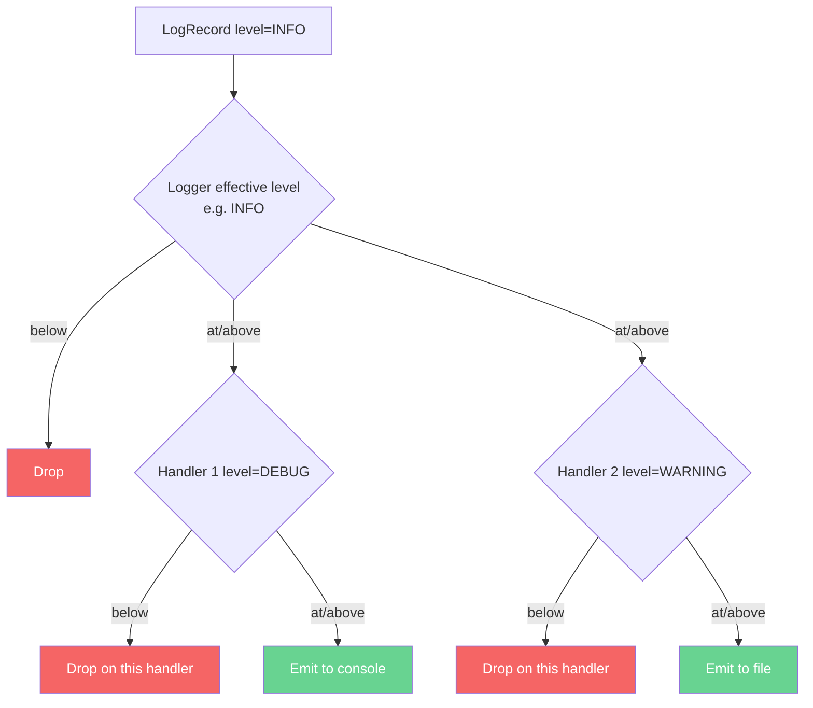
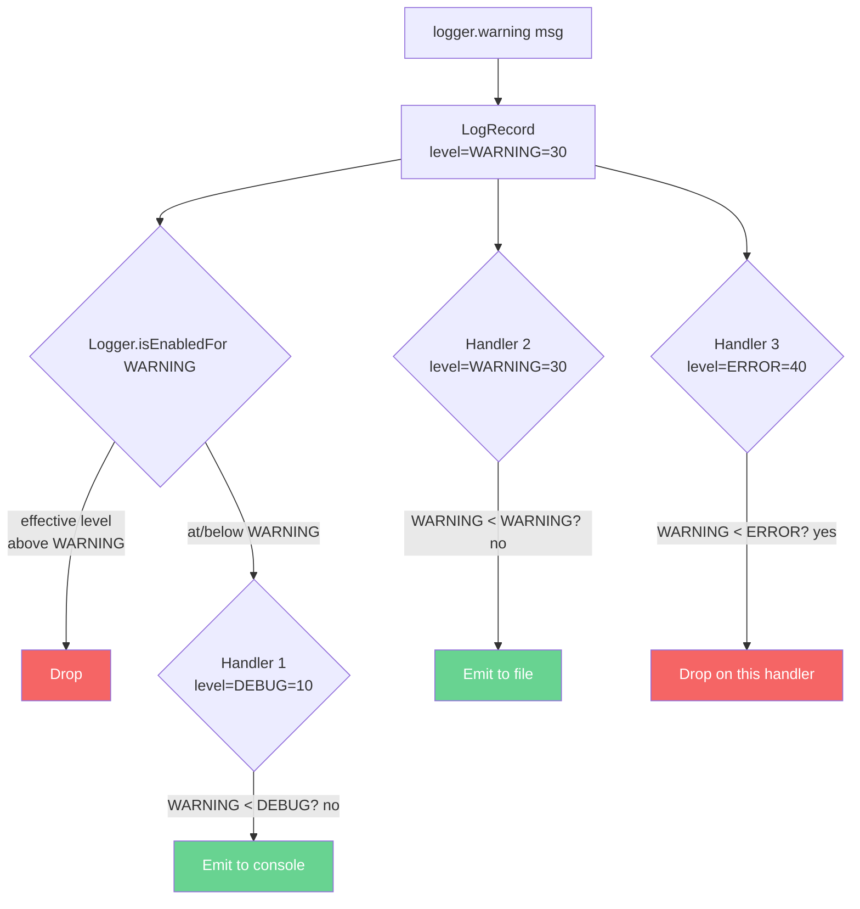
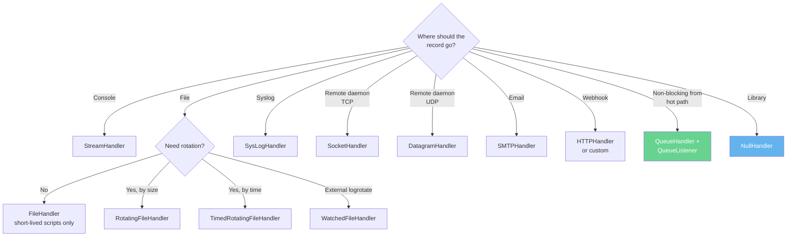

# 2. Log Levels and Handlers

> [!note] Why this note exists
> [[1. The logging Module]] covered the four-component architecture (Logger, Handler, Formatter, Filter) and the logger hierarchy. This note zooms in on the **levels** (the five built-ins plus custom levels, and how to think about them) and the **handlers** (the dispatchers that decide *where* a record goes: console, file with rotation, syslog, network socket, email, queue, and more). It also covers **formatters** in depth (the format-string grammar, `datefmt`, custom formatter classes) and **filters** (when to use them, the `Filter` class, callable filters). After this note, you'll be able to design a logging topology — "DEBUG goes to a rotating local file, INFO goes to stdout, ERROR pages the on-call" — and know which handler to reach for in each scenario.

## Why It Matters

The same log record can have very different value depending on where it goes:

- A DEBUG record about "entering function X" is priceless when you're debugging, but pure noise in a production dashboard.
- An ERROR record about "database connection refused" must page someone *now* if it's in production, but is just a console line during development.
- An INFO record about "user 42 logged in" is audit-worthy in financial services and disposable in a hobby app.

The mechanism that lets you say "this record goes here, that record goes there" is the **handler**. The mechanism that decides "this is important, that isn't" is the **level**. Together they're the routing layer of your observability stack.

Without levels and handlers, you have a firehose of text — everything to stdout, manual `grep` to find anything, no alerting, no archival. With them, you have a structured pipeline where each record goes to the right place at the right urgency.

## Background

### The five built-in levels

| Level      | Numeric | Constant             | When to use                                              |
|------------|---------|----------------------|----------------------------------------------------------|
| `DEBUG`    | 10      | `logging.DEBUG`      | Detailed diagnostic info — only in dev or when debugging |
| `INFO`     | 20      | `logging.INFO`       | Confirmation that things are working as expected         |
| `WARNING`  | 30      | `logging.WARNING`    | Something unexpected, but the program can keep going     |
| `ERROR`    | 40      | `logging.ERROR`      | A serious problem; the program couldn't do something     |
| `CRITICAL` | 50      | `logging.CRITICAL`   | A fatal error; the program cannot continue               |

There's also `NOTSET` (0) which means "inherit from parent".

The numbers matter: a record's level must be ≥ the effective level of the logger AND ≥ the handler's level to be emitted by that handler. So a `DEBUG` record on a logger with effective level `INFO` is dropped before reaching handlers. An `INFO` record on a logger at `INFO` reaches handlers — but a handler at `WARNING` won't emit it.



### What each level really means in production

The five levels are not arbitrary — they encode a contract with the operator:

- **DEBUG** — "If you're debugging this exact issue, this is the breadcrumb you want." Examples: function entry/exit, variable values, SQL queries, request payloads. **Volume:** potentially huge. **Cost:** high. **Action:** none — read manually.
- **INFO** — "The system is doing its normal thing." Examples: server started, request handled in 50ms, user logged in, job completed. **Volume:** moderate. **Cost:** moderate. **Action:** none — used for dashboards and audit.
- **WARNING** — "Something's off, but I can keep going." Examples: retrying after a timeout, falling back to a cache, deprecated API used, queue is 80% full. **Volume:** low. **Cost:** low. **Action:** investigate during business hours.
- **ERROR** — "I couldn't do what was asked." Examples: 500 errors, failed DB transaction, unhandled exception in a request, message dropped. **Volume:** very low. **Cost:** low. **Action:** page someone if it persists.
- **CRITICAL** — "The system is broken; service is degraded or unavailable." Examples: out of disk, out of memory, can't reach the database, master process died. **Volume:** essentially zero. **Cost:** low. **Action:** page immediately.

The discipline: **a level encodes the operator's response.** If you log at ERROR but nobody should page, it's not an ERROR — it's a WARNING. If you log at INFO but the operator must investigate, it's a WARNING.

### Custom levels (rare)

You can define new levels — e.g., `TRACE` (below DEBUG) or `NOTICE` (between INFO and WARNING):

```python
import logging

TRACE = 5
logging.addLevelName(TRACE, "TRACE")

def trace(self, msg, *args, **kwargs):
    if self.isEnabledFor(TRACE):
        self._log(TRACE, msg, args, **kwargs)

logging.Logger.trace = trace

logger = logging.getLogger(__name__)
logger.trace("very detailed info")
```

In practice, custom levels are an anti-pattern — they confuse operators ("what's NOTICE? do I page?") and tools (most dashboards group by the five standard levels). The standard advice: **don't define custom levels; use structured fields instead** (`logger.info("event", extra={"severity": "trace"})`). See [[3. Structured Logging]].

## Main content

### Setting levels: loggers vs handlers

Both `Logger` and `Handler` have `setLevel`. They filter at different stages:

```python
import logging

# Logger-level filter: nothing below INFO reaches this logger's handlers
logger = logging.getLogger("myapp")
logger.setLevel(logging.INFO)

# Handler-level filter: only WARNING+ reaches this handler
console = logging.StreamHandler()
console.setLevel(logging.WARNING)
logger.addHandler(console)

# Another handler: everything the logger emits goes here
file = logging.FileHandler("debug.log")
file.setLevel(logging.DEBUG)
logger.addHandler(file)

logger.debug("invisible everywhere — logger filters it out")
logger.info("goes to file only — console's WARNING threshold blocks it")
logger.warning("goes to both console and file")
logger.error("goes to both console and file")
```

The pattern:

- **Logger level** = "what's the highest verbosity I want for this entire module?"
- **Handler level** = "what subset of what the logger emits should *this* destination see?"

A common setup: logger at DEBUG (everything through), console handler at INFO (terminal isn't flooded), file handler at DEBUG (file gets everything, for forensics).

### The handler catalog

`logging` ships with these handler classes (all in `logging` or `logging.handlers`):

| Handler                  | Destination                                          | When to use                                          |
|--------------------------|------------------------------------------------------|------------------------------------------------------|
| `StreamHandler`          | Any stream (`sys.stderr`, `sys.stdout`)              | Default; console output                              |
| `FileHandler`            | A single file, no rotation                           | Short-lived scripts; otherwise use RotatingFileHandler |
| `RotatingFileHandler`    | File with size-based rotation                        | Long-running apps; prevents unbounded growth         |
| `TimedRotatingFileHandler` | File with time-based rotation (daily, hourly, etc.) | Apps that want log files per day/hour                |
| `SocketHandler`          | TCP socket                                           | Ship logs to a remote log daemon (e.g., logstash)    |
| `DatagramHandler`        | UDP socket                                           | Same, but fire-and-forget (cheaper, less reliable)   |
| `SysLogHandler`          | Syslog (Unix or network)                             | Server apps in a syslog-managed environment          |
| `NTEventLogHandler`      | Windows Event Log                                    | Windows services                                     |
| `SMTPHandler`            | Email                                                | Page on critical errors (rare today; prefer PagerDuty via webhook) |
| `HTTPHandler`            | HTTP POST                                            | Ship to a webhook (Slack, Datadog, Loggly)           |
| `QueueHandler`           | In-process queue                                     | Non-blocking logging from hot threads / async code   |
| `MemoryHandler`          | In-memory buffer, flushes to target on threshold     | Batch logs to a file periodically                    |
| `NullHandler`            | Drops everything                                     | Libraries (the golden rule — see [[1. The logging Module]]) |
| `WatchedFileHandler`     | File, re-opens if rotated externally                 | When `logrotate(8)` rotates your logs                |
| `BufferingHandler`       | Buffers in memory                                    | Custom batching                                       |

### `StreamHandler` — the default

```python
import logging
import sys

console = logging.StreamHandler(stream=sys.stderr)
console.setLevel(logging.INFO)
console.setFormatter(logging.Formatter("%(asctime)s [%(levelname)s] %(message)s"))
logger = logging.getLogger("myapp")
logger.addHandler(console)
```

`StreamHandler` writes to any object with a `write()` method. Default is `sys.stderr` — important, because `stdout` is for program output (data), `stderr` is for diagnostics (logs). Mixing them confuses shell pipelines.

### `FileHandler` — write to a file

```python
import logging

file_handler = logging.FileHandler("app.log", mode="a", encoding="utf-8")
file_handler.setLevel(logging.DEBUG)
file_handler.setFormatter(logging.Formatter("%(asctime)s [%(levelname)s] %(message)s"))
```

`mode="a"` (default) appends; `mode="w"` truncates on each open (rarely what you want). Use `encoding="utf-8"` explicitly — the default is locale-dependent, which causes mojibake on non-ASCII content.

### `RotatingFileHandler` — size-based rotation

```python
import logging
from logging.handlers import RotatingFileHandler

handler = RotatingFileHandler(
    filename="app.log",
    mode="a",
    maxBytes=10 * 1024 * 1024,    # 10 MB per file
    backupCount=5,                 # keep app.log.1, app.log.2, ..., app.log.5
    encoding="utf-8",
)
handler.setFormatter(logging.Formatter("%(asctime)s [%(levelname)s] %(message)s"))
```

When `app.log` reaches 10 MB, it's renamed to `app.log.1`, the previous `app.log.1` becomes `app.log.2`, etc. The oldest (`app.log.5`) is deleted. Total disk usage: ~60 MB.

### `TimedRotatingFileHandler` — time-based rotation

```python
import logging
from logging.handlers import TimedRotatingFileHandler

handler = TimedRotatingFileHandler(
    filename="app.log",
    when="midnight",       # 'S' seconds, 'M' minutes, 'H' hours, 'D' days, 'W0'-'W6' weekday, 'midnight'
    interval=1,             # rotate every 1 <when>
    backupCount=7,          # keep 7 days of logs
    encoding="utf-8",
)
handler.setFormatter(logging.Formatter("%(asctime)s [%(levelname)s] %(message)s"))
```

Each rotation produces `app.log.2024-06-15`, `app.log.2024-06-14`, etc. Use `when="midnight"` for daily logs; `when="H"` for hourly; `when="W0"` for weekly on Monday.

You can customize the filename suffix with `handler.suffix = "%Y-%m-%d.log"`.

### `SocketHandler` and `DatagramHandler` — ship to a remote daemon

```python
import logging
from logging.handlers import SocketHandler, DatagramHandler

# TCP — reliable; the handler blocks on connect/emit if the server is down
tcp_handler = SocketHandler(host="logstash.internal", port=5000)

# UDP — fire-and-forget; never blocks, but drops if server is unreachable or buffer full
udp_handler = DatagramHandler(host="logstash.internal", port=5000)
```

The record is pickled and sent over the wire. The receiving end (logstash, vector, fluentd) parses the pickle and forwards. **Note:** pickled records can contain arbitrary objects — security implications if untrusted.

### `SysLogHandler` — syslog

```python
import logging
from logging.handlers import SysLogHandler

syslog = SysLogHandler(address="/dev/log")   # local Unix socket
# or: SysLogHandler(address=("syslog.internal", 514), facility=SysLogHandler.LOG_LOCAL0)
syslog.setFormatter(logging.Formatter("myapp[%(process)d]: %(levelname)s %(message)s"))
```

Each platform has its own syslog quirks. On Linux, `/dev/log` is the standard socket; on macOS, `/var/run/syslog`. For network syslog, use `address=(host, port)` (default port 514).

### `SMTPHandler` — email on errors

```python
import logging
from logging.handlers import SMTPHandler

mail = SMTPHandler(
    mailhost=("smtp.example.com", 587),
    fromaddr="alerts@example.com",
    toaddrs=["oncall@example.com"],
    subject="Production error in myapp",
    credentials=("user", "password"),
    secure=(),    # enable STARTTLS
)
mail.setLevel(logging.ERROR)
```

Email is rarely the right paging tool today — Slack/PagerDuty/Opsgenie via `HTTPHandler` or a custom handler is more actionable. But for low-volume audit logs ("admin user promoted another user"), email is still useful.

### `HTTPHandler` — POST to a webhook

```python
import logging
from logging.handlers import HTTPHandler

slack = HTTPHandler(
    host="hooks.slack.com",
    url="/services/T00000000/B00000000/XXXXXXXXXXXXXXXXXXXXXXXX",
    method="POST",
    secure=True,
)
slack.setFormatter(logging.Formatter('{"text": "%(levelname)s: %(message)s"}'))
slack.setLevel(logging.CRITICAL)
```

The built-in `HTTPHandler` URL-encodes the record fields as form data — most webhooks expect JSON. For JSON, write a custom handler:

```python
import json
import urllib.request
import logging

class SlackHandler(logging.Handler):
    def __init__(self, webhook_url):
        super().__init__()
        self.webhook_url = webhook_url

    def emit(self, record):
        try:
            payload = json.dumps({
                "text": f"[{record.levelname}] {record.name}: {record.getMessage()}",
                "username": "myapp-logger",
            }).encode("utf-8")
            req = urllib.request.Request(self.webhook_url, data=payload,
                                          headers={"Content-Type": "application/json"})
            urllib.request.urlopen(req, timeout=5)
        except Exception:
            self.handleError(record)
```

### `QueueHandler` — non-blocking logging

```python
import logging
import logging.handlers
import queue

log_queue = queue.Queue(-1)   # unbounded
queue_handler = logging.handlers.QueueHandler(log_queue)

# Attach heavy handlers to a listener that runs in a background thread
file_handler = logging.handlers.RotatingFileHandler("app.log", maxBytes=10_000_000, backupCount=5)
smtp_handler = logging.handlers.SMTPHandler(...)

listener = logging.handlers.QueueListener(
    log_queue,
    file_handler,
    smtp_handler,
    respect_handler_level=True,   # 3.9+: each handler still filters by its own level
)
listener.start()

# Wire the queue handler to the app
logging.root.addHandler(queue_handler)
logging.root.setLevel(logging.DEBUG)

# ... application logs normally ...

# At shutdown:
listener.stop()
```

`QueueHandler.emit` is `O(1)` — it just `put()`s the record on a queue. The `QueueListener` thread does the slow I/O (file write, SMTP send, HTTP POST). This is the recommended pattern for:

- High-throughput applications (web servers, async pipelines).
- Async code where blocking the event loop is unacceptable.
- Handlers with slow destinations (SMTP, HTTP).

### `MemoryHandler` — buffer and flush

```python
import logging
from logging.handlers import MemoryHandler

target = logging.FileHandler("app.log")
buffer = MemoryHandler(capacity=100, flushLevel=logging.ERROR, target=target)
# Flushes to target when 100 records accumulate OR an ERROR+ record arrives
```

Useful when you want to log only if there's a problem — buffer DEBUG/INFO records silently, and if an ERROR arrives, dump the buffer to disk so you have the context that led up to it.

### `WatchedFileHandler` — works with `logrotate(8)`

```python
import logging
from logging.handlers import WatchedFileHandler

handler = WatchedFileHandler("app.log")
```

If `logrotate(8)` (or any external tool) moves `app.log` aside, `WatchedFileHandler` notices (by checking the inode on each emit) and re-opens the file. Use this when the OS rotates your logs — typical of system services on Linux.

### Formatters — the format-string grammar

```python
formatter = logging.Formatter(
    fmt="%(asctime)s [%(levelname)s] %(name)s %(funcName)s:%(lineno)d: %(message)s",
    datefmt="%Y-%m-%d %H:%M:%S",
    style="%",
)
```

- `fmt` — the format string. See the full attribute list in [[1. The logging Module]].
- `datefmt` — `strftime`-style format for `asctime`.
- `style` — one of `"%"` (default), `"{"` (`str.format`-style), or `"$"` (`string.Template`-style).

Common format recipes:

```python
# Simple
"%(asctime)s [%(levelname)s] %(message)s"

# With module and line
"%(asctime)s [%(levelname)s] %(name)s:%(lineno)d: %(message)s"

# With function name (great for debugging)
"%(asctime)s [%(levelname)s] %(name)s.%(funcName)s(): %(message)s"

# With process and thread (for concurrent code)
"%(asctime)s [%(levelname)s] %(processName)s/%(threadName)s %(name)s: %(message)s"

# With exception info (auto-included by logger.exception, optional otherwise)
"%(asctime)s [%(levelname)s] %(message)s\n%(exc_info)s"

# Minimal (for parsing by simple tools)
"%(levelname)s\t%(name)s\t%(message)s"
```

### Custom Formatter classes

For anything beyond string formatting, subclass `Formatter`:

```python
import json
import logging

class JsonFormatter(logging.Formatter):
    def format(self, record):
        log = {
            "ts": self.formatTime(record, self.datefmt),
            "level": record.levelname,
            "logger": record.name,
            "msg": record.getMessage(),
            "file": record.filename,
            "line": record.lineno,
        }
        if record.exc_info:
            log["exception"] = self.formatException(record.exc_info)
        # Include any extra fields attached via extra=...
        for key, value in record.__dict__.items():
            if key not in {"args", "asctime", "created", "exc_info", "exc_text",
                           "filename", "funcName", "levelname", "levelno", "lineno",
                           "module", "msecs", "message", "msg", "name", "pathname",
                           "process", "processName", "relativeCreated", "stack_info",
                           "thread", "threadName"}:
                log[key] = value
        return json.dumps(log, ensure_ascii=False, default=str)
```

For production structured logging, prefer `python-json-logger` — see [[3. Structured Logging]].

### Filters — fine-grained record control

A `Filter` is attached to a logger or a handler and decides whether a record passes:

```python
import logging

class ModuleFilter(logging.Filter):
    """Only allow records from loggers whose name starts with `prefix`."""
    def __init__(self, prefix):
        super().__init__()
        self.prefix = prefix

    def filter(self, record):
        return record.name.startswith(self.prefix)

# Or use the standard Filter with a name — passes only records from
# the named logger or its children
console = logging.StreamHandler()
console.addFilter(logging.Filter("myapp"))   # only myapp.* records
```

A `Filter` can also *mutate* the record — useful for injecting context:

```python
class RequestIdFilter(logging.Filter):
    def filter(self, record):
        record.request_id = get_current_request_id()
        return True   # always pass
```

You can also pass any callable as a filter:

```python
console.addFilter(lambda record: record.levelno >= logging.WARNING)
```

### Filter attachment: logger vs handler

- Filters on a **logger** are consulted when the record enters the logger (before propagation).
- Filters on a **handler** are consulted when the handler is about to emit.

The same record may pass through multiple filter sets. Common pattern: a logger-level filter for "only myapp records"; a handler-level filter for "only WARNING+".

### Multiple handlers, multiple destinations

```python
import logging
import logging.config

CONFIG = {
    "version": 1,
    "disable_existing_loggers": False,
    "formatters": {
        "human": {"format": "%(asctime)s [%(levelname)s] %(name)s: %(message)s"},
        "json": {"()": "myapp.logging.JsonFormatter"},
    },
    "handlers": {
        "console": {
            "class": "logging.StreamHandler",
            "level": "INFO",
            "formatter": "human",
            "stream": "ext://sys.stderr",
        },
        "file": {
            "class": "logging.handlers.RotatingFileHandler",
            "level": "DEBUG",
            "formatter": "human",
            "filename": "logs/app.log",
            "maxBytes": 10_000_000,
            "backupCount": 5,
        },
        "json_file": {
            "class": "logging.handlers.TimedRotatingFileHandler",
            "level": "INFO",
            "formatter": "json",
            "filename": "logs/app.json.log",
            "when": "midnight",
            "backupCount": 14,
        },
        "errors": {
            "class": "logging.handlers.SMTPHandler",
            "level": "ERROR",
            "formatter": "human",
            "mailhost": "smtp.example.com",
            "fromaddr": "alerts@example.com",
            "toaddrs": ["oncall@example.com"],
            "subject": "Production error",
        },
    },
    "loggers": {
        "myapp": {
            "level": "DEBUG",
            "handlers": ["console", "file", "json_file", "errors"],
            "propagate": False,
        },
    },
    "root": {
        "level": "WARNING",
        "handlers": ["console"],
    },
}
```

This routes:

- DEBUG+: written to `logs/app.log` (rotating).
- INFO+: also written to console (`stderr`) and `logs/app.json.log` (JSON, daily rotation).
- ERROR+: also emailed to on-call.

Each handler has its own format and its own level — full control.

## Mermaid diagrams

### Log level filtering flow



### Handler family decision tree



### QueueHandler + QueueListener pipeline

```mermaid
flowchart LR
    App[Application<br/>threads/async] -->|emit| QH[QueueHandler<br/>O(1) put]
    QH --> Q[Queue]
    Q --> QL[QueueListener<br/>background thread]
    QL --> FH[FileHandler]
    QL --> SH2[StreamHandler]
    QL --> SMTP[SMTPHandler]
    QL --> HTTP[HTTPHandler]
    style QH fill:#f6ad55,color:#fff
    style QL fill:#68d391,color:#fff
```

The application thread never waits for I/O. The listener thread absorbs the latency.

## Code examples

### Example 1: A complete console + rotating-file setup

```python
# myapp/logging_config.py
import logging
import logging.config
import os

def setup_logging(env="dev"):
    level = "DEBUG" if env == "dev" else "INFO"
    log_dir = os.environ.get("LOG_DIR", "logs")
    os.makedirs(log_dir, exist_ok=True)

    config = {
        "version": 1,
        "disable_existing_loggers": False,
        "formatters": {
            "human": {
                "format": "%(asctime)s [%(levelname)s] %(name)s %(funcName)s:%(lineno)d: %(message)s",
                "datefmt": "%Y-%m-%d %H:%M:%S",
            },
        },
        "handlers": {
            "console": {
                "class": "logging.StreamHandler",
                "level": level,
                "formatter": "human",
                "stream": "ext://sys.stderr",
            },
            "file": {
                "class": "logging.handlers.RotatingFileHandler",
                "level": "DEBUG",
                "formatter": "human",
                "filename": os.path.join(log_dir, "app.log"),
                "maxBytes": 10 * 1024 * 1024,
                "backupCount": 5,
                "encoding": "utf-8",
            },
        },
        "loggers": {
            "myapp": {
                "level": "DEBUG",
                "handlers": ["console", "file"],
                "propagate": False,
            },
            "urllib3": {"level": "WARNING"},
            "asyncio": {"level": "WARNING"},
        },
        "root": {
            "level": "WARNING",
            "handlers": ["console"],
        },
    }
    logging.config.dictConfig(config)
```

### Example 2: TimedRotatingFileHandler with custom suffix

```python
import logging
from logging.handlers import TimedRotatingFileHandler

handler = TimedRotatingFileHandler(
    filename="logs/app.log",
    when="midnight",
    backupCount=14,    # keep two weeks
    encoding="utf-8",
)
handler.suffix = "%Y-%m-%d"   # files become app.log.2024-06-15
# Optionally, also delete files older than backupCount, even if they don't match the pattern
handler.extMatch = r"^\d{4}-\d{2}-\d{2}$"
import re
handler.extMatch = re.compile(handler.extMatch)
```

### Example 3: SMTPHandler with TLS

```python
import logging
from logging.handlers import SMTPHandler

mail = SMTPHandler(
    mailhost=("smtp.gmail.com", 587),
    fromaddr="alerts@myapp.com",
    toaddrs=["oncall@myapp.com"],
    subject="Production error in myapp",
    credentials=("alerts@myapp.com", "app-password"),
    secure=(),   # () means use STARTTLS
)
mail.setLevel(logging.ERROR)
mail.setFormatter(logging.Formatter(
    "%(asctime)s [%(levelname)s] %(name)s:%(lineno)d\n\n%(message)s\n\n%(exc_info)s"
))
```

For Gmail, use an [App Password](https://support.google.com/accounts/answer/185833) — your main account password won't work.

### Example 4: QueueHandler + QueueListener

```python
import logging
import logging.handlers
import queue
import atexit

def setup_async_logging():
    log_queue = queue.Queue(-1)
    queue_handler = logging.handlers.QueueHandler(log_queue)

    # The actual handlers (slow I/O)
    file_handler = logging.handlers.RotatingFileHandler(
        "logs/app.log", maxBytes=10_000_000, backupCount=5, encoding="utf-8"
    )
    file_handler.setFormatter(logging.Formatter(
        "%(asctime)s [%(levelname)s] %(name)s: %(message)s"
    ))
    console_handler = logging.StreamHandler()
    console_handler.setLevel(logging.INFO)
    console_handler.setFormatter(logging.Formatter("%(levelname)s: %(message)s"))

    listener = logging.handlers.QueueListener(
        log_queue, file_handler, console_handler, respect_handler_level=True
    )
    listener.start()
    atexit.register(listener.stop)

    root = logging.getLogger()
    root.addHandler(queue_handler)
    root.setLevel(logging.DEBUG)
```

### Example 5: A Slack webhook handler

```python
import json
import logging
import urllib.request

class SlackHandler(logging.Handler):
    def __init__(self, webhook_url, channel=None, username="myapp"):
        super().__init__()
        self.webhook_url = webhook_url
        self.channel = channel
        self.username = username

    def emit(self, record):
        try:
            text = self.format(record)
            payload = {
                "text": text,
                "username": self.username,
                "icon_emoji": ":rotating_light:" if record.levelno >= logging.ERROR else ":information_source:",
            }
            if self.channel:
                payload["channel"] = self.channel
            data = json.dumps(payload).encode("utf-8")
            req = urllib.request.Request(
                self.webhook_url, data=data,
                headers={"Content-Type": "application/json"},
            )
            urllib.request.urlopen(req, timeout=5)
        except Exception:
            self.handleError(record)
```

Wire it up:

```python
slack = SlackHandler("https://hooks.slack.com/services/...")
slack.setLevel(logging.CRITICAL)
slack.setFormatter(logging.Formatter("*%(levelname)s* in `%(name)s`: %(message)s"))
logging.getLogger("myapp").addHandler(slack)
```

### Example 6: A filter that adds request_id

```python
import logging
import contextvars

request_id_var: contextvars.ContextVar[str] = contextvars.ContextVar("request_id", default="-")

class RequestIdFilter(logging.Filter):
    def filter(self, record):
        record.request_id = request_id_var.get()
        return True

# Config
# "filters": {"request_id": {"()": "myapp.logging.RequestIdFilter"}}
# Format: "%(asctime)s [%(levelname)s] req=%(request_id)s %(name)s: %(message)s"

# In a FastAPI / Starlette middleware:
from starlette.middleware.base import BaseHTTPMiddleware
from starlette.requests import Request
import uuid

class RequestIdMiddleware(BaseHTTPMiddleware):
    async def dispatch(self, request: Request, call_next):
        rid = request.headers.get("X-Request-ID") or str(uuid.uuid4())
        token = request_id_var.set(rid)
        try:
            response = await call_next(request)
            response.headers["X-Request-ID"] = rid
            return response
        finally:
            request_id_var.reset(token)
```

### Example 7: Sensitive data filter

```python
import logging
import re

SENSITIVE_PATTERNS = [
    (re.compile(r"(password=)[^&\s]+", re.I), r"\1***"),
    (re.compile(r"(token=)[^&\s]+", re.I), r"\1***"),
    (re.compile(r"(Authorization: Bearer )\S+"), r"\1***"),
    (re.compile(r"\b\d{4}[-\s]?\d{4}[-\s]?\d{4}[-\s]?\d{4}\b"), "****-****-****-****"),   # credit card
]

class ScrubFilter(logging.Filter):
    def filter(self, record):
        msg = record.getMessage()
        for pattern, replacement in SENSITIVE_PATTERNS:
            msg = pattern.sub(replacement, msg)
        record.msg = msg
        record.args = ()
        return True
```

Attach to a handler that ships off-host:

```python
# config
"http": {
    "class": "logging.handlers.HTTPHandler",
    "filters": ["scrub"],
    ...
}
```

### Example 8: A custom level for audit logs

```python
import logging

AUDIT_LEVEL = 35   # between WARNING (30) and ERROR (40)
logging.addLevelName(AUDIT_LEVEL, "AUDIT")

def audit(self, msg, *args, **kwargs):
    if self.isEnabledFor(AUDIT_LEVEL):
        self._log(AUDIT_LEVEL, msg, args, **kwargs)

logging.Logger.audit = audit

# Use it
logger = logging.getLogger("myapp.audit")
logger.audit("user %s promoted %s", actor, target)
```

In production, audit records often go to a separate handler (an append-only audit file or a separate stream). See [[3. Structured Logging]] for the better pattern (use a custom field, not a custom level).

## Common Pitfalls

> [!warning] FileHandler without rotation
> A `FileHandler` writes to one file forever. After 6 months of production traffic, you have a 50 GB log file that no tool can open. Always use `RotatingFileHandler` or `TimedRotatingFileHandler` for long-running apps.

> [!warning] RotatingFileHandler truncates the wrong file
> If `backupCount=0`, the handler rotates by *truncating* the current file — losing all history. Always set `backupCount >= 1`.

> [!warning] SMTPHandler flooding on call
> If your app hits an error in a retry loop, SMTPHandler sends an email per iteration — 1000 emails in 30 seconds. Pair SMTPHandler with `MemoryHandler` (flush on ERROR, batch the rest), or wrap it with rate limiting.

> [!warning] Logging from multiple processes to the same file
> Two processes can't safely write to the same `FileHandler` — output interleaves and rotations race. Use one process per file, or `SocketHandler`/`QueueHandler` to a single writer process, or `concurrent-log-handler` (third party).

> [!warning] `force=True` clobbering library loggers
> `logging.basicConfig(force=True)` (3.8+) wipes all existing handlers from the root, including ones set by libraries. Use `dictConfig` with `disable_existing_loggers=False` to keep library loggers intact.

> [!warning] Handler not setting a level
> ```python
> handler = logging.StreamHandler()
> # handler.setLevel(...) omitted — defaults to NOTSET (0), emits everything
> ```
> A handler with no level emits everything the logger emits. Often that's not what you want — set an explicit level.

> [!warning] Formatter not set on handler
> A handler without a formatter emits just the message (no timestamp, no level). Almost always wrong — set a formatter explicitly.

> [!warning] `datefmt` missing milliseconds
> ```python
> logging.Formatter("%(asctime)s ...", datefmt="%Y-%m-%d %H:%M:%S")
> ```
> Default `asctime` includes `,mmm` (milliseconds). A custom `datefmt` strips them — which matters when correlating logs by time. Use `datefmt="%Y-%m-%d %H:%M:%S,%f"` or omit `datefmt` to keep the default.

> [!warning] Filters that block propagation
> A filter on a logger blocks the record from reaching the logger's handlers AND from propagating to ancestors. If you only want to filter one handler, attach the filter to the handler, not the logger.

> [!warning] `addFilter` instead of `setFilter`
> Handlers and loggers support *multiple* filters via `addFilter` (not `setFilter`). All filters must pass for the record to be emitted (logical AND).

> [!warning] QueueHandler without a listener
> ```python
> logging.handlers.QueueHandler(q)   # nobody is consuming q
> ```
> Records pile up in the queue forever (or until the queue is full, then they're dropped silently). Always start a `QueueListener`.

> [!warning] Forgetting `listener.stop()` at shutdown
> The listener thread is non-daemon by default; if you don't stop it, the process hangs at exit. Use `atexit.register(listener.stop)` or stop it explicitly in your shutdown hook.

> [!warning] SysLogHandler truncating long messages
> Syslog has a default message size limit (~2048 bytes on many systems). Long stack traces are truncated. Use `SocketHandler` or `HTTPHandler` for full-length logs.

> [!warning] HTTPHandler URL-encoding instead of JSON
> The stdlib `HTTPHandler` sends records as URL-encoded form data. Most modern webhooks (Slack, Datadog) expect JSON. Write a custom handler.

> [!warning] Logging exceptions in handlers crashes the app
> If `SMTPHandler.emit` raises (network down), `logging` calls `handleError`, which prints to stderr but does NOT crash. If you set `logging.raiseExceptions = False` in production, even the stderr print is suppressed. Monitor for handler errors via metrics.

## Tips and Tricks

- **Default to `StreamHandler` to `sys.stderr`.** Logs are diagnostics, not data. Keep `stdout` for program output.
- **Always rotate.** Either size-based (`RotatingFileHandler`) or time-based (`TimedRotatingFileHandler`). 10 MB per file, 5-10 backups is a sane default.
- **Set explicit levels on every handler.** A handler with no level is a foot-gun.
- **Use `dictConfig` for any non-trivial setup.** Declarative, version-controllable, and can be loaded from YAML.
- **Quiet noisy third-party loggers.** `urllib3`, `asyncio`, `boto3`, `botocore`, `matplotlib` — set to WARNING by default.
- **`propagate = False` on the app logger** if you add a dedicated handler — avoids duplicate output via root.
- **Use `QueueHandler` + `QueueListener` for high-throughput or async.** The application thread should never block on I/O.
- **Add `atexit.register(listener.stop)`** so the listener doesn't hang the process at shutdown.
- **Add `request_id` (and other context) via a custom `Filter` + `contextvars`.** Lets you follow one request across services.
- **Scrub sensitive fields with a filter.** Passwords, tokens, credit-card numbers, SSNs — never let them reach a handler that ships off-host.
- **Use `MemoryHandler` to log only on error.** Buffer DEBUG/INFO; flush the buffer when an ERROR arrives. Cheap forensics.
- **For audit logs, use a separate logger and handler.** Audit needs different retention, different access control, and different format (often JSON).
- **Pin `logging.raiseExceptions = False` in production.** A handler bug should never crash the app.
- **Set `logging.logProcesses = True` and `logging.logThreads = True`** if you need process/thread IDs in your format.
- **Override `handleError` to send to a metrics system.** Track handler failures (disk full, network down) as a metric, not just stderr.
- **For containers, log to stdout.** The container runtime (Docker, Kubernetes) captures it and ships it. No file rotation needed.
- **For systemd services, use `SysLogHandler` or `StreamHandler` to `sys.stderr`.** systemd captures stderr and forwards to journald.
- **`Formatter.converter` is overridable.** Set `formatter.converter = time.gmtime` for UTC timestamps — critical for multi-region systems.
- **Use `logging.captureWarnings(True)`** to route `warnings.warn(...)` through the logging system. Configure `py.warnings` logger to control its level.
- **Don't log inside `__del__` or signal handlers.** These run in restricted contexts where I/O may not be safe.

## Active Recall

1. Name the five built-in log levels and their numeric values.
2. What's the difference between setting a level on a logger and setting one on a handler?
3. When does a record get emitted by a handler? (Logger level AND handler level, or OR?)
4. Why is `FileHandler` usually the wrong choice for production? What replaces it?
5. What's the difference between `RotatingFileHandler` and `TimedRotatingFileHandler`?
6. What does `QueueHandler` buy you? When is it essential?
7. Why must you call `listener.stop()` at shutdown?
8. How do you make `asctime` use UTC?
9. Write a `Formatter` format string that includes timestamp, level, logger name, file, line, and message.
10. What does a `Filter` return to keep a record? To drop it?
11. Write a filter that adds a `request_id` field to every record.
12. Why is SMTPHandler usually a bad paging tool today? What replaces it?
13. Why does `HTTPHandler` not work out-of-the-box with Slack? What's the fix?
14. Why is logging from multiple processes to the same file dangerous? What are three solutions?
15. What's the `MemoryHandler` pattern? When is it useful?

## Next Steps

- For machine-parseable logs (JSON, structlog, correlation IDs, ELK/Datadog integration), see [[3. Structured Logging]].
- For the four-component architecture and the logger hierarchy, see [[1. The logging Module]].
- For testing log output (`caplog` in pytest, `assertLogs` in unittest), see [[3. pytest]] and [[2. unittest]].
- For the standard-library intro (if you skipped it), see [[9. Standard Library Deep Dive/7. logging]].
- For async logging patterns, see the `QueueHandler` section above and the [[1. The logging Module]] performance notes.
