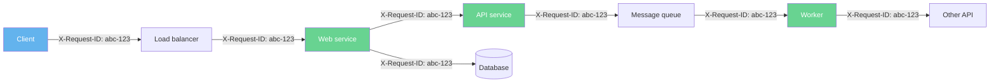
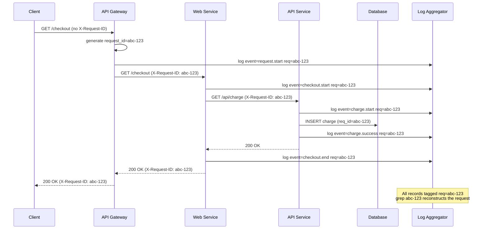
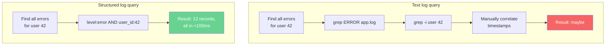

# 3. Structured Logging

> [!note] Why this note exists
> Text logs — `"2024-06-15 14:30:00 [INFO] user 42 logged in"` — are great for humans reading a terminal. They are terrible for machines. A regex that extracts `user_id` from that line breaks the moment someone adds "from IP 10.0.0.5" or changes "user" to "User". **Structured logging** emits records as machine-parseable objects (typically JSON), with consistent keys, typed values, and correlation IDs that follow a request across services. This note covers *why* structured logging matters, the `python-json-logger` package, the more powerful `structlog` library, log keys and conventions, trace IDs and correlation IDs, and integration with the major log aggregation platforms (ELK, Datadog, Splunk, Loki, CloudWatch). After this note, you'll never want to ship ad-hoc text logs to production again.

## Why It Matters

Picture this incident: a user reports "the checkout button doesn't work for me, sometimes." You SSH to the server and `tail -f /var/log/app.log`. You see:

```
2024-06-15 14:30:00 [INFO] processing payment for order 4521
2024-06-15 14:30:01 [INFO] calling stripe API
2024-06-15 14:30:02 [ERROR] payment failed
2024-06-15 14:30:02 [INFO] retrying payment for order 4521
2024-06-15 14:30:03 [INFO] processing payment for order 4522
2024-06-15 14:30:04 [ERROR] payment failed
2024-06-15 14:30:05 [INFO] processing payment for order 4523
```

Which ERROR was the user's? You don't know — there's no user ID, no request ID, no timestamp correlation. Three other requests happened in the same second. Now imagine 10,000 requests per minute and the picture is hopeless.

Now picture the same incident with structured logs:

```json
{"ts":"2024-06-15T14:30:00Z","level":"info","event":"payment.start","order_id":4521,"user_id":42,"request_id":"abc-123","ip":"10.0.0.5"}
{"ts":"2024-06-15T14:30:01Z","level":"info","event":"stripe.call","order_id":4521,"user_id":42,"request_id":"abc-123"}
{"ts":"2024-06-15T14:30:02Z","level":"error","event":"payment.failed","order_id":4521,"user_id":42,"request_id":"abc-123","error":"card_declined"}
```

Query your log aggregator for `request_id="abc-123"` and you get the complete trace of that one request — across services, across machines, across the entire lifetime. That's the value proposition.

## Background

### Text logs vs structured logs

| Aspect                   | Text logs                                            | Structured logs                                     |
|--------------------------|------------------------------------------------------|-----------------------------------------------------|
| Format                   | Free-form string                                     | JSON (or other machine format)                       |
| Parseability             | Regex, fragile                                       | Native JSON parse, robust                            |
| Field consistency        | Ad-hoc — "user 42" vs "user=42" vs "user_id=42"      | Schema — `user_id` is always `user_id`               |
| Typing                   | All strings                                          | Numbers, booleans, nested objects, arrays            |
| Queryability             | `grep`, slow                                         | Index by field, fast                                 |
| Correlation              | None (timestamps only)                               | Request/trace IDs as first-class fields              |
| Alerting                 | Regex match on text                                  | Field equality, range, absence                       |
| Cost                     | Cheap to write, expensive to query                   | Slightly more expensive to write, cheap to query      |
| Human readability        | Excellent                                            | Adequate (one-line JSON is readable; pretty-printed JSON is great) |
| Tool integration         | Needs custom parsers                                 | Native in ELK, Datadog, Splunk, Loki, CloudWatch, … |

### The case for JSON

JSON is the de-facto standard for structured logs because:

- Every language can produce and parse it.
- Every log aggregator ingests it natively.
- It's line-delimited (one JSON object per line) — so the file is still `grep`-able.
- It supports nested objects and arrays — for complex payloads.
- It's human-readable in a way that protobuf or msgpack aren't.

The line-delimited variant is called **NDJSON** (Newline-Delimited JSON) or **JSONL**. Each line is a complete JSON object. This is what log shippers expect.

### Log keys: the schema

Structured logs work best when fields have consistent names across the codebase. A schema (formal or informal) prevents the same concept from being logged as `user`, `user_id`, `userId`, `userid`, and `uid`.

Recommended baseline keys:

| Key             | Type     | Example                            | Notes                                                |
|-----------------|----------|------------------------------------|------------------------------------------------------|
| `ts` or `time`  | str      | `"2024-06-15T14:30:00.123Z"`       | ISO 8601 with timezone; UTC preferred                |
| `level`         | str      | `"info"`                           | Lowercase                                            |
| `logger`        | str      | `"myapp.auth"`                     | Logger name                                          |
| `msg` or `message` | str   | `"user logged in"`                 | Human-readable summary                               |
| `event`         | str      | `"user.login"`                     | Dotted event name (verb.noun)                        |
| `request_id`    | str      | `"abc-123"`                        | Unique per request; propagates across services       |
| `trace_id`      | str      | `"0af7651916cd43dd8448eb211c80319c"` | OpenTelemetry trace ID                             |
| `span_id`       | str      | `"b7ad6b7169203331"`               | OpenTelemetry span ID                                |
| `user_id`       | int/str  | `42`                               | The acting user, if any                              |
| `service`       | str      | `"checkout"`                       | The emitting service                                 |
| `env`           | str      | `"prod"`                           | dev/staging/prod                                     |
| `version`       | str      | `"1.4.2"`                          | App version                                          |
| `host`          | str      | `"ip-10-0-0-5"`                    | Hostname (often added by shipper)                    |
| `pid`           | int      | `12345`                            | Process ID                                           |
| `duration_ms`   | int      | `150`                              | For timed operations                                 |
| `error`         | str      | `"card_declined"`                  | Exception type or error code                         |
| `stack`         | str      | `"Traceback..."`                   | Multiline stack trace, JSON-escaped                  |

Pick a convention and document it. The [OpenTelemetry Semantic Conventions](https://opentelemetry.io/docs/specs/semconv/general/attributes/) are a good starting point — they cover HTTP, database, messaging, and more.

### Correlation IDs

A **correlation ID** (also called request ID, trace ID) is a unique identifier generated at the start of a request and propagated through every log line, every downstream call, every queue message. Without it, you can't follow a single request across services.



Every service emits logs tagged with `request_id="abc-123"`. To debug a single user's problem, you grep all logs for that ID and reconstruct the entire path.

The pattern:

1. **At the edge** (load balancer, API gateway, or first service), generate or extract the request ID. Accept `X-Request-ID` from the client (so client-side tracing works); generate one if absent.
2. **Propagate** the ID to downstream calls — via HTTP headers (`X-Request-ID`, `traceparent` for W3C Trace Context), message metadata, or context variables.
3. **Log** the ID in every record. Use a `Filter` that pulls it from `contextvars` so application code doesn't have to pass it around.
4. **Return** the ID in the response (`X-Request-ID` header) so the client can include it in bug reports.

W3C Trace Context (`traceparent` header) is the standard for distributed tracing. OpenTelemetry uses it; most APM vendors (Datadog, New Relic, Honeycomb, Lightstep) support it natively.

## Main content

### `python-json-logger` — JSON formatter for stdlib logging

`pip install python-json-logger`. Then either:

```python
import logging
from pythonjsonlogger import jsonlogger

logger = logging.getLogger("myapp")
handler = logging.StreamHandler()
handler.setFormatter(jsonlogger.JsonFormatter(
    "%(asctime)s %(levelname)s %(name)s %(message)s",
    rename_fields={"asctime": "ts", "levelname": "level", "name": "logger"},
    json_ensure_ascii=False,
))
logger.addHandler(handler)
logger.setLevel(logging.INFO)

logger.info("user logged in", extra={"user_id": 42, "request_id": "abc-123"})
# {"ts": "2024-06-15 14:30:00,123", "level": "INFO", "logger": "myapp",
#  "message": "user logged in", "user_id": 42, "request_id": "abc-123"}
```

Or via `dictConfig`:

```python
LOGGING_CONFIG = {
    "version": 1,
    "disable_existing_loggers": False,
    "formatters": {
        "json": {
            "()": "pythonjsonlogger.jsonlogger.JsonFormatter",
            "format": "%(asctime)s %(levelname)s %(name)s %(message)s",
            "rename_fields": {"asctime": "ts", "levelname": "level", "name": "logger"},
            "json_ensure_ascii": False,
        },
    },
    "handlers": {
        "console": {
            "class": "logging.StreamHandler",
            "formatter": "json",
            "stream": "ext://sys.stderr",
        },
    },
    "loggers": {
        "myapp": {"level": "INFO", "handlers": ["console"], "propagate": False},
    },
}
```

`python-json-logger` is the simplest path to structured logs if you're already using stdlib `logging`. It's just a formatter — you keep your existing logger/handler topology.

### `structlog` — the structured-logging library

`pip install structlog`. `structlog` is a different model: instead of building a string and shipping it, you build a *dict* of context and ship *that*. The library handles rendering (JSON, console, logfmt) and routing (to stdlib `logging`, to Twisted, to stdout directly).

```python
import structlog

logger = structlog.get_logger()

logger.info("user_logged_in", user_id=42, request_id="abc-123", ip="10.0.0.5")
# {"event": "user_logged_in", "user_id": 42, "request_id": "abc-123",
#  "ip": "10.0.0.5", "timestamp": "2024-06-15T14:30:00", "level": "info"}
```

The first argument is the **event name** (a string, no format spec). Keyword arguments are structured fields. No `%`-style formatting — `structlog` accepts the values directly.

### Why `structlog` over `python-json-logger`?

| Feature                              | `python-json-logger` | `structlog`                            |
|--------------------------------------|----------------------|----------------------------------------|
| Drop-in for stdlib `logging`         | Yes                  | Yes (via `ProcessorFormatter`)         |
| Field names as kwargs                | No (`extra=`)        | Yes                                    |
| Context binding (`bind`, `unbind`)   | No                   | Yes                                    |
| Processor pipeline                   | No                   | Yes                                    |
| Stdlib `logging` integration         | Native               | Via adapter                            |
| Performance                          | Slightly faster      | Comparable                             |
| Code style                           | Stdlib               | Idiomatic structlog                     |
| Pretty console rendering for dev     | Manual               | Built-in (`ConsoleRenderer`)           |
| Maturity                             | Stable, simple       | Stable, feature-rich                    |

`structlog`'s killer feature is **binding** — accumulating context across function calls without threading it through every signature:

```python
logger = structlog.get_logger()

def handle_request(request):
    request_id = request.headers.get("X-Request-ID", generate_id())
    log = logger.bind(request_id=request_id, user_id=request.user.id)
    log.info("request.start", path=request.path, method=request.method)
    try:
        result = process(request, log)
        log.info("request.end", status=200)
    except Exception as e:
        log.exception("request.error", error=str(e))
        raise
```

Every record emitted by `log` includes `request_id` and `user_id` automatically. `log2 = log.bind(additional="context")` creates a child logger with more context.

### Configuring `structlog`

```python
import structlog
import logging
import sys

structlog.configure(
    processors=[
        structlog.contextvars.merge_contextvars,    # async-safe context
        structlog.stdlib.add_log_level,             # adds "level" field
        structlog.processors.TimeStamper(fmt="iso", utc=True),
        structlog.processors.StackInfoRenderer(),
        structlog.processors.format_exc_info,
        structlog.processors.JSONRenderer(),        # or ConsoleRenderer() for dev
    ],
    wrapper_class=structlog.make_filtering_bound_logger(logging.INFO),
    logger_factory=structlog.PrintLoggerFactory(file=sys.stderr),
    cache_logger_on_first_use=True,
)
```

The `processors` list is a pipeline — each function takes a dict, transforms it, passes it on. `JSONRenderer` is the last step; you can swap it for `ConsoleRenderer` in dev for pretty colored output.

### `structlog` + stdlib `logging`

For projects that already have stdlib `logging` configured (e.g., Django, Flask apps), use `structlog`'s `ProcessorFormatter` to route structlog records through stdlib handlers:

```python
import structlog
import logging

# 1. Configure structlog to emit stdlib-formatted records
structlog.configure(
    processors=[
        structlog.contextvars.merge_contextvars,
        structlog.stdlib.filter_by_level,
        structlog.processors.TimeStamper(fmt="iso", utc=True),
        structlog.stdlib.add_log_level,
        structlog.stdlib.PositionalArgumentsFormatter(),
        structlog.processors.StackInfoRenderer(),
        structlog.processors.format_exc_info,
        structlog.stdlib.ProcessorFormatter.wrap_for_formatter,   # <-- key step
    ],
    logger_factory=structlog.stdlib.LoggerFactory(),   # returns stdlib loggers
    wrapper_class=structlog.make_filtering_bound_logger(logging.INFO),
)

# 2. Configure stdlib logging to format structlog records as JSON
formatter = structlog.stdlib.ProcessorFormatter(
    processor=structlog.processors.JSONRenderer(),
    foreign_pre_chain=[
        structlog.processors.TimeStamper(fmt="iso", utc=True),
        structlog.stdlib.add_log_level,
    ],
)

handler = logging.StreamHandler()
handler.setFormatter(formatter)

root = logging.getLogger()
root.addHandler(handler)
root.setLevel(logging.INFO)

# 3. Use structlog for new code, stdlib for old — both go through the same formatter
structlog.get_logger().info("user.login", user_id=42)
logging.getLogger("legacy").info("legacy log line")
# Both emitted as JSON.
```

This lets you adopt `structlog` incrementally — old `logger.info(...)` calls still work, new code uses `structlog.get_logger().info(event, **fields)`.

### Context with `contextvars` (async-safe)

For per-request context in async web frameworks, `structlog.contextvars` provides thread- and task-safe context:

```python
import structlog

structlog.contextvars.bind_contextvars(request_id="abc-123", user_id=42)
logger = structlog.get_logger()
logger.info("event.happened")   # request_id and user_id auto-included
# ... later, in a different function ...
structlog.contextvars.unbind_contextvars("request_id", "user_id")
```

In a FastAPI / Starlette middleware:

```python
from starlette.middleware.base import BaseHTTPMiddleware
import structlog
import uuid

class RequestContextMiddleware(BaseHTTPMiddleware):
    async def dispatch(self, request, call_next):
        request_id = request.headers.get("X-Request-ID") or str(uuid.uuid4())
        structlog.contextvars.clear_contextvars()
        structlog.contextvars.bind_contextvars(
            request_id=request_id,
            method=request.method,
            path=request.url.path,
        )
        response = await call_next(request)
        structlog.contextvars.bind_contextvars(status_code=response.status_code)
        response.headers["X-Request-ID"] = request_id
        return response
```

Every log line in the request handler — even deep in helper functions — includes `request_id`, `method`, `path`. No threading of arguments.

### Custom processors

A processor is a function `(logger, method_name, event_dict) -> event_dict`:

```python
def add_service_name(logger, method_name, event_dict):
    event_dict["service"] = "checkout"
    return event_dict

def scrub_sensitive(logger, method_name, event_dict):
    for key in ("password", "token", "ssn"):
        if key in event_dict:
            event_dict[key] = "***"
    return event_dict

def redact_emails(logger, method_name, event_dict):
    import re
    for key, val in event_dict.items():
        if isinstance(val, str):
            event_dict[key] = re.sub(r"\b[\w.-]+@[\w.-]+\.\w+\b", "[REDACTED]", val)
    return event_dict

structlog.configure(
    processors=[
        add_service_name,
        scrub_sensitive,
        redact_emails,
        structlog.processors.JSONRenderer(),
    ],
    ...
)
```

Processors are the answer to "I want every log to have X" or "I never want Y in any log." Put the logic in one processor and never think about it again.

### Integration with log aggregation platforms

#### ELK (Elasticsearch + Logstash + Kibana)

Ship NDJSON via `Filebeat`:

```yaml
# filebeat.yml
filebeat.inputs:
  - type: log
    paths:
      - /var/log/myapp/*.log
    json.keys_under_root: true
    json.add_error_key: true

output.logstash:
  hosts: ["logstash.internal:5044"]
```

Logstash parses (or just forwards) the JSON; Elasticsearch indexes each field; Kibana lets you query `user_id:42 AND level:error`. The richer your schema, the better your queries.

#### Datadog

Install the Datadog Agent; it tails your log files and parses JSON automatically. Configure:

```yaml
# /etc/datadog-agent/conf.d/python.d/conf.yaml
logs:
  - type: file
    path: /var/log/myapp/*.log
    service: myapp
    source: python
    log_processing_rules:
      - type: multi_line
        name: new_log_start
        pattern: '^\{'
```

Datadog auto-extracts JSON fields as facets. Query in the UI: `@request_id:abc-123 @level:error`.

#### Splunk

Install the Splunk Universal Forwarder; it tails files and ships to the indexer. Use the `JSON` source type:

```ini
# inputs.conf
[monitor:///var/log/myapp/*.log]
sourcetype = _json
index = myapp_logs
```

Splunk's `spath` command extracts JSON fields. Query: `index=myapp_logs request_id="abc-123" level=error`.

#### Grafana Loki

Loki indexes only labels (metadata), not full-text. So you tag your log stream with high-cardinality-avoiding labels (service, env) and let the JSON fields be searched at query time with `json | request_id="abc-123"`:

```logql
{service="myapp", env="prod"} | json | level="error" | request_id="abc-123"
```

Loki is cheap because it doesn't index the message body — but queries are slower than Elasticsearch for full-text search.

#### AWS CloudWatch

CloudWatch Logs ingests any text, but for structured querying use CloudWatch Logs Insights:

```
fields @timestamp, level, message, request_id, user_id
| filter level = "ERROR" and request_id = "abc-123"
| sort @timestamp desc
| limit 20
```

CloudWatch auto-detects JSON and lets you query fields. Cost: $0.50/GB ingested, $0.005/GB archived — gets expensive fast at high volume.

### Tracing integration (OpenTelemetry)

OpenTelemetry provides distributed tracing — a trace ID that follows a request across every service. To correlate logs with traces:

```python
from opentelemetry import trace
import structlog

def add_trace_context(logger, method_name, event_dict):
    span = trace.get_current_span()
    ctx = span.get_span_context()
    event_dict["trace_id"] = f"{ctx.trace_id:032x}"
    event_dict["span_id"] = f"{ctx.span_id:016x}"
    return event_dict

structlog.configure(
    processors=[
        add_trace_context,
        structlog.processors.JSONRenderer(),
    ],
    ...
)
```

Now every log line carries `trace_id` and `span_id`. Click a trace in Datadog/Jaeger/Zipkin and see every log line emitted during that trace — and vice versa.

### Log levels in structured logging

In structured logs, the level is just another field. Two patterns:

1. **Standard `INFO`/`WARNING`/etc.** — same five levels as stdlib. Operators know what they mean.
2. **Numeric level + event name** — `level=info, event=user.login` instead of "user logged in." The event name encodes the action; the level encodes urgency.

Pattern 2 is more queryable — `event:user.login` finds every login event regardless of level, while `event:user.login AND level:error` finds failed logins specifically.

### Performance notes

- JSON serialization is ~10x slower than string formatting. For high-throughput apps (100k logs/sec), measure.
- `structlog` is comparable to `python-json-logger` in speed. Both add maybe 50µs per log call.
- `QueueHandler` + `QueueListener` moves the JSON serialization off the hot thread.
- For truly extreme throughput, consider `msgpack` instead of JSON (binary, faster, but harder to debug).
- Avoid logging inside tight loops — even structured logging has overhead.

## Mermaid diagrams

### Structured log pipeline

```mermaid
flowchart LR
    Code[Application code<br/>logger.info event, **fields] --> SL[structlog /<br/>python-json-logger]
    SL --> Proc[Processors:<br/>add service, scrub PII,<br/>add trace_id]
    Proc --> JSON[JSONRenderer<br/>NDJSON line]
    JSON --> File[app.log<br/>one JSON per line]
    File --> Ship[Log shipper<br/>Filebeat / Vector / Fluentd]
    Ship --> Agg[Log aggregator<br/>ELK / Datadog / Splunk / Loki]
    Agg --> Dash[Dashboards,<br/>alerts, queries]
    Code -.->|emit during request| Ctx[contextvars<br/>request_id, user_id]
    Ctx -.-> SL
    style SL fill:#f6ad55,color:#fff
    style JSON fill:#68d391,color:#fff
    style Agg fill:#63b3ed,color:#fff
```



### Correlation ID flow



### Text vs structured log query



## Code examples

### Example 1: `python-json-logger` with `dictConfig`

```python
# myapp/logging_config.py
import logging.config

def setup_logging(env="dev"):
    logging.config.dictConfig({
        "version": 1,
        "disable_existing_loggers": False,
        "formatters": {
            "json": {
                "()": "pythonjsonlogger.jsonlogger.JsonFormatter",
                "format": "%(asctime)s %(levelname)s %(name)s %(message)s",
                "rename_fields": {"asctime": "ts", "levelname": "level", "name": "logger"},
                "json_ensure_ascii": False,
            },
        },
        "filters": {
            "request_id": {"()": "myapp.logging.RequestIdFilter"},
        },
        "handlers": {
            "console": {
                "class": "logging.StreamHandler",
                "formatter": "json",
                "filters": ["request_id"],
                "stream": "ext://sys.stderr",
            },
        },
        "loggers": {
            "myapp": {"level": "INFO", "handlers": ["console"], "propagate": False},
        },
        "root": {"level": "WARNING", "handlers": ["console"]},
    })
```

### Example 2: Custom filter injecting context

```python
# myapp/logging.py
import logging
import contextvars
import uuid

request_id_var: contextvars.ContextVar[str] = contextvars.ContextVar(
    "request_id", default="-"
)
user_id_var: contextvars.ContextVar[int | None] = contextvars.ContextVar(
    "user_id", default=None
)

class ContextFilter(logging.Filter):
    def filter(self, record):
        record.request_id = request_id_var.get()
        record.user_id = user_id_var.get()
        return True
```

```python
# In a FastAPI middleware
from fastapi import Request
import uuid

async def context_middleware(request: Request, call_next):
    rid = request.headers.get("X-Request-ID") or str(uuid.uuid4())
    request_id_var.set(rid)
    # user_id is set later, after auth
    response = await call_next(request)
    response.headers["X-Request-ID"] = rid
    return response
```

### Example 3: Full `structlog` setup

```python
# myapp/structlog_config.py
import structlog
import logging
import sys

def configure_structlog(env="dev"):
    if env == "dev":
        renderer = structlog.dev.ConsoleRenderer(colors=True)
    else:
        renderer = structlog.processors.JSONRenderer()

    structlog.configure(
        processors=[
            structlog.contextvars.merge_contextvars,
            structlog.stdlib.filter_by_level,
            structlog.processors.TimeStamper(fmt="iso", utc=True),
            structlog.stdlib.add_log_level,
            structlog.stdlib.PositionalArgumentsFormatter(),
            structlog.processors.StackInfoRenderer(),
            structlog.processors.format_exc_info,
            structlog.processors.UnicodeDecoder(),
            add_service_name,           # custom
            scrub_sensitive_fields,     # custom
            renderer,
        ],
        wrapper_class=structlog.make_filtering_bound_logger(logging.INFO),
        logger_factory=structlog.PrintLoggerFactory(file=sys.stderr),
        cache_logger_on_first_use=True,
    )

def add_service_name(logger, method_name, event_dict):
    event_dict["service"] = "myapp"
    return event_dict

def scrub_sensitive_fields(logger, method_name, event_dict):
    for key in list(event_dict.keys()):
        if key in {"password", "token", "secret", "authorization"}:
            event_dict[key] = "***"
    return event_dict
```

### Example 4: Binding context per request

```python
# myapp/handlers.py
import structlog

logger = structlog.get_logger()

async def handle_checkout(request):
    log = logger.bind(
        request_id=request.headers["X-Request-ID"],
        user_id=request.user.id,
        method=request.method,
        path=request.url.path,
    )
    log.info("checkout.start", cart_size=len(request.cart))

    try:
        result = await process_checkout(request.cart, log)
        log.info("checkout.success", order_id=result.order_id, amount=result.amount)
        return result
    except PaymentError as e:
        log.error("checkout.payment_failed", error=str(e), code=e.code)
        raise
    except Exception:
        log.exception("checkout.error")
        raise


async def process_checkout(cart, log):
    # `log` is already bound with request_id, user_id — no need to pass them
    log.debug("calling_payment_provider", provider="stripe")
    # ...
```

### Example 5: Mixing `structlog` with stdlib `logging`

```python
import structlog
import logging

# Configure structlog to route through stdlib
structlog.configure(
    processors=[
        structlog.contextvars.merge_contextvars,
        structlog.stdlib.filter_by_level,
        structlog.processors.TimeStamper(fmt="iso", utc=True),
        structlog.stdlib.add_log_level,
        structlog.stdlib.PositionalArgumentsFormatter(),
        structlog.processors.StackInfoRenderer(),
        structlog.processors.format_exc_info,
        structlog.stdlib.ProcessorFormatter.wrap_for_formatter,
    ],
    logger_factory=structlog.stdlib.LoggerFactory(),
    wrapper_class=structlog.make_filtering_bound_logger(logging.INFO),
)

# Configure stdlib with structlog's ProcessorFormatter
formatter = structlog.stdlib.ProcessorFormatter(
    processor=structlog.processors.JSONRenderer(),
    foreign_pre_chain=[
        structlog.processors.TimeStamper(fmt="iso", utc=True),
        structlog.stdlib.add_log_level,
    ],
)

handler = logging.StreamHandler()
handler.setFormatter(formatter)
logging.root.addHandler(handler)
logging.root.setLevel(logging.INFO)

# Both styles produce the same JSON output
structlog.get_logger().info("user.login", user_id=42)
logging.getLogger("legacy.module").info("user %d logged in", 42)
```

### Example 6: OpenTelemetry trace correlation

```python
from opentelemetry import trace
import structlog

def add_otel_context(logger, method_name, event_dict):
    span = trace.get_current_span()
    if span and span.is_recording():
        ctx = span.get_span_context()
        event_dict["trace_id"] = f"{ctx.trace_id:032x}"
        event_dict["span_id"] = f"{ctx.span_id:016x}"
    return event_dict

structlog.configure(
    processors=[
        add_otel_context,
        structlog.processors.JSONRenderer(),
    ],
    ...
)

# In a request handler decorated with @tracer.start_as_current_span("checkout")
@tracer.start_as_current_span("checkout")
async def handle_checkout(request):
    logger.info("checkout.start")   # trace_id and span_id auto-included
```

### Example 7: A custom processor that batches audit events

```python
import structlog
import threading
from collections import defaultdict

class AuditBatcher:
    """Batches audit events; flushes every N seconds or when buffer is full."""
    def __init__(self, flush_callback, capacity=100, flush_interval=60):
        self.flush_callback = flush_callback
        self.capacity = capacity
        self.flush_interval = flush_interval
        self.buffer = []
        self.lock = threading.Lock()
        self._last_flush = time.monotonic()

    def __call__(self, logger, method_name, event_dict):
        if event_dict.get("event", "").startswith("audit."):
            with self.lock:
                self.buffer.append(event_dict)
                if (len(self.buffer) >= self.capacity or
                    time.monotonic() - self._last_flush > self.flush_interval):
                    self.flush_callback(self.buffer)
                    self.buffer = []
                    self._last_flush = time.monotonic()
        return event_dict
```

### Example 8: Scrubbing PII with a processor

```python
import re
import structlog

EMAIL_RE = re.compile(r"\b[\w.-]+@[\w.-]+\.\w+\b")
SSN_RE = re.compile(r"\b\d{3}-\d{2}-\d{4}\b")
CARD_RE = re.compile(r"\b(?:\d[ -]*?){13,16}\b")

def scrub_pii(logger, method_name, event_dict):
    for key, val in list(event_dict.items()):
        if isinstance(val, str):
            val = EMAIL_RE.sub("[REDACTED-EMAIL]", val)
            val = SSN_RE.sub("[REDACTED-SSN]", val)
            val = CARD_RE.sub("[REDACTED-CARD]", val)
            event_dict[key] = val
    return event_dict
```

### Example 9: Pretty dev output vs JSON in prod

```python
import os
import structlog

env = os.environ.get("APP_ENV", "dev")

if env == "dev":
    renderer = structlog.dev.ConsoleRenderer(colors=True, sort_keys=False)
else:
    renderer = structlog.processors.JSONRenderer()

structlog.configure(
    processors=[
        structlog.contextvars.merge_contextvars,
        structlog.processors.TimeStamper(fmt="iso", utc=True),
        structlog.stdlib.add_log_level,
        renderer,
    ],
)
```

In dev:

```
2024-06-15T14:30:00 [info     ] user.login   user_id=42 request_id=abc-123
```

In prod:

```json
{"timestamp":"2024-06-15T14:30:00Z","level":"info","event":"user.login","user_id":42,"request_id":"abc-123"}
```

Same code, different renderer.

## Common Pitfalls

> [!warning] Forgetting `ensure_ascii=False`
> ```python
> json.dumps({"msg": "héllo"})
> ```
> With `ensure_ascii=True` (default), this becomes `{"msg": "h\u00e9llo"}` — harder to read in dev, larger in storage. Set `ensure_ascii=False` and ensure your log shipper handles UTF-8.

> [!warning] High-cardinality fields as labels
> In Loki and Prometheus, every unique label value creates a new time series. Logging `user_id=42` as a *label* (not a field) means 10k users = 10k series, which OOMs the server. Use labels for low-cardinality metadata (service, env); use fields for high-cardinality data (user_id, request_id).

> [!warning] Logging huge objects
> ```python
> logger.info("request", body=request.json())
> ```
> If `request.json()` is 5 MB, your log line is 5 MB. Most aggregators truncate or drop. Either summarize, or log a hash/ID and store the full body elsewhere.

> [!warning] Logging secrets
> Even with a scrubbing processor, secrets can sneak in via exception messages, request bodies, or `repr(obj)`. Audit your log stream in staging by injecting fake secrets (`password=TESTSECRET`) and grep the output.

> [!warning] Mixing text and structured logs
> If half your codebase uses `logger.info("user 42 logged in")` and the other half uses `logger.info("user.login", user_id=42)`, your aggregator has to handle both. Pick one style and migrate. `structlog`'s `ProcessorFormatter` handles both during the transition.

> [!warning] Inconsistent field names
> `user_id` in one service, `userId` in another, `uid` in a third. Your cross-service query fails. Define a schema and lint for it (custom processor that warns on unknown keys).

> [!warning] Not propagating correlation IDs across services
> If service A calls service B without forwarding `X-Request-ID`, the trace breaks. Use an HTTP client wrapper that adds the header automatically; in async code, use `contextvars` so the wrapper doesn't need explicit arguments.

> [!warning] `structlog` without `cache_logger_on_first_use=True`
> Each `structlog.get_logger()` call reconfigures the wrapper. In a hot loop, that's overhead. Set `cache_logger_on_first_use=True` (default in recent versions).

> [!warning] JSON in JSON
> ```python
> logger.info("event", payload=json.dumps({"a": 1, "b": 2}))
> ```
> This produces `{"payload": "{\"a\": 1, \"b\": 2}"}` — a string that *looks* like JSON but isn't queryable. Pass the dict directly: `logger.info("event", payload={"a": 1, "b": 2})`.

> [!warning] Logs out of order in async
> With `QueueHandler` or async logging, records may arrive at the aggregator out of order. Always include a timestamp; sort by it in queries.

> [!warning] Timezone chaos
> Mix `2024-06-15 14:30:00` (no TZ) with `2024-06-15T14:30:00Z` (UTC) and `2024-06-15T14:30:00+02:00` (CET) and queries that join by time fail. Force UTC everywhere (`utc=True` in `TimeStamper`).

> [!warning] Newline in message
> ```python
> logger.info("event", msg="line1\nline2")
> ```
> NDJSON requires one record per line. The `\n` breaks parsers. Either escape newlines (`json.dumps` does this automatically) or replace them with `\t` or ` | `.

> [!warning] Not testing structured output
> ```python
> def test_login(caplog):
>     login("alice")
>     assert "logged in" in caplog.text
> ```
> This tests the *text*, not the structure. With structlog, assert on the dict:
> ```python
> def test_login(caplog):
>     login("alice")
>     rec = caplog.records[-1]
>     assert rec.event == "user.login"
>     assert rec.user_id == 42
> ```

> [!warning] Logging inside exception handlers without exc_info
> ```python
> try:
>     risky()
> except Exception:
>     logger.error("failed")   # no traceback
> ```
> Use `logger.exception("failed")` (stdlib) or `logger.error("failed", exc_info=True)` to include the traceback. In structlog, `logger.exception()` adds `exception` field automatically.

## Tips and Tricks

- **Standardize on JSON for production, console for dev.** `structlog`'s `ConsoleRenderer` is gorgeous; `JSONRenderer` is for shippers. Switch on `APP_ENV`.
- **Adopt a schema early.** Even an informal "we use `user_id`, `request_id`, `event`, `level`, `ts`" agreement prevents drift.
- **Use `event` (dotted verb.noun) for the action.** `user.login`, `payment.failed`, `cache.miss`. Queryable, sortable, and a natural unit for alerting.
- **Use `level` for urgency, `event` for action.** Don't conflate them. `event=payment.failed level=warning` (auto-retried) is different from `event=payment.failed level=error` (terminal).
- **Bind context per request, not per function call.** `log = logger.bind(request_id=..., user_id=...)` once at the edge; the bound logger propagates through call chains.
- **Use `contextvars` for async code.** `structlog.contextvars.bind_contextvars` is async-safe; threading `request_id` through every async function signature is not.
- **Always include `trace_id` and `span_id`** if you use OpenTelemetry. The correlation between logs and traces is gold during incidents.
- **Scrub PII in a processor, not at the call site.** One processor covers every log line; per-call scrubbing is forgotten half the time.
- **Scrub `password`, `token`, `authorization`, `secret`, `api_key`** by default. Add a processor that redacts these field names.
- **Use `extra=` (stdlib) or kwargs (structlog) liberally.** The cost is one dict entry; the query value is enormous.
- **Pin a schema version.** `{"schema": "v1", ...}` lets you evolve the schema without breaking old parsers.
- **Log lifecycle events, not intermediate state.** `request.start`, `request.end`, `request.error` — these bracket every request and let you compute duration by joining.
- **Add `duration_ms` to lifecycle end events.** Saves the operator a join.
- **Use `QueueHandler` for high-throughput.** JSON serialization is non-trivial; don't do it on the request thread.
- **Test your log output.** Use `caplog` (pytest) or `assertLogs` (unittest) to assert on structure, not just text.
- **Adopt OpenTelemetry early.** Even if you don't use a tracing backend yet, having `trace_id` in every log is a free win.
- **Document your schema.** A `docs/logging.md` with the field list prevents drift.
- **For migration, use `structlog`'s `ProcessorFormatter`.** It accepts both structlog and stdlib records, so you can migrate incrementally.
- **Sample high-volume logs.** If you log every HTTP request at INFO, you may want to sample 1% in prod. `structlog`'s processors can do this with a random check.
- **Avoid logging in tight loops.** Aggregate to a counter and log the count. `logger.info("processed", count=10000)` instead of 10000 individual log calls.

## Active Recall

1. What's NDJSON? Why is it the standard for structured logs?
2. Name five recommended log keys and their purpose.
3. What's a correlation ID? Why does it need to propagate across services?
4. Compare `python-json-logger` and `structlog`. When would you choose each?
5. What does `structlog.configure(processors=[...])` do? Name three useful processors.
6. Write a `structlog` processor that adds `service="myapp"` to every record.
7. Why is `contextvars` the right tool for per-request context in async code?
8. Write a `structlog.contextvars.bind_contextvars` snippet for a FastAPI middleware.
9. How do you integrate `structlog` with stdlib `logging`? Why would you?
10. What's the Loki high-cardinality pitfall? How do you avoid it?
11. Why should `ensure_ascii=False` be set on JSON output?
12. What's the issue with logging `json.dumps(payload)` instead of `payload` directly?
13. How does OpenTelemetry correlate logs with traces?
14. Write a processor that scrubs `password` and `token` fields.
15. Why does `logger.exception()` include a traceback when `logger.error()` doesn't?

## Next Steps

- For the foundation — `logging` module architecture, `Logger`/`Handler`/`Formatter`/`Filter` — see [[1. The logging Module]].
- For the full handler catalog and formatter details, see [[2. Log Levels and Handlers]].
- For the standard-library intro (if you skipped it), see [[9. Standard Library Deep Dive/7. logging]].
- For testing log output (`caplog`, `assertLogs`), see [[3. pytest]] and [[2. unittest]].
- For the broader testing discipline that catches bugs before they reach production logs, see [[1. Testing Concepts]] and the rest of [[12. Testing]].
