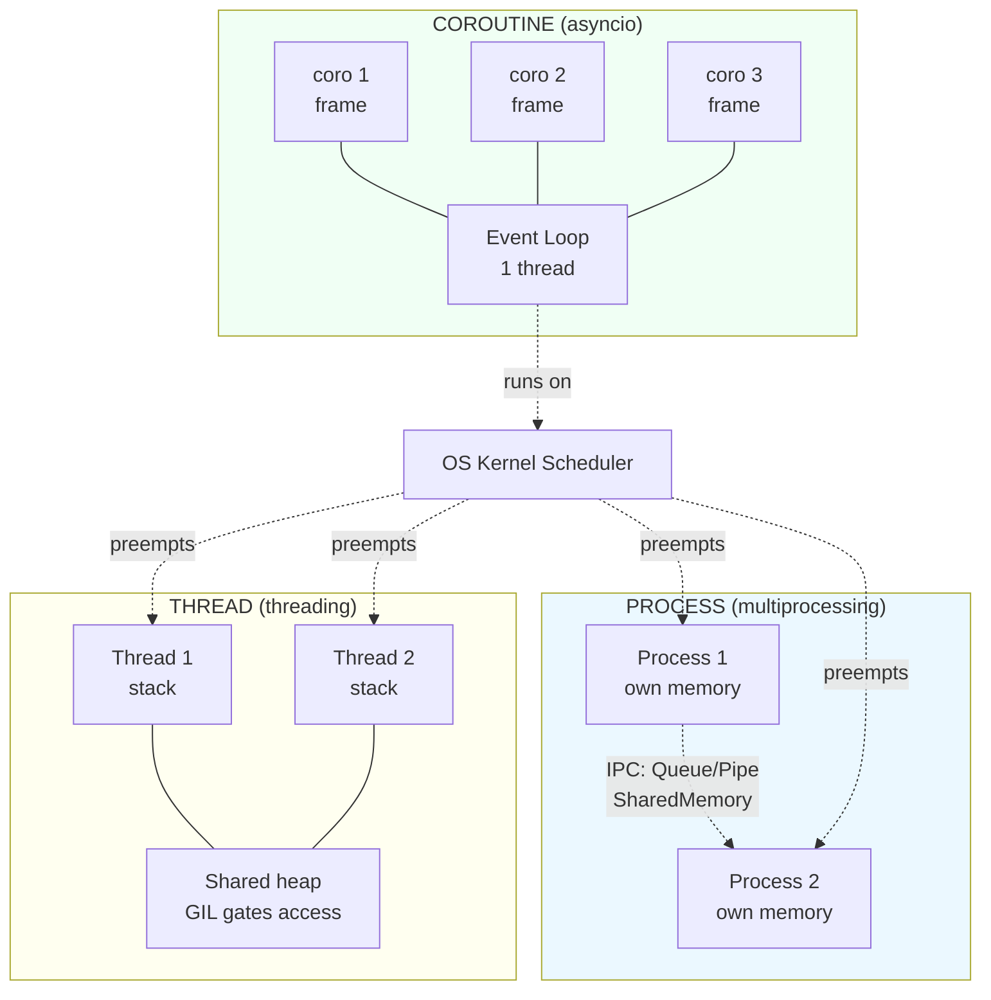
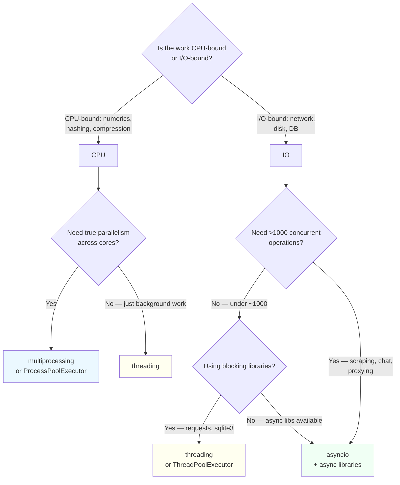

# 1. Processes vs Threads vs Coroutines

> [!note] Why this note exists
> Concurrency in Python is not a single tool — it is a choice between three fundamentally different execution models with different memory models, scheduling policies, and cost profiles. This note is the conceptual foundation for the rest of [[14. Concurrency]]. Before reaching for `threading`, `multiprocessing`, or `asyncio`, you need to know what each one *is*, what it *costs*, and what kind of workload it is *for*. Subsequent notes — [[2. threading Module]], [[3. multiprocessing Module]], [[4. asyncio Basics]], [[5. async-await]], [[6. The GIL]], [[7. Concurrent Futures]], and [[8. Synchronization Primitives]] — assume you have internalized this comparison.

## Why It Matters

Pick the wrong concurrency model and you will pay for it in one of three ways:

1. **No speedup at all.** You spawn 16 threads for a CPU-bound task and watch CPU stay at 100% on a single core while the other 15 sit idle. The [[6. The GIL|GIL]] is laughing at you.
2. **A program that *slows down* when parallelized.** You launch 64 processes for a tiny computation, and process startup overhead dwarfs the work. Wall-clock time goes up, not down.
3. **A program that *hangs* under load.** You spawn a thread per request, hit 10 000 concurrent connections, and the OS thrashes on context switches while the GC pauses the world.

The right answer is workload-driven:

- **CPU-bound work** (numerics, image processing, compression, hashing) → **processes**. The GIL prevents Python threads from using more than one core; processes bypass this because each has its own interpreter and its own GIL.
- **I/O-bound work** (HTTP calls, database queries, disk reads) → **threads or coroutines**. Both release the GIL while waiting on I/O, so they actually overlap. Coroutines scale further because they cost kilobytes, not megabytes.
- **Massive I/O concurrency** (10 000+ sockets, chat servers, scrapers) → **coroutines**. Threads top out somewhere between hundreds and low thousands on most machines; coroutines comfortably reach tens of thousands.

This note explains the *why* behind each rule.

## Background

### Three axes of comparison

Every concurrency primitive sits at a point in a three-dimensional space:

| Axis            | Question                                                        |
|-----------------|-----------------------------------------------------------------|
| **Memory model** | Do workers share address space, or is memory copied?           |
| **Scheduler**    | Who decides when a worker runs — the OS kernel, or the program? |
| **Creation cost** | How expensive is it to make one more worker?                    |

The three models differ sharply on every axis.

### Process

A **process** is an OS-level abstraction: an instance of a running program with its own address space, file descriptor table, and security context. The kernel scheduler gives each process a time slice on a CPU core. When the slice expires, the kernel context-switches to another process — saving and restoring all registers, the MMU page table pointer, and (often) flushing TLBs.

Creation cost: high. Forking on Linux copies page tables (copy-on-write helps but the bookkeeping is real); `spawn` on Windows/Windows-macOS re-imports the entire interpreter. A bare `multiprocessing.Process` takes ~30–100 ms to start.

Memory model: **isolated**. Two processes cannot see each other's variables. They communicate via IPC (pipes, queues, shared memory segments) — every byte must be explicitly serialized or mapped.

### Thread

A **thread** is a unit of execution *inside* a process. All threads in a process share the same address space, the same heap, the same file descriptors. Each thread has its own stack (typically 8 MB on Linux, 1 MB on Windows) and its own register state, but everything else is shared.

The kernel still schedules threads preemptively. A thread can be interrupted at (almost) any instruction and another thread swapped in — this is what makes data races possible.

Creation cost: medium. A thread is cheaper than a process (no page-table copy), but still costs ~50 KB of stack reservation plus a kernel `task_struct`. Thousands of threads will exhaust memory or hit OS limits (`ulimit -u`, `Max processes`).

### Coroutine

A **coroutine** is a function that can suspend itself and later be resumed, *without* involving the kernel. In Python, `async def` defines a coroutine; `await` is the suspension point. The **event loop** (a userspace scheduler) decides which coroutine runs next, switching only at `await` points — so-called **cooperative** multitasking.

A coroutine has no kernel-visible thread of its own; it runs on whichever thread is executing the event loop. Its state lives on the heap (a small frame object), so creating a coroutine costs a few hundred bytes to a few kilobytes. A modern machine can hold 100 000+ idle coroutines.

Creation cost: very low. You can `asyncio.create_task(...)` hundreds of thousands of times per second.

### Python's three concurrency modules

Python's standard library maps directly onto the three models:

| Model      | Module                  | Top-level API                          |
|------------|-------------------------|----------------------------------------|
| Process    | `multiprocessing`       | `Process`, `Pool`, `Queue`             |
| Thread     | `threading`             | `Thread`, `Lock`, `local`              |
| Coroutine  | `asyncio`               | `run`, `create_task`, `gather`         |

The high-level `concurrent.futures` module ([[7. Concurrent Futures]]) wraps both threads and processes behind a single `Executor` interface.

## Main content

### Side-by-side comparison

| Property                     | Process                          | Thread                          | Coroutine                              |
|------------------------------|----------------------------------|---------------------------------|----------------------------------------|
| Address space                | Separate                         | Shared with siblings            | Shared (runs on the event-loop thread) |
| Scheduler                    | Kernel, preemptive               | Kernel, preemptive              | Event loop, cooperative                |
| Creation cost                | ~30–100 ms                       | ~50–100 KB stack                | ~1–10 KB                               |
| Context switch cost          | High (page table + TLB)          | Medium (registers + stack)      | Very low (register save in interpreter) |
| Communication                | IPC (pipes, queues, shared mem)  | Direct memory access            | Direct memory access                   |
| Synchronization needed?      | Only for shared resources        | Yes, almost always              | Only across `await` points             |
| Preemptible mid-statement?   | Yes                              | Yes                             | No — only at `await`                   |
| Bypasses the GIL?            | Yes                              | No                              | No                                     |
| Scales to                    | Tens–hundreds                    | Hundreds–thousands              | Tens of thousands+                     |
| Best for                     | CPU-bound work                   | Legacy blocking I/O             | Massive I/O concurrency                |
| Failure isolation            | High (crash kills only process)  | Low (crash kills process)       | Low (crash kills loop)                 |

### Visual comparison



### Memory model: the source of all joy and pain

The shared-vs-isolated distinction drives everything else.

**Shared memory (threads, coroutines)** is fast — you can pass a 1 GB `numpy` array between threads by reference, no copy. But it is also the source of **data races**: two threads writing to the same dict at the same time can corrupt it. Every shared mutable resource needs a lock (see [[8. Synchronization Primitives]]).

Coroutines share memory too — but because the event loop never switches except at `await`, a coroutine that does `d["x"] += 1` between two `await`s is *atomic from the loop's perspective*. No lock needed. This is the single most underappreciated property of asyncio: **coroutines are easier to reason about than threads**, because the interleaving points are explicit (every `await`).

**Isolated memory (processes)** is safe — a crash in one process cannot corrupt another's state. But sharing data is painful: you must serialize (pickle) anything crossing the boundary, which means no live objects, no lambdas, no open sockets. The `multiprocessing.Manager` proxy and `SharedMemory` module ([[3. multiprocessing Module]]) exist to soften this, but they always cost something.

### Scheduling: preemptive vs cooperative

Preemptive scheduling (processes, threads) means the kernel can interrupt you at *any* machine instruction. This is great for fairness — a stuck thread can't freeze the system — but terrible for correctness, because every multi-statement operation on shared state needs explicit locking.

Cooperative scheduling (coroutines) means a coroutine runs until it explicitly yields (via `await`). This is great for correctness — code between two `await`s is atomic — but terrible for fairness: a coroutine that forgets to `await` will freeze the entire event loop. A single `while True: pass` in an asyncio program blocks every other coroutine forever.

> [!warning] Cooperative does not mean concurrent
> A coroutine that calls `time.sleep(10)` instead of `await asyncio.sleep(10)` blocks the whole event loop for 10 seconds. Every other coroutine — including the one serving your health check — is frozen. Cooperative scheduling demands cooperative code.

### Cost model

These numbers are rough but representative of CPython on Linux:

| Operation                    | Approx cost   |
|------------------------------|---------------|
| `fork()` on Linux            | ~1 ms         |
| `multiprocessing.Process()`  | 30–100 ms     |
| `threading.Thread()`         | ~50 µs        |
| `asyncio.create_task()`      | ~1 µs         |
| OS thread context switch     | ~5 µs         |
| asyncio task switch          | ~0.1 µs       |

The ratio matters more than the absolute numbers: processes are ~1000× more expensive to create than coroutines, and thread switches are ~50× more expensive than coroutine switches. This is why coroutines scale to 100 000 concurrent connections and processes don't.

### The decision tree



### Python-specific: the GIL is the elephant

In CPython (the implementation almost everyone uses), the **Global Interpreter Lock** ([[6. The GIL]]) is a mutex that allows only one thread at a time to execute Python bytecode. This means:

- CPU-bound Python threads do **not** speed up. Two threads running `math.factorial` will run at the speed of one, minus the context-switch overhead. They will often run *slower* than a single thread.
- I/O-bound Python threads **do** speed up, because the GIL is released during blocking I/O calls. While one thread waits for a socket, another can run.
- C extensions that release the GIL (NumPy, PyTorch, native crypto) get real parallelism *within* the extension call, even though they are using threads.

This single fact inverts the usual advice: in most languages you'd reach for threads for CPU work and processes for isolation; in CPython you reach for **processes** for CPU work and **threads or coroutines** for I/O work.

> [!tip] PEP 703 is changing this
> CPython 3.13 ships an experimental **free-threaded** build (no GIL). If it matures, the rules in this section will eventually change. For now (3.12 and earlier, plus the default 3.13 build), assume the GIL is in effect. See [[6. The GIL]] for details.

## Code examples

### Same task, three ways

A trivial "CPU + I/O" workload: download N URLs (I/O) and hash each response (CPU). Each version uses 8 workers.

```python
# threads.py — I/O is parallel; hashing is serialized by the GIL
import threading, hashlib, urllib.request, time

URLS = ["https://example.com"] * 50

def worker(url):
    data = urllib.request.urlopen(url).read()
    return hashlib.sha256(data).hexdigest()

def main():
    threads = [threading.Thread(target=worker, args=(u,)) for u in URLS]
    for t in threads: t.start()
    for t in threads: t.join()

main()
```

```python
# processes.py — both I/O and hashing are truly parallel
import multiprocessing, hashlib, urllib.request

URLS = ["https://example.com"] * 50

def worker(url):
    data = urllib.request.urlopen(url).read()
    return hashlib.sha256(data).hexdigest()

if __name__ == "__main__":
    with multiprocessing.Pool(8) as pool:
        pool.map(worker, URLS)
```

```python
# asyncio.py — I/O is concurrent; hashing is on one thread (fine, it's fast)
import asyncio, hashlib, aiohttp

URLS = ["https://example.com"] * 50

async def worker(session, url):
    async with session.get(url) as resp:
        data = await resp.read()
        return hashlib.sha256(data).hexdigest()

async def main():
    async with aiohttp.ClientSession() as session:
        await asyncio.gather(*(worker(session, u) for u in URLS))

asyncio.run(main())
```

**Expected wall-clock** on a typical machine:

| Approach        | Time    | Why                                            |
|-----------------|---------|------------------------------------------------|
| `threading`     | ~1.0 s  | GIL releases on socket read, so I/O overlaps   |
| `multiprocessing` | ~0.4 s | True parallelism; 8 processes hammering cores |
| `asyncio`       | ~0.2 s  | One process, one thread, near-zero switching   |

The asyncio version wins because the workload is dominated by I/O and the per-task overhead is tiny. The multiprocessing version would win if we replaced "hash 50 KB" with "factorize a 200-digit number" — that's CPU-bound work the GIL would serialize.

### Memory sharing: threads vs processes

```python
# threads share memory by default
import threading

counter = [0]  # mutable container so closures can write

def bump():
    for _ in range(100_000):
        counter[0] += 1   # UNSAFE — race condition

ts = [threading.Thread(target=bump) for _ in range(4)]
for t in ts: t.start()
for t in ts: t.join()
print(counter[0])   # almost never 400_000 — race condition
```

```python
# processes do NOT share memory; you must use a Manager or Value/Array
import multiprocessing as mp

def bump(counter):
    for _ in range(100_000):
        with counter.get_lock():
            counter.value += 1

if __name__ == "__main__":
    counter = mp.Value("i", 0)   # shared signed int with its own lock
    ps = [mp.Process(target=bump, args=(counter,)) for _ in range(4)]
    for p in ps: p.start()
    for p in ps: p.join()
    print(counter.value)   # 400_000 — correct, but slow (lock contention)
```

The threading version is faster but **wrong**; the multiprocessing version is correct but slow. The fix for threads is a `Lock` ([[8. Synchronization Primitives]]); the fix for processes' overhead is `SharedMemory` (3.8+, see [[3. multiprocessing Module]]).

### Coroutines: no race within an await-free block

```python
import asyncio

counter = 0

async def bump():
    global counter
    for _ in range(100_000):
        counter += 1     # safe: no await between read and write
        # If there were an `await` here, this would NOT be safe.

async def main():
    await asyncio.gather(bump(), bump(), bump(), bump())
    print(counter)   # 400_000 — guaranteed, no lock needed

asyncio.run(main())
```

This is the magic of cooperative scheduling: because nothing can interrupt `counter += 1`, it is effectively atomic. The instant you insert an `await` between the read and the write, the magic vanishes and you need an `asyncio.Lock`.

## Common Pitfalls

- **Spawning threads for CPU-bound work.** Classic beginner mistake. Watch CPU usage stay pinned to one core. Use `multiprocessing` instead, or move the hot loop into a C extension that releases the GIL.
- **Spawning processes for tiny tasks.** Process startup is 30–100 ms; if each task takes 5 ms you'll be 20× slower than serial. Batch with `Pool.map`, or use threads.
- **Using asyncio with blocking libraries.** `requests.get(...)` inside an `async def` freezes the event loop. Either wrap with `loop.run_in_executor(None, requests.get, url)`, or use an async-native client like `httpx` or `aiohttp`.
- **Forgetting to `join()` threads in the main thread.** The interpreter waits for non-daemon threads at exit; if one is wedged, your program hangs forever on shutdown. Decide deliberately: daemon (fire-and-forget) or join (wait for completion).
- **Assuming coroutines run in parallel automatically.** `asyncio.gather(coro_a(), coro_b())` only overlaps them at `await` points. If `coro_a` is `while True: pass`, `coro_b` never starts.
- **Sharing a non-thread-safe object across processes via a Manager.** A `Manager.list()` is a *proxy* — every access is a serialized IPC round-trip. Putting 10 000 items into one and iterating takes seconds, not microseconds.
- **Mixing the three in one process without thinking.** A `ThreadPoolExecutor` *inside* an asyncio program, *inside* a `multiprocessing.Pool` worker, is a recipe for fork-related deadlocks (see [[3. multiprocessing Module]] for the "fork + threads" warning).

## Tips and Tricks

- **Profile before parallelizing.** Amdahl's law is unforgiving: if the parallelizable part is 30% of runtime, even infinite parallelism gets you a 1.43× speedup. Spend the hour optimizing the serial 70% first.
- **Match worker count to the bottleneck.** CPU-bound: workers = number of cores (or fewer, if memory-bound). I/O-bound: workers = `min(32, os.cpu_count() + 4)` is the `concurrent.futures` default — a reasonable starting point.
- **Prefer `concurrent.futures` for new code.** It abstracts threads vs processes behind a single API. You can switch `ThreadPoolExecutor` to `ProcessPoolExecutor` by changing one word. See [[7. Concurrent Futures]].
- **Use `asyncio.to_thread` (3.9+) to call blocking code from coroutines.** Cleaner than `run_in_executor` for one-off calls.
- **For mixed CPU + I/O pipelines, compose the models.** Run an asyncio event loop on each process of a `multiprocessing.Pool`; the loop handles I/O concurrency, the pool handles CPU parallelism. This is how production scrapers and ML serving systems are built.
- **Measure context-switch cost with `perf`.** On Linux: `perf stat -e context-switches,cpu-migrations ./your_program`. If switches/sec > 1000/thread, you are oversubscribed.
- **Keep tasks at least 10× their scheduling overhead.** A 10 µs coroutine task is dominated by its 1 µs creation + switch cost. Batch into ~10 ms tasks.

## Active Recall

1. Name the three concurrency models and the standard-library module for each.
2. Which two properties of the GIL determine whether threads speed up a workload?
3. Why can a coroutine safely do `x += 1` without a lock, when a thread cannot?
4. Roughly how much more expensive is creating a `multiprocessing.Process` than an `asyncio.Task`?
5. For a web scraper that fetches 5 000 URLs and parses 100 KB of JSON from each, which model do you pick and why?
6. For a program that resizes 1 000 images on disk, which model do you pick?
7. What does "cooperative scheduling" mean, and what is its single biggest downside?
8. Why is shared memory between processes painful even when `SharedMemory` exists?
9. Two sentences: explain why `asyncio` programs sometimes need `run_in_executor`.
10. What is the relationship between `concurrent.futures` and the three lower-level modules?

<details>
<summary>Reveal answers</summary>

1. Process (`multiprocessing`), thread (`threading`), coroutine (`asyncio`).
2. (a) The GIL is held during Python bytecode execution, so CPU-bound threads serialize. (b) The GIL is released during blocking I/O and inside GIL-releasing C extensions, so those parts overlap.
3. Because the event loop only switches coroutines at `await` points; there is no `await` between the read and the write, so the operation is atomic from the loop's perspective. Threads can be interrupted mid-instruction by the kernel.
4. Roughly 30–100 ms vs ~1 µs — about 30 000–100 000×.
5. Coroutines (`asyncio` + `httpx`/`aiohttp`). The workload is I/O-dominated (5 000 network round-trips) and JSON parsing is fast enough that single-threaded is fine.
6. Processes (`multiprocessing.Pool` or `ProcessPoolExecutor`). Image resizing is CPU-bound and releases the GIL only inside the C call; pure-Python image manipulation would be serialized by the GIL.
7. The scheduler only switches at explicit yield points (`await`). Downside: a coroutine that never awaits starves every other coroutine.
8. Because objects in shared memory still need to be interpreted as Python objects — and Python objects contain pointers into per-interpreter heaps. You typically share raw bytes (NumPy arrays, `array.array`) and reconstruct the view on each side.
9. To call blocking (sync) code from inside a coroutine without freezing the event loop — the executor runs the blocking call on a thread pool.
10. `concurrent.futures` provides `ThreadPoolExecutor` (wrapping `threading`) and `ProcessPoolExecutor` (wrapping `multiprocessing`) behind a unified `Future`/`submit`/`map` API.
</details>

## Next Steps

- [[2. threading Module]] — the `Thread` class, daemon threads, thread-local storage.
- [[3. multiprocessing Module]] — `Process`, `Pool`, `Queue`, `Manager`, `SharedMemory`.
- [[4. asyncio Basics]] — the event loop, `asyncio.run`, tasks vs coroutines.
- [[5. async-await]] — `async def`, `await`, `gather`, `TaskGroup`.
- [[6. The GIL]] — what the GIL actually is, when it's released, PEP 703.
- [[7. Concurrent Futures]] — the high-level executor API.
- [[8. Synchronization Primitives]] — `Lock`, `RLock`, `Semaphore`, `Event`, `Condition`, `Barrier` — and their asyncio equivalents.
