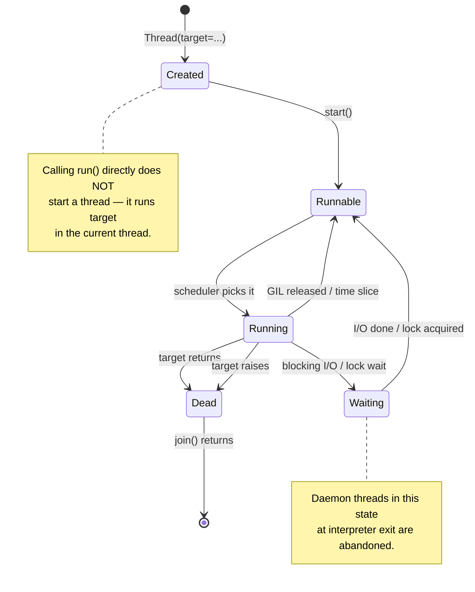
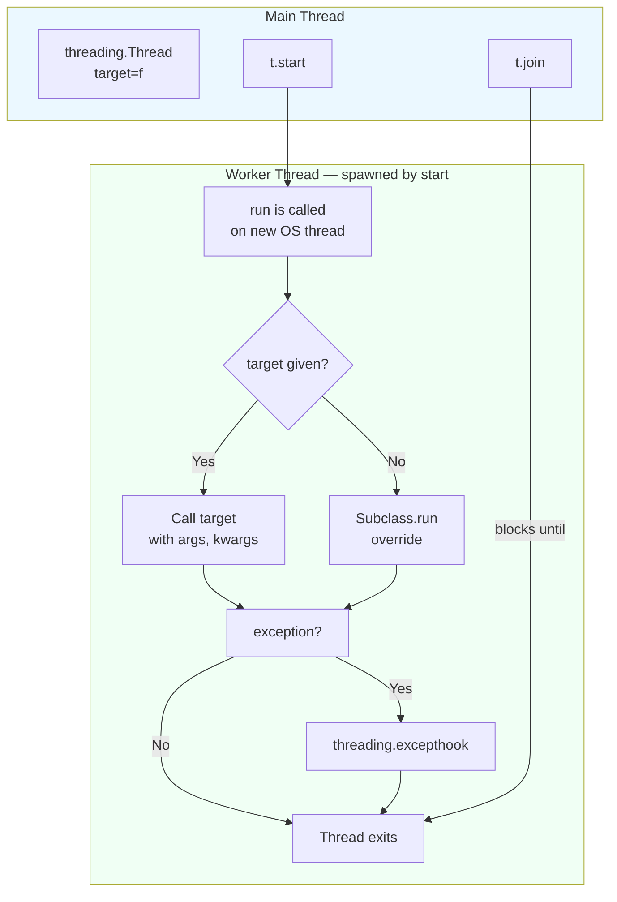

# 2. threading Module

> [!note] Why this note exists
> This is the practitioner's reference for the `threading` module: how to spawn a thread, how to wait for it, how to make it a daemon, how to give it private state with `threading.local()`, and how to inspect what threads are running. It assumes you already understand the conceptual difference between processes, threads, and coroutines ([[1. Processes vs Threads vs Coroutines]]) and that you understand *why* threads in CPython do not parallelize CPU-bound work ([[6. The GIL]]). What this note does *not* cover in depth is synchronization — that has its own note, [[8. Synchronization Primitives]], because `Lock`, `RLock`, `Semaphore`, `Event`, `Condition`, and `Barrier` deserve a full treatment. After this note, you should be able to write a correct threaded Python program; for higher-level patterns you will graduate to `concurrent.futures.ThreadPoolExecutor` ([[7. Concurrent Futures]]).

## Why It Matters

`threading` is the lowest-level, most flexible, and most dangerous concurrency tool in the standard library. You reach for it when:

- **You need to call blocking I/O libraries that have no async equivalent.** `requests`, `psycopg2`, `pymongo`, `sqlite3`, `paramiko`, most C bindings. Wrapping each call in a thread is often the right move; rewriting the whole app in asyncio is sometimes too expensive.
- **You need to overlap I/O with a small amount of CPU work** and the program is too small to justify `multiprocessing`.
- **You are integrating with a C extension that releases the GIL** (NumPy, PyTorch, native crypto) and you want true parallelism within those calls.
- **You are maintaining a legacy `threading`-based codebase** and need to fix bugs without rewriting it.

You should *not* reach for `threading` when:

- The work is CPU-bound Python. The GIL will serialize it; use `multiprocessing`.
- You need thousands of concurrent operations. Threads cost ~1 MB stack each on Windows; 2 000 of them is 2 GB just for stacks. Use `asyncio`.
- You can use `concurrent.futures.ThreadPoolExecutor` instead — it gives you the same thing with a cleaner API and a managed worker pool. See [[7. Concurrent Futures]].

## Background

### What a Python thread actually is

When you call `threading.Thread(...)`, Python asks the OS to create a native kernel thread (pthread on Linux/macOS, Windows thread on Windows). That thread executes the C function `t_bootstrap`, which calls your `target` function. When `target` returns (or raises), the thread exits.

The Python-level `Thread` object is just a *handle* to that native thread. It exposes methods to `start`, `join`, query `is_alive`, read `name` and `ident`, and set `daemon`. The native thread itself is invisible to your Python code.

### The GIL is always in play

Every Python thread holds the GIL whenever it is executing Python bytecode. The interpreter releases the GIL:

- Every ~5 ms (configurable via `sys.setswitchinterval`) — to give other threads a chance to run.
- Whenever a thread makes a blocking I/O call (socket read, file read, `time.sleep`).
- Whenever a C extension explicitly calls `Py_BEGIN_ALLOW_THREADS` (NumPy, hashlib, sqlite3 do this).

This is why I/O-bound threaded programs speed up: while thread A waits on a socket, the GIL is free and thread B runs. See [[6. The GIL]] for the gory details.

### Daemon vs non-daemon

A **non-daemon** thread (the default) keeps the process alive until it finishes. If `main()` returns but a non-daemon thread is still running, the interpreter waits for it before exiting.

A **daemon** thread is treated as expendable. When the only remaining threads are daemons, the interpreter exits *immediately*, abandoning them mid-statement. Daemon threads are for "fire and forget" work — logging, telemetry, background janitors — where leaving the work half-done is acceptable.

> [!warning] Daemon threads can corrupt state on exit
> If a daemon thread is in the middle of writing to a file or updating a database when the interpreter exits, that write may be partial. Never use a daemon thread for work that must complete.

### Thread lifecycle



## Main content

### The `Thread` class — constructor

```python
class threading.Thread(
    group=None,        # reserved, always None
    target=None,       # callable to run
    name=None,         # thread name (defaults "Thread-N")
    args=(),           # positional args for target
    kwargs=None,       # keyword args for target
    *,
    daemon=None,       # if None, inherits creating thread's daemon flag
)
```

The `target/args/kwargs` pattern is the most common way to use `Thread`:

```python
import threading

def fetch(url, *, timeout=10):
    ...

t = threading.Thread(target=fetch, args=("https://example.com",), kwargs={"timeout": 5})
t.start()
t.join()
```

You can also subclass `Thread` and override `run()`:

```python
class FetchThread(threading.Thread):
    def __init__(self, url):
        super().__init__()
        self.url = url
        self.result = None

    def run(self):
        self.result = fetch(self.url)

t = FetchThread("https://example.com")
t.start()
t.join()
print(t.result)
```

Subclassing is idiomatic when each thread carries a lot of state; the `target` pattern is idiomatic for fire-and-forget functions. Avoid subclassing just to override `__init__` — usually a closure is cleaner.

### `start()` vs `run()` — the single most common beginner mistake

```python
t = threading.Thread(target=fetch, args=(url,))
t.run()      # WRONG — runs fetch() in the CURRENT thread, synchronously
t.start()    # RIGHT — spawns a new OS thread that calls run() → target()
```

`run()` is the method `start()` calls *on the new thread*. Calling `run()` directly does not spawn anything; it just calls your function. Many race-condition "mysteries" trace back to this typo.

### `join(timeout=None)`

`join()` blocks the calling thread until the target thread finishes. With a `timeout`, it returns after the timeout even if the thread is still running — but it does *not* kill the thread. Python has no `Thread.kill()`. If you need cancellation, you must implement it cooperatively with a flag or `Event` (see [[8. Synchronization Primitives]]).

```python
t.start()
t.join(timeout=5)
if t.is_alive():
    print("still running after 5s — cannot kill, will leak")
```

### Daemon threads

```python
t = threading.Thread(target=heartbeat, daemon=True)
t.start()
# main thread exits → interpreter exits → heartbeat thread is abandoned
```

Or set after construction (before `start()`):

```python
t = threading.Thread(target=heartbeat)
t.daemon = True       # or t.setDaemon(True) — deprecated alias
t.start()
```

In Python 3.10+, `setDaemon`/`isDaemon` are deprecated in favor of the `daemon` property. Use the constructor argument when possible.

### Introspection

```python
import threading

threading.current_thread()        # the Thread object for the calling thread
threading.main_thread()           # the main thread's Thread object
threading.get_ident()             # thread ID (int) of calling thread
threading.active_count()          # number of Thread objects currently alive
threading.enumerate()             # list of all alive Thread objects
                                  # (excludes terminated and not-yet-started)
```

`threading.get_ident()` is the right key for thread-local dictionaries because the integer ID is stable for the lifetime of the thread and unique across the process.

### `threading.local()` — thread-local storage

A `threading.local()` instance has independent attribute values *per thread*. Each thread sees only what it set itself.

```python
import threading, random, time

db_conn = threading.local()

def worker():
    db_conn.value = f"connection-for-{threading.current_thread().name}"
    time.sleep(random.random())
    # Each thread reads back its OWN value, never another thread's.
    print(threading.current_thread().name, "→", db_conn.value)

threads = [threading.Thread(target=worker, name=f"W{i}") for i in range(3)]
for t in threads: t.start()
for t in threads: t.join()
```

This is the right pattern for resources that are *not* thread-safe and would be wasteful to share — database connections are the canonical example. Each thread gets its own connection, used only by itself.

A subtle but important property: thread-local storage is inherited at thread *creation* time, but values set on the parent are not visible to the child. Each thread starts with a fresh, empty `local()`. (Inheritance across `fork` is a separate, messy topic — see [[3. multiprocessing Module]].)

### `threading.excepthook` — handling exceptions in threads

When a thread's `target` raises an exception, by default Python prints a traceback to stderr and the thread dies. The other threads — and the main thread — are *not* notified. There is no `try/except` you can wrap around `t.start()` that will catch the exception.

Override `threading.excepthook` to customize this:

```python
import threading

def on_thread_exc(args):
    print(f"Thread {args.thread.name} crashed: {args.exc_value!r}")
    # Could push to a queue, set a flag, force process exit, etc.

threading.excepthook = on_thread_exc

def boom():
    raise ValueError("kaboom")

threading.Thread(target=boom, name="crasher").start()
```

In 3.8+, the hook receives a `threading.ExceptHookArgs` namedtuple with `exc_type`, `exc_value`, `exc_traceback`, and `thread`. The default hook prints a traceback and returns; if you re-raise inside the hook, you'll get a different (and confusing) traceback.

### `Thread.__init_subclass__` and `__class_getitem__` — ignore these

You will occasionally see these in `dir(threading.Thread)`. They are not part of the threading API; they come from `object`. Ignore them.

### The whole module in one diagram



## Code examples

### Example 1: parallel URL fetching with a result queue

```python
import threading, queue, urllib.request, time

URLS = [
    "https://example.com", "https://python.org", "https://www.python.org/dev/peps/",
    "https://docs.python.org/3/", "https://pypi.org",
]

def fetch(url, out_queue):
    with urllib.request.urlopen(url, timeout=10) as r:
        out_queue.put((url, len(r.read())))

results = queue.Queue()
threads = [threading.Thread(target=fetch, args=(u, results)) for u in URLS]
t0 = time.perf_counter()
for t in threads: t.start()
for t in threads: t.join()
elapsed = time.perf_counter() - t0

while not results.empty():
    print(results.get())
print(f"Done in {elapsed:.2f}s")
```

This is the textbook pattern: a fixed-size worker pool (here, one thread per URL), and a `queue.Queue` to collect results because `Queue` is thread-safe ([[8. Synchronization Primitives]]).

### Example 2: per-thread database connections

```python
import threading, sqlite3, time

_local = threading.local()

def get_conn():
    if not hasattr(_local, "conn"):
        # Each thread gets its own connection — sqlite3 connections are
        # NOT thread-safe by default (check_same_thread=True).
        _local.conn = sqlite3.connect("app.db")
    return _local.conn

def write_row(i):
    conn = get_conn()
    conn.execute("INSERT INTO log VALUES (?)", (i,))
    conn.commit()

threads = [threading.Thread(target=write_row, args=(i,)) for i in range(10)]
for t in threads: t.start()
for t in threads: t.join()
```

Without thread-local storage, every thread would either share a single connection (race condition) or open and close a connection per call (slow). With `local()`, each thread opens exactly one connection for its lifetime.

### Example 3: a reusable `StoppableWorker` pattern

```python
import threading, time

class StoppableWorker(threading.Thread):
    def __init__(self, target, *, poll=0.1):
        super().__init__(daemon=True)
        self._target = target
        self._stop = threading.Event()
        self._poll = poll

    def stop(self):
        self._stop.set()

    def stopped(self):
        return self._stop.is_set()

    def run(self):
        while not self._stop.is_set():
            self._target(self)
            time.sleep(self._poll)   # cooperative yield

def heartbeat(worker):
    print("tick", threading.current_thread().name)

w = StoppableWorker(heartbeat)
w.start()
time.sleep(0.5)
w.stop()
w.join(timeout=2)
print("stopped cleanly?", not w.is_alive())
```

This is the standard cooperative-shutdown pattern: an `Event` shared between boss and worker; the worker checks it in its loop. There is no `Thread.kill()` in Python — cancellation must be cooperative.

### Example 4: `threading.Timer` — fire-and-forget delayed call

```python
import threading

def remind():
    print("5 seconds have passed!")

t = threading.Timer(5.0, remind)
t.start()    # returns immediately; remind() runs in 5s
# t.cancel() before 5s elapses to abort
```

`Timer` is a `Thread` subclass that sleeps, then calls the target. Useful for timeouts and debouncing. For real scheduling use the `sched` module or a third-party library.

### Example 5: barrier-style fan-out / fan-in

```python
import threading

def phase(label, n, barrier):
    print(f"{label}: starting phase on {n} threads")
    barrier.wait()
    print(f"{label}: all threads released; continuing")

barrier = threading.Barrier(3)
threads = [threading.Thread(target=phase, args=(f"T{i}", i, barrier)) for i in range(3)]
for t in threads: t.start()
for t in threads: t.join()
```

`Barrier` is one of the less-known but very useful primitives — see [[8. Synchronization Primitives]] for the full treatment.

### Example 6: a thread pool implemented from scratch

Before reaching for `concurrent.futures.ThreadPoolExecutor` (see [[7. Concurrent Futures]]), it is instructive to write a tiny pool by hand. The pattern combines `threading.Thread`, `queue.Queue`, and a sentinel-based shutdown — every piece from this note comes together:

```python
import threading, queue

SENTINEL = object()

class TinyPool:
    def __init__(self, n_workers):
        self._q = queue.Queue()
        self._workers = [
            threading.Thread(target=self._run, name=f"pool-{i}", daemon=True)
            for i in range(n_workers)
        ]
        for w in self._workers:
            w.start()

    def _run(self):
        while True:
            task = self._q.get()
            if task is SENTINEL:
                self._q.task_done()
                return
            func, args, kwargs = task
            try:
                func(*args, **kwargs)
            except Exception:
                # In real code, log via threading.excepthook or a logger
                pass
            finally:
                self._q.task_done()

    def submit(self, func, *args, **kwargs):
        self._q.put((func, args, kwargs))

    def shutdown(self):
        for _ in self._workers:
            self._q.put(SENTINEL)
        for w in self._workers:
            w.join()
        self._q.join()

# Usage:
def work(i):
    print(f"[{threading.current_thread().name}] processing {i}")

pool = TinyPool(4)
for i in range(20):
    pool.submit(work, i)
pool.shutdown()
```

This is essentially what `ThreadPoolExecutor` does internally, with the addition of `Future` objects for result retrieval, exception propagation, and a context manager for shutdown. The point of writing it from scratch once is to demystify the abstraction — when `ThreadPoolExecutor` misbehaves, you'll know exactly what is happening underneath.

## Common Pitfalls

- **Calling `run()` instead of `start()`.** Covered above; the #1 bug for newcomers. Always ask: "did I actually call `start()`?"
- **Forgetting to `join()` non-daemon threads at shutdown.** The interpreter will wait for them, but if one is wedged on a network call with no timeout, your program hangs forever on exit. Always set timeouts on I/O.
- **Sharing a `sqlite3` connection across threads.** By default, sqlite3 raises `ProgrammingError: SQLite objects created in a thread can only be used in that same thread`. Either pass `check_same_thread=False` (and serialize access yourself) or use `threading.local()`.
- **Race conditions on simple counters.** `counter += 1` is read-modify-write; with multiple threads it loses updates. Use a `Lock` or — for atomic counters — `itertools.count` from a single producer, or an `asyncio`-style single-threaded design.
- **Deadlocks from lock ordering.** Thread A holds lock 1 and wants lock 2; thread B holds lock 2 and wants lock 1. Both wait forever. Fix: always acquire locks in the same global order, or use `RLock` for re-entrant acquisition (see [[8. Synchronization Primitives]]).
- **Daemon threads doing critical work.** If a daemon thread is mid-write when the main thread exits, the write is partial. Use a non-daemon thread plus `join()` for anything that must complete.
- **`threading.Thread.__init__` before `super().__init__()` in subclasses.** Subclass fields are not initialized until `super().__init__()` runs; if `run()` somehow accesses them first (e.g., via a subclass `__init__` side effect), you get `AttributeError`. Always call `super().__init__()` first.
- **Forking a multithreaded process.** `os.fork()` only copies the calling thread; locks held by other threads remain locked in the child, with no owner — instant deadlock. This is why `multiprocessing` defaults to `spawn` on macOS/Windows. See [[3. multiprocessing Module]].
- **Swallowing exceptions in threads.** A bare `except:` in `target` will silently eat errors. Use `threading.excepthook` and let it propagate (or at least log).
- **Using `time.sleep` to "wait for the thread to be ready."** That's a race condition wearing a hat. Use an `Event`.

## Tips and Tricks

- **Name your threads.** `Thread(name="fetcher-3")` makes `threading.enumerate()` output and tracebacks far more useful in production. Names appear in `py-spy` and `gdb` too.
- **Use `threading.get_ident()` as the key for ad-hoc thread-local dicts.** It's faster than `current_thread().name` and guaranteed unique for the thread's lifetime.
- **Prefer `queue.Queue` to `Lock` + `list` for producer-consumer.** The queue already has internal locking and a `join()` for waiting until all items are processed. See [[8. Synchronization Primitives]].
- **`sys.setswitchinterval(seconds)`** (default 0.005) controls how often the GIL is released for thread switching. Lower = more responsive but more overhead; higher = faster CPU-bound single thread but laggier I/O threads. Almost never needs changing.
- **`threading.settrace` / `setprofile`** install a global trace/profile function called on every thread. Useful for debuggers and profilers; expensive in production.
- **For one-shot parallelism, use `ThreadPoolExecutor` instead.** It manages the pool, captures exceptions into `Future` objects, and frees you from manual `join()` bookkeeping. See [[7. Concurrent Futures]].
- **`os.cpu_count()`** is *not* the right number of threads for I/O-bound work — you want far more (50–1000). It's the right number for CPU-bound work *if* you're willing to fight the GIL (you usually aren't).
- **`threading.Condition` is the right primitive for "wait until X is true."** Don't poll with `while not ready: time.sleep(0.1)`; use `cond.wait_for(predicate)`.

## Active Recall

1. What's the difference between `Thread.start()` and `Thread.run()`? Which one spawns a new OS thread?
2. Can you kill a running thread? If not, how do you stop one?
3. What's the difference between a daemon thread and a non-daemon thread at interpreter exit?
4. Why does `sqlite3.connect("db")` raise `ProgrammingError` when used from two threads?
5. How does `threading.local()` differ from a plain dict keyed by `current_thread().name`?
6. What does `threading.excepthook` do, and what's the default behavior when a thread raises?
7. `Thread(name="x")` sets the name; how do you read it back from inside the thread?
8. Why is `queue.Queue` preferable to a `Lock`-protected `list` for producer/consumer?
9. What does `sys.setswitchinterval(0.001)` change?
10. When should you subclass `Thread` vs. use `target=`?

<details>
<summary>Reveal answers</summary>

1. `start()` spawns the OS thread and calls `run()` on it; `run()` is just the method that runs `target`. Calling `run()` directly runs the target in the current thread — no new thread is created.
2. No. Cancellation must be cooperative: share a `threading.Event` and have the thread check it in its loop, then call `event.set()` from the boss.
3. Non-daemon: interpreter waits for it at exit. Daemon: interpreter exits immediately, abandoning the thread mid-statement.
4. Because `sqlite3.Connection` defaults to `check_same_thread=True` — connections are not safe to share. Use `threading.local()` to give each thread its own, or pass `check_same_thread=False` (and serialize access yourself).
5. `local()` is keyed by *thread identity*, not by name (which can collide). It is also faster and cleaner — `local().x = 1` is the API, no dict lookups.
6. `threading.excepthook` is called with an `ExceptHookArgs` whenever a thread raises an unhandled exception. The default prints a traceback to stderr; you can override it to log, push to a queue, or force exit.
7. `threading.current_thread().name` (or `.getName()`).
8. `Queue` is already thread-safe, has a built-in `put`/`get` with blocking and timeouts, supports a `join()` for "all items processed," and lets you bound work with `maxsize`.
9. The GIL switch interval — how often the interpreter releases the GIL to give other threads a chance. Lower = more interleaving but more overhead.
10. Subclass when each thread carries substantial state and custom methods (e.g., a `StoppableWorker`). Use `target=` for one-shot function calls and when you don't need to keep state on the thread object.
</details>

## Next Steps

- [[3. multiprocessing Module]] — when threads aren't enough (CPU-bound work).
- [[6. The GIL]] — why Python threads don't speed up CPU work.
- [[7. Concurrent Futures]] — the higher-level `ThreadPoolExecutor`.
- [[8. Synchronization Primitives]] — `Lock`, `RLock`, `Semaphore`, `Event`, `Condition`, `Barrier`, and `queue.Queue`.
- [[1. Processes vs Threads vs Coroutines]] — the conceptual overview this note builds on.
