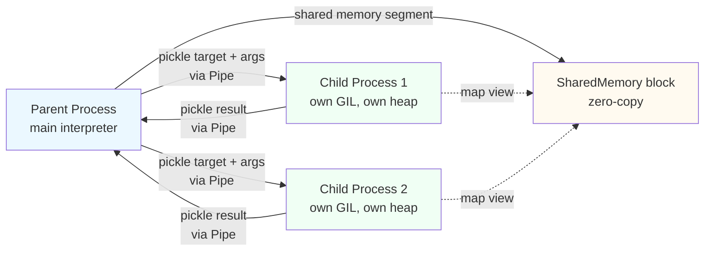
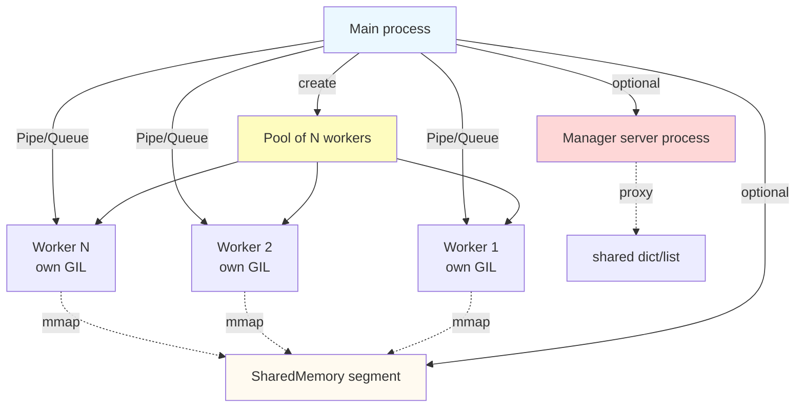

# 3. multiprocessing Module

> [!note] Why this note exists
> `multiprocessing` is the standard-library answer to the [[6. The GIL|GIL]]: instead of fighting it, sidestep it by running each worker in its own interpreter, each with its own GIL. This note covers the `Process` class, `Pool` for parallel `map`, the IPC primitives (`Queue`, `Pipe`), the `Manager` for shared proxy objects, the `SharedMemory` module (3.8+) for zero-copy byte buffers, the **pickling** requirement that constrains everything, and the **fork-vs-spawn** cross-platform issue that causes more bug reports than any other multiprocessing topic. After this note you will know how to parallelize a CPU-bound workload correctly; for the higher-level wrapper, see [[7. Concurrent Futures]] (specifically `ProcessPoolExecutor`).

## Why It Matters

If your workload is CPU-bound and written in pure Python, `threading` will not help you. The GIL serializes bytecode execution; N threads on N cores still run at the speed of one core. `multiprocessing` is the escape hatch: it spawns separate OS processes, each with its own Python interpreter and its own GIL, so they truly run in parallel on multiple cores.

The trade-off is steep:

- **Memory is isolated.** You cannot pass a Python list to another process by reference — you must serialize (pickle) it, send it through a pipe, and unpickle on the other side. For a 1 GB NumPy array this is unacceptable; use `SharedMemory` instead.
- **Startup is expensive.** Each new process re-imports your modules and re-runs module-level code. A `Pool(8)` takes hundreds of milliseconds to start.
- **Debugging is hard.** Tracebacks from child processes don't always reach the parent; pdb doesn't "see" into children; you may need `multiprocessing.log_to_info()` or external tools.
- **Cross-platform differences bite.** Linux defaults to `fork`, macOS (3.8+) and Windows default to `spawn`, and they have radically different semantics. Code that "works on my Linux box" can deadlock on macOS.

You reach for `multiprocessing` when:

- The work is CPU-bound (numerics, hashing, image processing, simulation, ML training loops in pure Python).
- The work per task is large enough to amortize process startup and IPC (typically ≥ 10 ms).
- You need true parallelism across cores.
- You cannot or will not move the hot loop into a C extension that releases the GIL.

## Background

### Process-based parallelism — the mental model

Each `multiprocessing.Process` is a fresh Python interpreter. The parent process pickles the target callable and its arguments, sends them to the child through a pipe, and the child unpickles and calls them. Return values travel the other way, also pickled.



### Start methods: fork, spawn, forkserver

`multiprocessing` supports three start methods, selected via `multiprocessing.set_start_method(...)` or `get_context(...)`:

| Method       | Platform         | How it works                                                                                                                                              | Trade-offs                                                                                                  |
|--------------|------------------|-----------------------------------------------------------------------------------------------------------------------------------------------------------|-------------------------------------------------------------------------------------------------------------|
| `fork`       | POSIX (Linux)    | `os.fork()` copies the parent process. Child inherits all memory (COW), all file descriptors, all running threads (but only the calling thread survives). | Fastest startup. **Inherits state** — globals, open files, even locks held by other threads (deadlock risk). Not on macOS 3.8+. |
| `spawn`      | All              | Launches a fresh Python interpreter; re-imports the parent's module; re-runs no code except module-level; parent pickles `target`+`args` over a pipe.    | Slowest startup. Cleanest semantics — no inherited state. **Required on Windows.** Default on macOS since 3.8. |
| `forkserver` | POSIX            | A dedicated "fork server" process is started at first use; each new worker is forked from it.                                                             | Cleaner than `fork` (no inherited locks), faster than `spawn` after first worker. Useful for long-running apps.        |

The single most important cross-platform rule:

> [!warning] Always guard entry points with `if __name__ == "__main__":`
> With `spawn`, the parent's module is re-imported in each child. If you have `Process(...).start()` at module top level, every child will start its own children — an exponential fork bomb. The `if __name__ == "__main__":` guard prevents this.

### The pickling requirement

Everything that crosses a process boundary — the `target`, the `args`, the return value, anything put into a `Queue` — must be picklable. The main things that are *not* picklable:

- **Lambdas and most closures.** Pickle serializes by qualified name, not by bytecode.
- **Generator objects** and `async` coroutines.
- **Open file handles**, sockets, database connections.
- **Thread locks** (`Lock`, `RLock`, etc.) — except via `multiprocessing.Lock`, which is a special IPC-aware variant.
- **Most objects whose class is defined inside a function** (rather than at module top level).
- **`boto3` clients, `requests.Session` objects, anything wrapping a C pointer.**

The fix is almost always to define callables and their classes at module top level, and to pass primitive arguments (paths, URLs, configuration dicts) instead of live objects.

## Main content

### `Process` — the low-level primitive

`multiprocessing.Process` mirrors `threading.Thread`:

```python
import multiprocessing as mp

def worker(name, count):
    print(f"[{name}] counting to {count}")
    for i in range(count):
        pass

if __name__ == "__main__":
    p = mp.Process(target=worker, args=("alpha", 1_000_000), name="alpha-worker")
    p.start()
    p.join(timeout=10)
    print("exit code:", p.exitcode)   # 0 = ok, nonzero = crash, None = still running
```

Key differences from `Thread`:

- `p.exitcode` is `None` while running, `0` on normal exit, positive (`-N`) if killed by signal `N`, `1` if it raised an exception.
- `p.pid` gives the OS process ID.
- There is no `daemon` distinction at the OS level the way there is for threads — but `multiprocessing.Process.daemon=True` means the parent will not wait for it at exit (and the child cannot spawn its own children).

### `Pool` — parallel `map`

For almost all real workloads you want a `Pool` of N workers, not a single `Process`:

```python
import multiprocessing as mp

def square(x):
    return x * x

if __name__ == "__main__":
    with mp.Pool(processes=4) as pool:
        # blocking, ordered:
        result = pool.map(square, range(20))
        # chunked for less IPC overhead:
        result = pool.map(square, range(20), chunksize=4)
        # lazy/streaming:
        for r in pool.imap(square, range(20), chunksize=4):
            print(r)
        # unordered streaming (results as they finish):
        for r in pool.imap_unordered(square, range(20)):
            print(r)
        # async with callback:
        pool.map_async(square, range(20), callback=print)
```

`chunksize` matters: each chunk requires one IPC round-trip, so for 10 000 tiny tasks, `chunksize=1` is 10× slower than `chunksize=100`. A common heuristic: `chunksize = max(1, len(items) // (4 * pool_size))`.

`Pool` itself can be used as a context manager (3.3+) — `with` calls `terminate()` on exit. Use `pool.close()` + `pool.join()` if you want graceful shutdown instead.

### `Queue` and `Pipe` — IPC primitives

```python
import multiprocessing as mp

def producer(q):
    for i in range(5):
        q.put(i)
    q.put(None)   # sentinel

def consumer(q):
    while True:
        item = q.get()
        if item is None:
            break
        print("got", item)

if __name__ == "__main__":
    q = mp.Queue(maxsize=10)
    p1 = mp.Process(target=producer, args=(q,))
    p2 = mp.Process(target=consumer, args=(q,))
    p1.start(); p2.start()
    p1.join(); p2.join()
```

`multiprocessing.Queue` is *not* the same as `queue.Queue` — the former uses a pipe + background feeder thread to cross process boundaries, while the latter is in-process only. The multiprocessing version is picklable and can be passed as an argument to a child process.

`Pipe()` returns a pair `(conn_a, conn_b)` for two-way point-to-point communication:

```python
parent_conn, child_conn = mp.Pipe()
p = mp.Process(target=worker, args=(child_conn,))
p.start()
print(parent_conn.recv())   # blocks until child sends
p.join()
```

`Pipe` is faster than `Queue` for 1:1 communication, but `Queue` is safer for many-to-many (multiple readers/writers).

> [!warning] `Queue.put` before `Process.start` can deadlock
> If you put large objects in a `Queue` and then start the consumer process, the parent's feeder thread can block on a full pipe before the child is started. Always `start()` consumers before `put()`-ing large items, or use `maxsize` and a non-blocking put.

### `Manager` — shared proxy objects

`multiprocessing.Manager()` starts a server process that holds Python objects and exposes them to other processes via *proxies*. Each proxy access is an IPC round-trip.

```python
import multiprocessing as mp

def worker(d, key, val):
    d[key] = val           # IPC call to manager
    print(d.get(key))       # another IPC call

if __name__ == "__main__":
    with mp.Manager() as mgr:
        shared_dict = mgr.dict()
        shared_list = mgr.list()
        ps = [mp.Process(target=worker, args=(shared_dict, f"k{i}", i)) for i in range(4)]
        for p in ps: p.start()
        for p in ps: p.join()
        print("final:", dict(shared_dict))
```

`Manager` is great for *sparse* shared state — a few dict keys here and there. It is terrible for *dense* shared state (10 000 list elements), because every operation is a serialized RPC. For dense data, use `SharedMemory`.

### `Value`, `Array` — shared C-typed memory

`multiprocessing.Value(typecode, initial)` and `multiprocessing.Array(typecode, size)` allocate a shared C-typed slot backed by shared memory (or a `mmap`), with a built-in lock:

```python
import multiprocessing as mp

def increment(counter):
    with counter.get_lock():   # explicit lock acquisition
        counter.value += 1

if __name__ == "__main__":
    counter = mp.Value("i", 0)
    ps = [mp.Process(target=increment, args=(counter,)) for _ in range(8)]
    for p in ps: p.start()
    for p in ps: p.join()
    print(counter.value)   # 8000 (correct)
```

This is *much* faster than a `Manager` for a single counter or array — there is no RPC. The downside is the values must be C primitives (`'i'` int, `'d'` double, `'f'` float, `'c'` char, etc.).

### `SharedMemory` (Python 3.8+) — zero-copy bytes

`multiprocessing.shared_memory.SharedMemory` lets you allocate a named byte buffer that multiple processes can `mmap` directly. No pickling, no copying.

```python
from multiprocessing import shared_memory
import numpy as np
import multiprocessing as mp

def worker(shm_name, shape, dtype):
    shm = shared_memory.SharedMemory(name=shm_name)
    arr = np.ndarray(shape, dtype=dtype, buffer=shm.buf)
    arr[:] = arr * 2    # in-place modify shared memory
    shm.close()

if __name__ == "__main__":
    arr = np.ones((10_000_000,), dtype=np.float64)
    shm = shared_memory.SharedMemory(create=True, size=arr.nbytes)
    shared = np.ndarray(arr.shape, dtype=arr.dtype, buffer=shm.buf)
    shared[:] = arr      # copy into shared memory

    p = mp.Process(target=worker, args=(shm.name, arr.shape, arr.dtype))
    p.start(); p.join()

    print(shared[:5])    # [2. 2. 2. 2. 2.] — modified by child
    p.join()
    shm.close()
    shm.unlink()         # CRITICAL: free the shared memory segment
```

Key points:

- `shm.close()` only detaches *this process's* view; the segment lives until `shm.unlink()` is called by *some* process. Forget `unlink()` and you leak shared memory across runs.
- The shared buffer is *raw bytes*. You must reconstruct a typed view (NumPy `ndarray`, `array.array`, `struct`) on every process that touches it.
- `SharedMemory.Lock` does not exist — synchronization is your problem. Use a `multiprocessing.Lock` if writes need protecting.

### `multiprocessing.Pool` vs `concurrent.futures.ProcessPoolExecutor`

They do essentially the same thing. `ProcessPoolExecutor` (see [[7. Concurrent Futures]]) has a cleaner API and unifies with `ThreadPoolExecutor`, but `multiprocessing.Pool` has `imap_unordered` and `starmap`, which the executor lacks. For new code, prefer the executor; for code that needs streaming unordered results, use `Pool`.

### Architecture diagram



## Code examples

### Example 1: embarrassingly parallel CPU-bound work

```python
import multiprocessing as mp
import math, time, random

def is_prime(n):
    if n < 2: return False
    for i in range(2, int(math.isqrt(n)) + 1):
        if n % i == 0: return False
    return True

if __name__ == "__main__":
    numbers = [random.randint(10**12, 10**13) for _ in range(200)]
    t0 = time.perf_counter()
    with mp.Pool() as pool:           # defaults to os.cpu_count() workers
        results = pool.map(is_prime, numbers, chunksize=4)
    print(f"{time.perf_counter()-t0:.2f}s, {sum(results)} primes")
```

Expected: roughly `os.cpu_count()`× speedup vs. serial, as long as `is_prime` is the bottleneck and not IPC.

### Example 2: producer/consumer pipeline

```python
import multiprocessing as mp
import time, random

def producer(q, n):
    for i in range(n):
        item = f"item-{i}"
        q.put(item)
        time.sleep(random.random() * 0.01)
    q.put(None)   # sentinel: one per consumer

def consumer(q, wid):
    while True:
        item = q.get()
        if item is None:
            break
        print(f"[worker {wid}] processed {item}")
        time.sleep(random.random() * 0.05)

if __name__ == "__main__":
    q = mp.Queue(maxsize=100)
    producers = [mp.Process(target=producer, args=(q, 20)) for _ in range(2)]
    consumers = [mp.Process(target=consumer, args=(q, i)) for i in range(4)]
    for c in consumers: c.start()
    for p in producers: p.start()
    for p in producers: p.join()
    # one sentinel per consumer:
    for _ in consumers: q.put(None)
    for c in consumers: c.join()
```

The pattern is identical to the threaded version ([[2. threading Module]]), but the queue is `mp.Queue`, not `queue.Queue`.

### Example 3: `starmap` for multi-argument tasks

```python
import multiprocessing as mp

def f(a, b, c):
    return a + b + c

if __name__ == "__main__":
    args = [(1, 2, 3), (4, 5, 6), (7, 8, 9)]
    with mp.Pool() as pool:
        print(pool.starmap(f, args))   # [6, 15, 24]
```

`Pool.map` takes a single iterable of single arguments; `Pool.starmap` unpacks tuples. For more than ~3 args, prefer a single args-dict + `**kwargs` unpacking inside the worker.

### Example 4: per-worker initialization

```python
import multiprocessing as mp

def init_worker(seed):
    import random
    random.seed(seed)
    # Open DB connections, load models, etc. here.

def work(x):
    import random
    return x + random.random()

if __name__ == "__main__":
    with mp.Pool(initializer=init_worker, initargs=(42,)) as pool:
        print(pool.map(work, range(5)))
```

`initializer` runs once per worker at startup — the right place to open expensive resources (DB connections, ML models) so they aren't re-created on every task.

### Example 5: explicit start method

```python
import multiprocessing as mp

if __name__ == "__main__":
    # Force 'spawn' everywhere — safest, most portable, slowest
    ctx = mp.get_context("spawn")
    p = ctx.Process(target=print, args=("hello from child",))
    p.start(); p.join()
```

Using `get_context` (rather than `set_start_method`) is preferable because it doesn't mutate global state and works in libraries.

## Common Pitfalls

- **Missing `if __name__ == "__main__":` guard on Windows / spawn.** Causes infinite fork bombs. Make this the first thing you check when a multiprocessing program hangs at startup on Windows.
- **Lambdas as `target` or arguments.** They aren't picklable. Define a top-level function instead.
- **Passing open files / sockets / DB connections to a child.** They aren't picklable either. Pass paths or connection strings and let the child open them.
- **`fork` + threads = deadlock.** If the parent has any running threads (e.g., a `ThreadPoolExecutor` is alive), `fork` copies the parent's memory but only the calling thread. Any locks held by other threads are still locked in the child — instant deadlock. Python prints a `DeprecationWarning` for this in 3.12+; in 3.14 it will be an error. Use `spawn` or `forkserver`.
- **Forgetting `shm.unlink()`.** Leaks shared memory segments; eventually you exhaust the system limit and `SharedMemory(create=True)` raises `FileExistsError`.
- **Putting large objects in a `Queue` before the consumer starts.** The parent's feeder thread blocks on the pipe; if the consumer hasn't started, deadlock. Always start consumers before `put`.
- **Using `Pool` for tiny tasks.** Each task = one IPC round-trip (~1 ms). 10 000 tasks of 100 µs each = 10 s of overhead vs 1 s of work. Use `chunksize`.
- **Trusting `os.cpu_count()` blindly.** On cgroups-limited containers (Docker, Kubernetes), `os.cpu_count()` returns the *host's* CPU count, not the container's quota. Use `len(os.sched_getaffinity(0))` on Linux.
- **Assuming `Pool.map` errors propagate cleanly.** A worker that raises will cause `map` to raise `Exception` in the parent, but the traceback is often confusing. Use `ProcessPoolExecutor` for better error propagation, or wrap worker bodies in `try/except` and return sentinel error objects.
- **Reading global state in a child assumes `fork`.** With `spawn`, the child re-imports the module — globals are re-initialized. Don't rely on parent-set globals reaching the child.
- **Calling `pool.terminate()` when you need `pool.close()`.** `terminate()` kills workers mid-task; data in flight is lost. `close()` lets the queue drain.

## Tips and Tricks

- **Profile serial first.** Use `cProfile` to confirm the work is CPU-bound and identify the hot functions. If 80% of the time is in NumPy, you might be better off vectorizing than parallelizing.
- **Match `Pool` size to bottleneck.** CPU-bound: `os.cpu_count()`. I/O-bound: more (but you should probably use threads/asyncio). Memory-bound: *fewer* than `cpu_count()` — oversubscribing memory causes swapping.
- **Use `chunksize` aggressively.** For a million 10-µs tasks, `chunksize=1000` is 1000× faster than `chunksize=1`.
- **Prefer `imap_unordered` over `map` when order doesn't matter.** Faster, and you can start processing results as they arrive.
- **`multiprocessing.log_to_info()`** turns on verbose logging of pool lifecycle events — invaluable for debugging hangs.
- **`multiprocessing.set_start_method("spawn", force=True)`** at the top of `__main__` makes your code portable to Windows/macOS for testing on Linux.
- **For NumPy-heavy work, `SharedMemory` is dramatically faster than pickling.** A 1 GB array pickled across a pipe takes seconds; the same array in `SharedMemory` is instant.
- **`mp.current_process().name`** is set to `"PoolWorker-N"` inside pool workers — useful for logging.
- **`sys.setswitchinterval` still applies** — each child process has its own switch interval. Lower it for I/O-bound children, raise it for CPU-bound children.
- **Consider `joblib`, `dask`, or `ray` for more sophisticated patterns** — they handle serialization, retries, and distributed execution beyond what `multiprocessing` offers.

## Active Recall

1. Why does `multiprocessing` give true parallelism while `threading` doesn't?
2. What's the difference between `fork`, `spawn`, and `forkserver`? Which is the default on Windows, on Linux, on macOS?
3. Why must you guard entry points with `if __name__ == "__main__":` when using `spawn`?
4. What kind of objects cannot be pickled, and what's the practical workaround?
5. When would you choose `mp.Queue` over `mp.Pipe`, and vice versa?
6. What does a `Manager` actually do, and why is it slow for large data?
7. How does `SharedMemory` differ from `mp.Value`/`mp.Array`?
8. What happens if you forget `shm.unlink()`?
9. Why does `fork` deadlock when the parent has running threads?
10. How do you set the `chunksize` for `pool.map`, and what's a reasonable heuristic?

<details>
<summary>Reveal answers</summary>

1. Each process has its own Python interpreter and its own GIL, so they execute bytecode truly in parallel on different cores. Threads share one GIL.
2. `fork`: copies parent's memory; default on Linux. `spawn`: launches fresh interpreter, re-imports modules; default on macOS (3.8+) and Windows. `forkserver`: dedicated fork server; POSIX only; cleaner than `fork`.
3. Because `spawn` re-imports the parent's module in every child. Without the guard, the `Process(...).start()` call would execute in the child too, causing each child to spawn its own children — exponential blow-up.
4. Lambdas, closures, generators, open files/sockets, DB connections, locks, objects of locally-defined classes. Workaround: define top-level functions and classes, pass primitives (paths, URLs, config dicts).
5. `Queue` for many-to-many, multi-producer/multi-consumer. `Pipe` for 1:1 (faster, simpler). `Queue` is picklable and can be passed to children.
6. A `Manager` runs a separate "server process" that owns the real objects; worker processes access them via proxies (each access is an IPC round-trip). Slow for large/dense data because every read and write crosses a process boundary.
7. `SharedMemory` is a raw byte buffer mmap'd into multiple processes — zero-copy, no built-in type, no lock. `Value`/`Array` are typed C slots with a built-in lock, allocated via `mmap` too, but smaller and simpler API.
8. The shared memory segment persists until *some* process calls `unlink()`. Leaks accumulate; eventually `SharedMemory(create=True)` raises `FileExistsError` or you hit the system limit.
9. `fork` only copies the calling thread. Locks held by other threads in the parent remain locked in the child, with no owner — the child blocks forever trying to acquire them.
10. `pool.map(fn, iterable, chunksize=N)`. Heuristic: `chunksize = max(1, len(iterable) // (4 * pool_size))`, or larger for tiny tasks.
</details>

## Next Steps

- [[7. Concurrent Futures]] — `ProcessPoolExecutor`, the higher-level wrapper.
- [[8. Synchronization Primitives]] — `multiprocessing.Lock`, `Event`, `Condition`, `Barrier` (analogues of the threading versions, but IPC-aware).
- [[1. Processes vs Threads vs Coroutines]] — when to pick this module over the others.
- [[6. The GIL]] — why you're forced into processes for CPU-bound work in the first place.
