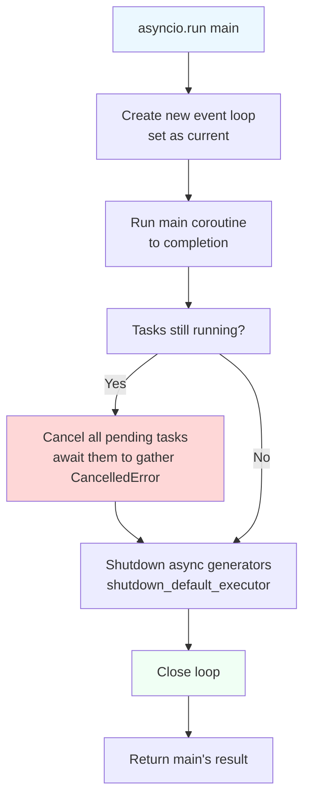
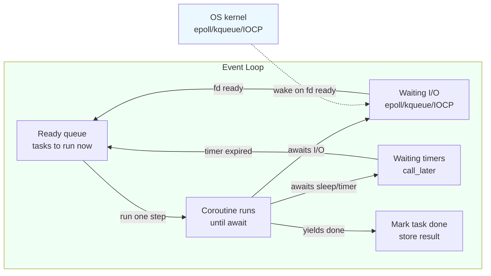

# 4. asyncio Basics

> [!note] Why this note exists
> This note is the conceptual on-ramp to async Python. It covers what an **event loop** is, the difference between a **coroutine** and a **task**, the four entry points (`asyncio.run`, `loop.run_until_complete`, `loop.run_in_executor`, `asyncio.to_thread`), the `gather`/`wait`/`as_completed` fan-out primitives, `asyncio.sleep` and `asyncio.Queue`, and the philosophical question of *why* asyncio exists at all. It deliberately stops short of a deep dive on `async`/`await` syntax — that is [[5. async-await]] — and on the synchronization primitives, which are [[8. Synchronization Primitives]]. After this note you should be able to read an asyncio program and explain what is happening at every line; you will graduate from writing your own from scratch after the next note.

## Why It Matters

A modern web service might need to talk to 10 000 simultaneous clients. Doing that with one thread per client is impossible on most operating systems — 10 000 threads × 1 MB stack = 10 GB of virtual memory before any actual work, and the kernel scheduler thrashes. Doing it with `multiprocessing` is even more hopeless.

Asyncio solves this by collapsing all those waits onto a single thread. The event loop watches thousands of I/O handles via the OS's readiness-notification mechanism (`epoll` on Linux, `kqueue` on macOS/BSD, IOCP on Windows) and runs the right coroutine only when there is something to do. Between I/O events, the CPU is yours to do real work.

The wins:

- **Concurrency at scale.** 10 000+ simultaneous connections on a single core are routine. 100 000 is achievable.
- **Lower memory.** A suspended coroutine costs a few KB; a suspended thread costs at least 64 KB of stack (Linux) and often 1 MB.
- **Lower context-switch cost.** A coroutine switch is ~100 ns; a thread switch is ~5 µs.
- **Easier-to-reason-about code.** Because the loop only switches at `await`, code between two awaits is atomic. No locks needed for shared state mutated within an await-free block.

The costs:

- **Your entire stack must be async.** A single `requests.get(...)` inside a coroutine freezes the loop for the duration of the request. Every library you use must be async-native (`httpx`, `aiohttp`, `aiopg`, `motor`, `asyncpg`, `aiobotocore`).
- **Debugging is harder.** Stack traces cross await points; the call site of a coroutine is not always obvious. Tooling (`aiomonitor`, `aiodebug`) helps but is less mature than for threads.
- **Backpressure is your problem.** If producers outpace consumers, queues grow unboundedly unless you bound them. There is no OS scheduler to thrash and warn you.

## Background

### The event loop, in one paragraph

The event loop is a userspace scheduler. Its job is: (1) maintain a set of **ready** callbacks (coroutines that have something to do), (2) maintain a set of **waiting** I/O handles and timers, (3) when there are no ready callbacks, ask the OS "which of these I/O handles is ready, or which timer has expired?" via `epoll`/`kqueue`/`IOCP`, (4) when the OS answers, schedule the corresponding callbacks. Repeat forever (or until the loop is stopped).

A coroutine that does `await asyncio.sleep(1)` registers a 1-second timer with the loop, then yields control back. The loop runs other coroutines for that second, then re-schedules the sleeper. The CPU was never idle *if* there was other work — and was correctly idle if there wasn't.

### Coroutine vs task vs future — the three-layer model

| Object       | What it is                                                                  | How to make one                                            |
|--------------|-----------------------------------------------------------------------------|------------------------------------------------------------|
| **Coroutine** | The result of calling an `async def` function. Doesn't run until awaited.   | `coro = my_async_func()`                                   |
| **Task**      | A coroutine *scheduled* on the event loop. Runs concurrently with others.   | `task = asyncio.create_task(coro)` (3.7+)                  |
| **Future**    | A low-level "promise" of a future result. Used in library code, rarely directly. | `fut = loop.create_future()`                               |

```python
import asyncio

async def hello():
    await asyncio.sleep(0.1)
    return "hi"

coro = hello()                  # nothing has run yet
task = asyncio.create_task(coro)  # now scheduled on the loop
result = await task              # wait for it, get "hi"
```

The single most common beginner mistake is awaiting a coroutine instead of creating a task. `await coro` runs it to completion before the next line — no concurrency. `task = create_task(coro); await task` schedules it and lets other coroutines interleave.

### Why asyncio is single-threaded

You might expect asyncio to use a thread pool internally for true parallelism. It doesn't, by design. The whole point is *cooperative* scheduling: the loop only switches at `await`, which means a coroutine's local state is safe between awaits. If the loop used multiple threads, every shared mutation would need a lock — and asyncio's value proposition would collapse.

CPU-bound work that would block the loop is punted to a thread or process pool via `loop.run_in_executor` or `asyncio.to_thread` (see [[5. async-await]]).

### The four entry points

```python
# 1. asyncio.run — the standard entry point for whole programs
asyncio.run(main())

# 2. loop.run_until_complete — older, manual; needed when managing the loop yourself
loop = asyncio.new_event_loop()
loop.run_until_complete(main())
loop.close()

# 3. loop.run_in_executor — bridge to sync/blocking code
result = await loop.run_in_executor(None, blocking_function, arg)

# 4. asyncio.to_thread (3.9+) — nicer sugar for run_in_executor(None, ...)
result = await asyncio.to_thread(blocking_function, arg)
```

`asyncio.run` is what you should use. It creates a fresh event loop, runs your coroutine to completion, cancels any remaining tasks, shuts down async generators, and closes the loop. Calling `asyncio.run` inside a running loop is an error.

### `asyncio.run` flow



### The event loop, visually



## Main content

### `asyncio.run(coro, *, debug=False)`

The top-level entry point. Always use this in scripts and application `main()`:

```python
import asyncio

async def main():
    print("hello")
    await asyncio.sleep(1)
    print("world")

asyncio.run(main())
```

Properties:

- Creates a fresh loop, sets it as the current loop for this thread, runs `main()` to completion, then tears down the loop.
- Cancels any tasks that are still pending when `main` returns.
- Shuts down async generators (`agen.aclose()`) — required for clean resource cleanup.
- Sets the `debug` flag if `debug=True` (or `PYTHONASYNCIODEBUG=1`), which enables slow-callback warnings and other diagnostics.

Don't call `asyncio.run` from within a running loop — it raises `RuntimeError: asyncio.run() cannot be called from a running event loop`. Jupyter notebooks run their own loop in the kernel; use `await main()` directly there.

### `asyncio.create_task(coro, *, name=None, context=None)`

Schedules a coroutine on the currently-running loop and returns a `Task` (a `Future` subclass). The task starts running the next time the loop gets control — i.e., at the next `await`.

```python
import asyncio

async def work(n):
    await asyncio.sleep(0.5)
    return n * n

async def main():
    t1 = asyncio.create_task(work(3))
    t2 = asyncio.create_task(work(4))
    # both are now scheduled and running concurrently
    r1, r2 = await t1, await t2
    print(r1, r2)   # 9 16
    # Total time ~0.5s, not 1.0s — they overlapped.

asyncio.run(main())
```

If you don't hold a reference to a task, the loop may garbage-collect it mid-flight and you'll get a "Task was destroyed but it is pending!" warning. Always assign tasks to a variable or a collection.

### `asyncio.gather(*aws, return_exceptions=False)`

Runs multiple awaitables concurrently and returns their results as a list in input order:

```python
results = await asyncio.gather(work(3), work(4), work(5))
# [9, 16, 25]
```

- If `return_exceptions=False` (the default): the first exception cancels all the other awaitables and propagates immediately.
- If `return_exceptions=True`: exceptions are returned as objects in the result list instead of being raised; all awaitables run to completion.

> [!warning] `gather` doesn't cancel siblings on success
> If one task raises and `return_exceptions=False`, `gather` cancels the others — but only since 3.8. In 3.7 and earlier, the siblings kept running. Always check your Python version.

### `asyncio.wait(aws, *, return_when=ALL_COMPLETED, timeout=None)`

Lower-level than `gather`. Returns `(done, pending)` sets of tasks. The `return_when` parameter controls when it returns:

| Constant                | Returns when                                  |
|-------------------------|-----------------------------------------------|
| `ALL_COMPLETED` (default) | All awaitables finish                       |
| `FIRST_COMPLETED`       | Any awaitable finishes                       |
| `FIRST_EXCEPTION`       | Any awaitable raises (or all finish)         |

```python
done, pending = await asyncio.wait(
    [task_a, task_b, task_c],
    return_when=asyncio.FIRST_COMPLETED,
    timeout=5.0,
)
for t in pending:
    t.cancel()   # clean up the rest
```

`asyncio.wait` is the right tool when you need partial results, timeouts, or to cancel losers. For just "run all and get results," prefer `gather`.

### `asyncio.as_completed(aws, *, timeout=None)`

Returns an iterator that yields awaitables in **completion order** (not input order):

```python
import asyncio, random

async def work(i):
    await asyncio.sleep(random.random())
    return i

async def main():
    tasks = [asyncio.create_task(work(i)) for i in range(5)]
    for coro in asyncio.as_completed(tasks):
        result = await coro
        print("got:", result)   # in completion order

asyncio.run(main())
```

Use this when you want to process results as they arrive (e.g., update a UI) rather than waiting for all of them.

### `asyncio.sleep(delay, result=None)`

The async equivalent of `time.sleep`. **Always use this inside coroutines** — `time.sleep` blocks the entire loop.

```python
await asyncio.sleep(0)   # yield to the loop, then resume immediately
```

`await asyncio.sleep(0)` is a useful idiom: it yields control to the loop, letting other ready tasks run, then resumes. It's the async equivalent of `threading.yield`.

### `asyncio.Queue`

The async equivalent of `queue.Queue`. Same API, but `put`/`get` are coroutines:

```python
import asyncio
import random

async def producer(q):
    for i in range(10):
        await asyncio.sleep(random.random() * 0.1)
        await q.put(i)
    await q.put(None)   # sentinel

async def consumer(q):
    while True:
        item = await q.get()
        if item is None:
            break
        print("consumed:", item)
        q.task_done()

async def main():
    q = asyncio.Queue(maxsize=5)
    p = asyncio.create_task(producer(q))
    c = asyncio.create_task(consumer(q))
    await p
    await q.join()      # wait until all items are task_done()
    await c

asyncio.run(main())
```

`Queue.join()` blocks until every `put` item has had `task_done()` called on it. The producer/consumer pattern is identical to the threaded one ([[2. threading Module]]), but every blocking call is awaited.

### Mixing sync code: `run_in_executor` and `to_thread`

The big practical problem with asyncio is that some libraries are blocking. The fix is to run them on a thread pool:

```python
import asyncio, requests

async def fetch(url):
    # requests.get is blocking — punt to a thread
    loop = asyncio.get_running_loop()
    return await loop.run_in_executor(None, requests.get, url)

# Or, on 3.9+:
async def fetch2(url):
    return await asyncio.to_thread(requests.get, url)
```

Both do the same thing (the default executor is a `ThreadPoolExecutor`); `to_thread` is just nicer sugar. For CPU-bound work, pass a `ProcessPoolExecutor`:

```python
import concurrent.futures, asyncio

async def main():
    loop = asyncio.get_running_loop()
    with concurrent.futures.ProcessPoolExecutor() as ex:
        result = await loop.run_in_executor(ex, cpu_bound_func, arg)
```

### Putting it together: concurrent URL fetching

```python
import asyncio, aiohttp, time

URLS = ["https://example.com"] * 50

async def fetch(session, url):
    async with session.get(url) as resp:
        return await resp.read()

async def main():
    async with aiohttp.ClientSession() as session:
        tasks = [asyncio.create_task(fetch(session, u)) for u in URLS]
        results = await asyncio.gather(*tasks)
        print(f"fetched {len(results)} pages")

t0 = time.perf_counter()
asyncio.run(main())
print(f"{time.perf_counter()-t0:.2f}s")
```

This is the canonical asyncio fan-out: a `ClientSession` (the async equivalent of `requests.Session`), one task per URL, `gather` to wait for all. The 50 fetches run concurrently; total time is ~one round-trip, not 50.

## Code examples

### Example 1: comparing serial vs concurrent

```python
import asyncio, time

async def step(n):
    await asyncio.sleep(0.1)
    return n

# Serial:
async def serial():
    return [await step(i) for i in range(20)]
# Takes 2.0s (20 × 0.1s)

# Concurrent:
async def concurrent():
    return await asyncio.gather(*(step(i) for i in range(20)))
# Takes 0.1s (all overlap)

async def main():
    t0 = time.perf_counter(); await serial();     print(f"serial: {time.perf_counter()-t0:.2f}s")
    t0 = time.perf_counter(); await concurrent(); print(f"concurrent: {time.perf_counter()-t0:.2f}s")

asyncio.run(main())
```

### Example 2: timeout with `wait_for`

```python
import asyncio

async def slow():
    await asyncio.sleep(10)
    return "finally"

async def main():
    try:
        result = await asyncio.wait_for(slow(), timeout=1.0)
    except asyncio.TimeoutError:
        print("timed out")   # prints after 1s
    # In 3.11+, asyncio.TimeoutError is an alias of TimeoutError

asyncio.run(main())
```

`wait_for` cancels the awaitable when the timeout fires. The cancellation propagates as `asyncio.CancelledError` inside the awaitable (see [[5. async-await]]).

### Example 3: `as_completed` for streaming results

```python
import asyncio, random

async def fetch(n):
    await asyncio.sleep(random.random())
    return n

async def main():
    aws = [fetch(i) for i in range(10)]
    for coro in asyncio.as_completed(aws):
        n = await coro
        print(f"finished: {n}")

asyncio.run(main())
```

### Example 4: producer / consumer with backpressure

```python
import asyncio, random

async def producer(q, name):
    for i in range(5):
        await asyncio.sleep(random.random() * 0.2)
        await q.put((name, i))
        print(f"{name} produced {i}")
    await q.put((name, None))

async def consumer(q, name):
    while True:
        producer_name, item = await q.get()
        if item is None:
            q.task_done()
            break
        print(f"  {name} consumed {producer_name}/{item}")
        await asyncio.sleep(random.random() * 0.5)   # simulate work
        q.task_done()

async def main():
    q = asyncio.Queue(maxsize=3)   # backpressure
    producers = [asyncio.create_task(producer(q, f"P{i}")) for i in range(3)]
    consumers = [asyncio.create_task(consumer(q, f"C{i}")) for i in range(2)]
    await asyncio.gather(*producers)
    await q.join()
    for c in consumers:
        c.cancel()

asyncio.run(main())
```

The `maxsize=3` queue creates backpressure: producers block on `q.put` when the queue is full, preventing memory blowup.

## Common Pitfalls

- **Forgetting to `await`.** `asyncio.sleep(1)` (no `await`) returns a coroutine object that is never scheduled — the sleep never happens. Always `await asyncio.sleep(1)`.
- **Awaiting a coroutine instead of `create_task`-ing it.** `await coro_a(); await coro_b()` runs them serially. To overlap, `await asyncio.gather(coro_a(), coro_b())` or `create_task` each one first.
- **Using `time.sleep` in a coroutine.** Blocks the whole loop. Every other coroutine stalls. Always `await asyncio.sleep(...)`.
- **Calling `asyncio.run` from a running loop.** Inside `async def main`, you're already in a loop — `asyncio.run` raises. Use `await coro` directly.
- **Mixing `loop.run_until_complete` and `asyncio.run`.** The latter is the modern API; the former is for library authors who must integrate with existing loops.
- **Losing references to tasks.** `asyncio.create_task(...)` without keeping the return value means the task can be GC'd mid-flight. Always store: `tasks.append(asyncio.create_task(...))`.
- **Swallowing `CancelledError`.** A bare `except:` (or even `except Exception:` — note `CancelledError` derives from `BaseException` in 3.8+) catches the cancellation signal and prevents the task from actually cancelling. Always re-raise: `except asyncio.CancelledError: cleanup(); raise`.
- **Not closing resources on cancellation.** If you `open` a file or acquire a lock before an `await` that gets cancelled, the resource leaks. Use `try/finally` or async context managers (`async with`).
- **Letting exceptions vanish in `gather` with `return_exceptions=True`.** Easy to forget to check the result list for `Exception` instances — the program continues with bogus results.
- **Assuming asyncio is parallel.** It is concurrent, not parallel. A CPU-bound coroutine still blocks the loop. Use `to_thread`/`run_in_executor` to offload.
- **Calling blocking C extensions.** Many C extensions (e.g., `bcrypt.hashpw`) don't release the GIL. Inside a coroutine they freeze the loop just like `time.sleep`. Offload with `to_thread`.

## Tips and Tricks

- **Enable debug mode during development.** `asyncio.run(main(), debug=True)` or set `PYTHONASYNCIODEBUG=1`. You get warnings for slow callbacks (>100 ms), never-awaited coroutines, and unclosed resources.
- **Use `asyncio.current_task()` and `asyncio.all_tasks()`** to inspect what's running. Useful for debugging hangs.
- **`asyncio.get_running_loop()`** is the 3.7+ way to get the loop from inside a coroutine. (Avoid `get_event_loop()`, which can create a new loop if none is running — a common source of bugs.)
- **`asyncio.shield(aw)`** protects an awaitable from being cancelled when its parent is cancelled. Use sparingly — it's usually better to restructure so cancellation is safe.
- **`asyncio.Semaphore(N)`** is the right way to bound concurrency. Don't `gather` 10 000 fetches at once — your client will rate-limit you. Use a semaphore to cap in-flight requests.
- **`asyncio.to_thread` (3.9+)** is the modern way to call sync code. Prefer it over `run_in_executor(None, ...)` for readability.
- **`asyncio.TaskGroup` (3.11+)** is the modern way to gather with proper error handling. See [[5. async-await]].
- **`loop.set_default_executor(ProcessPoolExecutor())`** to make `to_thread` use processes. Useful when the blocking work is CPU-bound.
- **`asyncio.iscoroutine` / `iscoroutinefunction`** let you detect async callables at runtime — handy for frameworks that must support both sync and async handlers.
- **Profile with `asyncio.get_event_loop().set_debug(True)` + `aiomonitor`.** The first warns on slow callbacks; the second gives you a live `top`-like view of running tasks.
- **`asyncio.run_coroutine_threadsafe(coro, loop)`** to schedule a coroutine onto a loop running in another thread. Useful for bridging sync callbacks (e.g., signal handlers, C extensions) into the loop.

## Active Recall

1. What is the difference between a coroutine, a task, and a future?
2. Why does `await coro_a(); await coro_b()` run serially, and how do you make them concurrent?
3. What does `asyncio.run` do that `loop.run_until_complete` doesn't?
4. What happens if you call `time.sleep(5)` inside a coroutine?
5. Difference between `gather`, `wait`, and `as_completed`?
6. What's the danger of `asyncio.create_task(...)` without keeping the return value?
7. How do you call a blocking function from inside a coroutine without freezing the loop?
8. What does `await asyncio.sleep(0)` do, and when would you use it?
9. What happens when a task in `asyncio.gather(...)` raises — with and without `return_exceptions=True`?
10. Why doesn't asyncio automatically use a thread pool to achieve true parallelism?

<details>
<summary>Reveal answers</summary>

1. **Coroutine** = the object returned by calling an `async def` function; doesn't run until awaited. **Task** = a coroutine scheduled on the loop, runs concurrently with others. **Future** = a low-level promise of a future result, used internally and rarely by application code.
2. Because `await` runs the coroutine to completion before returning to the next line. Use `asyncio.gather(coro_a(), coro_b())` or `asyncio.create_task` each one first, then `await` the tasks.
3. `asyncio.run` creates a fresh loop, runs the coroutine, cancels remaining tasks, shuts down async generators, and closes the loop. `run_until_complete` just runs one coroutine on an existing loop — you have to manage cleanup yourself.
4. It blocks the entire event loop (and every other coroutine) for 5 seconds. Use `await asyncio.sleep(5)`.
5. `gather` runs awaitables concurrently and returns results in input order. `wait` returns `(done, pending)` sets, with options for `FIRST_COMPLETED`, `FIRST_EXCEPTION`, and `timeout`. `as_completed` yields awaitables in completion order — for streaming results.
6. The task can be garbage-collected mid-flight, leading to "Task was destroyed but it is pending!" warnings and the task's result/exception being lost. Always keep a reference.
7. `await asyncio.to_thread(blocking_fn, *args)` (3.9+) or `await loop.run_in_executor(None, blocking_fn, *args)`. Both run the function on a thread pool.
8. Yields control to the event loop, allowing other ready tasks to run, then resumes immediately. Useful to break up a long CPU-bound coroutine into chunks so it doesn't starve the loop.
9. Default (`return_exceptions=False`): the first exception cancels all other awaitables and propagates. With `True`: the exception is returned as the result for that awaitable; all awaitables run to completion.
10. Because the whole point is *cooperative* scheduling — code between awaits is atomic, no locks needed. Adding threads would reintroduce the locking complexity that asyncio was designed to escape. CPU-bound work is punted to thread/process pools explicitly via `to_thread`/`run_in_executor`.
</details>

## Next Steps

- [[5. async-await]] — the `async`/`await` keywords, `TaskGroup` (3.11+), cancellation semantics, and structured concurrency.
- [[8. Synchronization Primitives]] — `asyncio.Lock`, `Semaphore`, `Event`, `Condition`, `Barrier`, `Queue`.
- [[7. Concurrent Futures]] — bridge between sync code and asyncio via `run_in_executor`.
- [[1. Processes vs Threads vs Coroutines]] — the conceptual comparison this note builds on.
