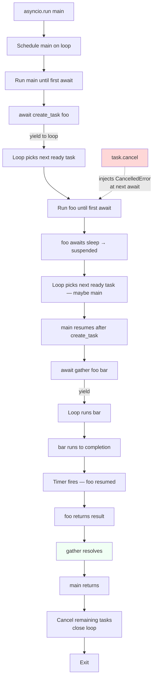

# 5. async-await

> [!note] Why this note exists
> [[4. asyncio Basics]] introduced the event loop and the gather/wait/as_completed primitives. This note goes one level deeper into the **language** itself: the `async def` and `await` keywords, what an *awaitable* is, how `asyncio.create_task` actually schedules work, the cancellation protocol (`CancelledError`, `asyncio.CancelledError`, `task.cancel()`), the timeout helpers (`wait_for`, `timeout`), and the **structured concurrency** primitive introduced in Python 3.11: `asyncio.TaskGroup`. After this note you will be able to write idiomatic, robust async code that handles cancellation, timeouts, and errors correctly — and you'll understand why `asyncio.TaskGroup` is replacing `gather` in modern code.

## Why It Matters

Async/await is the syntax that makes coroutine-based code *readable*. Before PEP 492 (Python 3.5), async code in Python was written with `yield from` and explicit `@asyncio.coroutine` decorators; the result looked like callback soup with extra steps. The `async`/`await` keywords let you write code that *looks* serial but *runs* concurrent — a coroutine that says:

```python
async def fetch_and_save(url, path):
    data = await fetch(url)
    await save(path, data)
    return len(data)
```

reads exactly like the equivalent serial function, yet `await fetch(url)` releases the CPU so other coroutines can run.

But the syntax hides a great deal of subtlety. A coroutine that doesn't `await` is just an ordinary function with extra overhead. A `CancelledError` that propagates through a `finally` block can leave resources inconsistent. A `gather` that swallows exceptions can silently lose data. A `TaskGroup` that wraps I/O work can cancel siblings you didn't expect. Understanding these mechanics is the difference between an async program that "mostly works" and one that is correct under failure.

## Background

### The two keywords

```python
async def my_function(...):    # defines a coroutine function
    ...
    result = await some_awaitable()
    ...
```

- `async def` defines a **coroutine function**. Calling it returns a **coroutine object** — it does *not* execute the body until awaited.
- `await` (legal only inside `async def`) does two things: (1) if the operand is an awaitable that isn't done, it suspends the current coroutine and yields control to the event loop; (2) when the awaitable completes, it resumes the coroutine with the result (or raises the exception).

### What is "awaitable"?

An object is awaitable if it implements `__await__`. Three built-in kinds:

1. **Coroutines** — the result of calling an `async def` function.
2. **Tasks** — `asyncio.create_task(coro)` wraps a coroutine in a Task that runs on the loop.
3. **Futures** — low-level promise objects, mostly used in library code.
4. (3.11+) **Any object with an `__await__` method** — including custom awaitables.

You can await any of these. The `await` keyword is the only thing that runs a coroutine — calling `my_async_func()` without `await` just produces a coroutine object that does nothing and eventually gets garbage-collected with a "coroutine was never awaited" warning.

### What `await` actually does

Mechanically:

1. `await expr` evaluates `expr` to get an awaitable `A`.
2. The interpreter calls `A.__await__()`, which returns an iterator.
3. The interpreter iterates `A.__await__`. If it yields a value, the coroutine is suspended and that value is passed up to the event loop.
4. When the loop sends a value back into the iterator (or throws an exception into it), the coroutine resumes.
5. When the iterator raises `StopIteration(value)`, the `await` expression evaluates to `value`.

In practice you don't think about this machinery — you just `await`. But it explains why `await` is a suspension point: the coroutine's local variables are saved into its frame, and the frame is parked until the loop sends a value back.

### Execution flow diagram

```mermaid
sequenceDiagram
    participant Loop as Event Loop
    participant Main as main coroutine
    participant Task1 as task_a
    participant Task2 as task_b

    Loop->>Main: starts main()
    Main->>Loop: create_task(task_a())
    Main->>Loop: create_task(task_b())
    Main->>Loop: await gather(task_a, task_b)
    Note over Main: suspended at await
    Loop->>Task1: runs task_a until its first await
    Task1->>Loop: awaits asyncio.sleep(0.5)
    Note over Task1: suspended
    Loop->>Task2: runs task_b until its first await
    Task2->>Loop: awaits asyncio.sleep(0.3)
    Note over Task2: suspended
    Note over Loop: nothing ready — wait on timers
    Loop-->>Task2: 0.3s elapsed, resume
    Task2->>Loop: returns "b done"
    Loop-->>Task1: 0.5s elapsed, resume
    Task1->>Loop: returns "a done"
    Loop-->>Main: gather complete, resume
    Main->>Loop: returns
```

## Main content

### `async def` — defining coroutines

```python
async def fetch(url):
    """A coroutine function."""
    ...
    return data

# Calling it does NOT run it:
coro = fetch("https://example.com")
# coro is a coroutine object, awaiting execution.

# To run it, you must await it or schedule it as a task:
data = await coro
```

A few facts:

- `async def` functions cannot contain `yield` (use `async def` + `yield` to define an **async generator** instead — a separate feature).
- `return value` inside `async def` is the result the coroutine resolves to.
- An `async def` without any `await` is still a coroutine, but it runs synchronously when awaited. (You will get a "coroutine does not actually await anything" warning under debug mode.)
- You can also use `async for` (iterate an async iterable) and `async with` (use an async context manager) inside `async def`.

### `await` — the suspension operator

```python
result = await some_awaitable()
```

Rules:

- Can only appear inside `async def` (or `async with`'s `__aexit__`, or `async for`'s `__anext__`).
- The operand must be an awaitable.
- The current coroutine is suspended at this point until the awaitable completes.
- If the awaitable raises, the exception propagates out of the `await` expression.

```python
async def example():
    x = await foo()   # suspends until foo done
    y = await bar()   # suspends until bar done
    return x + y      # serial — bar doesn't start until foo finishes
```

For concurrency, schedule both first:

```python
async def example_concurrent():
    t1 = asyncio.create_task(foo())
    t2 = asyncio.create_task(bar())
    x, y = await asyncio.gather(t1, t2)
    return x + y
```

### `asyncio.create_task(coro)` — schedule a coroutine

Wraps `coro` in a `Task` and schedules it on the loop. The task starts running at the next loop iteration (i.e., at the next `await` in the calling coroutine).

```python
async def main():
    task = asyncio.create_task(do_work())
    # task is now scheduled; do_work hasn't started yet
    await asyncio.sleep(0)   # yield to loop → task runs
    # ... other work ...
    result = await task
```

Key properties:

- **Name**: `asyncio.create_task(coro, name="my-task")` — shows up in `task.get_name()`, useful for debugging.
- **Context** (3.11+): `asyncio.create_task(coro, context=ctx)` — pass a `contextvars.Context` for the task to run in.
- **Don't lose the reference.** If you don't hold a reference, the GC may collect the task mid-flight. Always keep tasks in a list/set.

### `asyncio.gather(*aws, return_exceptions=False)`

Runs awaitables concurrently and returns their results in input order:

```python
async def main():
    r1, r2, r3 = await asyncio.gather(
        fetch("a"), fetch("b"), fetch("c"),
    )
```

- Default behavior: if any awaitable raises, `gather` cancels all the others and raises.
- `return_exceptions=True`: exceptions become result entries; all awaitables complete.
- Passing `return_exceptions=True` is the easy way to "best effort" multiple fetches.

### `asyncio.wait(aws, *, return_when=ALL_COMPLETED, timeout=None)`

Lower-level than `gather`. Returns `(done, pending)` sets:

```python
done, pending = await asyncio.wait(tasks, return_when=asyncio.FIRST_COMPLETED)
for t in pending:
    t.cancel()
```

Use this when you need partial results, fan-out-then-cancel-losers, or a global timeout across multiple awaitables.

### `asyncio.as_completed(aws, *, timeout=None)`

Iterator yielding awaitables in completion order:

```python
for coro in asyncio.as_completed(tasks):
    result = await coro
    print("done:", result)
```

Best when you want to process results as they arrive.

### `asyncio.wait_for(aw, timeout)`

Runs a single awaitable with a timeout. Cancels the awaitable if it doesn't finish in time.

```python
try:
    result = await asyncio.wait_for(slow_call(), timeout=2.0)
except asyncio.TimeoutError:
    print("timed out")
```

In Python 3.11+, `asyncio.TimeoutError` is an alias for the built-in `TimeoutError`. Either works.

### The `timeout` context manager (Python 3.11+)

A more flexible alternative to `wait_for`:

```python
async with asyncio.timeout(2.0):
    await slow_call()
    await another_slow_call()
# raises TimeoutError if total time exceeds 2s
```

You can also use `asyncio.timeout_at(deadline)` for absolute deadlines, and you can change the deadline from inside via the `Timeout` object's `reschedule()` method.

### `asyncio.TaskGroup` (Python 3.11+) — structured concurrency

The modern replacement for `gather` in most cases. Wraps a block of code, ensures all tasks complete (or fail) together, and propagates exceptions correctly via `ExceptionGroup`.

```python
async def main():
    async with asyncio.TaskGroup() as tg:
        t1 = tg.create_task(fetch("a"))
        t2 = tg.create_task(fetch("b"))
        t3 = tg.create_task(fetch("c"))
    # All tasks are guaranteed complete here.
    print(t1.result(), t2.result(), t3.result())
```

Key properties:

- If any task raises, the group **cancels all the others** and raises an `ExceptionGroup` containing the failure(s).
- The `async with` block doesn't exit until all tasks finish — no orphan tasks.
- You can `await` between `tg.create_task` calls to interleave task creation with other work.
- Combined with `except*` syntax (3.11+), you get clean error handling for partial failures.

```python
async def main():
    try:
        async with asyncio.TaskGroup() as tg:
            tg.create_task(risky_1())
            tg.create_task(risky_2())
    except* ValueError as eg:
        print(f"value errors: {len(eg.exceptions)}")
    except* TimeoutError as eg:
        print(f"timeouts: {len(eg.exceptions)}")
```

`TaskGroup` is the right default for new code. Use `gather` only when you need `return_exceptions=True` semantics or want explicit non-structured concurrency.

### Cancellation: `task.cancel()`, `CancelledError`, and the cancellation protocol

Calling `task.cancel()` injects a `asyncio.CancelledError` into the task at its next `await`. The task can either:

1. Let the error propagate (the default) — the task is cancelled, and `await task` raises `CancelledError`.
2. Catch it, do cleanup, and re-raise — the task is cancelled but cleaned up first.
3. Catch it and *not* re-raise — the task *survives* (cancellation was suppressed). This is rarely correct; only the most defensive library code does this.

```python
async def work():
    try:
        await long_running()
    except asyncio.CancelledError:
        print("cancelling — cleaning up")
        await cleanup()
        raise   # MUST re-raise, or cancellation is suppressed
```

In Python 3.8+, `asyncio.CancelledError` inherits from `BaseException`, not `Exception`. This means a bare `except Exception:` does *not* catch it — which is what you want, so that cancellation propagates through normal error handlers. A bare `except:` *does* catch it, which is why you should never use bare `except:` in async code.

### `asyncio.shield(aw)` — protect from outer cancellation

If an outer scope cancels a `shield`-ed awaitable, the awaitable itself is *not* cancelled; only the outer `await` raises `CancelledError`.

```python
async def main():
    task = asyncio.create_task(critical_save())
    try:
        await asyncio.shield(task)
    except asyncio.CancelledError:
        # main was cancelled, but critical_save continues
        await task   # wait for it to finish
        raise
```

Use sparingly. Usually it's better to restructure so cancellation is safe (e.g., put cleanup in `finally`).

### Mermaid: async/await execution and cancellation flow



## Code examples

### Example 1: structured concurrency with `TaskGroup`

```python
import asyncio, random

async def fetch(name):
    await asyncio.sleep(random.random())
    if random.random() < 0.2:
        raise ValueError(f"{name} failed")
    return f"{name}:ok"

async def main():
    try:
        async with asyncio.TaskGroup() as tg:
            tasks = [tg.create_task(fetch(f"svc{i}")) for i in range(5)]
    except* ValueError as eg:
        for e in eg.exceptions:
            print("warning:", e)
    for t in tasks:
        if not t.cancelled() and t.exception() is None:
            print("ok:", t.result())

asyncio.run(main())
```

### Example 2: proper cancellation handling

```python
import asyncio

async def worker(stop_event):
    try:
        while not stop_event.is_set():
            await asyncio.sleep(0.5)
            print("tick")
    except asyncio.CancelledError:
        print("worker: cancelled, doing final cleanup")
        await asyncio.sleep(0.1)   # simulate cleanup
        raise

async def main():
    stop = asyncio.Event()
    task = asyncio.create_task(worker(stop))
    await asyncio.sleep(2)
    task.cancel()
    try:
        await task
    except asyncio.CancelledError:
        print("main: worker cancelled cleanly")

asyncio.run(main())
```

### Example 3: timeout + cleanup

```python
import asyncio

async def slow_resource():
    try:
        await asyncio.sleep(10)
        return "done"
    finally:
        print("releasing resource")

async def main():
    try:
        async with asyncio.timeout(1.0):
            await slow_resource()
    except TimeoutError:
        print("hit timeout")
    # Note: the finally block in slow_resource still runs because the
    # CancelledError propagates through it. The resource is released.

asyncio.run(main())
```

### Example 4: bounded concurrency with semaphore

```python
import asyncio, aiohttp

URLS = [f"https://example.com/{i}" for i in range(100)]
MAX_CONCURRENT = 10

async def fetch_one(session, url, sem):
    async with sem:
        async with session.get(url) as resp:
            return await resp.text()

async def main():
    sem = asyncio.Semaphore(MAX_CONCURRENT)
    async with aiohttp.ClientSession() as session:
        tasks = [asyncio.create_task(fetch_one(session, u, sem)) for u in URLS]
        results = await asyncio.gather(*tasks)
        print(len(results))

asyncio.run(main())
```

Without the semaphore, `gather` would fire 100 requests simultaneously — usually too aggressive.

### Example 5: streaming results with `as_completed`

```python
import asyncio, random

async def fetch(i):
    await asyncio.sleep(random.random() * 2)
    return i

async def main():
    tasks = [asyncio.ensure_future(fetch(i)) for i in range(10)]
    for coro in asyncio.as_completed(tasks):
        i = await coro
        print(f"got {i}")

asyncio.run(main())
```

### Example 6: cancellation that propagates through `gather`

```python
import asyncio

async def slow(n):
    try:
        await asyncio.sleep(5)
        return n
    except asyncio.CancelledError:
        print(f"task {n} cancelled")
        raise

async def main():
    t1 = asyncio.create_task(slow(1))
    t2 = asyncio.create_task(slow(2))
    t3 = asyncio.create_task(slow(3))
    # If t2 fails, gather cancels t1 and t3.
    t2.cancel()  # simulate failure
    try:
        await asyncio.gather(t1, t2, t3)
    except asyncio.CancelledError:
        print("gather cancelled — siblings were also cancelled")
```

## Common Pitfalls

- **Forgetting `await`.** `asyncio.sleep(1)` without `await` creates a coroutine that's never scheduled; the sleep doesn't happen. Linters usually catch this.
- **Catching `CancelledError` and not re-raising.** This "swallows" the cancellation — the task keeps running, and `asyncio.run` will hang on shutdown waiting for it. Always re-raise.
- **Using `except Exception:` and expecting to catch `CancelledError`.** Since 3.8, `CancelledError` is a `BaseException`. `except Exception:` won't catch it. (This is *good* — it prevents accidental suppression.)
- **Forgetting `await asyncio.sleep(0)` in a CPU-heavy coroutine.** The loop has no chance to run other tasks. Sprinkle `await asyncio.sleep(0)` (or better, offload to a thread) in long loops.
- **Losing task references.** `asyncio.create_task(...)` without storing the return value lets the GC collect the task mid-flight.
- **Awaiting a coroutine twice.** A coroutine can only be awaited once. `coro = foo(); await coro; await coro` raises `RuntimeError: cannot reuse already awaited coroutine`. Wrap in `create_task` and await the task multiple times — that works.
- **Mixing `asyncio.run` and `loop.run_until_complete`.** Pick one entry point. In modern code, it's `asyncio.run`.
- **Awaiting a `gather` result inside `async with` blocks** and not realizing cancellation can fire mid-block. Always assume `CancelledError` can happen at any `await` and use `try/finally` for cleanup.
- **Suppressing `ExceptionGroup` parts.** With `TaskGroup`, you must use `except*` (3.11+) or catch `ExceptionGroup` and inspect `.exceptions`. A bare `except Exception:` will *not* catch an `ExceptionGroup` containing `Exception`s — the wrapping type is `ExceptionGroup`, not `Exception`.
- **Cancelling a task inside its own body.** `asyncio.current_task().cancel()` schedules cancellation at the next `await`. Subtle and confusing — prefer raising an explicit exception.
- **Calling `asyncio.run` from Jupyter.** Jupyter runs its own loop; `asyncio.run` raises. Use `await main()` directly at the top level.

## Tips and Tricks

- **Default to `TaskGroup` for new code (3.11+).** It's the structured-concurrency primitive; `gather` is for the legacy / "I really want `return_exceptions=True`" case.
- **Use `except*` to handle `ExceptionGroup`.** It's the only clean way to extract specific exception types from a `TaskGroup` failure.
- **Always `try/finally` around resource acquisition.** `CancelledError` can fire at any `await` — your `finally` will run, so put cleanup there.
- **Prefer `asyncio.timeout` (3.11+) over `wait_for`.** Composable with other awaits in the same block, and the timeout can be rescheduled.
- **Use `asyncio.current_task().get_name()`** for logging; set names via `create_task(coro, name=...)`.
- **`asyncio.all_tasks()`** returns the set of currently running tasks — invaluable for debugging hangs.
- **Combine `TaskGroup` with a `Semaphore`** for bounded fan-out that's also structured. Put `async with sem:` at the top of each task body.
- **Test cancellation paths explicitly.** Most async bugs are "what happens when this gets cancelled mid-flight?" — and the answer is usually "resource leak." Write tests that cancel.
- **Use `asyncio.iscoroutinefunction`** to detect async callables in framework code, so you can support both sync and async handlers.
- **`asyncio.run_coroutine_threadsafe(coro, loop)`** schedules a coroutine from another thread — for bridging signal handlers, callbacks, or sync APIs into the loop.
- **For nested timeouts, use `asyncio.timeout_at(deadline)`** with a monotonic deadline you compute once.

## Active Recall

1. What is the difference between a coroutine function, a coroutine object, and a task?
2. Can a coroutine be awaited twice? What's the workaround?
3. What does `asyncio.create_task` do that plain `await coro` doesn't?
4. Why does `CancelledError` inherit from `BaseException` rather than `Exception` since Python 3.8?
5. What happens if you catch `CancelledError` and don't re-raise it?
6. Difference between `gather`, `wait`, and `as_completed`?
7. What does `asyncio.shield(aw)` do, and when (rarely) should you use it?
8. How does `asyncio.TaskGroup` differ from `gather`? When does each fail?
9. What is `ExceptionGroup` and how do you handle it?
10. How do you do a per-block timeout in Python 3.11+?

<details>
<summary>Reveal answers</summary>

1. **Coroutine function** = an `async def` definition. **Coroutine object** = the result of calling it; doesn't run until awaited. **Task** = a coroutine scheduled on the loop, runs concurrently with other tasks.
2. No — a coroutine can only be awaited once. Wrap it in `asyncio.create_task(coro)` and await the resulting task multiple times (it caches its result).
3. `create_task` schedules the coroutine on the loop immediately, allowing it to run concurrently with the caller. `await coro` runs the coroutine to completion before returning to the next line — no concurrency.
4. So that `except Exception:` (which catches most "normal" errors) does *not* accidentally swallow cancellation. Cancellation is a control-flow signal, not a regular error.
5. The task is "un-cancelled" — it keeps running. The caller's `await task` won't raise `CancelledError`, and `asyncio.run` may hang on shutdown waiting for the task to actually finish. This is almost always a bug.
6. `gather` runs concurrently, returns results in input order, raises on first failure. `wait` returns `(done, pending)` sets with `FIRST_COMPLETED`/`FIRST_EXCEPTION`/`ALL_COMPLETED` options. `as_completed` yields awaitables in completion order — for streaming.
7. Prevents an outer cancellation from reaching the inner awaitable; the inner keeps running even though the outer `await` raises `CancelledError`. Rarely needed — usually better to restructure so cancellation is safe.
8. `TaskGroup` is structured: it cancels siblings on failure, guarantees all tasks complete before the block exits, and raises an `ExceptionGroup`. `gather` is unstructured: tasks may leak; default behavior cancels siblings on first failure but doesn't wrap exceptions.
9. A container exception holding multiple sub-exceptions, raised by `TaskGroup` when one or more child tasks fail. Handle with `except* SomeError as eg:` (3.11+) which extracts matching sub-exceptions, or catch `ExceptionGroup` and inspect `.exceptions`.
10. `async with asyncio.timeout(seconds):` — applies to everything inside the block; raises `TimeoutError` if exceeded.
</details>

## Next Steps

- [[8. Synchronization Primitives]] — `asyncio.Lock`, `Semaphore`, `Event`, `Condition`, `Barrier`, `Queue` (the async equivalents of the threading primitives).
- [[7. Concurrent Futures]] — bridging sync code into async via `run_in_executor`.
- [[4. asyncio Basics]] — the event-loop primer this note builds on.
- [[1. Processes vs Threads vs Coroutines]] — why coroutines are the right model for massive I/O concurrency.
