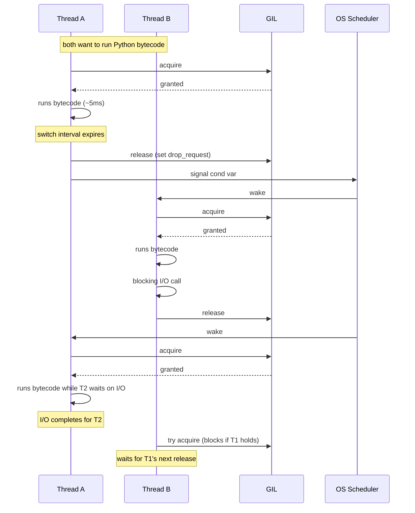
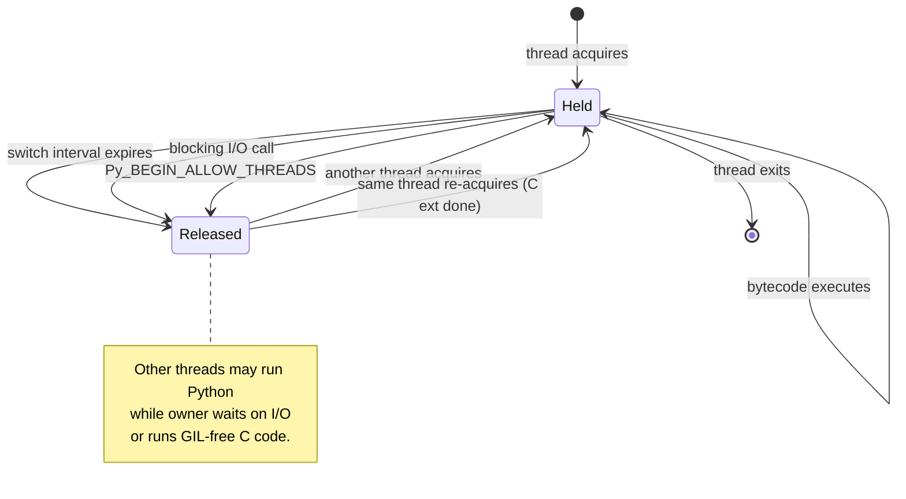

# 6. The GIL

> [!note] Why this note exists
> The Global Interpreter Lock is the single most consequential fact about CPython performance. It determines that [[2. threading Module|threads]] don't speed up CPU-bound Python, that they *do* speed up I/O-bound Python, that [[3. multiprocessing Module|multiprocessing]] exists as a workaround, and that [[4. asyncio Basics|asyncio]] is single-threaded by design. This note explains what the GIL actually *is* (a mutex around the CPython interpreter state), *why* it exists (reference counting + non-thread-safe internal data structures), *when* it is released (I/O, time-slice, C extensions that opt out), and *where* it is going (PEP 703 — free-threaded CPython, experimental in 3.13). After this note, the seemingly contradictory performance characteristics of Python's concurrency options should make sense.

## Why It Matters

Without understanding the GIL, every Python concurrency puzzle is a mystery:

- *"I parallelized my CPU loop with 8 threads and it ran slower than serial — why?"*
- *"My web scraper with 50 threads runs 30× faster than serial — why?"*
- *"NumPy matrix multiply with 8 threads uses all 8 cores — but `requests.get` with 8 threads uses one. What's the difference?"*
- *"The asyncio version of my scraper is faster than the threaded version. Doesn't asyncio run on one thread? Why?"*

The answer to all four is "the GIL." This note explains the rule precisely:

> The GIL is a mutex held by exactly one thread at a time while executing Python bytecode. It is released periodically (every ~5 ms by default) and during certain blocking operations (notably I/O and explicitly in GIL-releasing C extensions).

This single rule determines where threads help and where they don't.

## Background

### What the GIL actually is

In CPython, the reference implementation of Python (the one most people mean by "Python"), the interpreter maintains a number of global, mutable data structures that are not safe for concurrent mutation:

- The reference counts on every Python object.
- The garbage collector's tracking lists.
- The small-object allocator's free lists.
- Module state for some standard-library modules.

If two threads were allowed to execute Python bytecode simultaneously, both might try to increment `obj.ob_refcnt` at the same instant — a classic data race that would corrupt memory within seconds. Rather than make every internal operation thread-safe with fine-grained locking (which would be slow), CPython takes a simpler approach: a single global mutex called the **Global Interpreter Lock**. Only the thread holding the GIL may execute Python bytecode or touch CPython's internal state.

### Why the GIL exists — reference counting

CPython's primary garbage collection mechanism is **reference counting**: every object has an `ob_refcnt` field, incremented when something takes a reference (assignment, function call, container insertion) and decremented when a reference goes away. When `ob_refcnt` hits zero, the object is immediately deallocated.

This is fast and deterministic — but it means *every* assignment, function call, and attribute access mutates memory. Without a lock, those mutations race. A fine-grained lock per object would work in principle but would be prohibitively slow: an `a = b + c` might involve dozens of refcount operations, each needing a lock acquire/release.

The GIL is the pragmatic answer: one lock for the whole interpreter. The cost is that Python threads can't run bytecode in parallel — but in practice, I/O-dominated workloads overlap anyway because the GIL is released during I/O.

### The C-level picture

At the C level, the GIL is implemented in `Python/ceval.c`. The interpreter loop (`_PyEval_EvalFrameDefault`) checks a "drop GIL" flag periodically:

- Every `sys.getswitchinterval()` seconds (default 0.005), it sets `gil_drop_request`.
- The next bytecode instruction that is a "safe point" (typically any loop iteration or call) drops the GIL and signals the next waiting thread.

C extensions can release the GIL explicitly with the `Py_BEGIN_ALLOW_THREADS` / `Py_END_ALLOW_THREADS` macros. NumPy, hashlib, sqlite3, bz2, lzma, and most compute-heavy C extensions do this for their long-running operations.

### When the GIL is released

The GIL is released:

1. **Periodically** — every ~5 ms (configurable via `sys.setswitchinterval`), to give other Python threads a turn.
2. **During blocking I/O** — `socket.recv`, `file.read`, `time.sleep`, `os.read`, etc. all release the GIL while waiting.
3. **Inside C extensions that explicitly release it** — using `Py_BEGIN_ALLOW_THREADS`. This is how NumPy gets real parallelism.
4. **During `select`/`poll`/`epoll`/`sleep`** in asyncio's event loop, which is why asyncio + threads work together.
5. **Inside `threading.Lock.acquire`** while blocked.

The GIL is *not* released:

- During pure-Python bytecode execution (your `for` loops, dict lookups, attribute access).
- During most C-level calls into the interpreter (object allocation, reference counting).
- During most standard-library function calls (the `math` module's pure functions, for example, hold the GIL throughout).

### The release/acquire cycle



### The `sys.setswitchinterval` knob

```python
import sys
print(sys.getswitchinterval())   # 0.005 (5 ms) by default
sys.setswitchinterval(0.001)     # 1 ms — more responsive, more overhead
```

- Lower = more responsive (I/O threads get the GIL sooner) but more overhead from lock contention.
- Higher = better CPU throughput for single thread (less context-switch overhead) but laggier I/O.

Almost never needs tuning. The default is good for almost all workloads.

## Main content

### The GIL's effect on three workload classes

| Workload                                  | GIL impact                                  | Threads speed it up?                          |
|-------------------------------------------|---------------------------------------------|-----------------------------------------------|
| **CPU-bound pure Python** (math, parsing) | GIL held throughout → only one core used.   | **No** — often slower than serial.            |
| **I/O-bound** (network, disk, DB)         | GIL released during waits → overlaps.       | **Yes** — roughly linearly with concurrency.  |
| **C-extension-bound** (NumPy, hashlib)    | GIL released inside the C call → parallel.  | **Yes** — real parallelism within the call.   |

This table is the single most important thing to internalize about Python concurrency.

### Example 1: CPU-bound threads don't speed up

```python
import threading, time, math

def cpu_work(n):
    total = 0
    for i in range(n):
        total += math.isqrt(i * i + 1)
    return total

def single():
    return cpu_work(2_000_000)

def threaded():
    threads = []
    results = [None, None, None, None]
    def worker(idx, n):
        results[idx] = cpu_work(n)
    for i in range(4):
        t = threading.Thread(target=worker, args=(i, 500_000))
        threads.append(t); t.start()
    for t in threads: t.join()
    return sum(results)

t0 = time.perf_counter(); single();   t1 = time.perf_counter()
t0b = time.perf_counter(); threaded(); t2 = time.perf_counter()
print(f"single:   {t1-t0:.2f}s")
print(f"threaded: {t2-t0b:.2f}s")
```

Typical output on a 4-core machine:

```
single:   0.62s
threaded: 0.78s
```

The threaded version is *slower*. The GIL serializes the bytecode; the four threads fight over the lock, paying context-switch overhead with no parallelism gain.

### Example 2: I/O-bound threads do speed up

```python
import threading, time, urllib.request

URLS = ["https://example.com"] * 20

def fetch(url):
    with urllib.request.urlopen(url, timeout=10) as r:
        return r.read()

def single():
    return [fetch(u) for u in URLS]

def threaded():
    threads = []
    results = [None] * len(URLS)
    def worker(i, u):
        results[i] = fetch(u)
    for i, u in enumerate(URLS):
        t = threading.Thread(target=worker, args=(i, u))
        threads.append(t); t.start()
    for t in threads: t.join()
    return results

t0 = time.perf_counter(); single();   print(f"single:   {time.perf_counter()-t0:.2f}s")
t0 = time.perf_counter(); threaded(); print(f"threaded: {time.perf_counter()-t0:.2f}s")
```

Typical output:

```
single:   4.2s
threaded: 0.4s
```

The 10× speedup is real. The GIL is released during `urlopen`/`read`, so the 20 fetches overlap. CPU usage stays low (mostly waiting on sockets).

### Example 3: NumPy releases the GIL

```python
import threading, numpy as np, time

def matmul():
    a = np.random.rand(2000, 2000)
    b = np.random.rand(2000, 2000)
    return a @ b

def single():
    matmul(); matmul()

def threaded():
    threads = [threading.Thread(target=matmul) for _ in range(2)]
    for t in threads: t.start()
    for t: t.join() if (t := threads[0]) else None
    for t in threads: t.join()

t0 = time.perf_counter(); single();   print(f"single:   {time.perf_counter()-t0:.2f}s")
t0 = time.perf_counter(); threaded(); print(f"threaded: {time.perf_counter()-t0:.2f}s")
```

Typical output (on a multi-core machine):

```
single:   1.6s
threaded: 0.9s
```

The threaded version is ~1.8× faster. NumPy's BLAS calls release the GIL during the matrix multiply, so two threads really do run in parallel. (You'll see near-2× only if BLAS is itself single-threaded; if BLAS uses all cores internally, you'll see no further gain from Python-level threads.)

### Mermaid: GIL state diagram



### Why doesn't CPython just remove the GIL?

People have tried. The first attempt was Greg Stein's "free threading" patch in 1996 (Python 1.4). It worked but slowed single-threaded code by ~40% — unacceptable. The patch was removed in 1.5.

The reason removing the GIL is hard: every internal data structure must become thread-safe. CPython's small-object allocator, its type object cache, its module state, its exception handling — all need locks. Locks have overhead, and on the workloads CPython cares about (single-threaded scripts, small server processes), that overhead dwarfs the parallelism gain.

The reference-counting garbage collector is the worst offender. Every `a = b` increments `b`'s refcount. If refcounts were lock-protected, every assignment would pay for a lock acquire — single-threaded code would crawl.

### PEP 703: free-threaded CPython

In 2023, Microsoft and the Python community committed to making a GIL-less CPython real, via PEP 703. The plan:

- **Python 3.13 (October 2024)**: experimental free-threaded build, available as a separate executable (`python3.13t`). Not the default. Opt-in via a special build flag.
- **Python 3.14 (~2025)**: free-threaded build more mature, still opt-in.
- **Python 3.15+ (~2026+)**: free-threading becomes the default (planned, not committed).

Key technical decisions in PEP 703:

- **Biased reference counting**: most refcount operations happen from one thread (the "owning" thread), so they remain lock-free. Cross-thread operations use a slower path.
- **Deferred reference counting**: some high-traffic objects (None, True, False, small ints) become "immortal" — their refcount is never touched.
- **Thread-safe memory allocator**: replaces pymalloc with a thread-local-cache allocator (mimalloc-derived).
- **Per-object locks for mutable containers**: dict, list, set gain internal locks.

Trade-offs:

- Single-threaded performance is currently ~5–10% slower than the GIL build. Goal is to get this to near-parity.
- Multi-threaded CPU-bound Python code *finally* gets linear scaling.
- C extensions must be recompiled and audited for thread safety; the free-threaded build is a different ABI.
- The GIL isn't gone — it's optional. Existing C extensions that assumed the GIL will still work in the GIL build.

> [!tip] Should you write code today as if the GIL is going away?
> **No.** As of late 2024, the free-threaded build is experimental and not the default. The vast majority of Python deployments still use the GIL build. Write your code assuming the GIL is in effect; revisit if and when free-threading becomes default. The *one* thing you can do today: make sure your code is thread-safe (no undisciplined shared mutable state) so it will work under either model.

### Mermaid: GIL release/acquire cycle (timing view)

```mermaid
gantt
    title GIL ownership over time (4 threads, CPU-bound)
    dateFormat X
    axisFormat %s
    section Thread A
    holds GIL : 0, 5
    waits : 5, 10
    holds GIL : 10, 15
    waits : 15, 20
    section Thread B
    waits : 0, 5
    holds GIL : 5, 10
    waits : 10, 15
    holds GIL : 15, 20
    section Thread C
    waits : 0, 10
    waits : 10, 15
    holds GIL :crit, 15, 20
    waits : 20, 25
    section Thread D
    waits : 0, 15
    waits : 15, 20
    waits : 20, 25
```



The key insight: at any instant, exactly one thread holds the GIL. The four threads time-share one core's worth of Python execution. The other three cores sit idle (or run other processes).

### What this means for the rest of the chapter

- [[2. threading Module]]: Use threads for I/O-bound work, where the GIL is released during waits.
- [[3. multiprocessing Module]]: Use processes for CPU-bound work, where each process has its own GIL.
- [[4. asyncio Basics]] and [[5. async-await]]: Run on one thread, so the GIL is irrelevant — but the model is single-threaded, so CPU-bound coroutines must be offloaded via `run_in_executor`.
- [[7. Concurrent Futures]]: Same dichotomy — `ThreadPoolExecutor` for I/O, `ProcessPoolExecutor` for CPU.
- [[8. Synchronization Primitives]]: All the threading primitives are still needed because even with the GIL, multi-statement operations are not atomic.

## Common Pitfalls

- **Spawning threads for CPU-bound Python.** The classic mistake. Watch CPU usage stay at 100% on one core. Use `multiprocessing` or move the hot loop into a C extension.
- **Assuming `+=` is atomic.** It isn't. `x += 1` is read-modify-write at the bytecode level (`LOAD_ATTR`, `BINARY_ADD`, `STORE_ATTR`), and the GIL can be released between any of those bytecodes. Use a `Lock` or `threading.Atomic`-equivalent (there isn't one — use `itertools.count` from one thread, or a `Lock`).
- **Assuming C extensions release the GIL.** Some don't. The `math` module mostly doesn't. The `re` module mostly doesn't. Check the docs — or measure with `py-spy`.
- **`time.sleep(0)` releases the GIL.** Sometimes you want this; sometimes you don't. Don't use `time.sleep(0)` as a "yield" if you don't want a context switch.
- **Calling CPU-bound C code that doesn't release the GIL.** Some libraries (e.g., `bcrypt` in older versions) hold the GIL throughout. From the asyncio side, this freezes the loop just like `time.sleep`. Offload to a thread/process anyway.
- **Forgetting that `multiprocessing.Manager` proxies serialize through a *single* GIL-holding process.** If you have a Manager serving 8 worker processes, all 8 workers' proxy calls queue up at the manager's GIL. The manager becomes a bottleneck.
- **Writing free-threaded code today.** As of 3.13, the free-threaded build is experimental. Don't ship production code that depends on it; your dependencies probably haven't been audited for thread safety.
- **Assuming free-threading means no synchronization needed.** Even without the GIL, your data structures still need locks for correctness. The GIL was never a substitute for proper synchronization — only a coincidence that papered over some bugs.

## Tips and Tricks

- **Profile before parallelizing.** Use `cProfile` to confirm the work is CPU-bound. If 80% of time is in I/O, threads will help. If 80% is in pure-Python loops, threads won't.
- **`py-spy record -o profile.svg --pid <pid>`** is the easiest way to see whether your threads are actually running in parallel or all stuck on the GIL. The flame graph will show one thread active at a time if the GIL is the bottleneck.
- **For CPU-bound work, move the hot loop into NumPy/PyTorch/Cython/Numba.** Those release the GIL and get true parallelism without `multiprocessing`.
- **Use `concurrent.futures.ProcessPoolExecutor` for one-off CPU parallelism.** It abstracts away the `multiprocessing` boilerplate. See [[7. Concurrent Futures]].
- **`sys.setswitchinterval(0.001)`** can help I/O-bound threaded servers feel more responsive — but benchmark first; the overhead can hurt throughput.
- **For mixed CPU + I/O workloads, compose the models.** Run an asyncio event loop per process in a `multiprocessing.Pool`. The loop handles I/O concurrency; the pool handles CPU parallelism. This is how production scrapers and ML serving systems are built.
- **`os.cpu_count()` may be wrong on cgroups-limited containers.** Use `len(os.sched_getaffinity(0))` on Linux for the actual usable CPU count.
- **Try the free-threaded build (`python3.13t`) in a Docker container** to experiment. Don't deploy to production without auditing your dependencies.
- **The GIL is per-interpreter.** Subinterpreters (PEP 684, 3.12+) allow multiple interpreters in one process, each with its own GIL. As of 3.13 this is still maturing; eventually it may offer a lighter-weight alternative to `multiprocessing` for some use cases.

## Active Recall

1. What does GIL stand for, and what is it (one sentence)?
2. Why does CPython have a GIL? Name the primary reason.
3. When is the GIL released? Name at least three cases.
4. Why do CPU-bound Python threads not speed up?
5. Why do I/O-bound Python threads *still* speed up?
6. Why do NumPy operations get real parallelism from threads?
7. What does `sys.setswitchinterval` control, and what's the default?
8. Is `x += 1` atomic in CPython? Why or why not?
9. What is PEP 703, and which Python version first shipped it experimentally?
10. As of late 2024, should you write code as if the GIL is going away? Why or why not?

<details>
<summary>Reveal answers</summary>

1. Global Interpreter Lock — a mutex that allows only one thread at a time to execute Python bytecode in CPython.
2. Reference counting. Every assignment and function call mutates an object's refcount; without a lock those mutations race. A single GIL is cheaper than per-object locks.
3. (1) Periodically (~every 5 ms) via `sys.setswitchinterval`; (2) during blocking I/O (socket/file/sleep); (3) inside C extensions that call `Py_BEGIN_ALLOW_THREADS`; (4) during `Lock.acquire` while blocked; (5) inside `select`/`poll`/`epoll`.
4. Because the GIL is held during bytecode execution. Only one thread runs Python bytecode at a time, so 8 threads on 8 cores still do the work of 1 core, minus the context-switch overhead.
5. Because the GIL is released during blocking I/O. While thread A waits on a socket, the GIL is free and thread B runs. The I/O of multiple threads overlaps.
6. Because NumPy's BLAS calls explicitly release the GIL via `Py_BEGIN_ALLOW_THREADS`. The C code runs truly in parallel; only the Python-level setup is serialized.
7. The GIL switch interval — how often the interpreter voluntarily drops the GIL to let other threads run. Default is 0.005 s (5 ms).
8. No. `x += 1` is read-modify-write at the bytecode level (`LOAD`, `BINARY_ADD`, `STORE`), and the GIL can be released between any of those bytecodes. Use a `Lock` or `itertools.count` from one thread.
9. PEP 703 is the proposal to make a free-threaded (no-GIL) CPython. It shipped experimentally (as a separate `python3.13t` executable) in Python 3.13, October 2024.
10. No. The free-threaded build is experimental and not the default; most production deployments still use the GIL build. Write code assuming the GIL, but write code that is *thread-safe* (no undisciplined shared mutable state) so it will work under either model.
</details>

## Next Steps

- [[1. Processes vs Threads vs Coroutines]] — the conceptual comparison that the GIL explains.
- [[2. threading Module]] — how to use threads given the GIL.
- [[3. multiprocessing Module]] — how to bypass the GIL for CPU-bound work.
- [[4. asyncio Basics]] and [[5. async-await]] — single-threaded concurrency, where the GIL is mostly irrelevant.
- [[7. Concurrent Futures]] — the high-level API that picks threads or processes for you.
