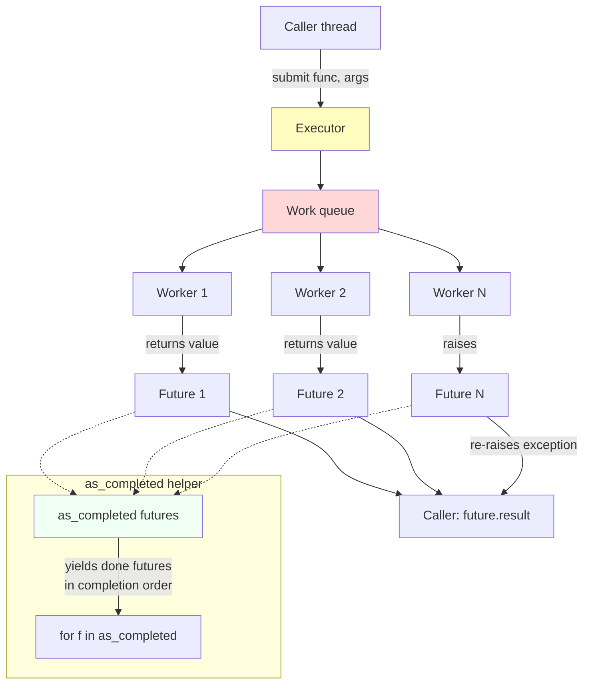
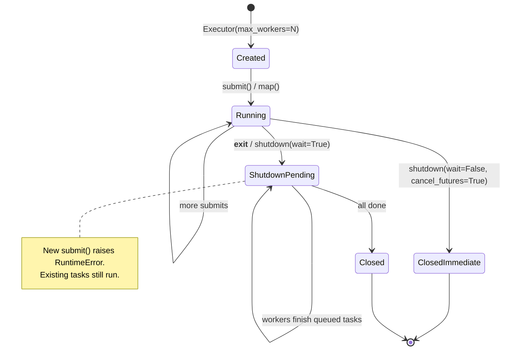

# 7. Concurrent Futures

> [!note] Why this note exists
> `concurrent.futures` is the **high-level** concurrency API in Python's standard library. It wraps [[2. threading Module|threads]] and [[3. multiprocessing Module|processes]] behind a single `Executor` interface, returns `Future` objects you can poll or `await`, and gives you `submit()`, `map()`, and `as_completed()` — three composable primitives that cover 90% of real-world parallelism needs. This note covers the `ThreadPoolExecutor` and `ProcessPoolExecutor` classes, the `Future` object's API, the three submission patterns, and the context-manager lifecycle. After this note you should rarely write raw `Thread(...).start()` or `Pool(...).map()` again — `concurrent.futures` is the modern default for new code.

## Why It Matters

The raw APIs in `threading` and `multiprocessing` are powerful but verbose:

- `threading`: spawn a `Thread`, share a `queue.Queue`, poll or `join` to collect results.
- `multiprocessing`: spawn a `Pool`, call `map` or `imap_unordered`, handle worker exceptions that don't propagate cleanly.

`concurrent.futures` abstracts all of this:

- One API for both threads and processes. Switch between them by changing one class name.
- A `Future` object representing an in-flight computation. You can poll `done()`, block on `result()`, attach `add_done_callback`, or `await` it (it's awaitable).
- `submit()` returns a single `Future`; `map()` returns an iterator of results; `as_completed()` yields futures as they finish.
- Context manager (`with`) handles shutdown automatically — no leaks, no orphan threads.

For 80% of "I want to parallelize this loop" problems, `concurrent.futures` is the right answer. The other 20% (streaming producer/consumer, custom process pools, subinterpreter-based parallelism) need the lower-level modules.

## Background

### The two executors

| Executor                  | Backing module    | Use when                                          |
|---------------------------|-------------------|---------------------------------------------------|
| `ThreadPoolExecutor`      | `threading`       | I/O-bound work; the GIL is released during waits. |
| `ProcessPoolExecutor`     | `multiprocessing` | CPU-bound work; each worker has its own GIL.      |

Both expose the same API:

```python
from concurrent.futures import ThreadPoolExecutor, ProcessPoolExecutor

with ThreadPoolExecutor(max_workers=8) as ex:
    future = ex.submit(func, *args)
    result = future.result()
```

Change `ThreadPoolExecutor` to `ProcessPoolExecutor` and the code runs in processes instead of threads — *if* the function and arguments are picklable (see [[3. multiprocessing Module]] for the pickling requirement).

### The `Future` object

A `Future` represents the eventual result of an asynchronous computation. It is *not* a coroutine — it's a generic promise. The API:

| Method                                   | Behavior                                                          |
|------------------------------------------|-------------------------------------------------------------------|
| `future.result(timeout=None)`            | Block until done; return value or raise exception.                |
| `future.exception(timeout=None)`         | Block until done; return exception or `None`.                     |
| `future.done()`                          | Non-blocking bool: is it finished?                                |
| `future.cancel()`                        | Try to cancel (only works if not yet started). Returns bool.      |
| `future.cancelled()`                     | Was it cancelled?                                                 |
| `future.running()`                       | Is it currently running?                                          |
| `future.add_done_callback(fn)`           | Call `fn(future)` when done (in the worker thread for `ThreadPoolExecutor`, in a separate thread for `ProcessPoolExecutor`). |
| `await future`                           | (3.5+) Awaitable — same as `result()` but yields to the loop.     |

You cannot construct a `Future` yourself — they're created internally by `submit()` and returned to you. (If you need to make your own, use `asyncio.Future` or the lower-level `concurrent.futures.Future` directly — but you almost never need to.)

### The three submission patterns

```python
# 1. submit() — one task, one Future
future = executor.submit(func, arg1, arg2)
result = future.result()

# 2. map() — many tasks, results in input order, blocking
results = list(executor.map(func, iterable))

# 3. as_completed() — many tasks, results in completion order
futures = [executor.submit(func, x) for x in iterable]
for future in as_completed(futures):
    result = future.result()
```

Each is right for different cases:

- **`submit`**: when you have a small, known number of tasks, or you want to do other work between submission and result collection.
- **`map`**: when you have an iterable of inputs and want the results in the same order. Blocks per result, so slow tasks hold up later results in iteration order (but tasks run concurrently in the background).
- **`as_completed`**: when you want to process results as they arrive. Best for streaming UIs, progress reporting, or heterogeneous task durations.

### The context manager

```python
with ThreadPoolExecutor(max_workers=8) as ex:
    # submit / map / as_completed ...
    pass
# At __exit__: ex.shutdown(wait=True) — blocks until all submitted tasks complete.
```

The `with` block guarantees:

- All submitted tasks finish before the block exits (default `wait=True`).
- Worker threads/processes are released.
- No task is "left behind."

If you need non-blocking shutdown, call `ex.shutdown(wait=False, cancel_futures=True)` (3.9+) explicitly instead of using `with`.

### Worker count defaults

If you don't pass `max_workers`:

- `ThreadPoolExecutor` (3.8+): `min(32, os.cpu_count() + 4)`. Reasonable for I/O-bound work — bounded so you don't create hundreds of threads on a many-core machine.
- `ProcessPoolExecutor`: `os.cpu_count()`. Correct for CPU-bound work; each worker claims one core.

Override only if you have measured evidence. For I/O-bound work that touches a single remote service, you often want far fewer than 32 — to avoid overwhelming the service. For I/O-bound work against many independent services, you often want more.

## Main content

### `submit()` — single task submission

```python
from concurrent.futures import ThreadPoolExecutor
import urllib.request

def fetch(url):
    with urllib.request.urlopen(url, timeout=10) as r:
        return r.read()

with ThreadPoolExecutor(max_workers=4) as ex:
    future = ex.submit(fetch, "https://example.com")
    # ... do other work ...
    data = future.result(timeout=30)
    print(len(data))
```

The `submit()` call returns immediately with a `Future`. The task is queued; an idle worker picks it up. `future.result()` blocks until the task finishes (or raises).

If the task raised an exception, `future.result()` re-raises it in the caller's thread — with a clean traceback pointing at the worker code, not at the internals of the executor. This is one of the biggest wins over raw `threading`, where unhandled exceptions in threads just print to stderr and vanish.

### `map()` — bulk, ordered

```python
from concurrent.futures import ProcessPoolExecutor

def square(x):
    return x * x

if __name__ == "__main__":
    with ProcessPoolExecutor() as ex:
        results = list(ex.map(square, range(20), chunksize=4))
    print(results)
```

`map(func, *iterables, timeout=None, chunksize=1)`:

- Applies `func` to every element of the iterable(s), concurrently.
- Returns an iterator that yields results **in input order** — if task 5 finishes before task 0, you still get task 0's result first (blocking until it's ready).
- `chunksize` (only meaningful for `ProcessPoolExecutor`) groups inputs to reduce IPC overhead. For `ThreadPoolExecutor`, `chunksize` is ignored.
- `timeout` applies to the *entire* map, not per-element. If any element takes longer than `timeout`, `TimeoutError` is raised on the next `__next__` call.

`map` is the closest analog to `multiprocessing.Pool.map`. The difference: `concurrent.futures` exceptions propagate as themselves (not wrapped), and the API is unified with threads.

### `as_completed()` — streaming results

```python
from concurrent.futures import ThreadPoolExecutor, as_completed
import urllib.request, random

URLS = [f"https://httpbin.org/delay/{random.random():.1f}" for _ in range(10)]

def fetch(url):
    with urllib.request.urlopen(url, timeout=30) as r:
        return url, len(r.read())

with ThreadPoolExecutor(max_workers=5) as ex:
    futures = {ex.submit(fetch, u): u for u in URLS}
    for future in as_completed(futures, timeout=60):
        url = futures[future]
        try:
            url_fetched, length = future.result()
            print(f"done: {url_fetched} ({length} bytes)")
        except Exception as e:
            print(f"failed: {url} → {e!r}")
```

`as_completed(fs, timeout=None)`:

- Takes an iterable of futures.
- Yields futures **in completion order**, not input order.
- Each yielded future is *done* — call `.result()` immediately to get the value (or re-raise the exception).
- `timeout` is the maximum total time to wait. If exceeded, raises `TimeoutError` on the next `__next__`.

This is the right pattern for: progress reporting, partial-failure handling, streaming UIs, and any case where you want to start processing results as soon as they're available.

### `Future.add_done_callback` — fire-and-forget

```python
def on_done(future):
    try:
        result = future.result()
        print(f"got: {result}")
    except Exception as e:
        print(f"failed: {e!r}")

with ThreadPoolExecutor(max_workers=4) as ex:
    future = ex.submit(long_running)
    future.add_done_callback(on_done)
    # main thread continues; on_done runs in a worker thread when future completes
```

The callback runs in a thread owned by the executor (for `ThreadPoolExecutor`) or in a separate management thread (for `ProcessPoolExecutor`). It should be quick — slow callbacks delay other callbacks.

### Mixing with asyncio — `run_in_executor`

`asyncio.Future` is *not* the same class as `concurrent.futures.Future`, but the loop knows how to bridge them. `loop.run_in_executor` submits to a `concurrent.futures.Executor` and returns an `asyncio.Future`:

```python
import asyncio
import concurrent.futures
import requests

async def fetch(url):
    loop = asyncio.get_running_loop()
    # Run blocking requests.get on the executor; await as a coroutine.
    return await loop.run_in_executor(None, requests.get, url)

async def main():
    results = await asyncio.gather(
        fetch("https://example.com"),
        fetch("https://python.org"),
    )
    print([len(r.content) for r in results])

asyncio.run(main())
```

This is the standard pattern for calling sync code from async code. `asyncio.to_thread` (3.9+) is a thinner wrapper for the common case of "just use the default thread pool."

### Mermaid: executor workflow



### Executor lifecycle



## Code examples

### Example 1: parallel URL fetching, ordered results

```python
from concurrent.futures import ThreadPoolExecutor
import urllib.request, time

URLS = [
    "https://example.com", "https://python.org",
    "https://docs.python.org", "https://pypi.org",
]

def fetch(url):
    with urllib.request.urlopen(url, timeout=10) as r:
        return url, len(r.read())

t0 = time.perf_counter()
with ThreadPoolExecutor(max_workers=4) as ex:
    for url, length in ex.map(fetch, URLS):
        print(f"{url}: {length} bytes")
print(f"{time.perf_counter()-t0:.2f}s")
```

### Example 2: CPU-bound work in processes

```python
from concurrent.futures import ProcessPoolExecutor
import math, time

def is_prime(n):
    if n < 2: return False
    for i in range(2, int(math.isqrt(n)) + 1):
        if n % i == 0: return False
    return True

if __name__ == "__main__":
    numbers = range(10**12, 10**12 + 200)
    t0 = time.perf_counter()
    with ProcessPoolExecutor() as ex:
        primes = sum(1 for r in ex.map(is_prime, numbers, chunksize=4) if r)
    print(f"{primes} primes in {time.perf_counter()-t0:.2f}s")
```

### Example 3: streaming results with `as_completed`

```python
from concurrent.futures import ThreadPoolExecutor, as_completed
import urllib.request, random, time

URLS = [f"https://httpbin.org/delay/{random.uniform(0.1, 1.5):.2f}" for _ in range(15)]

def fetch(url):
    with urllib.request.urlopen(url, timeout=30) as r:
        return url, len(r.read())

t0 = time.perf_counter()
with ThreadPoolExecutor(max_workers=8) as ex:
    futures = {ex.submit(fetch, u): u for u in URLS}
    for future in as_completed(futures):
        url = futures[future]
        try:
            fetched, length = future.result()
            print(f"  +{time.perf_counter()-t0:.2f}s  {length:>6} bytes  {fetched}")
        except Exception as e:
            print(f"  +{time.perf_counter()-t0:.2f}s  FAILED  {url}: {e!r}")
```

### Example 4: error propagation

```python
from concurrent.futures import ThreadPoolExecutor

def risky(n):
    if n == 3:
        raise ValueError(f"bad value: {n}")
    return n * 2

with ThreadPoolExecutor(max_workers=4) as ex:
    futures = [ex.submit(risky, n) for n in range(5)]
    for f in futures:
        try:
            print(f.result())
        except ValueError as e:
            print(f"caught: {e}")
```

Output:

```
0
2
4
caught: bad value: 3
8
```

Each future's exception is preserved and re-raised only when you call `result()` on that specific future. Other tasks are unaffected.

### Example 5: timeout with `wait`

```python
from concurrent.futures import ThreadPoolExecutor, wait, FIRST_COMPLETED
import time

def slow(n):
    time.sleep(n)
    return n

with ThreadPoolExecutor(max_workers=4) as ex:
    futures = [ex.submit(slow, n) for n in [1, 2, 3, 4]]
    done, not_done = wait(futures, timeout=1.5, return_when=FIRST_COMPLETED)
    print(f"done: {[f.result() for f in done]}")
    print(f"not done: {len(not_done)}")
    for f in not_done:
        f.cancel()   # may or may not work depending on whether task started
```

`concurrent.futures.wait` is the lower-level primitive that `as_completed` is built on. Use it when you need fine-grained control over return conditions.

### Example 5b: race — take the first result, cancel the rest

A common pattern is "ask N replicas, return whichever answers first." `wait` with `FIRST_COMPLETED` plus `cancel()` is the right tool:

```python
from concurrent.futures import ThreadPoolExecutor, wait, FIRST_COMPLETED
import urllib.request, time

REPLICAS = [
    "https://replica-a.example.com/health",
    "https://replica-b.example.com/health",
    "https://replica-c.example.com/health",
]

def fetch(url):
    t0 = time.perf_counter()
    with urllib.request.urlopen(url, timeout=5) as r:
        return url, r.read(), time.perf_counter() - t0

with ThreadPoolExecutor(max_workers=len(REPLICAS)) as ex:
    futures = {ex.submit(fetch, u): u for u in REPLICAS}
    done, not_done = wait(futures, return_when=FIRST_COMPLETED)

    winner = next(iter(done))
    url, body, elapsed = winner.result()
    print(f"winner: {url} in {elapsed:.2f}s, {len(body)} bytes")

    for f in not_done:
        f.cancel()   # cancel pending; running tasks continue to completion
    # Forcibly shutting down the executor (the `with` exit) waits for
    # any uncancellable running tasks to finish before returning.
```

This is the "hedged request" pattern — also useful for read replicas, cache tiers, and any situation where the fastest response wins. Note that `cancel()` only prevents tasks that haven't started yet; tasks already running will complete and their results will be discarded. If you need true cancellation of in-flight work, you have to cooperate with the worker (e.g., share a `threading.Event` and have the worker check it).

### Example 6: bridging sync and async with `run_in_executor`

```python
import asyncio, concurrent.futures, requests, time

async def fetch(url, executor):
    loop = asyncio.get_running_loop()
    return await loop.run_in_executor(executor, requests.get, url)

async def main():
    with concurrent.futures.ThreadPoolExecutor(max_workers=8) as ex:
        urls = ["https://example.com"] * 20
        results = await asyncio.gather(*(fetch(u, ex) for u in urls))
        print(f"got {len(results)} responses")

asyncio.run(main())
```

The executor can be a `ThreadPoolExecutor` (for blocking I/O) or a `ProcessPoolExecutor` (for CPU-bound work). The asyncio side sees it as just another awaitable.

## Common Pitfalls

- **`ProcessPoolExecutor` without the `if __name__ == "__main__":` guard on Windows.** Same fork-bomb issue as `multiprocessing` — see [[3. multiprocessing Module]].
- **Passing non-picklable functions/args to `ProcessPoolExecutor`.** Lambdas, closures, locally-defined classes. Use top-level functions and primitive args.
- **Calling `future.result()` on a cancelled future.** Raises `CancelledError`. Check `future.cancelled()` first if you're using cancellation.
- **Forgetting that `map` blocks per element.** `ex.map(func, items)` returns an iterator; iterating it blocks waiting for each result in input order. If task 0 is slow, you wait for task 0 even if tasks 1–9 are done. Use `as_completed` if you want completion order.
- **`shutdown(wait=False)` doesn't cancel running tasks.** It just stops the executor from blocking on them. Workers continue to completion; their results are discarded. Use `cancel_futures=True` (3.9+) to cancel pending (not-yet-started) tasks.
- **Using `add_done_callback` for ordering.** Callbacks run in arbitrary order across worker threads; if you need ordering, use `as_completed` and process sequentially.
- **Mixing `ThreadPoolExecutor` and CPU-bound work.** Classic mistake. The GIL serializes the bytecode; threads don't help. Use `ProcessPoolExecutor`.
- **Forgetting that `ProcessPoolExecutor` re-imports the module in each worker (with `spawn`).** Module-level code runs N+1 times. Don't put expensive initialization at module top level — use `initializer`.
- **Storing references to executors in long-lived objects and never shutting them down.** Threads/processes leak. Always use `with`, or call `shutdown()` explicitly.
- **`map` with multiple iterables.** `ex.map(func, a, b)` calls `func(a[i], b[i])` — it's `zip`-style. Don't confuse this with passing a tuple of args.
- **Calling `submit` from inside a `with` block that's exiting.** `shutdown` is called at `__exit__`; any `submit` after that raises `RuntimeError: cannot schedule new futures after shutdown`.

## Tips and Tricks

- **Default to `concurrent.futures` for new code.** It's cleaner than raw `threading`/`multiprocessing`, has better error propagation, and the unified API makes switching trivial.
- **Use `ProcessPoolExecutor` for CPU-bound, `ThreadPoolExecutor` for I/O-bound.** The decision tree is the same as in [[1. Processes vs Threads vs Coroutines]].
- **Match `max_workers` to the bottleneck.** CPU: `os.cpu_count()`. I/O against one service: a small number (4–8) to avoid overwhelming. I/O against many services: 32–100.
- **Use `chunksize` for `ProcessPoolExecutor.map`** to amortize IPC. Same heuristic as `multiprocessing.Pool`: `chunksize = max(1, len(items) // (4 * n_workers))`.
- **Use `as_completed` for progress reporting.** Print "X/Y done" as futures complete; users love progress bars.
- **Use `initializer` (3.7+) to set up per-worker state.** Open DB connections, load ML models, seed RNGs.
- ```python
  with ProcessPoolExecutor(max_workers=4, initializer=init_worker, initargs=(seed,)) as ex:
      ...
  ```
- **Combine with `asyncio` via `run_in_executor`** for mixed async/sync code. Or use `asyncio.to_thread` for the common case.
- **`future.cancel()` only works before the task starts.** Once a worker is running it, you can't interrupt it — Python has no `Thread.kill`. Design tasks to be short, or implement cooperative cancellation.
- **Use `concurrent.futures.wait` for fan-out-then-cancel-losers patterns.** Run all candidates, take the first to finish, cancel the rest.
- **Profile with `py-spy` to see actual parallelism.** If `ThreadPoolExecutor` shows one thread active at a time, the GIL is your bottleneck — switch to `ProcessPoolExecutor`.
- **Don't share a `ProcessPoolExecutor` across `fork` boundaries.** The child process inherits dead workers. Always create executors after forking, or use `spawn`.

## Active Recall

1. Name the two executor classes and when to use each.
2. What does `submit()` return, and what is its API?
3. What's the difference between `map()` and `as_completed()`?
4. What's the default `max_workers` for `ThreadPoolExecutor` (3.8+)? For `ProcessPoolExecutor`?
5. What happens if a worker function raises an exception?
6. How do you cleanly shut down an executor without `with`?
7. Can you cancel a running task with `future.cancel()`? Why or why not?
8. How do you bridge a sync (blocking) function into an asyncio program?
9. Why does `ProcessPoolExecutor` need the `if __name__ == "__main__":` guard on Windows?
10. When would you choose `concurrent.futures` over raw `threading`/`multiprocessing`?

<details>
<summary>Reveal answers</summary>

1. `ThreadPoolExecutor` (I/O-bound work; backed by threads) and `ProcessPoolExecutor` (CPU-bound work; backed by processes).
2. A `Future` — a promise of an eventual result. API: `result(timeout=None)`, `exception(timeout=None)`, `done()`, `cancel()`, `cancelled()`, `running()`, `add_done_callback(fn)`, and `await` (awaitable since 3.5).
3. `map` returns results in input order, blocking per element; `as_completed` yields futures in completion order, so you process results as soon as they're ready.
4. `ThreadPoolExecutor`: `min(32, os.cpu_count() + 4)`. `ProcessPoolExecutor`: `os.cpu_count()`.
5. The exception is captured and stored on the future. Calling `future.result()` re-raises it in the caller's thread, with a traceback pointing at the worker code.
6. `executor.shutdown(wait=True)` — blocks until all submitted tasks complete. Or `shutdown(wait=False, cancel_futures=True)` (3.9+) to cancel pending tasks and return immediately.
7. No — `cancel()` only succeeds for tasks that haven't started yet. Python has no `Thread.kill`; running tasks can only be cancelled cooperatively.
8. `await loop.run_in_executor(executor, blocking_fn, *args)` or, for the default thread pool, `await asyncio.to_thread(blocking_fn, *args)` (3.9+).
9. Because Windows uses `spawn`, which re-imports the parent module in each worker. Without the guard, the `ProcessPoolExecutor(...)` call would execute in each child, causing an exponential fork bomb.
10. For almost all "parallelize this loop" cases. `concurrent.futures` gives a unified API, cleaner error propagation, automatic shutdown via `with`, and easy switching between threads and processes. Use raw `threading`/`multiprocessing` only for specialized patterns (streaming producer/consumer pipelines, custom process pools, fork+threads handling).
</details>

## Next Steps

- [[1. Processes vs Threads vs Coroutines]] — the conceptual decision tree.
- [[2. threading Module]] — the lower-level API `ThreadPoolExecutor` wraps.
- [[3. multiprocessing Module]] — the lower-level API `ProcessPoolExecutor` wraps.
- [[4. asyncio Basics]] and [[5. async-await]] — bridging via `run_in_executor`.
- [[6. The GIL]] — why the choice between threads and processes matters.
- [[8. Synchronization Primitives]] — when you need locks beyond what `Executor` gives you.
