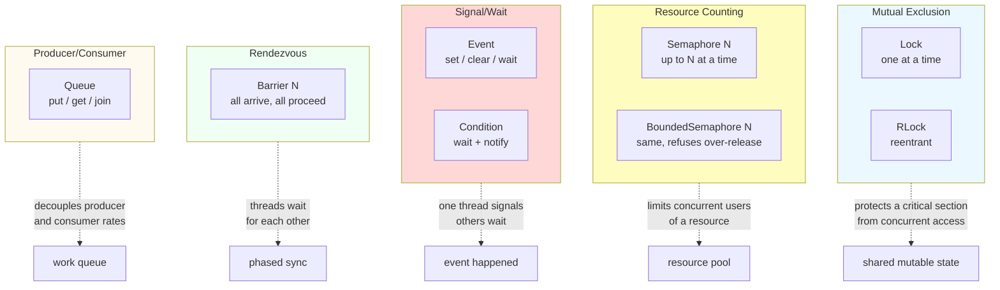
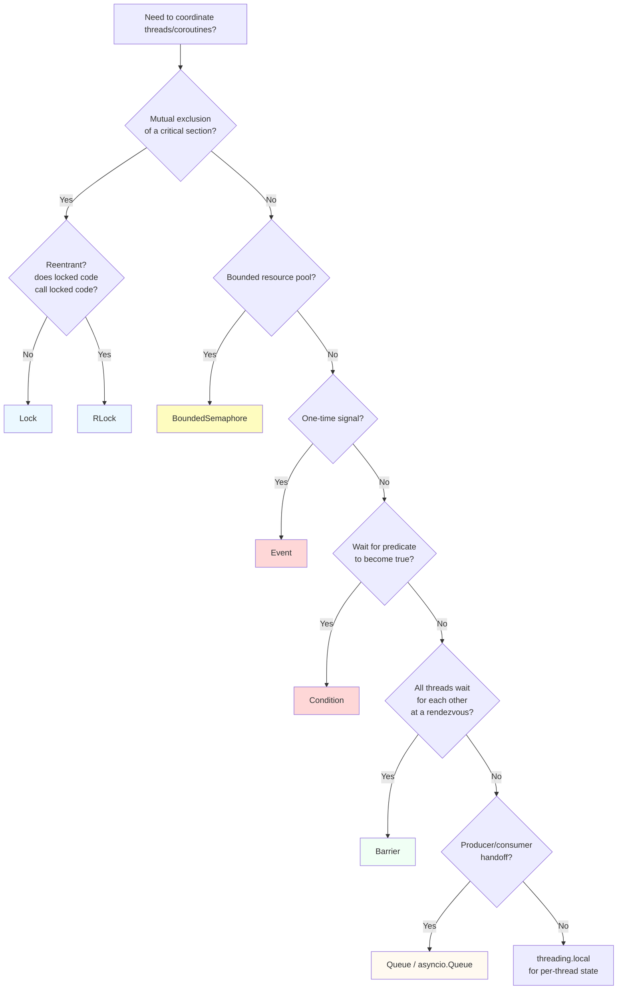

# 8. Synchronization Primitives

> [!note] Why this note exists
> Shared mutable state is the universal source of concurrency bugs. The previous notes in [[14. Concurrency]] introduced the execution models — threads, processes, coroutines — but skimmed over the question: *how do you make them not corrupt each other's work?* This note answers it. It covers every synchronization primitive in the `threading` module (`Lock`, `RLock`, `Semaphore`, `BoundedSemaphore`, `Event`, `Condition`, `Barrier`, plus the indispensable `queue.Queue`), their `asyncio` equivalents (`asyncio.Lock`, `Semaphore`, `Event`, `Condition`, `Barrier`, `Queue`), and the `multiprocessing` variants that work across processes. After this note you should be able to pick the right primitive for any concurrency coordination problem in one paragraph of reasoning.

## Why It Matters

Consider this innocent-looking counter:

```python
import threading

counter = 0

def bump():
    global counter
    for _ in range(1_000_000):
        counter += 1

ts = [threading.Thread(target=bump) for _ in range(4)]
for t in ts: t.start()
for t in ts: t.join()
print(counter)   # almost never 4_000_000
```

`counter += 1` looks atomic, but at the bytecode level it's `LOAD_GLOBAL`, `LOAD_CONST`, `BINARY_ADD`, `STORE_GLOBAL` — four instructions. The [[6. The GIL|GIL]] can be released between any of them. Thread A loads `counter=5`, thread B loads `counter=5`, both add 1, both store 6. Two increments, one update lost.

This is a **data race**: the program's behavior depends on the relative timing of threads. Data races are:

- **Non-reproducible** — runs pass in testing, fail in production, pass on rerun.
- **Silent** — no exception, just wrong answers.
- **Cumulative** — one lost increment per million operations × billions of operations = millions of lost increments per day.
- **Hard to test for** — unit tests with one thread always pass.

Synchronization primitives exist to make interleavings **explicit and correct**. Each one solves a specific coordination problem; using the wrong one is just as bad as using none.

## Background

### The five coordination problems

Every concurrency bug reduces to one of these patterns:

| Problem                            | Primitive                                            |
|------------------------------------|------------------------------------------------------|
| **Mutual exclusion**               | `Lock`, `RLock`                                      |
| **Resource counting**              | `Semaphore`, `BoundedSemaphore`                      |
| **Signal/wait**                    | `Event`                                              |
| **Wait for a predicate**           | `Condition`                                          |
| **Rendezvous**                     | `Barrier`                                            |
| **Producer/consumer handoff**      | `queue.Queue` / `asyncio.Queue`                      |
| **Per-thread state**               | `threading.local()` (see [[2. threading Module]])    |

The trick is recognizing which one you have. Most bugs come from using the wrong primitive — typically, a `Lock` where an `Event` was right, or a busy-wait where a `Condition` was right.

### The two flavors: threading vs asyncio

The `threading` module's primitives are designed for preemptive scheduling — they block the calling OS thread. The `asyncio` module's primitives have the same names and similar APIs but are designed for cooperative scheduling — they suspend the calling coroutine without blocking the event loop.

| Threading primitive           | asyncio equivalent             |
|-------------------------------|--------------------------------|
| `threading.Lock`              | `asyncio.Lock`                 |
| `threading.RLock`             | (none — asyncio.Lock is reentrant-friendly via different mechanism) |
| `threading.Semaphore`         | `asyncio.Semaphore`            |
| `threading.BoundedSemaphore`  | `asyncio.BoundedSemaphore`     |
| `threading.Event`             | `asyncio.Event`                |
| `threading.Condition`         | `asyncio.Condition`            |
| `threading.Barrier`           | `asyncio.Barrier` (3.11+, experimental) |
| `queue.Queue`                 | `asyncio.Queue`                |

There are also `multiprocessing.Lock`, `Event`, etc., which work across processes via shared memory or IPC. They have the same names but different internals — see [[3. multiprocessing Module]].

### Locking in 30 seconds

- `Lock` — the simplest mutex. One thread holds it at a time. Others block.
- `RLock` — reentrant lock. The same thread can acquire it multiple times; must release the same number of times. Needed when locked code calls other locked code.
- `Semaphore(N)` — N threads can hold at once. Use for bounding resource pools.
- `BoundedSemaphore(N)` — same, but `release()` raises if it would exceed N. Catches bugs.
- `Event` — a boolean flag with `set()`, `clear()`, `wait()`. Use for "wait until X happens."
- `Condition` — `Event` + a lock + `notify(n)`. Use for "wait until X, then do Y atomically."
- `Barrier(N)` — N threads wait at `barrier.wait()`; when all N arrive, they're all released. Use for phased computation.
- `Queue` — a thread-safe FIFO with `put`/`get`/`join`/`task_done`. Use for producer/consumer.

### Mermaid: primitive comparison



## Main content

### `threading.Lock` — the basic mutex

```python
import threading

lock = threading.Lock()

# Context manager — preferred:
with lock:
    # critical section — only one thread here at a time
    shared_state += 1

# Manual — for finer control:
lock.acquire()
try:
    shared_state += 1
finally:
    lock.release()
```

A `Lock` can be held by exactly one thread. `acquire()` blocks until the lock is free; `release()` frees it. Misuse (forgetting `release`, or releasing without acquiring) is a common bug source — prefer the `with` form.

A `Lock` is **not reentrant**. If thread A holds the lock and calls a function that also tries to `acquire` it, A deadlocks against itself. Use `RLock` for that.

Non-blocking acquire:

```python
if lock.acquire(blocking=False):
    try:
        # got it
    finally:
        lock.release()
else:
    # someone else holds it; do something else
```

Or with a timeout:

```python
if lock.acquire(timeout=5.0):
    try:
        ...
    finally:
        lock.release()
```

### `threading.RLock` — reentrant lock

```python
import threading

rlock = threading.RLock()

def outer():
    with rlock:
        print("in outer, holding lock")
        inner()   # would deadlock with a plain Lock

def inner():
    with rlock:   # same thread can re-acquire
        print("in inner, still holding lock")

outer()
```

`RLock` tracks the *owner* and a *count*. The same thread can `acquire` it N times; it must `release` N times before another thread can acquire. Use `RLock` whenever a locked method might call another locked method on the same object.

Class-based example — `RLock` for thread-safe counters:

```python
import threading

class Counter:
    def __init__(self):
        self._value = 0
        self._lock = threading.RLock()

    def increment(self):
        with self._lock:
            self._value += 1

    def increment_by(self, n):
        with self._lock:
            for _ in range(n):
                self.increment()   # reentrant — would deadlock with Lock
```

### `threading.Semaphore` and `BoundedSemaphore`

```python
import threading

# Limit to 4 concurrent connections:
sem = threading.Semaphore(4)

def fetch(url):
    with sem:                # acquire (blocks if 4 already acquired)
        return _do_fetch(url)
```

A `Semaphore(N)` starts with an internal counter at `N`. `acquire` decrements; `release` increments. If `acquire` would make the counter negative, it blocks until enough `release` calls have happened.

`BoundedSemaphore(N)` is the same but raises `ValueError` if you call `release()` more times than `acquire()`. This catches bugs where a `release` is accidentally called twice (e.g., via a double-finally). Always prefer `BoundedSemaphore` unless you have a specific reason not to.

Use cases:

- **Connection pools**: limit to N concurrent DB connections.
- **Rate limiting**: limit to N requests per second (combined with a timer).
- **Worker pools**: limit the number of threads doing a particular kind of work.

### `threading.Event` — signal/wait

An `Event` is a boolean flag with `set`, `clear`, and `wait`:

```python
import threading, time

ready = threading.Event()

def worker():
    print("worker: waiting for ready signal")
    ready.wait()              # blocks until set
    print("worker: go!")
    # ...

def boss():
    time.sleep(2)
    print("boss: setting ready")
    ready.set()

threading.Thread(target=worker).start()
threading.Thread(target=boss).start()
```

- `event.set()` — set the flag; all waiting threads wake up.
- `event.clear()` — reset the flag.
- `event.is_set()` — non-blocking check.
- `event.wait(timeout=None)` — block until set or timeout; returns `True` if set, `False` if timed out.

Events are the right primitive for one-time signals ("shutdown now", "config loaded", "first request received"). Don't use them for repeated signals — use `Condition` for that.

### `threading.Condition` — wait for a predicate

A `Condition` combines a lock with `notify`/`notify_all`. It's the right primitive for "wait until X is true, then do Y atomically."

```python
import threading, time, random

cond = threading.Condition()
queue = []

def producer():
    with cond:
        for i in range(5):
            time.sleep(random.random() * 0.5)
            queue.append(i)
            print(f"produced {i}")
            cond.notify()    # wake one waiter
            # cond.notify_all() would wake all

def consumer():
    with cond:
        while not queue:
            print("consumer: queue empty, waiting")
            cond.wait()      # releases lock, waits; reacquires on wake
        print(f"consumer: got {queue.pop(0)}")

threading.Thread(target=producer).start()
threading.Thread(target=consumer).start()
```

The pattern is:

```python
with cond:
    while not predicate():
        cond.wait()
    # predicate is now true; do work
```

**Why the `while` and not `if`?** Spurious wakeups and "lost wakeup" races. The standard requires `wait` to be allowed to return spuriously; and even if it's a real wakeup, another waiter might have grabbed the predicate first. Re-check after wake.

`notify(n)` wakes n waiting threads; `notify_all()` wakes all. Use `notify` when one waiter is enough (e.g., adding one item to a queue); `notify_all` when all waiters should re-evaluate (e.g., shutting down).

### `threading.Barrier` — phased rendezvous

A `Barrier(N)` blocks N threads at `barrier.wait()` until all N have arrived, then releases them all simultaneously.

```python
import threading

def phase(name, barrier):
    print(f"{name}: starting phase 1")
    barrier.wait()
    print(f"{name}: starting phase 2")
    barrier.wait()
    print(f"{name}: done")

barrier = threading.Barrier(3)
threads = [threading.Thread(target=phase, args=(f"T{i}", barrier)) for i in range(3)]
for t in threads: t.start()
for t in threads: t.join()
```

Use cases:

- **Phased computation** — every thread must finish phase 1 before any starts phase 2 (e.g., cellular automata steps).
- **Parallel initialization** — all workers wait for the boss to finish setup, then go.
- **Benchmark coordination** — all threads start the timed section together.

`barrier.abort()` lets any thread cancel the wait — all `wait()` calls raise `BrokenBarrierError`. Useful for shutdown.

### `queue.Queue` — the unsung hero

`queue.Queue` is the right answer for almost all producer/consumer patterns. It has built-in locking, blocking `put`/`get` with optional timeouts, and `task_done`/`join` for "all items processed" signaling.

```python
import queue, threading, time, random

q = queue.Queue(maxsize=10)

def producer():
    for i in range(20):
        q.put(i)                # blocks if full
        time.sleep(random.random() * 0.1)
    q.put(None)                 # sentinel

def consumer():
    while True:
        item = q.get()          # blocks if empty
        if item is None:
            q.task_done()
            break
        print(f"processed {item}")
        time.sleep(random.random() * 0.3)
        q.task_done()

c = threading.Thread(target=consumer); c.start()
p = threading.Thread(target=producer); p.start()
p.join()
q.join()                        # wait until all task_done() called
c.join()
```

Variants:

- `queue.Queue` — FIFO.
- `queue.LifoQueue` — LIFO (stack).
- `queue.PriorityQueue` — items ordered by `heapq` (lowest first).
- `queue.SimpleQueue` (3.7+) — bare FIFO, no task tracking, no maxsize, much faster.

> [!tip] When in doubt, use a Queue
> A queue eliminates the need for explicit locks in producer/consumer code, and `task_done`/`join` give you clean shutdown semantics. If you find yourself reaching for a `Lock` and a `list`, you almost certainly want a `Queue`.

### The `asyncio` equivalents

The asyncio primitives have the same names and almost the same API, but every blocking call is a coroutine:

```python
import asyncio

async def worker(lock):
    async with lock:
        await asyncio.sleep(0.1)
        # critical section

async def main():
    lock = asyncio.Lock()
    await asyncio.gather(worker(lock), worker(lock), worker(lock))

asyncio.run(main())
```

Key differences from threading:

- `async with` instead of `with`.
- `await event.wait()` instead of `event.wait()`.
- **Coroutines don't actually need locks for most things.** Code between two `await`s is atomic — only `await` points can interleave. You only need an `asyncio.Lock` when you have multiple `await`s that must be atomic together.
- `asyncio.Semaphore` is the right primitive for bounding concurrency in fan-out (`asyncio.gather` of 1000 tasks with `Semaphore(10)`).

### `asyncio.Semaphore` — bounded fan-out

```python
import asyncio, aiohttp

URLS = [f"https://example.com/{i}" for i in range(1000)]

async def fetch(session, url, sem):
    async with sem:
        async with session.get(url) as resp:
            return await resp.text()

async def main():
    sem = asyncio.Semaphore(20)   # cap at 20 concurrent
    async with aiohttp.ClientSession() as session:
        tasks = [asyncio.create_task(fetch(session, u, sem)) for u in URLS]
        return await asyncio.gather(*tasks)

asyncio.run(main())
```

This is the canonical "bounded concurrency" pattern. Without the semaphore, you'd fire 1000 requests at once — the server would rate-limit you, your client would run out of file descriptors, and you'd get bad results.

### `asyncio.Event` and `asyncio.Condition`

```python
import asyncio

shutdown = asyncio.Event()

async def worker():
    while not shutdown.is_set():
        await asyncio.sleep(0.5)
        print("tick")
    print("shutting down")

async def main():
    task = asyncio.create_task(worker())
    await asyncio.sleep(2)
    shutdown.set()
    await task

asyncio.run(main())
```

Same pattern as the threading `Event`, but `await event.wait()` instead of `event.wait()`. `Condition` is similar — `await cond.wait()`, `cond.notify()`.

### `multiprocessing` synchronization

The `multiprocessing` module exposes `Lock`, `RLock`, `Semaphore`, `Event`, `Condition`, `Barrier`, and `Queue` that work across processes. They are slower than the threading versions (because every operation crosses a process boundary), but they're the only way to coordinate processes:

```python
import multiprocessing as mp

def worker(lock, counter):
    with lock:                # cross-process lock — IPC-aware
        counter.value += 1    # counter is mp.Value, also IPC-aware

if __name__ == "__main__":
    lock = mp.Lock()
    counter = mp.Value("i", 0)
    ps = [mp.Process(target=worker, args=(lock, counter)) for _ in range(4)]
    for p in ps: p.start()
    for p in ps: p.join()
    print(counter.value)   # 4
```

Note that `mp.Value` and `mp.Array` come with their own built-in lock accessible via `get_lock()` — you don't always need a separate `mp.Lock`.

### Mermaid: when to use which primitive



## Code examples

### Example 1: thread-safe counter with `Lock`

```python
import threading

class Counter:
    def __init__(self):
        self._value = 0
        self._lock = threading.Lock()

    def increment(self):
        with self._lock:
            self._value += 1

    @property
    def value(self):
        with self._lock:
            return self._value

c = Counter()
ts = [threading.Thread(target=lambda: [c.increment() for _ in range(100_000)]) for _ in range(4)]
for t in ts: t.start()
for t in ts: t.join()
print(c.value)   # 400_000 — correct
```

### Example 2: bounded connection pool

```python
import threading, urllib.request, time

URLS = ["https://example.com"] * 50
sem = threading.BoundedSemaphore(8)

def fetch(url, results, i):
    with sem:
        with urllib.request.urlopen(url, timeout=10) as r:
            results[i] = len(r.read())

results = [None] * len(URLS)
threads = [threading.Thread(target=fetch, args=(u, results, i))
           for i, u in enumerate(URLS)]
t0 = time.perf_counter()
for t in threads: t.start()
for t in threads: t.join()
print(f"{time.perf_counter()-t0:.2f}s, {sum(r for r in results if r)} bytes")
```

### Example 3: producer/consumer with `Condition`

```python
import threading, random, time

cond = threading.Condition()
items = []
SHUTDOWN = False

def producer():
    for i in range(10):
        time.sleep(random.random() * 0.2)
        with cond:
            items.append(i)
            cond.notify_all()
    with cond:
        global SHUTDOWN
        SHUTDOWN = True
        cond.notify_all()

def consumer(name):
    while True:
        with cond:
            while not items and not SHUTDOWN:
                cond.wait()
            if not items and SHUTDOWN:
                break
            item = items.pop(0)
        print(f"[{name}] processed {item}")

ps = [threading.Thread(target=producer)]
cs = [threading.Thread(target=consumer, args=(f"C{i}",)) for i in range(2)]
for t in ps + cs: t.start()
for t in ps + cs: t.join()
```

### Example 4: phased computation with `Barrier`

```python
import threading

N_WORKERS = 4
STEPS = 3

barrier = threading.Barrier(N_WORKERS)

def worker(wid):
    for step in range(STEPS):
        print(f"  W{wid}: starting step {step}")
        # ... do step work ...
        barrier.wait()   # all workers finish step together
        print(f"  W{wid}: step {step} done")

threads = [threading.Thread(target=worker, args=(i,)) for i in range(N_WORKERS)]
for t in threads: t.start()
for t in threads: t.join()
```

### Example 5: `asyncio.Lock` around multi-await critical section

```python
import asyncio

class AsyncCache:
    def __init__(self):
        self._cache = {}
        self._lock = asyncio.Lock()

    async def get(self, key, loader):
        async with self._lock:
            if key not in self._cache:
                # Multiple awaits inside the critical section — these MUST be atomic
                self._cache[key] = await loader(key)
            return self._cache[key]

async def slow_loader(key):
    await asyncio.sleep(0.5)
    return f"value-for-{key}"

async def main():
    cache = AsyncCache()
    # 5 concurrent requests for the same key — loader runs only once
    results = await asyncio.gather(*(cache.get("k", slow_loader) for _ in range(5)))
    print(results)

asyncio.run(main())
```

Without the lock, all 5 coroutines would see "key not in cache", all would call the loader, and you'd do 5× the work. With the lock, only the first call hits the loader; the rest find it cached.

### Example 6: `asyncio.Semaphore` for bounded concurrency

```python
import asyncio, aiohttp

async def fetch(session, url, sem):
    async with sem:
        async with session.get(url) as resp:
            return await resp.text()

async def main():
    sem = asyncio.Semaphore(10)
    urls = [f"https://example.com/{i}" for i in range(100)]
    async with aiohttp.ClientSession() as session:
        tasks = [fetch(session, u, sem) for u in urls]
        return await asyncio.gather(*tasks)

asyncio.run(main())
```

## Common Pitfalls

- **Using a `Lock` where an `RLock` is needed.** A method that calls another locked method on the same object deadlocks with `Lock`. Default to `RLock` for class-instance locks unless you have a specific reason.
- **Forgetting to `release`.** Use `with lock:` (or `async with lock:`) to guarantee release on exception. Manual `acquire`/`release` is bug-prone.
- **Using `if` instead of `while` with `Condition.wait`.** Spurious wakeups and races mean you must re-check the predicate after waking. Always `while not predicate(): cond.wait()`.
- **Calling `notify` outside the lock.** The notify might happen *between* the waiter's predicate check and its `wait` call — the wakeup is lost. Always `notify` while holding the condition's lock.
- **Using `Event` for repeated signals.** `Event` has no count; multiple `set` calls collapse into one. Use `Condition` or `Semaphore` for "signal N times."
- **Busy-waiting.** `while not ready: time.sleep(0.1)` burns CPU and adds latency. Use `Event.wait()` or `Condition.wait()`.
- **Holding a lock across an `await` unnecessarily.** In asyncio, every `await` is a potential context switch; holding a lock across one serializes all other waiters. Keep critical sections short.
- **Holding a lock across a blocking I/O call in threading.** Same problem — serializes all other waiters. Move I/O outside the lock when possible.
- **Lock ordering deadlocks.** Thread A acquires lock 1 then lock 2; thread B acquires lock 2 then lock 1. Both wait forever. Fix: always acquire locks in the same global order; or use `with lock1, lock2:` (atomic acquisition only if Python acquires in source order, which it does — but you must still be consistent).
- **`BoundedSemaphore` over-release.** `release()` on a semaphore you didn't acquire raises `ValueError`. This is a feature, not a bug — it catches double-releases.
- **Using `threading.Lock` in `multiprocessing`.** It won't work across processes. Use `multiprocessing.Lock` (or `mp.Value`'s built-in lock via `get_lock()`).
- **Sharing a `threading.Lock` across `fork`.** The lock's state is copied; if any thread held it in the parent, it's permanently locked in the child. Use `multiprocessing.Lock` or switch to `spawn`.
- **Forgetting `task_done()` in `queue.Queue`.** `q.join()` waits for `task_done` to be called once per `put`. Forget it and `join` hangs forever.
- **Trusting `asyncio.Lock` to make CPU-bound code "atomic."** It does — but it also serializes the coroutines, killing concurrency. If you need real parallelism for CPU work, use a process pool.

## Tips and Tricks

- **Default to `queue.Queue` for producer/consumer.** It's thread-safe, supports bounded queues (backpressure), and has built-in `task_done`/`join`. Don't roll your own with `Lock` + `list`.
- **Default to `RLock` for instance-attribute locks.** The reentrant cost is negligible; the deadlock you prevent is real.
- **Use `BoundedSemaphore` instead of `Semaphore`.** The over-release check catches bugs.
- **Use `Event` for one-time signals; `Condition` for repeated signals.** `Condition` is more powerful but more complex — use `Event` when it suffices.
- **Use `Barrier` for phased computation.** Don't reinvent it with `Event` + counter + `Lock`.
- **Keep critical sections short.** Especially in asyncio — every `await` inside a critical section serializes waiters.
- **Use `wait_for(predicate)` on `Condition`.** ```python
  with cond:
      cond.wait_for(lambda: items)   # blocks until items is truthy
  ```
  It handles the `while`/`wait` loop for you.
- **`asyncio.Semaphore` for bounded fan-out.** ```python
  sem = asyncio.Semaphore(10)
  await asyncio.gather(*(bounded_fetch(sem, u) for u in urls))
  ```
- **In asyncio, you often don't need locks.** Code between `await`s is atomic. Only add a lock when multiple `await`s must be atomic together.
- **`threading.local()` for per-thread state.** DB connections, random seeds, request context. See [[2. threading Module]].
- **`contextvars` (3.7+) for per-task state in asyncio.** The async equivalent of `threading.local()` — `ContextVar` propagates correctly across `await` and into `asyncio.Task`.
- **For `multiprocessing`, use `mp.Value`/`mp.Array` with their built-in lock.** Don't wrap a separate `mp.Lock` unless you need cross-resource atomicity.
- **Profile lock contention.** `py-spy` shows you which threads are blocked on which locks. High contention = candidates for restructuring (smaller critical sections, lock-free data structures, sharding).
- **Consider lock-free alternatives.** `collections.deque` is thread-safe for `append`/`popleft`; `queue.Queue` is the higher-level choice. `itertools.count` is an atomic counter for single-producer patterns. NumPy operations are atomic with respect to Python threads if you're just reading.

## Active Recall

1. What problem does a `Lock` solve, and what's the difference from `RLock`?
2. When would you use a `Semaphore` vs a `Lock`?
3. Why must you use `while` (not `if`) around `Condition.wait()`?
4. Why must `notify` be called while holding the condition's lock?
5. What does `queue.Queue.task_done()` do, and what waits for it?
6. Difference between `Event` and `Condition`?
7. When would you use a `Barrier`?
8. Why do coroutines often *not* need locks, even when sharing state?
9. When *do* coroutines need locks?
10. What's the difference between `threading.Lock` and `multiprocessing.Lock`?

<details>
<summary>Reveal answers</summary>

1. Mutual exclusion — only one thread in a critical section at a time. `Lock` is not reentrant: a thread that re-acquires it deadlocks against itself. `RLock` is reentrant: the same thread can acquire it N times; it must release N times.
2. `Semaphore(N)` allows up to N holders simultaneously — use it to bound a resource pool (DB connections, concurrent fetches). `Lock` allows exactly one — use it to protect a single critical section.
3. Spurious wakeups and races: `wait` is allowed to return even if no `notify` happened, and even if a real notify happened, another waiter might have grabbed the predicate first. Re-check after wake.
4. Because the waiter releases the lock, checks the predicate, and then calls `wait` — there's a window where a notify could happen between predicate check and `wait`, and the waiter would miss it. Holding the lock during `notify` ensures the waiter is either (a) past its predicate check and inside `wait`, or (b) hasn't started waiting yet and will see the updated state when it does.
5. `task_done()` marks one previously-`put` item as processed. `q.join()` blocks until `task_done` has been called once for every `put`. Use it for clean shutdown of consumer pipelines.
6. `Event` is a one-shot boolean flag — `set`, `clear`, `wait`. `Condition` is `Event` + a lock + `notify`/`notify_all` — use it to wait for a *predicate* to become true, atomically with the lock.
7. When N threads must all reach a rendezvous point before any can proceed — phased computation, parallel initialization, benchmark coordination.
8. Because the event loop only switches coroutines at `await` points. Code between two `await`s is atomic from the loop's perspective — no other coroutine can interleave. No lock needed.
9. When multiple `await`s must be atomic together — e.g., "check cache; if miss, fetch; store" with multiple `await`s in the middle. An `asyncio.Lock` makes the whole block atomic.
10. `threading.Lock` works in-process only — it's a thin wrapper around a pthread mutex / Windows CRITICAL_SECTION. `multiprocessing.Lock` works across processes — it uses shared memory or IPC. They have the same API but different internals; you cannot substitute one for the other.
</details>

## Next Steps

- [[2. threading Module]] — where most of these primitives originate.
- [[3. multiprocessing Module]] — the `mp` variants that work across processes.
- [[4. asyncio Basics]] and [[5. async-await]] — the async-flavored equivalents.
- [[6. The GIL]] — why even with locks, the underlying threading model has surprising performance characteristics.
- [[7. Concurrent Futures]] — the high-level API that often lets you avoid explicit synchronization entirely (executors handle it for you).
- [[1. Processes vs Threads vs Coroutines]] — the conceptual comparison that motivates everything in this chapter.
