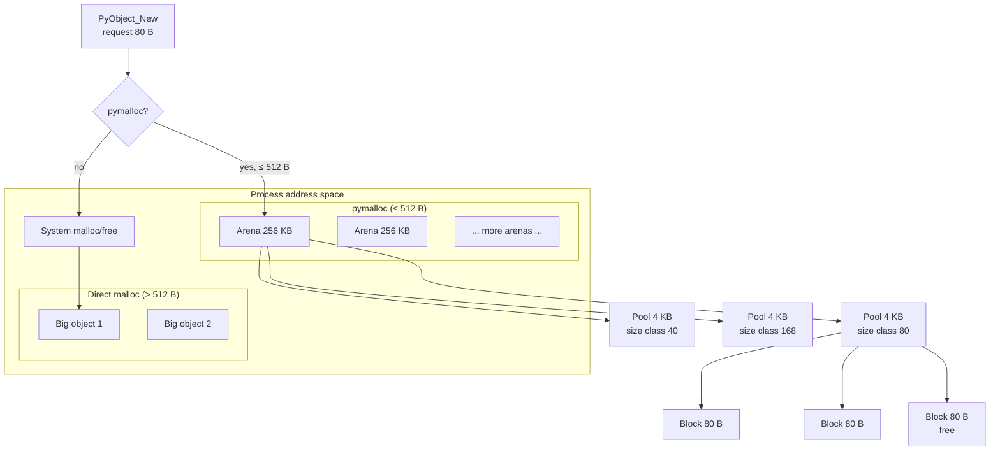
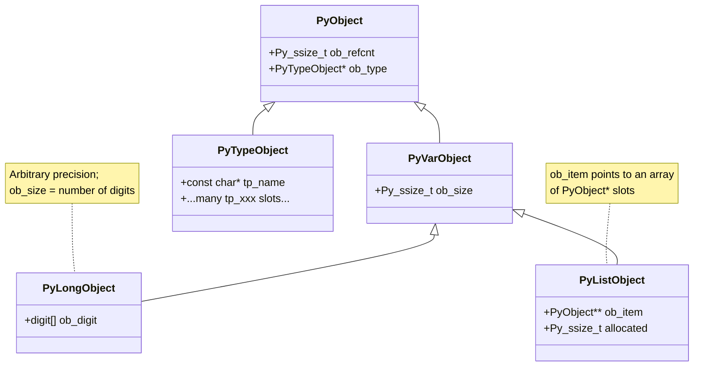
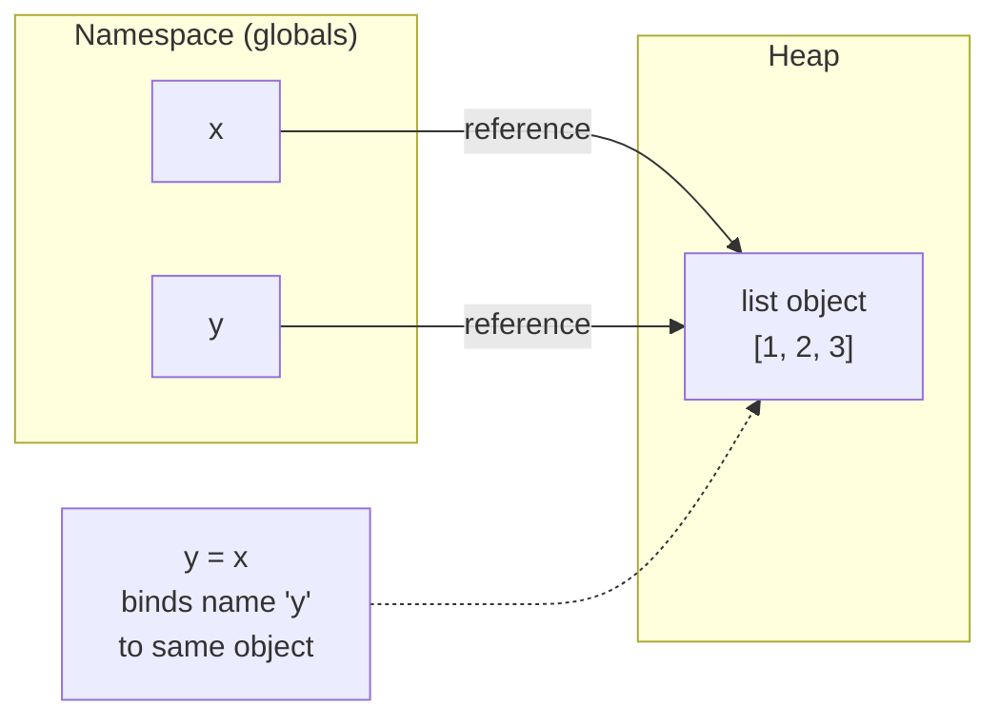
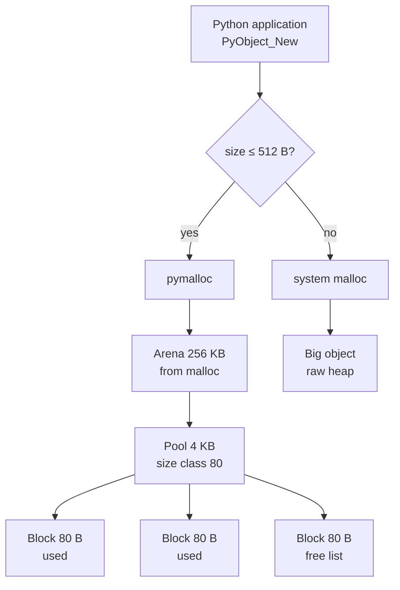

# 1. Python Memory Model

> [!note] Why this note exists
> Most Python developers never think about how memory works until a long-running service balloons to 4 GB, or until a `list.append` inside a hot loop turns a 100 ms operation into a 30 second one. The Python memory model is the foundation that explains **why** Python is slower than C, **why** assignments don't copy, **why** some objects can be mutated through aliases and others can't, and **why** the garbage collector can't always save you from leaks. This note covers the object model (`PyObject` header, refcount, type pointer), reference semantics (names bound to objects, not boxes holding values), the mutable/immutable split, interning of small integers and identifiers, and the layered memory allocator (`pymalloc`: arena → pool → block) that sits between `malloc` and your Python objects. Once these primitives are internalised, every later note in this chapter — [[2. Reference Counting and GC]], [[3. Memory Profiling]], [[5. Optimization Techniques]] — clicks into place.

## Why It Matters

Python's memory model is the single most useful mental model a working Python developer can hold. It explains, at a glance:

- **Why `a = b` doesn't copy a list** and why mutating `b` mutates `a`.
- **Why `id(x)` can change** across statements for immutable types but is stable for mutable ones (mostly).
- **Why `is` is faster than `==`** but answers a different question.
- **Why small integers compare equal with `is`** (`a = 256; b = 256; a is b` is `True`, but `a = 257; b = 257; a is b` may be `False`).
- **Why `__slots__` saves memory** and how it changes the object layout.
- **Why the global interpreter lock (GIL)** exists in the first place — it serialises reference-count updates.
- **Why CPython uses more memory than equivalent C code** — every `int` is a heap-allocated object with an 8-byte type pointer and an 8-byte refcount, plus the value itself.
- **Why generators and lazy iterators** matter for memory — they hold one frame's worth of state instead of materialising a list.

Without this model, you're left memorising rules of thumb ("use generators", "use `__slots__`", "don't use `+=` on strings in a loop"). With it, those rules become obvious consequences of how CPython lays out and manages objects.

## Background

### Everything is an object

In C, an `int` is 4 bytes in a register or on the stack. In Python, an `int` is a heap-allocated `PyLongObject` with:

- An 8-byte type pointer (`ob_type`) pointing to the `int` type object.
- An 8-byte reference count (`ob_refcnt`).
- A variable-length array of "digits" storing the actual integer value (so Python ints are arbitrary-precision).

So `x = 42` costs you **at least 28 bytes** on a 64-bit CPython build — not 4. Multiply that by a million-element list of small ints and you see why NumPy exists.

Every value — integers, floats, strings, lists, functions, classes, modules, `None`, `True`, `False`, even types themselves — is an instance of `PyObject` (or `PyVarObject` for variable-sized types). The two header fields are present on every object, no exceptions.

### Variables are names, not boxes

The single most important shift when moving from C to Python: **variables are not memory locations holding values; they are names bound to objects**. The statement `x = 42` does three things:

1. Allocates (or interns) a `PyLongObject` with value 42.
2. Binds the name `x` in the current namespace to that object.
3. Increments the object's refcount.

`x` is not a box containing 42; `x` is a label pointing at 42. The object 42 may have many labels:

```python
x = 42
y = x
z = 42
# x, y, z may all point to the same interned int object
assert x is y is z   # True for small ints (interned)
```

This explains aliasing:

```python
a = [1, 2, 3]
b = a            # b is a, same list object
b.append(4)
print(a)         # [1, 2, 3, 4]  — a changed because b and a are the same object
```

If you wanted `b` to be an independent copy, you needed `b = a.copy()` or `b = list(a)` or `b = a[:]`. None of these happen automatically.

### Mutable vs immutable

Python types split into two camps:

- **Immutable** (`int`, `float`, `bool`, `str`, `tuple`, `frozenset`, `bytes`): the object's value cannot change after construction. Operations like `+` create **new** objects; `x += 1` rebinds `x` to a new int.
- **Mutable** (`list`, `dict`, `set`, `bytearray`, most user-defined classes): the object's value can change in place. `x.append(1)` mutates the list, not the name.

Immutability is a property of the **object**, not the name. You can always rebind a name:

```python
x = "hello"
x = "world"      # OK — rebinding the name, not mutating "hello"
```

But you cannot mutate `"hello"`:

```python
x = "hello"
x[0] = "H"       # TypeError: 'str' object does not support item assignment
```

Tuples are immutable in the **shallow** sense: the tuple itself can't grow or shrink, and you can't rebind its slots. But if a slot holds a mutable object, that object can still be mutated:

```python
t = ([1, 2], 3)
t[0].append(99)
print(t)         # ([1, 2, 99], 3)  — tuple unchanged, list inside it changed
```

### The `PyObject` header

Every CPython object begins with the same two C fields (in `Include/object.h`):

```c
typedef struct _object {
    Py_ssize_t ob_refcnt;       // reference count
    PyTypeObject *ob_type;      // pointer to type object
} PyObject;
```

Variable-length types add an `ob_size` field:

```c
typedef struct {
    PyObject ob_base;
    Py_ssize_t ob_size;         // number of items (for lists, tuples, etc.)
} PyVarObject;
```

So a list object's C layout looks roughly like:

```
[ ob_refcnt | ob_type | ob_size | ob_item* | allocated ]
```

Where `ob_item` is a pointer to an array of `PyObject*` slots (each slot is 8 bytes on 64-bit). The `allocated` field tracks how much space is reserved — `len(list)` returns `ob_size`, not `allocated`.

This is why a `list[int]` of length 1 million holds roughly:

- 8 bytes × 1 million pointers = 8 MB for the pointer array.
- 28 bytes × 1 million small ints (if not interned) = 28 MB for the int objects themselves (though CPython interns small ints from -5 to 256, so this collapses if values are in that range).

Total: ~36 MB for what would be 4 MB of `int32_t` in C. The price of dynamic typing and reference semantics.

### Interning

CPython pre-allocates and caches certain objects to avoid creating new ones for commonly used values:

- **Small integers**: -5 to 256 are pre-allocated at startup. Any `PyLong_FromLong(42)` returns the cached object, no allocation.
- **Identifier strings**: strings that look like identifiers (only letters, digits, underscores; not starting with a digit) are interned automatically when used as variable names, attribute names, dict keys, etc.
- **Empty tuple `()`**: a singleton — every empty tuple literal is the same object.
- **`None`, `True`, `False`**: singletons.
- **Short ASCII strings in some contexts** (compile-time constants).

You can intern strings manually with `sys.intern()`:

```python
import sys
a = sys.intern("a" * 1000)
b = sys.intern("a" * 1000)
assert a is b   # True — same interned object
```

Interning matters for performance: comparing two interned strings is `O(1)` (pointer equality) instead of `O(n)` (byte-by-byte). If you're doing many string equality checks (e.g., dictionary keys from external input), interning can dramatically speed things up — but at the cost of permanently holding those strings in memory.

### The memory allocator: `pymalloc`

CPython doesn't call `malloc` for every object. There's a custom allocator called **pymalloc** that handles small allocations (≤ 512 bytes) through a three-layer scheme:

- **Arena**: 256 KB chunk from `malloc`. Many arenas exist; freed arenas return to the OS.
- **Pool**: 4 KB slice of an arena, dedicated to one size class.
- **Block**: the actual storage for an object, sized to one of ~64 size classes (8, 16, 24, …, 512 bytes).

When you allocate an 80-byte object, pymalloc finds a pool for the 80-byte size class and hands you a free block. When you free it, the block goes back to that pool's free list — no `free()` call. This dramatically reduces malloc/free overhead for the millions of small objects Python creates.

Large allocations (> 512 bytes) go straight to `malloc`/`free`. So do raw `bytes` and `bytearray` whose size exceeds the threshold.



You can disable pymalloc with the `PYTHONMALLOC=malloc` environment variable — useful for debugging memory corruption with tools like Valgrind or AddressSanitizer.

## Main content

### Names, objects, and namespaces

A Python **namespace** is a mapping from names to objects. Examples:

- The module's global namespace (`globals()`).
- A function's local namespace (`locals()`).
- A class body namespace.
- An object's attribute namespace (`__dict__`).

A **name binding** makes a name in some namespace refer to an object. The `=`, `def`, `class`, `import`, `for`, `with ... as`, `except ... as`, and function parameter declarations all bind names.

When you read a name, Python looks it up in `locals()`, then `globals()`, then `builtins()`. (Enclosing function scopes for closures are checked between locals and globals — see [[5. Scope and Closures]].)

```python
x = 10          # binds 'x' in globals()

def f():
    x = 20      # binds 'x' in locals() of f — shadows global
    print(x)    # 20

f()
print(x)        # 10 — global x is untouched
```

To rebind a global name from inside a function, use `global x`. To rebind an enclosing function's name, use `nonlocal x`. These statements don't make names magically global; they tell the compiler to emit `STORE_DEREF` or `STORE_GLOBAL` instead of `STORE_FAST`.

### Identity, equality, and `is`

- **Identity**: "is this the same object in memory?" — `id(x)`, `x is y`. In CPython, `id(x)` is the address of the object.
- **Equality**: "do these objects represent the same value?" — `x == y`, calls `__eq__`.

`is` is fast (pointer comparison) and answers a different question than `==`. Use `is` for:

- Singletons: `x is None`, `x is True`, `x is False`, `x is Ellipsis`.
- Sentinel objects: `_UNSET = object(); if value is _UNSET`.
- Interned strings you control.

Avoid `is` for numbers and strings you don't control:

```python
a = 256; b = 256
a is b          # True — small int cache

a = 257; b = 257
a is b          # False in REPL, True in a .py module (constant folding)
```

The "True in module, False in REPL" trap is the classic `is` gotcha. Always use `==` for value comparison; reserve `is` for identity.

### Reference semantics in detail

```python
def modify(lst):
    lst.append(4)

a = [1, 2, 3]
modify(a)
print(a)         # [1, 2, 3, 4] — list passed by object reference, not copy
```

Python is neither pass-by-value nor pass-by-reference in the C sense — it's **pass-by-object-reference** (sometimes called "pass-by-sharing" or "pass-by-assignment"). The function receives a copy of the reference (the pointer), not a copy of the object. Mutating the object through that reference affects the caller's view. Rebinding the parameter name does not.

```python
def rebind(lst):
    lst = [10, 20, 30]    # rebinds local name 'lst', caller's list untouched

a = [1, 2, 3]
rebind(a)
print(a)         # [1, 2, 3] — rebind doesn't escape the function
```

This is the source of countless beginner bugs and the reason "default argument" patterns matter (see [[1. Function Basics]]).

### Mutable vs immutable in practice

| Type | Mutable? | Notes |
|---|---|---|
| `int`, `float`, `complex`, `bool` | No | Arithmetic creates new objects |
| `str` | No | Concatenation creates new strings; `+=` on a name may rebind to a new string |
| `bytes` | No | Like `str` but raw bytes |
| `tuple` | No | But elements can be mutable |
| `frozenset` | No | Immutable `set` |
| `list`, `dict`, `set` | Yes | In-place ops: `append`, `update`, `add` |
| `bytearray` | Yes | Mutable `bytes` |
| User-defined class | Yes by default | Unless using `@dataclass(frozen=True)` or `__slots__` with care |

The mutable/immutable split is the **most cited** rule in Python, and the most misunderstood. The key insight: immutability is about the object's *value*, not its *lifetime*. An immutable object can still be garbage-collected when no names refer to it; it just can't be mutated while alive.

### Why `+=` on immutable strings isn't always terrible

```python
s = ""
for word in words:
    s += word     # creates new string each iteration — O(n^2)
```

This is the classic "don't build strings with `+=`" advice. The reason: each `+=` allocates a new string of length `len(s) + len(word)`, copies the old bytes, copies the new bytes, and rebinds `s`. Total work: O(n²).

**But** CPython has an optimisation: if the old string has refcount 1 (no other names, no intern table, no weak references), `+=` resizes in place. This makes the loop O(n) in practice for the common case. **Do not rely on this** — other Python implementations (PyPy, Jython) and even edge cases in CPython (the string being interned, etc.) won't get the optimisation. Always use `"".join(words)` for production code.

### `__slots__` and memory layout

By default, instances of a class store attributes in a `__dict__` (a hash table). That's flexible but memory-heavy: a class with three attributes per instance costs roughly:

- 56 bytes for the instance header (`PyObject` + `PyGC_Head`).
- 232 bytes for an empty dict (with the three keys).
- ~288 bytes total per instance.

For one million instances, that's ~288 MB. With `__slots__`:

```python
class Point:
    __slots__ = ('x', 'y', 'z')
    def __init__(self, x, y, z):
        self.x, self.y, self.z = x, y, z
```

Each instance stores `x`, `y`, `z` as fixed-offset slots in the object's C struct — no `__dict__`. Total per instance: ~80 bytes. One million instances: ~80 MB — a 3.6× memory savings.

Trade-offs:

- You lose the ability to add arbitrary attributes.
- `__dict__` and `__weakref__` aren't present unless you add them to `__slots__` explicitly.
- Inheritance is trickier: subclasses must also define `__slots__ = ()` (or list their own slots) or they get a `__dict__` and undo your savings.
- Pickling, copying, and some metaprogramming may need adjustment.

Use `__slots__` when you have many instances of a small data class and memory matters. Don't bother for one-off objects or classes with few instances.

### How Python lays out an integer

A small int (value ≤ 2³⁰ − 1) in CPython:

```c
struct PyLongObject {
    Py_ssize_t ob_refcnt;       // 8 bytes
    PyTypeObject *ob_type;      // 8 bytes
    Py_ssize_t ob_size;         // 8 bytes — number of digits, sign encoded
    digit ob_digit[1];          // 4 bytes (30-bit digits)
};
```

For values that fit in one 30-bit digit (0 to 2³⁰ − 1 ≈ 1 billion), that's 28 bytes total. Larger ints allocate more digits. Negative numbers store `ob_size = -1`. Zero is a single-digit zero. This is why Python's `int` is arbitrary-precision but also why it's much heavier than C's `int`.

### Why a list of ints is memory-heavy

```python
ints = list(range(1_000_000))   # 1M ints from 0 to 999_999
```

Memory breakdown:

- The list object: ~8 KB for the pointer array (1M × 8 bytes = 8 MB actually).
- For each int from 0 to 256: interned (free, reuses pre-allocated singletons).
- For each int from 257 to 999_999: ~28 bytes × ~999_744 ≈ 28 MB.

Total: ~36 MB. An `array.array('l', range(1_000_000))` would be 8 MB. A NumPy `np.arange(1_000_000, dtype=np.int64)` would be 8 MB and far faster for arithmetic.

The lesson: when you have homogeneous numeric data and memory or speed matters, **use `array` or NumPy, not `list`**.

## Mermaid: Python object model



## Mermaid: name binding and aliasing



The arrows are name → object references. Both `x` and `y` point to the same list; mutating through either name affects the same memory.

## Mermaid: pymalloc layers



## Code examples

### Demonstrating aliasing and identity

```python
import sys

a = [1, 2, 3]
b = a                # alias — same object
c = a.copy()         # shallow copy — new list, same elements

print(a is b)        # True
print(a is c)        # False
print(a == c)        # True — same value, different object

b.append(4)
print(a)             # [1, 2, 3, 4]  — alias mutation visible through a
print(c)             # [1, 2, 3]     — copy unaffected

print(sys.getrefcount(a))  # at least 2: 'a' and the temporary arg to getrefcount
```

### Demonstrating small int interning

```python
for n in (-5, 0, 100, 256, 257, 1000):
    a = n
    b = n
    # In a .py file (constant folding), `a is b` may be True for all of these.
    # In a REPL, it's True only for n in [-5, 256].
    print(f"{n:>5}: a is b = {a is b}")
```

### `__slots__` memory comparison

```python
import sys
import tracemalloc

class WithDict:
    def __init__(self, x, y, z):
        self.x, self.y, self.z = x, y, z

class WithSlots:
    __slots__ = ('x', 'y', 'z')
    def __init__(self, x, y, z):
        self.x, self.y, self.z = x, y, z

def measure(cls, n=100_000):
    tracemalloc.start()
    objs = [cls(1, 2, 3) for _ in range(n)]
    current, peak = tracemalloc.get_traced_memory()
    tracemalloc.stop()
    return peak / 1e6

print(f"WithDict: {measure(WithDict):.1f} MB")   # ~30 MB
print(f"WithSlots: {measure(WithSlots):.1f} MB")  # ~8 MB
```

### Manual string interning for fast lookups

```python
import sys

# Reading millions of CSV rows where column 0 is one of a small set of category strings.
# Without interning, each row creates a new str object — equality is O(n) per string.
categories = ["spam", "ham", "eggs", "bacon"]
interned = {sys.intern(c) for c in categories}

def categorise(label):
    return sys.intern(label) in interned   # O(1) pointer compare after interning
```

### `id()` and identity over time

```python
x = 42
print(id(x))    # some integer, say 140234868467856

x = x + 1       # x now refers to a NEW object (43), old 42 object unchanged
print(id(x))    # different integer

# But for a list:
y = [1, 2, 3]
print(id(y))    # say 140234868468000
y.append(4)
print(id(y))    # same — mutation in place doesn't change identity
```

### Inspecting the `__dict__` vs slots layout

```python
class A:
    pass

class B:
    __slots__ = ('x', 'y')

a = A()
a.x = 10
print(a.__dict__)   # {'x': 10}

b = B()
b.x = 10
print(hasattr(b, '__dict__'))   # False
print(b.x)            # 10
try:
    b.z = 99          # AttributeError: 'B' object has no attribute 'z'
except AttributeError as e:
    print(e)
```

## Common Pitfalls

1. **Treating `=` as a copy.** `b = a` for a list, dict, or set creates an alias, not a copy. Use `b = a.copy()` (shallow) or `b = copy.deepcopy(a)` for nested structures.

2. **Using `is` where `==` is meant.** `if x is "yes":` works only because of interning luck; `if x == "yes":` is correct.

3. **Assuming small-int interning extends past 256.** It doesn't. `1000 is 1000` is False in the REPL, True in a module (due to constant folding). Don't rely on identity for value comparison.

4. **Mutable default arguments.** `def f(items=[]):` shares one list across all calls. Use `def f(items=None): if items is None: items = []`. See [[1. Function Basics]].

5. **Forgetting `tuple` is shallowly immutable.** `t = ([1, 2],)` then `t[0].append(3)` succeeds; only the tuple's slots can't be reassigned.

6. **Using `+=` to build large strings.** Use `"".join(parts)` instead. CPython has an in-place optimisation, but don't rely on it.

7. **Building a million-object `list[int]` instead of `array.array('l', ...)` or `np.array(...)`.** The Python list of ints costs ~5× more memory and is far slower for arithmetic.

8. **Defining `__slots__` in a subclass without inheriting from a slotted parent.** If the parent has `__dict__`, the subclass gets one too; `__slots__` only helps if the entire hierarchy uses it.

9. **Interning strings permanently.** Interned strings live until interpreter shutdown. Interning many unique strings in a long-running server leaks memory.

10. **Expecting `id()` to be stable across runs.** `id()` is a memory address; ASLR randomises addresses between runs. Use it for identity within a single process.

11. **Confusing object equality with hash equality.** Two objects can be `==` but have different `id()`. Two objects with the same `hash()` may not be `==` (hash collisions are normal). Dict membership uses both `hash()` and `==`.

12. **Modifying a list while iterating it.** Mutating a list during a `for` loop changes indices and skips elements. Iterate over a copy: `for x in list(my_list):` or use a comprehension to build a new list.

## Tips and Tricks

- **Use `sys.getsizeof(obj)` to see the shallow size of a single object.** For nested structures, walk it manually or use `pympler.asizeof`.
- **Use `id()` and `is` in debugging to confirm whether two variables are aliases.** A `print(a is b)` in a failing test is often more illuminating than `print(a, b)`.
- **`sys.intern` long-lived strings used as dict keys** when the key set is bounded and you do many lookups (e.g., parsing log files with a fixed set of tag values).
- **Use `array.array` for homogeneous numeric data when NumPy isn't available.** It's still Python-side iteration, but memory is contiguous and small.
- **`__slots__` for data classes with many instances.** Pair with `@dataclass(slots=True)` (Python 3.10+) for the cleanest syntax.
- **Prefer `tuple` over `list` for fixed-size records** — tuples are slightly smaller and marginally faster to construct.
- **Use `bytes`/`bytearray` instead of `list[int]` for binary data.** The `struct` module unpacks/packs C-like records from `bytes`.
- **Profile before optimising.** Don't add `__slots__` to a class with 10 instances; do add it to one with a million. See [[3. Memory Profiling]].
- **`copy.copy` is shallow; `copy.deepcopy` recursively copies.** Know which one you need.
- **Avoid object cycles with `__del__`.** A `__del__` method makes an object un-GC-able in cycles in older Pythons; even in modern CPython, it forces the cyclic GC to do extra work.
- **For long-running processes, periodically call `gc.collect()`** after large object deallocation bursts — the cyclic GC runs on heuristics and may lag.
- **`weakref.WeakValueDictionary`** for caches that don't keep objects alive — entries vanish when the only other reference to the value goes away.

## Active Recall

1. What are the two fields every Python object has in its `PyObject` header?
2. Is Python pass-by-value, pass-by-reference, or something else? Explain with an example.
3. Why does `a = 256; b = 256; a is b` return `True`, but `a = 257; b = 257; a is b` may return `False`?
4. What is the difference between `x = x + 1` and `x += 1` for an `int`? For a `list`?
5. Write a snippet that demonstrates shallow vs deep copy for a list of lists.
6. What does `sys.getrefcount(x)` return, and why is it always at least 2?
7. Describe the three layers of pymalloc and the size threshold that triggers them.
8. Why does a `list[int]` of length 1 million consume ~36 MB while an `array.array('l', ...)` of the same values consumes 8 MB?
9. What does `__slots__` change about an object's memory layout? What are its limitations?
10. How would you intern a string? When is interning beneficial? When is it harmful?
11. Is a tuple containing a list "immutable"? Explain.
12. Why doesn't `s += "x"` in a loop always cause O(n²) behaviour in CPython, and why shouldn't you rely on it?
13. What does `id()` return in CPython? Is it stable across interpreter runs?
14. Write a small class with `__slots__ = ('x', 'y')` and a subclass that also uses `__slots__` correctly.
15. How do you disable pymalloc, and when would you want to?
16. What happens to the refcount of `42` when you do `x = 42; y = x; del x; del y`?
17. Why is `is` faster than `==`, and what question does each answer?
18. Explain why a `dict` with `int` keys 0..256 uses less memory than the same dict with `int` keys 10000..10256.
19. What is the `ob_size` field in `PyVarObject` used for?
20. If you have a million small objects in memory, what are three concrete things you can do to reduce footprint?

## Next Steps

- [[2. Reference Counting and GC]] — the `PyObject` header's `ob_refcnt` is the foundation of CPython's primary GC mechanism.
- [[3. Memory Profiling]] — `tracemalloc`, `memory_profiler`, and `memray` build on this model to show you where memory goes.
- [[5. Optimization Techniques]] — `__slots__`, generators, built-ins, and algorithmic improvements all flow from this model.
- [[1. Variables and Data Types]] — the introductory treatment of mutable vs immutable types.
- [[5. Dictionaries Deep Dive]] — dict internals rely heavily on the hash table + PyObject pointer layout described here.
- [[1. CPython Architecture]] — the source-tree view of `Objects/`, `Python/`, and `Include/` where the `PyObject` struct lives.
- [[4. The Object Model]] — the deeper C-level view of `PyObject`, `PyVarObject`, and `PyTypeObject`.
