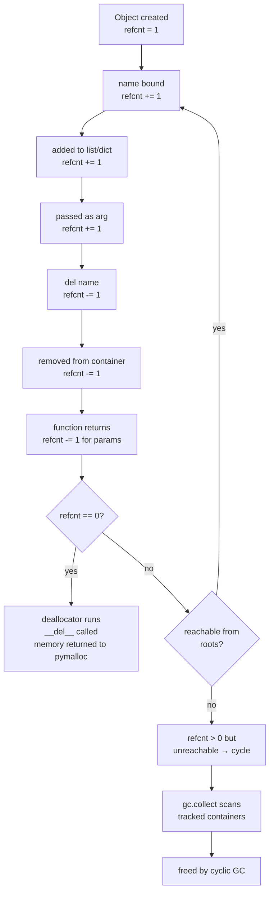
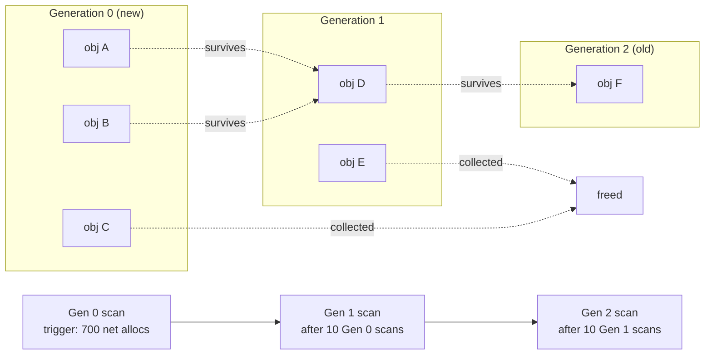
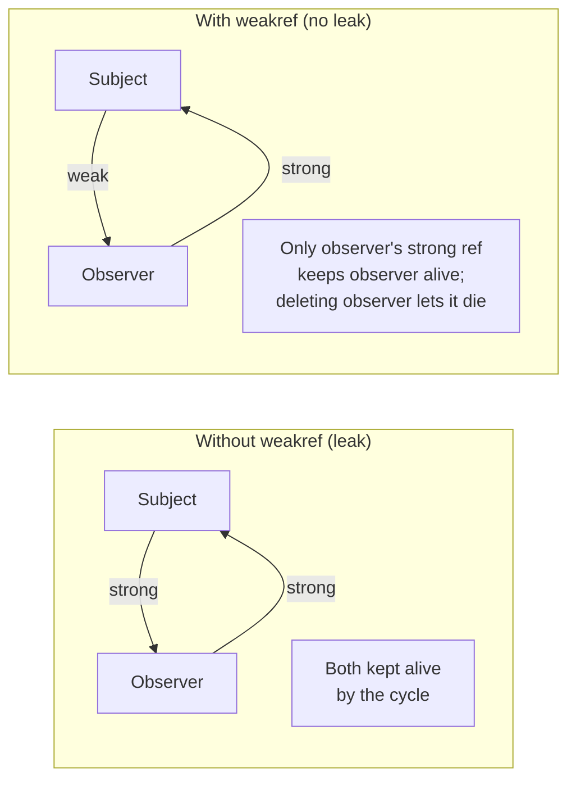

# 2. Reference Counting and GC

> [!note] Why this note exists
> CPython has **two** garbage collectors running in cooperation: a primary **reference-counting** collector that frees objects the instant their refcount hits zero, and a secondary **generational cyclic** collector that breaks reference cycles the refcount mechanism can't handle. This dual design is unique among mainstream languages (most use either tracing or refcounting alone) and it explains both Python's strengths — predictable, immediate cleanup — and its weaknesses — cycle leaks, GIL contention on refcount updates, and `__del__` quirks. This note covers the mechanics of refcounting, `sys.getrefcount()`, cyclic references and why they break the basic mechanism, the three-generation cyclic GC, the `gc` module API (`gc.collect()`, `gc.get_threshold()`, `gc.disable()`), finalisers and `__del__`, and **weak references** as the standard escape hatch for caches and observer patterns. Reading [[1. Python Memory Model]] first is recommended — refcounting operates on the `ob_refcnt` field of every `PyObject`.

## Why It Matters

Understanding CPython's GC is essential for any of the following real-world scenarios:

- **A long-running web server slowly leaks memory** until OOM-killed. The cause is almost always a reference cycle through a `__del__` method, a closure capturing `self`, or a global registry that never unregisters.
- **A library crashes when its `__del__` runs at an unexpected time** — during interpreter shutdown, inside a thread holding a lock, or after a parent object has already been torn down.
- **A cache keeps objects alive forever** because the cache itself holds the only reference, and `del` on the user side doesn't free the underlying object. The fix is `weakref`.
- **A `WeakValueDictionary` causes "use after free" bugs** because the entry vanished mid-call. Knowing when weak refs are appropriate is half the battle.
- **A hot loop is slow because of refcount churn** — each `for x in big_list` increments and decrements a refcount on every iteration.
- **A C extension leaks** because it forgot to `Py_DECREF` a borrowed reference, or double-freed because it `Py_DECREF`d a borrowed one.
- **You want to disable the GC for performance** (some workloads gain 5–10% by turning off the cyclic collector, paying only the cost of leak detection).

Every one of these is a daily occurrence in production Python code. The refcount + cyclic GC model is the lens through which they make sense.

## Background

### The `ob_refcnt` field

Every `PyObject` (and `PyVarObject`) begins with a `Py_ssize_t ob_refcnt` field — the number of references to this object that currently exist. The field is updated on these events:

| Event | Effect on refcount |
|---|---|
| Name binding `x = obj` | +1 |
| Passing as argument to a function | +1 (for the parameter) |
| Adding to a container `lst.append(obj)` | +1 |
| `del x` | −1 |
| Container goes out of scope / is cleared | −1 for each element |
| Function returns | −1 for each parameter |
| `Py_INCREF(obj)` from C | +1 |
| `Py_DECREF(obj)` from C | −1 (and free if zero) |

When `ob_refcnt` reaches zero, CPython **immediately** calls the object's deallocator, which frees its memory (returning it to pymalloc or to the system allocator). This is the primary GC mechanism — there is no "stop the world" pause for ordinary deallocation.

### Reference counting is deterministic

Unlike tracing GCs (Java, .NET, V8) where finalisers run at unpredictable times, CPython's refcounting makes object lifetime **deterministic**: the moment the last reference goes away, `__del__` runs. This is why `with` blocks and `__del__` work as expected:

```python
class Resource:
    def __init__(self, name):
        self.name = name
        print(f"acquired {name}")
    def __del__(self):
        print(f"released {self.name}")

def use():
    r = Resource("db-conn")
    # ... use r ...
use()
# Output:
#   acquired db-conn
#   released db-conn     ← runs as `use` returns, refcount of r drops to 0
```

In Java, the equivalent `finalize()` method might run seconds later, or never. In Python, you can rely on it.

### `sys.getrefcount()`

```python
import sys

x = [1, 2, 3]
print(sys.getrefcount(x))   # 2 — 'x' and the temporary arg to getrefcount

y = x
print(sys.getrefcount(x))   # 3 — 'y' added a reference

lst = [x]
print(sys.getrefcount(x))   # 4 — 'lst[0]' added a reference

del y
print(sys.getrefcount(x))   # 3
```

`sys.getrefcount(obj)` returns the current refcount. The result is always at least 2 when you call it on a local variable: one for the local name, one for the temporary argument inside `getrefcount` itself. Many CPython internals also hold references (e.g., the interned small int `0` has a refcount in the thousands).

### What refcounting can't handle: cycles

```python
class Node:
    def __init__(self):
        self.parent = None
        self.children = []

a = Node()
b = Node()
a.children.append(b)
b.parent = a       # cycle: a → b → a

del a, b
# Refcounts of both objects are 1 (each holds a reference to the other).
# Neither is reachable from any name. Neither gets freed.
```

Reference counting cannot break cycles: each object's refcount is 1 (held by the other), so neither hits zero. This is the textbook failure mode of pure refcounting, and the reason CPython adds a second collector.

### The generational cyclic GC

CPython's `gc` module implements a **tracing** collector that runs periodically to find unreachable cycles. It divides objects into three generations:

- **Generation 0**: newly allocated objects. Scanned most often.
- **Generation 1**: objects that survived one Gen 0 scan.
- **Generation 2**: objects that survived a Gen 1 scan. Scanned least often.

This is the classic "generational hypothesis": most objects die young. Scanning only Gen 0 most of the time finds most garbage cheaply.

The GC triggers a Gen 0 scan when the number of allocations minus deallocations since the last scan exceeds a threshold. By default, `gc.get_threshold()` returns `(700, 10, 10)` — meaning Gen 0 scans after every 700 net allocations, Gen 1 scans after every 10 Gen 0 scans, Gen 2 scans after every 10 Gen 1 scans.

```python
import gc

print(gc.get_threshold())   # (700, 10, 10)
gc.collect()                # force a full collection, returns collected count
gc.disable()                # turn off the cyclic GC entirely (refcounting still works)
gc.enable()
```

The cyclic GC only considers objects that opt in via the `Py_TPFLAGS_HAVE_GC` type flag — i.e., objects whose type might participate in cycles (lists, dicts, custom classes, etc.). Immutable types like `int` and `str` are not tracked: they can't form cycles, so scanning them is wasted work.

### `__del__`, finalizers, and the cyclic GC

When objects with `__del__` form unreachable cycles, the situation gets thorny:

- In CPython < 3.4, such cycles were not collected — `__del__` couldn't be safely called because the order was ambiguous. They leaked until interpreter shutdown.
- PEP 442 (Python 3.4+) changed this: cycles with `__del__` are now collected, with finalisers called in a "safe" order. But the order isn't always intuitive.

For deterministic cleanup, prefer **context managers** (`with` blocks and `__enter__`/`__exit__`) over `__del__`. `__del__` is a safety net, not a primary cleanup mechanism.

### Weak references

A **weak reference** is a reference to an object that **does not** increment its refcount. When the object's refcount drops to zero (from strong references), the weak reference becomes "dead" — accessing it returns `None`.

```python
import weakref

class Config:
    pass

c = Config()
r = weakref.ref(c)
print(r())         # <Config object at 0x...>
del c
print(r())         # None — the referent is gone
```

Weak references are the standard mechanism for:

- **Caches**: store weak refs so cached entries vanish when the object is no longer used elsewhere.
- **Observer patterns**: a subject holds weak refs to observers, so destroying an observer doesn't keep it alive via the subject's list.
- **Memoisation without leaks**: `WeakValueDictionary` maps keys to weak refs of values.
- **Finalisation callbacks**: `weakref.finalize(obj, callback)` calls `callback` when `obj` is collected.

```python
import weakref

cache = weakref.WeakValueDictionary()

class Big:
    def __init__(self, n): self.n = n

b = Big(1)
cache['one'] = b
print(cache['one'].n)   # 1

del b
print('one' in cache)   # False — entry vanished when b died
```

## Main content

### Reference counting in detail

Every assignment, return, container insertion, and C-API call updates refcounts. A few subtle cases:

**Tuple unpacking** updates refcounts once per name:
```python
a, b = obj, obj   # obj.refcnt += 2
```

**Function arguments**: each parameter is a new reference. When the function returns, all locals are decremented.

**`sys.getrefcount(x)` itself**: passing `x` adds a reference inside the function, so the answer is always at least 2 for a local.

**Temporary references in expressions**: `f(x).g(x)` — the result of `f(x)` is held until the statement completes, then decremented.

**Iterators**: `for x in seq` increments `seq`'s refcount (the iterator holds it), increments each `x`'s refcount during the iteration body, and decrements `x` at the end of each iteration.

### The cyclic GC algorithm in brief

When a collection runs:

1. **Identify candidate cycles**. The GC iterates over objects in the target generation, treating each as a node in a graph (with edges from container to contained objects).
2. **Compute reachable set**. Starting from root references (each object's refcount minus internal references), it does a DFS.
3. **Mark unreachable objects**. Objects not in the reachable set are unreachable, even if their refcount is non-zero (because they only have internal cycle references).
4. **Call finalisers** in a safe order.
5. **Free unreachable objects**.

The GC tracks only "container" objects (types with `Py_TPFLAGS_HAVE_GC`). Simple types like `int` and `str` are never scanned.

### Tuning the GC

```python
import gc

# Defaults
print(gc.get_threshold())   # (700, 10, 10)

# Tighter threshold: scan more often, less memory pressure, more CPU
gc.set_threshold(500, 8, 8)

# Looser threshold: scan less often, more memory pressure, less CPU
gc.set_threshold(50000, 10, 10)

# Disable entirely (some long-running services do this and call gc.collect() manually)
gc.disable()
```

Workloads that benefit from disabling the cyclic GC:

- **Request handlers** where each request creates short-lived cycle-free objects — refcounting handles them deterministically, the GC just adds overhead.
- **Numerical code** that doesn't create custom classes — built-in types like `int`, `float`, `list` rarely cycle.
- **Batch processing** where you'd rather call `gc.collect()` once between batches than have it fire mid-batch.

Workloads that **should not** disable the GC:

- **Web frameworks** with lots of closures and user-defined classes — cycles are common.
- **Anything using `__del__` for cleanup** — disabling the GC will cause cycle leaks.

### `gc` module API cheat sheet

```python
import gc

gc.collect(generation=2)         # collect; default is full collection
gc.collect()                     # returns (collected, uncollectable) tuple

gc.get_objects()                 # list all tracked objects (memory-heavy!)
gc.get_referrers(obj)            # list objects that reference obj
gc.get_referents(obj)            # list objects obj references

gc.get_threshold()               # (700, 10, 10)
gc.set_threshold(700, 10, 10)

gc.disable() / gc.enable()
gc.isenabled()

gc.set_debug(gc.DEBUG_STATS | gc.DEBUG_LEAK)   # verbose collection logs

gc.callbacks                     # list of callbacks invoked before/after collection
gc.garbage                       # list of objects the GC couldn't free (cycles with __del__ in old Pythons)
```

`gc.get_referrers(obj)` is invaluable for debugging leaks — it shows you what's holding a reference to a supposedly-dead object.

### Finalizers: `__del__` vs `weakref.finalize` vs `atexit`

| Mechanism | When it runs | Deterministic? | Caveats |
|---|---|---|---|
| `__del__` | When refcount hits 0 (or GC breaks a cycle) | Yes (mostly) | Order ambiguous in cycles; can resurrect object |
| `weakref.finalize(obj, callback, *args)` | When obj is collected | Yes | Cleaner than `__del__`; doesn't resurrect |
| `atexit.register(func)` | At interpreter exit | No (only at exit) | For process-wide cleanup |
| `contextlib.exit` / `with` | At end of `with` block | Yes | **Preferred** for resource cleanup |

```python
import weakref

class FileHandle:
    def __init__(self, path):
        self.fd = open(path)
        # Safety net: close if GC'd before explicit close
        self._finalize = weakref.finalize(self, self.fd.close)

    def close(self):
        self._finalize()   # runs the callback, then detaches so it won't run again
        self.fd = None
```

### Resurrection

A `__del__` method can "resurrect" an object by storing `self` somewhere reachable:

```python
import gc

zombie = []

class Z:
    def __del__(self):
        zombie.append(self)   # resurrects!

z = Z()
del z
gc.collect()
print(zombie)   # [<Z object at 0x...>] — z is alive again
```

The object isn't freed because `__del__` re-added a reference. The next time it becomes unreachable, `__del__` is **not** called again (CPython only calls `__del__` once per object, even through multiple unreachable transitions). Don't rely on resurrection — it's a footgun.

### Refcounting and the GIL

Because every assignment and container operation touches `ob_refcnt`, refcount updates must be thread-safe. CPython protects them with the **Global Interpreter Lock** — only one thread executes Python bytecode at a time. This is the historical reason for the GIL, and the reason removing it is hard: every `Py_INCREF`/`Py_DECREF` would need atomic operations or locks, slowing single-threaded code.

PEP 683 (Python 3.12+) introduced "immortal objects" — objects with refcount set to a special value (`_Py_IMMORTAL_REFCNT`) that never changes. Singletons like `None`, `True`, `False`, small ints, and certain interned strings are immortal, eliminating refcount churn on the most-used objects and paving the way for future GIL-removal work (PEP 703, the no-GIL build).

### Weak references in practice

**WeakValueDictionary** — the standard memoisation pattern:

```python
import weakref

class Expensive:
    def __init__(self, n): self.n = n

_cache = weakref.WeakValueDictionary()

def get(n):
    try:
        return _cache[n]
    except KeyError:
        obj = Expensive(n)
        _cache[n] = obj
        return obj
```

The cache holds only weak references. When the caller drops their reference, the cache entry dies — preventing unbounded growth.

**WeakSet** — observer pattern without leaks:

```python
import weakref

class Subject:
    def __init__(self):
        self._observers = weakref.WeakSet()

    def subscribe(self, observer):
        self._observers.add(observer)

    def notify(self, event):
        for obs in self._observers:
            obs.handle(event)
```

Observers can be GC'd without unsubscribing — the `WeakSet` drops dead entries.

**Finalize** — modern alternative to `__del__`:

```python
import weakref

def cleanup(path):
    import os
    if os.path.exists(path):
        os.unlink(path)

class TempFile:
    def __init__(self, path):
        self.path = path
        open(path, 'w').close()
        weakref.finalize(self, cleanup, path)
```

## Mermaid: reference counting lifecycle



## Mermaid: generational GC



## Mermaid: weak references breaking cycles



## Code examples

### Observing refcount changes

```python
import sys

x = []
print(sys.getrefcount(x))   # 2

y = x
print(sys.getrefcount(x))   # 3

container = [x, x, x]
print(sys.getrefcount(x))   # 6 (3 in container + x + y + temp)

del y, container
print(sys.getrefcount(x))   # 2
```

### Detecting a cycle leak

```python
import gc

class Node:
    def __init__(self, name):
        self.name = name
        self.parent = None
        self.children = []

# Build a cycle
a = Node('a')
b = Node('b')
a.children.append(b)
b.parent = a

# Break all external references
del a, b

# Without GC, both would leak. With GC:
collected = gc.collect()
print(collected)   # 2 — both Nodes collected

# Show the gc.garbage list (objects that couldn't be freed due to __del__)
print(gc.garbage)
```

### Tuning the GC for a batch workload

```python
import gc

def run_batch(items):
    gc.disable()
    try:
        for item in items:
            process(item)   # creates many short-lived objects, no cycles
    finally:
        gc.enable()
        gc.collect()        # one big collection at the end
```

### `WeakValueDictionary` cache

```python
import weakref

class Image:
    def __init__(self, name):
        self.name = name
        print(f"  loading {name}")

_cache = weakref.WeakValueDictionary()

def get_image(name):
    img = _cache.get(name)
    if img is None:
        img = Image(name)
        _cache[name] = img
    return img

img1 = get_image("cat.png")   # loading cat.png
img2 = get_image("cat.png")   # cache hit, no reload
print(img1 is img2)           # True
del img1, img2
print("cat.png" in _cache)    # False — entry gone
```

### `weakref.finalize` for resource cleanup

```python
import weakref

class TempDir:
    def __init__(self, path):
        import os, tempfile
        self.path = path
        os.makedirs(path, exist_ok=True)
        self._finalize = weakref.finalize(self, self._cleanup, path)

    @staticmethod
    def _cleanup(path):
        import shutil
        shutil.rmtree(path, ignore_errors=True)
        print(f"  cleaned up {path}")

t = TempDir("/tmp/foo")
del t   # "cleaned up /tmp/foo"
```

### Using `gc.get_referrers` to find a leak

```python
import gc

class Leaked:
    pass

obj = Leaked()

# Simulate a leak — some global registry holds a reference
_REGISTRY = []
_REGISTRY.append(obj)

del obj
# obj should be gone... but is it?

# Find what's still holding a reference
for ref in gc.get_referrers(Leaked):
    print(type(ref).__name__, ref if isinstance(ref, list) else "...")
# Prints: list [...]
```

### Immortal objects in Python 3.12+

```python
import sys

# In CPython 3.12+, None/True/False/small ints are "immortal":
# their refcount is a special value that never changes.
print(sys.getrefcount(None))   # very large — was ~the number of references,
                                # now a sentinel value (often 2^63 - 1 or similar)
```

## Common Pitfalls

1. **Cycles through `__del__`.** A class with `__del__` whose instances form cycles can leak (in Pythons before 3.4) or be collected in non-deterministic order (3.4+). Avoid `__del__`; use context managers or `weakref.finalize`.

2. **Closures capturing `self`.** `def callback(self=self): self.handler()` is fine; `def callback(): self.handler()` keeps `self` alive forever if the callback is stored globally. This is the most common web-framework leak.

3. **Global registries.** A `@register` decorator that appends to a module-level list keeps every decorated class alive forever. Provide an `unregister` function, or use `WeakSet`.

4. **Caching with `dict` instead of `WeakValueDictionary`.** A plain `dict` cache grows without bound. Use `WeakValueDictionary` or `functools.lru_cache(maxsize=N)` to bound it.

5. **Disabling the GC for code that creates cycles.** `gc.disable()` doesn't disable refcounting — short-lived objects still get freed — but cycles leak forever. Only disable in workloads where you know there are no cycles.

6. **Expecting `__del__` to run at interpreter exit.** It usually does, but not always for objects in cycles or in modules with circular imports. Use `atexit` for guaranteed exit-time cleanup.

7. **Resurrection in `__del__`.** Storing `self` somewhere reachable in `__del__` resurrects the object; `__del__` won't be called again on subsequent collection.

8. **Weak references to non-weak-referenceable types.** `int`, `str`, `tuple`, `list` don't support weakrefs by default. Subclass them or add `__weakref__` to `__slots__` if you need weakrefs.

9. **`gc.get_referrers` returning surprising results.** It returns *all* containers holding a reference, including internal CPython structures. Filter the result by type to find the real culprit.

10. **Forgetting that `sys.getrefcount(x)` itself adds a reference.** The minimum returned is 2, not 1.

11. **Holding large objects via `self` attributes that aren't needed.** A class that loads a 1 GB file into `self.data` and then only reads `self.summary` keeps the 1 GB alive. Use a property that loads lazily, or `del self.data` after summarising.

12. **Cycle collection pauses.** A Gen 2 collection scans every tracked object — for a process with millions of objects, this can be a multi-hundred-millisecond pause. Tune `gc.set_threshold` or call `gc.collect()` during idle periods.

13. **Threads holding the GIL during `__del__`.** `__del__` runs synchronously on whatever thread caused the refcount to hit zero. If `__del__` takes a lock, deadlock is possible.

14. **Reference counting in C extensions.** Mixing up borrowed and owned references leads to leaks (forgot `Py_INCREF`) or crashes (extra `Py_DECREF`). See [[5. The C API]].

## Tips and Tricks

- **`gc.set_debug(gc.DEBUG_LEAK)`** prints every collected object's repr — invaluable for tracking down what's in unreachable cycles.
- **`gc.get_referrers(obj)`** is the fastest way to find a leak's source. Filter by type: `[r for r in gc.get_referrers(obj) if isinstance(r, list)]`.
- **For caches, prefer `functools.lru_cache(maxsize=N)` over hand-rolled `WeakValueDictionary`.** It's tested, thread-safe, and instrumented. See [[6. Caching]].
- **Use `weakref.finalize` instead of `__del__`** for one-shot cleanup callbacks. Cleaner, no resurrection risk, easier to test.
- **Disable the GC for batch workloads** that don't create cycles, then call `gc.collect()` once at the end. Profile to confirm the gain.
- **`gc.freeze()`** (Python 3.7+) moves all current objects to a permanent older generation that's never rescanned. Useful after long-lived setup (importing a framework) to avoid rescanning it.
- **`gc.unfreeze()` and `gc.get_freeze_count()`** for managed freeze/thaw cycles.
- **Use `tracemalloc`** (see [[3. Memory Profiling]]) alongside `gc` to attribute memory growth to specific call sites, not just objects.
- **Tune `gc.set_threshold` for long-running services.** Defaults (700, 10, 10) favour low memory; (10000, 10, 10) favours low CPU. Benchmark both.
- **For C extensions, prefer `Py_CLEAR(obj)` over `Py_DECREF(obj); obj = NULL;`.** `Py_CLEAR` is safe even if `obj`'s destructor recursively modifies `obj`.
- **In tests, force `gc.collect()` after destroying large fixtures** to make memory assertions deterministic.
- **Avoid `__del__` on classes that might be subclassed.** Subclasses often forget to call `super().__del__()`, leading to resource leaks.
- **For singleton-like objects, use modules, not classes with `__new__` tricks.** Module import is cached, so the singleton pattern is automatic.
- **Profile refcount churn with `sys.gettotalrefcount()`** in a debug build of CPython if you suspect a C extension is leaking references.

## Active Recall

1. What are the two fields in every `PyObject` header, and which one does the GC update?
2. Why is `sys.getrefcount(x)` always at least 2 for a local variable?
3. What is a reference cycle? Give an example with two objects.
4. Why can't pure reference counting collect cycles?
5. Describe the three generations of CPython's cyclic GC. When does each scan?
6. What does `gc.get_threshold()` return by default? What does each number mean?
7. Write a snippet that creates a cycle and then frees it via `gc.collect()`.
8. What is `gc.garbage`, and what kinds of objects end up there?
9. Why might you call `gc.disable()` in a batch workload? When is it a bad idea?
10. What is a weak reference, and how does it differ from a strong reference?
11. Use `weakref.WeakValueDictionary` to write a bounded cache for `Image` objects.
12. What is the difference between `weakref.ref`, `weakref.proxy`, and `weakref.finalize`?
13. Why does `weakref.ref(int)` raise `TypeError`? How can you make an int weak-referenceable?
14. What is resurrection in `__del__`? Why is it a footgun?
15. Why does the GIL exist, and how does it relate to reference counting?
16. What is an "immortal object" (Python 3.12+), and which objects are immortalised?
17. Write a `Subject` class that uses `WeakSet` for observers so dead observers are auto-removed.
18. What does `gc.freeze()` do, and when would you use it?
19. How do you find what's keeping an object alive? (Hint: `gc.get_referrers`.)
20. Why is `weakref.finalize` preferred over `__del__` for resource cleanup?

## Next Steps

- [[1. Python Memory Model]] — the `PyObject` header, `ob_refcnt`, and the foundation this note builds on.
- [[3. Memory Profiling]] — `tracemalloc` and `objgraph` for visualising leaks the GC couldn't free.
- [[5. Optimization Techniques]] — reducing refcount churn and avoiding cycles in hot loops.
- [[6. Caching]] — `lru_cache`, `WeakValueDictionary`, and cache invalidation.
- [[4. Context Managers]] — the deterministic-cleanup alternative to `__del__`.
- [[1. CPython Architecture]] — the C-level view of `gcmodule.c` and `Include/object.h`.
- [[5. The C API]] — `Py_INCREF`/`Py_DECREF` and reference ownership rules for C extensions.
