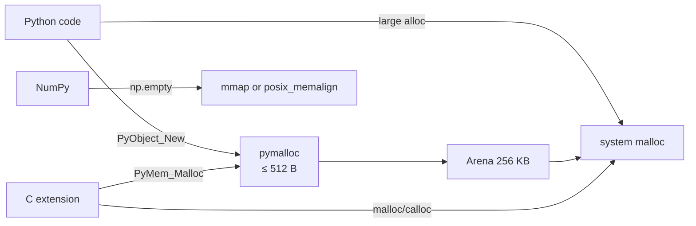
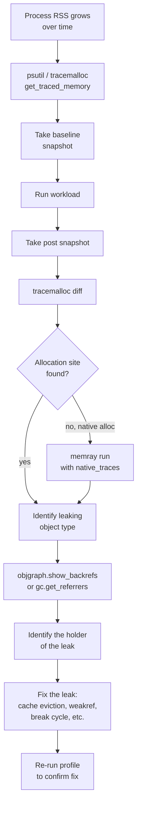
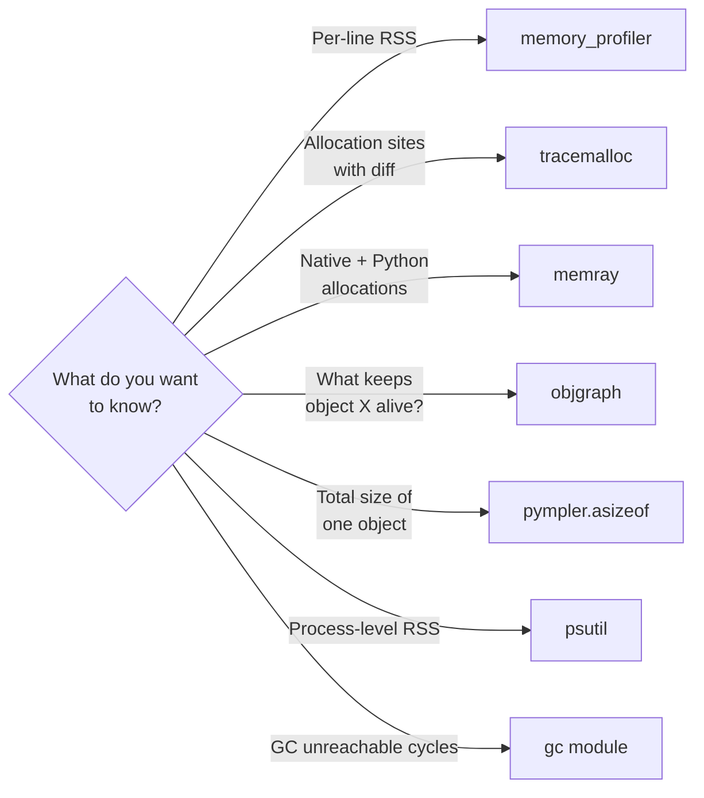

# 3. Memory Profiling

> [!note] Why this note exists
> "My Python process is using 8 GB of RAM and I have no idea why" is one of the most common production debugging scenarios. The fix is rarely a single line of code — it's usually an accumulation of small leaks (a global list, a closure capturing `self`, a cache without eviction, an unintended reference cycle through `__del__`). This note covers the **toolchain** that turns vague memory complaints into precise attribution: `tracemalloc` (stdlib, snapshot-based allocation tracking), `memory_profiler` (line-by-line RSS reporting), `memray` (Bloomberg's modern all-singing profiler with native tracking, thread support, and flame graphs), `objgraph` (reference-graph visualisation for finding what's keeping an object alive), and `pympler` (object-size introspection). It also covers the **common leak patterns** you'll find with these tools: unbounded caches, global registries, closures capturing state, dangling callbacks, `__del__` cycles, and C-extension reference bugs. Read [[1. Python Memory Model]] and [[2. Reference Counting and GC]] first — the profiling tools report allocation sites and reference graphs; you need the mental model of refcounts and pymalloc to interpret them.

## Why It Matters

Memory profiling differs from CPU profiling (covered in [[4. cProfile and timeit]]) in a few important ways:

1. **Memory problems are slow and cumulative.** A CPU hot spot makes itself known instantly; a memory leak may take hours or days to manifest. By the time you notice, the bug is "always been there".
2. **Attribution is harder.** CPU time can be attributed to the function currently on the stack. Memory is held by objects that may have been allocated long ago by code that has nothing to do with the current stack.
3. **The OS reports `RSS` (Resident Set Size), but RSS includes shared libraries, mmap'd files, and fragmentation.** It's a poor proxy for "Python's memory". You need tools that understand Python's allocator.
4. **Reference graphs, not allocation sites, are often the smoking gun.** An object's allocation site tells you where it was born; the reference graph tells you why it's still alive. Both matter.
5. **C extensions can leak in ways Python tools can't see.** A `malloc` without a `free` in a C extension won't show up in `tracemalloc` (which tracks pymalloc). You need OS-level tools (`valgrind`, `heaptrack`) for that.

The practical workflow is always the same: **measure → snapshot → diff → find the allocation site → find the holder → fix**. This note shows you how to execute each step with the right tool.

## Background

### What "memory" actually means

A Python process consumes memory in several layers:

- **RSS (Resident Set Size)**: total physical RAM used, including shared libraries and mmap'd files. Reported by `ps`, `top`, `/proc/PID/status`. The coarsest measure.
- **VMS (Virtual Memory Size)**: total virtual address space. Includes mapped-but-not-reserved regions. Mostly meaningless for diagnosis.
- **Heap (Python-level)**: memory managed by pymalloc — your `PyObject`s. Reported by `tracemalloc`.
- **Native heap**: memory allocated by C extensions via `malloc`. Not seen by `tracemalloc`.
- **mmap'd regions**: file-backed or anonymous large mappings (NumPy arrays, memory-mapped files).

A process can have low Python heap usage but high RSS because of native allocations, mmap'd files, or fragmentation. Always check both.

### Python object allocation paths



`tracemalloc` hooks both `PyMem_Malloc` and `PyObject_Malloc`, so it sees pymalloc allocations and `PyMem_*` allocations. It does **not** see raw `malloc` from C extensions — `memray` does, by hooking `malloc` itself via LD_PRELOAD or similar.

### The Python memory profiler ecosystem

| Tool | Type | Granularity | Stdlib? | Best for |
|---|---|---|---|---|
| `tracemalloc` | Allocation tracking | Per-call-site | Yes (3.4+) | Diffing snapshots to find leaks |
| `memory_profiler` | Line-by-line RSS | Per-line of code | No (`pip install memory_profiler`) | Quick "which line allocates" in scripts |
| `memray` | Native + Python | Per-allocation | No (`pip install memray`) | Production-grade, C extensions, threads |
| `objgraph` | Reference graph | Per-object | No (`pip install objgraph`) | Finding what holds an object alive |
| `pympler` | Object size | Per-object | No (`pip install Pympler`) | Measuring one object's total footprint |
| `gc` | GC introspection | Per-generation | Yes | Finding unreachable cycles, listing objects |
| `resource`/`psutil` | OS-level RSS | Process | Yes / 3rd party | Coarse monitoring |

### The leak taxonomy

Python leaks fall into a few patterns:

1. **Unbounded cache.** A `dict` that grows forever, never evicts. Fix: `lru_cache(maxsize=N)` or `WeakValueDictionary`.
2. **Global registry.** A module-level list that's appended to but never pruned. Fix: `WeakSet` or explicit `unregister`.
3. **Closure capturing `self`.** A callback `lambda: self.handler()` stored in a long-lived object. Fix: `weakref.WeakMethod` or pass `self` explicitly.
4. **Dangling callback in event loop.** A `loop.call_later` that captures a large object. Fix: cancel the callback when done.
5. **`__del__` cycle.** Objects with `__del__` forming unreachable cycles. Fix: use `weakref.finalize`, or break the cycle explicitly.
6. **Intended-forever singletons holding large data.** A module-level `_CONFIG` that loaded a 1 GB file at import. Fix: lazy-load.
7. **C extension reference leak.** Forgot `Py_DECREF` in a hot path. Fix: see [[5. The C API]]; debug with `PYTHONMALLOC=debug` or `memray`.
8. **Fragmentation.** pymalloc arenas can't be returned to the OS if even one block is still used. May look like a leak but isn't. Fix: redesign to batch allocations.

## Main content

### `tracemalloc`: the stdlib workhorse

`tracemalloc` wraps Python's memory allocators and records every allocation's source location. You take snapshots before and after a workload, diff them, and the diff shows which call sites allocated memory that wasn't freed.

```python
import tracemalloc

tracemalloc.start()

# Take a baseline snapshot
snapshot1 = tracemalloc.take_snapshot()

# ... run the workload under suspicion ...
data = [list(range(1000)) for _ in range(1000)]

# Take another snapshot
snapshot2 = tracemalloc.take_snapshot()

# Diff
stats = snapshot2.compare_to(snapshot1, 'lineno')
for stat in stats[:10]:
    print(stat)
```

Output looks like:

```
myfile.py:10: size=31.3 MB (+31.3 MB), count=1000 (+1000), average=32.0 kB
myfile.py:9: size=7.6 MB (+7.6 MB), count=1000 (+1000), average=7784 B
```

Key APIs:

```python
tracemalloc.start(nframes=10)            # capture N frames of traceback per allocation
tracemalloc.take_snapshot()              # returns a Snapshot
tracemalloc.get_traced_memory()          # (current, peak) tuple
tracemalloc.reset_peak()                 # reset the peak counter
tracemalloc.stop()                       # stop tracing and clear data

snapshot.statistics('lineno')            # group by source line
snapshot.statistics('filename')          # group by file
snapshot.statistics('traceback')         # group by full traceback
snapshot.compare_to(other, 'lineno')     # diff
snapshot.filter_traces(filters)          # exclude stdlib, etc.
```

A common pattern for production leak hunting:

```python
import tracemalloc, gc

def find_leak(workload, *, warmup=1, repeat=3):
    tracemalloc.start(25)                # capture deep tracebacks
    gc.collect()
    baseline = tracemalloc.take_snapshot()

    for _ in range(warmup):
        workload()                       # warm up caches, imports, etc.
    gc.collect()
    baseline = tracemalloc.take_snapshot()

    for _ in range(repeat):
        workload()
    gc.collect()
    after = tracemalloc.take_snapshot()

    for stat in after.compare_to(baseline, 'lineno')[:15]:
        print(stat)
```

The warmup is critical: the first call to `workload` will allocate module-level singletons, populate caches, etc. — these aren't leaks. Comparing post-warmup to post-repeat isolates the per-call growth.

### `tracemalloc` filters

By default `tracemalloc` records allocations from the stdlib and your own code. To focus on your code:

```python
import tracemalloc

tracemalloc.start()
snap = tracemalloc.take_snapshot()
snap = snap.filter_traces([
    tracemalloc.Filter(False, "<frozen importlib._bootstrap>"),
    tracemalloc.Filter(False, "<unknown>"),
    tracemalloc.Filter(True, "myproject/"),  # keep only myproject's allocations
])
for s in snap.statistics('lineno')[:10]:
    print(s)
```

### `memory_profiler`: line-by-line RSS

`memory_profiler` is the simplest tool — it polls `psutil.Process().memory_info().rss` before and after each line and prints a per-line delta. Decorate a function:

```python
# pip install memory_profiler psutil
from memory_profiler import profile

@profile
def process_data():
    data = [list(range(1000)) for _ in range(1000)]
    result = [sum(row) for row in data]
    return result

process_data()
```

Run it:

```
Line #    Mem usage    Increment  Occurrences   Line Contents
=============================================================
     3     50.2 MiB     50.2 MiB           1   @profile
     4                                         def process_data():
     5     74.5 MiB     24.3 MiB        1001       data = [list(range(1000)) for _ in range(1000)]
     6     76.1 MiB      1.6 MiB        1001       result = [sum(row) for row in data]
     7     76.1 MiB      0.0 MiB           1       return result
```

`memory_profiler` is great for quick scripts but it has significant drawbacks:

- **Polling RSS is slow and imprecise.** It misses short-lived allocations between polls.
- **Decorator-based** — you have to modify the code.
- **No allocation attribution.** It tells you a line allocated memory, not what kind of object.

Use it for "is this function the leaky one?" and `tracemalloc` for "what specifically is leaking".

### `memray`: the modern profiler

`memray` (Bloomberg, 2022) is the current state of the art. It hooks `malloc` itself (via LD_PRELOAD on Linux, mach exception handlers on macOS), so it sees both Python and C-extension allocations. It supports threads, subprocesses, and native frames.

```bash
# pip install memray
memray run my_script.py
# Output: my_script.py.1234.bin (binary profile)

memray stats my_script.py.1234.bin       # text summary
memray flamegraph my_script.py.1234.bin  # HTML flame graph
memray tree my_script.py.1234.bin        # call-tree view
memray summary my_script.py.1234.bin     # per-function totals
memray table my_script.py.1234.bin       # HTML table
```

In code:

```python
import memray

with memray.Tracker("output.bin", native_traces=True):
    run_workload()
```

`memray` shines for:

- **C extension leaks** that `tracemalloc` can't see.
- **Threaded workloads** — it tracks allocations per thread.
- **Long-running processes** — attach to a running process with `memray attach PID`.
- **Production flame graphs** — visualise allocation sites in a browser.

Its main limitation: Linux and macOS only (no Windows native tracing).

### `objgraph`: reference-graph visualisation

When you know which object is leaking but not what's holding it, `objgraph` is the tool. It walks `gc.get_referrers` recursively and renders a Graphviz diagram of the reference graph.

```python
# pip install objgraph
import objgraph

# What's keeping `obj` alive?
objgraph.show_backrefs(obj, max_depth=5, filename='refs.png')

# What does `obj` reference?
objgraph.show_refs(obj, max_depth=5, filename='forward.png')

# What types are most common?
objgraph.show_most_common_types()

# What types have grown the most since a snapshot?
objgraph.show_growth(limit=10)
```

`show_backrefs` is the killer feature. You point it at the leaking object and it draws a graph showing every container that holds a reference, all the way back to a root (module global, frame local, etc.).

Typical output:

```
FunctionType              2453     +102
dict                     18342      +98
list                     12033      +77
tuple                    15670      +50
```

`show_growth` is great for finding leaks by type: if `FunctionType` is growing in a server that should reach steady state, you have a closure-capture leak.

### `pympler`: measuring a single object's footprint

`sys.getsizeof(x)` returns the shallow size — the bytes of `x` itself, not what it references. `pympler.asizeof` recursively walks references and sums the total.

```python
# pip install Pympler
from pympler import asizeof

class TreeNode:
    __slots__ = ('value', 'children')
    def __init__(self, v):
        self.value = v
        self.children = []

root = TreeNode(0)
for i in range(100):
    root.children.append(TreeNode(i))

print(sys.getsizeof(root))      # ~64 bytes — just the TreeNode shell
print(asizeof.asizeof(root))    # ~15000 bytes — the whole tree
```

Useful for "how much memory does this object actually take?"

### `gc`-based introspection

For quick checks without external tools:

```python
import gc

# How many tracked objects exist?
print(len(gc.get_objects()))          # ~50k typical for an empty REPL

# All instances of a class:
instances = [o for o in gc.get_objects() if isinstance(o, MyClass)]

# What references obj?
referrers = gc.get_referrers(obj)     # list of containers

# What does obj reference?
referents = gc.get_referents(obj)

# What's in unreachable cycles?
gc.collect()
print(gc.garbage)                     # list of objects the GC couldn't free
```

`gc.get_objects` is memory-heavy — it returns a list of every tracked object. Don't call it in a hot loop.

### Real-world leak patterns

#### Pattern 1: unbounded cache

```python
# BAD
_cache = {}
def get_user(user_id):
    if user_id not in _cache:
        _cache[user_id] = load_user_from_db(user_id)
    return _cache[user_id]

# GOOD
from functools import lru_cache

@lru_cache(maxsize=10_000)
def get_user(user_id):
    return load_user_from_db(user_id)
```

`tracemalloc` shows the cache dict growing without bound; `gc.get_referrers` shows the user objects being held by `_cache`.

#### Pattern 2: global registry without unregister

```python
# BAD
_HANDLERS = []

def register(handler):
    _HANDLERS.append(handler)

# handler is never removed; even if the user drops the reference,
# _HANDLERS still holds it.
```

Fix: use `WeakSet` so dead handlers are auto-removed, or expose `unregister(handler)`.

#### Pattern 3: closure capturing `self`

```python
class Widget:
    def __init__(self, bus):
        self.bus = bus
        bus.subscribe(lambda: self.handle())   # closure holds `self`

# Even after the user drops all references to Widget,
# bus._subscribers holds the lambda, which holds `self`.
```

Fix: use `weakref.WeakMethod`:

```python
import weakref

class Widget:
    def __init__(self, bus):
        self.bus = bus
        bus.subscribe(weakref.WeakMethod(self.handle))
```

#### Pattern 4: `__del__` cycle

```python
class A:
    def __init__(self):
        self.b = B(self)
    def __del__(self):
        print("A deleted")

class B:
    def __init__(self, a):
        self.a = a

a = A()
del a
# A and B form a cycle; in CPython < 3.4, they'd leak.
# In 3.4+, the cyclic GC collects them, but `__del__` order is tricky.
```

Fix: prefer `weakref.finalize` over `__del__`. If you must use `__del__`, break cycles explicitly with weak refs.

#### Pattern 5: large module-level data

```python
# mymodule.py
_BIG_TABLE = load_1gb_csv()   # loaded at import time, held forever

def lookup(key):
    return _BIG_TABLE.get(key)
```

Even code that never calls `lookup` pays the 1 GB cost. Fix: lazy-load:

```python
_BIG_TABLE = None
def _ensure_loaded():
    global _BIG_TABLE
    if _BIG_TABLE is None:
        _BIG_TABLE = load_1gb_csv()

def lookup(key):
    _ensure_loaded()
    return _BIG_TABLE.get(key)
```

Or use `functools.cache`:

```python
import functools

@functools.cache
def _table():
    return load_1gb_csv()

def lookup(key):
    return _table().get(key)
```

## Mermaid: memory profiling workflow



## Mermaid: tool selection



## Code examples

### `tracemalloc` leak hunt

```python
import tracemalloc
import gc

class User:
    def __init__(self, uid, name):
        self.uid = uid
        self.name = name

_cache = {}

def handle_request(uid):
    if uid not in _cache:
        _cache[uid] = User(uid, f"user{uid}")
    return _cache[uid].name

def run_workload(n=1000):
    for i in range(n):
        handle_request(i)

tracemalloc.start(25)
gc.collect()
baseline = tracemalloc.take_snapshot()

run_workload(5000)

gc.collect()
after = tracemalloc.take_snapshot()

for stat in after.compare_to(baseline, 'lineno')[:5]:
    print(stat)
# Example output:
# leak.py:10: size=320 kB (+320 kB), count=5000 (+5000), average=64 B
#                    ^^^^^^ cache dict grew by 5000 entries
```

### `memray` flame graph workflow

```bash
# Install
pip install memray

# Run with native tracing
memray run --native --follow-fork my_server.py

# Generate an HTML flame graph
memray flamegraph my_server.py.1234.bin

# Open in browser
xdg-open memray-flamegraph-my_server.py.1234.html
```

### `objgraph` to find what's holding an object

```python
import objgraph

class Leaked:
    pass

# A global list is accidentally holding references
_GLOBAL_LIST = []
obj = Leaked()
_GLOBAL_LIST.append(obj)

# Now drop the local reference
del obj

# Find what's holding Leaked instances
inst = objgraph.by_type('Leaked')[0]
objgraph.show_backrefs(inst, max_depth=4, filename='leaked.png')
# leaked.png shows the chain: _GLOBAL_LIST -> [inst]
```

### `psutil` for process-level monitoring

```python
import psutil, os

proc = psutil.Process(os.getpid())

def mem_mb():
    return proc.memory_info().rss / 1e6

print(f"start: {mem_mb():.1f} MB")

data = []
for _ in range(100):
    data.append(list(range(10_000)))
    print(f"  {mem_mb():.1f} MB")
```

### Continuous monitoring decorator

```python
import tracemalloc, time, logging
from functools import wraps

log = logging.getLogger(__name__)

def track_memory(label):
    def deco(fn):
        @wraps(fn)
        def wrapper(*args, **kwargs):
            tracemalloc.start()
            snap1 = tracemalloc.take_snapshot()
            try:
                return fn(*args, **kwargs)
            finally:
                snap2 = tracemalloc.take_snapshot()
                diff = snap2.compare_to(snap1, 'lineno')
                top = diff[0] if diff else None
                if top and top.size_diff > 1_000_000:  # > 1 MB growth
                    log.warning("%s grew memory by %.1f MB at %s",
                                label, top.size_diff / 1e6, top)
                tracemalloc.stop()
        return wrapper
    return deco
```

### Pytest integration for memory regression tests

```python
# test_memory.py
import tracemalloc, gc, pytest

@pytest.fixture
def memory_check():
    tracemalloc.start()
    gc.collect()
    snap1 = tracemalloc.take_snapshot()
    yield
    gc.collect()
    snap2 = tracemalloc.take_snapshot()
    diff = snap2.compare_to(snap1, 'lineno')
    leak = sum(s.size_diff for s in diff if s.size_diff > 0)
    assert leak < 1_000_000, f"Leaked {leak/1e6:.1f} MB"
    tracemalloc.stop()

def test_process_request_doesnt_leak(memory_check):
    for i in range(1000):
        process_request(i)
```

### Hunting C extension leaks

```bash
# Run with debug allocator to catch buffer overflows and use-after-free
PYTHONMALLOC=debug python my_script.py

# Use memray with native traces
memray run --native my_script.py

# If you suspect a C extension, isolate it:
memray run --native -o trace.bin my_script.py
memray stats trace.bin | head -30
```

## Common Pitfalls

1. **Confusing RSS with Python heap usage.** RSS includes shared libraries, mmap'd files, and fragmentation. A "leak" in RSS may just be pymalloc holding arenas. Use `tracemalloc.get_traced_memory()` for Python-side numbers.

2. **Forgetting the warmup phase.** The first call to a function may import modules, populate class registries, and allocate singletons. Comparing pre-warmup to post-warmup reports these as leaks.

3. **`tracemalloc.start(nframes=1)` is too shallow.** Default is 1 frame; you usually want 5–25 to see the full call chain leading to an allocation.

4. **Calling `gc.get_objects()` in a hot loop.** It returns a list of every tracked object — multi-second pause on a large process.

5. **Not running `gc.collect()` before snapshots.** Unreachable cycles may not have been collected yet, inflating numbers.

6. **Using `memory_profiler` for production.** Its decorator approach is fine for scripts but invasive for libraries. Use `tracemalloc` or `memray` instead.

7. **Forgetting to filter `tracemalloc` snapshots.** The diff includes stdlib allocations; filter to your project's directory.

8. **Expecting `sys.getsizeof` to report deep size.** It returns the shallow size of one object. Use `pympler.asizeof` for recursive size.

9. **`memray` on Windows.** It doesn't support native tracing on Windows. Use Linux or WSL.

10. **Misinterpreting "growth" as a leak.** A cache that grows to `maxsize` and stops is by design. Check whether growth is bounded or unbounded.

11. **Forgetting that pymalloc doesn't return arenas eagerly.** A peak of 10 GB that drops to 5 GB may show 10 GB RSS because pymalloc holds arenas. `gc.collect()` and `tracemalloc.reset_peak()` help, but arenas may still not return.

12. **Profiling under different conditions than production.** Memory characteristics depend on input size, request mix, and concurrency. Profile under realistic load.

13. **`@profile` decorator left in production code.** `memory_profiler.profile` does nothing if the package isn't installed, but it's still a code smell. Strip it before merging.

14. **Trusting the first allocation site.** The site that allocated the most bytes is often a hot allocator like a JSON parser; the actual leak is a slower-growing holder that you spot by comparing multiple snapshots.

## Tips and Tricks

- **Snapshot → workload → snapshot → diff** is the universal workflow. Always diff, never look at absolute numbers.
- **Use `tracemalloc.start(25)`** for deep tracebacks. The overhead is small (a few percent) and the attribution is far better.
- **Filter snapshots** to your project directory before diffing: `snap.filter_traces([tracemalloc.Filter(True, "myproject/")])`.
- **`tracemalloc.reset_peak()`** before a workload to measure only its peak, not the cumulative peak since start.
- **`gc.collect()` before snapshots** to free unreachable cycles deterministically.
- **For long-running services, take periodic snapshots and store them.** Diff across hours to find slow leaks.
- **`objgraph.show_backrefs(obj, max_depth=5)`** is the fastest way to answer "what's keeping this alive?". Pipe to Graphviz.
- **For type-level leak hunting, use `objgraph.show_growth()`.** Run it before and after a workload; growth indicates retention.
- **`pympler.asizeof(obj)`** for measuring one object's deep size. Use `pympler.tracker.SummaryTracker` for session-level tracking.
- **`memray attach PID`** for live processes — no need to restart with the tracker. (Linux only.)
- **`memray run --native --trace-python-allocators`** for the deepest possible attribution.
- **In CI, add memory regression tests** with `tracemalloc` snapshots; fail if growth exceeds a threshold.
- **For NumPy-heavy code, watch for unintended copies.** `arr.reshape` may copy; `arr.flatten()` always copies; slicing is a view.
- **For C extensions, run under `PYTHONMALLOC=debug`** in development. It catches many buffer-overflow and double-free bugs at the cost of speed.
- **`resource.getrusage(resource.RUSAGE_SELF).ru_maxrss`** gives the peak RSS of the process — useful for batch jobs.
- **Profile in production-like environments.** Development setups often differ in input size and concurrency in ways that hide leaks.

## Active Recall

1. What's the difference between RSS, VMS, and Python heap usage? Which does `tracemalloc` report?
2. Write a `tracemalloc` snippet that takes a baseline snapshot, runs a workload, and prints the top 5 allocation sites by growth.
3. Why is a "warmup" phase important before taking a baseline snapshot?
4. What does `tracemalloc.start(nframes=25)` do, and why might you want more than the default 1 frame?
5. When would you choose `memray` over `tracemalloc`?
6. Write a `memory_profiler`-decorated function and explain what its output tells you.
7. What does `objgraph.show_backrefs(obj, max_depth=5)` produce? When is it useful?
8. How do you measure the *deep* size of a single object (including everything it references)?
9. List five common Python leak patterns.
10. Write a fixed version of an unbounded cache using `functools.lru_cache`.
11. How would you fix a closure that captures `self` and is stored in a long-lived event bus?
12. Why does `sys.getsizeof` underreport the size of a list of large objects?
13. How can you profile a C extension's allocations that `tracemalloc` can't see?
14. Write a pytest fixture that fails if a test leaks more than 1 MB.
15. What does `gc.get_referrers(obj)` return, and why might the results be surprising?
16. What is pymalloc arena retention, and how can it masquerade as a leak?
17. How do you run a script with `memray` and view the result as a flame graph?
18. What's the danger of calling `gc.get_objects()` in a hot loop?
19. Why might you disable the GC during a batch workload, then call `gc.collect()` at the end?
20. Describe a complete workflow for diagnosing "my web server grows 50 MB per hour" using only stdlib tools.

## Next Steps

- [[1. Python Memory Model]] — `PyObject` layout, pymalloc, and the foundation for interpreting profiling output.
- [[2. Reference Counting and GC]] — `gc` module APIs, weak references, and cycle detection.
- [[4. cProfile and timeit]] — CPU profiling, the complementary discipline.
- [[5. Optimization Techniques]] — once you've found the leak, how to reduce footprint.
- [[6. Caching]] — `lru_cache`, `WeakValueDictionary`, and cache invalidation.
- [[5. The C API]] — for diagnosing C-extension reference leaks.
