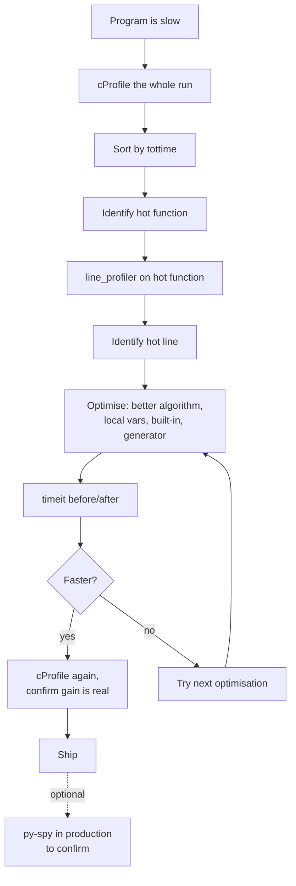
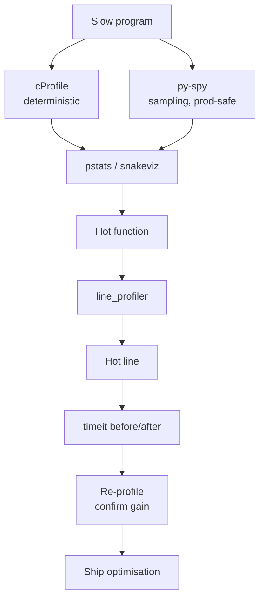
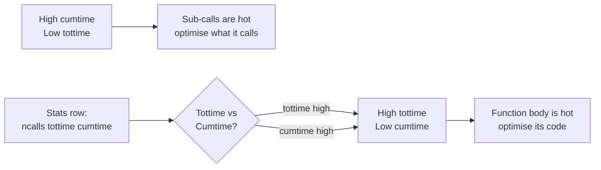

# 4. cProfile and timeit

> [!note] Why this note exists
> Before you optimise, you measure. Before you measure, you decide **what** to measure. CPython ships with two complementary tools for this: `cProfile` (a deterministic, instrumenting profiler that records every function call's wall time) and `timeit` (a microbenchmark harness that times small code snippets with statistical rigour). This note covers both, plus the surrounding ecosystem: `pstats` (for sorting and slicing cProfile output), `snakeviz` (interactive flame-graph visualiser), `profile` (pure-Python profiler, slower but more flexible), `py-spy` (sampling profiler requiring no code changes and supporting production), `line_profiler` (line-by-line CPU attribution), and the **profiling workflow**: profile → identify hot function → drill down → microbenchmark the optimisation → verify. If [[3. Memory Profiling]] answers "where does the memory go?", this note answers "where does the time go?". The two are sibling disciplines — most real performance work uses both.

## Why It Matters

> [!quote] Knuth
> Premature optimisation is the root of all evil.

But unmeasured optimisation is even worse. Every experienced Python engineer has war stories like:

- Spending two days rewriting a function in C only to discover it was called once per request and consumed 0.1% of total time.
- "Optimising" a hot loop by caching results, only to find the cache lookup was slower than the original computation.
- Adding `__slots__` to a class and seeing no speedup because the bottleneck was dict operations elsewhere.
- Believing `list.append` is O(1) and being confused when appending to a list inside a tight loop is slow — until they discover the slowness was actually the *element construction*, not the append.

The fix is universal: **profile first, optimise second, microbenchmark the change, profile again to confirm.** Profiling turns guesses into data.

The two tools in this note cover different ends of the spectrum:

- **`cProfile`** answers "which functions are eating my time?" It gives you a call graph with per-function time, call count, and cumulative time. It's the starting point for almost all CPU work.
- **`timeit`** answers "is version A or version B faster for this tiny snippet?" It's the ending point — the microbenchmark that confirms an optimisation helps.

Between them sit specialised tools: `line_profiler` for line-level attribution inside one function, `py-spy` for production sampling, `snakeviz` for visualising cProfile output, and `memray` (covered in [[3. Memory Profiling]]) for memory.

## Background

### Deterministic vs sampling profilers

A **deterministic (instrumenting) profiler** hooks every function call and records its entry/exit time. `cProfile` and `profile` are deterministic. They give exact call counts and per-call times, but they impose overhead — every function call now does extra work to record timing.

A **sampling profiler** periodically (e.g., every 10 ms) inspects the call stack and records what was on it. `py-spy` is sampling. It gives approximate percentages ("function X was on top of the stack 30% of samples"), not exact counts, but with negligible overhead — suitable for production.

| Property | Deterministic (`cProfile`) | Sampling (`py-spy`) |
|---|---|---|
| Overhead | 10–100% (more for small functions) | <1% |
| Accuracy | Exact call counts | Statistical (proportional to time) |
| Production-safe | Usually no | Yes |
| Sees C functions? | Only those registered | Yes (with `--native`) |
| Sees Python internals? | No (built-ins appear as opaque) | Optional |
| Setup | Code changes or CLI flag | Attach to running process |

The rule of thumb: use `cProfile` in development for precise attribution; use `py-spy` in production when you can't add overhead.

### Wall time vs CPU time

- **Wall time** (real time): elapsed time on a clock on the wall. Includes time blocked on I/O, locks, sleep.
- **CPU time** (user + sys): time the CPU spent executing your code. Excludes blocking.

`cProfile` reports wall time per call by default. For I/O-bound code (network, disk), wall time is what you want. For CPU-bound numerical code, CPU time is more useful — `time.process_time()` instead of `time.perf_counter()`.

### The `cProfile` output format

A typical `cProfile` run prints:

```
   ncalls  tottime  percall  cumtime  percall filename:lineno(function)
   1000    0.234    0.000    0.456    0.000 mymod.py:10(process)
    500    0.123    0.000    0.123    0.000 mymod.py:20(helper)
  ...
```

| Column | Meaning |
|---|---|
| `ncalls` | Number of times the function was called |
| `tottime` | Total time spent in the function itself (excluding sub-calls) |
| `percall` | `tottime / ncalls` |
| `cumtime` | Total time including sub-calls |
| `percall` | `cumtime / ncalls` |

**Sort by `tottime` to find CPU hot spots** (functions doing actual work).
**Sort by `cumtime` to find expensive call paths** (functions whose call trees are expensive, even if the function itself is cheap).

A function with high `cumtime` but low `tottime` is just a dispatcher — optimising it won't help; optimise what it calls. A function with high `tottime` is the actual hot spot — optimise its body.

### Microbenchmarking with `timeit`

`timeit` runs a snippet many times and reports the average. The many-iterations approach averages out scheduling jitter and timer resolution limits.

```python
import timeit

# Time a list comprehension
t = timeit.timeit('[x*x for x in range(100)]', number=100_000)
print(f"{t:.3f}s for 100k iterations, {t/100_000*1e6:.2f} µs each")
```

The default `timeit.timeit` runs in a fresh isolated environment, with `globals` restricted to a small set of built-ins. To use your own names, pass `globals=`:

```python
import timeit

def f(n):
    return sum(x*x for x in range(n))

t = timeit.timeit('f(1000)', globals={'f': f}, number=10_000)
```

`timeit.repeat` runs the whole measurement multiple times and returns a list, letting you take the minimum (the cleanest run, least affected by system noise):

```python
import timeit

times = timeit.repeat('[x*x for x in range(100)]', number=100_000, repeat=5)
print(f"min: {min(times):.3f}s, median: {sorted(times)[2]:.3f}s")
```

**Take the minimum, not the mean.** Noise can only make a measurement slower, never faster. The minimum is the closest to the true computation time.

## Main content

### `cProfile` from the command line

The simplest way to profile a script:

```bash
python -m cProfile -o profile.out my_script.py
```

This writes a binary profile to `profile.out`. Analyse it with `pstats`:

```bash
python -m pstats profile.out
# Inside the pstats prompt:
# sort cumulative
# stats 20
# callers process
# quit
```

Or, more conveniently, in code:

```python
import pstats

p = pstats.Stats('profile.out')
p.sort_stats('cumulative').print_stats(20)
p.print_callers('process')   # who called `process`?
p.print_callees('process')   # who did `process` call?
```

To get a quick text dump without a binary file:

```bash
python -m cProfile -s cumulative my_script.py | head -30
```

### `cProfile` from Python code

For finer control (e.g., profiling only a section):

```python
import cProfile, pstats, io

def workload():
    # ... expensive code ...
    pass

pr = cProfile.Profile()
pr.enable()
workload()
pr.disable()

s = io.StringIO()
ps = pstats.Stats(pr, stream=s).sort_stats('cumulative')
ps.print_stats(20)
print(s.getvalue())
```

Use this when you want to profile a specific function call, not the whole program startup.

### `cProfile` sort keys

```python
ps.sort_stats('cumulative')   # total time including sub-calls
ps.sort_stats('tottime')      # time in function itself, excluding sub-calls
ps.sort_stats('calls')        # call count
ps.sort_stats('ncalls')       # same as 'calls'
ps.sort_stats('time')         # same as 'tottime'
ps.sort_stats('name')         # function name (alphabetical)
ps.sort_stats('file')         # file name
ps.sort_stats('line')         # line number
ps.sort_stats('module')       # module name
ps.sort_stats('pcalls')       # primitive (non-recursive) call count
```

You can chain: `ps.sort_stats('tottime').sort_stats('cumulative')` — secondary sort.

### Restricting output

```python
ps.print_stats(20)                  # top 20 by current sort
ps.print_stats('mymod')             # only functions in modules matching 'mymod'
ps.print_stats('mymod', 20)         # both
ps.print_stats(r'.*process.*', 10)  # regex on filename:lineno(function)
ps.print_callers('process')         # who called process
ps.print_callees('process')         # who process called
```

### `snakeviz`: interactive visualisation

`snakeviz` renders `cProfile` output as an interactive icicle or flame chart in your browser.

```bash
# pip install snakeviz
python -m cProfile -o profile.out my_script.py
snakeviz profile.out
# Opens browser at http://127.0.0.1:8080
```

Two visualisations:

- **Icicle**: top-down stack view, width = time.
- **Flame graph**: bottom-up stack view, easier for very deep stacks.

`snakeviz` is excellent for spotting "this one function in the middle of the call tree is unexpectedly expensive".

### `line_profiler`: per-line attribution

`cProfile` tells you which *function* is hot. `line_profiler` tells you which *line* of that function is hot.

```bash
# pip install line_profiler
```

```python
from line_profiler import profile

@profile
def process(data):
    total = 0
    for x in data:
        total += x * x
    return total

process(range(1_000_000))
```

Run with:

```bash
kernprof -lv my_script.py
```

Output:

```
Total time: 0.4521 s
File: my_script.py
Function: process at line 4

Line #      Hits         Time  Per Hit   % Time  Line Contents
==============================================================
     4                                           @profile
     5                                           def process(data):
     6         1           12     12.0      0.0      total = 0
     7   1000001      220000      0.2     48.7      for x in data:
     8   1000000      232000      0.2     51.3          total += x * x
     9         1            5      5.0      0.0      return total
```

Line 7 and 8 split the time almost evenly — you'd optimise both, or rewrite the loop as `sum(x*x for x in data)` or `sum(map(lambda x: x*x, data))`.

`line_profiler` is *very* high overhead — don't use it on production. But for understanding a hot function, it's irreplaceable.

### `py-spy`: production sampling

`py-spy` is a Rust-implemented sampling profiler. It can attach to a running Python process without code changes, with <1% overhead.

```bash
# pip install py-spy  (or use the standalone binary)

# Live view (like Unix `top` for Python):
py-spy top --pid 12345

# Record a flame graph:
py-spy record --pid 12345 -o flame.svg

# Dump a one-shot stack:
py-spy dump --pid 12345
```

Use cases:

- **Production incident**: a server is slow, can't restart it. Attach `py-spy top` to see what's hot.
- **Long-running batch job**: record the whole run as a flame graph for post-mortem.
- **Subprocess profiling**: `py-spy record -- python my_script.py`.

With `--native`, `py-spy` also samples C frames — useful for NumPy, Pandas, or C extensions that aren't visible in pure-Python profiles.

### `profile` vs `cProfile`

`profile` is the pure-Python profiler. `cProfile` is the C implementation. `cProfile` is much faster (lower overhead) and should be your default. Use `profile` only when:

- You need to subclass the profiler for custom behaviour.
- You're on a platform without the C extension (very rare).

```python
import profile
pr = profile.Profile()
pr.runcall(workload)
```

### `timeit` details

```python
import timeit

# Two equivalent ways:
t = timeit.timeit('sum(range(100))', number=100_000)
t = timeit.Timer('sum(range(100))').timeit(number=100_000)

# Multiple runs, take the minimum:
runs = timeit.repeat('sum(range(100))', number=100_000, repeat=5)
print(min(runs))

# Use a setup statement:
t = timeit.timeit('Counter(data)',
                  setup='from collections import Counter; data = list(range(100))',
                  number=10_000)

# Use globals:
def f(n): return sum(x for x in range(n))
t = timeit.timeit('f(1000)', globals=globals(), number=10_000)
```

From the command line:

```bash
python -m timeit -n 100000 -r 5 -s "from collections import Counter" "Counter(range(100))"
```

### `timeit` best practices

1. **Take the minimum of `repeat`**, not the mean. Noise can only slow you down.
2. **Use enough `number`** that each run takes at least 0.1 s — below that, timer resolution dominates.
3. **Use a `setup` that doesn't pollute the timed code.** Imports go in `setup`; only the code under test goes in `stmt`.
4. **Beware warm-up effects.** First runs may be slower due to cache misses, JIT warmup (PyPy). Use `repeat` and ignore the first run if it's an outlier.
5. **Beware garbage collection.** A GC cycle mid-measurement skews results. Either disable GC during measurement (`gc.disable()`) or accept the variance.
6. **Compare apples to apples.** A list comprehension `[x for x in range(n)]` creates a list; a generator `(x for x in range(n))` doesn't. Comparing their wall times is meaningful only if both produce the same observable output.
7. **Microbenchmarks lie about real performance.** A snippet that's 10× faster in isolation may be 1× faster in the context of a larger program (because of cache effects, branch prediction, etc.). Always confirm with a full-program profile after optimising.

### The profiling workflow



### Microbenchmark: list comprehension vs `map` vs for loop

```python
import timeit

data = list(range(1000))

def for_loop():
    result = []
    for x in data:
        result.append(x * x)
    return result

def list_comp():
    return [x * x for x in data]

def map_call():
    return list(map(lambda x: x * x, data))

def map_call_no_lambda():
    return list(map((lambda x: x * x), data))  # same as above

for fn in (for_loop, list_comp, map_call):
    t = min(timeit.repeat(fn, number=100_000, repeat=5))
    print(f"{fn.__name__:20}: {t:.3f}s")
```

Typical output:

```
for_loop            : 4.21s
list_comp           : 2.83s
map_call            : 3.95s
```

List comprehension wins because it's a single bytecode op (`LIST_APPEND`) that bypasses the `list.append` attribute lookup. The for loop has to do `LOAD_ATTR append`, `CALL`, `LOAD_ATTR` etc. on every iteration. `map` with `lambda` is slow because of the lambda call overhead; `map` with a built-in like `str.upper` is much faster.

### Microbenchmark: local vs global lookup

```python
import timeit

def local_lookup():
    s = sum  # local alias
    total = 0
    for _ in range(1000):
        total = s(range(100))

def global_lookup():
    total = 0
    for _ in range(1000):
        total = sum(range(100))  # global lookup each time

for fn in (local_lookup, global_lookup):
    t = min(timeit.repeat(fn, number=1000, repeat=5))
    print(f"{fn.__name__:20}: {t:.3f}s")
```

Local lookup is typically 10–20% faster because `LOAD_FAST` is cheaper than `LOAD_GLOBAL` (no dict lookup; it's an array index).

### Microbenchmark: `__slots__` vs `__dict__`

```python
import timeit

class WithDict:
    def __init__(self, x, y):
        self.x = x
        self.y = y

class WithSlots:
    __slots__ = ('x', 'y')
    def __init__(self, x, y):
        self.x = x
        self.y = y

def make_dict(n):
    for _ in range(n):
        WithDict(1, 2)

def make_slots(n):
    for _ in range(n):
        WithSlots(1, 2)

for fn, name in ((make_dict, 'dict'), (make_slots, 'slots')):
    t = min(timeit.repeat(lambda: fn(100_000), number=10, repeat=5))
    print(f"{name}: {t:.3f}s")
```

`__slots__` is typically 20–30% faster for construction (no dict allocation) and saves significant memory. See [[5. Optimization Techniques]].

### Profiling async code

`cProfile` works with async functions but its output can be misleading — async functions are entered and exited many times across the event loop. For async, `pyinstrument` is often better:

```bash
# pip install pyinstrument
pyinstrument my_script.py
# Or in code:
# from pyinstrument import Profiler
# with Profiler() as p:
#     ...
# p.print()
```

`pyinstrument` is a statistical profiler that records wall time across `await` boundaries. It's less precise than `cProfile` but more intuitive for async.

## Mermaid: profiling workflow



## Mermaid: cProfile output interpretation



## Code examples

### Full cProfile workflow

```python
import cProfile, pstats, io

def workload():
    data = [list(range(1000)) for _ in range(1000)]
    total = 0
    for row in data:
        total += sum(row)
    return total

pr = cProfile.Profile()
pr.enable()
workload()
pr.disable()

s = io.StringIO()
ps = pstats.Stats(pr, stream=s).sort_stats('tottime')
ps.print_stats(10)
ps.print_callers(10)
print(s.getvalue())
```

### Snakeviz round-trip

```bash
python -m cProfile -o prof.out my_script.py
snakeviz prof.out
```

### `py-spy` on a running server

```bash
# Find your server's PID
pgrep -f my_server.py

# Live top-like view
py-spy top --pid 12345

# Record for 30 seconds, then open flame graph
py-spy record --pid 12345 -d 30 -o profile.svg
```

### `timeit` comparing dict patterns

```python
import timeit

setup = """
data = list(range(1000))
"""

# Build a dict from a list of pairs
t1 = min(timeit.repeat('{k: v for k, v in zip(data, data)}',
                       setup=setup, number=10_000, repeat=5))

# Build a dict using the dict() constructor
t2 = min(timeit.repeat('dict(zip(data, data))',
                       setup=setup, number=10_000, repeat=5))

print(f"dict comp:  {t1:.3f}s")
print(f"dict():     {t2:.3f}s")
```

### Programmatic `cProfile` over a test suite

```python
import cProfile, pstats
import pytest

def main():
    pytest.main(['tests/', '-x', '--no-header'])

if __name__ == '__main__':
    pr = cProfile.Profile()
    pr.enable()
    main()
    pr.disable()
    pr.dump_stats('pytest_profile.out')
    print("Wrote pytest_profile.out — analyse with `snakeviz pytest_profile.out`")
```

### Custom context manager for profiling

```python
import cProfile, pstats, io
from contextlib import contextmanager

@contextmanager
def profiled(sort='cumulative', top=15):
    pr = cProfile.Profile()
    pr.enable()
    try:
        yield
    finally:
        pr.disable()
        s = io.StringIO()
        ps = pstats.Stats(pr, stream=s).sort_stats(sort)
        ps.print_stats(top)
        print(s.getvalue())

# Usage:
with profiled(sort='tottime', top=10):
    expensive_workload()
```

### Detecting global lookup overhead

```python
import timeit, dis

def f_global():
    s = 0
    for i in range(1000):
        s += abs(i)   # abs is a global lookup each iteration
    return s

def f_local():
    abs_local = abs   # local binding
    s = 0
    for i in range(1000):
        s += abs_local(i)
    return s

t1 = min(timeit.repeat(f_global, number=10_000, repeat=5))
t2 = min(timeit.repeat(f_local,   number=10_000, repeat=5))
print(f"global abs: {t1:.3f}s")
print(f"local abs:  {t2:.3f}s")

# Confirm via dis what's different:
print("\nBytecode for f_global:")
dis.dis(f_global)
print("\nBytecode for f_local:")
dis.dis(f_local)
```

## Common Pitfalls

1. **Profiling with `print` statements active.** `print` is slow; it skews results. Strip print statements before profiling.

2. **Including startup time in the profile.** Importing a framework can take seconds. Use programmatic `cProfile.Profile()` around only the workload, not `python -m cProfile my_script.py` if startup matters.

3. **Optimising without measuring.** "I think this is slow" is not a profile. Always measure first.

4. **Optimising the wrong function.** A function with 1 ms × 1 call matters less than a function with 1 µs × 1,000,000 calls. Look at `tottime`, not `percall`.

5. **Forgetting `print_callers`/`print_callees`.** The hot function often isn't the one to fix — the *caller* calling it 10 million times is.

6. **Microbenchmark that doesn't reflect real usage.** A 10× speedup on a synthetic loop may evaporate when integrated because of cache effects or input distribution.

7. **Using `timeit` with too few iterations.** Below ~100 ms total, timer resolution and noise dominate. Use enough `number` that one run is at least 0.1 s.

8. **Comparing `mean` instead of `min`.** Noise can only slow measurements down. The minimum is the closest to true compute time.

9. **Not disabling GC during microbenchmarks.** A surprise GC cycle mid-measurement skews results. `gc.disable()` before, `gc.enable()` after.

10. **Profiling debug builds.** Run with `python -O` if you use assertions; debug builds of C extensions are slower.

11. **Forgetting that `cProfile` adds overhead.** Function calls are 2–5× slower under `cProfile`. Absolute timings are wrong; relative rankings are usually right.

12. **Ignoring I/O when profiling CPU.** If the workload is I/O-bound, CPU profiles show "waiting" as zero time — you need a different tool (e.g., `py-spy` with `--idle` to include idle samples).

13. **Trusting per-line `line_profiler` percentages too much.** They reflect total wall time including the overhead of `line_profiler` itself; don't compare across runs.

14. **Profiling in a VM with noisy neighbours.** Cloud VMs have variable CPU performance. Run benchmarks on dedicated hardware or take many samples.

15. **Profiling Python 2 code.** Many tools have dropped Python 2 support. Use Python 3.8+.

16. **Forgetting that `cProfile` doesn't see C internals.** A function that calls `sorted()` shows `sorted` as a single call; the C-level work inside `sorted` is invisible. Use `py-spy --native` to see C frames.

## Tips and Tricks

- **Always profile before optimising.** Even experienced engineers are wrong about where the time goes 50% of the time.
- **`-s cumulative` for "what's slow", `-s tottime` for "what's the hot spot"**. Use both.
- **Use `print_callers('funcname')` to understand why a function is called so much.** Often the fix is to call it less, not to make it faster.
- **Save profiles to disk** (`pr.dump_stats('out.prof')`) — you can analyse later, share with colleagues, or visualise in `snakeviz`.
- **`snakeviz` for first-pass exploration**; `pstats` for scripted analysis; `line_profiler` for line-level drilling.
- **`py-spy top --pid PID`** is the single fastest way to diagnose a slow production Python process.
- **`py-spy record --pid PID -d 30 -o flame.svg`** gives you a flame graph of 30 seconds of production traffic.
- **`pyinstrument`** for async code; it handles `await` better than `cProfile`.
- **For microbenchmarks, use `timeit.repeat(stmt, number=N, repeat=5)` and take `min`.**
- **Disable GC during microbenchmarks**: `gc.disable()` before, `gc.enable()` after.
- **Pre-warm caches** by running the workload once before starting the timer.
- **Compare against a baseline** — save the "before" profile, optimise, save the "after" profile, diff with `pstats` or just visually compare.
- **`dis.dis(fn)` to see what bytecode your function compiles to.** Often the hot loop is obvious from the bytecode — see [[2. Bytecode and the dis Module]].
- **For NumPy/Pandas code, profile with `py-spy --native`** — the work happens in C, and `cProfile` shows only the Python-side wrappers.
- **`timeit` from the CLI** is great for quick checks: `python -m timeit -s "import json" "json.loads('{\"a\": 1}')"`
- **Profile under realistic input**. A function that's fast on 1000 items may be slow on 1M.
- **Run the profile multiple times** to detect noise.
- **For long-running services, take periodic `cProfile` snapshots** and diff them to spot regressions.

## Active Recall

1. What's the difference between a deterministic profiler and a sampling profiler? Give one example of each.
2. What does the `tottime` column in `cProfile` output mean? How is it different from `cumtime`?
3. Write a snippet that profiles a function and prints the top 10 by `tottime`.
4. Why might you sort by `cumtime` instead of `tottime`?
5. How do you save a `cProfile` result to disk and visualise it later?
6. What does `pstats.print_callers('funcname')` show? When is it useful?
7. Write a `timeit` call that compares list comprehension vs `for` loop for building a list of squares.
8. Why take the `min` of `timeit.repeat`, not the mean?
9. What's the role of `setup` in `timeit`? What goes there vs in `stmt`?
10. How do you profile a running production Python process without restarting it?
11. What does `line_profiler` add that `cProfile` doesn't?
12. Why is `cProfile` preferred over `profile` for normal use?
13. Write a context manager that profiles the code inside a `with` block.
14. How do you profile an async function? What tool is better suited than `cProfile`?
15. What's the overhead of `cProfile`? When does it become problematic?
16. How can you see C-level frames in a profile (e.g., work done inside `sorted` or `numpy`)?
17. Why should you disable GC during a microbenchmark?
18. Describe the full profiling workflow from "slow program" to "shipped optimisation".
19. What does `snakeviz` show that `pstats` text output doesn't?
20. A function shows 1 ms `tottime` and 5 s `cumtime`. What does that tell you, and where do you look next?

## Next Steps

- [[5. Optimization Techniques]] — once you've found the hot spot, the techniques to speed it up.
- [[3. Memory Profiling]] — the sibling discipline; many performance problems are memory problems in disguise.
- [[2. Bytecode and the dis Module]] — `dis.dis(fn)` reveals what bytecode your hot loop compiles to.
- [[6. Caching]] — often the result of "this function is slow" is "memoise it".
- [[5. Optimization Techniques]] — `__slots__`, local variables, built-ins, generators.
- [[2. The Execution Model]] — why Python is slow at the bytecode level.
