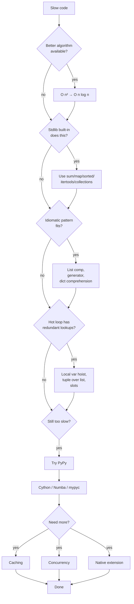
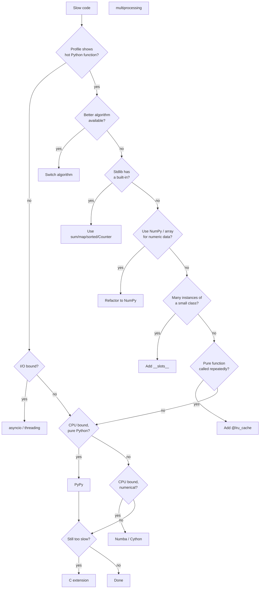
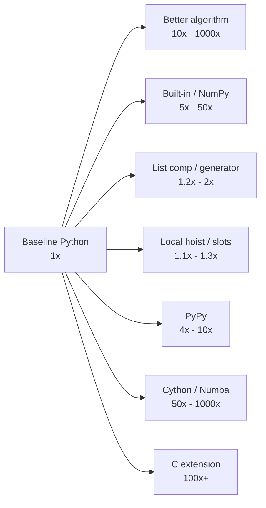

# 5. Optimization Techniques

> [!note] Why this note exists
> Python optimisation is the discipline of making slow code less slow — and knowing when *not* to bother. This note covers the full ladder of optimisation, from the **algorithmic** (Big-O matters more than micro-optimisations) to the **idiomatic** (use built-ins, list comprehensions, generators, local-variable hoisting, `__slots__`) to the **runtime-level** (PyPy, Cython, Numba) to the **architectural** (caching, parallelism, I/O concurrency). The throughline is **measure first** (see [[4. cProfile and timeit]]) and **profile after** to confirm. Optimisation without measurement is gambling. This note also covers the philosophical question: *should you even optimise?* The answer is usually no — code clarity wins. The times when you should are when latency, throughput, or memory pressure become business problems, and at that point the techniques here let you squeeze the most out of CPython before reaching for a rewrite. Read this alongside [[6. Caching]] (the most common single optimisation) and [[1. Python Memory Model]] (the foundation for understanding why these techniques work).

## Why It Matters

> [!quote] Donald Knuth
> The real problem is that programmers have spent far too much time worrying about efficiency in the wrong places and at the wrong times; premature optimization is the root of all evil (or at least most of it) in programming.

The "premature" is doing a lot of work in that quote. Knuth isn't saying don't optimise — he's saying **optimise at the right time, against measured data, in the right place**. The right time is after the code is correct and you have a profile showing where time goes. The right place is the function with high `tottime` in your `cProfile` output. Everywhere else, write for clarity.

This note covers:

- **Algorithmic optimisation** — replacing O(n²) with O(n log n), or O(n) with O(1). Often 100× speedups, always free of micro-tweaks.
- **Idiomatic Python** — using built-ins (`sum`, `map`, `sorted`), list comprehensions, generators, `collections.defaultdict`, `itertools`. Each shaves a constant factor; combined they often halve runtime.
- **Bytecode-level micro-optimisations** — local-variable hoisting, avoiding repeated attribute lookups, `tuple` over `list` for fixed records. ~10–30% gains, often at the cost of readability.
- **Memory-level optimisations** — `__slots__`, `array.array`, NumPy, `bytes` over `list[int]`. Often 5–10× memory savings, with proportional speedups from cache effects.
- **Alternative runtimes** — PyPy (drop-in 4× speedup for pure Python), Cython (compile typed Python to C), Numba (JIT numerical code), `mypyc` (compile typed Python).
- **Architectural optimisations** — caching (see [[6. Caching]]), concurrency (see [[14. Concurrency]]), batch processing, lazy evaluation.

The ordering matters: **algorithmic > idiomatic > micro > runtime > architectural**. Don't reach for Cython before checking whether your algorithm is O(n²).

## Background

### The optimisation ladder



### Why Python is slow (and where the wins are)

CPython is slow for several structural reasons (see [[3. The Execution Model]] for details):

1. **Dynamic dispatch.** Every operation like `a + b` involves a type lookup, a method resolution, and a C function pointer call. In C, `+` is one instruction.
2. **Reference counting overhead.** Every assignment, return, and container operation updates `ob_refcnt`. CPython does this with C-level atomic-ish operations, but it's still work.
3. **Boxed objects.** A Python `int` is a heap object, not a register value. Arithmetic allocates.
4. **Interpreter loop.** The eval loop (`_PyEval_EvalFrameDefault`) fetches, decodes, and dispatches one bytecode at a time. Modern CPUs do this in ~10ns per bytecode, but at 100M bytecodes per second, a 1-billion-bytecode workload takes 10 seconds.
5. **GIL.** Threads can't parallelise CPU-bound work. You need `multiprocessing` (heavy) or native extensions that release the GIL.

Each of these has a corresponding optimisation technique:

| Slowness source | Technique |
|---|---|
| Dynamic dispatch | Use built-ins (compiled C), or type-specialise with Cython/Numba |
| Refcount overhead | Use generators instead of lists, `__slots__`, or PyPy |
| Boxed objects | Use `array.array` or NumPy for homogeneous numeric data |
| Interpreter loop | Move hot code to C (Cython), or JIT it (PyPy, Numba) |
| GIL | Use `multiprocessing`, `concurrent.futures.ProcessPoolExecutor`, or C extensions that release the GIL |

### Big-O matters more than micro-optimisations

A 100× constant-factor speedup is dwarfed by an algorithmic improvement:

| Algorithm | Time for n = 1M |
|---|---|
| O(n²) bubble sort | ~10⁸ operations → minutes |
| O(n log n) quicksort | ~2×10⁷ operations → seconds |
| O(n) counting sort (where applicable) | ~10⁶ operations → milliseconds |

If your sort is O(n²), no amount of `__slots__` or local-variable hoisting will save you. Switch algorithms first.

The classic Python-specific example: checking membership.

```python
# BAD — O(n) per lookup, O(n²) overall
items = [1, 2, 3, ..., 1_000_000]
for x in queries:
    if x in items:  # linear scan
        ...

# GOOD — O(1) per lookup, O(n) overall
items_set = set(items)
for x in queries:
    if x in items_set:  # hash lookup
        ...
```

For 1M items and 1M queries, the bad version is ~10¹² operations; the good version is ~2×10⁶. That's a million-fold speedup — no micro-optimisation comes close.

## Main content

### Use built-in functions

CPython's built-ins (`sum`, `min`, `max`, `sorted`, `map`, `filter`, `enumerate`, `zip`, `any`, `all`, `reversed`) are implemented in C. They're typically 5–20× faster than equivalent Python loops.

```python
# SLOW — Python loop
total = 0
for x in data:
    total += x

# FAST — C implementation
total = sum(data)
```

Why? `sum` runs entirely in C: it iterates the iterable, calls `__add__` on each item, and accumulates. The Python loop has bytecode dispatch overhead per iteration, plus attribute lookups for `total` and `+=`.

```python
# SLOW
result = []
for x in data:
    result.append(transform(x))

# FAST
result = list(map(transform, data))

# ALSO FAST (often faster, more Pythonic)
result = [transform(x) for x in data]
```

`map` with a built-in (e.g., `map(str.upper, words)`) is faster than a list comp, because there's no Python-level function call per item — the C `map` calls `str.upper` directly via its C function pointer. With a `lambda`, the lambda call overhead eats the gain.

### List comprehensions over for loops

```python
# SLOW
squares = []
for x in range(1000):
    squares.append(x * x)

# FAST
squares = [x * x for x in range(1000)]
```

List comps compile to a special `LIST_APPEND` bytecode that bypasses the `list.append` attribute lookup. They're typically 20–40% faster than the equivalent for loop with `.append`.

### Generators for memory and lazy evaluation

When you don't need the full list, use a generator:

```python
# Uses 1 GB of memory for 100M numbers
squares = [x * x for x in range(100_000_000)]
total = sum(squares)

# Uses constant memory
squares = (x * x for x in range(100_000_000))
total = sum(squares)
```

Generators pay a small per-item overhead (yield + resume) but eliminate the memory cost of materialising the list. For `sum`, `max`, `min`, `any`, `all`, generators are usually the right choice.

### Avoid attribute access in hot loops

```python
# SLOW — does .append lookup on every iteration
result = []
for x in data:
    result.append(x * x)

# FAST — bind .append once
result = []
append = result.append
for x in data:
    append(x * x)
```

`result.append` is an attribute lookup (`LOAD_ATTR`) on every iteration. Binding it to a local turns it into `LOAD_FAST`. The same applies to `math.sqrt`, `re.match`, etc.

This is the **local-variable hoisting** pattern. It's a 10–30% speedup, but it hurts readability. Reserve it for genuinely hot loops.

### Local vs global vs built-in lookup

```python
import math

def f_global(n):
    s = 0
    for i in range(n):
        s += math.sqrt(i)   # global lookup of math, then attribute sqrt
    return s

def f_local(n):
    sqrt = math.sqrt        # local binding
    s = 0
    for i in range(n):
        s += sqrt(i)
    return s
```

`f_local` is typically 15–25% faster. Each lookup goes through:

- `LOAD_FAST`: array index, ~5 ns.
- `LOAD_GLOBAL`: dict lookup, ~30 ns.
- `LOAD_ATTR`: dict lookup on the type or instance, ~30 ns.

The bytecode is also shorter, which helps the interpreter loop. See [[2. Bytecode and the dis Module]] for the disassembly.

### Use `__slots__`

For classes with many instances, `__slots__` saves memory and speeds up attribute access:

```python
class Point:
    __slots__ = ('x', 'y', 'z')
    def __init__(self, x, y, z):
        self.x, self.y, self.z = x, y, z
```

- **Memory**: ~80 bytes per instance vs ~280 bytes with `__dict__`. 3.5× savings.
- **Attribute access**: slot access compiles to direct struct offset (`LOAD_ATTR` slot variant), faster than dict lookup.
- **Construction**: no dict allocation, ~20% faster `__init__`.

Use `@dataclass(slots=True)` (Python 3.10+) for the cleanest syntax. See [[1. Python Memory Model]] for the full discussion.

### Use `tuple` over `list` for fixed records

Tuples are slightly smaller and marginally faster to construct:

```python
import sys
print(sys.getsizeof([1, 2, 3]))   # 88 bytes (list)
print(sys.getsizeof((1, 2, 3)))   # 64 bytes (tuple)
```

Tuples are immutable, so CPython can cache the empty tuple `()` as a singleton and share structure across equal tuples (in some cases).

For heterogeneous records, prefer `namedtuple` or `dataclass(slots=True)`.

### Use `array.array` for homogeneous numeric data

```python
from array import array

# A list of 1M ints: ~36 MB
ints_list = list(range(1_000_000))

# An array of 1M ints: 8 MB (or 4 MB for 'i' type)
ints_array = array('l', range(1_000_000))
```

`array.array` stores values as a contiguous C array, not as boxed `PyObject*` pointers. Memory drops 4–8×, and iteration is faster (cache locality).

The catch: arithmetic still creates Python ints. For arithmetic speed, you need NumPy.

### Use NumPy for numerical work

```python
import numpy as np

# 1M floats as a Python list: ~32 MB, slow arithmetic
data_list = [float(x) for x in range(1_000_000)]
total = sum(x * x for x in data_list)   # ~100 ms

# 1M floats as a NumPy array: 8 MB, fast vectorised arithmetic
data_np = np.arange(1_000_000, dtype=np.float64)
total = (data_np * data_np).sum()       # ~5 ms
```

NumPy pushes the loop into C, with no per-element Python object overhead. Speedups of 50–500× are common for numerical code. See [[23. NumPy]].

### Use `bytes`/`bytearray` for binary data

```python
# SLOW — list of ints
data = [0] * 1_000_000   # ~36 MB

# FAST — bytes (immutable)
data = bytes(1_000_000)   # 1 MB

# FAST — bytearray (mutable)
data = bytearray(1_000_000)   # 1 MB
```

`bytes` and `bytearray` are contiguous buffers; they're 30× smaller than a list of ints and far faster to process. The `struct` module unpacks C-like records from `bytes`.

### Lazy evaluation with generators and iterators

```python
# SLOW — materialise everything
lines = open('big.txt').readlines()
matched = [line for line in lines if 'ERROR' in line]
counts = {word: matched.count(word) for word in set(matched)}

# FAST — stream through
matched = (line for line in open('big.txt') if 'ERROR' in line)
# ... process one at a time, never hold all in memory
```

The fast version holds one line at a time, not the entire file. Memory is constant, not linear.

### Use `itertools` for common iterator patterns

```python
from itertools import chain, groupby, islice, pairwise, starmap, tee, zip_longest

# chain — flatten
list(chain.from_iterable([[1, 2], [3, 4], [5]]))   # [1, 2, 3, 4, 5]

# islice — take first N
list(islice(range(1_000_000), 5))                  # [0, 1, 2, 3, 4]

# pairwise — consecutive pairs (3.10+)
list(pairwise([1, 2, 3, 4]))                       # [(1, 2), (2, 3), (3, 4)]
```

`itertools` is implemented in C and far faster than equivalent Python code.

### `collections.defaultdict` and `Counter`

```python
# SLOW — manual dict with default
counts = {}
for word in words:
    if word not in counts:
        counts[word] = 0
    counts[word] += 1

# FAST — defaultdict
from collections import defaultdict
counts = defaultdict(int)
for word in words:
    counts[word] += 1

# FASTEST — Counter
from collections import Counter
counts = Counter(words)
```

`Counter` is implemented in C and is the fastest way to count items. `defaultdict` avoids the `if word not in counts` check.

### `dict` and `set` for O(1) lookups

```python
# SLOW — O(n) per lookup
if item in big_list: ...

# FAST — O(1) per lookup
big_set = set(big_list)
if item in big_set: ...
```

Hash-table membership is O(1) average; list membership is O(n). For >100 items, always use a set or dict.

### String concatenation

```python
# SLOW — repeated += on str
s = ""
for word in words:
    s += word

# FAST — join
s = "".join(words)
```

`"".join(words)` is one allocation and one copy per word. Repeated `+=` is N allocations and O(N²) copies (modulo CPython's in-place optimisation, which you shouldn't rely on).

### Avoid `+` for list concatenation in loops

```python
# SLOW — creates new list each iteration
result = []
for chunk in chunks:
    result = result + chunk   # O(len(result) + len(chunk)) per iteration

# FAST — extend
result = []
for chunk in chunks:
    result.extend(chunk)

# FASTEST — chain
from itertools import chain
result = list(chain.from_iterable(chunks))
```

`list + list` creates a new list; `list.extend` mutates in place. `chain` is lazier and avoids intermediate lists.

### Use `try/except` for rare conditions (EAFP)

```python
# SLOW — LBYL (Look Before You Leap)
if key in d:
    val = d[key]
else:
    val = default

# FAST — EAFP (Easier to Ask Forgiveness than Permission)
try:
    val = d[key]
except KeyError:
    val = default
```

When the key is usually present, the `try` is faster — one dict lookup vs two. When the key is usually absent, the `if` is faster — exceptions are expensive to raise.

### Cache expensive calls

```python
from functools import lru_cache

@lru_cache(maxsize=128)
def expensive(x):
    return compute_something_hard(x)
```

See [[6. Caching]] for the full treatment.

### Algorithmic: pick the right data structure

| Need | Use | Why |
|---|---|---|
| Membership testing | `set` | O(1) vs O(n) for list |
| Key-value lookup | `dict` | O(1) |
| FIFO queue | `collections.deque` | O(1) append/pop on both ends |
| Priority queue | `heapq` | O(log n) push/pop |
| Ordered dict (3.7+) | `dict` (ordered by default) | No need for `OrderedDict` |
| Counter | `collections.Counter` | Built-in counting |
| Sorted collection | `bisect` or `sortedcontainers` | O(log n) lookups |
| Unique items | `set` | O(1) add |
| Mutable string-like | `bytearray` or `io.StringIO` | Avoid O(n²) str concat |

### `functools.lru_cache` and `functools.cache`

```python
from functools import cache

@cache   # Python 3.9+, equivalent to @lru_cache(maxsize=None)
def fib(n):
    if n < 2: return n
    return fib(n-1) + fib(n-2)
```

For pure functions, memoisation is a free 10–1000× speedup. See [[6. Caching]].

### PyPy: the drop-in speedup

PyPy is an alternative Python implementation with a JIT. For pure-Python CPU-bound code, it's typically 4–10× faster than CPython.

```bash
# Install
apt install pypy3   # or: conda install pypy

# Run your script with pypy instead of python
pypy3 my_script.py
```

PyPy's JIT traces hot loops and compiles them to machine code. The first iterations are slow (tracing); after warmup, it's fast.

When PyPy **doesn't** help:

- C-extension-heavy code (NumPy, Pandas, SciPy) — PyPy's C-API compatibility layer (cpyext) is slow.
- Short-running scripts — warmup cost dominates.
- Code that's already mostly in C — PyPy can't speed up `sorted()` (it's already C in CPython).

When PyPy **shines**:

- Pure-Python data processing (text, JSON, custom algorithms).
- Long-running servers (warmup amortised).
- Numerical code without NumPy.

### Cython: compile Python to C

Cython is a superset of Python that compiles to C. Adding type annotations gives near-C speed:

```cython
# fib.pyx
def fib(int n):
    cdef int i
    cdef double a = 0, b = 1
    for i in range(n):
        a, b = b, a + b
    return a
```

Compile with a `setup.py`:

```python
from setuptools import setup
from Cython.Build import cythonize

setup(ext_modules=cythonize("fib.pyx"))
```

```bash
python setup.py build_ext --inplace
```

Cython can give 100–1000× speedups for numerical loops. The cost is a build step and a separate `.pyx` file. See [[22. Native Extensions]].

### Numba: JIT numerical code

```python
from numba import njit

@njit
def mandelbrot(c, max_iter):
    z = 0
    for i in range(max_iter):
        z = z*z + c
        if abs(z) > 2:
            return i
    return max_iter
```

`@njit` compiles the function on first call, specialising for the argument types. Subsequent calls run at near-C speed. Great for numerical loops, useless for non-numerical code.

### `mypyc`: compile typed Python to C

`mypyc` (from the mypy project) compiles typed Python modules to C extensions. It's the easiest path to compiled Python — annotate your code with type hints and run `mypyc`:

```bash
mypyc mymodule.py
```

Speedups are typically 2–5× for typed code. Less aggressive than Cython or Numba but very low friction.

### Concurrency and parallelism

For I/O-bound code, use `asyncio` or `threading`:

```python
import asyncio
import httpx

async def fetch_all(urls):
    async with httpx.AsyncClient() as client:
        return await asyncio.gather(*[client.get(url) for url in urls])
```

For CPU-bound code, use `multiprocessing` or `concurrent.futures.ProcessPoolExecutor`:

```python
from concurrent.futures import ProcessPoolExecutor

def heavy(x):
    return x * x

with ProcessPoolExecutor() as pool:
    results = list(pool.map(heavy, range(1_000_000)))
```

The GIL prevents threads from parallelising CPU work; `multiprocessing` is the workaround, at the cost of process startup and IPC. See [[14. Concurrency]].

### Batch I/O

```python
# SLOW — 1000 separate DB queries
for user_id in user_ids:
    user = db.fetch_user(user_id)
    process(user)

# FAST — one query
users = db.fetch_users(user_ids)
for user in users:
    process(user)
```

Network round-trips dominate I/O-bound code. Batching reduces N round-trips to 1.

## Mermaid: optimisation decision tree



## Mermaid: speedup expectations



## Code examples

### Profiling before and after optimisation

```python
import cProfile, pstats, io
import timeit

def slow_count(words):
    counts = {}
    for word in words:
        if word not in counts:
            counts[word] = 0
        counts[word] += 1
    return counts

def fast_count(words):
    from collections import Counter
    return Counter(words)

words = ["hello"] * 100_000 + ["world"] * 50_000

# Profile both
for fn in (slow_count, fast_count):
    pr = cProfile.Profile()
    pr.enable()
    fn(words)
    pr.disable()
    s = io.StringIO()
    pstats.Stats(pr, stream=s).sort_stats('tottime').print_stats(5)
    print(f"--- {fn.__name__} ---")
    print(s.getvalue())

# Microbenchmark
for fn in (slow_count, fast_count):
    t = min(timeit.repeat(lambda: fn(words), number=10, repeat=5))
    print(f"{fn.__name__}: {t:.3f}s")
```

### Local-variable hoisting

```python
import timeit, math

def f_global(n):
    s = 0.0
    for i in range(n):
        s += math.sqrt(i)
    return s

def f_local(n):
    sqrt = math.sqrt
    s = 0.0
    for i in range(n):
        s += sqrt(i)
    return s

def f_builtin(n):
    return sum(math.sqrt(i) for i in range(n))

for fn in (f_global, f_local, f_builtin):
    t = min(timeit.repeat(lambda: fn(100_000), number=10, repeat=5))
    print(f"{fn.__name__:12}: {t:.3f}s")
# f_global   : 1.65s
# f_local    : 1.32s   (~20% faster)
# f_builtin  : 1.18s   (~28% faster)
```

### `__slots__` benchmark

```python
import timeit

class WithDict:
    def __init__(self, x, y, z):
        self.x = x
        self.y = y
        self.z = z

class WithSlots:
    __slots__ = ('x', 'y', 'z')
    def __init__(self, x, y, z):
        self.x = x
        self.y = y
        self.z = z

def make_dict(n):
    return [WithDict(i, i+1, i+2) for i in range(n)]

def make_slots(n):
    return [WithSlots(i, i+1, i+2) for i in range(n)]

for fn, name in ((make_dict, 'dict'), (make_slots, 'slots')):
    t = min(timeit.repeat(lambda: fn(100_000), number=10, repeat=5))
    print(f"{name}: {t:.3f}s")
# dict:  0.95s
# slots: 0.72s   (~24% faster)
```

### NumPy vs pure Python

```python
import timeit, numpy as np

def python_sum(data):
    return sum(x * x for x in data)

def numpy_sum(data):
    return (data * data).sum()

data_list = [float(x) for x in range(1_000_000)]
data_np = np.arange(1_000_000, dtype=np.float64)

t1 = min(timeit.repeat(lambda: python_sum(data_list), number=10, repeat=5))
t2 = min(timeit.repeat(lambda: numpy_sum(data_np), number=10, repeat=5))
print(f"pure python: {t1:.3f}s")
print(f"numpy:       {t2:.3f}s")
# pure python: 1.20s
# numpy:       0.05s   (~24x faster)
```

### Generator vs list for streaming

```python
import timeit

def list_version(n):
    return sum([x * x for x in range(n)])

def gen_version(n):
    return sum(x * x for x in range(n))

for fn in (list_version, gen_version):
    t = min(timeit.repeat(lambda: fn(1_000_000), number=10, repeat=5))
    print(f"{fn.__name__}: {t:.3f}s")
# list_version: 0.45s  (uses ~80 MB peak)
# gen_version:  0.42s  (uses ~1 MB peak)
```

### `defaultdict` vs manual default

```python
import timeit
from collections import defaultdict

words = ["hello"] * 100_000 + ["world"] * 50_000

def manual():
    counts = {}
    for w in words:
        if w not in counts:
            counts[w] = 0
        counts[w] += 1
    return counts

def with_defaultdict():
    counts = defaultdict(int)
    for w in words:
        counts[w] += 1
    return counts

def with_counter():
    from collections import Counter
    return Counter(words)

for fn in (manual, with_defaultdict, with_counter):
    t = min(timeit.repeat(fn, number=10, repeat=5))
    print(f"{fn.__name__:20}: {t:.3f}s")
```

### `try/except` vs `if` for rare conditions

```python
import timeit

d = {i: i for i in range(100)}
keys = list(range(200))   # half are missing

def with_if():
    total = 0
    for k in keys:
        if k in d:
            total += d[k]
    return total

def with_try():
    total = 0
    for k in keys:
        try:
            total += d[k]
        except KeyError:
            pass
    return total

for fn in (with_if, with_try):
    t = min(timeit.repeat(fn, number=1000, repeat=5))
    print(f"{fn.__name__}: {t:.3f}s")
# When ~50% of keys are missing, `if` wins.
# When ~1% are missing, `try` wins.
```

## Common Pitfalls

1. **Optimising without profiling.** You'll optimise the wrong thing. Profile first, always.

2. **Optimising for the wrong input size.** An O(n²) sort may beat an O(n log n) sort for n < 20 (smaller constant). Benchmark on realistic inputs.

3. **Micro-optimising at the cost of readability.** `append = result.append` saves 10% but confuses readers. Reserve for genuinely hot loops, and add a comment.

4. **Forgetting to re-profile after optimising.** "I made it faster" requires evidence. Re-profile and confirm the hot spot moved or shrunk.

5. **Using `lambda` with `map`/`filter`.** The lambda call overhead eats the C-loop gain. Use a list comp, or `map` with a built-in.

6. **`set` for tiny collections.** For 5 items, list membership is faster (no hash overhead). For 50+, set wins.

7. **Building huge lists just to iterate them once.** Use a generator expression `(...)` instead of a list comp `[...]`.

8. **Trusting `timeit` without disabling GC.** A surprise GC cycle skews results. `gc.disable()` before benchmarking.

9. **Cython/Numba for non-numerical code.** They specialise for numeric types. For string/dict-heavy code, PyPy is often faster.

10. **`lru_cache` on a function with mutable arguments.** `lru_cache` requires hashable arguments; lists and dicts aren't hashable. Either freeze them (tuple, frozenset) or don't cache.

11. **Ignoring the GIL for CPU-bound work.** Threads won't parallelise CPU work. Use `multiprocessing` or C extensions that release the GIL.

12. **Premature Cython.** Writing Cython before profiling is the very definition of premature optimisation. Pure Python is often fast enough.

13. **Algorithmic pessimism: assuming O(n) is the best possible.** Many problems have O(log n) or O(1) solutions with the right data structure (heap, sorted set, trie).

14. **Forgetting that NumPy copies on operations.** `arr * 2` allocates a new array. For in-place ops, `arr *= 2` or `np.multiply(arr, 2, out=arr)`.

15. **Comparing PyPy warm-up to CPython steady-state.** PyPy's first iterations are slow; benchmark after warmup.

16. **Memory vs speed trade-offs.** Caching uses memory for speed. Sometimes you can't afford both — pick the one that matters for the workload.

17. **Ignoring I/O.** A 1-second function that hits the network is bottlenecked by network, not CPU. Profile end-to-end, not just CPU.

18. **Forgetting that `sorted()` is stable and O(n log n).** Don't write your own sort.

19. **Using `dict.items()` and indexing into tuples.** Iterate as `for k, v in d.items()`, not `for kv in d.items(): k, v = kv[0], kv[1]`.

20. **`for i in range(len(seq)): x = seq[i]` instead of `for x in seq`.** The latter is shorter and faster.

## Tips and Tricks

- **Profile first, always.** Even experienced engineers guess wrong half the time.
- **Optimise the algorithm before the implementation.** A 100× algorithmic speedup beats any micro-optimisation.
- **Use built-ins (`sum`, `sorted`, `map`, `Counter`) before writing your own loop.** They're C-implemented and battle-tested.
- **List comps over for loops** for building lists. Generators over list comps for streaming.
- **Local-variable hoisting (`x = obj.method`) inside hot loops** — 10–30% gain, costs readability.
- **`__slots__` for many small instances** — 3–5× memory savings, faster attribute access.
- **`set`/`dict` for membership** — O(1) vs O(n).
- **`"".join(parts)` over `s += part`** for string building.
- **`list.extend(chunk)` over `list = list + chunk`** for list building.
- **`collections.deque` over `list`** for FIFO queues (O(1) popleft).
- **`itertools`** for common iterator patterns (chain, groupby, islice, pairwise).
- **NumPy for numerical work** — 50–500× speedups are common.
- **`@lru_cache(maxsize=N)` for pure functions** — see [[6. Caching]].
- **PyPy for pure-Python CPU-bound code** — drop-in 4–10× speedup.
- **Cython/Numba for numerical loops** — 100–1000× speedups.
- **`mypyc` for typed Python modules** — 2–5× with minimal code changes.
- **`multiprocessing` for CPU-bound parallelism** — works around the GIL.
- **`asyncio` for I/O-bound concurrency** — see [[20. Advanced Async]].
- **Batch I/O operations** — N round-trips becomes 1.
- **Avoid `+` for list concatenation in loops** — use `extend` or `chain`.
- **EAFP (`try/except`) for rare failure cases** — faster than LBYL when the happy path dominates.
- **`bytes`/`bytearray` for binary data** — 30× smaller than `list[int]`.
- **`array.array` for homogeneous numeric data when NumPy isn't available.**
- **`functools.partial` for binding arguments** — faster than a `lambda` in some cases.
- **Re-profile after every change.** A 2× gain in microbenchmark may vanish in context.

## Active Recall

1. What's the right order of optimisation techniques to try? (Hint: algorithmic → ...)
2. Why is `sum(data)` faster than a manual `for` loop?
3. Write a list comp and a `for` loop that produce the same result. Benchmark both.
4. What is local-variable hoisting? When does it help?
5. What does `__slots__` change about an object? How much memory does it typically save?
6. Why is `set` membership O(1) while `list` membership is O(n)?
7. Write a slow and a fast version of counting word frequencies in a list.
8. When should you use a generator expression instead of a list comprehension?
9. Why might `map` with a `lambda` be no faster than a list comp?
10. Compare `s += word` in a loop vs `"".join(words)`. Why is the latter faster?
11. What's the GIL, and how does it affect CPU-bound parallelism? What's the workaround?
12. When is PyPy a good choice? When does it not help?
13. What's the difference between Cython and Numba? When would you choose each?
14. Write a slow and fast version of checking if 1000 items are in a 1M-element collection.
15. How does `defaultdict(int)` compare to `Counter` for counting?
16. When is EAFP (`try/except`) faster than LBYL (`if`)?
17. Why should you disable GC during microbenchmarks?
18. What does `itertools.chain.from_iterable` do? When is it useful?
19. Describe the optimisation decision tree for "slow code".
20. Why is "optimise the algorithm before the implementation" the right order?

## Next Steps

- [[4. cProfile and timeit]] — measure before optimising.
- [[6. Caching]] — the single most impactful optimisation for many workloads.
- [[1. Python Memory Model]] — `__slots__`, pymalloc, and why memory matters.
- [[3. Memory Profiling]] — memory and CPU optimisation often go together.
- [[2. Bytecode and the dis Module]] — see what bytecode your hot loop compiles to.
- [[3. The Execution Model]] — why Python is slow at the bytecode level.
- [[14. Concurrency]] — `multiprocessing` and `asyncio` for parallelism.
- [[22. Native Extensions]] — Cython, ctypes, pybind11, and the C API.
- [[23. NumPy]] — vectorised numerical computation.
