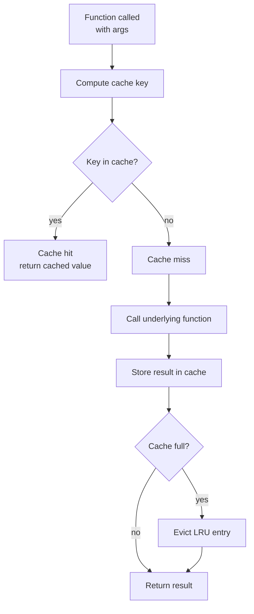
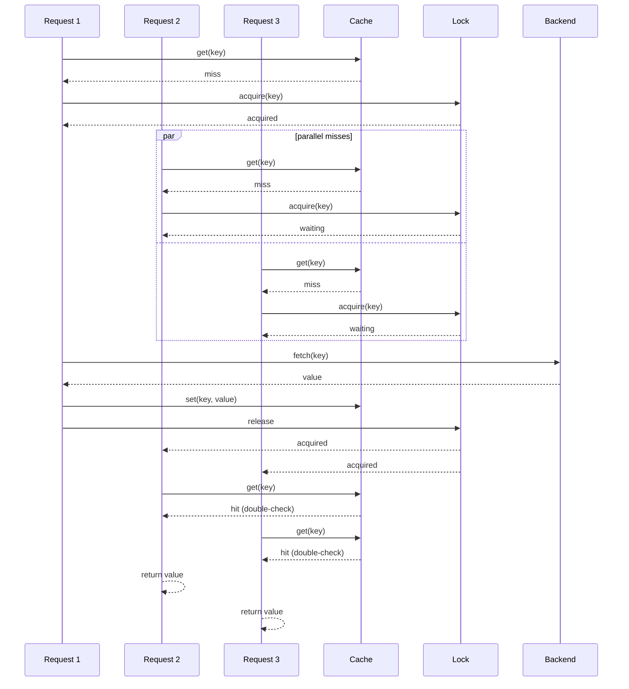

# 6. Caching

> [!note] Why this note exists
> Caching is the single most impactful optimisation in software engineering — a 10× to 1000× speedup for the cost of a decorator or a dict. CPython ships with two stdlib caches (`functools.lru_cache` and the newer `functools.cache`); beyond that, the ecosystem offers `cachetools` for richer policies, `WeakValueDictionary` for garbage-collected caches, and `Redis`/`Memcached` for distributed caches shared across processes. This note covers all of them, plus the **hard parts** that decide whether a cache helps or hurts: cache invalidation (the "two hard problems" joke — naming things, cache invalidation, and off-by-one errors), staleness vs freshness trade-offs, eviction policies (LRU, LFU, TTL, FIFO), time-based expiration, cache stampedes and how to prevent them, and the **failure modes** — unbounded caches that leak memory, caches that return stale data after a DB update, caches that break in multiprocessing because each process has its own, and caches that cost more to maintain than they save. Read alongside [[5. Optimization Techniques]] (caching is the first optimisation to try) and [[2. Reference Counting and GC]] (caches interact with refcounting — a plain dict keeps objects alive forever).

## Why It Matters

> [!quote] Phil Karlton
> There are only two hard things in Computer Science: cache invalidation and naming things.

Caching trades memory (and staleness) for speed. The trade is almost always worth it — when applied correctly. Applied wrongly, caches:

- **Leak memory** because they never evict.
- **Return stale data** because they aren't invalidated when the source changes.
- **Hide bugs** because they make a slow operation appear fast until the cache misses.
- **Break in production** because each worker process has its own cache and they diverge.
- **Cost more than they save** because the cached function is rarely called, and the cache lookup overhead exceeds the computation it would have done.
- **Cause thundering herds** (cache stampede) when 1000 requests simultaneously miss on the same key and all hammer the underlying system.

This note covers the patterns that avoid these failures. The two questions every cache must answer are:

1. **When do entries leave?** Eviction policy: LRU (least recently used), LFU (least frequently used), TTL (time-to-live), FIFO, or unbounded.
2. **When do entries become invalid?** Invalidation strategy: explicit (`cache_clear()`), pattern-based, time-based, or event-driven.

Get those two right and the cache works. Get them wrong and you have a bug that only manifests in production, under load, on the day before launch.

## Background

### What is a cache?

A cache is a fast-access store of computed results. Given a function `f(x)`, a cache stores `x → f(x)` mappings so that subsequent calls with the same `x` return the stored result instead of recomputing.

```python
_cache = {}
def f(x):
    if x not in _cache:
        _cache[x] = compute(x)
    return _cache[x]
```

The **hit ratio** is the fraction of calls that find their result in the cache. A 99% hit ratio means 99% of calls are fast and 1% are slow. The **miss ratio** is its complement.

### Why caches work: locality

Caches work because of **temporal locality** — calls to the same function with the same arguments tend to cluster in time. A web request that fetches user 42's profile is likely to be followed by another request for user 42 within seconds (the user is clicking around). Caching user 42's profile for 60 seconds turns 100 DB queries into 1.

### The cost equation

A cache is worth it when:

```
expected_time_with_cache < expected_time_without_cache

hit_ratio * cache_hit_time + (1 - hit_ratio) * (cache_miss_time + compute_time) < compute_time
```

If `cache_hit_time << compute_time` (typical: nanoseconds vs milliseconds) and `hit_ratio > 0`, the cache wins. The only question is *how much*.

But: cache maintenance (eviction checks, size accounting) itself takes time. For trivial functions (e.g., `lambda x: x + 1`), the cache overhead may exceed the compute time — caching hurts.

### Eviction policies

| Policy | Evicts | Good for |
|---|---|---|
| **LRU** (Least Recently Used) | The entry not accessed for the longest time | Most workloads; the default |
| **LFU** (Least Frequently Used) | The entry with the fewest accesses | Stable popularity (some entries always hot) |
| **FIFO** (First In First Out) | The oldest entry, regardless of access | Simple streaming workloads |
| **TTL** (Time To Live) | Entries older than `ttl` seconds | Data with a freshness requirement |
| **Random** | A random entry | Theoretically competitive with LRU; used in some CDNs |
| **Unbounded** | Nothing | Bounded key sets; dangerous otherwise |

LRU is the default because it captures the common pattern (recently used = likely to be used again) and is cheap to implement (a doubly-linked list + dict).

### Invalidation strategies

- **Explicit**: caller calls `cache.invalidate(key)` when they know the data changed.
- **Pattern-based**: invalidate all keys matching `"user:42:*"` when user 42 updates.
- **Time-based (TTL)**: entries auto-expire after N seconds.
- **Event-driven**: a pub/sub system notifies the cache of changes.
- **Version-based**: each entry has a version; bump the version to invalidate all.

> [!warning] Cache invalidation is the hard problem
> The safest invalidation is "no invalidation" — i.e., cache only pure functions whose outputs never change. The moment you cache a function whose output depends on external state (DB, file, clock), you must invalidate.

### Python-specific concerns

- **Hashability**: cache keys must be hashable. `lru_cache` raises `TypeError` on unhashable args (lists, dicts). Convert to `tuple` or `frozenset`.
- **Reference retention**: a plain `dict` cache keeps values alive forever, preventing GC. Use `WeakValueDictionary` for caches that should auto-evict dead values.
- **Multiprocessing**: each process has its own cache. For shared caches, use `Redis` or `Memcached`.
- **Thread safety**: `lru_cache` is thread-safe; hand-rolled caches may not be.
- **Picklability**: if the cache must be picklable (e.g., for `multiprocessing.Manager`), avoid lambdas and closures.

## Main content

### `functools.lru_cache`: the stdlib workhorse

```python
from functools import lru_cache

@lru_cache(maxsize=128)
def fetch_user(user_id):
    return db.fetch_user(user_id)
```

`lru_cache` is a decorator that memoises a function. Key features:

- **LRU eviction** when `maxsize` is reached.
- **Thread-safe**: internal lock protects the cache.
- **Typed** option: `@lru_cache(maxsize=128, typed=True)` distinguishes `1` and `1.0` as different keys.
- **Introspection**: `fetch_user.cache_info()` returns `(hits, misses, maxsize, currsize)`; `fetch_user.cache_clear()` empties the cache.
- **Unbounded**: `maxsize=None` for unbounded (rarely a good idea).

```python
print(fetch_user.cache_info())
# CacheInfo(hits=15, misses=3, maxsize=128, currsize=3)

fetch_user.cache_clear()
```

`lru_cache` requires all arguments to be hashable. The function's arguments become the cache key (as a tuple).

### `functools.cache`: the unbounded shortcut (Python 3.9+)

```python
from functools import cache

@cache
def fib(n):
    if n < 2: return n
    return fib(n-1) + fib(n-2)
```

`@cache` is equivalent to `@lru_cache(maxsize=None)` — an unbounded cache. Use it when:

- The set of possible keys is bounded and small (e.g., the inputs are a small enum).
- You're memoising a pure function and don't care about memory.
- You're caching recursion (like `fib`) where each argument is hit once.

For functions with unbounded inputs (user IDs, URLs, etc.), always use `@lru_cache(maxsize=N)`.

### Manual caching with a dict

```python
_cache = {}

def expensive(x):
    if x in _cache:
        return _cache[x]
    result = compute(x)
    _cache[x] = result
    return result
```

Manual caching gives you full control: custom eviction, custom keys, custom invalidation. The price is more code and more bugs (forgetting the cache check, race conditions, etc.).

When manual is appropriate:

- The cache key isn't just the function's arguments (e.g., includes the current user, request ID, or version).
- Eviction depends on application logic (e.g., "invalidate when the user logs out").
- You need to cache *part* of a function's result.

Otherwise, use `lru_cache` — it's tested and thread-safe.

### `cachetools`: richer policies

`cachetools` provides a family of cache types:

```python
# pip install cachetools
from cachetools import LRUCache, LFUCache, TTLCache, RRCache, cached

# LRU with maxsize
cache = LRUCache(maxsize=128)

# LFU
cache = LFUCache(maxsize=128)

# TTL: entries expire after 60 seconds
cache = TTLCache(maxsize=128, ttl=60)

# Random replacement
cache = RRCache(maxsize=128)

# Decorator form
@cached(cache=TTLCache(maxsize=128, ttl=60))
def fetch_user(user_id):
    return db.fetch_user(user_id)
```

`cachetools` is the right choice when:

- You need TTL (stdlib `lru_cache` doesn't support it).
- You want LFU or random eviction.
- You want a cache object you can pass around (not just a decorator).

### Time-based expiration

Stdlib `lru_cache` doesn't support TTL. Three approaches:

**Approach 1: `cachetools.TTLCache`.**

```python
from cachetools import TTLCache, cached

@cached(cache=TTLCache(maxsize=1000, ttl=300))
def fetch_stock_price(symbol):
    return api.get_price(symbol)
```

**Approach 2: Manual TTL.**

```python
import time

_cache = {}

def fetch_with_ttl(key, ttl=60):
    if key in _cache:
        value, expires_at = _cache[key]
        if time.time() < expires_at:
            return value
    value = compute(key)
    _cache[key] = (value, time.time() + ttl)
    return value
```

**Approach 3: Decorator that wraps `lru_cache`.**

```python
import time
from functools import lru_cache, wraps

def ttl_cache(maxsize=128, ttl=60):
    def deco(fn):
        @lru_cache(maxsize=maxsize)
        def _cached(ttl_bucket, *args, **kwargs):
            return fn(*args, **kwargs)

        @wraps(fn)
        def wrapper(*args, **kwargs):
            ttl_bucket = int(time.time() / ttl)
            return _cached(ttl_bucket, *args, **kwargs)

        wrapper.cache_info = _cached.cache_info
        wrapper.cache_clear = _cached.cache_clear
        return wrapper
    return deco

@ttl_cache(maxsize=128, ttl=60)
def fetch_user(uid):
    return db.fetch_user(uid)
```

The trick: include a "time bucket" in the cache key. Every 60 seconds, the bucket changes, so all old entries miss. The old entries eventually get evicted by LRU.

### Cache invalidation strategies

**Explicit invalidation** — caller knows the data changed:

```python
@lru_cache(maxsize=128)
def fetch_user(uid):
    return db.fetch_user(uid)

def update_user(uid, **fields):
    db.update_user(uid, **fields)
    fetch_user.cache_clear()   # or: invalidate just uid
```

`lru_cache` only supports clearing the whole cache. For per-key invalidation, use `cachetools`:

```python
from cachetools import LRUCache, cached

_user_cache = LRUCache(maxsize=1000)

@cached(_user_cache)
def fetch_user(uid):
    return db.fetch_user(uid)

def update_user(uid, **fields):
    db.update_user(uid, **fields)
    _user_cache.pop(uid, None)   # invalidate just this entry
```

**Pattern-based invalidation** — invalidate keys matching a pattern:

```python
import re

def invalidate_pattern(cache, pattern):
    regex = re.compile(pattern)
    for key in list(cache.keys()):
        if regex.match(str(key)):
            del cache[key]
```

**Version-based invalidation** — bump a version number to wipe everything:

```python
class VersionedCache:
    def __init__(self):
        self._version = 0
        self._cache = {}

    def bump(self):
        self._version += 1
        self._cache.clear()

    def get(self, key):
        return self._cache.get((self._version, key))

    def set(self, key, value):
        self._cache[(self._version, key)] = value
```

### Cache stampedes and how to prevent them

A **cache stampede** (or thundering herd) happens when many requests simultaneously miss on the same key and all proceed to compute the (expensive) result, overwhelming the backend.

```python
# BAD — under load, 1000 requests all miss and all call compute()
@lru_cache(maxsize=128)
def fetch(x):
    return expensive_compute(x)
```

Prevention strategies:

1. **Lock around the computation**: only one process computes; others wait.

```python
import threading
_locks = {}
_locks_guard = threading.Lock()

def fetch_with_lock(x):
    if x in _cache:
        return _cache[x]
    with _locks_guard:
        if x not in _locks:
            _locks[x] = threading.Lock()
    with _locks[x]:
        if x in _cache:   # double-check after acquiring lock
            return _cache[x]
        result = expensive_compute(x)
        _cache[x] = result
        return result
```

2. **Probabilistic early expiration** (XFetch): each request probabilistically recomputes before TTL expires, smoothing the load. Implemented in some Redis clients.

3. **Pre-warming**: compute known-popular keys at startup or on a schedule.

4. **Single-flight libraries** like `cachetools.func.lru_cache` with a lock, or `async-lru` for async.

### Distributed caching with Redis

When the cache must be shared across processes or machines, use Redis:

```python
# pip install redis
import redis, json, pickle
from functools import wraps

r = redis.Redis(host='localhost', port=6379, db=0)

def redis_cache(prefix, ttl=300):
    def deco(fn):
        @wraps(fn)
        def wrapper(*args, **kwargs):
            key = f"{prefix}:{args}:{kwargs}"
            cached = r.get(key)
            if cached is not None:
                return pickle.loads(cached)
            result = fn(*args, **kwargs)
            r.setex(key, ttl, pickle.dumps(result))
            return result
        return wrapper
    return deco

@redis_cache("user", ttl=300)
def fetch_user(uid):
    return db.fetch_user(uid)
```

Redis benefits:

- **Shared across processes/machines** — all workers see the same cache.
- **Survives process restarts** — caches persist.
- **Built-in TTL** — `SETEX key ttl value`.
- **Atomic operations** — `INCR`, `SETNX` for distributed locks.

Redis costs:

- **Network round-trip** — even at 0.5 ms, it's slower than an in-process dict (10 ns).
- **Serialisation** — pickling/unpickling costs CPU.
- **Infrastructure** — another service to deploy, monitor, scale.

For low-latency in-process caching, use `lru_cache` or `cachetools`. For shared or persistent caching, use Redis.

### Memcached vs Redis

Both are key-value stores commonly used for caching:

| Feature | Memcached | Redis |
|---|---|---|
| Persistence | No | Yes (optional) |
| Data types | Strings only | Strings, lists, sets, hashes, sorted sets |
| TTL | Yes | Yes |
| Atomic ops | Limited | Rich |
| Cluster | Third-party | Built-in (Redis Cluster) |
| Best for | Pure caching | Caching + lightweight data store |

For caching-only workloads, Memcached is simpler. For anything else, Redis.

### Weak-reference caches

For caches that shouldn't keep objects alive:

```python
import weakref

_cache = weakref.WeakValueDictionary()

def get_image(name):
    img = _cache.get(name)
    if img is None:
        img = load_image(name)
        _cache[name] = img
    return img
```

The cache holds only a weak reference. When the caller drops their strong reference, the cache entry dies. Use this when:

- The cache is opportunistic (hits are nice but not required).
- The objects are large.
- You don't want the cache to cause OOM.

Pair with `lru_cache(maxsize=N)` for a bounded LRU + weak-ref cache. Or use `cachetools.LRUCache` with weak values.

### Caching with arguments that aren't hashable

`lru_cache` requires hashable args. For dicts, lists, sets:

```python
@lru_cache(maxsize=128)
def frobnicate(items):
    # items must be hashable; pass tuple, not list
    ...

frobnicate((1, 2, 3))   # works
frobnicate([1, 2, 3])   # TypeError: unhashable type: 'list'
```

Workarounds:

- Convert to hashable form (`tuple(list)`, `frozenset(set)`, `tuple(sorted(dict.items()))`).
- Use a wrapper that serialises the args:

```python
import json
from functools import lru_cache

@lru_cache(maxsize=128)
def _frobnicate_cached(items_json):
    items = json.loads(items_json)
    return _frobnicate_impl(items)

def frobnicate(items):
    return _frobnicate_cached(json.dumps(items, sort_keys=True))
```

### Memoising methods

```python
from functools import lru_cache

class Calculator:
    @lru_cache(maxsize=128)
    def square(self, x):
        return x * x   # cache is per-class, shared across instances
```

Wait — `self` is part of the cache key, so each instance has effectively its own entries, but the cache dict is shared at the class level. Two `Calculator()` instances with `id(self)` difference will have different keys — but the cache grows with the number of instances, which can be a memory leak.

For per-instance caching, use `cached_property` or a custom per-instance dict:

```python
from functools import cached_property

class Config:
    @cached_property
    def parsed(self):
        return load_config_file(self.path)
```

`cached_property` stores the result on the instance (`__dict__`), so each instance has its own cache, and the cache is freed when the instance is.

### `functools.cached_property`

```python
from functools import cached_property

class DataSet:
    def __init__(self, data):
        self.data = data

    @cached_property
    def stats(self):
        # Computed once, cached on the instance
        return expensive_stats(self.data)
```

`cached_property` is a descriptor that computes the value on first access and stores it in the instance's `__dict__`. Subsequent accesses are simple dict lookups.

Use it for:

- Lazy computation of derived attributes.
- Per-instance caches.
- Avoiding repeated expensive work in `__init__` that may not be needed.

### Cache key design

The cache key must uniquely identify the computation. Common patterns:

- **Function arguments as a tuple**: `lru_cache` does this automatically.
- **Custom key**: `f"user:{uid}:v{version}"` for Redis.
- **Hashed key**: `hashlib.sha256(json.dumps(args, sort_keys=True).encode()).hexdigest()` for large args.

Bad keys cause incorrect caching:

```python
@lru_cache(maxsize=128)
def fetch(uid, as_of=None):
    # as_of=None means "now" — but lru_cache will return stale data forever!
    return db.fetch(uid, as_of=as_of or datetime.now())
```

The function looks correct, but `fetch(42)` caches forever — even though the user's data may change. Always include time-varying inputs in the key.

### Cache size tuning

- **Too small**: low hit ratio, cache thrashes.
- **Too large**: high memory use, no benefit beyond a point.
- **Sweet spot**: just large enough that the working set fits.

For `lru_cache`, monitor `cache_info()`:

```python
info = fetch_user.cache_info()
print(f"hits={info.hits}, misses={info.misses}, currsize={info.currsize}/{info.maxsize}")
print(f"hit ratio: {info.hits / (info.hits + info.misses):.1%}")
```

Aim for >90% hit ratio on a hot path. If you're at 50%, the cache is too small or the working set is too large.

## Mermaid: cache hit/miss flow



## Mermaid: single-flight cache stampede prevention



## Mermaid: local vs distributed cache

```mermaid
flowchart TB
    subgraph "In-process cache (lru_cache / cachetools)"
        P1[Worker process 1]
        P2[Worker process 2]
        P3[Worker process 3]
        C1[Cache 1]
        C2[Cache 2]
        C3[Cache 3]
        P1 --> C1
        P2 --> C2
        P3 --> C3
        NOTE1[Each process has its own cache.<br/>Hits are fast (ns).<br/>Cache diverges across processes.]
    end

    subgraph "Distributed cache (Redis / Memcached)"
        Q1[Worker process 1]
        Q2[Worker process 2]
        Q3[Worker process 3]
        SHARED[Shared cache]
        Q1 -->|network| SHARED
        Q2 -->|network| SHARED
        Q3 -->|network| SHARED
        NOTE2[All processes share one cache.<br/>Hits are slower (ms).<br/>Cache is consistent.]
    end
```

## Code examples

### `lru_cache` basics

```python
from functools import lru_cache

@lru_cache(maxsize=128)
def fib(n):
    if n < 2:
        return n
    return fib(n - 1) + fib(n - 2)

print(fib(100))   # 354224848179261915075, instant (without cache: ~heat death of universe)
print(fib.cache_info())
# CacheInfo(hits=98, misses=101, maxsize=128, currsize=101)
```

### TTL cache with `cachetools`

```python
from cachetools import TTLCache, cached

@cached(cache=TTLCache(maxsize=1000, ttl=300))
def fetch_stock(symbol):
    return api.get_price(symbol)

# After 5 minutes, the entry auto-expires.
```

### Per-key invalidation with `cachetools`

```python
from cachetools import LRUCache, cached

_user_cache = LRUCache(maxsize=1000)

@cached(_user_cache)
def fetch_user(uid):
    return db.fetch_user(uid)

def invalidate_user(uid):
    _user_cache.pop(uid, None)
```

### Weak-reference cache

```python
import weakref

class BigImage:
    def __init__(self, name):
        self.name = name
        self.data = b"\0" * 10_000_000   # 10 MB

_cache = weakref.WeakValueDictionary()

def get_image(name):
    img = _cache.get(name)
    if img is None:
        img = BigImage(name)
        _cache[name] = img
    return img

img1 = get_image("cat.png")
img2 = get_image("cat.png")   # cache hit
assert img1 is img2

del img1, img2
print("cat.png" in _cache)   # False — entry died with no strong refs
```

### Manual single-flight cache

```python
import threading

class SingleFlightCache:
    def __init__(self, maxsize=128):
        self._cache = {}
        self._locks = {}
        self._guard = threading.Lock()

    def get_or_compute(self, key, compute):
        if key in self._cache:
            return self._cache[key]
        with self._guard:
            if key not in self._locks:
                self._locks[key] = threading.Lock()
        with self._locks[key]:
            if key in self._cache:   # double-check
                return self._cache[key]
            result = compute(key)
            self._cache[key] = result
            return result

cache = SingleFlightCache()

def fetch_user(uid):
    return cache.get_or_compute(uid, lambda i: db.fetch_user(i))
```

### Redis-backed cache

```python
import redis, pickle
from functools import wraps

r = redis.Redis(host='localhost', port=6379, db=0)

def redis_cache(prefix, ttl=300):
    def deco(fn):
        @wraps(fn)
        def wrapper(*args, **kwargs):
            key = f"{prefix}:{args}:{sorted(kwargs.items())}"
            cached = r.get(key)
            if cached is not None:
                return pickle.loads(cached)
            result = fn(*args, **kwargs)
            r.setex(key, ttl, pickle.dumps(result))
            return result
        return wrapper
    return deco

@redis_cache("user", ttl=300)
def fetch_user(uid):
    return db.fetch_user(uid)
```

### `cached_property` for lazy attributes

```python
from functools import cached_property

class HTMLReport:
    def __init__(self, data):
        self.data = data

    @cached_property
    def rendered_html(self):
        # Expensive render, computed once on first access
        return render_to_html(self.data)

    @cached_property
    def word_count(self):
        return len(self.data.split())

report = HTMLReport(load_data())
# render_to_html is NOT called yet
print(report.rendered_html)   # render_to_html called here
print(report.rendered_html)   # cache hit
```

### Caching with custom key

```python
import hashlib, json
from functools import lru_cache

def make_key(*args, **kwargs):
    payload = json.dumps({"args": args, "kwargs": kwargs}, sort_keys=True, default=str)
    return hashlib.sha256(payload.encode()).hexdigest()

_cache = {}

def fetch_with_filters(filters, sort, limit):
    key = make_key(filters, sort, limit)
    if key in _cache:
        return _cache[key]
    result = db.query(filters, sort, limit)
    _cache[key] = result
    return result
```

### Monitoring cache effectiveness

```python
from functools import lru_cache

@lru_cache(maxsize=1000)
def fetch_user(uid):
    return db.fetch_user(uid)

# In a monitoring endpoint:
def cache_stats():
    info = fetch_user.cache_info()
    total = info.hits + info.misses
    hit_ratio = info.hits / total if total > 0 else 0
    return {
        "hits": info.hits,
        "misses": info.misses,
        "hit_ratio": hit_ratio,
        "size": info.currsize,
        "max_size": info.maxsize,
    }
```

## Common Pitfalls

1. **Caching functions with side effects.** `@lru_cache` on a function that prints, logs, or mutates global state will skip the side effect on cache hits. Cache only pure functions.

2. **Caching functions with mutable return values.** If the caller mutates the returned object, the cache stores the mutation. Return a copy, or document immutability.

3. **Unbounded caches with unbounded inputs.** `@lru_cache(maxsize=None)` on `fetch_user(uid)` will grow forever as new users are queried. Always set `maxsize` for functions with unbounded inputs.

4. **Forgetting to invalidate after writes.** `update_user(uid)` doesn't auto-invalidate `fetch_user(uid)`. Either call `cache_clear()` or use `cachetools` per-key invalidation.

5. **Cache key includes time-varying data not in the args.** `def fetch(uid): return db.fetch(uid, as_of=now)` caches forever because `now` is computed inside the function, not in the key.

6. **Cache stampede on cold start.** 1000 simultaneous requests miss on the same key; all call the backend. Use single-flight locking.

7. **Cross-process inconsistency.** Each worker has its own `lru_cache`; one process invalidates, others don't. Use Redis for cross-process consistency.

8. **Caching too eagerly.** A function called twice per request doesn't need caching — the cache overhead may exceed the savings. Profile first.

9. **Stale data after DB updates.** Time-based TTL is a fallback, not a primary invalidation strategy. Always invalidate explicitly when you know the data changed.

10. **Forgetting `functools.wraps` on custom cache decorators.** Loses `__name__`, `__doc__`, signature. See [[4. Decorators Deep Dive]].

11. **Using `lru_cache` on methods without thinking about `self`.** Each instance has effectively separate entries (because `self` is part of the key), but the cache dict is shared at the class level — unbounded growth as instances come and go.

12. **Returning mutable cached objects.** `@lru_cache\ndef get_list(): return [1, 2, 3]` — caller does `get_list().append(4)` and now the cache returns `[1, 2, 3, 4]`. Return `tuple` or a copy.

13. **Caching exceptions unintentionally.** `lru_cache` caches return values, not exceptions. If the function raises, the next call retries. (Some libraries like `cachetools` support exception caching.)

14. **Memory leaks via cache references.** A plain `dict` cache keeps values alive forever, even after the caller drops them. Use `WeakValueDictionary` for opportunistic caches.

15. **Neglecting cache size in tests.** Tests with `maxsize=128` may pass while production with `maxsize=100_000` behaves differently (LRU eviction patterns differ).

16. **Cache warming during deployment.** Cold cache after deploy causes a request spike. Pre-warm in a startup hook.

17. **Trusting `cache_info()` hit ratio from one window.** A 99% hit ratio over 24 hours may hide a 0% hit ratio in the last 5 minutes. Monitor continuously.

18. **Forgetting that pickled cache values are version-sensitive.** If you change a class definition, old pickled cache entries may fail to unpickle.

## Tips and Tricks

- **Start with `@lru_cache(maxsize=128)`** as the default. Bump `maxsize` if `cache_info().currsize` is pinned at max with low hit ratio.
- **Use `@cache` (unbounded) only for pure functions with bounded inputs** — recursion, enums, small key sets.
- **For TTL, use `cachetools.TTLCache`** or implement the time-bucket trick.
- **For per-key invalidation, use `cachetools.LRUCache`** and call `cache.pop(key)`.
- **For shared caches across processes, use Redis.** Network cost (~0.5 ms) is acceptable for millisecond-scale operations.
- **For opportunistic caches, use `WeakValueDictionary`** — entries die with their referents.
- **For lazy attributes, use `@cached_property`.**
- **Pre-warm cold caches** at startup or on a schedule to avoid stampedes.
- **Monitor `cache_info()`** in production — track hit ratio over time.
- **Set `maxsize` to ~2× the working set** to allow for churn.
- **Use single-flight locking** when the cached function is expensive and concurrency is high.
- **Invalidate on writes** — explicit invalidation beats TTL alone.
- **Don't cache functions that return mutable objects** unless you copy on return.
- **Don't cache functions with side effects** — the side effect won't happen on hit.
- **Don't cache trivial functions** — cache overhead may exceed compute.
- **For distributed caches, version your keys** (`user:42:v3`) so you can invalidate by bumping the version.
- **Use probabilistic early expiration (XFetch)** to smooth stampedes at scale.
- **For async code, use `async-lru` or `aiocache`** instead of `lru_cache` (which doesn't await).
- **For HTTP caching, use `requests-cache` or `httpx-cache`** — they handle ETags, Last-Modified, Cache-Control.
- **For HTML fragment caching, use the framework's built-in** (Django's cache framework, Flask-Caching).
- **Profile before caching.** The function you think is slow may not be; the actual hot spot is elsewhere. See [[4. cProfile and timeit]].

## Active Recall

1. What are the two questions every cache must answer?
2. Write an `@lru_cache(maxsize=128)` example and show how to inspect its hit ratio.
3. What's the difference between `@lru_cache` and `@cache`?
4. When would you use `cachetools.TTLCache` instead of `lru_cache`?
5. Write a manual cache with a dict. What's missing compared to `lru_cache`?
6. What is a cache stampede, and how do you prevent it?
7. Write a single-flight cache using `threading.Lock`.
8. Why does `lru_cache` not work directly on a function with `dict` arguments? How do you fix it?
9. Write a Redis-backed cache decorator with TTL.
10. What's the difference between `lru_cache` on a method and `cached_property`?
11. How do you invalidate a single key in `lru_cache`? In `cachetools`?
12. What is `WeakValueDictionary` for? When is it the right choice?
13. Why is "explicit invalidation beats TTL alone" the right principle?
14. Write a time-bucket TTL trick that wraps `lru_cache`.
15. When is a distributed cache (Redis) preferable to an in-process cache?
16. What's the danger of caching a function that returns a mutable object?
17. How do you cache an async function?
18. Describe the cache hit/miss flow with a Mermaid diagram.
19. What cache size should you choose? How do you tune it?
20. Why is profiling before caching important?

## Next Steps

- [[5. Optimization Techniques]] — caching is the first optimisation to try after algorithmic improvements.
- [[4. cProfile and timeit]] — profile before caching; the function you think is slow may not be.
- [[2. Reference Counting and GC]] — caches interact with refcounting; unbounded caches leak.
- [[3. Memory Profiling]] — caches consume memory; profile to size them.
- [[1. Python Memory Model]] — hashability, why `dict` keys must be hashable.
- [[10. Pythonic Programming]] — `@lru_cache` and `@cached_property` are Pythonic patterns.
- [[14. Concurrency]] — thread safety and locking for shared caches.
- [[22. Native Extensions]] — when caching isn't enough, reach for Cython/C.
