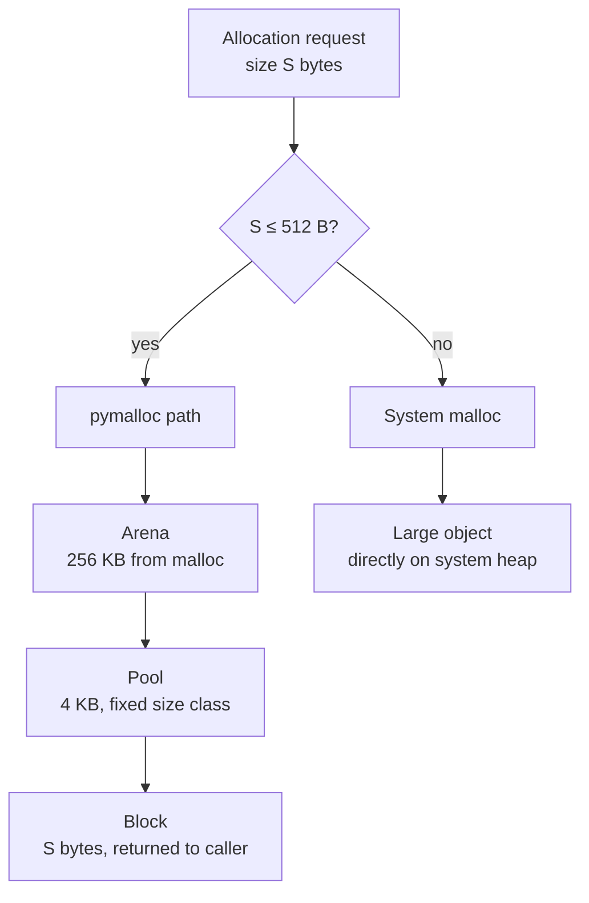
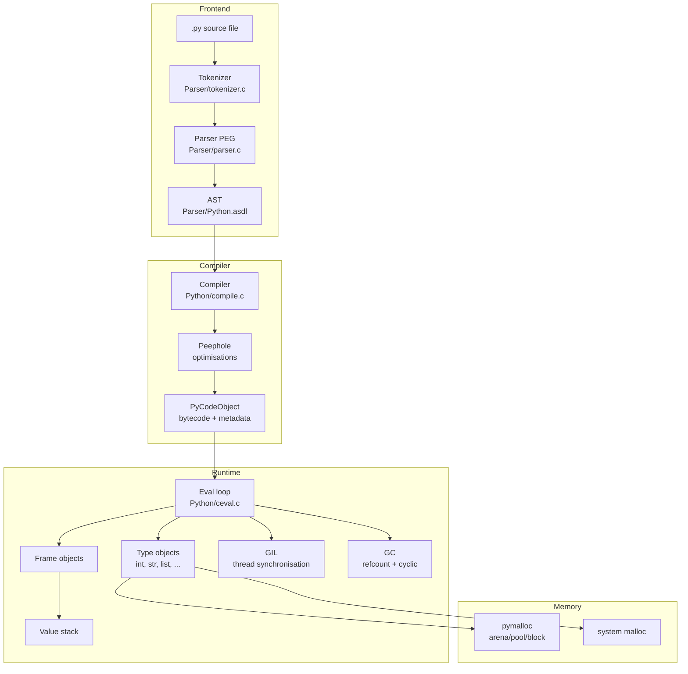

# 1. CPython Architecture

> [!note] Why this note exists
> CPython is the **reference implementation** of the Python language — the version on python.org, the one almost everyone runs, the one whose behaviour defines what "Python" means. This note is a map of its source tree, its compile pipeline (source → tokens → AST → bytecode → eval loop), its memory allocator (`pymalloc`: arena → pool → block), its object model (`PyObject` header on every value), and its historical design choices (the GIL, the three-stage GC, the bytecode VM). The other notes in this chapter — [[2. Bytecode and the dis Module]], [[3. The Execution Model]], [[4. The Object Model]], [[5. The C API]] — drill into specific subsystems; this note gives you the bird's-eye view that ties them together. After reading it, navigating the `cpython` source tree on GitHub should feel familiar: you'll know which directory holds the parser, which holds the GC, which holds the eval loop, and which holds the implementations of `list`, `dict`, `int`, and `str`.

## Why It Matters

Reading the CPython source is the single highest-leverage activity for any Python developer who wants to move from "user" to "expert". It explains:

- **Why Python is slow.** The eval loop is a giant `switch` statement; every bytecode is one trip around the loop. There is no JIT (in stock CPython; PyPy and Python 3.13's experimental JIT change this).
- **Why Python is the way it is.** Why are ints arbitrary-precision but floats aren't? Why is `dict` insertion-ordered? Why are classes callable? Why do decorators work? The answers are all in the source.
- **Why the GIL exists.** Reference counting needs a global lock to be safe; alternative implementations (PyPy, Jython, IronPython) chose tracing GC instead and could remove the GIL.
- **Where to look when something weird happens.** A `RecursionError`? Look in `Python/ceval.c`. An unexpected `TypeError` from a built-in? Look in `Objects/abstract.c` or the type-specific file like `Objects/listobject.c`. A crash in a C extension? Look at `Include/object.h` for the `PyObject` layout.
- **How C extensions interact with the interpreter.** Every C extension is a `PyModuleDef`, every extension type is a `PyTypeObject`, every C function takes `PyObject*` args and returns `PyObject*`. The C API is the surface area; the source shows you what's underneath.
- **What "interning" means.** Why `id(42) == id(42)` and `id("hello") == id("hello")` in the same module. Why `-5` to `256` are special.

## Background

### What is CPython?

CPython is the **reference implementation** of the Python language. It's:

- **Written in C** (with some Python in the build system and stdlib).
- **Maintained by the Python Software Foundation** and a community of contributors.
- **Released yearly** (3.13 in 2024, 3.14 in 2025, etc.).
- **Hosted at github.com/python/cpython**.

Other Python implementations:

| Implementation | Language | Notes |
|---|---|---|
| **CPython** | C | The reference; what everyone runs |
| **PyPy** | RPython | JIT-compiled; 4–10× faster for pure Python |
| **Jython** | Java | Compiles to JVM bytecode; runs on the JVM |
| **IronPython** | C# | Targets .NET |
| **MicroPython** | C | For microcontrollers |
| **GraalPy** | Java | On GraalVM; polyglot |

When the Python language spec says something, CPython's behaviour is the de facto standard. Other implementations match CPython's behaviour as closely as possible (with caveats — e.g., PyPy doesn't have a GIL, Jython uses Java strings).

### The CPython release cadence

PEP 602 established a yearly release cycle:

- A new minor version (3.x) every October.
- Each minor version gets bugfix releases (3.x.1, 3.x.2, ...) for ~2 years.
- Each minor version gets security releases for ~5 years total.

Notable recent versions:

- **3.9 (2020)**: `dict` union operator, `str.removeprefix`.
- **3.10 (2021)**: structural pattern matching, better error messages.
- **3.11 (2022)**: 10–60% faster than 3.10 ("Faster CPython" project), exception groups.
- **3.12 (2023)**: PEP 695 type parameter syntax, immortal objects, per-interpreter GIL groundwork.
- **3.13 (2024)**: experimental JIT (PEP 744), experimental no-GIL build (PEP 703), removed `distutils`.
- **3.14 (2025)**: deferred evaluation of annotations, free-threaded build improvements, tail-call interpreter.

### The compile pipeline

CPython turns source code into running programs in five stages:


1. **Tokenisation** (`Parser/tokenizer.c`): the source text is split into tokens — keywords, identifiers, operators, literals, whitespace. Tokens carry line/column for error messages.
2. **Parsing** (`Parser/parser.c`): tokens are assembled into an Abstract Syntax Tree (AST) according to the grammar in `Grammar/python.gram`. The AST is a tree of `stmt` and `expr` nodes defined in `Parser/Python.asdl`.
3. **Compilation** (`Python/compile.c`): the AST is lowered to a Control Flow Graph, then to bytecode. The compiler also performs simple optimisations (constant folding, peephole optimisations).
4. **Bytecode storage**: the resulting `PyCodeObject` is stored in memory (and optionally cached to disk as a `.pyc` file in `__pycache__/`).
5. **Execution** (`Python/ceval.c`): the eval loop walks the bytecode, dispatching each instruction to a handler.

### The `.pyc` cache

When you `import mymodule`, CPython:

1. Looks for `mymodule.py` on `sys.path`.
2. Checks for `__pycache__/mymodule.cpython-3X.pyc`.
3. If the `.pyc` exists and its timestamp matches the `.py`, loads the bytecode directly (skipping steps 1–3 of the pipeline).
4. Otherwise, compiles `mymodule.py` to bytecode, writes a `.pyc`, and uses it.

The `.pyc` file is a marshalled `PyCodeObject` with a header containing the magic number (which Python version), the source timestamp, and the source size. Loading a `.pyc` is much faster than re-parsing — useful for large modules.

You can disable `.pyc` writing with `python -B` or by setting `PYTHONDONTWRITEBYTECODE=1`. You can pre-compile with `python -m compileall mymodule.py`.

### Interning: small ints and identifiers

CPython pre-allocates certain commonly-used objects at startup to avoid creating new ones:

- **Small integers (-5 to 256)**: pre-allocated as `PyLongObject`s. Any `PyLong_FromLong(n)` for `n` in this range returns the cached object. The cache is in `Objects/longobject.c`.
- **Identifier-like strings**: strings that match `[a-zA-Z_][a-zA-Z0-9_]*` are interned automatically when used as variable names, attribute names, dict keys, or in `from ... import *`. Interning is in `Objects/unicodeobject.c`.
- **`None`, `True`, `False`**: singletons in `Objects/boolobject.c` and `Objects/object.c`.
- **Empty tuple `()`**: a singleton. The C-level `_Py_SINGLETON(tuple_empty)` reference.

```python
import sys

# Small ints
a, b = 100, 100
print(a is b)   # True — same interned object

a, b = 1000, 1000
print(a is b)   # In a module: True (constant folding). In REPL: False.

# Manual interning of arbitrary strings
s1 = sys.intern("hello world!")
s2 = sys.intern("hello world!")
print(s1 is s2)   # True
```

Interning matters for performance: comparing two interned strings is `O(1)` (pointer compare) instead of `O(n)` (byte-by-byte). It also matters for memory: interned strings are shared, so a million references to `"user"` use one underlying string.

### `pymalloc`: the memory allocator

CPython's allocator is layered. For allocations ≤ 512 bytes, it uses **pymalloc**, a custom arena/pool/block allocator tuned for the pattern of many small, short-lived objects. For larger allocations, it calls `malloc`/`free` directly.



The layers:

- **Arena**: 256 KB chunk obtained from `malloc`. The arena allocator (`Objects/obmalloc.c`) maintains a free list of arenas. When all pools in an arena are free, the arena is returned to the OS.
- **Pool**: 4 KB slice of an arena, dedicated to one **size class**. Size classes are 8, 16, 24, …, 512 bytes (64 classes total). A pool for the 80-byte size class only ever holds 80-byte blocks.
- **Block**: a single allocation within a pool. Blocks in a pool are all the same size; free blocks are tracked in a free list.

When you free a small object, pymalloc just adds the block back to its pool's free list — no `free()` call. This dramatically reduces malloc/free overhead.

Large allocations (> 512 B) go straight to `malloc`/`free`. So do `bytes` and `bytearray` whose size exceeds the threshold.

You can disable pymalloc with `PYTHONMALLOC=malloc` — useful for debugging with Valgrind or AddressSanitizer, since pymalloc hides individual allocations from those tools.

## Main content

### Source tree overview

The CPython source tree at github.com/python/cpython:

```
cpython/
├── Include/         # C header files (PyObject, PyTypeObject, etc.)
├── Objects/         # Implementations of built-in types (list, dict, int, str, ...)
├── Python/          # The interpreter core (compiler, eval loop, bltinmodule)
├── Parser/          # Tokenizer, parser, AST, grammar
├── Modules/         # C extensions that ship as stdlib (math, _io, _socket, ...)
├── Lib/             # Python stdlib (pure-Python modules)
├── Programs/        # Entry points (python.c, freeze, etc.)
├── Grammar/         # Grammar files (python.gram)
├── Doc/             # Documentation source
├── PC/              # Windows-specific files
├── Mac/             # macOS-specific files
├── Python/ceval.c   # The eval loop
├── Python/compile.c # The compiler (AST → bytecode)
├── Python/bltinmodule.c  # Built-in functions (print, len, sum, ...)
└── Objects/object.c # The most-generic object operations (PyObject_GetAttr, etc.)
```

Key files to bookmark:

| File | What's in it |
|---|---|
| `Include/object.h` | `PyObject` and `PyVarObject` structs; `Py_INCREF`/`Py_DECREF` macros |
| `Include/cpython/object.h` | `PyTypeObject` definition (the type struct) |
| `Objects/object.c` | `PyObject_GetAttr`, `PyObject_RichCompare`, generic ops |
| `Objects/listobject.c` | The `list` type |
| `Objects/dictobject.c` | The `dict` type |
| `Objects/longobject.c` | Arbitrary-precision integers |
| `Objects/unicodeobject.c` | Strings |
| `Python/ceval.c` | The eval loop (bytecode dispatch) |
| `Python/compile.c` | The compiler |
| `Python/ast.c` | AST construction |
| `Python/bltinmodule.c` | Built-in functions |
| `Modules/gcmodule.c` | The cyclic GC |
| `Parser/tokenizer.c` | The tokenizer |
| `Parser/parser.c` | The parser |

### The compile pipeline in detail

#### Stage 1: Tokenisation (`Parser/tokenizer.c`)

The tokenizer is a hand-written state machine that reads the source text and produces a stream of tokens. Each token is a `(type, string, line, col)` tuple. Token types include `NAME`, `NUMBER`, `STRING`, `OP`, `NEWLINE`, `INDENT`, `DEDENT`.

The tokenizer also handles:

- **String prefixes** (`b"..."`, `f"..."`, `r"..."`, `u"..."`).
- **Numeric literals** (decimal, hex, octal, binary, float, imaginary).
- **Line continuation** with backslash.
- **Implicit line joining** inside brackets.
- **Comments** (ignored, but counted for line numbers).
- **F-strings** are tokenised as `STRING` tokens; the f-string-specific parsing happens later.

You can play with the tokenizer from Python:

```python
import tokenize
with open('mymodule.py', 'rb') as f:
    for tok in tokenize.tokenize(f.readline):
        print(tok)
```

#### Stage 2: Parsing (`Parser/parser.c`)

The parser is a **PEG (Parsing Expression Grammar)** parser, introduced in Python 3.9 (replacing the old LL(1) parser). The grammar is in `Grammar/python.gram`, written in a custom PEG DSL.

PEG parsers are unambiguous: each rule tries alternatives in order, and the first match wins. This eliminates the LL(1) conflicts that required grammar hacks in older Python.

The parser produces an AST — a tree of `stmt` and `expr` nodes defined in `Parser/Python.asdl`. AST node types include `Module`, `FunctionDef`, `Return`, `Assign`, `Name`, `Constant`, `BinOp`, `Call`, etc.

```python
import ast
tree = ast.parse("x = 1 + 2")
print(ast.dump(tree))
# Module(body=[Assign(targets=[Name(id='x', ctx=Store())],
#                      value=BinOp(left=Constant(value=1), op=Add(), right=Constant(value=2)))])
```

You can also walk the AST to implement linters, code transformers, etc. See [[1. Metaprogramming]] for AST manipulation.

#### Stage 3: Compilation (`Python/compile.c`)

The compiler lowers the AST to bytecode in two passes:

1. **AST → CFG**: each statement is compiled to a sequence of bytecode instructions. Control flow (`if`, `while`, `for`, `try`) produces basic blocks with jumps between them.
2. **CFG → bytecode**: the CFG is linearised into a single bytecode sequence, with jump targets resolved to offsets.

The compiler also performs **peephole optimisations**:

- **Constant folding**: `1 + 2` is computed at compile time, not runtime.
- **Dead code elimination**: unreachable statements after `return` are dropped.
- **Conditional simplification**: `if True: ...` becomes unconditional.
- **Empty collection literals**: `set()` becomes a constant.

```python
import dis
def f():
    x = 1 + 2
    return x
dis.dis(f)
# 2           0 RESUME 0
# 3           2 LOAD_CONST 1 (3)   <- 1 + 2 was folded to 3
#             4 STORE_FAST 0 (x)
# 4           6 LOAD_FAST 0 (x)
#             8 RETURN_VALUE
```

#### Stage 4: Bytecode execution (`Python/ceval.c`)

The eval loop is the heart of CPython. It's a giant `switch` statement (in modern versions, using "computed goto" for speed) that dispatches on the opcode of the current bytecode instruction.

Simplified pseudocode:

```c
PyObject* _PyEval_EvalFrame(PyThreadState *tstate, PyFrameObject *frame) {
    PyObject **stack_pointer = frame->f_valuestack;
    _Py_CODEUNIT *next_instr = frame->f_code->co_code;
    while (1) {
        _Py_CODEUNIT opcode = *next_instr++;
        switch (opcode) {
            case LOAD_FAST:
                PUSH(frame->f_localsplus[oparg]);
                break;
            case STORE_FAST:
                frame->f_localsplus[oparg] = POP();
                break;
            case BINARY_ADD:
                PyObject *b = POP();
                PyObject *a = POP();
                PUSH(PyNumber_Add(a, b));
                break;
            case RETURN_VALUE:
                return POP();
            // ... hundreds of cases ...
        }
    }
}
```

Each iteration: fetch an opcode, decode it, jump to its handler, execute, repeat. Modern CPython uses computed goto (a GCC extension) instead of `switch` for ~15% speedup. Python 3.13 introduced an experimental JIT compiler that further speeds up hot loops.

See [[3. The Execution Model]] for the deep dive on the eval loop, frames, and the value stack.

### The `PyObject` header

Every CPython object begins with the same two C fields (defined in `Include/object.h`):

```c
typedef struct _object {
    Py_ssize_t ob_refcnt;       // reference count
    PyTypeObject *ob_type;      // pointer to type object
} PyObject;
```

Variable-length types add `ob_size`:

```c
typedef struct {
    PyObject ob_base;
    Py_ssize_t ob_size;         // number of items
} PyVarObject;
```

So a `list[int]` of length 1 million is a single `PyListObject` (the header + a pointer to the int array) plus 1 million `PyLongObject`s (each ~28 bytes). The `PyListObject` itself is small; the bulk is in the elements.

See [[4. The Object Model]] for the full treatment of types, slots, descriptors, and MRO.

### The type object (`PyTypeObject`)

Every object has a `ob_type` pointer to a `PyTypeObject` — the object that describes the type. The `PyTypeObject` is itself a `PyObject` (its `ob_type` is `type`, and `type`'s `ob_type` is `type` itself — a self-reference at the top of the type hierarchy).

The `PyTypeObject` struct (simplified — the real one has ~80 fields) contains:

- `tp_name`: the type's name (e.g., `"list"`, `"int"`).
- `tp_basicsize`, `tp_itemsize`: object size for `malloc`.
- `tp_dealloc`: deallocation function.
- `tp_repr`: `__repr__` implementation.
- `tp_hash`: `__hash__`.
- `tp_call`: `__call__` (makes instances callable).
- `tp_str`: `__str__`.
- `tp_getattro`, `tp_setattro`: attribute access.
- `tp_richcompare`: `__eq__`, `__lt__`, etc.
- `tp_iter`, `tp_iternext`: iteration.
- `tp_methods`: the type's methods.
- `tp_members`: the type's C-level members.
- `tp_getset`: descriptors.
- `tp_base`: the base class.
- `tp_dict`: the type's namespace.
- `tp_mro`: method resolution order.

These are called **type slots** — function pointers that the eval loop calls when it needs to perform an operation. When you do `len(x)`, the eval loop calls `x`'s `tp_as_mapping->mp_length` (or `tp_as_sequence->sq_length`). The slot mechanism is how Python achieves dynamic dispatch without vtables in the C++ sense.

### Heap vs static types

- **Static types**: `int`, `str`, `list`, `dict`, `tuple`, `type`, etc. These are statically allocated C structs at known addresses. They live forever.
- **Heap types**: classes created with `class Foo:`, or with `PyType_FromSpec` in C extensions. These are heap-allocated `PyTypeObject`s that participate in the GC and can be subclassed.

Static types are slightly faster (no pointer chase for the type, no GC tracking), but they can't be subclassed from Python. Most built-in types are static; user classes are heap types.

### The `Modules/` directory: C extensions

The `Modules/` directory contains C extensions that ship with the stdlib. Each is a `PyModuleDef` with a set of functions. Examples:

- `Modules/mathmodule.c` — the `math` module.
- `Modules/_iomodule.c` — the `io` module (the core of file I/O).
- `Modules/_socketmodule.c` — the `socket` module.
- `Modules/_threadmodule.c` — the `threading` module.
- `Modules/gcmodule.c` — the `gc` module (the cyclic garbage collector).
- `Modules/_collectionsmodule.c` — `collections.deque`, `Counter`.

Each module exports an init function that CPython calls when the module is imported. The function creates a `PyModuleDef`, registers it, and returns the module object.

See [[5. The C API]] for how to write your own C extension.

### The `Lib/` directory: Python stdlib

The pure-Python stdlib lives in `Lib/`. Examples:

- `Lib/os.py` — the `os` module (much of which calls C functions).
- `Lib/json/__init__.py` — the `json` module (pure Python; C accelerator in `_json`).
- `Lib/typing.py` — the `typing` module.
- `Lib/collections/__init__.py` — `collections` (with C accelerators in `_collections`).
- `Lib/asyncio/` — the `asyncio` framework.

Many modules have a pure-Python implementation and an optional C accelerator (e.g., `json` and `_json`, `functools` and `_functools`). The C version is used if available; otherwise the Python version. This makes the stdlib portable (any Python implementation can use the pure-Python version) without sacrificing speed on CPython.

### The GIL: why it exists, why it's hard to remove

The **Global Interpreter Lock (GIL)** is a single mutex that serialises Python bytecode execution. Only one OS thread can hold the GIL at a time; the others wait.

Why it exists:

1. **Reference counting is not thread-safe without a lock.** `Py_INCREF` does `obj->ob_refcnt++`, which is a read-modify-write race condition across threads. The GIL serialises this.
2. **Most C extensions aren't thread-safe.** Removing the GIL would break them.
3. **It's simpler.** Single-threaded bytecode means no concurrent modification of dicts, lists, or the type system.

Why it's hard to remove:

1. **Every `Py_INCREF`/`Py_DECREF` would need to be atomic** (or use biased reference counting), slowing single-threaded code.
2. **C extensions would need reworking** — they assume the GIL is held.
3. **Existing lock-based code** assumes Python-level operations are atomic, which the GIL guarantees.

PEP 703 (Python 3.13+) introduces an experimental **no-GIL** build (called "free-threaded Python"). It uses biased reference counting, replaces `Py_INCREF`/`Py_DECREF` with atomic operations, and adds per-object locks. As of 3.13 it's experimental; mainstream adoption is expected in 3.14+.

For CPU-bound parallelism today, the workaround is `multiprocessing` — multiple processes, each with its own GIL. See [[14. Concurrency]].

### The GC: refcounting + generational cyclic

CPython has two garbage collectors:

1. **Reference counting** (primary): every `PyObject` has an `ob_refcnt` field. When it hits zero, the object is immediately freed. Deterministic, fast, can't handle cycles.
2. **Generational cyclic GC** (secondary): runs periodically to find unreachable cycles. Three generations, scanned at increasing intervals.

See [[2. Reference Counting and GC]] for the full treatment.

## Mermaid: CPython architecture



## Mermaid: compile pipeline

```mermaid
sequenceDiagram
    participant User
    participant Imp as Import system
    participant Tok as Tokenizer
    participant Par as Parser
    participant Com as Compiler
    participant CEval as Eval loop

    User->>Imp: import mymod
    Imp->>Imp: find mymod.py
    Imp->>Imp: check __pycache__/mymod.cpython-3X.pyc
    alt .pyc up-to-date
        Imp->>Imp: load .pyc bytecode
    else .pyc stale or missing
        Imp->>Tok: tokenize source
        Tok-->>Par: stream of tokens
        Par->>Par: PEG parse to AST
        Par-->>Com: AST
        Com->>Com: lower AST to CFG
        Com->>Com: peephole optimise
        Com->>Com: emit bytecode
        Com-->>Imp: PyCodeObject
        Imp->>Imp: write .pyc
    end
    Imp->>CEval: execute module top-level
    CEval-->>User: module object
```

## Code examples

### Inspecting the bytecode of a function

```python
import dis

def add(a, b):
    return a + b

print(dis.dis(add))
#  2           0 RESUME 0
#  3           2 LOAD_FAST 0 (a)
#              4 LOAD_FAST 1 (b)
#              6 BINARY_OP 0 (+)
#              8 RETURN_VALUE
```

See [[2. Bytecode and the dis Module]] for the full disasm API.

### Inspecting the AST

```python
import ast

tree = ast.parse("x = 1 + 2\nprint(x)")
print(ast.dump(tree, indent=2))
# Module(
#   body=[
#     Assign(targets=[Name(id='x', ctx=Store())],
#            value=BinOp(left=Constant(value=1), op=Add(), right=Constant(value=2))),
#     Expr(value=Call(func=Name(id='print', ctx=Load()), args=[Name(id='x', ctx=Load())]))
#   ]
# )
```

### Examining a `PyCodeObject`

```python
def f(x, y=10, *args, **kwargs):
    z = x + y
    return z

print(f.__code__.co_varnames)        # ('x', 'y', 'args', 'kwargs', 'z')
print(f.__code__.co_argcount)        # 2
print(f.__code__.co_consts)          # (None, 10)
print(f.__code__.co_filename)        # '<stdin>' or your file
print(f.__code__.co_name)            # 'f'
print(f.__code__.co_firstlineno)     # 1
```

### Exploring the type system

```python
print(type(42))              # <class 'int'>
print(type(type(42)))        # <class 'type'>
print(type(type))            # <class 'type'>  (type is its own type)

# The MRO (Method Resolution Order) of a class
class A: pass
class B(A): pass
class C(A): pass
class D(B, C): pass
print(D.__mro__)
# (<class 'D'>, <class 'B'>, <class 'C'>, <class 'A'>, <class 'object'>)
```

### Watching small-int interning

```python
import sys

for n in (-10, -5, 0, 100, 256, 257, 1000):
    a = n
    b = n
    print(f"{n}: a is b = {a is b}")
# -10: a is b = False  (below the interning range)
#  -5: a is b = True
#   0: a is b = True
# 100: a is b = True
# 256: a is b = True
# 257: a is b = True (in a module — constant folding)
# 1000: a is b = True (in a module — constant folding)
```

### Looking at `.pyc` files

```python
import py_compile, dis, marshal

# Compile to .pyc
py_compile.compile('mymodule.py')

# Load and inspect
import importlib.util
spec = importlib.util.spec_from_file_location("mymodule", "mymodule.py")
module = importlib.util.module_from_spec(spec)
spec.loader.exec_module(module)

# The code object is in the .pyc, marshalled
with open('__pycache__/mymodule.cpython-3X.pyc', 'rb') as f:
    f.read(16)   # skip the 16-byte header (magic + flags + timestamp + size)
    code = marshal.load(f)
    dis.dis(code)
```

### Running with `PYTHONMALLOC=debug`

```bash
PYTHONMALLOC=debug python my_script.py
# Catches buffer overflows, use-after-free, double-free
# Slower but invaluable for debugging C extensions

PYTHONMALLOC=malloc python my_script.py
# Disables pymalloc — useful for Valgrind/ASan
```

## Common Pitfalls

1. **Treating CPython as the spec.** The Python language spec is in the Language Reference; CPython's behaviour is the de facto standard. Other implementations may differ in details (e.g., recursion limits, GC behaviour, string representation).

2. **Relying on `.pyc` caching across versions.** `.pyc` files are versioned (the magic number in the header). Don't share `__pycache__/` across Python versions.

3. **Confusing CPython with PyPy.** PyPy has a JIT, no GIL by default in some configurations, and different memory characteristics. Code that works on CPython may be 10× faster on PyPy, or break entirely if it uses C extensions.

4. **Forgetting that small-int interning is CPython-specific.** `a is b` for `a = 256; b = 256` is `True` on CPython but not guaranteed on other implementations. Use `==` for value comparison.

5. **Disabling pymalloc in production.** `PYTHONMALLOC=malloc` is for debugging. In production it slows down allocation-heavy code.

6. **Editing `.pyc` files directly.** They're regenerable; never edit them.

7. **Assuming bytecode is stable across versions.** Bytecode opcodes change between Python versions. A `.pyc` from 3.10 won't load on 3.11.

8. **Confusing `tp_xxx` slots with `__xxx__` methods.** Slots are C function pointers; dunder methods are Python attributes. The slot calls the method, but they're not the same thing.

9. **Assuming `id()` is meaningful beyond identity.** `id(x)` returns the memory address on CPython, but the spec only guarantees uniqueness among existing objects. Don't use it as a hash or persist it.

10. **Relying on GIL guarantees in C extensions.** A C extension that releases the GIL (with `Py_BEGIN_ALLOW_THREADS`/`Py_END_ALLOW_THREADS`) can run truly concurrently with Python code. The GIL is per-interpreter in 3.12+ (PEP 684), not per-process.

11. **Forgetting that `.pyc` files embed the source mtime.** If you edit the source with a tool that doesn't update mtime (some packaging tools, Docker layers), the stale `.pyc` may be loaded.

12. **Assuming the AST is stable.** The `ast` module's node types can change between versions. Don't write code that depends on specific AST shapes.

13. **Mixing `__slots__` and `__dict__` in inheritance hierarchies.** If a parent has `__dict__` and a child has `__slots__`, the child still gets a `__dict__`.

14. **Believing the eval loop is single-threaded.** It is, *per interpreter*, but C extensions can release the GIL and run on multiple threads. `numpy`, `pandas`, and many ML libraries do this.

## Tips and Tricks

- **Bookmark `Include/object.h`** — the most important header in the source tree. It defines `PyObject`, `Py_INCREF`, `Py_DECREF`, and the slot mechanism.
- **Read `Objects/listobject.c` once.** It's a few thousand lines, well-commented, and shows how a built-in type is implemented.
- **`dis.dis(fn)` to see the bytecode** of any function. See [[2. Bytecode and the dis Module]].
- **`ast.dump(ast.parse(source), indent=2)` to see the AST** of any Python code.
- **`python -X importtime my_script.py`** shows where import time goes — invaluable for slow-startup debugging.
- **`python -X dev`** enables development mode (assertions, warnings, debug allocator).
- **`PYTHONMALLOC=debug python my_script.py`** for memory-corruption debugging.
- **`PYTHONVERBOSE=1 python my_script.py`** logs every import — useful for diagnosing import cycles.
- **`PYTHONDONTWRITEBYTECODE=1`** to disable `.pyc` writing in development.
- **`python -m compileall -j 4 my_project/`** to pre-compile a project (parallel, 4 workers).
- **Read PEPs** — they document the design decisions. Start with PEP 1 (PEP purpose and guidelines), PEP 8 (style), PEP 20 (the Zen), then topic-specific PEPs.
- **Browse the source on GitHub** — github.com/python/cpython. Use the `3.x` branch for the latest stable.
- **Subscribe to `python-dev`** (mailing list) or read the Discourse to see language changes in flight.
- **`python -c "import sys; print(sys.version)"`** to see the exact build, including the commit hash.
- **`sys.implementation.name`** tells you whether you're running CPython, PyPy, etc.
- **`sys.hexversion`** is an integer like `0x30c00a0` for 3.12.10 — useful for version checks.

## Active Recall

1. What are the five stages of the CPython compile pipeline?
2. Where in the source tree would you find the implementation of `list`? Of `int`? Of the eval loop?
3. What is `pymalloc`? Describe its three layers.
4. What does the `PyObject` header contain? What does `PyVarObject` add?
5. Why does CPython pre-allocate small integers from -5 to 256?
6. What is interning? Which strings are interned automatically?
7. Write a snippet that shows `1 is 1` is `True` but `1000 is 1000` may be `False` (in the REPL).
8. What is a `.pyc` file? When is it created? When is it loaded?
9. What is the GIL? Why does it exist?
10. Why is removing the GIL hard? What does PEP 703 do about it?
11. What are the two garbage collectors in CPython?
12. What is the difference between a static type and a heap type?
13. What are `tp_xxx` slots in `PyTypeObject`?
14. How would you inspect the bytecode of a function? The AST of source code?
15. What does `python -X importtime` do?
16. What does `PYTHONMALLOC=debug` do?
17. Where in the source tree would you look for the parser? For the compiler?
18. What is the difference between CPython and PyPy? Give two reasons PyPy might be faster.
19. What is the role of `Modules/`? Of `Lib/`? Of `Include/`?
20. Describe the CPython architecture in a Mermaid diagram.

## Next Steps

- [[2. Bytecode and the dis Module]] — the bytecode layer that the compiler produces and the eval loop consumes.
- [[3. The Execution Model]] — the eval loop in detail: frames, the value stack, why Python is slow.
- [[4. The Object Model]] — `PyObject`, `PyVarObject`, `PyTypeObject`, slots, descriptors, MRO.
- [[5. The C API]] — `PyObject*`, `Py_INCREF`/`Py_DECREF`, writing C extensions.
- [[1. Python Memory Model]] — the Python-level view of objects, references, and pymalloc.
- [[2. Reference Counting and GC]] — the `ob_refcnt` field and the cyclic GC.
- [[5. Optimization Techniques]] — how the architecture informs optimisation choices (PyPy, Cython, NumPy).
- [[22. Native Extensions]] — building on the C API to write your own extension modules.
