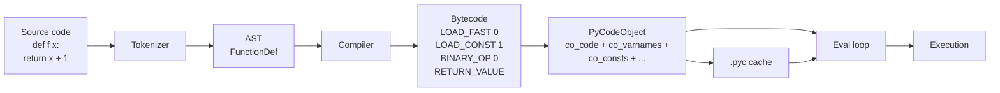

# 2. Bytecode and the dis Module

> [!note] Why this note exists
> Every Python function you write is compiled to **bytecode** — a sequence of one-byte opcodes plus arguments, executed by CPython's eval loop. The bytecode is the lowest human-readable layer above raw machine code: it's where the compiler's optimisations become visible, where the difference between `x = x + 1` and `x += 1` becomes concrete (or not), where the cost of attribute lookups and global accesses is exposed, and where the answer to "why is this Python code slow?" usually lives. The `dis` module is your window into this layer. This note covers how to read `dis` output, what the common opcodes mean (`LOAD_FAST`, `STORE_FAST`, `LOAD_GLOBAL`, `LOAD_ATTR`, `BINARY_OP`, `CALL`, `RETURN_VALUE`, etc.), how the `code` object holds bytecode plus metadata (`co_varnames`, `co_consts`, `co_names`, `co_freevars`), how to use `dis.Bytecode` programmatically, and how to **use bytecode analysis to inform optimisation** — local-variable hoisting, attribute caching, generator vs list trade-offs. Read alongside [[3. The Execution Model]] (which describes how the eval loop actually executes this bytecode) and [[5. Optimization Techniques]] (which describes what to do with what you find).

## Why It Matters

Bytecode literacy pays off in five concrete ways:

1. **Explaining performance mysteries.** Why is `sum(data)` 20× faster than a manual loop? Why is `x.append` faster inside a list comp than in a `for` loop? Why is `__slots__` faster than `__dict__`? The answers are all in the bytecode.
2. **Validating optimisations.** You think local-variable hoisting speeds up your hot loop. `dis.dis(fn)` confirms whether the compiler did what you think it did, or whether it already optimised things for you.
3. **Debugging decorators and metaprogramming.** When a decorated function behaves weirdly, `dis.dis(fn)` shows you what bytecode was actually generated. This is essential for [[1. Metaprogramming]].
4. **Understanding generator semantics.** A generator's bytecode contains `YIELD_VALUE` and `RESUME` opcodes; the eval loop suspends and resumes the frame around them. Once you see the bytecode, the magic stops being magic.
5. **Reading CPython source.** Half of `Python/ceval.c` is the giant `switch` statement that dispatches opcodes. To understand the eval loop, you need to know the opcodes.

If you've ever wondered "what does Python actually *do* when I run this line?", the answer is in `dis.dis(fn)`.

## Background

### What is bytecode?

Bytecode is a low-level instruction sequence for a virtual machine. CPython's VM is **stack-based**: most opcodes pop their arguments from a value stack and push a result. (Contrast with register-based VMs like LuaJIT.)

A simple function:

```python
def add(a, b):
    return a + b
```

Compiles to bytecode like:

```
  2           0 RESUME 0
  3           2 LOAD_FAST 0 (a)
              4 LOAD_FAST 1 (b)
              6 BINARY_OP 0 (+)
              8 RETURN_VALUE
```

Reading this:

- `RESUME 0` — a no-op for the interpreter; used by the JIT to identify entry points.
- `LOAD_FAST 0 (a)` — push the local variable at slot 0 (named `a`) onto the value stack.
- `LOAD_FAST 1 (b)` — push the local variable at slot 1 (named `b`).
- `BINARY_OP 0 (+)` — pop two values, add them, push the result. (`0` is the operator code for `+`.)
- `RETURN_VALUE` — pop the top of the stack and return it.

The stack after each instruction:

```
After RESUME:        []
After LOAD_FAST 0:   [a]
After LOAD_FAST 1:   [a, b]
After BINARY_OP:     [a+b]
After RETURN_VALUE:  (returned a+b)
```

### The `code` object

The bytecode is stored in a `PyCodeObject` (accessible as `fn.__code__`). It contains:

| Field | What it holds |
|---|---|
| `co_code` | The raw bytecode bytes |
| `co_varnames` | Local variable names (positional, in slot order) |
| `co_consts` | Constants used in the function (numbers, strings, tuples, `None`) |
| `co_names` | Global/attribute names looked up by `LOAD_GLOBAL`/`LOAD_ATTR` |
| `co_freevars` | Names captured from enclosing scope (closures) |
| `co_cellvars` | Names captured by inner functions |
| `co_argcount` | Number of positional arguments |
| `co_posonlyargcount` | Positional-only arguments |
| `co_kwonlyargcount` | Keyword-only arguments |
| `co_nlocals` | Total number of local variables |
| `co_stacksize` | Maximum stack depth needed |
| `co_filename` | Source filename |
| `co_name` | Function name |
| `co_firstlineno` | Line number of the `def` |
| `co_lnotab` / `co_linetable` | Line number table (maps bytecode offsets to source lines) |
| `co_exceptiontable` | Exception handler table (Python 3.11+) |

```python
def f(x, y=10, *args, **kwargs):
    z = x + y
    return z

c = f.__code__
print(c.co_varnames)        # ('x', 'y', 'args', 'kwargs', 'z')
print(c.co_consts)          # (None, 10)
print(c.co_names)           # ()
print(c.co_argcount)        # 2
print(c.co_kwonlyargcount)  # 0
print(c.co_nlocals)         # 5
print(c.co_stacksize)       # 2
```

### The `dis` module

`dis` is the stdlib module that disassembles bytecode into human-readable form.

```python
import dis

def add(a, b):
    return a + b

dis.dis(add)
```

Output:

```
  2           0 RESUME 0
  3           2 LOAD_FAST 0 (a)
              4 LOAD_FAST 1 (b)
              6 BINARY_OP 0 (+)
              8 RETURN_VALUE
```

The columns:

- **Line number** (e.g., `2`): the source line this instruction came from.
- **Offset** (e.g., `0`, `2`, `4`): the byte offset in `co_code`. Instructions are 2 bytes each (1 byte opcode + 1 byte arg) in modern CPython, sometimes extended with `EXTENDED_ARG` for larger args.
- **Opcode name** (e.g., `LOAD_FAST`).
- **Argument** (e.g., `0`): the raw argument.
- **Human-readable argument** (e.g., `(a)`): for `LOAD_FAST`, the variable name; for `LOAD_CONST`, the constant value; for `LOAD_GLOBAL`, the name.

### The `dis.Bytecode` class

For programmatic access:

```python
import dis

def add(a, b):
    return a + b

bytecode = dis.Bytecode(add)
for instr in bytecode:
    print(f"{instr.offset:4} {instr.opname:20} {instr.argrepr}")
# 0 RESUME
# 2 LOAD_FAST 'a'
# 4 LOAD_FAST 'b'
# 6 BINARY_OP '+'
# 8 RETURN_VALUE
```

Each `Instruction` has:

- `opcode`: the integer opcode.
- `opname`: the opcode name string.
- `arg`: the raw integer argument (or `None`).
- `argval`: the resolved argument (e.g., the variable name, the constant value).
- `argrepr`: a human-readable representation.
- `offset`: the byte offset.
- `starts_line`: the source line this instruction starts (or `None`).
- `is_jump_target`: whether another instruction jumps here.

`dis.Bytecode` is useful for static analysis — building control flow graphs, finding hot patterns, etc.

## Main content

### The common opcodes

CPython has ~200 opcodes. The most common:

#### Load and store

| Opcode | Action | Arg meaning |
|---|---|---|
| `LOAD_FAST` | Push local variable `n` | Index into `co_varnames` |
| `STORE_FAST` | Pop and store to local `n` | Index into `co_varnames` |
| `DELETE_FAST` | Delete local `n` | Index into `co_varnames` |
| `LOAD_CONST` | Push a constant | Index into `co_consts` |
| `LOAD_GLOBAL` | Push a global/builtin name | Index into `co_names` |
| `STORE_GLOBAL` | Store to a global | Index into `co_names` |
| `LOAD_NAME` | Push a name (slow path, used in `exec`/class bodies) | Index into `co_names` |
| `STORE_NAME` | Store to a name (class body, `exec`) | Index into `co_names` |
| `LOAD_DEREF` | Push a closure variable | Index into `co_freevars` |
| `STORE_DEREF` | Store to a closure variable | Index into `co_cellvars` |
| `LOAD_ATTR` | Push `obj.name` | Index into `co_names` |
| `STORE_ATTR` | Store to `obj.name` | Index into `co_names` |
| `LOAD_METHOD` | Push an unbound method (for `CALL_METHOD`) | Index into `co_names` |

**`LOAD_FAST` is the fastest load** — it's an array index into the frame's locals array, no dict lookup. **`LOAD_GLOBAL` is slower** — it does a dict lookup in `globals()` then `builtins()`. **`LOAD_ATTR` is slower still** — dict lookup on the type (via the descriptor protocol), with a possible instance dict lookup.

This is why local-variable hoisting works: replacing `LOAD_ATTR` with `LOAD_FAST` shaves nanoseconds per iteration.

#### Binary operations

In Python 3.11+, binary ops use a single `BINARY_OP` opcode with an arg identifying the operator:

| Arg | Operator |
|---|---|
| `0` | `+` (NB_ADD) |
| `1` | `&` (NB_AND) |
| `5` | `*` (NB_MULTIPLY) |
| `7` | `/` (NB_TRUE_DIVIDE) |
| `10` | `**` (NB_POWER) |
| `11` | `%` (NB_REMAINDER) |
| `13` | `<<` (NB_LSHIFT) |
| `23` | `\|` (NB_OR) |

In older Pythons (3.10 and earlier), each operator had its own opcode (`BINARY_ADD`, `BINARY_MULTIPLY`, etc.).

#### Comparison and boolean

| Opcode | Action |
|---|---|
| `COMPARE_OP` | Pop two values, push comparison result (`<`, `<=`, `==`, `!=`, `>`, `>=`, `in`, `not in`, `is`, `is not`) |
| `IS_OP` | `is` / `is not` |
| `CONTAINS_OP` | `in` / `not in` |
| `UNARY_NOT` | `not x` |
| `UNARY_NEGATIVE`, `UNARY_INVERT`, `UNARY_POSITIVE` | `-x`, `~x`, `+x` |

#### Jumps and control flow

| Opcode | Action |
|---|---|
| `POP_JUMP_IF_FALSE` | Pop, jump if falsey |
| `POP_JUMP_IF_TRUE` | Pop, jump if truthy |
| `JUMP_FORWARD` | Unconditional forward jump |
| `JUMP_BACKWARD` | Unconditional backward jump (for loops) |
| `JUMP_BACKWARD_NO_INTERRUPT` | Same, but doesn't check for signals |
| `FOR_ITER` | Iterate: push next or jump past loop |

#### Function calls

| Opcode | Action |
|---|---|
| `PUSH_NULL` | Push a NULL placeholder (for CALL in 3.11+) |
| `PRECALL` | (3.11 only, removed in 3.12) |
| `CALL` | Call a function with N args on the stack |
| `CALL_FUNCTION_EX` | Call with `*args, **kwargs` |
| `KW_NAMES` | Push keyword argument names (for CALL) |
| `MAKE_FUNCTION` | Create a function object from a code object on the stack |
| `RETURN_VALUE` | Pop and return |

In Python 3.11+, the calling convention changed: callable and args are pushed onto the stack, then `CALL` is invoked with the arg count. This is more efficient than the old `CALL_FUNCTION` because it allows the eval loop to specialise the call site (e.g., "this is always a Python function" vs "this is always a C function").

#### Container operations

| Opcode | Action |
|---|---|
| `BUILD_LIST` | Build a list from N stack items |
| `BUILD_TUPLE` | Build a tuple from N stack items |
| `BUILD_SET` | Build a set from N stack items |
| `BUILD_MAP` | Build a dict from N key-value pairs |
| `BUILD_CONST_KEY_MAP` | Build a dict with constant keys |
| `BUILD_SLICE` | Build a slice from 2 or 3 stack items |
| `BINARY_SUBSCR` | `obj[key]` |
| `STORE_SUBSCR` | `obj[key] = value` |
| `DELETE_SUBSCR` | `del obj[key]` |
| `LIST_APPEND` | Append to a list (used in list comps) |
| `SET_ADD` | Add to a set (used in set comps) |
| `MAP_ADD` | Add to a dict (used in dict comps) |
| `LIST_EXTEND` | Extend a list with an iterable |
| `DICT_UPDATE` | Update a dict |

#### Generators and coroutines

| Opcode | Action |
|---|---|
| `RESUME` | Resumes a generator/coroutine (3.11+) |
| `YIELD_VALUE` | Suspend and yield a value |
| `GET_YIELD_FROM_ITER` | Get the iterator for `yield from` |
| `GET_AWAITABLE` | Get an awaitable from a coroutine |
| `SEND` | `send()` into a generator |
| `ASYNC_GEN_WRAP` | Wrap an async generator |

#### Exception handling

| Opcode | Action |
|---|---|
| `CHECK_EXC_MATCH` | Check if exception matches a type |
| `CHECK_EG_MATCH` | Exception group matching (3.11+) |
| `PUSH_EXC_INFO` | Push current exception onto stack |
| `RAISE_VARARGS` | `raise` (0, 1, or 2 args) |
| `RERAISE` | Re-raise the current exception |
| `WITH_EXCEPT_START` | Call `__exit__` for `with` blocks |

In Python 3.11+, exception handling was overhauled (PEP 654) to use a "zero-cost" mechanism: try blocks have no setup overhead; the exception table (`co_exceptiontable`) maps instruction ranges to handlers.

#### Imports

| Opcode | Action |
|---|---|
| `IMPORT_NAME` | `import foo` |
| `IMPORT_FROM` | `from foo import bar` |
| `IMPORT_STAR` | `from foo import *` |

### Reading `dis` output: an example

```python
def f(items):
    total = 0
    for x in items:
        total += x
    return total

import dis
dis.dis(f)
```

```
  2           0 RESUME 0
  3           2 LOAD_CONST 1 (0)
              4 STORE_FAST 1 (total)

  4           6 LOAD_FAST 0 (items)
              8 GET_ITER
              10 FOR_ITER 13 (to 24)
              12 STORE_FAST 2 (x)

  5          14 LOAD_FAST 1 (total)
             16 LOAD_FAST 2 (x)
             18 BINARY_OP 13 (+=)
             20 STORE_FAST 1 (total)
             22 JUMP_BACKWARD 13 (to 10)

  6     >>   24 LOAD_FAST 1 (total)
             26 RETURN_VALUE
```

Reading:

1. Line 3: `LOAD_CONST 1 (0)` pushes the constant `0`. `STORE_FAST 1 (total)` stores it to `total`.
2. Line 4: `LOAD_FAST 0 (items)` pushes the `items` argument. `GET_ITER` calls `iter(items)` to get an iterator. `FOR_ITER 13` either pushes the next item or jumps to offset 24 (end of loop). `STORE_FAST 2 (x)` stores the item to `x`.
3. Line 5: `LOAD_FAST 1 (total)` and `LOAD_FAST 2 (x)` push the values. `BINARY_OP 13 (+=)` is the in-place add. `STORE_FAST 1 (total)` stores the result. `JUMP_BACKWARD 13` loops back to `FOR_ITER`.
4. Line 6: `LOAD_FAST 1 (total)` pushes the result. `RETURN_VALUE` returns it.

### Comparing `for` loop vs list comprehension

```python
def for_loop(n):
    result = []
    for i in range(n):
        result.append(i * i)
    return result

def list_comp(n):
    return [i * i for i in range(n)]

import dis
print("--- for loop ---")
dis.dis(for_loop)
print("--- list comp ---")
dis.dis(list_comp)
```

The list comp uses `LIST_APPEND` (a single opcode that appends to the list being built, without an attribute lookup). The for loop uses `LOAD_ATTR append` + `CALL` on every iteration. That's why the list comp is 20–40% faster.

### Local-variable hoisting

```python
import math

def with_global(n):
    s = 0.0
    for i in range(n):
        s += math.sqrt(i)
    return s

def with_local(n):
    sqrt = math.sqrt
    s = 0.0
    for i in range(n):
        s += sqrt(i)
    return s
```

Bytecode for the inner loop of `with_global`:

```
  4          14 LOAD_FAST 1 (s)
             16 LOAD_GLOBAL 1 (math)
             18 LOAD_ATTR 1 (sqrt)
             20 LOAD_FAST 2 (i)
             22 CALL 1
             24 BINARY_OP 13 (+=)
             26 STORE_FAST 1 (s)
```

`LOAD_GLOBAL math` + `LOAD_ATTR sqrt` happens **every iteration**. Two dict lookups per loop.

Bytecode for the inner loop of `with_local`:

```
  4          18 LOAD_FAST 1 (s)
             20 LOAD_FAST 3 (sqrt)
             22 LOAD_FAST 2 (i)
             24 CALL 1
             26 BINARY_OP 13 (+=)
             28 STORE_FAST 1 (s)
```

`LOAD_FAST sqrt` is a single array index, no dict lookup. That's the ~20% speedup.

### `BINARY_OP` vs in-place vs `STORE_FAST`

`x += 1` for an int compiles to:

```
LOAD_FAST x
LOAD_CONST 1
BINARY_OP 0 (+)
STORE_FAST x
```

Wait — `+=` is supposed to be in-place. Where's the in-place opcode? In modern Python, `BINARY_OP` checks if the type supports in-place (`__iadd__`); if so, it uses it; otherwise it falls back to `__add__`. For immutable types like `int`, `__iadd__` isn't defined, so `+=` is equivalent to `+` followed by rebinding.

For a mutable type like `list`:

```python
lst = [1, 2, 3]
lst += [4, 5]
```

This compiles similarly, but `BINARY_OP` calls `list.__iadd__`, which mutates the list in place (equivalent to `extend`). So `lst += [4, 5]` mutates, while `lst = lst + [4, 5]` creates a new list.

### Generator bytecode

```python
def gen(n):
    for i in range(n):
        yield i * i
```

```
  2           0 RESUME 0
  3           2 LOAD_FAST 0 (n)
              4 GET_ITER
              6 FOR_ITER 7 (to 16)
              8 STORE_FAST 1 (i)

  4          10 LOAD_FAST 1 (i)
             12 LOAD_FAST 1 (i)
             14 BINARY_OP 5 (*)
             16 YIELD_VALUE
             18 RESUME 3
             20 JUMP_BACKWARD 8 (to 6)
        >>   22 LOAD_CONST 0 (None)
             24 RETURN_VALUE
```

`YIELD_VALUE` suspends the generator, returning the top of the stack. `RESUME 3` is where execution resumes when `next()` is called again. The eval loop saves the frame (stack, locals, instruction pointer) between yields.

### Closure bytecode

```python
def make_adder(n):
    def adder(x):
        return x + n
    return adder
```

```
make_adder:
  2           0 RESUME 0
  3           2 LOAD_CONST 1 (<code adder>)
              4 MAKE_FUNCTION 8 (closure)
              6 STORE_FAST 1 (adder)
  4           8 LOAD_FAST 1 (adder)
             10 RETURN_VALUE

adder (with n in closure):
  3           0 RESUME 0
  4           2 LOAD_FAST 0 (x)
              4 LOAD_DEREF 0 (n)
              6 BINARY_OP 0 (+)
              8 RETURN_VALUE
```

`MAKE_FUNCTION 8` (the `8` flag means "has closure") creates a function object with `co_freevars = ('n',)`. Inside `adder`, `n` is accessed via `LOAD_DEREF 0` — a load from the closure cells, not from local or global scope.

### Python 3.11+ "zero-cost" exception handling

Before 3.11, `try` blocks had setup overhead (`SETUP_FINALLY`, `SETUP_WITH`). In 3.11+, this was eliminated: the bytecode for `try` is the same as the bytecode for the non-try version, and the exception table (`co_exceptiontable`) maps instruction ranges to handlers. If no exception is raised, there's zero overhead.

```python
def try_example(x):
    try:
        return 10 / x
    except ZeroDivisionError:
        return None
```

In 3.11+:

```
  3           0 RESUME 0
  4           2 LOAD_CONST 1 (10)
              4 LOAD_FAST 0 (x)
              6 BINARY_OP 17 (/)
              8 RETURN_VALUE

  5          10 PUSH_EXC_INFO
             12 LOAD_GLOBAL 1 (ZeroDivisionError)
             14 CHECK_EXC_MATCH
             16 POP_JUMP_IF_FALSE 22
             18 POP_TOP
             20 LOAD_CONST 2 (None)
             22 RETURN_VALUE
```

The "happy path" (no exception) is just `LOAD_CONST`, `LOAD_FAST`, `BINARY_OP`, `RETURN_VALUE` — identical to a version without `try`. The exception handler is reached only if an exception is raised, via the exception table.

### Specialised opcodes (adaptive interpreter, 3.11+)

Python 3.11 introduced **adaptive specialisation**: hot bytecode instructions get replaced with specialised versions at runtime. For example, `LOAD_GLOBAL` might become `LOAD_GLOBAL_MODULE` (if the name is always in `globals`) or `LOAD_GLOBAL_BUILTIN` (if it's always in `builtins`).

This is invisible at the bytecode level — `dis.dis` shows the unspecialised opcode — but you can see it with `dis.dis` and special flags, or with `python -X specialize` to enable instrumentation.

This is the foundation of Python 3.13's experimental JIT (PEP 744): specialised opcodes are compiled to machine code for further speedup.

### How to use `dis` for debugging

```python
import dis

# What bytecode did this decorator actually generate?
@some_decorator
def my_function(x):
    return x * 2

dis.dis(my_function)
# If the decorator wrapped with a closure, you'll see the wrapper's bytecode,
# not the original. Use my_function.__wrapped__ to see the original.
```

### Comparing two implementations

```python
import dis

def f_for(n):
    result = []
    for i in range(n):
        result.append(i)
    return result

def f_comp(n):
    return [i for i in range(n)]

print("=== for loop ===")
dis.dis(f_for)
print("=== list comp ===")
dis.dis(f_comp)
```

The list comp is shorter (no `LOAD_ATTR append`, no `CALL`), which is why it's faster.

## Mermaid: source → bytecode → execution



## Mermaid: stack-based execution

```mermaid
sequenceDiagram
    participant Code as Bytecode
    participant Loop as Eval loop
    participant Stack as Value stack
    participant Locals as Locals array

    Code->>Loop: LOAD_FAST 0 (a)
    Loop->>Locals: read slot 0
    Locals-->>Loop: value of a
    Loop->>Stack: push a
    Code->>Loop: LOAD_FAST 1 (b)
    Loop->>Locals: read slot 1
    Locals-->>Loop: value of b
    Loop->>Stack: push b
    Code->>Loop: BINARY_OP 0 (+)
    Loop->>Stack: pop b, pop a
    Loop->>Loop: PyNumber_Add(a, b)
    Loop->>Stack: push a+b
    Code->>Loop: RETURN_VALUE
    Loop->>Stack: pop result
    Loop-->>Code: return result
```

## Code examples

### Basic disassembly

```python
import dis

def greet(name):
    return f"Hello, {name}!"

dis.dis(greet)
```

### Comparing attribute access patterns

```python
import dis

class Counter:
    def __init__(self):
        self.count = 0

    def increment_slow(self):
        self.count += 1

    def increment_fast(self):
        count = self.count   # local binding
        count += 1
        self.count = count

print("=== slow ===")
dis.dis(Counter.increment_slow)
print("=== fast ===")
dis.dis(Counter.increment_fast)
```

### Inspecting a code object

```python
def f(a, b, c=10, *args, **kwargs):
    x = a + b
    y = x * c
    return y, args, kwargs

c = f.__code__
print("varnames:", c.co_varnames)        # ('a', 'b', 'c', 'args', 'kwargs', 'x', 'y')
print("consts:  ", c.co_consts)          # (None, 10)
print("names:   ", c.co_names)           # ()
print("freevars:", c.co_freevars)        # ()
print("argcount:", c.co_argcount)        # 3
print("nlocals: ", c.co_nlocals)         # 7
print("stacksize:", c.co_stacksize)      # depends on bytecode
```

### Programmatic bytecode analysis

```python
import dis

def count_opcodes(fn):
    counts = {}
    for instr in dis.Bytecode(fn):
        counts[instr.opname] = counts.get(instr.opname, 0) + 1
    return counts

def f(n):
    total = 0
    for i in range(n):
        if i % 2 == 0:
            total += i
        else:
            total -= i
    return total

for op, count in sorted(count_opcodes(f).items(), key=lambda x: -x[1]):
    print(f"{op:25} {count}")
```

### Finding jump targets

```python
import dis

def f(x):
    if x > 0:
        return x
    else:
        return -x

for instr in dis.Bytecode(f):
    if instr.is_jump_target:
        print(f">> offset {instr.offset}: {instr.opname}")
```

### Disassembling a generator

```python
import dis

def counter(start):
    n = start
    while True:
        yield n
        n += 1

dis.dis(counter)
# Note the YIELD_VALUE and RESUME opcodes that suspend/resume the frame.
```

### Looking at exception table (3.11+)

```python
def f():
    try:
        risky()
    except ValueError:
        handle()

c = f.__code__
print(c.co_exceptiontable)   # bytes encoding the exception handler table
# Use dis.parse_exception_table() in 3.12+ to decode it
```

### Examining constant folding

```python
import dis

def f():
    x = 2 * 3 + 4 * 5
    return x

dis.dis(f)
# 2           0 RESUME 0
# 3           2 LOAD_CONST 1 (26)   <- folded at compile time!
#             4 STORE_FAST 0 (x)
# 4           6 LOAD_FAST 0 (x)
#             8 RETURN_VALUE
```

The compiler computed `2 * 3 + 4 * 5 = 26` at compile time, so the runtime just loads the constant.

## Common Pitfalls

1. **Treating bytecode as stable.** Opcodes change between Python versions. `BINARY_ADD` was renamed to `BINARY_OP` in 3.11. `CALL_FUNCTION` was replaced by `CALL` in 3.11. Don't write code that depends on specific opcodes.

2. **Confusing bytecode with machine code.** Bytecode is interpreted by CPython's eval loop; it's not native machine code. (Python 3.13's experimental JIT compiles specialised bytecode to machine code, but that's a different layer.)

3. **Assuming shorter bytecode is always faster.** Most of the time yes, but a single `CALL` may be slower than several `LOAD_FAST`s if the call dispatches to a C function with high overhead.

4. **Ignoring `EXTENDED_ARG`.** Some opcodes need arguments > 255, which requires an `EXTENDED_ARG` prefix opcode. `dis` handles this transparently, but if you read `co_code` directly, you'll see it.

5. **Forgetting that `dis.dis(module)` shows module-level bytecode too.** Imports, class definitions, and assignments at module level are all bytecode.

6. **Trying to hand-write bytecode.** It's possible with the `bytecode` library, but the result is fragile and version-specific. Use the `ast` module to transform source instead.

7. **Believing `dis.Bytecode.code()` returns the original code object.** It returns a code object that may have been transformed; use `fn.__code__` for the actual code.

8. **Confusing `LOAD_NAME` and `LOAD_GLOBAL`.** `LOAD_NAME` does a full namespace walk (locals → globals → builtins) and is used in `exec` and class bodies. `LOAD_GLOBAL` is the fast path used in functions, skipping the locals check (because the compiler knows locals are in `co_varnames`).

9. **Forgetting that lambdas and comprehensions create new code objects.** Each `lambda` in a loop creates a separate code object; each comprehension creates one too. Don't be surprised by extra entries in `gc.get_objects()`.

10. **Assuming `LOAD_FAST` is always faster than `LOAD_CONST`.** They're both fast, but `LOAD_CONST` is slightly faster because constants are interned and the load is just a pointer copy.

11. **Confusing `co_varnames` with `co_names`.** `co_varnames` is local variables (slot-indexed); `co_names` is global/attribute names (dict-keyed). Different lookup mechanisms, different costs.

12. **Trying to optimise bytecode by hand.** The compiler does peephole optimisations; you can't beat it by tweaking source. Optimise the algorithm instead.

## Tips and Tricks

- **`dis.dis(fn)` is your first stop** for "why is this slow?" or "what did the decorator do?".
- **`dis.Bytecode(fn)` for programmatic analysis** — counting opcodes, finding jump targets, building CFGs.
- **Compare bytecodes side by side** when evaluating optimisations: `dis.dis(slow); dis.dis(fast)`.
- **`python -m dis mymodule.py`** disassembles a whole module from the CLI.
- **`dis.dis(fn, depth=N)`** disassembles nested code objects up to depth N.
- **`dis.code_info(fn)`** prints a summary of the code object's metadata.
- **`dis.show_code(fn)`** is an alias for `dis.code_info`.
- **Look at `co_consts` to see constant folding.** A line like `x = 2 + 3` should have `5` in `co_consts`, not `2` and `3`.
- **Look at `co_varnames` to see local variable layout.** This is what `LOAD_FAST n` indexes into.
- **For decorators that wrap with closures, `dis.dis(fn.__wrapped__)` shows the original function.**
- **`python -X importtime`** to find slow imports — a proxy for bytecode bloat.
- **`python -X dev`** enables development mode with extra checks.
- **Use the `bytecode` library (PyPI)** for programmatic bytecode manipulation — useful for writing debuggers and profilers.
- **`sys.settrace(fn)`** lets you trace bytecode execution per-line — invaluable for debuggers and coverage tools.
- **`sys.setprofile(fn)`** traces function calls — used by `cProfile`.
- **Compare `LOAD_ATTR` count in slow vs fast versions** to confirm local-variable hoisting worked.
- **For generator semantics, look for `YIELD_VALUE` and `RESUME`.** They're the suspend/resume points.
- **For closure semantics, look for `LOAD_DEREF` and `MAKE_FUNCTION` with the closure flag.**
- **For async, look for `GET_AWAITABLE` and `SEND`.**

## Active Recall

1. What does the `dis` module do? Write a one-line snippet to disassemble a function.
2. What's the difference between `LOAD_FAST`, `LOAD_GLOBAL`, `LOAD_CONST`, `LOAD_ATTR`, and `LOAD_DEREF`?
3. Why is `LOAD_FAST` faster than `LOAD_GLOBAL`?
4. What is the value stack? Describe its state after `LOAD_FAST 0; LOAD_FAST 1; BINARY_OP 0 (+)`.
5. What does `co_varnames` contain? What does `co_consts` contain? `co_names`?
6. Write a function and use `dis.Bytecode` to count how many of each opcode it has.
7. What opcode does a list comprehension use to append to the list? Why is it faster than `result.append(x)` in a for loop?
8. Show, with `dis`, that local-variable hoisting actually changes the bytecode.
9. What does `MAKE_FUNCTION` do? What does its argument mean?
10. What opcodes are involved in generator suspension and resumption?
11. What's the difference between `BINARY_ADD` (Python 3.10) and `BINARY_OP 0` (Python 3.11+)?
12. How does Python 3.11's "zero-cost" exception handling work? What's the `co_exceptiontable`?
13. What is `EXTENDED_ARG` for? When does it appear?
14. How would you find all jump targets in a function's bytecode?
15. What does `is_jump_target` mean on a `dis.Instruction`?
16. Compare the bytecode of a `for` loop and a list comprehension producing the same result.
17. What does `RESUME` do? When does it appear?
18. How does the bytecode of a closure differ from a non-closure?
19. Write a snippet that demonstrates constant folding (and confirm via `dis`).
20. Why shouldn't you hand-write bytecode?

## Next Steps

- [[3. The Execution Model]] — how the eval loop actually executes the bytecode you see with `dis`.
- [[1. CPython Architecture]] — the compile pipeline that produces bytecode from source.
- [[4. The Object Model]] — `PyTypeObject` and the slot mechanism that opcodes like `BINARY_OP` invoke.
- [[5. Optimization Techniques]] — using bytecode to validate optimisations.
- [[4. cProfile and timeit]] — profiling to find which bytecode to inspect.
- [[1. Metaprogramming]] — using the `ast` module to transform source before it's compiled.
