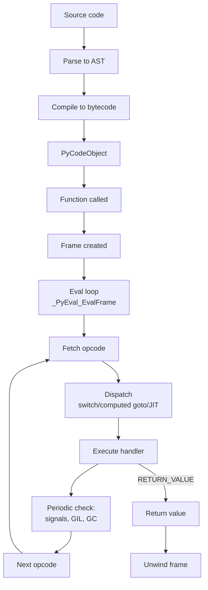

# 3. The Execution Model

> [!note] Why this note exists
> The **execution model** is how CPython actually runs your bytecode: the eval loop (`Python/ceval.c`), frame objects (one per function call), the per-frame value stack, the dispatch mechanism (`switch` vs computed goto vs JIT), and the bookkeeping that ties it all together (the GIL, signal checking, periodic GC). Understanding the execution model answers the deepest "why" questions about Python performance: why is a Python loop ~50× slower than a C loop? Why does function call overhead matter? Why are local variables faster than globals? Why does removing the GIL require rewriting `Py_INCREF`? Why does Python 3.13's experimental JIT exist, and what does it actually JIT? This note covers all of that, plus the historical arc from the original 1990s interpreter to the adaptive interpreter (3.11) to the JIT (3.13+). Read after [[1. CPython Architecture]] and [[2. Bytecode and the dis Module]] — the execution model is the engine that consumes the bytecode those notes describe.

## Why It Matters

CPython's execution model is the answer to "why is Python slow?" More usefully, it tells you **where** Python is slow, so you can decide whether to:

- Optimise the algorithm (always the right first step).
- Use a built-in (pushes the loop into C).
- Move hot code to NumPy/Cython/Numba (pushes the loop into compiled code).
- Use PyPy (a different execution model with a JIT).
- Wait for Python 3.14+ free-threading and the experimental JIT to mature.

Without understanding the execution model, these decisions are guesswork. With it, they're engineering.

The execution model also explains the **semantics** of Python that you use every day:

- **Why generators can pause.** Each generator has its own frame; `yield` saves the frame's state.
- **Why `try` blocks have (almost) no overhead in 3.11+.** Exception handling is now "zero-cost" via the exception table.
- **Why `sys.setrecursionlimit(10000)` may still crash with a C-level stack overflow.** CPython recurses in C, and the C stack is fixed.
- **Why `sys.settrace` and `sys.setprofile` work.** The eval loop calls the trace function on every line / call boundary.
- **Why context switches between threads happen between bytecodes.** The eval loop checks for pending signals and thread switches every N bytecodes.

## Background

### The eval loop

At the heart of CPython is `_PyEval_EvalFrameDefault` in `Python/ceval.c`. It's the function that takes a frame object and runs its bytecode. Simplified pseudocode:

```c
PyObject* _PyEval_EvalFrame(PyThreadState *tstate, PyFrameObject *frame) {
    PyObject **stack_pointer = frame->f_valuestack + frame->f_stackdepth;
    _Py_CODEUNIT *next_instr = frame->f_code->co_code + frame->f_lasti + 1;

    while (1) {
        _Py_CODEUNIT opcode = _Py_OPCODE(*next_instr);
        _Py_CODEUNIT oparg = _Py_OPARG(*next_instr);
        next_instr++;

        switch (opcode) {
            case LOAD_FAST: {
                PyObject *value = frame->f_localsplus[oparg];
                PUSH(value);
                break;
            }
            case STORE_FAST: {
                PyObject *value = POP();
                frame->f_localsplus[oparg] = value;
                break;
            }
            case BINARY_OP: {
                PyObject *rhs = POP();
                PyObject *lhs = POP();
                PyObject *res = PyNumber_Add(lhs, rhs);   // (simplified)
                PUSH(res);
                break;
            }
            case RETURN_VALUE: {
                return POP();
            }
            // ... hundreds more ...
        }

        // Periodically check for signals, thread switches, GC
        if (--tstate->c_recursion_remaining <= 0) {
            _Py_HandlePending(tstate);
        }
    }
}
```

The actual code is far more complex (the dispatch uses **computed goto** for ~15% speedup; there are 200+ opcodes; there are inline caches for specialisation; there's the GIL acquisition dance), but the structure is this loop.

### Stack-based VM

CPython's VM is **stack-based**: most opcodes pop their operands from a value stack and push a result. (Contrast with register-based VMs like LuaJIT or the Dalvik VM, which use named registers.)

For `a + b`:

1. `LOAD_FAST a` — push `a`.
2. `LOAD_FAST b` — push `b`.
3. `BINARY_OP +` — pop `b`, pop `a`, push `a + b`.
4. `STORE_FAST result` — pop and store to `result`.

The stack lives in the **frame object** (`PyFrameObject.f_valuestack`), and the current top is tracked by `f_stacktop`. Each function call creates a new frame with its own stack.

Why stack-based? It's simpler to compile for (no register allocation algorithm needed) and the bytecode is compact (operands are implicit). The downside is more instructions per operation than a register-based VM.

### Frame objects

A **frame** represents one invocation of a function (or module-level code, or generator). It contains:

| Field | What it holds |
|---|---|
| `f_code` | The `PyCodeObject` being executed |
| `f_builtins` | The builtins dict (cached for fast lookup) |
| `f_globals` | The module's globals dict |
| `f_locals` | The locals dict (or NULL, in which case locals are in `f_localsplus`) |
| `f_localsplus` | Array of locals, cells, and free variables (slot-indexed) |
| `f_valuestack` | The value stack for this frame |
| `f_stacktop` | Current stack pointer |
| `f_lasti` | Last instruction offset (instruction pointer) |
| `f_lineno` | Current source line (for tracebacks) |
| `f_back` | The caller's frame |
| `f_trace` | Trace function (set by `sys.settrace`) |
| `f_trace_lines` | Whether to trace per-line |
| `f_trace_opcodes` | Whether to trace per-opcode |

In Python 3.11, the frame representation was overhauled (PEP 657, PEP 654). Frames can now live on the C stack (instead of always being heap-allocated), making function calls faster. Generators and async generators still heap-allocate their frames (because they need to persist across suspensions).

You can access frames via `sys._getframe()`:

```python
import sys

def f():
    g()

def g():
    frame = sys._getframe()
    print(frame.f_code.co_name)        # 'g'
    print(frame.f_back.f_code.co_name) # 'f'
    print(frame.f_locals)              # {}
    print(frame.f_globals.keys())      # module globals

f()
```

### The call stack

When function A calls function B which calls function C, the frames form a linked list:

```
C's frame  --f_back-->  B's frame  --f_back-->  A's frame  --f_back-->  None
```

The traceback you see when an exception is raised walks this linked list (`tb_frame`, `tb_next`).

### Frame allocation: heap vs C stack

Before 3.11: every function call heap-allocated a `PyFrameObject`. Slow.

In 3.11+: frames can be allocated on the C stack for non-generator calls. The `PyFrameObject` is created lazily only if needed (e.g., for `sys._getframe()` or a traceback). This is a significant speedup for call-heavy code.

### Why Python is slow

A typical Python operation involves, per bytecode:

1. **Fetch** the opcode from `co_code` (~1 ns).
2. **Dispatch** via `switch` or computed goto (~1–3 ns).
3. **Execute** the opcode handler (~10–100 ns for typical ops).
4. **Periodic checks**: signals, thread switches, GC (~1 ns amortised).

So ~20 ns per bytecode is a rough floor. A simple loop like `for i in range(n): total += i` is ~5 bytecodes per iteration, so ~100 ns per iteration, or ~10 million iterations per second. C does the same in ~1 billion iterations per second — a 100× gap.

Where does the gap come from?

- **Dynamic dispatch.** `a + b` requires looking up `a`'s type, finding its `__add__` slot, calling it, possibly falling back to `b`'s `__radd__`. In C, `+` is one instruction.
- **Boxed objects.** `a` and `b` are heap-allocated `PyLongObject`s. The `+` allocates a new `PyLongObject` for the result. In C, `+` operates on registers.
- **Reference counting.** Every assignment, return, and container operation updates `ob_refcnt`. CPython uses biased reference counting in some configurations (PEP 683 immortal objects) but the basics are still there.
- **Interpreter overhead.** The fetch-decode-execute loop itself costs cycles. JIT compilers (PyPy, Numba, the experimental 3.13 JIT) eliminate this by compiling hot paths to native code.

### Dispatch mechanisms

CPython has used three dispatch mechanisms over the years:

1. **`switch` statement** (the classic, original implementation). The compiler generates a giant `switch (opcode) { case ...: }`. The C compiler typically translates this to a series of comparisons and jumps. Slow because of branch prediction misses on the comparisons.

2. **Computed goto** (GCC/Clang extension, used since 3.2). The opcodes are encoded as the labels of a label table: `static void *labels[] = { &&LOAD_FAST, &&STORE_FAST, ... }`. Dispatch is `goto *labels[opcode]`. Faster because the CPU's branch predictor learns the pattern per call site.

3. **JIT compilation** (Python 3.13+, experimental). Hot bytecode traces are compiled to machine code. Still uses computed goto for cold code. PEP 744.

Most modern CPython builds use computed goto. The `--enable-optimizations` configure flag and PGO (profile-guided optimisation) further tune the layout.

### Adaptive interpreter (Python 3.11+)

Python 3.11 introduced the **adaptive interpreter** (PEP 659). Hot bytecode instructions get specialised at runtime based on observed types:

- `LOAD_GLOBAL` may become `LOAD_GLOBAL_MODULE` (if the name is always in the module's globals) or `LOAD_GLOBAL_BUILTIN` (if it's always in builtins).
- `BINARY_OP` may become `BINARY_OP_ADD_INT` (if both operands are always ints) or `BINARY_OP_ADD_FLOAT`.
- `LOAD_ATTR` may become `LOAD_ATTR_INSTANCE_VALUE` (if it's always an instance attribute) or `LOAD_ATTR_MODULE`.

Specialisation happens after a few thousand executions of a generic opcode. If the assumption breaks (different type appears), the opcode "deoptimises" back to the generic version.

This is the foundation of Python 3.13's JIT: specialised opcodes are easier to compile to machine code because they're already type-specialised.

### The GIL and the eval loop

The GIL is a single mutex per interpreter (in 3.12+, per-interpreter; before that, per-process). Only one OS thread can hold it at a time, and only the GIL-holding thread can execute Python bytecode.

The eval loop:

1. **Acquires the GIL** at function entry (or via `PyEval_SaveThread`/`PyEval_RestoreThread` for C extensions that release it).
2. **Executes bytecodes** for ~100 bytecodes (configurable via `sys.setswitchinterval`).
3. **Periodically checks** whether another thread wants the GIL. If so, signals it and waits.
4. **Periodically checks** for pending signals (Ctrl-C, etc.).
5. **Periodically runs** the cyclic GC.

The check happens every N bytecodes (configurable; default `sys.getswitchinterval()` returns 0.005 seconds). This is why CPU-bound Python threads can't truly parallelise — they're serialised by the GIL.

C extensions can release the GIL with `Py_BEGIN_ALLOW_THREADS`/`Py_END_ALLOW_THREADS`:

```c
PyObject* slow_c_function(PyObject *self, PyObject *args) {
    Py_BEGIN_ALLOW_THREADS
    // Do CPU-intensive work without holding the GIL.
    // Other Python threads can run during this time.
    result = do_heavy_computation();
    Py_END_ALLOW_THREADS
    return PyLong_FromLong(result);
}
```

NumPy, Pandas, and many ML libraries do this for their heavy numerical kernels. See [[5. The C API]].

### Periodic checks

Every N bytecodes (default: ~100), the eval loop calls `_Py_HandlePending`:

1. **Signal handling**: if SIGINT was received (Ctrl-C), raise `KeyboardInterrupt`.
2. **Thread switch**: if another thread is waiting for the GIL and the switch interval has elapsed, drop the GIL and let it run.
3. **GC**: if the cyclic GC threshold has been reached, run a collection.
4. **Async exceptions**: if `Py_AddPendingCall` was used, execute the pending call.

This is why Python is "soft real-time": signal handlers don't run mid-bytecode, but they run within ~100 bytecodes of being raised. It's also why very long C extensions (which don't return to the eval loop) make Python appear unresponsive to Ctrl-C.

### Function call mechanics

A Python function call involves:

1. **Look up the callable**: `LOAD_GLOBAL`, `LOAD_ATTR`, etc.
2. **Push the callable and args** onto the value stack (3.11+ calling convention).
3. **`CALL` opcode**: 
   - For Python functions, create a new frame, set up locals from args, recursively call `_PyEval_EvalFrame`.
   - For C functions (built-ins, extensions), call the C function pointer directly with `PyObject*` args.
4. **Push the return value** onto the caller's stack.

Python function calls have non-trivial overhead (~100 ns in modern CPython, down from ~300 ns in 3.10). C function calls are faster (~50 ns). This is why tight inner loops with many small calls are slow — the call overhead dominates.

### Method calls and `LOAD_METHOD`/`CALL_METHOD`

In Python 3.7+, method calls like `obj.method(x)` use a special fast path:

- `LOAD_METHOD` — looks up the method; if it's a bound method, pushes the unbound function and `self` separately (avoiding the creation of a bound method object).
- `CALL_METHOD` — calls the function with `self` and the other args.

This avoids allocating a `bound method` object per call, which was a significant overhead in 3.6 and earlier.

### Recursion and the C stack

Each Python function call recursively calls `_PyEval_EvalFrame`, which uses C stack space. Python's recursion limit (`sys.getrecursionlimit()`, default 1000) prevents the C stack from overflowing.

```python
def f(): f()
f()
# RecursionError: maximum recursion depth exceeded
```

But the recursion limit is just a counter; it doesn't actually measure C stack usage. A C extension that recurses deeply without checking can still overflow the C stack and crash the interpreter.

In Python 3.12+, the recursion check uses an actual C stack probe, making it more reliable.

### Generators: frames that persist

A generator function compiles to a code object with the `CO_GENERATOR` flag. When called, instead of running to completion, the call:

1. Creates a new frame.
2. Creates a generator object that holds the frame.
3. Returns the generator without executing any bytecode.

When `next()` is called on the generator:

1. The eval loop is invoked with the generator's frame.
2. Execution runs until `YIELD_VALUE`.
3. `YIELD_VALUE` pops the value and returns it from `_PyEval_EvalFrame`, but the frame is preserved (in the generator object).
4. The next `next()` call resumes execution at the instruction after `YIELD_VALUE`.

This is why generators are memory-efficient: only one frame's worth of state is held, regardless of how many items the generator produces.

### Coroutines and async

Coroutines (`async def`) work like generators but with `GET_AWAITABLE`, `SEND`, and `YIELD_VALUE` opcodes. The `await` expression suspends the coroutine, returning control to the event loop, which can run other coroutines.

The event loop (`asyncio`) is just a scheduler that calls `send()` on the appropriate coroutine when its I/O is ready.

### Tracebacks and `sys.settrace`

When an exception is raised, the eval loop walks the frame stack and builds a traceback object (`PyTracebackObject`). Each traceback has:

- `tb_frame` — the frame where the exception was raised.
- `tb_lineno` — the source line.
- `tb_next` — the next traceback in the chain (the caller's).

`sys.settrace(fn)` sets a function that's called on every line boundary (and on call/return). The eval loop checks `frame.f_trace` after each line; if set, it calls the trace function with `(frame, event, arg)`. This is how debuggers, coverage tools, and `pdb` work.

`sys.setprofile(fn)` is similar but only called on call/return boundaries (lower overhead). `cProfile` uses this.

### Why `try` is free in 3.11+

Before 3.11, `try` blocks had setup overhead: a `SETUP_FINALLY` opcode pushed a handler onto a stack at the start of every `try`. Even if no exception was raised, this cost cycles.

In 3.11+, PEP 654 introduced "zero-cost" exception handling: the bytecode for `try` is identical to the non-try version. Instead, the code object has an **exception table** (`co_exceptiontable`) that maps instruction offsets to handler offsets. When an exception is raised, the eval loop walks the exception table to find the right handler.

If no exception is raised, there's literally no overhead. The "happy path" is identical to code without `try`.

### Python 3.13's experimental JIT

Python 3.13 introduced an experimental JIT (PEP 744). It works differently from PyPy's tracing JIT:

- **PyPy**: traces hot loops at runtime, compiles them to machine code.
- **CPython 3.13 JIT**: copies of specialised bytecode are translated to machine code at runtime via a template-based JIT.

The CPython JIT is currently opt-in (`--enable-experimental-jit` at build time) and gives modest speedups (5–15% on some benchmarks). It's expected to mature in 3.14 and 3.15.

## Main content

### Why Python is slow: a complete accounting

A simple `total = sum(x * x for x in range(n))`:

1. **`range(n)`**: creates a `range` object (cheap).
2. **`for x in range(n)`**: calls `iter(range(n))`, then `__next__` on each iteration. Each `__next__` is a C call returning a new `PyLongObject` (allocates).
3. **`x * x`**: looks up `int.__mul__` (slot dispatch), allocates a new `PyLongObject` for the product.
4. **Generator yield**: `yield x * x` suspends the generator frame, returns the value.
5. **`sum(...)` consumes**: receives the value via `send`, adds it to the running total (allocates a new `PyLongObject`), loops.

Per iteration: ~5 object allocations, ~3 type dispatches, ~1 generator resume. At ~50 ns per allocation and ~10 ns per dispatch, that's ~300 ns per iteration, or ~3 million iterations per second. C with native ints: ~1 billion iterations per second.

The gap is structural: dynamic typing, heap-allocated objects, interpreter dispatch. Closing it requires:

- Removing dynamic dispatch (specialise by type — what adaptive interpreter does).
- Removing object allocation (use unboxed values — what NumPy does).
- Removing the interpreter (compile to machine code — what PyPy/JIT do).

### Why local variables are faster

Inside a function, local variables are stored in `frame.f_localsplus` — a C array. `LOAD_FAST n` is:

```c
case LOAD_FAST: {
    PyObject *value = frame->f_localsplus[oparg];
    Py_INCREF(value);
    PUSH(value);
    break;
}
```

Three C operations: array index, refcount increment, stack push. ~5 ns.

Global lookup (`LOAD_GLOBAL n`) is:

```c
case LOAD_GLOBAL: {
    PyObject *name = GETITEM(names, oparg);
    PyObject *value = PyDict_GetItemWithError(frame->f_globals, name);
    if (value == NULL) {
        value = PyDict_GetItemWithError(frame->f_builtins, name);
        // ... error handling ...
    }
    Py_INCREF(value);
    PUSH(value);
    break;
}
```

Two dict lookups (each ~30 ns), plus the array lookup, plus the refcount. ~70 ns.

This 14× difference is why local-variable hoisting works.

### Why attribute access is slow

`obj.method` involves:

1. `LOAD_FAST obj` (cheap).
2. `LOAD_ATTR method`:
   - Look up `method` on `type(obj)` (dict lookup, ~30 ns).
   - If it's a descriptor (e.g., a function), call `__get__` to bind it (~50 ns).
   - Push the result (a bound method object — heap-allocated!).

Each `obj.method(x)` call creates a new `bound method` object. The `LOAD_METHOD`/`CALL_METHOD` fast path (3.7+) avoids this for the common case.

### Function call overhead

A Python function call:

1. Look up the callable (variable).
2. Push the callable and args onto the stack.
3. `CALL` opcode:
   - Create a new frame.
   - Bind args to parameter slots.
   - Recursively call `_PyEval_EvalFrame` on the new frame.
4. The new frame's eval loop runs the function's bytecode.
5. `RETURN_VALUE` pops the return value and unwinds.

This is ~100 ns in 3.11+, down from ~300 ns in 3.10. Still, a function call per iteration of a tight loop is measurable. Inlining via a generator expression or list comprehension is faster because the loop body is in the same frame.

### Generator resume overhead

Each `next()` on a generator:

1. Restores the generator's frame.
2. Sets up the eval loop with that frame.
3. Runs until the next `YIELD_VALUE`.
4. Returns the yielded value.

The resume cost is ~150 ns, comparable to a function call. For tight loops, generator expressions are slower than list comprehensions because of this overhead — but they save memory.

### Why `cProfile` adds 50%+ overhead

`cProfile` uses `sys.setprofile`, which adds a call to a profile function at every call/return boundary. The profile function records timestamps. This adds ~50 ns per call, which can double the runtime of call-heavy code.

### How the eval loop checks for signals

Every ~100 bytecodes (the exact number depends on the platform), the eval loop:

1. Decrements `tstate->c_recursion_remaining` (the recursion limit counter).
2. If it hits zero, calls `_Py_HandlePending`, which:
   - Checks for pending signals (raises `KeyboardInterrupt` if SIGINT is queued).
   - Checks for pending calls (`Py_AddPendingCall`).
   - Releases the GIL if another thread is waiting (and reacquires after).
   - Runs the cyclic GC if thresholds are met.

This is why Python feels responsive to Ctrl-C even in tight loops — the check happens every ~100 bytecodes.

But C extensions that don't return to the eval loop (e.g., a long-running numerical kernel) won't see the signal until they return. NumPy's tight loops periodically check for signals to mitigate this.

### Frame introspection

```python
import sys

def outer():
    middle()

def middle():
    inner()

def inner():
    frame = sys._getframe()
    while frame is not None:
        print(f"  {frame.f_code.co_name} at line {frame.f_lineno}")
        frame = frame.f_back

outer()
# inner at line ...
# middle at line ...
# outer at line ...
# <module> at line ...
```

`sys._getframe(0)` is the current frame; `sys._getframe(1)` is the caller's; etc.

`frame.f_locals` gives the locals as a dict (for non-fast-scope functions). `frame.f_lineno` is the current source line. `frame.f_code` is the code object.

### Tracing with `sys.settrace`

```python
import sys

def tracer(frame, event, arg):
    if event == 'call':
        print(f"call {frame.f_code.co_name}")
    elif event == 'line':
        print(f"  line {frame.f_lineno} in {frame.f_code.co_name}")
    elif event == 'return':
        print(f"return {arg} from {frame.f_code.co_name}")
    return tracer

def f():
    x = 1
    y = 2
    return x + y

sys.settrace(tracer)
f()
sys.settrace(None)
```

This is the mechanism debuggers use to single-step. The overhead is huge — don't enable tracing in production.

### `sys.setprofile` for call/return only

`sys.setprofile` is like `settrace` but only fires on call/return (not per-line). Much lower overhead. `cProfile` uses this.

## Mermaid: Python execution pipeline



## Mermaid: stack-based execution

```mermaid
sequenceDiagram
    participant Caller
    participant Loop as Eval loop
    participant Stack as Value stack
    participant Locals as Locals array

    Note over Caller,Stack: Compute a + b
    Caller->>Loop: LOAD_FAST 0 (a)
    Loop->>Locals: read slot 0
    Locals-->>Loop: value of a
    Loop->>Stack: push a (stack: [a])
    Caller->>Loop: LOAD_FAST 1 (b)
    Loop->>Locals: read slot 1
    Locals-->>Loop: value of b
    Loop->>Stack: push b (stack: [a, b])
    Caller->>Loop: BINARY_OP 0 (+)
    Loop->>Stack: pop b, pop a (stack: [])
    Loop->>Loop: PyNumber_Add(a, b)
    Loop->>Stack: push a+b (stack: [a+b])
    Caller->>Loop: STORE_FAST 2 (result)
    Loop->>Stack: pop a+b (stack: [])
    Loop->>Locals: write slot 2
```

## Mermaid: GIL and thread scheduling

```mermaid
sequenceDiagram
    participant T1 as Thread 1 (GIL holder)
    participant T2 as Thread 2 (waiting)
    participant Loop as Eval loop
    participant OS as OS scheduler

    T1->>Loop: start running bytecode
    loop every ~100 bytecodes
        Loop->>Loop: check switch interval
        Loop->>Loop: check pending signals
        Loop->>Loop: check GC thresholds
    end
    Note over T1: Switch interval elapsed
    Loop->>T2: signal GIL available
    T1->>OS: release GIL, sleep
    OS->>T2: wake up, acquire GIL
    T2->>Loop: start running bytecode
    Note over T2: ... cycle repeats ...
```

## Code examples

### Inspecting a frame

```python
import sys

def f(x):
    y = x * 2
    frame = sys._getframe()
    print(f"function: {frame.f_code.co_name}")
    print(f"line: {frame.f_lineno}")
    print(f"locals: {frame.f_locals}")
    print(f"caller: {frame.f_back.f_code.co_name}")
    return y

f(21)
# function: f
# line: 4
# locals: {'x': 21, 'y': 42, 'frame': <frame object>}
# caller: <module>
```

### Recursion limit

```python
import sys

print(sys.getrecursionlimit())   # 1000

def recurse(n):
    return recurse(n + 1)

try:
    recurse(0)
except RecursionError:
    print("hit recursion limit")

sys.setrecursionlimit(2000)
# Now you can recurse ~2000 deep before hitting the limit.
# But beware: too deep and you'll overflow the C stack and crash.
```

### Switch interval

```python
import sys

print(sys.getswitchinterval())   # 0.005 (5 ms)
sys.setswitchinterval(0.001)     # 1 ms — more frequent thread switches
```

### Trace function

```python
import sys

def tracer(frame, event, arg):
    print(f"  {event:8} {frame.f_code.co_name}:{frame.f_lineno} arg={arg!r}")
    return tracer

def factorial(n):
    if n <= 1:
        return 1
    return n * factorial(n - 1)

sys.settrace(tracer)
factorial(3)
sys.settrace(None)
```

### Generator frames

```python
import sys

def gen():
    yield 1
    yield 2

g = gen()
print(sys.getsizeof(g))   # generator object size

# When next() is called, the generator's frame runs until YIELD_VALUE.
# The frame is preserved inside the generator object between calls.
print(next(g))   # 1
print(next(g))   # 2
print(next(g))   # StopIteration
```

### Exception table inspection (3.11+)

```python
def f():
    try:
        risky()
    except ValueError:
        handle()

c = f.__code__
print(c.co_exceptiontable)
# Bytes encoding the exception handler table.
# In 3.12+, use dis.parse_exception_table(c) to decode.
```

### Profiling overhead demonstration

```python
import time, cProfile

def empty_loop(n):
    for _ in range(n):
        pass

N = 10_000_000

# Without profiling
t0 = time.perf_counter()
empty_loop(N)
t1 = time.perf_counter()
print(f"without profiling: {t1-t0:.3f}s")

# With profiling
pr = cProfile.Profile()
pr.enable()
empty_loop(N)
pr.disable()
t2 = time.perf_counter()
print(f"with profiling:    {t2-t1:.3f}s")
print(f"overhead:          {(t2-t1)/(t1-t0):.1f}x")
```

## Common Pitfalls

1. **Treating Python as fast as C.** A 100× gap is normal. Optimise the algorithm first; if still too slow, use NumPy/Cython/PyPy.

2. **Setting `sys.setrecursionlimit(100000)` and expecting it to work.** The recursion limit is a counter; the actual C stack may overflow first, crashing the interpreter. Use iterative algorithms for deep recursion.

3. **Forgetting that `sys.settrace` has huge overhead.** Don't enable tracing in production. It can slow code by 10–100×.

4. **Disabling the GIL via C extensions without care.** Releasing the GIL in a C extension is fine, but the extension must not touch Python objects while the GIL is released.

5. **Assuming async is faster than sync for CPU-bound work.** Async helps I/O concurrency, not CPU parallelism. CPU-bound code is still GIL-bound (or multiprocessing-bound).

6. **Forgetting that signal handlers run between bytecodes.** A long-running C extension won't see SIGINT until it returns. Use `PyErr_CheckSignals()` periodically.

7. **Believing bytecode is the lowest layer.** Below bytecode is the eval loop's dispatch (switch/computed goto), below that is machine code. Python 3.13's JIT adds a layer below bytecode.

8. **Expecting the adaptive interpreter to magically speed up everything.** It helps hot loops with stable types; cold code or code with type variance won't benefit.

9. **Confusing `frame.f_locals` with the actual locals.** For fast-scope functions (most functions), `f_locals` is a *snapshot* dict, not a live view. Mutating it doesn't change the actual locals.

10. **Using `sys._getframe()` in hot paths.** Frame creation is lazy in 3.11+, but accessing the frame forces creation. Use `inspect.currentframe()` only when needed.

11. **Forgetting that generator frames are heap-allocated.** Generators persist across suspensions, so their frames can't live on the C stack. This is why generators have a per-resume overhead.

12. **Relying on the recursion limit for stack safety.** The limit is approximate; deep recursion in C extensions can still overflow. Use iterative algorithms for unbounded input.

13. **Expecting exceptions to be free.** Raising and catching an exception is ~1 µs — fast, but not free. Don't use exceptions for normal control flow.

14. **Assuming `try` is expensive in 3.11+.** It's not — PEP 654 made it zero-cost on the happy path. Don't avoid `try` for performance reasons.

15. **Forgetting that `CALL` may not return to the caller's eval loop.** C functions (built-ins, extensions) run their own code without recursing into `_PyEval_EvalFrame`. This is why C functions can be much faster than equivalent Python functions.

## Tips and Tricks

- **Profile before blaming the eval loop.** Most slowness is algorithmic or I/O, not interpreter overhead.
- **Move hot loops into C via NumPy, Cython, or Numba.** The interpreter is the bottleneck; removing it is the highest-impact optimisation.
- **Use PyPy for pure-Python CPU-bound code.** Its JIT can be 4–10× faster.
- **Reduce function call overhead** by inlining small functions or using comprehensions.
- **Use local-variable hoisting** in hot loops to avoid `LOAD_ATTR` and `LOAD_GLOBAL`.
- **`sys.setrecursionlimit(N)` cautiously** — never above ~10000 without testing for C stack overflow.
- **`sys.setswitchinterval(interval)` to tune thread scheduling.** Default 5 ms is fine for most workloads; reduce for more responsive threading, increase for less overhead.
- **`sys.settrace(fn)` for debuggers; `sys.setprofile(fn)` for profilers.** Profile has lower overhead.
- **`inspect.currentframe()` is equivalent to `sys._getframe(0)`** but slightly more readable.
- **Generators save memory but add ~150 ns per item of overhead.** For tight loops, list comprehensions may be faster.
- **`try` is free in 3.11+.** Use it liberally for clarity.
- **`async def` functions are like generators** — they have a frame that suspends at `await`. Don't expect them to be faster than sync code for CPU-bound work.
- **The adaptive interpreter (3.11+) makes type-stable code faster.** Keep types stable in hot loops.
- **Python 3.13's JIT is experimental** — benchmark carefully before relying on it.
- **For long-running C extensions, periodically call `PyErr_CheckSignals()`** to allow Ctrl-C interruption.
- **For long-running batch jobs, periodically call `gc.collect()`** to control memory.

## Active Recall

1. What function in CPython's source is the eval loop? (Hint: `Python/ceval.c`.)
2. What's the difference between a stack-based VM and a register-based VM? Which is CPython?
3. What's in a `PyFrameObject`? Name five fields.
4. Why are local variables faster than globals? (Hint: array index vs dict lookup.)
5. Why is attribute access slower than local lookup? What's the `LOAD_METHOD`/`CALL_METHOD` fast path?
6. Describe the fetch-decode-execute loop in the eval loop.
7. What's computed goto, and why is it faster than `switch`?
8. What's the adaptive interpreter (Python 3.11+)? Give an example of a specialised opcode.
9. What's the GIL? Why does it exist? How does the eval loop check for thread switches?
10. How often does the eval loop check for pending signals? What's `_Py_HandlePending`?
11. Why is `try` "zero-cost" in Python 3.11+? What's the `co_exceptiontable`?
12. What's `sys.setrecursionlimit`? Why doesn't it perfectly prevent C stack overflow?
13. How do generators persist their state across `next()` calls?
14. What's `sys.settrace`? What's the difference between `settrace` and `setprofile`?
15. What's `Py_BEGIN_ALLOW_THREADS`/`Py_END_ALLOW_THREADS`? When do C extensions use it?
16. Why does `cProfile` add 50%+ overhead to call-heavy code?
17. What's the difference between a Python function call and a C function call from Python's perspective?
18. How does Python 3.13's JIT differ from PyPy's JIT?
19. Why does a tight loop with many small function calls run slowly?
20. Describe the Python execution pipeline in a Mermaid diagram.

## Next Steps

- [[1. CPython Architecture]] — the high-level view that includes the eval loop.
- [[2. Bytecode and the dis Module]] — the bytecode that the eval loop consumes.
- [[4. The Object Model]] — `PyObject`, `PyTypeObject`, and the slot mechanism that opcodes dispatch to.
- [[5. The C API]] — how C extensions interact with the eval loop and the GIL.
- [[5. Optimization Techniques]] — what to do about the slowness this note explains.
- [[14. Concurrency]] — the GIL, threading, multiprocessing, and async.
- [[2. Reference Counting and GC]] — how the GC interacts with the eval loop.
