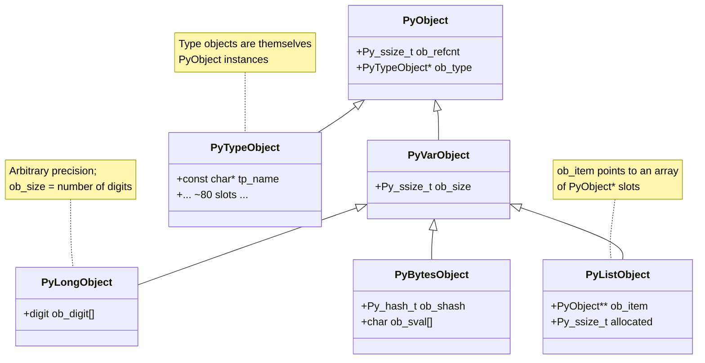
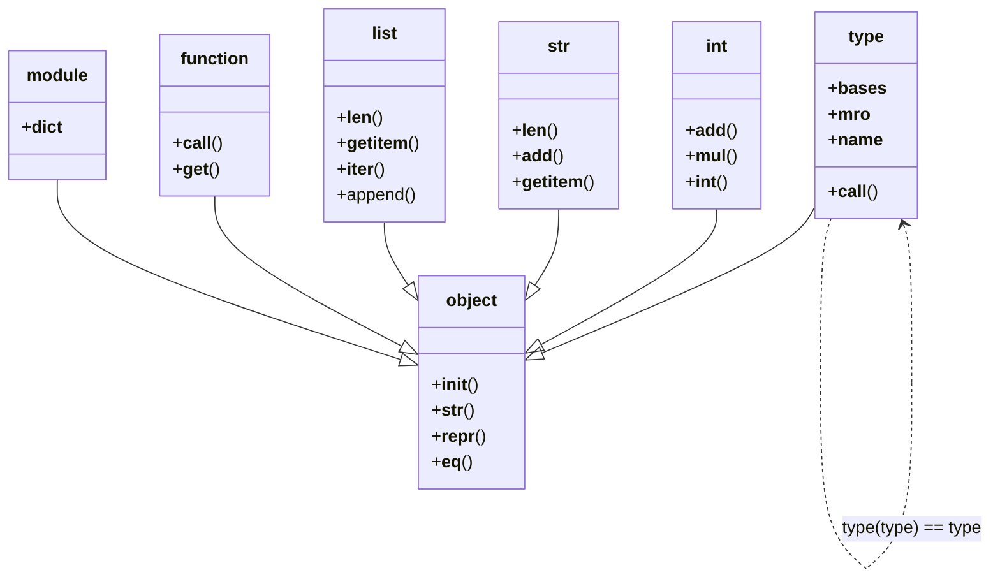

# 4. The Object Model

> [!note] Why this note exists
> Every value in Python — every integer, string, list, function, class, module, `None`, `True`, `False`, even `type` itself — is an instance of `PyObject` at the C level. The object model is the unified theory that makes this work: a `PyObject` header with a refcount and a type pointer, a `PyVarObject` extension for variable-sized types, a `PyTypeObject` describing each type's behaviour through ~80 function-pointer **slots** (`tp_xxx`), a **descriptor protocol** that turns attribute access into method calls, and the **method resolution order (MRO)** that decides which class's method wins in multiple inheritance. Understanding the object model is the difference between *using* Python and *understanding* Python. It explains why `int.__add__` and `int.__mul__` exist, why `len(x)` calls `x.__len__`, why `instance.method` returns a bound method, why `property` works, why `__slots__` saves memory, why `type` is its own type, why `super()` does what it does, and why "everything is an object" isn't just a slogan — it's a C-level invariant enforced by the `PyObject` header. This note is the deep dive; read alongside [[1. CPython Architecture]] for context and [[5. The C API]] for how C code manipulates these objects.

## Why It Matters

The object model is the substrate of every Python operation. Knowing it lets you:

- **Predict method dispatch.** Why does `class B(A): pass` call `A`'s `__init__` when `B` doesn't define one? Why does `len([1,2,3])` work without `[1,2,3].__len__()` being called explicitly?
- **Understand descriptors.** `property`, `classmethod`, `staticmethod`, and ordinary functions are all descriptors. The descriptor protocol (`__get__`, `__set__`, `__delete__`) is the mechanism that turns attribute access into method binding.
- **Implement custom attribute behaviour.** `__getattr__`, `__getattribute__`, `__slots__`, `__dict__` — the four-way interaction that determines what `obj.x` does.
- **Reason about multiple inheritance.** Why does Python use C3 linearisation for MRO? Why does `class D(B, C): pass` have a specific MRO?
- **Optimise memory.** `__slots__` removes the per-instance `__dict__`, saving 200+ bytes per instance. Knowing the object layout tells you when this matters.
- **Read C extension code.** Every C extension defines types via `PyTypeObject` with slots. Knowing the slots lets you read `Objects/listobject.c` or any third-party C extension.
- **Diagnose weird behaviours.** "Why does `1 .__class__` work but `1.__class__` not parse?" "Why is `True + True == 2`?" "Why does `isinstance(True, int)` return `True`?"

The object model is also where Python's elegance comes from. The fact that `len`, `str`, `repr`, `+`, `==`, `in`, `for x in ...`, `with x as y`, `x[y]`, `x.y`, `x(...)` — every Python operation — is uniformly dispatched through a small set of dunder methods on the object's type is what makes the language feel cohesive. There's no special case for `len`; it's just `type(x).__len__(x)`.

## Background

### `PyObject`: the universal header

Every Python object starts with the same two C fields (defined in `Include/object.h`):

```c
typedef struct _object {
    Py_ssize_t ob_refcnt;       // reference count
    PyTypeObject *ob_type;      // pointer to type object
} PyObject;
```

That's it. Every `int`, `str`, `list`, `dict`, `function`, `class`, `module`, `None`, `True`, `False` — they all begin with these 16 bytes (on a 64-bit system). The `ob_refcnt` is for garbage collection (see [[2. Reference Counting and GC]]); the `ob_type` is for dynamic dispatch.

In Python 3.12+, some objects are **immortal**: their `ob_refcnt` is set to a special sentinel (`_Py_IMMORTAL_REFCNT = 2^63 - 1`) that never changes. `None`, `True`, `False`, small ints, and certain interned strings are immortal. This eliminates refcount churn on the most-used objects and supports the future no-GIL build (PEP 703).

### `PyVarObject`: variable-sized objects

For types whose instances have a variable number of items (lists, tuples, strings, bytes, dicts), CPython adds an `ob_size` field:

```c
typedef struct {
    PyObject ob_base;
    Py_ssize_t ob_size;         // number of items
} PyVarObject;
```

A `list[int]` of length 1 million has `ob_size = 1000000`. `len(x)` returns `ob_size` (via the `sq_length` slot, which just reads the field).

The actual items are stored in a separate array (`ob_item` for lists, `ob_digit` for longs, `ob_sval` for strings), pointed to by a type-specific field after the `PyVarObject` header.

### `PyTypeObject`: the type of types

Every object has a `ob_type` pointer to a `PyTypeObject` — the object that describes its type. The `PyTypeObject` is itself a `PyObject` (its `ob_type` is `type`, which is its own type).

A simplified `PyTypeObject` (the real one has ~80 fields):

```c
typedef struct _typeobject {
    PyObject_VAR_HEAD                  // includes ob_size
    const char *tp_name;               // "int", "list", "MyClass"
    Py_ssize_t tp_basicsize;           // size of instances
    Py_ssize_t tp_itemsize;            // per-item size for var objects

    // Lifecycle
    destructor tp_dealloc;             // __del__ equivalent
    Py_ssize_t tp_vectorcall_offset;
    getattrfunc tp_getattr;
    setattrfunc tp_setattr;
    Py_ssize_t tp_as_async;            // async slot table
    reprfunc tp_repr;                  // __repr__

    // Numeric operations (a separate slot table)
    PyNumberMethods *tp_as_number;

    // Sequence operations
    PySequenceMethods *tp_as_sequence;

    // Mapping operations
    PyMappingMethods *tp_as_mapping;

    // Hash and call
    hashfunc tp_hash;                  // __hash__
    ternaryfunc tp_call;               // __call__
    reprfunc tp_str;                   // __str__

    // Attribute access
    getattrofunc tp_getattro;          // __getattribute__
    setattrofunc tp_setattro;          // __setattr__

    // Iteration
    getiterfunc tp_iter;               // __iter__
    iternextfunc tp_iternext;          // __next__

    // Namespace and bases
    PyObject *tp_dict;                 // type's __dict__
    descrgetfunc tp_descr_get;         // descriptor __get__
    descrsetfunc tp_descr_set;         // descriptor __set__
    Py_ssize_t tp_dictoffset;          // offset of __dict__ in instances
    initproc tp_init;                  // __init__
    allocfunc tp_alloc;                // __alloc__
    newfunc tp_new;                    // __new__
    freefunc tp_free;                  // __free__

    // Inheritance
    PyObject *tp_base;                 // base class
    PyObject *tp_dict;                 // type's namespace
    PyObject *tp_mro;                  // method resolution order (tuple)
    PyObject *tp_cache;
    PyObject *tp_subclasses;
    PyObject *tp_weaklist;

    // ... many more ...
} PyTypeObject;
```

These slots are function pointers. When you do `len(x)`, the eval loop calls `x`'s `tp_as_mapping->mp_length` (or `tp_as_sequence->sq_length`). When you do `x + y`, it calls `x`'s `tp_as_number->nb_add`. When you do `for item in x`, it calls `x`'s `tp_iter` and then `tp_iternext` on the result.

The **slot mechanism** is Python's dynamic dispatch — analogous to C++ vtables, but more flexible (slots can be inherited, overridden, or set to `NULL` to indicate "not supported").

### Heap types vs static types

- **Static types**: built-in types like `int`, `str`, `list`, `tuple`, `dict`, `type`, `object`. They're statically allocated C structs at known addresses. They live forever; they don't participate in the cyclic GC. They can't be subclassed from Python (in most cases — `int` and `str` can be subclassed because they were special-cased, but it's complex).
- **Heap types**: classes created with `class Foo:`, or with `PyType_FromSpec` in C extensions. They're heap-allocated `PyTypeObject`s. They participate in the GC. They can be subclassed. They can be garbage-collected when no references remain.

Static types are slightly faster (no GC overhead, fixed address), but heap types are more flexible. Most user-defined classes are heap types.

### Type slots and dunder methods

The Python-level dunder methods (`__len__`, `__add__`, `__eq__`, `__iter__`, etc.) are *not* the same as the C-level slots. The slots are the actual function pointers; the dunder methods are Python-visible wrappers that the slots call (or vice versa).

When you write:

```python
class MyList:
    def __len__(self):
        return 42
```

CPython's `type` metaclass sees `__len__` in the class dict and sets the `tp_len` slot (well, actually `sq_length`) to a wrapper function that calls `self.__len__()`. The wrapper is in `Objects/typeobject.c` (`slot_tp_len` and friends).

So `len(x)` calls `x`'s `tp_as_sequence->sq_length`, which (for user classes) is `slot_tp_length`, which calls `x.__len__()`.

For built-in types like `list`, `tp_as_sequence->sq_length` is a direct C function (`list_length`), not a wrapper. This is why built-in `len(list)` is faster than user `__len__` — no Python-level call.

### The C3 MRO

Python uses the **C3 linearisation** algorithm to compute the method resolution order (MRO) of a class. The MRO is the order in which base classes are searched for a method.

For single inheritance, it's obvious: `class B(A):` has MRO `[B, A, object]`. For multiple inheritance, it's trickier:

```python
class A: pass
class B(A): pass
class C(A): pass
class D(B, C): pass
print(D.__mro__)
# (<class 'D'>, <class 'B'>, <class 'C'>, <class 'A'>, <class 'object'>)
```

C3 guarantees:

- A class appears before its parents.
- Parents appear in the order they're listed in the `class` statement.
- The order is consistent (no class appears twice).

If a class definition would violate these (a "diamond" with inconsistent ordering), Python raises `TypeError: Cannot create a consistent method resolution order`.

```python
class X: pass
class Y: pass
class Z(X, Y): pass
class W(Y, X): pass   # inconsistent with Z's parents!
class V(Z, W): pass   # TypeError: Cannot create a consistent MRO
```

`super()` uses the MRO to find the "next" class. `super()` in a method of `D` calls the next class in `D`'s MRO after the class where the method is defined — not necessarily `D`'s direct parent.

### The descriptor protocol

A **descriptor** is any object with `__get__`, `__set__`, or `__delete__` defined. Descriptors customise attribute access.

- **Data descriptor**: has `__set__` or `__delete__`. Examples: `property`, `__slots__` descriptors.
- **Non-data descriptor**: has only `__get__`. Examples: functions (yes, functions are descriptors!), `classmethod`, `staticmethod`.

When you access `obj.attr`:

1. CPython looks up `attr` on `type(obj)` (the type, not the instance).
2. If it's a data descriptor, call `__get__` and return the result.
3. Otherwise, look in `obj.__dict__`. If found, return it.
4. Otherwise, if it's a non-data descriptor, call `__get__` and return.
5. Otherwise, raise `AttributeError`.

This priority order explains:

- **Properties override instance attributes**: a property is a data descriptor, so `__get__` is called even if there's an entry in `__dict__`.
- **Methods can be shadowed by instance attributes**: a function is a non-data descriptor, so an instance attribute with the same name wins.
- **`__slots__` descriptors are data descriptors**: they intercept `__set__` to enforce the slot layout.

```python
class MyClass:
    def method(self):
        return "method"

    @property
    def prop(self):
        return "property"

obj = MyClass()
print(obj.method)   # <bound method MyClass.method of <MyClass object>>
print(obj.prop)     # "property"

# Methods can be shadowed:
obj.method = "shadowed"
print(obj.method)   # "shadowed" — non-data descriptor loses to instance attr

# Properties can't:
obj.prop = "shadowed"   # AttributeError: can't set attribute
```

### Functions are descriptors

A Python function has a `__get__` method. When accessed via a class, `__get__` returns a bound method:

```python
class MyClass:
    def method(self):
        return self

# Direct access:
print(MyClass.method)         # <function MyClass.method at 0x...>

# Via instance:
obj = MyClass()
print(obj.method)             # <bound method MyClass.method of <MyClass object>>

# Bound method:
print(obj.method() is obj)    # True
```

The bound method object holds `(function, instance)`. When called, it prepends `instance` to the args and calls `function`. This is how `self` gets passed.

### `property`, `classmethod`, `staticmethod`

All three are descriptors:

- **`property`**: a data descriptor. `__get__` calls the getter; `__set__` calls the setter; `__delete__` calls the deleter.
- **`classmethod`**: a non-data descriptor. `__get__` returns a bound method with the class as the first arg (instead of the instance).
- **`staticmethod`**: a non-data descriptor. `__get__` returns the underlying function unchanged.

```python
class MyClass:
    @property
    def prop(self): return "prop"

    @classmethod
    def cls_method(cls): return cls

    @staticmethod
    def static_method(): return "static"

print(MyClass.prop)             # <property object>
print(MyClass.cls_method)       # <bound method cls_method of MyClass>
print(MyClass.static_method)    # <function static_method>
```

### `__getattr__`, `__getattribute__`, `__setattr__`

These dunder methods let you customise attribute access at the instance level:

- **`__getattribute__`**: called for *every* attribute access. Override the default behaviour. Easy to cause infinite recursion if you do `self.x` inside.
- **`__getattr__`**: called only when normal attribute lookup fails. Useful for "lazy" or "computed" attributes.
- **`__setattr__`**: called for every attribute assignment. Override to validate, log, or proxy.

```python
class LazyProxy:
    def __init__(self, target):
        object.__setattr__(self, '_target', target)  # avoid __setattr__

    def __getattr__(self, name):
        # Only called if 'name' isn't found normally.
        return getattr(self._target, name)

    def __setattr__(self, name, value):
        setattr(self._target, name, value)
```

Inside `__getattribute__` and `__setattr__`, use `object.__getattribute__(self, name)` and `object.__setattr__(self, name, value)` to avoid infinite recursion.

### `__slots__`

By default, instances store attributes in `__dict__` (a hash table). With `__slots__`, attributes are stored at fixed offsets in the instance's C struct:

```python
class Point:
    __slots__ = ('x', 'y')
    def __init__(self, x, y):
        self.x = x
        self.y = y
```

Effects:

- **Memory**: no `__dict__` (saves ~200 bytes per instance).
- **Attribute access**: `obj.x` is a direct struct offset read, faster than dict lookup.
- **Construction**: no dict allocation, ~20% faster.
- **Restriction**: can't add attributes not in `__slots__`.
- **Inheritance**: subclasses must also define `__slots__` (even `__slots__ = ()`) or they get a `__dict__`.

```python
class Point3D(Point):
    __slots__ = ('z',)
    def __init__(self, x, y, z):
        super().__init__(x, y)
        self.z = z
```

For Python 3.10+, `@dataclass(slots=True)` automatically generates `__slots__`.

### Heap type creation: `type.__call__`

When you write `class Foo(Base, metaclass=Meta):`, CPython:

1. Calls `Meta('Foo', (Base,), namespace)`.
2. `Meta.__call__` (which is `type.__call__` by default) calls `Meta.__new__` to create the type object, then `Meta.__init__` to initialise it.
3. `type.__new__` allocates a `PyTypeObject`, fills in the slots from `namespace` (looking for `__len__`, `__add__`, etc., and setting the corresponding slots), sets `tp_base`, computes the MRO, and inherits slots from the base.
4. `type.__init__` does final initialisation.

This is why `type` is the default metaclass and why metaclasses can customise class creation.

### `type` is its own type

```python
print(type(42))            # <class 'int'>
print(type(int))           # <class 'type'>
print(type(type))          # <class 'type'>  -- type is its own type!
print(type(object))        # <class 'type'>
print(object.__bases__)    # ()
print(type.__bases__)      # (<class 'object'>,)
```

The bootstrap:

- `object` is the base of all classes. It has no base.
- `type` is the metaclass of all classes. Its base is `object`.
- `type`'s type is `type` itself — a self-reference at the top of the hierarchy.

This circularity is set up at CPython startup, in `_Py_ReadyTypes()`.

### `isinstance` and `issubclass`

`isinstance(x, T)` checks if `type(x)` is `T` or a subclass of `T`. It walks the MRO of `type(x)`, looking for `T`. This is faster than checking each base manually.

For abstract base classes (ABCs), `isinstance` may also call `T.__instancecheck__(x)` if defined. This is how `isinstance([], collections.abc.Sequence)` returns `True` even though `list` doesn't inherit from `Sequence` — `Sequence.__instancecheck__` checks for the right methods.

## Main content

### The `PyObject` hierarchy



### Attribute access flowchart

```mermaid
flowchart TD
    ACCESS[obj.attr]
    TYPE_LOOKUP[Look up attr in type(obj)]
    IS_DATA_DESC{Data descriptor?}
    CALL_GET[Call __get__]
    INSTANCE_DICT[Look up attr in obj.__dict__]
    FOUND_IN_DICT{Found?}
    RETURN_INSTANCE[Return instance attr]
    IS_NON_DATA{Non-data descriptor?}
    CALL_GET_2[Call __get__]
    NOT_FOUND[AttributeError,<br/>or __getattr__ if defined]

    ACCESS --> TYPE_LOOKUP
    TYPE_LOOKUP --> IS_DATA_DESC
    IS_DATA_DESC -->|yes| CALL_GET
    IS_DATA_DESC -->|no| INSTANCE_DICT
    INSTANCE_DICT --> FOUND_IN_DICT
    FOUND_IN_DICT -->|yes| RETURN_INSTANCE
    FOUND_IN_DICT -->|no| IS_NON_DATA
    IS_NON_DATA -->|yes| CALL_GET_2
    IS_NON_DATA -->|no, not found| NOT_FOUND
    CALL_GET --> DONE[Return result]
    CALL_GET_2 --> DONE
```

### Slot dispatch for common operations

| Python operation | Slot | Python dunder |
|---|---|---|
| `len(x)` | `tp_as_sequence->sq_length` or `tp_as_mapping->mp_length` | `__len__` |
| `x + y` | `tp_as_number->nb_add` | `__add__`, `__radd__` |
| `x - y` | `tp_as_number->nb_subtract` | `__sub__`, `__rsub__` |
| `x * y` | `tp_as_number->nb_multiply` | `__mul__`, `__rmul__` |
| `x == y` | `tp_richcompare` with `Py_EQ` | `__eq__` |
| `x < y` | `tp_richcompare` with `Py_LT` | `__lt__` |
| `hash(x)` | `tp_hash` | `__hash__` |
| `repr(x)` | `tp_repr` | `__repr__` |
| `str(x)` | `tp_str` | `__str__` |
| `x(y)` | `tp_call` | `__call__` |
| `x.attr` | `tp_getattro` | `__getattribute__`, `__getattr__` |
| `x.attr = y` | `tp_setattro` | `__setattr__` |
| `iter(x)` | `tp_iter` | `__iter__` |
| `next(x)` | `tp_iternext` | `__next__` |
| `x[y]` | `tp_as_mapping->mp_subscript` | `__getitem__` |
| `x[y] = z` | `tp_as_mapping->mp_ass_subscript` | `__setitem__` |
| `for y in x` | `tp_iter` then `tp_iternext` | `__iter__`, `__next__` |
| `with x as y` | `tp_as_async->am_enter` / `tp_methods` | `__enter__`, `__exit__` |
| `x.attr()` (method) | `tp_getattro` + descriptor `__get__` + `tp_call` | `__getattribute__` + `__call__` |

### How `len(x)` works

```python
# Python-level
len([1, 2, 3])
# Equivalent to:
type([1, 2, 3]).__len__([1, 2, 3])
# Which CPython implements as:
list_length([1, 2, 3])   # direct C function
# Returns ob_size of the list.
```

The eval loop's `CALL_LEN` opcode (or `LOAD_GLOBAL len` + `CALL`):

1. Looks up `len` in `builtins` — it's `bltinmodule.c`'s `builtin_len`.
2. `builtin_len(x)` calls `PyObject_Length(x)`.
3. `PyObject_Length(x)` calls `x`'s `tp_as_sequence->sq_length` (or `mp_length`).
4. For `list`, that's `list_length`, which returns `ob_size`.
5. For a user class, that's `slot_tp_length`, which calls `x.__len__()`.

This indirection is why `len(list)` is fast (direct C) but `len(MyClass())` is slower (Python-level call).

### How `x + y` works

```python
a + b
# Equivalent to (roughly):
result = type(a).__add__(a, b)
if result is NotImplemented:
    result = type(b).__radd__(b, a)
if result is NotImplemented:
    raise TypeError(...)
```

`PyNumber_Add(a, b)`:

1. Looks up `a`'s `tp_as_number->nb_add`. If non-NULL, calls it. If the result isn't `NotImplemented`, returns it.
2. Looks up `b`'s `tp_as_number->nb_reflected_add` (or `nb_add` if no reflected). Calls it.
3. If both return `NotImplemented`, raises `TypeError`.

This is why `1 + 1.0` works: `int.__add__(1, 1.0)` returns `NotImplemented` (int doesn't know how to add to float); `float.__radd__(1.0, 1)` returns `2.0`.

### How method calls work

```python
class C:
    def method(self):
        return self

c = C()
c.method()
```

1. `c.method` triggers `__getattribute__`.
2. `type(c).__mro__` is searched for `method`. Found on `C`.
3. `method` is a function (non-data descriptor).
4. `method.__get__(c, type(c))` returns a bound method `(method, c)`.
5. The bound method is called: `method(c)`.

The bound method object is heap-allocated per call (in 3.6 and earlier). In 3.7+, `LOAD_METHOD`/`CALL_METHOD` avoid the allocation for the common case.

### `super()` and the MRO

```python
class A:
    def method(self):
        return "A"

class B(A):
    def method(self):
        return "B -> " + super().method()

class C(A):
    def method(self):
        return "C -> " + super().method()

class D(B, C):
    def method(self):
        return "D -> " + super().method()

print(D().method())
# D -> B -> C -> A
```

`super()` in `D.method` returns a proxy that searches `D.__mro__` *after* `D`. `D.__mro__` is `(D, B, C, A, object)`, so the next class is `B`. `B.method` is called, which calls `super().method()` — but `super()` here is bound to `D`'s MRO (because `super` uses the class where the method was defined, not the class of the instance), so the next class is `C`. And so on.

This is the key insight: **`super()` follows the MRO of the class where the method is defined, not the class of `self`**. Without this, multiple inheritance wouldn't compose correctly.

### Heap type example in C

A minimal C extension type:

```c
#include <Python.h>

typedef struct {
    PyObject_HEAD
    long value;
} MyType;

static PyObject *
MyType_new(PyTypeObject *type, PyObject *args, PyObject *kwds)
{
    MyType *self;
    self = (MyType *)type->tp_alloc(type, 0);
    if (self != NULL) {
        self->value = 0;
    }
    return (PyObject *)self;
}

static int
MyType_init(MyType *self, PyObject *args, PyObject *kwds)
{
    static char *kwlist[] = {"value", NULL};
    if (!PyArg_ParseTupleAndKeywords(args, kwds, "l", kwlist, &self->value))
        return -1;
    return 0;
}

static PyObject *
MyType_repr(MyType *self)
{
    return PyUnicode_FromFormat("MyType(%ld)", self->value);
}

static PyTypeObject MyTypeType = {
    PyVarObject_HEAD_INIT(NULL, 0)
    .tp_name = "mymodule.MyType",
    .tp_basicsize = sizeof(MyType),
    .tp_new = MyType_new,
    .tp_init = (initproc)MyType_init,
    .tp_repr = (reprfunc)MyType_repr,
};

static struct PyModuleDef mymodule = {
    PyModuleDef_HEAD_INIT,
    .m_name = "mymodule",
    .m_size = -1,
};

PyMODINIT_FUNC
PyInit_mymodule(void)
{
    PyObject *m;
    if (PyType_Ready(&MyTypeType) < 0)
        return NULL;
    m = PyModule_Create(&mymodule);
    if (m == NULL)
        return NULL;
    Py_INCREF(&MyTypeType);
    if (PyModule_AddObject(m, "MyType", (PyObject *)&MyTypeType) < 0) {
        Py_DECREF(&MyTypeType);
        Py_DECREF(m);
        return NULL;
    }
    return m;
}
```

This is the foundation of every C extension type — including all the built-in types in `Objects/`. See [[5. The C API]] for the full treatment.

## Mermaid: PyObject hierarchy



## Mermaid: descriptor lookup

```mermaid
flowchart TD
    ACCESS[Access obj.attr]
    SEARCH_TYPE[Search type(obj).__mro__<br/>for attr]
    FOUND_TYPE{Found on type?}
    DATA_DESC{Is it a data<br/>descriptor?}
    CALL_GET_DESC[Call descriptor.__get__<br/>with obj and type obj]
    SEARCH_INSTANCE[Search obj.__dict__]
    FOUND_INSTANCE{Found?}
    RETURN_INSTANCE[Return instance value]
    NON_DATA_DESC{Is it a non-data<br/>descriptor?}
    CALL_GET_NON_DATA[Call descriptor.__get__]
    RETURN_DESC[Return descriptor result]
    FALLBACK[Try __getattr__<br/>or raise AttributeError]

    ACCESS --> SEARCH_TYPE
    SEARCH_TYPE --> FOUND_TYPE
    FOUND_TYPE -->|yes| DATA_DESC
    FOUND_TYPE -->|no| SEARCH_INSTANCE
    DATA_DESC -->|yes| CALL_GET_DESC
    DATA_DESC -->|no| SEARCH_INSTANCE
    CALL_GET_DESC --> RETURN_DESC
    SEARCH_INSTANCE --> FOUND_INSTANCE
    FOUND_INSTANCE -->|yes| RETURN_INSTANCE
    FOUND_INSTANCE -->|no| NON_DATA_DESC
    NON_DATA_DESC -->|yes| CALL_GET_NON_DATA
    NON_DATA_DESC -->|no| FALLBACK
    CALL_GET_NON_DATA --> RETURN_DESC
```

## Code examples

### Inspecting `type` and `object`

```python
print(type)               # <class 'type'>
print(object)             # <class 'object'>
print(type.__bases__)     # (<class 'object'>,)
print(object.__bases__)   # ()
print(type(type))         # <class 'type'>
print(type(object))       # <class 'type'>
print(type.mro())         # [<class 'type'>, <class 'object'>]
print(object.mro())       # [<class 'object'>]
```

### Demonstrating MRO

```python
class A:
    def greet(self): return "A"

class B(A):
    def greet(self): return "B -> " + super().greet()

class C(A):
    def greet(self): return "C -> " + super().greet()

class D(B, C):
    def greet(self): return "D -> " + super().greet()

print(D.__mro__)
# (<class 'D'>, <class 'B'>, <class 'C'>, <class 'A'>, <class 'object'>)

print(D().greet())
# D -> B -> C -> A
```

### Demonstrating descriptors

```python
class VerboseAttribute:
    def __get__(self, obj, objtype=None):
        print(f"__get__ called: obj={obj}, objtype={objtype}")
        return "verbose value"

    def __set__(self, obj, value):
        print(f"__set__ called: obj={obj}, value={value}")

class MyClass:
    attr = VerboseAttribute()

obj = MyClass()
print(obj.attr)        # __get__ called, returns "verbose value"
obj.attr = "new"       # __set__ called
```

### Properties are data descriptors

```python
class Temperature:
    def __init__(self, celsius):
        self._celsius = celsius

    @property
    def celsius(self):
        return self._celsius

    @celsius.setter
    def celsius(self, value):
        if value < -273.15:
            raise ValueError("below absolute zero")
        self._celsius = value

t = Temperature(20)
print(t.celsius)       # 20
t.celsius = 25
print(t.celsius)       # 25
try:
    t.celsius = -300
except ValueError as e:
    print(e)           # below absolute zero
```

### Functions are non-data descriptors

```python
class C:
    def method(self):
        return "method"

# Function's __get__ returns a bound method
print(C.method)              # <function C.method at 0x...>
print(C().method)            # <bound method C.method of <C object>>
print(C().method.__self__)   # <C object>
print(C().method.__func__)   # <function C.method at 0x...>

# Instance attributes can shadow methods (non-data descriptors lose):
c = C()
c.method = "shadowed"
print(c.method)              # "shadowed"
```

### `__slots__` saves memory

```python
import sys

class WithDict:
    __init__ = lambda self, x, y: setattr(self, 'x', x) or setattr(self, 'y', y)

class WithSlots:
    __slots__ = ('x', 'y')
    __init__ = lambda self, x, y: setattr(self, 'x', x) or setattr(self, 'y', y)

d = WithDict(1, 2)
s = WithSlots(1, 2)

print(sys.getsizeof(d))   # ~56 (just the header; dict is separate)
print(sys.getsizeof(s))   # ~56 (header + 2 slots)

# But d also has a __dict__:
print(sys.getsizeof(d.__dict__))   # ~232 for 2 items
print(hasattr(s, '__dict__'))      # False
```

### `__getattr__` for lazy attributes

```python
class LazyConfig:
    def __init__(self):
        self._loaded = {}

    def __getattr__(self, name):
        # Only called if normal lookup fails.
        if name.startswith('_'):
            raise AttributeError(name)
        if name not in self._loaded:
            print(f"  loading {name}...")
            self._loaded[name] = load_from_disk(name)
        return self._loaded[name]

def load_from_disk(name):
    return f"value of {name}"

config = LazyConfig()
print(config.foo)   # loading foo..., value of foo
print(config.foo)   # value of foo (cached, no reload)
print(config.bar)   # loading bar..., value of bar
```

### Customising `__getattribute__`

```python
class LoggingProxy:
    def __init__(self, target):
        object.__setattr__(self, '_target', target)

    def __getattribute__(self, name):
        target = object.__getattribute__(self, '_target')
        print(f"  accessing {name}")
        return getattr(target, name)

    def __setattr__(self, name, value):
        target = object.__getattribute__(self, '_target')
        setattr(target, name, value)

class Real:
    def __init__(self):
        self.x = 10

real = Real()
proxy = LoggingProxy(real)
print(proxy.x)   # accessing x, 10
proxy.x = 20     # accessing x (via setattr, no print)
print(proxy.x)   # accessing x, 20
```

### Inspecting slots via `type()`

```python
print(type(42))         # <class 'int'>
print(type(42).__mro__) # (<class 'int'>, <class 'object'>)

# The int type's slots are accessible via attributes:
print(int.__add__)      # <slot wrapper '__add__' of 'int' objects>
print(int.__mul__)      # <slot wrapper '__mul__' of 'int' objects>

# Calling them directly:
print(int.__add__(2, 3))   # 5
```

### ABCs and virtual subclasses

```python
import collections.abc

class MyList:
    def __len__(self): return 0
    def __getitem__(self, i): raise IndexError

# MyList is registered as a virtual subclass of Sequence
print(isinstance(MyList(), collections.abc.Sequence))   # False

# But if we register it:
collections.abc.Sequence.register(MyList)
print(isinstance(MyList(), collections.abc.Sequence))   # True
print(issubclass(MyList, collections.abc.Sequence))     # True
```

## Common Pitfalls

1. **Forgetting that `type(x).__len__(x)` is what `len(x)` calls.** Subclassing `int` and overriding `__len__` makes `len(MyInt(5))` call your method, not return the int's bit length.

2. **Confusing `__getattr__` and `__getattribute__`.** `__getattr__` is the fallback (only called when normal lookup fails); `__getattribute__` is the primary (called for every access). Use `__getattr__` for lazy attrs; use `__getattribute__` for full proxying.

3. **Infinite recursion in `__getattribute__`.** `def __getattribute__(self, name): return self._target` — `self._target` triggers `__getattribute__` again, infinite loop. Use `object.__getattribute__(self, '_target')`.

4. **Expecting `__init__` to be called on unpickling.** `__init__` is not called for unpickled objects; `__new__` is. Override `__reduce__` or `__setstate__` if you need custom init.

5. **Forgetting that `__slots__` doesn't inherit.** A subclass without `__slots__` gets a `__dict__`, undoing the savings.

6. **Using `super()` outside a method.** `super()` (no args) uses the `__class__` cell, which only exists inside methods. In a function nested in a class, it works; in a function outside, it doesn't.

7. **Assuming MRO is left-to-right depth-first.** It's C3 linearisation, which is more subtle. Use `ClassName.__mro__` to see it.

8. **Expecting `isinstance(True, int)` to be `False`.** `bool` is a subclass of `int`; `True` is `1`, `False` is `0`. This is by design (PEP 285).

9. **Calling `__hash__` on a mutable object.** Lists, dicts, sets are unhashable because their hash would change if mutated. Frozen versions (`tuple`, `frozenset`) are hashable.

10. **Defining `__eq__` without `__hash__`.** Defining `__eq__` sets `__hash__` to `None`, making the object unhashable. Always define both (or neither).

11. **Forgetting that descriptors must be on the class, not the instance.** `obj.attr = MyDescriptor(); obj.attr` won't call `__get__` — descriptors only work as class attributes.

12. **Expecting `type(x) is ClassName` to be true for subclasses.** Use `isinstance(x, ClassName)` instead.

13. **Confusing `tp_new` and `tp_init`.** `tp_new` creates the object (allocates); `tp_init` initialises it. `__new__` is for customising creation (e.g., singletons, immutable types); `__init__` is for normal initialisation.

14. **Trying to subclass `int` and override `__init__`.** `int` is immutable; `__init__` is too late to set the value. Override `__new__` instead.

15. **Forgetting that `property` is a data descriptor.** It always wins over instance attributes. Don't try to "override" a property by setting an instance attribute with the same name.

16. **Believing `__dict__` is the source of truth.** For `__slots__` classes, there's no `__dict__`. For built-in types like `int`, instances don't have a `__dict__`.

## Tips and Tricks

- **Use `type(x).__name__` for the class name in error messages** — handles subclasses correctly.
- **Use `isinstance` over `type(x) is T`** — handles subclasses.
- **Use `issubclass` for class checks.**
- **`type(x).__mro__` shows the method resolution order.** Useful for debugging inheritance.
- **`dir(x)` shows all attributes**, including inherited ones.
- **`vars(x)` is `x.__dict__`** — the instance's attribute dict. Only works for instances with a `__dict__`.
- **`hasattr(x, name)` calls `getattr` and catches `AttributeError`.** Don't use it if the attribute access has side effects.
- **`@property` for read-only computed attributes; `@cached_property` for memoised computed attributes.**
- **`__slots__` for many small instances.** Pair with `@dataclass(slots=True)` (Python 3.10+).
- **`__getattr__` for lazy attribute loading.** Cheaper than `__getattribute__` because it's only called on miss.
- **Use `object.__getattribute__` and `object.__setattr__` inside custom `__getattribute__`/`__setattr__`** to avoid recursion.
- **For metaclasses, override `__new__` or `__init__` of `type`.** Common for ORMs, frameworks, automatic registration.
- **Descriptors are the mechanism behind `property`, `classmethod`, `staticmethod`, `super`, `__slots__`.** Learn the protocol once, and they all make sense.
- **`super()` (no args) uses the `__class__` cell**, which is the class where the method is defined. This is why `super()` works correctly in multiple inheritance.
- **Use ABCs for interfaces.** `collections.abc.Sequence`, `Mapping`, `Iterable` provide mixin methods based on a few abstract ones.
- **For immutable types, override `__new__`, not `__init__`.** `__init__` runs after the object is created; for immutables, that's too late.
- **For singleton patterns, use a module**, not a class with `__new__` tricks. Module imports are cached.
- **`type(name, bases, namespace)` creates a class dynamically.** Useful for metaprogramming.
- **`type(x).__bases__` gives the direct bases; `type(x).__mro__` gives the full MRO.**

## Active Recall

1. What are the two fields in every `PyObject`? What does `PyVarObject` add?
2. Why is `type` its own type? What's the bootstrap for `object` and `type`?
3. What's the difference between a static type and a heap type?
4. What are type slots? Give three examples (`tp_xxx`).
5. What is the C3 linearisation? Compute the MRO of `class D(B, C)` where `B(A)` and `C(A)`.
6. What's a descriptor? What's the difference between a data descriptor and a non-data descriptor?
7. Why are functions non-data descriptors? What does `function.__get__` return?
8. Describe the order of attribute lookup on `obj.attr` (type vs instance dict vs descriptor).
9. Why can an instance attribute shadow a method but not a property?
10. What's the difference between `__getattr__` and `__getattribute__`?
11. What does `super()` actually do? What MRO does it follow?
12. What does `__slots__` change about an object's memory layout?
13. How does `len(x)` dispatch to `x.__len__()`?
14. What's the difference between `tp_new` and `tp_init`?
15. Why is `isinstance(True, int)` `True`?
16. What happens when you define `__eq__` without `__hash__`?
17. Write a custom descriptor that logs every attribute access.
18. Write a `__getattr__` that lazy-loads attributes from a dict.
19. How does `type(name, bases, namespace)` create a class?
20. Describe the `PyObject` hierarchy with a Mermaid diagram.

## Next Steps

- [[1. CPython Architecture]] — the high-level architecture, source tree, and compile pipeline.
- [[2. Bytecode and the dis Module]] — the bytecode that opcodes like `LOAD_ATTR` operate on.
- [[3. The Execution Model]] — the eval loop that dispatches to type slots.
- [[5. The C API]] — how C code manipulates `PyObject*` and defines new types.
- [[1. Python Memory Model]] — the Python-level view of objects and references.
- [[6. Magic Methods]] — the user-facing dunder methods that map to type slots.
- [[3. Inheritance]] and [[4. Polymorphism and Duck Typing]] — the Python-level use of MRO and dispatch.
- [[5. Encapsulation and Properties]] — `property` as a descriptor.
