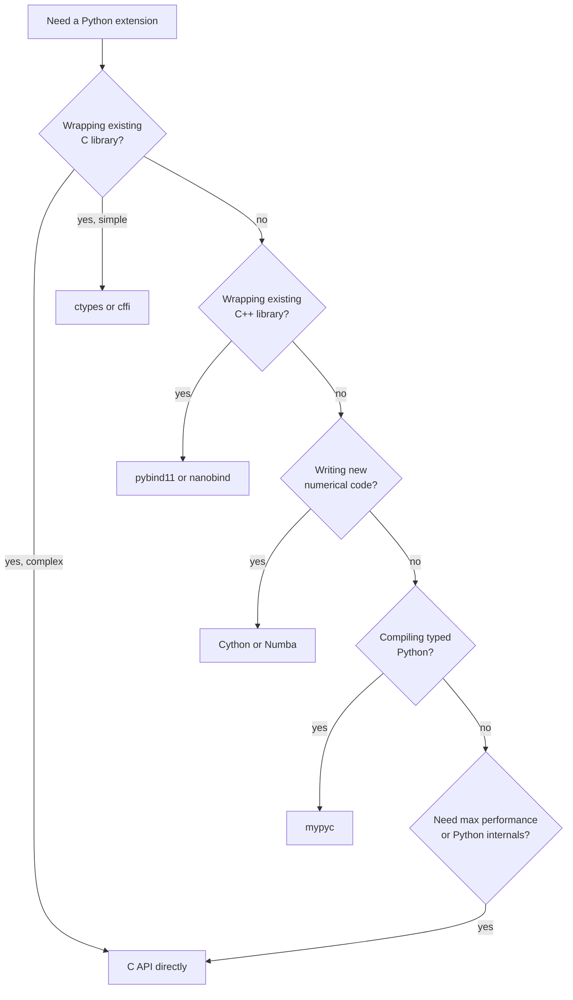
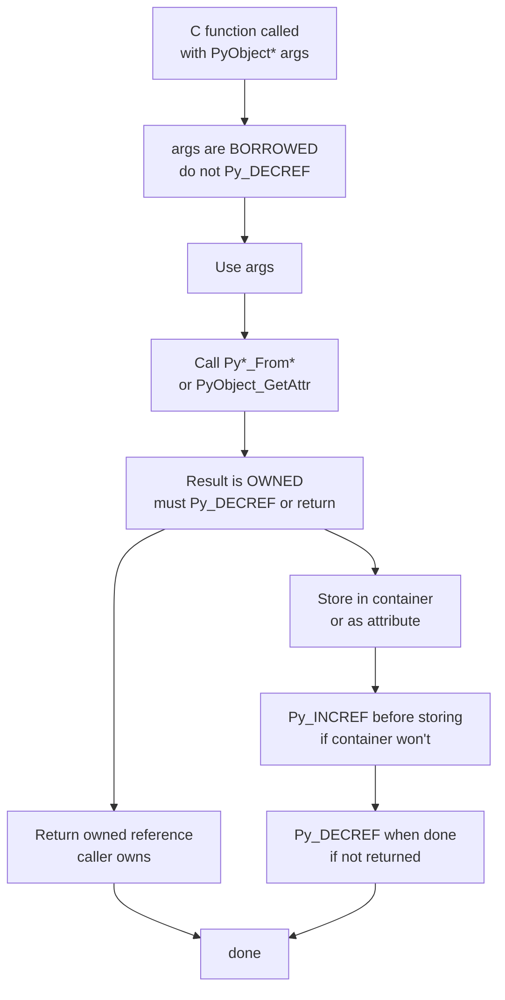

# 5. The C API

> [!note] Why this note exists
> The Python/C API is the **lowest-level interface** between Python and C — the function family that every CPython internal and every C extension uses to manipulate Python objects. It's `PyObject*` everywhere, with `Py_INCREF`/`Py_DECREF` to manage reference counts, `PyArg_ParseTuple` to decode arguments, `Py_BuildValue` to construct return values, and `PyTypeObject` to define new types. This note covers the **reference ownership** model (borrowed vs owned references — the single most important concept, and the source of 90% of C-extension bugs), the API surface for argument parsing and value construction, the structure of a minimal C extension module, and the **alternatives** that have largely replaced hand-written C extensions in modern Python: `ctypes` (foreign function interface, no compilation), `Cython` (Python-like syntax, compiles to C), and `pybind11` (C++ template-heavy, header-only). After reading this note, you'll know when to reach for each tool, how to read existing C extensions, and how to write a correct one yourself — including how to avoid the memory leaks and crashes that plague naive C extensions. Read alongside [[4. The Object Model]] (the C structures the API manipulates) and [[22. Native Extensions]] (the broader extension landscape, including building, packaging, and CI).

## Why It Matters

The C API is the substrate of:

- **All built-in types** (`int`, `str`, `list`, `dict`, etc.) — implemented in C using the API.
- **The stdlib C extensions** (`math`, `socket`, `io`, `_collections`, `gc`, etc.) — every `Modules/*module.c` file.
- **Third-party C extensions** — NumPy, Pandas, SQLAlchemy's C parts, cryptography, lxml, Pillow, psycopg2.
- **Bindings to other languages** — PyO3 (Rust), pybind11 (C++), Jython (Java), and even ctypes use the C API or its ABI.
- **Embedding Python in C applications** — game engines, GUI apps, scientific computing tools that want a scripting layer.

If you do any of these, you need the C API:

- **Writing a fast extension for a hot loop.** Pure Python is slow; a C extension can be 100–1000× faster.
- **Wrapping an existing C library.** Many libraries (BLAS, OpenSSL, libpng, libxml2) have C APIs; the Python wrapper uses the C API to expose them.
- **Debugging an existing extension's memory leak.** Without understanding reference ownership, you can't tell whether `PyList_GetItem` returns a borrowed or owned reference.
- **Reading CPython source code.** The eval loop, the type implementations, the GC — all written using the C API.

But the C API is also **the most error-prone** part of Python development:

- A missed `Py_DECREF` leaks memory.
- An extra `Py_DECREF` on a borrowed reference causes a use-after-free.
- A `Py_INCREF` you forgot on a return value crashes the caller.
- A C extension that doesn't release the GIL blocks other threads.
- A C extension that releases the GIL and then touches Python objects crashes.

This note teaches the model that prevents these errors. The model is small: **every `PyObject*` is either owned (you must `Py_DECREF` when done) or borrowed (you must not)**. The hard part is knowing which functions return which — and that's mostly memorisation, with a few rules of thumb.

## Background

### `PyObject*` everywhere

Every Python object is a `PyObject*` in C — a pointer to a struct beginning with `ob_refcnt` and `ob_type`. The C API is a family of functions that take and return `PyObject*`:

```c
PyObject *result = PyLong_FromLong(42);   // creates a new int (owned)
PyObject *item = PyList_GetItem(list, 0); // borrows an item from the list
PyObject *str = PyObject_Str(obj);        // creates a new str (owned)
```

There's no type-safety beyond `PyObject*` — `PyList_GetItem` returns a `PyObject*` even though you know it's a list item. Macros like `PyList_Check(obj)` and `PyLong_Check(obj)` let you check the type at runtime.

### Reference counting in C

The `ob_refcnt` field of every `PyObject` counts how many references exist to it. The C API provides:

```c
Py_INCREF(obj)   // obj->ob_refcnt++
Py_DECREF(obj)   // obj->ob_refcnt--; if (obj->ob_refcnt == 0) deallocate
Py_XDECREF(obj)  // Py_DECREF but NULL-safe
Py_NewRef(obj)   // Py_INCREF(obj); return obj  (3.10+)
Py_XNewRef(obj)  // NULL-safe version of Py_NewRef (3.10+)
```

The rule: **whoever owns a reference is responsible for `Py_DECREF`ing it**. The trick: knowing who owns what.

### Borrowed vs owned references

This is **the** central concept of the C API.

- **Owned reference**: you are responsible for `Py_DECREF`ing it. If you don't, it leaks.
- **Borrowed reference**: you are *not* responsible. If you `Py_DECREF` it, you cause a use-after-free.

Functions that **return a new reference** (owned):

- `PyLong_FromLong`, `PyUnicode_FromString`, `PyList_New`, `PyDict_New` — constructors.
- `PyObject_Str`, `PyObject_Repr`, `PyObject_GetAttr` — return new objects.
- `PyDict_GetItemString` — wait, no, this is borrowed. (See why this is hard?)
- `Py_BuildValue` — formats a new value.
- `PyImport_ImportModule` — returns a new reference to the module.
- `PyObject_Call` — returns a new reference to the call's result.
- `PySequence_GetItem` — returns a new reference (unlike `PyList_GetItem`!).

Functions that **return a borrowed reference**:

- `PyList_GetItem`, `PyList_GetItem` — borrows from the list.
- `PyTuple_GetItem` — borrows from the tuple.
- `PyDict_GetItem`, `PyDict_GetItemString` — borrows from the dict. (Also suppresses `KeyError` — returns `NULL` without setting an exception.)
- `PyModule_GetDict` — borrows the module's `__dict__`.
- `PyType_GetDict` — borrows the type's `__dict__`.
- `PyImport_AddModule` — borrows the existing module object (returns `NULL` if not yet imported).
- `PyErr_Occurred` — borrows the current exception (if any).
- `PyTuple_GetItem`, `PyList_GetItem` arguments passed to C functions — borrowed.

The general rule of thumb:

- **Constructors** return owned.
- **`_GetItem`** family often borrows (with exceptions — `PySequence_GetItem` is owned, `PyMapping_GetItemString` is owned).
- **`_SetItem`** family borrows both the container and the value (it `Py_INCREF`s internally).
- **`PyObject_GetAttr`** (with `Attr` not `AttrString`) returns owned.
- **Functions documented as "returns a new reference"** are owned.

When in doubt, **read the docs** (`docs.python.org/3/c-api/`). Every function's documentation states whether it returns a new (owned) or borrowed reference.

### Argument parsing: `PyArg_ParseTuple`

The standard way to parse Python arguments to a C function:

```c
static PyObject *
my_function(PyObject *self, PyObject *args)
{
    long n;
    const char *s;
    double x;

    if (!PyArg_ParseTuple(args, "lsd", &n, &s, &x)) {
        return NULL;   // exception already set
    }

    // Use n, s, x...

    return PyLong_FromLong(n * 2);
}
```

The format string `"lsd"` means: long, string (C `char*`), double. Common format codes:

| Code | C type | Python type |
|---|---|---|
| `i` | `int` | int |
| `l` | `long` | int |
| `L` | `long long` | int |
| `f` | `float` | float |
| `d` | `double` | float |
| `c` | `char` | str (length 1) |
| `s` | `char*` | str (UTF-8) |
| `y` | `char*` | bytes |
| `O` | `PyObject*` | any object (borrowed) |
| `O!` | `PyObject*, PyTypeObject*` | type-checked object |
| `O&` | `PyObject*, converter, void*` | converter function |
| `p` | `int` (0 or 1) | truthy value |
| `(items)` | tuple | tuple of items |
| `|` | (rest optional) | separator |
| `$` | (rest keyword-only) | separator |
| `:` | name follows | separator before function name in error |
| `;` | full message follows | separator before custom error |

For keyword arguments, use `PyArg_ParseTupleAndKeywords`:

```c
static PyObject *
my_function(PyObject *self, PyObject *args, PyObject *kwargs)
{
    long n;
    const char *s = "default";
    static char *kwlist[] = {"n", "s", NULL};

    if (!PyArg_ParseTupleAndKeywords(args, kwargs, "l|s", kwlist, &n, &s)) {
        return NULL;
    }

    return PyLong_FromLong(n);
}
```

`"l|s"` means: long required, string optional.

### Building return values: `Py_BuildValue`

```c
// Return an int
return PyLong_FromLong(42);

// Return a string
return PyUnicode_FromString("hello");

// Return a tuple of (int, str, list)
return Py_BuildValue("(iss[l])", 42, "hello", 3.14, 1, 2, 3);
// "iss" → int, str, str; "[l]" → list of longs
```

`Py_BuildValue` uses the same format codes as `PyArg_ParseTuple`, but in reverse: it constructs a Python object from C values.

Special cases:

- `"N"` instead of `"O"`: takes ownership of the passed `PyObject*` (don't `Py_DECREF` it).
- `"(items)"` always builds a tuple, even with one item. Without parens, `"i"` builds an int; `"(i)"` builds a 1-tuple.
- `NULL` return: signals an exception. The caller should have set one with `PyErr_SetString`.

### Setting exceptions

```c
PyErr_SetString(PyExc_ValueError, "n must be non-negative");
return NULL;

PyErr_Format(PyExc_TypeError, "expected int, got %s", Py_TYPE(obj)->tp_name);
return NULL;

PyErr_NoMemory();   // sets MemoryError
return NULL;

PyErr_Occurred();   // returns the current exception (borrowed), or NULL
PyErr_Clear();      // clears the current exception
```

A `NULL` return from a C function always means "exception raised". The caller (the eval loop) checks for it and propagates.

### A minimal C extension

Here's a complete C extension module with one function:

```c
// mymodule.c
#include <Python.h>

static PyObject *
mymodule_square(PyObject *self, PyObject *args)
{
    long n;
    if (!PyArg_ParseTuple(args, "l", &n)) {
        return NULL;
    }
    return PyLong_FromLong(n * n);
}

static PyMethodDef mymodule_methods[] = {
    {"square", mymodule_square, METH_VARARGS, "Return the square of n."},
    {NULL, NULL, 0, NULL}   // sentinel
};

static struct PyModuleDef mymodule_module = {
    PyModuleDef_HEAD_INIT,
    "mymodule",                   // m_name
    "A minimal C extension.",     // m_doc
    -1,                           // m_size (-1 = no per-module state)
    mymodule_methods,             // m_methods
    NULL, NULL, NULL, NULL        // m_slots, m_traverse, m_clear, m_free
};

PyMODINIT_FUNC
PyInit_mymodule(void)
{
    return PyModule_Create(&mymodule_module);
}
```

Build with a `setup.py`:

```python
from setuptools import setup, Extension

setup(
    name="mymodule",
    ext_modules=[Extension("mymodule", ["mymodule.c"])],
)
```

```bash
python setup.py build_ext --inplace
python -c "import mymodule; print(mymodule.square(7))"   # 49
```

### The module init function

`PyInit_mymodule` is the entry point Python calls when the module is imported. The name **must** be `PyInit_<modulename>` (matching the module's name as imported). Python looks up this symbol via `dlopen`/`LoadLibrary`.

The function:

1. Creates the module object via `PyModule_Create(&module_def)`.
2. Optionally adds types, constants, and submodules.
3. Returns the module object (or `NULL` on error).

### Defining a new type in C

A more complete example with a custom type:

```c
// point.c
#include <Python.h>

typedef struct {
    PyObject_HEAD
    double x, y;
} PointObject;

static int
Point_init(PointObject *self, PyObject *args, PyObject *kwds)
{
    static char *kwlist[] = {"x", "y", NULL};
    self->x = 0.0;
    self->y = 0.0;
    if (!PyArg_ParseTupleAndKeywords(args, kwds, "|dd", kwlist, &self->x, &self->y)) {
        return -1;
    }
    return 0;
}

static PyObject *
Point_repr(PointObject *self)
{
    return PyUnicode_FromFormat("Point(%R, %R)",
        PyFloat_FromDouble(self->x), PyFloat_FromDouble(self->y));
}

static PyMemberDef Point_members[] = {
    {"x", T_DOUBLE, offsetof(PointObject, x), 0, "x coordinate"},
    {"y", T_DOUBLE, offsetof(PointObject, y), 0, "y coordinate"},
    {NULL}
};

static PyTypeObject PointType = {
    PyVarObject_HEAD_INIT(NULL, 0)
    .tp_name = "point.Point",
    .tp_doc = "A 2D point.",
    .tp_basicsize = sizeof(PointObject),
    .tp_itemsize = 0,
    .tp_flags = Py_TPFLAGS_DEFAULT,
    .tp_init = (initproc)Point_init,
    .tp_repr = (reprfunc)Point_repr,
    .tp_members = Point_members,
};

static struct PyModuleDef pointmodule = {
    PyModuleDef_HEAD_INIT,
    "point",
    "Module with a Point type.",
    -1,
};

PyMODINIT_FUNC
PyInit_point(void)
{
    PyObject *m;
    if (PyType_Ready(&PointType) < 0) {
        return NULL;
    }
    m = PyModule_Create(&pointmodule);
    if (m == NULL) {
        return NULL;
    }
    Py_INCREF(&PointType);
    if (PyModule_AddObject(m, "Point", (PyObject *)&PointType) < 0) {
        Py_DECREF(&PointType);
        Py_DECREF(m);
        return NULL;
    }
    return m;
}
```

This is the structure every C-extension type follows. Note the `Py_INCREF(&PointType)` before adding to the module — the module keeps its own reference, so you must give it one. (Failure to do this is a common source of crashes.)

### The METH calling conventions

Functions in `PyMethodDef` use a `ml_flags` field to indicate their signature:

| Flag | Signature | Use |
|---|---|---|
| `METH_VARARGS` | `(self, args)` | Positional args as a tuple |
| `METH_VARARGS \| METH_KEYWORDS` | `(self, args, kwargs)` | With keyword args |
| `METH_NOARGS` | `(self, NULL)` | No args (PyCFunction) |
| `METH_O` | `(self, obj)` | Single arg (no tuple wrapping) |
| `METH_FASTCALL` | `(self, PyObject *const *args, Py_ssize_t nargs)` | Faster (3.7+) |
| `METH_FASTCALL \| METH_KEYWORDS` | `(self, args, nargs, kwnames)` | With kwargs (3.7+) |

`METH_O` is faster than `METH_VARARGS` for single-arg functions (no tuple allocation). `METH_FASTCALL` is faster still (no tuple, no PyArg_ParseTuple).

### Releasing the GIL

For long-running C code that doesn't touch Python objects:

```c
static PyObject *
slow_computation(PyObject *self, PyObject *args)
{
    long n;
    if (!PyArg_ParseTuple(args, "l", &n)) {
        return NULL;
    }

    Py_BEGIN_ALLOW_THREADS   // release the GIL
    long result = 0;
    for (long i = 0; i < n; i++) {
        result += do_heavy_math(i);
    }
    Py_END_ALLOW_THREADS     // reacquire the GIL

    return PyLong_FromLong(result);
}
```

`Py_BEGIN_ALLOW_THREADS` expands to:

```c
{
    PyThreadState *_save;
    _save = PyEval_SaveThread();
```

And `Py_END_ALLOW_THREADS`:

```c
    PyEval_RestoreThread(_save);
}
```

While the GIL is released, other Python threads can run. **Do not touch any Python object** while the GIL is released — that includes calling any `Py*` function. Only pure C code with no Python objects is safe.

### Exception handling

C functions don't have Python's `try/except`. Instead, they return error values (`NULL`, `-1`) and set an exception via `PyErr_*`.

```c
static PyObject *
safe_divide(PyObject *self, PyObject *args)
{
    double a, b;
    if (!PyArg_ParseTuple(args, "dd", &a, &b)) {
        return NULL;   // PyArg_ParseTuple already set TypeError
    }
    if (b == 0.0) {
        PyErr_SetString(PyExc_ZeroDivisionError, "division by zero");
        return NULL;
    }
    return PyFloat_FromDouble(a / b);
}
```

For functions returning `int` (success/failure), return `-1` for error (with an exception set) or `0` for success.

### The buffer protocol

For zero-copy access to memory (NumPy arrays, bytes, memoryviews):

```c
static PyObject *
sum_buffer(PyObject *self, PyObject *args)
{
    Py_buffer buffer;
    if (!PyArg_ParseTuple(args, "y*", &buffer)) {  // "y*" requests the buffer protocol
        return NULL;
    }

    long total = 0;
    char *data = (char *)buffer.buf;
    for (Py_ssize_t i = 0; i < buffer.len; i++) {
        total += data[i];
    }

    PyBuffer_Release(&buffer);   // MUST release
    return PyLong_FromLong(total);
}
```

The buffer protocol lets C code read directly from another object's memory (e.g., a NumPy array's underlying `double*`), without copying. This is how NumPy achieves its performance — vectorised C code operates on raw buffers.

### Comparing C API, ctypes, Cython, pybind11

| Tool | Language | Pros | Cons |
|---|---|---|---|
| **C API** | C | Maximum control; full access to internals; smallest binary | Hardest to write; manual refcounting; no compile-time type safety; version-dependent ABI |
| **ctypes** | Python | No compilation; stdlib; FFI to any shared library | No type safety; slower for hot code; manual struct definitions |
| **Cython** | Cython (Python superset) | Python-like syntax; optional type annotations; compiles to C; mature | Separate `.pyx` files; build step; can be slow to compile |
| **pybind11** | C++ | C++ templates; header-only; modern; rich features | C++ required; slower compile times; larger binaries |
| **cffi** | Python (with C declarations) | Like ctypes but with API mode (faster); used by cryptography, pypy | Two modes (ABI vs API) with different trade-offs |
| **mypyc** | Typed Python | Compiles existing typed Python to C; minimal changes | Limited to features mypyc supports |
| **nanobind** | C++ | Successor to pybind11; smaller, faster | Newer (2022+); smaller ecosystem |

**Modern recommendations:**

- For wrapping an existing C library with no Python-awareness needed: **ctypes** or **cffi** (ABI mode).
- For wrapping a C++ library: **pybind11** or **nanobind**.
- For writing numerical kernels from Python: **Cython** or **Numba**.
- For compiling existing typed Python to C: **mypyc**.
- For maximum performance or to access Python internals: **C API** directly.

### The stable ABI (PEP 384)

The C API has historically changed between Python versions, breaking compiled extensions. PEP 384 introduced the **Stable ABI**: a subset of the API guaranteed to be backward-compatible. Extensions built against the Stable ABI work on any Python 3.x version (for x ≥ the version they were built against).

To opt in, define `Py_LIMITED_API` before including `Python.h`:

```c
#define Py_LIMITED_API 0x030A0000   // target Python 3.10+
#include <Python.h>
```

The Stable ABI excludes some functions and macros (notably `Py_INCREF`/`Py_DECREF` become function calls instead of macros, with a small perf hit). For most extensions, the trade-off is worth it.

## Main content

### A complete, correct C extension

Let's put it all together. This extension has:

- A module-level function.
- A custom type with `__init__`, `__repr__`, and a method.
- Proper reference counting.
- GIL release for a long computation.
- Argument parsing with keyword arguments.

```c
// matrix.c
#define PY_SSIZE_T_CLEAN
#include <Python.h>
#include <math.h>

typedef struct {
    PyObject_HEAD
    Py_ssize_t rows, cols;
    double *data;   // raw C array, no Python objects inside
} MatrixObject;

static void
Matrix_dealloc(MatrixObject *self)
{
    free(self->data);
    Py_TYPE(self)->tp_free((PyObject *)self);
}

static int
Matrix_init(MatrixObject *self, PyObject *args, PyObject *kwds)
{
    static char *kwlist[] = {"rows", "cols", NULL};
    Py_ssize_t rows, cols;
    if (!PyArg_ParseTupleAndKeywords(args, kwds, "nn", kwlist, &rows, &cols)) {
        return -1;
    }
    if (rows <= 0 || cols <= 0) {
        PyErr_SetString(PyExc_ValueError, "rows and cols must be positive");
        return -1;
    }
    self->rows = rows;
    self->cols = cols;
    self->data = calloc(rows * cols, sizeof(double));
    if (self->data == NULL) {
        PyErr_NoMemory();
        return -1;
    }
    return 0;
}

static PyObject *
Matrix_sum(MatrixObject *self, PyObject *Py_UNUSED(ignored))
{
    Py_BEGIN_ALLOW_THREADS
    double total = 0.0;
    for (Py_ssize_t i = 0; i < self->rows * self->cols; i++) {
        total += self->data[i];
    }
    Py_END_ALLOW_THREADS
    return PyFloat_FromDouble(total);   // wait — total was declared inside the block!
}

// Actually we need to declare total outside the ALLOW_THREADS block:

static PyObject *
Matrix_sum_correct(MatrixObject *self, PyObject *Py_UNUSED(ignored))
{
    double total = 0.0;
    Py_BEGIN_ALLOW_THREADS
    for (Py_ssize_t i = 0; i < self->rows * self->cols; i++) {
        total += self->data[i];
    }
    Py_END_ALLOW_THREADS
    return PyFloat_FromDouble(total);
}

static PyObject *
Matrix_repr(MatrixObject *self)
{
    return PyUnicode_FromFormat("<Matrix %zd x %zd>", self->rows, self->cols);
}

static PyMethodDef Matrix_methods[] = {
    {"sum", (PyCFunction)Matrix_sum_correct, METH_NOARGS, "Sum all entries."},
    {NULL, NULL, 0, NULL}
};

static PyTypeObject MatrixType = {
    PyVarObject_HEAD_INIT(NULL, 0)
    .tp_name = "matrix.Matrix",
    .tp_doc = "A dense matrix of doubles.",
    .tp_basicsize = sizeof(MatrixObject),
    .tp_itemsize = 0,
    .tp_flags = Py_TPFLAGS_DEFAULT,
    .tp_new = PyType_GenericNew,
    .tp_init = (initproc)Matrix_init,
    .tp_dealloc = (destructor)Matrix_dealloc,
    .tp_repr = (reprfunc)Matrix_repr,
    .tp_methods = Matrix_methods,
};

static struct PyModuleDef matrixmodule = {
    PyModuleDef_HEAD_INIT,
    "matrix",
    "A minimal matrix module.",
    -1,
};

PyMODINIT_FUNC
PyInit_matrix(void)
{
    PyObject *m;
    if (PyType_Ready(&MatrixType) < 0) {
        return NULL;
    }
    m = PyModule_Create(&matrixmodule);
    if (m == NULL) {
        return NULL;
    }
    Py_INCREF(&MatrixType);
    if (PyModule_AddObject(m, "Matrix", (PyObject *)&MatrixType) < 0) {
        Py_DECREF(&PointType);
        Py_DECREF(m);
        return NULL;
    }
    return m;
}
```

The lesson of the `total` bug above: variables used inside `Py_BEGIN_ALLOW_THREADS`/`Py_END_ALLOW_THREADS` must be declared outside the block — the macro expands to a `{ ... }` scope.

### The same extension in Cython

For comparison, here's the same matrix type in Cython:

```cython
# matrix.pyx
cdef class Matrix:
    cdef Py_ssize_t rows, cols
    cdef double *data

    def __cinit__(self, Py_ssize_t rows, Py_ssize_t cols):
        if rows <= 0 or cols <= 0:
            raise ValueError("rows and cols must be positive")
        self.rows = rows
        self.cols = cols
        self.data = <double*>calloc(rows * cols, sizeof(double))

    def __dealloc__(self):
        free(self.data)

    def sum(self):
        cdef double total = 0.0
        cdef Py_ssize_t i
        for i in range(self.rows * self.cols):
            total += self.data[i]
        return total

    def __repr__(self):
        return f"<Matrix {self.rows} x {self.cols}>"
```

Cython handles reference counting automatically, generates the `PyTypeObject` boilerplate, and compiles to C. For most use cases, Cython is the right choice — it's 5–10× less code than the equivalent C API version, with comparable performance.

### The same extension in pybind11

```cpp
// matrix.cpp
#include <pybind11/pybind11.h>
#include <cstdlib>

namespace py = pybind11;

class Matrix {
public:
    Matrix(py::ssize_t rows, py::ssize_t cols) : rows_(rows), cols_(cols) {
        data_ = (double*)calloc(rows * cols, sizeof(double));
    }
    ~Matrix() { free(data_); }
    double sum() const {
        double total = 0.0;
        for (py::ssize_t i = 0; i < rows_ * cols_; i++) total += data_[i];
        return total;
    }
    py::ssize_t rows_, cols_;
    double *data_;
};

PYBIND11_MODULE(matrix, m) {
    py::class_<Matrix>(m, "Matrix")
        .def(py::init<py::ssize_t, py::ssize_t>())
        .def("sum", &Matrix::sum)
        .def("__repr__", [](const Matrix &m) {
            return "<Matrix " + std::to_string(m.rows_) + " x " + std::to_string(m.cols_) + ">";
        });
}
```

pybind11 uses C++ templates to generate the wrapper code automatically. It's more concise than the C API but requires C++ knowledge.

### The same extension in ctypes

```python
# matrix_ctypes.py — no compilation, but slower
import ctypes

lib = ctypes.CDLL('./libmatrix.so')   # or matrix.dll on Windows

lib.matrix_sum.argtypes = [ctypes.POINTER(ctypes.c_double), ctypes.c_size_t]
lib.matrix_sum.restype = ctypes.c_double

class Matrix:
    def __init__(self, rows, cols):
        self.rows = rows
        self.cols = cols
        self._data = (ctypes.c_double * (rows * cols))()

    def sum(self):
        return lib.matrix_sum(self._data, self.rows * self.cols)
```

ctypes wraps a shared library that has no Python-awareness — just plain C functions. No compilation of Python code, but no automatic reference counting or Python object construction. Good for wrapping existing libraries; bad for writing new Python-aware extensions.

## Mermaid: extension approaches



## Mermaid: reference ownership



## Code examples

### A borrowed vs owned bug

```c
// BUG: use-after-free
static PyObject *
bad_get_first(PyObject *self, PyObject *args)
{
    PyObject *list;
    if (!PyArg_ParseTuple(args, "O!", &PyList_Type, &list)) {
        return NULL;
    }
    PyObject *item = PyList_GetItem(list, 0);  // BORROWED
    Py_DECREF(list);                            // BUG: list was borrowed!
    return item;                                // BUG: item is borrowed; caller will Py_DECREF it
}
```

Two bugs: `Py_DECREF(list)` is wrong (list was borrowed from args), and returning `item` without `Py_INCREF` is wrong (caller expects an owned reference).

Correct version:

```c
static PyObject *
good_get_first(PyObject *self, PyObject *args)
{
    PyObject *list;
    if (!PyArg_ParseTuple(args, "O!", &PyList_Type, &list)) {
        return NULL;
    }
    if (PyList_Size(list) == 0) {
        PyErr_SetString(PyExc_IndexError, "list is empty");
        return NULL;
    }
    PyObject *item = PyList_GetItem(list, 0);  // BORROWED
    Py_INCREF(item);                            // now owned
    return item;                                // caller owns
}
```

Or, with `PySequence_GetItem` (which returns owned):

```c
static PyObject *
good_get_first_v2(PyObject *self, PyObject *args)
{
    PyObject *list;
    if (!PyArg_ParseTuple(args, "O!", &PyList_Type, &list)) {
        return NULL;
    }
    if (PyList_Size(list) == 0) {
        PyErr_SetString(PyExc_IndexError, "list is empty");
        return NULL;
    }
    return PySequence_GetItem(list, 0);   // returns owned reference
}
```

### Argument parsing with type checking

```c
static PyObject *
process_pair(PyObject *self, PyObject *args)
{
    PyObject *a, *b;
    if (!PyArg_ParseTuple(args, "OO", &a, &b)) {  // two objects, no type check
        return NULL;
    }

    if (!PyLong_Check(a) || !PyLong_Check(b)) {
        PyErr_SetString(PyExc_TypeError, "both args must be int");
        return NULL;
    }

    long la = PyLong_AsLong(a);
    long lb = PyLong_AsLong(b);
    if (la == -1 && PyErr_Occurred()) {
        return NULL;   // overflow
    }
    if (lb == -1 && PyErr_Occurred()) {
        return NULL;
    }

    return PyLong_FromLong(la + lb);
}
```

Or with the `O!` format for built-in type checking:

```c
if (!PyArg_ParseTuple(args, "O!O!", &PyLong_Type, &a, &PyLong_Type, &b)) {
    return NULL;
}
```

### Iterating a Python iterable

```c
static PyObject *
sum_iterable(PyObject *self, PyObject *args)
{
    PyObject *iterable;
    if (!PyArg_ParseTuple(args, "O", &iterable)) {
        return NULL;
    }

    PyObject *iter = PyObject_GetIter(iterable);  // NEW reference
    if (iter == NULL) {
        return NULL;
    }

    long total = 0;
    PyObject *item;
    while ((item = PyIter_Next(iter)) != NULL) {  // NEW reference per item
        long value = PyLong_AsLong(item);
        Py_DECREF(item);   // release the item
        if (value == -1 && PyErr_Occurred()) {
            Py_DECREF(iter);
            return NULL;
        }
        total += value;
    }

    Py_DECREF(iter);   // release the iterator

    if (PyErr_Occurred()) {
        return NULL;   // iteration raised
    }

    return PyLong_FromLong(total);
}
```

### Calling a Python function from C

```c
static PyObject *
apply_callback(PyObject *self, PyObject *args)
{
    PyObject *callback;
    long n;
    if (!PyArg_ParseTuple(args, "Ol", &callback, &n)) {
        return NULL;
    }

    if (!PyCallable_Check(callback)) {
        PyErr_SetString(PyExc_TypeError, "first arg must be callable");
        return NULL;
    }

    PyObject *arg = PyLong_FromLong(n);
    if (arg == NULL) {
        return NULL;
    }

    PyObject *result = PyObject_CallFunctionObjArgs(callback, arg, NULL);
    Py_DECREF(arg);   // we own arg; release it after the call

    return result;   // caller owns result
}
```

### Embedding Python in C

```c
// main.c — a C program that uses Python as a scripting layer
#define PY_SSIZE_T_CLEAN
#include <Python.h>

int main(int argc, char *argv[])
{
    Py_Initialize();

    PyRun_SimpleString("print('Hello from embedded Python!')");

    // Run a Python script file
    FILE *f = fopen("script.py", "r");
    if (f) {
        PyRun_SimpleFile(f, "script.py");
        fclose(f);
    }

    // Call a Python function with arguments
    PyObject *main_module = PyImport_AddModule("__main__");
    PyObject *main_dict = PyModule_GetDict(main_module);
    PyObject *result = PyRun_String("2 + 2", Py_eval_input, main_dict, main_dict);
    if (result != NULL) {
        long n = PyLong_AsLong(result);
        printf("2 + 2 = %ld\n", n);
        Py_DECREF(result);
    }

    Py_Finalize();
    return 0;
}
```

Build with `gcc main.c -o main $(python3-config --cflags --ldflags --embed)`.

### Inspecting an object's type and slots

```c
static PyObject *
describe_object(PyObject *self, PyObject *args)
{
    PyObject *obj;
    if (!PyArg_ParseTuple(args, "O", &obj)) {
        return NULL;
    }

    PyTypeObject *type = Py_TYPE(obj);
    const char *type_name = type->tp_name;

    PyObject *repr = PyObject_Repr(obj);
    if (repr == NULL) {
        return NULL;
    }

    PyObject *result = PyUnicode_FromFormat("type=%s, repr=%U, refcnt=%zd",
                                            type_name, repr, Py_REFCNT(obj));
    Py_DECREF(repr);
    return result;
}
```

## Common Pitfalls

1. **Forgetting to `Py_DECREF` an owned reference.** Memory leak. Tools: `PYTHONMALLOC=debug`, `memray`, Valgrind.

2. **`Py_DECREF`ing a borrowed reference.** Use-after-free, often crashes much later. The hardest bug to find.

3. **Returning a borrowed reference.** The caller will `Py_DECREF` it; if it was borrowed from a container, the container's refcount goes negative. Always `Py_INCREF` before returning a borrowed reference.

4. **Forgetting `Py_INCREF` on a type before adding to a module.** The module "steals" the reference; if you didn't incref, the type's refcount goes negative when the module is unloaded.

5. **Mixing `Py_BEGIN_ALLOW_THREADS` with Python object access.** Crash. Only pure C code with no `Py*` calls is safe inside the block.

6. **Using a variable declared inside `Py_BEGIN_ALLOW_THREADS` outside the block.** The macro opens a `{` scope. Variables declared inside don't exist outside.

7. **Forgetting to release a buffer.** `PyBuffer_Release(&buffer)` must be called after `PyArg_ParseTuple` with `y*` or `w*`.

8. **Not handling `PyErr_Occurred()` after `PyLong_AsLong`.** `-1` may be a valid result or an error; check `PyErr_Occurred()` to disambiguate.

9. **Storing a `PyObject*` in a C struct without managing its refcount.** Either the object gets GC'd while you still hold the pointer (crash), or it leaks.

10. **Subclassing built-in types incorrectly.** Subclassing `int` or `str` requires care (they're immutable; use `__new__` not `init__`). Subclassing `list` or `dict` may bypass your overrides if C code calls the slot directly.

11. **Forgetting `PyType_Ready` before using a type.** The type's slots aren't fully initialised until `PyType_Ready` runs.

12. **Using `METH_VARARGS` when `METH_O` would suffice.** Wrapping a single arg in a tuple is wasteful.

13. **Forgetting `Py_INCREF` on `Py_None` before returning it.** `Py_RETURN_NONE` does the right thing; `return Py_None;` is a bug (caller will `Py_DECREF` the singleton).

14. **Not testing with `PYTHONMALLOC=debug`.** Memory corruption bugs only show up under debug malloc.

15. **Returning `NULL` without setting an exception.** Crash. Always `PyErr_SetString(...)` before `return NULL`.

16. **Catching a Python exception in C without `PyErr_Fetch`/`PyErr_Restore`.** The exception leaks across the C boundary.

17. **Assuming `PyList_GetItem` returns owned.** It doesn't. `PySequence_GetItem` does. Read the docs carefully.

18. **Forgetting that `PyArg_ParseTuple` with `"s"` borrows the string.** The `char*` is valid only as long as the source `PyObject*` is alive. Don't store it past the source's lifetime.

19. **Using `Py_DECREF` instead of `Py_XDECREF` when the pointer may be `NULL`.** `Py_DECREF(NULL)` crashes; `Py_XDECREF(NULL)` is a no-op.

20. **Not handling the GIL in multithreaded extensions.** If your C extension creates its own threads that need to call Python, they must acquire the GIL first (`PyGILState_Ensure()`/`PyGILState_Release()`).

## Tips and Tricks

- **Always check the docs for "new" vs "borrowed" reference.** It's the most common source of bugs.
- **Use `Py_RETURN_NONE`, `Py_RETURN_TRUE`, `Py_RETURN_FALSE`** instead of `Py_INCREF(Py_None); return Py_None;`.
- **`Py_NewRef(obj)` (3.10+) is the cleanest way to convert a borrowed ref to owned.**
- **`Py_CLEAR(obj)` is safer than `Py_DECREF(obj); obj = NULL;`** — handles the case where `obj`'s destructor recursively modifies `obj`.
- **`Py_VISIT(obj)` in `tp_traverse`** for GC support.
- **Use `METH_O` for single-arg functions** — avoids tuple allocation.
- **Use `METH_FASTCALL` for hot paths** (3.7+) — no tuple, no `PyArg_ParseTuple`.
- **`Py_BEGIN_ALLOW_THREADS`/`Py_END_ALLOW_THREADS` for long C computations.** Don't touch Python objects inside the block.
- **`PyGILState_Ensure()`/`PyGILState_Release()` for threads created by C code** that need to call back into Python.
- **`PYTHONMALLOC=debug` to catch memory corruption in development.**
- **`memray` for production memory profiling** of C extensions.
- **Build with the Stable ABI (`Py_LIMITED_API`)** if you want one binary for all Python 3.x versions.
- **Use `PyType_FromSpec` instead of a static `PyTypeObject`** for heap types — more flexible, supports subclassing.
- **Prefer Cython or pybind11 over the raw C API** for new extensions — they handle refcounting automatically.
- **For maximum performance, drop to the C API only for the hottest kernels**; wrap the rest in Cython.
- **Test under all supported Python versions** — the C API changes between versions.
- **Read the existing C extensions** — `Objects/listobject.c`, `Modules/mathmodule.c`. They're the canonical examples.
- **`PyUnicode_AsUTF8` returns a borrowed `const char*`** that's valid as long as the unicode object is alive. Don't free it; don't store it past the source's lifetime.
- **`PyArg_ParseTuple` with `"s#" or "y#"` gives you the length too** — `s#` parses a str to `(char*, Py_ssize_t)`.
- **`PyVectorcall_*` (3.9+) is the fastest calling convention** for callables — use it if you're writing a tight dispatcher.

## Active Recall

1. What are the two fields in every `PyObject`?
2. What's the difference between an owned reference and a borrowed reference?
3. Give three examples of functions that return a new (owned) reference.
4. Give three examples of functions that return a borrowed reference.
5. What does `Py_DECREF` do? What does `Py_XDECREF` do that's different?
6. Write a C function that takes a `long` argument and returns its square as a `PyObject*`.
7. Write a C function that iterates over a Python list and sums its int elements.
8. What does `Py_BEGIN_ALLOW_THREADS`/`Py_END_ALLOW_THREADS` do? What can you not do inside the block?
9. Write a `PyMethodDef` entry for a function that takes one positional arg.
10. Write a `PyMethodDef` entry for a function that takes no args.
11. What's the signature of `PyInit_<modulename>`? Why must it have that exact name?
12. What's the difference between `METH_VARARGS`, `METH_O`, and `METH_FASTCALL`?
13. Write a minimal C extension module with one function.
14. Write a minimal C extension type with `__init__` and `__repr__`.
15. What's `PyType_Ready`? When must you call it?
16. What's `Py_BuildValue`? Give an example that builds a tuple of (int, str).
17. How do you set a Python exception from C? How do you signal it to the caller?
18. What's `Py_RETURN_NONE`? Why use it instead of `return Py_None;`?
19. Compare the C API, ctypes, Cython, and pybind11. When would you choose each?
20. What's the Stable ABI? How do you opt in? What's the trade-off?

## Next Steps

- [[4. The Object Model]] — `PyObject`, `PyVarObject`, `PyTypeObject`, and the slot mechanism that the C API exposes.
- [[1. CPython Architecture]] — the source tree structure, where the C API lives.
- [[2. Reference Counting and GC]] — `ob_refcnt` and `Py_INCREF`/`Py_DECREF` from the Python side.
- [[3. The Execution Model]] — how the eval loop calls into C extensions via slots.
- [[22. Native Extensions]] — building, packaging, and distributing C extensions.
- [[5. Optimization Techniques]] — when to reach for C vs other optimisation approaches.
- [[1. Python Memory Model]] — the Python-level view of objects the C API manipulates.
- [[2. Bytecode and the dis Module]] — bytecode for understanding what happens around C function calls.
