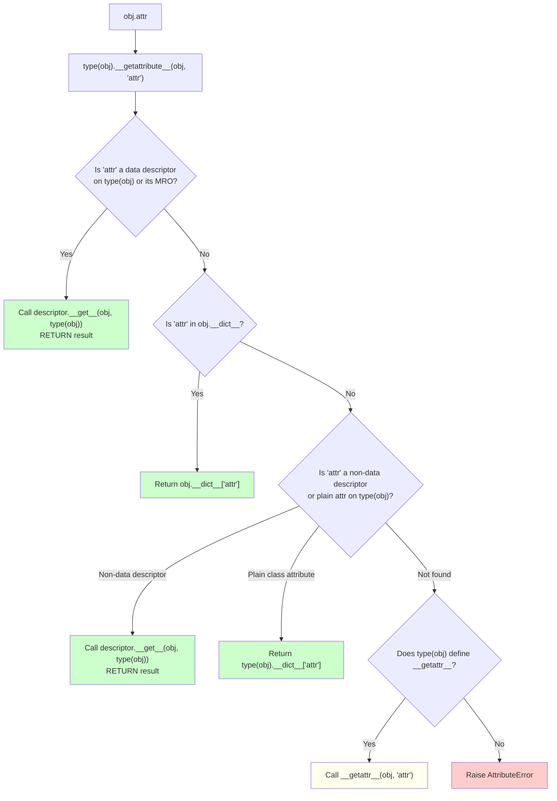

# 1. `__dict__` and Attribute Access

> [!note] Why this note exists
> Every Python object you create with `class` exposes a special attribute called `__dict__` — a plain `dict` that stores the instance's writable attributes. The class itself has its own `__dict__`. Modules have `__dict__`. Even functions have `__dict__` (which is how you attach arbitrary metadata to them). This single mechanism is what makes Python's attribute model *dynamic*: you can add, read, rename, and delete attributes at runtime without recompiling anything. Understanding `__dict__` is the prerequisite for understanding `getattr`/`setattr`/`hasattr` (see [[2. getattr, setattr, hasattr]]), descriptors (see [[5. Descriptors]] and [[18. Advanced OOP/5. Descriptors Deep Dive|Descriptors Deep Dive]]), `__slots__` (which *removes* `__dict__` to save memory), and metaclasses (see [[4. Metaclasses]]). Without `__dict__`, none of Python's metaprogramming machinery would work. This note covers the storage layer; the access layer is covered in the next two notes.

## Why It Matters

The `__dict__` is the storage substrate for almost every Python object that has attributes. Knowing it lets you:

- **Predict attribute lookup.** When you write `obj.x`, you should know exactly which dictionary (or slot) is consulted, in what order, and why.
- **Serialise objects.** Pickle, `dataclasses.asdict`, `pydantic.model_dump`, Marshmallow, and the stdlib `copy` module all read (or write) `__dict__` directly to capture instance state.
- **Build ORMs and serializers.** Django, SQLAlchemy, and Pydantic all manipulate `__dict__` (or `__slots__`) to set field values from database rows or JSON.
- **Debug "where did this attribute come from?"** When `obj.foo` returns something unexpected, the answer is in `type(obj).__dict__`, `obj.__dict__`, the MRO, or a descriptor.
- **Optimise memory.** Each `__dict__` costs ~200 bytes plus per-key overhead. For a million small objects, switching to `__slots__` (or `@dataclass(slots=True)` in 3.10+) saves hundreds of megabytes.
- **Implement proxies.** Wrapping another object and forwarding attribute access (e.g., `unittest.mock.Mock`, `weakref.proxy`, lazy-loading ORM relations) requires reading and writing the target's `__dict__` via `object.__getattribute__`.
- **Inspect code.** `inspect.getmembers`, `dir()`, IDE autocompletion, and `dataclasses.fields` all rely on the type's `__dict__` and the MRO to discover attributes.
- **Understand metaclasses.** A class is itself an instance of its metaclass; the class's `__dict__` is consulted when you write `ClassName.attr`.

If you've ever wondered why `obj.x = 5` works but `obj.x.y = 5` doesn't (sometimes), or why `class C: x = []` causes every instance to share `x`, or why modifying `__dict__` directly is sometimes the only way — this note answers all of that.

## Background

### Every namespace is a `dict`

Python has exactly one mechanism for storing named bindings: the dictionary. Module globals — `dict`. Class body namespace — `dict`. Instance attributes — `dict`. Function locals during execution — `dict` (well, a `FrameObject` with `f_locals`, which is exposed as a `dict`). Even `globals()` and `locals()` return plain `dict` objects.

This is not a coincidence. The dict is the central data structure of CPython — it's been heavily optimised (compact dicts since 3.6, see [PEP 468](https://peps.python.org/pep-0468/) and [Bret Cannon's writeup](https://snarky.ca/how-python-dicts-work/)), and the bytecode compiler emits `STORE_NAME` / `LOAD_NAME` opcodes that operate directly on dict-like namespaces.

When you write:

```python
class Point:
    origin = (0, 0)
    def __init__(self, x, y):
        self.x = x
        self.y = y
```

Three dicts are involved:

1. The **class body namespace** (the dict the compiler builds while executing `class Point:` body) — contains `origin` and `__init__`.
2. The **class `__dict__`** (the type's namespace, an instance of `mappingproxy`) — same contents as #1, but wrapped in a read-only proxy.
3. The **instance `__dict__`** — created on first attribute assignment to `self`, contains `x` and `y` per instance.

### `__dict__` is per-instance, not per-class

```python
p1 = Point(1, 2)
p2 = Point(3, 4)
print(p1.__dict__)   # {'x': 1, 'y': 2}
print(p2.__dict__)   # {'x': 3, 'y': 4}
print(Point.__dict__['origin'])  # (0, 0)
```

`p1` and `p2` have *separate* `__dict__` dicts. They both share `Point.__dict__` — that's where `origin` and `__init__` live. This is why class attributes are shared across instances, while instance attributes are not.

### `mappingproxy`: the class dict's bodyguard

Try this:

```python
Point.__dict__['origin'] = (5, 5)
# TypeError: 'mappingproxy' object does not support item assignment
```

You can't mutate the class `__dict__` directly. You have to go through `setattr` (or `setattr(Point, 'origin', (5, 5))`, or just `Point.origin = (5, 5)`). Why? Because the type's `__dict__` is wrapped in a `mappingproxy` — a read-only view that forces all mutations through `type.__setattr__`, which performs necessary bookkeeping (invalidating attribute caches, updating `__subclasses__`, firing descriptors, etc.).

The instance `__dict__`, by contrast, is a plain writable `dict`:

```python
p1.__dict__['x'] = 999
print(p1.x)   # 999
```

This works — but bypasses `__setattr__` and descriptors, which is sometimes what you want (inside `__init__` of a `__slots__` class, or in `object.__reduce_ex` for pickling) and sometimes a footgun (skipping validation in `@property` setters).

### `vars()` is `__dict__` with a friendlier face

`vars(obj)` returns `obj.__dict__`. With no argument, `vars()` returns `locals()`. The function exists because `__dict__` looks like a private dunder, but reading an object's namespace is a perfectly normal thing to do:

```python
vars(p1)            # {'x': 1, 'y': 2}
vars(p1)['z'] = 3   # works — same as p1.z = 3 (when no descriptors involved)
vars(Point)         # mappingproxy({...})
```

> [!tip]
> `vars(obj)` is preferred over `obj.__dict__` in idiomatic code — it's the public API. But note that `vars()` returns *the same object* as `__dict__`, so mutations to one affect the other.

## Main content

### The attribute lookup chain

When you write `obj.attr`, CPython's `LOAD_ATTR` bytecode (or `obj.attr` in source) calls `type(obj).__getattribute__(obj, 'attr')`. The default `object.__getattribute__` walks a precise chain:



The chain, in plain English:

1. **Data descriptors on the type** (those defining `__set__` or `__delete__`) win. `property` is a data descriptor; so is any custom descriptor with `__set__`. These take priority over *everything*, including instance `__dict__`. This is why you can't "override" a `property` by setting an instance attribute with the same name.
2. **Instance `__dict__`**. If the attribute is here, return it. This is where most user attributes live.
3. **Non-data descriptors and plain class attributes** (functions, `classmethod`, `staticmethod`, plain values on the class). Functions are non-data descriptors — they only define `__get__`, which returns a bound method when accessed via an instance.
4. **`__getattr__`**. If nothing matched, and the type defines `__getattr__`, it's called as the fallback. This is how `unittest.mock.Mock`, `argparse.Namespace`, and lazy-loading ORM relations work.
5. **`AttributeError`**. If no fallback exists, the lookup fails.

`__setattr__` is simpler: the default `object.__setattr__` first checks for a data descriptor with `__set__` on the type; if found, calls it. Otherwise, it writes to `obj.__dict__[name] = value`. (Or, for `__slots__` classes, to the slot.)

### Class `__dict__` vs instance `__dict__`

```python
class Counter:
    total = 0  # class attribute — lives in Counter.__dict__

    def __init__(self, name):
        self.name = name  # instance attribute — lives in self.__dict__
        self.count = 0

    def increment(self):
        self.count += 1
        Counter.total += 1   # mutates the class attribute

c1 = Counter("a")
c2 = Counter("b")
c1.increment(); c1.increment()
c2.increment()

print(c1.__dict__)    # {'name': 'a', 'count': 2}
print(c2.__dict__)    # {'name': 'b', 'count': 1}
print(Counter.__dict__['total'])  # 3 — shared
print(c1.total, c2.total)         # 3 3 — both see the class attr
```

The instance `__dict__` stores per-instance state; the class `__dict__` stores methods and class-level data shared by all instances. Reads consult both (instance first if no data descriptor, then class). Writes to `self.foo` go to instance `__dict__`; writes to `ClassName.foo` go to class `__dict__`.

> [!warning]
> A common beginner mistake is to write `class C: items = []` and then `self.items.append(x)` in a method, expecting each instance to have its own list. They don't — they all share the *same* class-level list. The fix is to initialise `self.items = []` in `__init__`.

### Modifying `__dict__` directly

You can mutate the instance `__dict__` directly. This bypasses `__setattr__`, descriptors, and any validation:

```python
class Temperature:
    _absolute_zero = -273.15

    def __init__(self, celsius):
        self.celsius = celsius  # goes through __setattr__

    @property
    def celsius(self):
        return self._celsius

    @celsius.setter
    def celsius(self, value):
        if value < self._absolute_zero:
            raise ValueError("Below absolute zero")
        self._celsius = value

t = Temperature(20)
t.__dict__['celsius'] = -500   # bypasses the property!
print(t.celsius)               # -500 (the property's getter returns _celsius, but we set celsius)
# Wait — actually, since 'celsius' is a property (a data descriptor on the class),
# it ALWAYS wins. So t.celsius (read) goes through the getter, returning self._celsius.
# The __dict__['celsius'] = -500 entry is unreachable!
print(t.__dict__)  # {'_celsius': 20, 'celsius': -500}  ← shadowed, never read
```

This is a subtle point: a data descriptor on the type wins over the instance `__dict__` on *both* reads and writes. The line `t.__dict__['celsius'] = -500` writes into the instance dict, but that key is *shadowed* by the descriptor on the type and is never read back. The lesson: don't manually put keys into `__dict__` that match a property name.

When is direct `__dict__` mutation legitimate?

- Inside `__setattr__` overrides to avoid infinite recursion: `self.__dict__['x'] = value` instead of `self.x = value`.
- Inside `__init__` of a `__slots__`-less class where descriptors don't apply.
- In ORM `__init__` code to set state without triggering validators.
- In `pickle` and `copy` to restore state.

The safer alternative is `object.__setattr__(self, 'x', value)`, which avoids the `__setattr__` override but still respects descriptors.

### `__slots__` removes `__dict__`

A class with `__slots__` defined has no `__dict__`:

```python
class Point:
    __slots__ = ('x', 'y')
    def __init__(self, x, y):
        self.x = x
        self.y = y

p = Point(1, 2)
print(p.__dict__)  # AttributeError: 'Point' object has no attribute '__dict__'
```

Instead, slot attributes are stored as C-level struct fields at fixed offsets in the instance — like a C struct. This:

- Saves memory (~200 bytes per instance for the dict, plus per-key overhead).
- Speeds up attribute access (no dict lookup, no hash).
- Prevents adding arbitrary attributes (a feature or a bug, depending on your view).

`@dataclass(slots=True)` (Python 3.10+) generates `__slots__` automatically — see [[18. Advanced OOP/4. Dataclasses|Dataclasses]].

> [!note]
> Subclasses must *also* define `__slots__` to keep the savings — otherwise the subclass gets a `__dict__` again. The only exception is when the subclass doesn't add any new attributes; but even then, a `__dict__` is added unless `__slots__ = ()` is explicitly declared.

### `__dict__` on functions, modules, and classes

Functions have a `__dict__` for attaching arbitrary metadata:

```python
def f(): pass
f.custom_metadata = "hello"
print(f.__dict__)  # {'custom_metadata': 'hello'}
```

This is how `@functools.wraps` (see [[10. Pythonic Programming/4. Decorators Deep Dive|Decorators Deep Dive]]) stores `__wrapped__`, how `@functools.lru_cache` stores cache info, and how `@pytest.mark.foo` stores marks on test functions.

Modules have a `__dict__` too — that's where their globals live:

```python
import math
print(type(math.__dict__))  # <class 'dict'>
print('pi' in math.__dict__)  # True
```

Classes have a `__dict__` (wrapped in `mappingproxy`):

```python
print(type(Point.__dict__))  # <class 'mappingproxy'>
```

The `mappingproxy` is a read-only view — mutations must go through `setattr(cls, name, value)`.

### Module-level `__dict__` tricks

```python
# Inspecting what a module exports
import some_module
public = [k for k in some_module.__dict__ if not k.startswith('_')]

# Adding attributes to a module at runtime
import sys
sys.modules[__name__].dynamic_attr = "added at runtime"
```

The latter is occasionally useful for plugin systems where modules register themselves.

### `__dict__` and pickling

Pickle's default protocol pickles an object's `__dict__`:

```python
import pickle
class C:
    def __init__(self, x): self.x = x
c = C(5)
data = pickle.dumps(c)
# The pickled bytes encode {'x': 5} plus class reference info
c2 = pickle.loads(data)
print(c2.__dict__)  # {'x': 5}
```

Classes with `__slots__` need a `__getstate__`/`__setstate__` pair, because there's no `__dict__` to pickle automatically — see [[5. Error Handling/4. Context Managers|Context Managers]] for the pickle/copy protocol.

### Inspecting `__dict__` for debugging

```python
def dump(obj, label=""):
    print(f"=== {label or type(obj).__name__} ===")
    print("  instance __dict__:", vars(obj) if hasattr(obj, '__dict__') else "<no __dict__>")
    print("  type __dict__ keys:", list(type(obj).__dict__.keys()))
    print("  MRO:", [c.__name__ for c in type(obj).__mro__])
```

This is a useful debugging tool when an attribute is unexpectedly missing or returning a wrong value.

## Common Pitfalls

1. **Forgetting that `__dict__` doesn't exist for `__slots__` classes.** Code that does `obj.__dict__.items()` will crash. Use `inspect.getmembers` or check `hasattr(obj, '__dict__')` first.

2. **Trying to mutate `mappingproxy` directly.** `SomeClass.__dict__['x'] = 1` raises `TypeError`. Use `setattr(SomeClass, 'x', 1)` or `SomeClass.x = 1`.

3. **Storing mutable class attributes that get shared across instances.** `class C: items = []` — every instance shares the same list. Initialise in `__init__` instead.

4. **Bypassing properties by writing to `__dict__` with the same name.** Data descriptors on the type shadow instance dict entries, so the value you write is unreachable. (For non-data descriptors, the instance dict wins — but that's also a footgun if you don't intend it.)

5. **Modifying `__dict__` inside `__setattr__` and forgetting about subclasses.** If a subclass adds a `__slots__` or overrides `__setattr__`, the direct dict write may go to the wrong place or fail.

6. **Assuming `__dict__` captures all instance state.** For `__slots__` classes, state is in the slots. For objects with `__getstate__`, the state may be transformed. Use `obj.__reduce_ex__(4)` for the canonical picklable state.

7. **Expecting `vars(obj)` to be a copy.** It returns the actual `__dict__` — mutations to the returned dict affect the object. If you want a copy, use `dict(vars(obj))`.

8. **Confusing instance `__dict__` with class `__dict__`.** `obj.__dict__` is per-instance; `type(obj).__dict__` is shared. Mutations to the latter affect all instances.

9. **Forgetting that built-in types like `int`, `str`, `list` have no per-instance `__dict__`.** `(5).__dict__` raises `AttributeError`. Only user-defined classes (and certain extension types with `tp_dictoffset`) have one.

10. **Believing `__dict__` order is "random".** Since Python 3.7, dicts preserve insertion order — and so does `__dict__`. The order matches the order in which attributes were first assigned.

11. **Trying to `pickle` an object whose `__dict__` contains non-picklable items** (file handles, locks, lambdas). Override `__getstate__` to filter them out.

12. **Using `__dict__` as a public API.** `obj.__dict__['x']` is not the same as `obj.x` when descriptors are involved. Use `getattr`/`setattr` for the public interface.

13. **Forgetting that `del obj.x` removes the key from `obj.__dict__`** (or the slot). Subsequent reads raise `AttributeError` unless a class attribute or `__getattr__` provides a fallback.

14. **Expecting `__dict__` to be cheap.** Each instance dict is ~200 bytes plus ~100 bytes per key. For a million small objects, this is hundreds of MB — switch to `__slots__`.

15. **Modifying `globals()` (the module `__dict__`) at runtime.** It works, but it's confusing, defeats static analysis, and makes test coverage harder. Use a real dict instead.

## Tips and Tricks

- **`vars(obj)` is the idiomatic way to read the instance namespace.** Prefer it over `obj.__dict__`.
- **`dict(vars(obj))` makes a shallow copy** — useful for serialisation without side effects.
- **`type(obj).__dict__` is a `mappingproxy`** — read it freely, but mutate via `setattr`.
- **Inspecting the MRO's `__dict__` chain:**
  ```python
  for klass in type(obj).__mro__:
      if 'attr' in vars(klass):
          print(f"found on {klass.__name__}")
          break
  ```
- **Use `__dict__.update(other)` to bulk-set attributes** — common in ORM `from_dict` methods:
  ```python
  def from_dict(self, data):
      self.__dict__.update(data)  # bypasses __setattr__; only safe if no descriptors
  ```
  Prefer:
  ```python
  for k, v in data.items():
      setattr(self, k, v)
  ```
- **`__dict__` preserves insertion order since 3.7** — useful for deterministic serialisation.
- **`@dataclass` generates a `__dict__` by default.** Use `slots=True` (3.10+) for memory-efficient immutable-ish data.
- **`__slots__ = ()` on a base class** makes it impossible to add per-instance attributes — useful for marker base classes (e.g., mixins, see [[18. Advanced OOP/3. Mixins|Mixins]]).
- **`hasattr(obj, '__dict__')` is the cheap test** for "can this object hold arbitrary attributes?"
- **`inspect.getmembers(obj)` walks `__dict__` and the MRO** — preferred over manually iterating `dir()`.
- **For proxies, use `object.__getattribute__(target, name)` to bypass the proxy's own `__getattribute__`.**
- **For deep copies, `copy.deepcopy` uses `__dict__` (or `__reduce_ex__`)** — override `__deepcopy__` for custom behaviour.
- **For frozen dataclasses, `__dict__` still exists** unless you also use `slots=True`. `frozen=True` just makes `__setattr__` raise `FrozenInstanceError` — direct `__dict__` mutation still works (don't do it).
- **`sys.modules[__name__].__dict__` is the module's globals** — useful in plugin registration patterns.
- **`inspect.getattr_static(obj, name)` performs lookup *without* invoking descriptors** — useful for inspecting raw class attributes.
- **For metaclasses, the class's `__dict__` is built *during* `__prepare__`** — see [[4. Metaclasses]].

## Active Recall

1. What does `obj.__dict__` return? When does it not exist?
2. What is the difference between `vars(obj)` and `obj.__dict__`?
3. What is a `mappingproxy`? Why does the class `__dict__` use one but the instance `__dict__` doesn't?
4. Describe the attribute lookup chain in order — where do data descriptors, instance `__dict__`, non-data descriptors, and `__getattr__` fit?
5. Why can't you "override" a property by setting an instance attribute with the same name?
6. What happens if you do `obj.__dict__['celsius'] = -500` when `celsius` is a `@property` on the class?
7. How does `__slots__` change the instance's storage? How much memory does it save?
8. What happens if a subclass of a `__slots__` class doesn't declare `__slots__`?
9. Why do functions have a `__dict__`? Name one stdlib feature that uses it.
10. What does `type(SomeClass.__dict__)` return? Why?
11. How would you bulk-set attributes from a dict while respecting `__setattr__`? While bypassing it?
12. Why is `class C: items = []` a bug? How do you fix it?
13. Does `obj.__dict__` preserve insertion order? Since when?
14. How does pickle use `__dict__`? What happens for `__slots__` classes?
15. Why might `inspect.getattr_static` be useful when debugging attribute lookup?
16. Write a function `dump_attrs(obj)` that prints every attribute on the instance and class, with the class it was defined on.
17. How would you write a `__setattr__` override that allows certain attribute names but rejects others, without infinite recursion?
18. What's the relationship between `LOAD_ATTR` bytecode and `type(obj).__getattribute__`?
19. How does `@dataclass(slots=True)` interact with `__dict__`?
20. If `Counter.total` is a class attribute and `c1.total = 5` is executed on an instance, what's in `c1.__dict__` and what's in `Counter.__dict__`?

## Next Steps

- [[2. getattr, setattr, hasattr]] — the programmatic API on top of `__dict__`.
- [[3. type and Dynamic Class Creation]] — how `type` builds the class `__dict__` in the first place.
- [[4. Metaclasses]] — customising class creation, including `__prepare__` which returns the dict used as the class namespace.
- [[5. Descriptors]] — the protocol that lets `property` and methods work; data vs non-data descriptors and their priority over `__dict__`.
- [[18. Advanced OOP/5. Descriptors Deep Dive|Descriptors Deep Dive]] — real-world descriptor patterns including Django fields and SQLAlchemy columns.
- [[18. Advanced OOP/4. Dataclasses|Dataclasses]] — `@dataclass` generates `__init__` that writes to `__dict__` (or slots).
- [[16. Python Internals/4. The Object Model|The Object Model]] — the C-level view of `__dict__` via `tp_dictoffset`.
- [[8. Object-Oriented Programming/5. Encapsulation and Properties|Encapsulation and Properties]] — `@property` as a data descriptor.
