# 2. `getattr`, `setattr`, `hasattr`

> [!note] Why this note exists
> The built-in functions `getattr`, `setattr`, `hasattr`, and `delattr` are the *programmatic* API for attribute access — they take the attribute name as a string, which means you can do dynamically what `obj.x` does statically. This is the bedrock of every serialiser, ORM, plugin loader, configuration system, RPC framework, and `unittest.mock.Mock` ever written. Beyond the four built-ins, this note covers the two dunder methods that control attribute access — `__getattr__` (the fallback for missing attributes) and `__getattribute__` (the primary hook for *every* access) — plus `__setattr__` and `__delattr__`. The interplay between these hooks, descriptors (see [[5. Descriptors]]), and `__dict__` (see [[1. dict and Attribute Access]]) is one of the most subtle areas of Python's object model. Getting it wrong leads to infinite recursion, broken pickling, and silent bugs in mocks. This note exists to give you a precise mental model of the access pipeline so you can implement proxies, lazy loaders, validators, and dynamic namespaces correctly.

## Why It Matters

The `getattr` family is what makes Python's metaprogramming practical instead of theoretical. Knowing it lets you:

- **Build dynamic dispatchers.** `getattr(handler, f"on_{event_type}")(event)` is how web frameworks route HTTP methods to handler methods, how state machines dispatch events, and how CLI tools route subcommands to methods.
- **Implement generic serialisers.** `getattr(obj, field_name)` for each field is how `dataclasses.asdict`, Marshmallow, and Pydantic collect state; `setattr(obj, field_name, value)` is how they hydrate objects from JSON.
- **Build lazy-loading attributes.** `__getattr__` returning a computed value on first access is how Django loads related ORM objects, how `argparse.Namespace` exposes defaults, and how `unittest.mock.MagicMock` auto-creates attributes on demand.
- **Build proxies and decorators.** A `LoggingProxy` that wraps another object forwards every attribute access via `getattr(target, name)` while logging — the same pattern as `unittest.mock.Mock(wraps=obj)`.
- **Implement configuration objects.** `cfg.server.host` is friendlier than `cfg['server']['host']` — implement with `__getattr__` over a nested dict.
- **Build validators.** Override `__setattr__` to enforce types, ranges, or immutability — this is what `@dataclass(frozen=True)` and Pydantic do internally.
- **Avoid `eval` and `exec`.** Anything you might be tempted to do with `eval('obj.' + name)` should be done with `getattr(obj, name)`. It's safer, faster, and lintable.
- **Understand mocking.** `unittest.mock.Mock`'s "any attribute access creates a new Mock" behaviour is a `__getattr__` returning `self._mock_children[name]`.

Beyond the practical, `getattr`/`setattr` are the *vocabulary* of every Python metaprogramming tutorial. If you can't read code that uses them fluently, you can't read the stdlib, Django, Flask, SQLAlchemy, or Pytest.

## Background

### The four built-ins, in one breath

| Function | Equivalent syntax | Returns | Raises |
|---|---|---|---|
| `getattr(obj, name)` | `obj.name` | the attribute value | `AttributeError` if missing |
| `getattr(obj, name, default)` | (no equivalent) | the value or `default` | never |
| `setattr(obj, name, value)` | `obj.name = value` | `None` | (rarely) `AttributeError` |
| `hasattr(obj, name)` | `try: obj.name; except AttributeError` | `bool` | never |
| `delattr(obj, name)` | `del obj.name` | `None` | `AttributeError` if missing |

`getattr` and `setattr` are not "stringly-typed" versions of dot access — they *are* the implementation. `obj.x` compiles to `LOAD_ATTR` bytecode that ultimately calls `type(obj).__getattribute__(obj, 'x')`. The built-in `getattr(obj, 'x')` calls the same method. There is no separate code path.

### Why `hasattr` is dangerous

```python
class LazyLoader:
    @property
    def expensive(self):
        return compute()  # might raise

obj = LazyLoader()
print(hasattr(obj, 'expensive'))   # False if compute() raises *any* exception!
```

`hasattr(obj, name)` is implemented as:

```python
def hasattr(obj, name):
    try:
        getattr(obj, name)
        return True
    except Exception:  # actually AttributeError in Py2; ANY exception in Py3
        return False
```

In Python 3 (since 3.0), `hasattr` catches *any* exception, not just `AttributeError`. If the property raises `ValueError`, `RuntimeError`, or anything else, `hasattr` swallows it and returns `False`. This masks bugs. Prefer:

```python
try:
    value = getattr(obj, 'expensive')
except AttributeError:
    value = None
# Other exceptions propagate naturally.
```

> [!warning]
> Python 2's `hasattr` only caught `AttributeError`. Python 3 broadened it to all exceptions — a deliberate change to avoid masking bugs that *should* propagate. But it means `hasattr` on a property that raises is silently wrong.

### `getattr` with a default vs try/except

Both work; which is more idiomatic depends on context:

```python
# Pattern A: default
name = getattr(user, 'name', 'anonymous')

# Pattern B: try/except
try:
    name = user.name
except AttributeError:
    name = 'anonymous'
```

Pattern A is shorter and clearer when the default is a constant. Pattern B is better when the default is expensive to compute, or when you want to distinguish "missing" from "explicitly None" — both `getattr(obj, 'x', None)` patterns collapse `obj.x is None` and `obj has no x` into the same case.

For EAFP vs LBYL discussion of attribute access, see [[10. Pythonic Programming/7. EAFP and Duck Typing|EAFP and Duck Typing]].

## Main content

### `getattr(obj, name, default)`

The single most useful function in the entire metaprogramming toolkit. Examples:

```python
# Dispatch based on event name
class Handler:
    def on_click(self, e): ...
    def on_submit(self, e): ...

handler = Handler()
event_type = 'click'
method = getattr(handler, f'on_{event_type}', None)
if method is None:
    raise ValueError(f"No handler for {event_type}")
method(event)

# Read configuration with defaults
host = getattr(config, 'host', 'localhost')
port = getattr(config, 'port', 8080)

# Convert string to attribute access (avoiding eval)
def deep_getattr(obj, dotted):
    for part in dotted.split('.'):
        obj = getattr(obj, part)
    return obj

print(deep_getattr(request, 'user.profile.avatar_url'))
```

The `default` argument, when supplied, suppresses `AttributeError`. Note that `default` is *evaluated eagerly* — if it's an expensive call, compute it lazily:

```python
# Wrong — compute_default() runs even when 'x' exists
val = getattr(obj, 'x', compute_default())

# Right — compute only on miss
val = getattr(obj, 'x', None)
if val is None:
    val = compute_default()
```

(Or use the try/except form.)

### `setattr(obj, name, value)`

```python
setattr(obj, 'name', value)  # equivalent to obj.name = value

# Bulk hydration from dict
for field, value in data.items():
    setattr(record, field, value)

# Dynamic attribute creation
for i, name in enumerate(['red', 'green', 'blue']):
    setattr(palette, name, i)
```

`setattr` goes through `type(obj).__setattr__(obj, name, value)`. The default `object.__setattr__`:

1. Looks for a data descriptor with `__set__` on the type (and MRO). If found, calls `descriptor.__set__(obj, value)`.
2. Otherwise, writes `obj.__dict__[name] = value` — unless the class has `__slots__`, in which case it writes to the slot.

A custom `__setattr__` can intercept this — see "Implementing `__setattr__`" below.

### `hasattr(obj, name)`

```python
if hasattr(obj, 'close'):
    obj.close()
```

Note the danger above: `hasattr` swallows non-`AttributeError` exceptions. Safer:

```python
if callable(getattr(obj, 'close', None)):
    obj.close()
```

Or use the try/except EAFP pattern. For more on when EAFP beats LBYL, see [[10. Pythonic Programming/7. EAFP and Duck Typing|EAFP and Duck Typing]].

### `delattr(obj, name)`

```python
delattr(obj, 'name')  # equivalent to del obj.name
```

Removes the attribute from `obj.__dict__` (or the slot, for `__slots__` classes). Calls `type(obj).__delattr__(obj, name)`, which first checks for a data descriptor with `__delete__` on the type. Raises `AttributeError` if the attribute doesn't exist.

### `__getattr__` vs `__getattribute__`

These two dunders are the source of much confusion. The difference:

| Hook | When called | Use case |
|---|---|---|
| `__getattribute__(self, name)` | On **every** attribute access | Proxies, full interception |
| `__getattr__(self, name)` | Only when **normal lookup fails** | Lazy attrs, defaults, dynamic namespaces |

`__getattribute__` is called first. If it succeeds (after consulting descriptors and `__dict__`), `__getattr__` is never called. If `__getattribute__` raises `AttributeError`, Python catches it and calls `__getattr__` as a fallback.

```mermaid
flowchart TD
    A["obj.attr"] --> B["type(obj).__getattribute__(obj, 'attr')"]
    B --> C{"Data descriptor on type?"}
    C -- "Yes" --> D["descriptor.__get__(obj, type(obj))"]
    C -- "No" --> E["Look in obj.__dict__"]
    E -- "Found" --> F["Return value"]
    E -- "Not found" --> G["Look in type's MRO"]
    G -- "Found" --> H["Return (non-data descriptor __get__ or plain value)"]
    G -- "Not found" --> I["Raise AttributeError"]
    I --> J["type(obj).__getattr__(obj, 'attr')"]
    J -- "Returns value" --> K["Return value"]
    J -- "Raises AttributeError" --> L["Re-raise AttributeError"]
    style D fill:#cfc
    style F fill:#cfc
    style H fill:#cfc
    style K fill:#cfc
    style L fill:#fcc
```



#### When to use `__getattr__` (lazy attributes)

```python
class LazyConfig:
    def __init__(self, source):
        self._source = source

    def __getattr__(self, name):
        # Only called when normal lookup fails
        if name in self._source:
            value = self._source[name]
            setattr(self, name, value)  # cache for next time
            return value
        raise AttributeError(f"No configuration: {name}")

cfg = LazyConfig({'host': 'localhost', 'port': 8080})
print(cfg.host)   # First access: __getattr__ → loads, caches, returns
print(cfg.host)   # Second access: direct __dict__ hit (no __getattr__)
```

`__getattr__` is *cheap* on hits — it's only invoked on misses, so adding it to a class has no performance impact on existing attribute reads. This is the pattern used by `argparse.Namespace`, `unittest.mock.Mock`, and Django's `QuerySet` for lazy ORM relations.

#### When to use `__getattribute__` (proxies)

```python
class LoggingProxy:
    def __init__(self, target):
        object.__setattr__(self, '_target', target)  # avoid our own __setattr__

    def __getattribute__(self, name):
        target = object.__getattribute__(self, '_target')
        print(f"access: {name}")
        return getattr(target, name)

    def __setattr__(self, name, value):
        target = object.__getattribute__(self, '_target')
        print(f"set: {name} = {value!r}")
        setattr(target, name, value)

proxy = LoggingProxy(some_object)
proxy.x  # logs "access: x"
proxy.y = 5  # logs "set: y = 5"
```

`__getattribute__` is called for *every* access — including `self._target` inside `__getattribute__` itself! That's why we use `object.__getattribute__(self, '_target')` to break the recursion. This is the single most common metaprogramming bug.

> [!warning]
> Inside `__getattribute__`, *every* `self.x` triggers `__getattribute__` again. Use `object.__getattribute__(self, 'x')` to access attributes without recursion. The same applies to `__setattr__` (use `object.__setattr__`) and `__delattr__` (use `object.__delattr__`).

### Implementing `__setattr__`

```python
class Validated:
    __slots__ = ('_data',)
    _allowed = {'name', 'age', 'email'}

    def __init__(self):
        object.__setattr__(self, '_data', {})

    def __setattr__(self, name, value):
        if name.startswith('_'):
            object.__setattr__(self, name, value)
            return
        if name not in self._allowed:
            raise AttributeError(f"Cannot set {name!r}")
        self._data[name] = value

    def __getattr__(self, name):
        try:
            return self._data[name]
        except KeyError:
            raise AttributeError(name) from None

v = Validated()
v.name = 'Alice'   # OK
v.age = 30         # OK
v.unknown = 'x'    # AttributeError
print(v.name)      # 'Alice' via __getattr__
```

Note: storing data in `_data` (rather than in `__dict__` directly) means reads go through `__getattr__` (since the data isn't in `__dict__`). This is the pattern used by Pydantic v1 and many ORM models.

For comparison, `@dataclass(frozen=True)` sets `__setattr__ = object.__setattr__`-wrapper that raises `FrozenInstanceError`. See [[18. Advanced OOP/4. Dataclasses|Dataclasses]].

### `__delattr__`

```python
class Tracked:
    def __delattr__(self, name):
        print(f"deleting {name}")
        object.__delattr__(self, name)
```

Often forgotten — if you override `__setattr__`, you usually want `__delattr__` too, otherwise `del obj.x` skips your logic.

### Infinite recursion pitfalls

The classic three:

```python
# Pitfall 1: __getattribute__ recursion
class Bad:
    def __getattribute__(self, name):
        return self._cache[name]   # self._cache → __getattribute__ → self._cache → ...

# Fix:
class Good:
    def __getattribute__(self, name):
        cache = object.__getattribute__(self, '_cache')
        return cache[name]

# Pitfall 2: __setattr__ recursion
class Bad2:
    def __setattr__(self, name, value):
        self._dirty = True   # self._dirty → __setattr__ → self._dirty → ...
        object.__setattr__(self, name, value)

# Fix:
class Good2:
    def __setattr__(self, name, value):
        object.__setattr__(self, '_dirty', True)
        object.__setattr__(self, name, value)

# Pitfall 3: __init__ recursion via setattr
class Bad3:
    def __init__(self):
        self.x = 0   # If __setattr__ calls __init__... but normally it doesn't.
```

The fix in all cases: use `object.__getattribute__`, `object.__setattr__`, `object.__delattr__` to bypass your own overrides.

### `__getattr__` and pickling

`pickle` checks for `__setstate__`, `__reduce_ex__`, etc. If your `__getattr__` returns a value for *every* name (e.g., `Mock`'s behaviour), pickle may get confused. The fix: raise `AttributeError` for dunder names:

```python
class Dynamic:
    def __getattr__(self, name):
        if name.startswith('__') and name.endswith('__'):
            raise AttributeError(name)  # let dunders fall through normally
        return self._compute(name)
```

### Performance notes

- `getattr(obj, 'x')` is marginally slower than `obj.x` (extra function call), but the bytecode path is the same.
- `hasattr` is *two* operations (getattr + exception check). Don't use it in hot loops; use try/except or precompute.
- `__getattr__` is free on hits — Python only calls it when normal lookup fails.
- `__getattribute__` is called on *every* access — adding it can slow down attribute reads by 2-5×. Only use it when you genuinely need full interception (proxies).

### Attribute access flow (full sequence)


## Common Pitfalls

1. **`hasattr` swallows non-`AttributeError` exceptions.** A property that raises `ValueError` makes `hasattr(obj, 'x')` return `False`, masking the bug.

2. **Infinite recursion in `__getattribute__`.** Any `self.x` inside `__getattribute__` recurses. Use `object.__getattribute__(self, 'x')`.

3. **Infinite recursion in `__setattr__`.** Any `self.x = ...` inside `__setattr__` recurses. Use `object.__setattr__(self, 'x', value)`.

4. **Confusing `__getattr__` and `__getattribute__`.** `__getattr__` is the fallback (miss only); `__getattribute__` is the primary (every access). Picking the wrong one leads to either too many calls or no effect.

5. **Forgetting `__delattr__` when overriding `__setattr__`.** `del obj.x` will bypass your logic.

6. **Eager defaults.** `getattr(obj, 'x', expensive())` evaluates `expensive()` even if `x` exists. Use try/except or lazy patterns.

7. **Using `getattr` for dunder dispatch.** `getattr(obj, '__len__')()` works but is unidiomatic — use `len(obj)`. Dunders are protocol methods, not regular attributes.

8. **`setattr` on built-in types.** `setattr(5, 'x', 1)` raises `AttributeError` — you can't add attributes to ints, strings, tuples, etc. (Their `tp_dictoffset` is 0.)

9. **`__getattr__` returning a value for dunder names breaks pickling, copy, and deepcopy.** Always raise `AttributeError` for `__dunder__` names you don't explicitly handle.

10. **`hasattr` on a property with side effects.** It calls the property, triggering the side effect. If the property loads from DB, you've just hit the DB to check existence.

11. **Modifying `__dict__` directly instead of using `setattr`.** Skips descriptors and `__setattr__`. Bypasses validation. Use `setattr` unless you have a specific reason.

12. **Catching `AttributeError` too broadly.** `try: x = obj.y; except AttributeError: ...` will also catch `AttributeError` raised *inside* `obj.y` (e.g., a property that internally does `obj.z` and `z` is missing). Use a sentinel default if you need precise semantics.

13. **Forgetting that `__getattr__` is not called for `__dunder__` methods on instances.** `len(obj)` calls `type(obj).__len__(obj)`, not `obj.__len__` — so `__getattr__` returning a `__len__` function won't make `len(obj)` work. This is a deliberate design choice: dunders are looked up on the type, not the instance, for performance and consistency.

14. **`__getattribute__` raising non-`AttributeError` exceptions.** If your `__getattribute__` raises `ValueError`, Python does *not* fall through to `__getattr__` — the exception propagates. Only `AttributeError` triggers the fallback.

15. **`getattr` on `None`.** `getattr(None, 'x', default)` works (returns default), but `None.x` raises. The two are equivalent in this case, but using `getattr` on potentially-`None` values is a code smell — consider an explicit `if obj is not None` instead.

## Tips and Tricks

- **`getattr(handler, f'on_{event}', None)` is the standard event-dispatch pattern.** Pair with `if callable(method): method(event)`.
- **`setattr` for bulk hydration:**
  ```python
  for k, v in data.items():
      if k in allowed_fields:
          setattr(obj, k, v)
  ```
- **`delattr` is rarely used directly** — `del obj.x` is more idiomatic. Use `delattr` when the name is dynamic.
- **`object.__getattribute__(self, name)` is the escape hatch** for breaking recursion in `__getattribute__`.
- **`object.__setattr__(self, name, value)` is the escape hatch** for `__setattr__`.
- **`__getattr__` for cheap lazy attributes** — only fires on misses, no perf cost on hits.
- **`__getattribute__` only when you need every access** — proxies, audit logs, access control.
- **Use `inspect.getattr_static(obj, name)`** to bypass descriptors — useful for testing what's *stored* vs what's *returned*.
- **Cache `__getattr__` results** with `setattr(self, name, value)` after first computation. Subsequent reads hit `__dict__` directly.
- **For `Mock`-style auto-creation:**
  ```python
  class AutoAttrs:
      def __getattr__(self, name):
          child = AutoChild()
          setattr(self, name, child)  # cache
          return child
  ```
- **`__getattr__` chained over a dict is the basis for `argparse.Namespace`.**
- **`getattr(obj, name, _sentinel)` with a unique sentinel distinguishes "missing" from "explicit None":**
  ```python
  _MISSING = object()
  val = getattr(obj, 'x', _MISSING)
  if val is _MISSING:
      ...
  ```
- **For attribute-based dispatch tables:**
  ```python
  ACTIONS = {'create': 'do_create', 'delete': 'do_delete'}
  getattr(self, ACTIONS[action])(payload)
  ```
- **`operator.attrgetter('a.b.c')` returns a callable that does deep attribute access** — useful with `map`, `sorted(key=...)`, etc.
- **`operator.attrgetter` is faster than a lambda** for `key=attrgetter('name')` vs `key=lambda x: x.name`.
- **`__slots__` and `__setattr__`:** slots write to fixed offsets; `__setattr__` overrides still work but call `object.__setattr__(self, name, value)` to use the slot.
- **For frozen classes, raise `FrozenInstanceError` (subclass of `AttributeError`) in `__setattr__`** — this is what `@dataclass(frozen=True)` does.

## Active Recall

1. What's the difference between `getattr(obj, 'x')` and `obj.x` at the bytecode level?
2. What is the third argument to `getattr` for? When is it evaluated?
3. Why is `hasattr` considered dangerous? What does it catch in Python 3?
4. What's the difference between `__getattr__` and `__getattribute__`? When is each called?
5. Write a `__getattr__` that lazy-loads attributes from a dict, caches them, and raises `AttributeError` for dunder names.
6. Write a `LoggingProxy` that wraps another object and prints every attribute access and assignment. Avoid recursion.
7. Why does `getattr(obj, '__len__')()` work but `len(obj)` not call your `__getattr__`-returned `__len__`?
8. What exception triggers the fallback from `__getattribute__` to `__getattr__`? What happens if `__getattribute__` raises `ValueError`?
9. What's the canonical fix for infinite recursion in `__setattr__`?
10. What does `inspect.getattr_static` do that `getattr` doesn't?
11. How would you distinguish "attribute is missing" from "attribute is None"?
12. What does `operator.attrgetter('a.b.c')` return? When would you use it?
13. Why should `__getattr__` raise `AttributeError` for dunder names like `__setstate__`?
14. What is the implementation of `hasattr` in terms of `getattr`?
15. What does `setattr(int, 'foo', 1)` do? Why?
16. Inside `__setattr__`, how do you write to `self._dirty` without recursing?
17. What's the perf cost of adding `__getattr__` to a class? Of `__getattribute__`?
18. Write a `Frozen` mixin that raises on `__setattr__` for non-underscore attributes.
19. How does `getattr(handler, f'on_{event}', None)` enable event dispatch? What's the downside?
20. Why is `delattr` rarely used directly even though it's a builtin?

## Next Steps

- [[1. dict and Attribute Access]] — the storage layer that `getattr`/`setattr` read and write.
- [[3. type and Dynamic Class Creation]] — how `type` uses `setattr` to populate a new class's `__dict__`.
- [[4. Metaclasses]] — overriding `__call__` on a metaclass to intercept *instance* creation.
- [[5. Descriptors]] — the protocol that `__getattribute__` consults before instance `__dict__`.
- [[18. Advanced OOP/3. Mixins|Mixins]] — patterns for combining `__setattr__` overrides in cooperative hierarchies.
- [[18. Advanced OOP/4. Dataclasses|Dataclasses]] — `frozen=True` is implemented via `__setattr__`/`__delattr__` overrides.
- [[18. Advanced OOP/5. Descriptors Deep Dive|Descriptors Deep Dive]] — real-world descriptor patterns using `__set_name__` and `__init__`.
- [[10. Pythonic Programming/7. EAFP and Duck Typing|EAFP and Duck Typing]] — when try/except beats `hasattr`.
