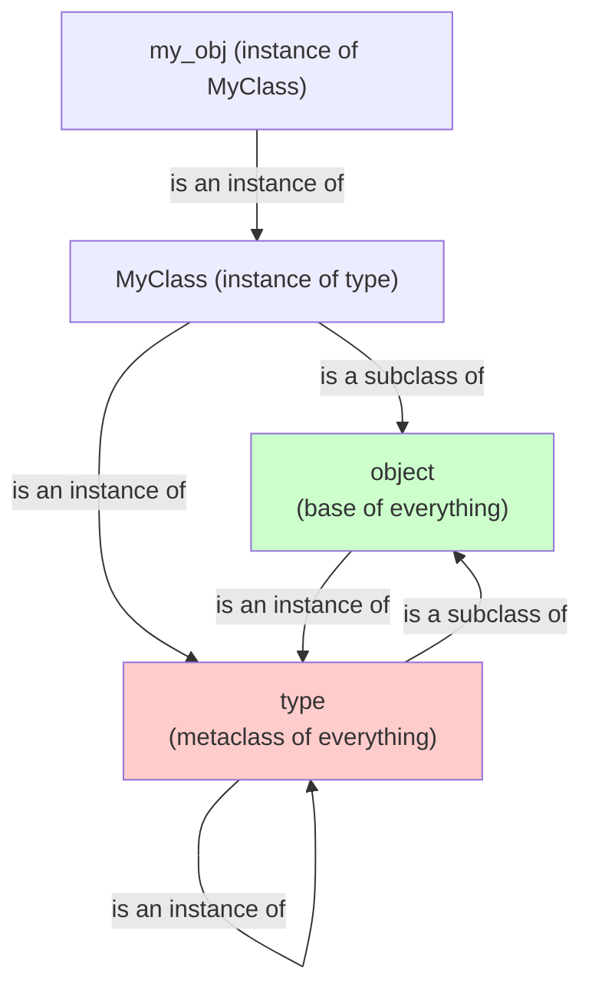
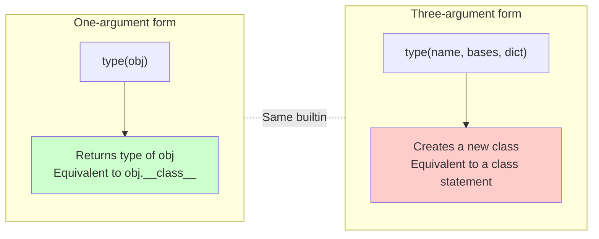
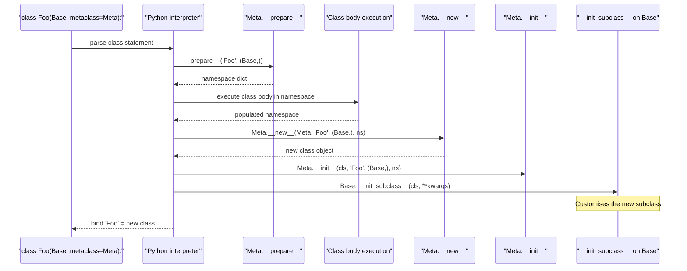

# 3. `type` and Dynamic Class Creation

> [!note] Why this note exists
> In Python, `type` is two things at once. With one argument, `type(obj)` returns the type of `obj` — the same as `obj.__class__`. With three arguments, `type(name, bases, namespace)` *creates a new class* — it's the function form of the `class` statement. This dual nature is the foundation of Python's metaprogramming: the `class` keyword is just sugar over `type(...)`, which means you can build classes at runtime from data — class names from config files, base classes from plugin discovery, methods from database schemas. This note covers the three-argument form, the `__init_subclass__` hook (Python 3.6+) that lets you customise subclass creation *without* a metaclass, and the relationship between `type`, `object`, and metaclasses (see [[4. Metaclasses]]). Once you understand that every `class Foo:` is a call to `type`, the rest of Python's class machinery — metaclasses, descriptors, ABCs — becomes much less mysterious.

## Why It Matters

The three-argument `type` call is the dynamic-class hammer. Knowing it lets you:

- **Generate classes from data.** Django models, SQLAlchemy ORM tables, Pydantic models, and dataclasses all build classes dynamically based on schema definitions.
- **Build plugin systems.** Discover plugins at runtime, compose base classes dynamically, and instantiate them with a uniform interface.
- **Avoid code duplication.** Instead of writing 20 nearly identical classes by hand, generate them from a config.
- **Implement mixins dynamically.** `type('MyView', (LoginRequiredMixin, TemplateView), {'template_name': 'x.html'})` builds a view class on the fly.
- **Understand `class` syntax.** Every `class Foo(Base): ...` is essentially `Foo = type('Foo', (Base,), {...})` (when no metaclass is involved). Knowing this demystifies class creation.
- **Implement `__init_subclass__`.** This hook fires on every subclass creation and replaces 90% of metaclass use cases. It's how `dataclasses`, `enum.Enum`, `typing.NamedTuple`, and `Pydantic` models customise their subclasses.
- **Build enum-like classes.** `enum.Enum` is a metaclass; `type` is what creates the enum members.
- **Generate type stubs and proxies.** `unittest.mock` and similar tools generate classes dynamically.
- **Understand `type` is its own metaclass.** `type(type) is type` — the bootstrap that makes Python's object model coherent.

If you've ever looked at a metaclass and wondered "where does the class actually come from?" — the answer is `type.__new__` and `type.__init__`. This note is the prerequisite for [[4. Metaclasses]].

## Background

### `type` as a one-arg function

```python
type(42)         # <class 'int'>
type('hello')    # <class 'str'>
type([])         # <class 'list'>
class Foo: pass
type(Foo())      # <class '__main__.Foo'>
type(Foo)        # <class 'type'>  ← Foo's type is type
type(type)       # <class 'type'>  ← type is its own type
```

`type(obj)` is equivalent to `obj.__class__`. They can differ in pathological cases (lying about `__class__` via a property), but for normal objects they agree. Prefer `type(obj)` for clarity.

### `type` as a three-arg class factory

```python
type(name, bases, namespace)
```

- `name`: a string, becomes `__name__` on the new class.
- `bases`: a tuple of base classes (use `()` for implicit `object`).
- `namespace`: a dict mapping attribute names to values; becomes the class's `__dict__`.

```python
Point = type('Point', (), {'x': 0, 'y': 0, 'describe': lambda self: f'({self.x}, {self.y})'})
p = Point()
print(p.describe())  # (0, 0)
print(Point.__name__)  # 'Point'
```

This is exactly equivalent to:

```python
class Point:
    x = 0
    y = 0
    def describe(self):
        return f'({self.x}, {self.y})'
```

The `class` statement is sugar for: build a namespace dict from the class body, then call the metaclass (default `type`) with `(name, bases, namespace)`. We'll see in [[4. Metaclasses]] that you can substitute a different metaclass.

### The bootstrap: `type` is its own type

```python
type(type) is type   # True
type(object) is type # True  ← object's type is type
issubclass(type, object)  # True  ← type is a subclass of object
issubclass(object, type)  # False ← object is NOT a subclass of type
```

This looks paradoxical but is essential. `type` is an instance of itself (its `ob_type` pointer points to itself). `object` is an instance of `type` (its `ob_type` is `type`). `type` is a subclass of `object` (so every type is an object). The two form a closed system: every object's `__class__` traces back to `type`, and `type`'s `__class__` is `type`.



This dual nature — `type` is both an instance and a subclass of itself, and `type(object) is type` — is the bootstrap. Without it, there'd be an infinite regress: what creates the creator?

### `type`'s dual nature



Both forms are dispatched by the same C function (`type_new` in `Objects/typeobject.c`). It checks the argument count: one arg → return `obj->ob_type`; three args → build a new type.

## Main content

### Anatomy of a dynamic class

```python
def make_method(greeting):
    def greet(self):
        return f"{greeting}, {self.name}!"
    return greet

namespace = {
    '__module__': __name__,
    '__qualname__': 'Greeter',
    'name': 'world',
    'greet': make_method('Hello'),
}

Greeter = type('Greeter', (), namespace)
g = Greeter()
print(g.greet())  # Hello, world!
```

Note the dunders in the namespace:

- `__module__`: where the class appears to be defined (for pickling, `repr`, etc.).
- `__qualname__`: the dotted path (e.g., `Outer.Inner` for nested classes).
- `__doc__`: docstring.

If you omit these, the class still works but may break pickling, IDE inspection, and Sphinx docs.

### Adding methods dynamically

```python
def __init__(self, x, y):
    self.x = x
    self.y = y

def __repr__(self):
    return f"Point({self.x!r}, {self.y!r})"

def norm(self):
    return (self.x ** 2 + self.y ** 2) ** 0.5

Point = type('Point', (), {
    '__init__': __init__,
    '__repr__': __repr__,
    'norm': norm,
})

p = Point(3, 4)
print(p)        # Point(3, 4)
print(p.norm()) # 5.0
```

### Inheritance

```python
Animal = type('Animal', (), {'legs': 4})
Dog = type('Dog', (Animal,), {'bark': lambda self: 'Woof!'})

d = Dog()
print(d.legs)   # 4 (inherited)
print(d.bark()) # Woof!
print(isinstance(d, Animal))  # True
```

The second argument to `type` is the tuple of base classes. MRO is computed automatically by the C3 linearisation algorithm (see [[16. Python Internals/4. The Object Model|The Object Model]]).

### Generating many similar classes

A classic use case: DTOs for database tables.

```python
def make_model(table_name, fields):
    namespace = {
        '__table__': table_name,
        '__fields__': tuple(fields),
    }
    # Add typed slots
    namespace['__slots__'] = tuple(fields)
    # Build __init__ that accepts kwargs
    def __init__(self, **kwargs):
        for f in self.__fields__:
            setattr(self, f, kwargs.get(f))
    namespace['__init__'] = __init__
    def __repr__(self):
        attrs = ', '.join(f"{f}={getattr(self, f)!r}" for f in self.__fields__)
        return f"{self.__table__}({attrs})"
    namespace['__repr__'] = __repr__
    return type(table_name.capitalize(), (), namespace)

User = make_model('users', ['id', 'name', 'email'])
Post = make_model('posts', ['id', 'title', 'body'])

u = User(id=1, name='Alice', email='alice@example.com')
print(u)  # Users(id=1, name='Alice', email='alice@example.com')
```

In practice, you'd use `@dataclass` (see [[18. Advanced OOP/4. Dataclasses|Dataclasses]]) or SQLAlchemy's declarative base — both build on this pattern.

### `__init_subclass__`: the modern alternative to metaclasses

Python 3.6 added `__init_subclass__` — a hook called whenever a class is subclassed. It receives the keyword arguments passed in the class definition:

```python
class Plugin:
    registry = []
    def __init_subclass__(cls, name=None, **kwargs):
        super().__init_subclass__(**kwargs)
        cls.name = name or cls.__name__
        Plugin.registry.append(cls)

class CSVLoader(Plugin, name='csv'):
    def load(self): ...

class JSONLoader(Plugin, name='json'):
    def load(self): ...

print([p.name for p in Plugin.registry])  # ['csv', 'json']
```

The keyword arguments in `class CSVLoader(Plugin, name='csv')` are passed to `__init_subclass__`. This is the modern, lightweight alternative to metaclasses for the most common use case (registering subclasses, applying class-level configuration).

> [!tip]
> PEP 487 (`__init_subclass__`) and `__set_name__` (covered in [[5. Descriptors]]) were added specifically to eliminate most metaclass use cases. Reach for `__init_subclass__` first; only use a full metaclass when you need to customise *how the class itself is constructed* (e.g., modifying `__dict__` before creation, inspecting the namespace).

### Comparison: `type` vs `class` vs `__init_subclass__` vs metaclass

| Tool | When to use |
|---|---|
| `class Foo:` | 99% of cases — static, readable, debugger-friendly |
| `type(name, bases, dict)` | Generating classes at runtime from data |
| `__init_subclass__` | Customising subclasses without a metaclass |
| Metaclass | Customising class *creation* itself (rare) |

### `type.__prepare__`: the namespace dict

When you write:

```python
class Foo(Base, metaclass=Meta, option=True):
    x = 1
    def f(self): ...
```

The machinery is:

1. `Meta.__prepare__('Foo', (Base,), option=True)` returns an empty mapping (default: plain `dict`).
2. The class body is executed, populating that mapping.
3. `Meta('Foo', (Base,), mapping, option=True)` is called — this is `Meta.__new__` then `Meta.__init__`.

`type.__prepare__` returns a plain `dict`. A custom metaclass can return an `OrderedDict`, a `defaultdict`, or a custom mapping that supports special syntax (e.g., SymPy's `Symbol` magic in class bodies). See [[4. Metaclasses]] for examples.

### `types.new_class` and `types.resolve_bases`

The `types` module provides a higher-level API:

```python
import types

Point = types.new_class('Point', (object,), exec_body=lambda ns: ns.update({
    'x': 0, 'y': 0,
}))
```

`types.new_class` calls `type.__new__` properly with `__init_subclass__` and metaclass resolution. Use it instead of raw `type()` when you need metaclass resolution but want to skip writing the metaclass boilerplate.

### Building an enum dynamically

```python
def make_enum(name, members):
    namespace = {}
    for value, label in members.items():
        namespace[label] = value
    namespace['__enum_values__'] = members
    return type(name, (), namespace)

Colors = make_enum('Colors', {1: 'RED', 2: 'GREEN', 3: 'BLUE'})
print(Colors.RED)  # 1
```

This is a toy version. The real `enum.Enum` is implemented as a metaclass — see the stdlib source for the full pattern. (And use `enum.Enum` in real code!)

### Class decorators as a metaclass alternative

```python
def logged(cls):
    orig_init = cls.__init__
    def __init__(self, *args, **kwargs):
        print(f"Initializing {cls.__name__}")
        orig_init(self, *args, **kwargs)
    cls.__init__ = __init__
    return cls

@logged
class Foo:
    def __init__(self, x):
        self.x = x

Foo(5)  # prints "Initializing Foo"
```

Class decorators (PEP 3129) are another lightweight alternative to metaclasses. They run after the class is fully created and can modify it. Use them for cross-cutting concerns like logging, registration, validation. See [[10. Pythonic Programming/4. Decorators Deep Dive|Decorators Deep Dive]].

### The class creation flow



### Type creation flow (simplified, no metaclass)

For a plain `class Foo(Base): ...`:

1. Determine the metaclass: `metaclass = type(Base)` (inherited) unless explicitly specified.
2. Call `metaclass.__prepare__('Foo', (Base,))` → returns `{}`.
3. Execute the class body in the namespace.
4. Call `metaclass('Foo', (Base,), namespace)`:
   - `metaclass.__new__(metaclass, 'Foo', (Base,), namespace)` → calls `type.__new__` which allocates the type struct, sets `tp_name`, computes MRO, copies namespace into `tp_dict`.
   - `metaclass.__init__(cls, 'Foo', (Base,), namespace)` → typically a no-op for `type`.
5. Call `Base.__init_subclass__(cls)` if defined.
6. Call `__set_name__` on every descriptor in the namespace (Python 3.6+).
7. Bind the name `Foo` to the new class.

### When NOT to use dynamic class creation

- When a `class` statement works. Dynamic creation is harder to read, harder to debug, and harder to type-check.
- When `@dataclass` suffices (Python 3.7+). See [[18. Advanced OOP/4. Dataclasses|Dataclasses]].
- When `typing.NamedTuple` or `typing.TypedDict` suffices. They're declarative and statically typed.
- When you just want a "config object" — use `types.SimpleNamespace` or `argparse.Namespace`.

### Performance considerations

Dynamic class creation is *not free*:

- `type('Foo', (), {})` is roughly 1-10 microseconds (depending on `__init_subclass__` and descriptor setup).
- Creating a class per HTTP request is fine; creating one per row in a million-row dataset is not.
- `isinstance` checks against dynamically created classes are normal-speed (the MRO is small).
- Pickling dynamically created classes requires they be importable by qualified name — store them in a module-level registry.

## Common Pitfalls

1. **Forgetting to set `__module__` and `__qualname__`.** Pickling, `repr`, and IDE inspection rely on these. They default to the calling module's name, but explicit is better.

2. **Bases must be a tuple, not a list.** `type('X', [Base], {})` raises `TypeError`.

3. **Forgetting `object` is implicit.** `type('X', (), {})` already inherits from `object`; you don't need `type('X', (object,), {})`.

4. **Using a closure variable in a dynamically-added method, then mutating it.** Each instance shares the closure; mutation affects all instances. Use `self.attr` for per-instance state.

5. **Confusing `type(x)` with `x.__class__`.** They agree normally, but a property named `__class__` can lie. Use `type(x)` for the truth.

6. **Expecting `__init_subclass__` to fire on the base class itself.** It only fires on *subclasses* — not the class that defines it.

7. **Forgetting to call `super().__init_subclass__(**kwargs)` in a subclass hook.** If base classes also define it, they won't be called.

8. **Trying to use `type()` to modify an existing class.** `type(...)` *creates* a new class; it doesn't modify existing ones. Use `setattr(ExistingClass, 'attr', value)`.

9. **Confusing `type(name, bases, dict)` with `type(obj)`.** Same builtin, different semantics based on argument count.

10. **Forgetting that metaclass `__call__` controls instance creation.** `MyClass()` calls `type(MyClass).__call__(MyClass)`, not `MyClass.__init__` directly. See [[4. Metaclasses]].

11. **Expecting dynamically-created classes to be picklable.** They're picklable only if they're accessible by qualified name at unpickle time (i.e., assigned to a module attribute).

12. **Using a custom namespace dict (via `__prepare__`) that breaks `__dict__` invariants.** The namespace must be a mutable mapping; final class `__dict__` becomes a `mappingproxy`.

13. **Not handling `__set_name__` on descriptors.** Custom descriptors in dynamically-created classes need `__set_name__` called manually if you bypass `type.__new__`.

14. **Forgetting that `type.__new__` calls `__init_subclass__` of the bases.** Subclass-side effects (registration, validation) fire even for `type(...)` calls.

15. **Believing `type` is the only metaclass.** `enum.EnumMeta`, `abc.ABCMeta`, and user-defined metaclasses all build on `type`. See [[4. Metaclasses]] and [[18. Advanced OOP/1. Abstract Base Classes|Abstract Base Classes]].

## Tips and Tricks

- **`type(name, bases, dict)` is the simplest metaprogramming primitive.** Use it for one-off dynamic classes; reach for `types.new_class` when you need metaclass resolution.
- **Set `__module__`, `__qualname__`, and `__doc__`** in the namespace for proper introspection.
- **`__init_subclass__` for subclass-side hooks** — registration, plugin discovery, validation.
- **`__set_name__` on descriptors** lets a descriptor know its name on the class. Combined with `__init_subclass__`, you can build declarative schemas.
- **Use `types.new_class(name, bases, {**kw}, exec_body)** instead of raw `type()` when you need metaclass resolution and keyword arguments.
- **For "list of similar classes", generate them in a loop:**
  ```python
  TABLES = {'users': ['id', 'name'], 'posts': ['id', 'title']}
  MODELS = {name: make_model(name, fields) for name, fields in TABLES.items()}
  ```
- **`type(cls)` is the metaclass.** For most classes, this is `type`. For `enum.Enum` subclasses, it's `EnumMeta`. For ABCs, it's `ABCMeta`.
- **`type.__subclasses__()` lists direct subclasses of a class.** Useful for plugin discovery:
  ```python
  for sub in Plugin.__subclasses__():
      sub().register()
  ```
- **For class registration, prefer `__init_subclass__` over `__subclasses__()`.** The former is explicit and fires on definition; the latter requires walking the tree.
- **`type(name, bases, dict).__name__ = name`** — the name is also set as `__name__` on the class, but you can rename it later.
- **A metaclass can be combined with `__init_subclass__`.** The metaclass controls class creation; the hook fires after creation.
- **`exec(body, globals, namespace)` lets you build a class body from a string.** Powerful but dangerous — only for trusted input.
- **`inspect.getmro(cls)` is `cls.__mro__`.** Use either.
- **`type(X) is type` checks if X's metaclass is `type`** — true for almost all classes. False for ABCs (`ABCMeta`), Enums (`EnumMeta`), and classes with custom metaclasses.
- **For "any class with these attributes", prefer `Protocol`** (see [[18. Advanced OOP/2. Protocols|Protocols]]) over dynamic base injection.
- **`@dataclass` generates classes via class decorator + `__init_subclass__`-like processing.** Reading its source is instructive.

## Active Recall

1. What are the two forms of `type`? What does each do?
2. Write `type('Point', (), {'x': 0})` as a `class` statement.
3. What's the relationship between `type` and `object`? Why is `type(type) is type` not a paradox?
4. What are `__module__`, `__qualname__`, and `__doc__` on a class? Why set them explicitly in dynamic classes?
5. What does `__init_subclass__` do? When is it called? What keyword arguments does it receive?
6. Write a `Plugin` base class that auto-registers subclasses via `__init_subclass__`.
7. What does `Meta.__prepare__` return by default? When would you override it?
8. List the steps the interpreter takes when executing `class Foo(Base, metaclass=Meta):`.
9. Why might you prefer `types.new_class` over raw `type()`?
10. What's the difference between a class decorator and a metaclass?
11. How would you generate 10 similar classes from a config dict?
12. Why must the bases argument to `type` be a tuple?
13. What does `type(SomeClass) is type` test? When is it False?
14. Does `__init_subclass__` fire on the class that defines it, or only on its subclasses?
15. How do you make a dynamically-created class picklable?
16. What's the perf cost of `type(...)`? When would it matter?
17. Write a metaclass-free plugin registry using `__init_subclass__`.
18. What is `__set_name__` and when is it called? (See [[5. Descriptors]].)
19. How does `class Foo(Base, option=True):` pass `option=True` to machinery?
20. Why is `type` its own metaclass? What problem does this solve?

## Next Steps

- [[1. dict and Attribute Access]] — the namespace dict that becomes the class's `__dict__`.
- [[2. getattr, setattr, hasattr]] — how attributes on the new class are accessed.
- [[4. Metaclasses]] — customising the class creation process itself.
- [[5. Descriptors]] — the `__set_name__` hook that fires during class creation.
- [[18. Advanced OOP/1. Abstract Base Classes|Abstract Base Classes]] — `ABCMeta` as a metaclass.
- [[18. Advanced OOP/4. Dataclasses|Dataclasses]] — `@dataclass` as a class decorator that processes the namespace.
- [[16. Python Internals/4. The Object Model|The Object Model]] — the C-level view of `type` (`PyTypeObject`).
- [[10. Pythonic Programming/4. Decorators Deep Dive|Decorators Deep Dive]] — class decorators as a metaclass alternative.
