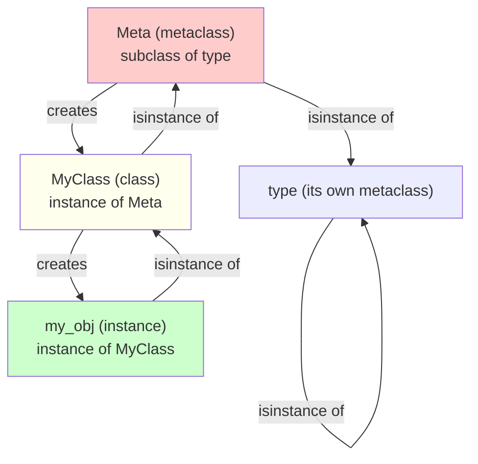
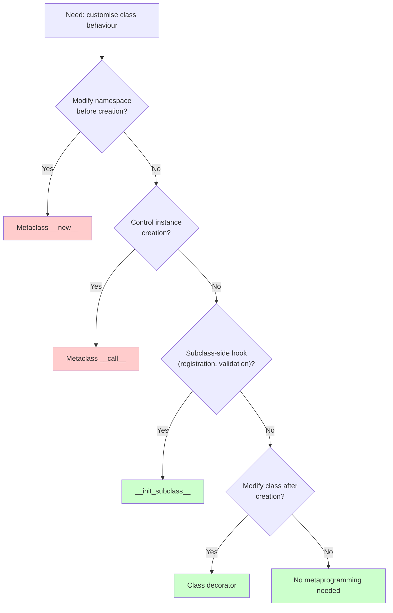
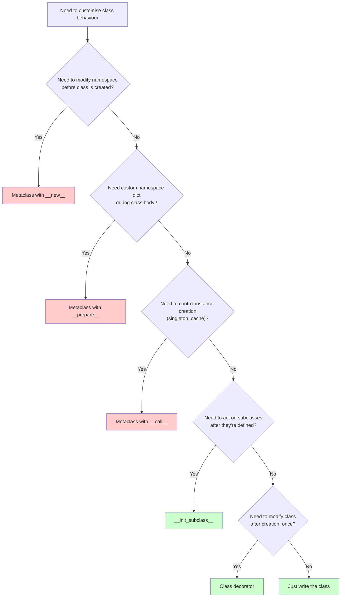

# 4. Metaclasses

> [!note] Why this note exists
> A metaclass is the class of a class. Just as `5` is an instance of `int` and `int` is an instance of `type`, every class you write is an instance of *its* metaclass — which is `type` by default. By subclassing `type`, you can customise *how classes are constructed*: validate the namespace, register classes, inject methods, rename attributes, enforce interfaces, or generate code at class-definition time. This is the most powerful — and most easily abused — feature in Python's object model. Tim Peters famously wrote: "Metaclasses are deeper magic than 99% of users should ever worry about. If you wonder whether you need them, you don't." This note exists to give you the precise mental model so you can read code that uses metaclasses (Django models, SQLAlchemy declarative base, `enum.Enum`, `abc.ABC`, Pydantic v1) *and* so you know when to reach for the modern alternatives (`__init_subclass__`, class decorators, `Protocol`) instead. Read [[3. type and Dynamic Class Creation]] first — metaclasses are *customised `type` subclasses*, so you must understand `type` first.

## Why It Matters

Metaclasses are the top of Python's object hierarchy. Knowing them lets you:

- **Read framework code.** Django's `ModelBase`, SQLAlchemy's `DeclarativeMeta`, `enum.EnumMeta`, `abc.ABCMeta`, and Pydantic v1's `ModelMetaclass` all use metaclasses. If you can't read a metaclass, you can't read these frameworks' internals.
- **Build declarative APIs.** "Write a class with attributes; the framework figures out the rest" — this style of API is enabled by metaclasses (or their modern replacements).
- **Enforce class-level invariants.** "Every subclass must define `TABLE_NAME`", "every class must have a `serialize` method", "every field must be typed" — metaclasses can check these at class creation time.
- **Auto-register plugins.** Metaclasses can add subclasses to a registry at class-definition time, eliminating boilerplate.
- **Generate methods.** A metaclass can inject `__init__`, `__repr__`, `__eq__`, comparison operators, or serialisation methods based on class attributes. (This is what `@dataclass` does — but via a class decorator, not a metaclass, in 3.7+.)
- **Implement descriptors that know their name.** `__set_name__` (3.6+) eliminated most needs for metaclass-based descriptor setup.
- **Customise `__call__`.** The metaclass's `__call__` controls *instance* creation — useful for singletons, flyweights, and dependency injection containers.
- **Understand the class statement.** Every `class Foo(Base, metaclass=Meta):` resolves to `Meta('Foo', (Base,), namespace)`. Knowing this is the key to all class metaprogramming.

The flip side: metaclasses are hard to debug, interact awkwardly with multiple inheritance (metaclass conflict), and are usually overkill. PEP 487 (`__init_subclass__` and `__set_name__`) eliminated most of the common use cases. This note covers both the "yes, you need a metaclass" cases and the "use the simpler alternative instead" cases.

## Background

### Every class has a metaclass

```python
class Foo: pass
print(type(Foo))       # <class 'type'>
print(type(Foo()) is Foo)  # True — Foo() is an instance of Foo
print(type(Foo) is type)   # True — Foo is an instance of type

import enum
class Color(enum.Enum):
    RED = 1
print(type(Color))     # <enum 'EnumMeta'> — Color's metaclass is EnumMeta

from abc import ABC
class MyABC(ABC): pass
print(type(MyABC))     # <class 'abc.ABCMeta'>
```

The default metaclass is `type`. Classes that need special construction (Enums, ABCs, ORM models) have a custom metaclass that subclasses `type`.

### Instance/class/metaclass relationship



- `Inst` is an instance of `Cls`. `Cls.__call__(args)` creates instances of `Cls`.
- `Cls` is an instance of `Meta`. `Meta.__call__(name, bases, ns)` creates instances of `Meta` (i.e., classes).
- `Meta` is an instance of `type` (or, if `Meta` itself has a meta-metaclass, of that — but this is rare and almost always `type`).

### Class creation = metaclass invocation

```python
class Foo(Base, metaclass=Meta, debug=True):
    x = 1
```

is roughly:

```python
ns = Meta.__prepare__('Foo', (Base,), debug=True)  # default: {}
exec(class_body_code, ns)  # populate ns with x=1, etc.
Foo = Meta('Foo', (Base,), ns, debug=True)
# which expands to:
#   Foo = Meta.__new__(Meta, 'Foo', (Base,), ns, debug=True)
#   Meta.__init__(Foo, 'Foo', (Base,), ns, debug=True)
# Then __init_subclass__ on Base is called with Foo and debug=True.
# Then __set_name__ on every descriptor in ns.
```

The keyword arguments (`debug=True`) flow to `__prepare__`, `__new__`, `__init__`, and `__init_subclass__`. They're a channel for configuration.

## Main content

### Defining a metaclass

A metaclass is just a subclass of `type`:

```python
class VerboseMeta(type):
    def __new__(mcs, name, bases, namespace, **kwargs):
        print(f"Creating class {name} with bases {bases}")
        cls = super().__new__(mcs, name, bases, namespace, **kwargs)
        return cls

    def __init__(cls, name, bases, namespace, **kwargs):
        print(f"Initializing class {name}")
        super().__init__(name, bases, namespace, **kwargs)

class Foo(metaclass=VerboseMeta):
    pass
# Prints:
# Creating class Foo with bases ()
# Initializing class Foo
```

Convention: name the first parameter `mcs` (or `meta`) instead of `cls` to signal it's a metaclass. (`cls` would also work — Python doesn't care — but it's confusing to readers.)

### `__new__` vs `__init__` vs `__call__` in metaclasses

Three hooks, three roles:

| Hook | Purpose | Typical use |
|---|---|---|
| `__new__(mcs, name, bases, ns)` | Create the class object | Modify namespace before creation, return a different class |
| `__init__(cls, name, bases, ns)` | Initialise the class | Set additional attributes on the class |
| `__call__(mcs, name, bases, ns, **kw)` | Control class *creation* | Singleton classes, dependency injection |

Plus:
| Hook | Purpose |
|---|---|
| `__prepare__(mcs, name, bases, **kw)` | Return the namespace dict before the class body executes |
| `__init_subclass__` (on the base) | Post-creation hook on subclasses (no metaclass needed) |

#### `__new__` — modify the namespace before creation

```python
class UpperAttrMeta(type):
    def __new__(mcs, name, bases, namespace):
        # Convert all dunder-less attribute names to uppercase
        new_ns = {}
        for attr_name, attr_value in namespace.items():
            if not attr_name.startswith('__'):
                new_ns[attr_name.upper()] = attr_value
            else:
                new_ns[attr_name] = attr_value
        return super().__new__(mcs, name, bases, new_ns)

class Foo(metaclass=UpperAttrMeta):
    x = 1
    def method(self): pass

print(hasattr(Foo, 'x'))        # False
print(hasattr(Foo, 'X'))        # True
print(hasattr(Foo, 'method'))   # False
print(hasattr(Foo, 'METHOD'))   # True
```

Use `__new__` when you need to change the namespace *before* the type is allocated (e.g., filter, rename, or transform attributes).

#### `__init__` — add attributes after creation

```python
class TagMeta(type):
    def __init__(cls, name, bases, namespace, **kwargs):
        super().__init__(name, bases, namespace, **kwargs)
        if not hasattr(cls, '_tags'):
            cls._tags = set()
        cls._tags.add(name)

class A(metaclass=TagMeta): pass
class B(A): pass
class C(A): pass
print(A._tags)  # {'A', 'B', 'C'}  ← wait, this would be wrong
```

Hmm — `cls._tags` is set on `A` only when `A` is created. When `B` is created, `__init__` runs on `B`, but `cls._tags` is inherited from `A` (which is the *same* set). So adding to it affects all subclasses. That's a bug — each subclass should have its own `_tags`. The fix:

```python
class TagMeta(type):
    def __init__(cls, name, bases, namespace, **kwargs):
        super().__init__(name, bases, namespace, **kwargs)
        cls._tags = getattr(cls, '_tags', set()).copy() if name != 'TagMeta' else set()
        # ... actually, simpler: just use __init_subclass__ instead.
```

This is the canonical case where `__init_subclass__` is simpler. (See "Modern alternatives" below.)

#### `__call__` — control instance creation

This is the most powerful and least-used hook. The metaclass's `__call__` is invoked when you *instantiate the class* (because `Foo(args)` calls `type(Foo).__call__(Foo, args)`).

```python
class SingletonMeta(type):
    _instances = {}
    def __call__(cls, *args, **kwargs):
        if cls not in cls._instances:
            cls._instances[cls] = super().__call__(*args, **kwargs)
        return cls._instances[cls]

class Database(metaclass=SingletonMeta):
    def __init__(self):
        print("Initializing database connection")

db1 = Database()  # Initializing database connection
db2 = Database()  # (no output)
print(db1 is db2)  # True
```

`__call__` on the metaclass is *the* way to control instance creation — singletons, flyweights, instance caching, DI containers, etc.

> [!warning]
> Using `__call__` for singletons is a classic metaclass example, but in practice, a module-level instance or `functools.cache` is simpler and avoids the metaclass. Reach for `__call__` when you need *cross-cutting* instance creation control on many classes.

### `__prepare__`: the namespace factory

```python
class OrderedMeta(type):
    @classmethod
    def __prepare__(mcs, name, bases, **kwargs):
        return {}  # default; but we could return OrderedDict, defaultdict, custom mapping
```

`__prepare__` returns the dict that the class body executes into. Use cases:

- **Custom mapping with `__missing__`** for auto-created entries (SymPy-style symbol magic).
- **OrderedDict** (irrelevant since Python 3.7 — plain dicts preserve order).
- **A custom dict that records insertion order separately** or supports attribute-style access.

Real-world: Django's `ModelBase.__prepare__` doesn't override `__prepare__` (it uses the default), but the class body executes within the metaclass's namespace resolution context.

### When to use metaclasses

You need a metaclass when:

1. **You need to modify the namespace *before* the class is created.** (Renaming attributes, filtering, etc.) Use `__new__`.
2. **You need to control *instance creation*.** (Singletons, instance caching.) Use `__call__`.
3. **You need a non-default namespace dict.** Use `__prepare__`.
4. **You need class-level behaviour that affects all subclasses automatically and cannot be expressed via `__init_subclass__`.** (E.g., Django's `ModelBase` collects field definitions and builds a database schema — too complex for `__init_subclass__`.)

You *don't* need a metaclass when:

- You just want to register subclasses. → `__init_subclass__`
- You want to add methods or attributes after class creation. → Class decorator
- You want to enforce an interface. → ABC (see [[18. Advanced OOP/1. Abstract Base Classes|Abstract Base Classes]])
- You want to generate `__init__`, `__repr__`, `__eq__` from fields. → `@dataclass` (see [[18. Advanced OOP/4. Dataclasses|Dataclasses]])
- You want a typed structure. → `typing.NamedTuple`, `TypedDict`, `@dataclass`

### Modern alternatives



#### `__init_subclass__` instead of registration metaclasses

```python
# OLD (metaclass)
class PluginMeta(type):
    registry = []
    def __init__(cls, name, bases, ns):
        super().__init__(name, bases, ns)
        if bases:  # not the base Plugin class
            PluginMeta.registry.append(cls)

class Plugin(metaclass=PluginMeta): pass

# NEW (init_subclass)
class Plugin:
    registry = []
    def __init_subclass__(cls, **kwargs):
        super().__init_subclass__(**kwargs)
        Plugin.registry.append(cls)
```

The new version is shorter, doesn't require understanding metaclasses, and combines better with multiple inheritance.

#### Class decorators instead of post-creation metaclasses

```python
# OLD (metaclass)
class ReprMeta(type):
    def __new__(mcs, name, bases, ns):
        cls = super().__new__(mcs, name, bases, ns)
        if 'fields' in ns:
            def __repr__(self):
                attrs = ', '.join(f"{f}={getattr(self, f)!r}" for f in self.fields)
                return f"{name}({attrs})"
            cls.__repr__ = __repr__
        return cls

class Point(metaclass=ReprMeta):
    fields = ('x', 'y')
    def __init__(self, x, y): self.x, self.y = x, y

# NEW (class decorator)
def add_repr(cls):
    if hasattr(cls, 'fields'):
        def __repr__(self):
            attrs = ', '.join(f"{f}={getattr(self, f)!r}" for f in self.fields)
            return f"{type(self).__name__}({attrs})"
        cls.__repr__ = __repr__
    return cls

@add_repr
class Point:
    fields = ('x', 'y')
    def __init__(self, x, y): self.x, self.y = x, y
```

Class decorators (PEP 3129) are simpler and composable. Use them when you don't need to control *creation* — only *post-creation modification*.

### Metaclass conflict

Multiple inheritance gets tricky when bases have different metaclasses:

```python
class MetaA(type): pass
class MetaB(type): pass
class A(metaclass=MetaA): pass
class B(metaclass=MetaB): pass

class C(A, B): pass  # TypeError: metaclass conflict
```

The fix is to create a combined metaclass:

```python
class MetaAB(MetaA, MetaB): pass
class C(A, B, metaclass=MetaAB): pass  # OK
```

Or use `class ABCMeta` (which is designed to be cooperative). Django and SQLAlchemy have explicit docs on combining their metaclasses with yours. This is the single biggest reason metaclasses are painful in large frameworks.

> [!warning]
> If you're writing a library and your users may want to combine your class with another library's class (e.g., a Django model and a Pydantic model), *avoid* using a custom metaclass. Use `__init_subclass__` or a class decorator instead — they compose much better.

### Real-world metaclasses

- **`enum.EnumMeta`** — builds the enum members from class attributes, supports `Color.RED`, `Color['RED']`, iteration, etc.
- **`abc.ABCMeta`** — tracks abstract methods, prevents instantiation until they're implemented.
- **`typing.Generic`'s `GenericAlias` machinery** — `list[int]` works because of metaclass magic on `_GenericAlias`.
- **Django's `ModelBase`** — collects `Field` descriptors in the class body, builds a database schema, generates a `_meta` options object.
- **SQLAlchemy's `DeclarativeMeta`** — similar; collects `Column` objects, builds a `_table`.
- **Pydantic v1's `ModelMetaclass`** — collects type-annotated fields, generates validators, builds a schema. (Pydantic v2 uses Rust-based class construction instead.)

### The metaclass decision tree



### Singleton via metaclass — full example

```python
class Singleton(type):
    _instances = {}
    def __call__(cls, *args, **kwargs):
        if cls not in cls._instances:
            cls._instances[cls] = super().__call__(*args, **kwargs)
        return cls._instances[cls]

class Logger(metaclass=Singleton):
    def __init__(self):
        self.logs = []
    def log(self, msg):
        self.logs.append(msg)

l1 = Logger()
l2 = Logger()
l1.log("hello")
print(l2.logs)  # ['hello']
print(l1 is l2)  # True
```

### ORM-lite metaclass example

```python
class Field:
    def __init__(self, type_):
        self.type = type_
        self.name = None
    def __set_name__(self, owner, name):
        self.name = name
    def __get__(self, obj, objtype=None):
        if obj is None:
            return self
        return obj.__dict__.get(self.name)
    def __set__(self, obj, value):
        if not isinstance(value, self.type):
            raise TypeError(f"{self.name} expects {self.type.__name__}")
        obj.__dict__[self.name] = value

class ModelMeta(type):
    def __new__(mcs, name, bases, ns):
        cls = super().__new__(mcs, name, bases, ns)
        cls._fields = {name: val for name, val in ns.items() if isinstance(val, Field)}
        return cls

class Model(metaclass=ModelMeta):
    pass

class User(Model):
    id = Field(int)
    name = Field(str)

u = User()
u.id = 1
u.name = "Alice"
print(u.__dict__)  # {'id': 1, 'name': 'Alice'}
print(User._fields)  # {'id': <Field>, 'name': <Field>}
u.id = "not an int"  # TypeError
```

In modern Python, this could be done with `__init_subclass__` instead of a metaclass — but real ORMs (Django, SQLAlchemy) need the full metaclass for additional features like schema generation.

## Common Pitfalls

1. **Using a metaclass when `__init_subclass__` or a class decorator suffices.** Metaclasses are harder to read, harder to debug, and don't compose with other metaclasses.

2. **Metaclass conflict in multiple inheritance.** Two bases with different metaclasses raise `TypeError`. You must create a combined metaclass.

3. **Forgetting to call `super().__new__` / `super().__init__` in the metaclass.** Without this, the class isn't actually created.

4. **Confusing `mcs` (the metaclass) with `cls` (the class being created).** In `__new__`, the first arg is the metaclass; in `__init__`, it's the new class. Convention: `mcs` vs `cls`.

5. **Returning something other than a class from `__new__`.** Python expects a type instance. (Returning a non-type silently breaks `isinstance` and other checks.)

6. **Forgetting that `__call__` on the metaclass controls *instance* creation, not class creation.** This is the source of the singleton pattern but also a frequent confusion.

7. **Modifying the namespace dict in `__init__`.** Too late — the class is already created. Use `__new__` for namespace modification.

8. **Storing per-class state on the metaclass.** `cls._tags = set()` in `__init__` adds to the class, not the metaclass — but if the base class already has `_tags`, the subclass inherits *the same set*. Use copy or override.

9. **Forgetting `**kwargs` in `__new__`/`__init__`/`__init_subclass__`.** Keyword arguments from `class Foo(Base, option=True)` flow through; missing `**kwargs` breaks the chain.

10. **Using a metaclass to add `__init__` or `__repr__`.** Use `@dataclass` instead.

11. **Using a metaclass to enforce an interface.** Use ABCs (see [[18. Advanced OOP/1. Abstract Base Classes|Abstract Base Classes]]).

12. **Using a metaclass to register plugins.** Use `__init_subclass__`.

13. **Forgetting that `__prepare__` must return a *mutable mapping*.** A `mappingproxy` or frozen dict will break the class body execution.

14. **Expecting `__init_subclass__` to fire on the defining class itself.** It only fires on *subclasses*.

15. **Forgetting that metaclasses inherit.** A subclass of a class with `metaclass=Meta` also has metaclass `Meta` (unless overridden).

16. **Believing the metaclass's `__init__` and `__new__` both run.** They do — but you must call `super()` in both. If you only override `__new__`, `__init__` is still called (it's `type.__init__`, which is mostly a no-op).

17. **Trying to use the metaclass's `__new__` to return an *existing* class.** Python allows this (it's how `enum.Enum` deduplicates aliases), but it's surprising. Use sparingly.

## Tips and Tricks

- **Default to `__init_subclass__` and class decorators.** Only reach for a metaclass when these can't do what you need.
- **`__prepare__` for custom namespace dicts.** Rarely needed — the default `dict` is fine for 99% of cases.
- **`__new__` to modify the namespace before creation.** Use when you need to rename, filter, or transform attributes.
- **`__init__` to add attributes after creation.** Often simpler than `__new__` for adding new class-level state.
- **`__call__` to control instance creation.** Singletons, flyweights, instance caching.
- **Name the first metaclass parameter `mcs`** to distinguish from `cls` (the class being created).
- **`type(cls)` is the metaclass.** `type(MyClass) is type` for plain classes; `type(MyABC) is ABCMeta`.
- **`type.__subclasses__()` lists direct subclasses of a class.** Useful for plugin discovery (with `__init_subclass__`).
- **For combining metaclasses, create an explicit combined class** — don't expect Python to figure it out.
- **`super().__new__(mcs, name, bases, ns, **kwargs)` must be called** to actually create the class.
- **`__set_name__` on descriptors** (3.6+) eliminates the need for metaclass-based descriptor setup. See [[5. Descriptors]].
- **`@dataclass` is implemented as a class decorator, not a metaclass.** Easier to compose with other code.
- **Pydantic v2 uses Rust-based class construction** — no Python metaclass at all. The trend in modern Python is *away* from metaclasses.
- **`inspect.classify_class_attrs(cls)` shows where each attribute came from** (which class in the MRO). Useful for debugging metaclass-injected attributes.
- **`type(cls).__mro__` shows the metaclass MRO** — useful when combining metaclasses.
- **`__init_subclass__` and metaclasses compose**: the metaclass controls class creation, `__init_subclass__` fires after. You can use both.
- **Reading `enum.EnumMeta` source** is the best way to understand what a real-world metaclass does. Start in `Lib/enum.py`.
- **`type(name, bases, ns)` bypasses metaclass `__call__`.** It calls `type.__new__` directly. Use `Meta(name, bases, ns)` to invoke the full metaclass.
- **For "framework-like" APIs, consider whether users need to subclass your class with their own metaclass.** If yes, prefer `__init_subclass__`.
- **A metaclass that does nothing is just `type`.** Don't subclass `type` unless you have something to add.

## Active Recall

1. What is a metaclass? What's the default metaclass for all classes?
2. What does `type(MyClass)` return for a plain class? For an ABC? For an Enum?
3. Write a metaclass that prints "Creating X" whenever a class is defined with it.
4. What's the difference between `__new__`, `__init__`, and `__call__` in a metaclass?
5. What does `__prepare__` return by default? When would you override it?
6. Write a `SingletonMeta` that ensures only one instance per class.
7. What's a metaclass conflict? How do you resolve it?
8. When should you use `__init_subclass__` instead of a metaclass?
9. When should you use a class decorator instead of a metaclass?
10. Why is the first parameter of a metaclass method conventionally `mcs` instead of `cls`?
11. What does `class Foo(Base, option=True)` do with `option=True`?
12. Write a metaclass that collects all `Field` instances from the class body into a `_fields` dict.
13. How does `enum.EnumMeta` differ from `type`?
14. Why does `type(cls).__call__` get invoked when you do `cls()`?
15. What's the metaclass decision tree? When do you actually need a metaclass?
16. Why is it bad to use a custom metaclass in a library intended for subclassing by users?
17. How does Pydantic v2 differ from v1 in its use of metaclasses?
18. What's the relationship between `__init_subclass__` and `__set_name__`?
19. Write a metaclass that rejects classes without a `__tablename__` attribute.
20. Why did PEP 487 (`__init_subclass__` and `__set_name__`) reduce the need for metaclasses?

## Next Steps

- [[3. type and Dynamic Class Creation]] — `type` is the default metaclass; understand it first.
- [[5. Descriptors]] — `__set_name__` is the descriptor-side counterpart of metaclass-based setup.
- [[1. dict and Attribute Access]] — the namespace dict that the metaclass populates.
- [[2. getattr, setattr, hasattr]] — how attributes on metaclass-created classes are accessed.
- [[18. Advanced OOP/1. Abstract Base Classes|Abstract Base Classes]] — `ABCMeta` as a real-world metaclass.
- [[18. Advanced OOP/4. Dataclasses|Dataclasses]] — `@dataclass` as the modern alternative to ORM-style metaclasses.
- [[18. Advanced OOP/5. Descriptors Deep Dive|Descriptors Deep Dive]] — Django and SQLAlchemy use descriptors + metaclasses together.
- [[10. Pythonic Programming/4. Decorators Deep Dive|Decorators Deep Dive]] — class decorators as the lightweight alternative.
