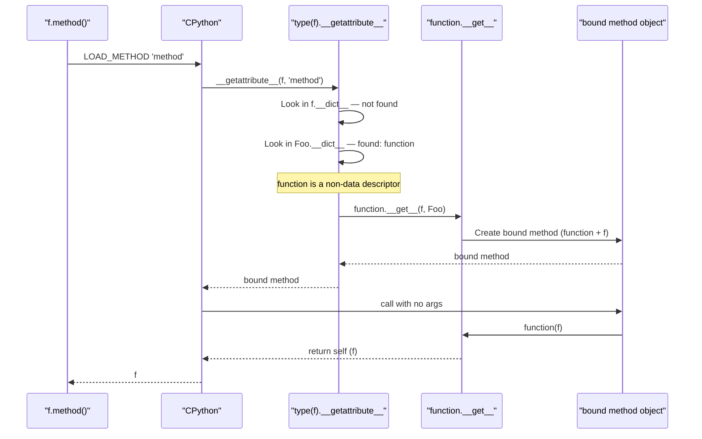
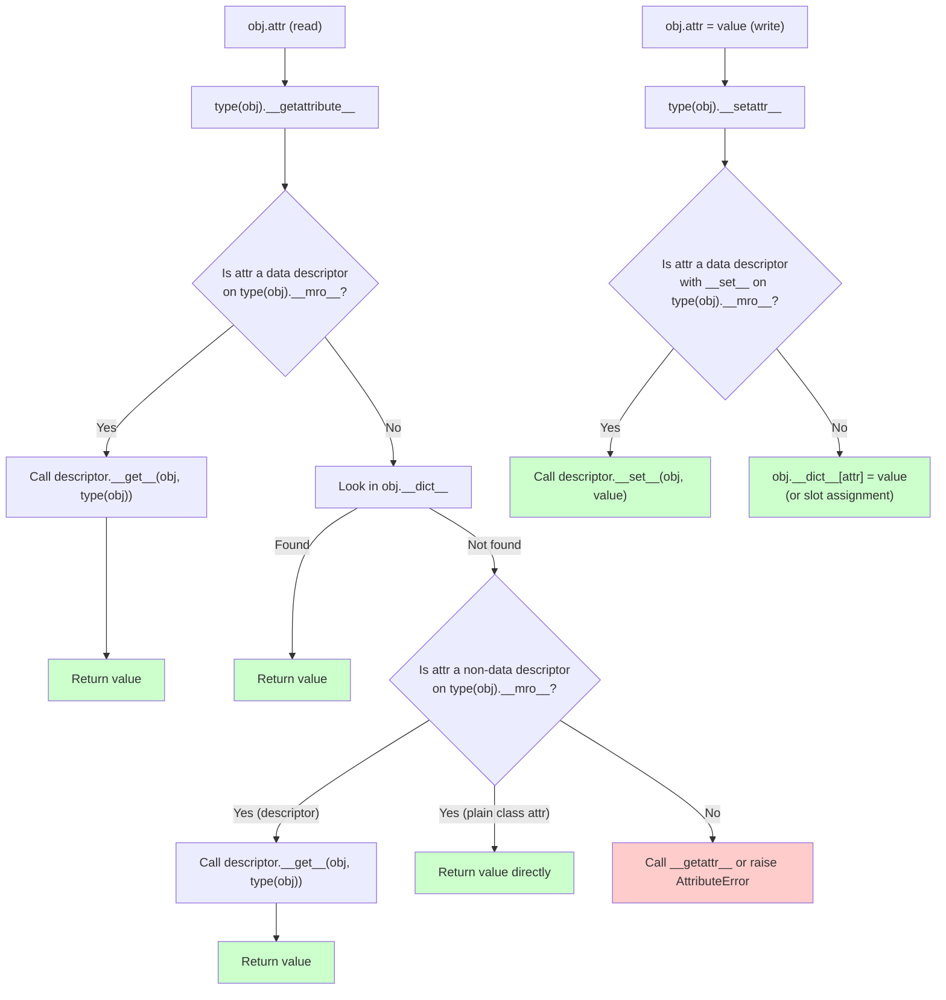

# 5. Descriptors

> [!note] Why this note exists
> The descriptor protocol — `__get__`, `__set__`, `__delete__`, and (since 3.6) `__set_name__` — is the mechanism behind `property`, `classmethod`, `staticmethod`, normal methods, `super()`, `__slots__`, and most ORM field declarations. Once you understand descriptors, half of Python's "magic" becomes legible: how does `self.method()` bind? Why does `@property` work? Why can't you override a property with an instance attribute? How do Django's `CharField` and SQLAlchemy's `Column` know their name on the model? This note is the conceptual foundation; [[18. Advanced OOP/5. Descriptors Deep Dive|Descriptors Deep Dive]] is the applied/real-world treatment. Read this first, then the deep dive. Descriptors are also tightly coupled with `__getattribute__` (see [[2. getattr, setattr, hasattr]]) and `__dict__` (see [[1. dict and Attribute Access]]) — they are the "interceptor" layer between attribute access and the storage layer.

## Why It Matters

Descriptors are how Python turns "attribute access" into "method call" or "function call". Knowing them lets you:

- **Understand methods.** `instance.method()` works because functions are descriptors — `function.__get__(instance, type)` returns a bound method. Without descriptors, Python would need a separate "method" type.
- **Understand `property`.** `@property` is a descriptor with `__get__`, `__set__`, `__delete__`. Knowing this lets you write your own custom properties (validation, lazy caching, type checking).
- **Build ORMs.** Django `Field`, SQLAlchemy `Column`, and Pydantic `FieldInfo` are all descriptors. They intercept attribute access to load from the DB, validate, or coerce types.
- **Build typed attributes.** `TypedField(int)` that validates type on assignment — the foundation of Pydantic, attrs, and modern Python validation libraries.
- **Build lazy attributes.** A descriptor that computes its value on first access and caches it. (`functools.cached_property` is exactly this.)
- **Understand `super()`.** `super()` returns a descriptor (`super` itself is a descriptor!) that routes attribute access to the next class in the MRO.
- **Understand `__slots__`.** Each slot is implemented as a data descriptor at the C level.
- **Understand `classmethod` and `staticmethod`.** Both are descriptors — `classmethod.__get__` returns a bound-to-class method; `staticmethod.__get__` returns the underlying function.
- **Diagnose "why can't I set this attribute?"** If a class has a data descriptor with no `__set__`, you get weird behaviour. Knowing the protocol tells you why.

If you've ever wondered why `instance.method` is a *bound method* but `Class.method` is just a function — descriptors are the answer.

## Background

### The descriptor protocol

A descriptor is any object that defines one or more of:

```python
class Descriptor:
    def __get__(self, obj, objtype=None):
        """Called on instance.attr or Class.attr. Return the value."""
    def __set__(self, obj, value):
        """Called on instance.attr = value. Store the value."""
    def __delete__(self, obj):
        """Called on del instance.attr. Remove the value."""
    def __set_name__(self, owner, name):
        """Called once at class creation. Tells the descriptor its name."""
```

`__set_name__` was added in Python 3.6 (PEP 487). Before that, descriptors had to infer their name from the class's `__dict__` at first access.

### Data vs non-data descriptors

The crucial distinction:

| Type | Defines | Wins over instance `__dict__`? | Examples |
|---|---|---|---|
| **Data descriptor** | `__get__` + (`__set__` or `__delete__`) | **Yes** | `property`, `__slots__`, ORM fields |
| **Non-data descriptor** | `__get__` only | **No** | functions, `classmethod`, `staticmethod` |

This distinction is *the* core of the attribute lookup order. See [[1. dict and Attribute Access]] for the full chain, but the short version:

- Data descriptor on type → wins (overrides instance `__dict__`).
- Instance `__dict__` → wins over non-data descriptors.
- Non-data descriptor on type → consulted if not in instance `__dict__`.

This is why `property` always wins (it's a data descriptor) but functions can be overridden by setting an instance attribute (functions are non-data descriptors).

```python
class C:
    @property
    def x(self):
        return self._x
    @x.setter
    def x(self, v):
        self._x = v

    def method(self):
        return "method"

c = C()
c.x = 1
print(c.x)         # 1 (via property)
# Try to override property with instance attr:
c.__dict__['x'] = 999
print(c.x)         # Still 1! Property wins.
# But methods can be overridden:
c.__dict__['method'] = lambda: "shadowed"
print(c.method())  # "shadowed"
```

### How `property`, `classmethod`, `staticmethod` work

All three are descriptors:

```python
# property (simplified)
class property:
    def __init__(self, fget=None, fset=None, fdel=None):
        self.fget = fget; self.fset = fset; self.fdel = fdel
    def __get__(self, obj, objtype=None):
        if obj is None:
            return self  # Class.prop returns the property itself
        return self.fget(obj)
    def __set__(self, obj, value):
        if self.fset is None:
            raise AttributeError("can't set attribute")
        self.fset(obj, value)
    def __delete__(self, obj):
        if self.fdel is None:
            raise AttributeError("can't delete attribute")
        self.fdel(obj)
    def setter(self, fset):
        return type(self)(self.fget, fset, self.fdel)
    def deleter(self, fdel):
        return type(self)(self.fget, self.fset, fdel)

# classmethod (simplified)
class classmethod:
    def __init__(self, f):
        self.f = f
    def __get__(self, obj, objtype=None):
        if objtype is None:
            objtype = type(obj)
        def wrapper(*args, **kwargs):
            return self.f(objtype, *args, **kwargs)
        return wrapper

# staticmethod (simplified)
class staticmethod:
    def __init__(self, f):
        self.f = f
    def __get__(self, obj, objtype=None):
        return self.f  # just the function, no binding
```

### Functions are descriptors

```python
class Foo:
    def method(self):
        return self

print(type(Foo.method))  # <class 'function'>
print(Foo.method)        # <function Foo.method at 0x...>

f = Foo()
print(type(f.method))    # <class 'method'>  ← bound method!
print(f.method())        # <Foo object>
```

When you access `f.method`:

1. `type(f).__getattribute__(f, 'method')` is called.
2. It finds `method` in `Foo.__dict__` — it's a function (a non-data descriptor).
3. It calls `function.__get__(f, Foo)`, which returns a `method` object that wraps the function and `f`.
4. Calling `method()` calls `function(f)`.

This is *the* mechanism that makes Python methods work. Without descriptors, `f.method()` would need a special "method" type, and Python's class model would be much less elegant.



## Main content

### A simple data descriptor

```python
class TypedField:
    def __init__(self, type_):
        self.type = type_
        self.name = None

    def __set_name__(self, owner, name):
        self.name = name
        # Store the actual value under a private name to avoid recursion
        self.storage_name = f'_field_{name}'

    def __get__(self, obj, objtype=None):
        if obj is None:
            return self  # Class.field returns the descriptor
        return getattr(obj, self.storage_name, None)

    def __set__(self, obj, value):
        if not isinstance(value, self.type):
            raise TypeError(
                f"{self.name} must be {self.type.__name__}, got {type(value).__name__}"
            )
        setattr(obj, self.storage_name, value)

class User:
    id = TypedField(int)
    name = TypedField(str)

u = User()
u.id = 1            # OK
u.id = "abc"        # TypeError
u.name = "Alice"    # OK
u.name = None       # TypeError
print(u.id, u.name) # 1 Alice
```

This is the pattern behind Pydantic, attrs, and most validation libraries. The descriptor holds *no per-instance state* — it just intercepts access and stores the value under a different attribute name on the instance.

### A non-data descriptor (read-only computed)

```python
class Version:
    """Returns the same version for all instances of the class."""
    def __get__(self, obj, objtype=None):
        return "1.0.0"

class App:
    version = Version()

print(App.version)        # 1.0.0
print(App().version)      # 1.0.0
```

Non-data descriptors can't be assigned (without a `__set__`, assignment writes to the instance `__dict__`, shadowing the descriptor on subsequent reads). Use them for read-only class-level computed values.

### Lazy property descriptor

```python
class lazy:
    """Compute on first access, cache on the instance."""
    def __init__(self, func):
        self.func = func
        self.name = func.__name__

    def __get__(self, obj, objtype=None):
        if obj is None:
            return self
        value = self.func(obj)
        # Cache on the instance __dict__ — subsequent reads bypass this descriptor
        # (because we're a non-data descriptor: only __get__).
        obj.__dict__[self.name] = value
        return value

class Foo:
    @lazy
    def expensive(self):
        print("computing...")
        return sum(range(1_000_000))

f = Foo()
print(f.expensive)  # prints "computing..." then 499999500000
print(f.expensive)  # 499999500000 (no print — cached in __dict__)
```

This is essentially `functools.cached_property` (Python 3.8+). The trick: `lazy` is a non-data descriptor (only `__get__`), so once we write to `obj.__dict__`, the instance dict wins on subsequent reads. The descriptor's `__get__` is only called once per instance.

> [!warning]
> `cached_property` doesn't work with `__slots__` (no `__dict__` to write to). Use `@functools.cache` on a method instead, or implement your own caching that uses a slot.

### Validation descriptor

```python
class Range:
    def __init__(self, low, high):
        self.low = low
        self.high = high

    def __set_name__(self, owner, name):
        self.name = name
        self.storage = f'_range_{name}'

    def __get__(self, obj, objtype=None):
        if obj is None:
            return self
        return getattr(obj, self.storage, self.low)

    def __set__(self, obj, value):
        if not (self.low <= value <= self.high):
            raise ValueError(f"{self.name} must be in [{self.low}, {self.high}]")
        setattr(obj, self.storage, value)

class Thermometer:
    celsius = Range(-273.15, 5000)

t = Thermometer()
t.celsius = 22.0   # OK
t.celsius = -300   # ValueError
```

### The `__set_name__` hook

```python
class Logged:
    def __set_name__(self, owner, name):
        print(f"Logged descriptor assigned name {name!r} on {owner.__name__}")
        self.name = name

    def __get__(self, obj, objtype=None):
        if obj is None: return self
        return getattr(obj, f'_logged_{self.name}', None)

    def __set__(self, obj, value):
        print(f"Setting {self.name} = {value!r}")
        setattr(obj, f'_logged_{self.name}', value)

class Config:
    host = Logged()
    port = Logged()
# Prints:
# Logged descriptor assigned name 'host' on Config
# Logged descriptor assigned name 'port' on Config
```

`__set_name__` is called by `type.__new__` after the class is created, for every descriptor in the namespace. Before 3.6, descriptors had to scan `owner.__dict__` to find their own name — a slow and fragile pattern.

### Why descriptors must be on the class

```python
class Foo: pass
f = Foo()
f.x = TypedField(int)   # Descriptor on the instance
f.x = 5                 # Just stores the descriptor in f.__dict__['x']
print(f.x)              # The descriptor object, NOT 5
```

Descriptors only intercept access when they're on the *class* (or its MRO). On the instance, they're just regular attributes. This is because `__getattribute__` only consults `type(obj).__dict__` (and the MRO), not `obj.__dict__`, when looking for descriptors.

### How `super()` uses descriptors

`super()` returns a `super` object, which is itself a descriptor-eligible proxy:

```python
class A:
    def hello(self): return "A"

class B(A):
    def hello(self): return "B -> " + super().hello()

print(B().hello())  # B -> A
```

`super()` (no args) is a magic shorthand for `super(B, self)` (well, `super(__class__, <first_arg>)`, via the `__class__` cell). The `super` object's `__getattribute__` walks the MRO *starting after the class*, finds the next `hello`, and binds it to `self`. The mechanism is descriptor-based: `super.__get__` returns a bound `super` instance.

### The full descriptor protocol flow



### Read-only descriptor via `__set__` raising

```python
class ReadOnly:
    def __set_name__(self, owner, name):
        self.name = name
        self.storage = f'_readonly_{name}'
    def __get__(self, obj, objtype=None):
        if obj is None: return self
        return getattr(obj, self.storage, None)
    def __set__(self, obj, value):
        if not hasattr(obj, self.storage):
            setattr(obj, self.storage, value)  # allow first set
        else:
            raise AttributeError(f"{self.name} is read-only")

class Config:
    api_key = ReadOnly()

c = Config()
c.api_key = "secret"   # OK (first set)
c.api_key = "changed"  # AttributeError
```

This is one way to implement "set once" attributes. `@property` with a custom setter is another.

### Comparison: `@property` vs custom descriptor

| Aspect | `@property` | Custom descriptor |
|---|---|---|
| Verbosity | Minimal | More code |
| Reusability | Per-attribute | Reusable across many attributes |
| Validation | Custom setter per property | One descriptor class, used many times |
| Storage | You choose (often `_name`) | Convention (often `_field_name`) |
| Performance | Comparable | Comparable |
| Use case | One-off computed/validated attribute | Many similar typed/validated attributes |

Rule of thumb: if you have more than 2-3 similar properties on a class, write a descriptor. Otherwise, `@property`.

### Real-world descriptor examples (preview)

- **`property`** — built-in, validates/computes.
- **`classmethod`, `staticmethod`** — built-in, control binding.
- **`functools.cached_property`** — lazy + cache.
- **Django `Field`** — knows its column name, loads from DB, validates type.
- **SQLAlchemy `Column`** — generates SQL, intercepts access for lazy loading.
- **Pydantic `FieldInfo`** — type validation, JSON schema generation.
- **`__slots__`** — each slot is a data descriptor at the C level.
- **`super`** — itself a descriptor that proxies to the MRO.

For a deeper dive on these, see [[18. Advanced OOP/5. Descriptors Deep Dive|Descriptors Deep Dive]].

## Common Pitfalls

1. **Putting descriptors on instances instead of classes.** Descriptors only intercept access from the class. `obj.x = MyDescriptor()` just stores the descriptor as a regular attribute.

2. **Forgetting `__set_name__` and storing under the wrong name.** Without `__set_name__`, the descriptor doesn't know its name; using `f'_field_{name}'` requires the descriptor to find its own name (slow, fragile).

3. **Infinite recursion in `__get__`/`__set__`.** If `__set__` does `setattr(obj, self.name, value)`, it calls itself. Use a *different* storage name (e.g., `self.storage`).

4. **Storing the value in the descriptor itself.** `self.value = value` makes the descriptor state shared across all instances — wrong! Use `obj.__dict__[storage] = value` or `setattr(obj, storage, value)`.

5. **Confusing data and non-data descriptors.** A descriptor with only `__get__` is non-data and can be shadowed by instance `__dict__`. A descriptor with `__set__` or `__delete__` is data and wins over `__dict__`.

6. **Expecting `Class.attr` to return the descriptor's value.** `Class.attr` calls `descriptor.__get__(None, Class)` — by convention, return `self` (the descriptor) when `obj is None`. This lets users inspect the descriptor.

7. **Forgetting that `property` is a data descriptor.** It always wins over instance `__dict__`. You can't override a property by setting an instance attribute of the same name.

8. **Believing descriptors work without `__getattribute__`.** They rely on `object.__getattribute__` calling `__get__`. If you override `__getattribute__` without calling super, descriptors stop working.

9. **Forgetting that `function` is a non-data descriptor.** This is *why* instance attributes can shadow methods. (If functions were data descriptors, `obj.method = lambda: ...` would fail.)

10. **Using `cached_property` with `__slots__`.** `cached_property` writes to `obj.__dict__`, which doesn't exist for slots classes. Use `@functools.cache` on a no-arg method instead.

11. **Storing mutable defaults in a descriptor.** `def __init__(self, default=[]): self.default = default` — the list is shared across all instances using this descriptor. Use a factory.

12. **Forgetting to handle `obj is None` in `__get__`.** `Class.attr` calls `__get__(None, Class)` — your code should return the descriptor itself (or some class-level representation) in this case.

13. **Descriptors and `__slots__` interaction.** Slots are themselves data descriptors. Combining custom descriptors with `__slots__` requires careful naming to avoid conflicts.

14. **Forgetting that `__set_name__` is called once at class creation.** If you dynamically add a descriptor to an existing class (`Class.x = MyDescriptor()`), `__set_name__` is *not* called.

15. **Using descriptors for type checking without isinstance.** `type(value) is int` rejects subclasses. Use `isinstance(value, int)` (and watch out for `bool` being a subclass of `int`).

## Tips and Tricks

- **Default to `@property` for one-off attributes; reach for a descriptor class when you need to repeat the same pattern.**
- **`__set_name__(self, owner, name)` is the modern way** to learn the descriptor's name. Available since 3.6.
- **Store the value under a different attribute name** (e.g., `f'_field_{name}'`) to avoid recursion in `__set__`.
- **`obj.__dict__[storage_name] = value`** for fastest storage; `setattr(obj, storage_name, value)` for `__slots__` compatibility.
- **Return `self` from `__get__` when `obj is None`** so `Class.attr` returns the descriptor (useful for introspection).
- **`functools.cached_property` for lazy + cached attributes.** Don't reinvent.
- **For "set once" attributes**, raise `AttributeError` in `__set__` after first write.
- **For "type-checked" attributes**, use `isinstance(value, self.type)` in `__set__`.
- **For "range-checked" attributes**, use `self.low <= value <= self.high` in `__set__`.
- **For "lazy-loading ORM relations"**, `__get__` queries the DB on first access, caches the result, returns it.**
- **For "observable" attributes** (publish change events), call `self._notify(obj, value)` from `__set__`.
- **Combine descriptors with `__init_subclass__`** to collect all descriptor instances into a `_fields` registry — useful for serializers.
- **`@property` *is* a descriptor.** Reading its source in CPython (`Objects/descrobject.c`) is instructive.
- **`inspect.classify_class_attrs(cls)`** shows which attributes are descriptors and which class in the MRO defined them.
- **For performance, store `obj.__dict__[name]` directly** instead of `setattr(obj, name, value)` — avoids the descriptor lookup overhead. (But this is a micro-optimisation; usually not worth it.)
- **A descriptor with `__get__` only is read-only via attribute access**, but writable via `obj.__dict__[name] = ...`. For true immutability, override `__set__` to raise `AttributeError`.
- **`super()` itself is a descriptor.** `super(B, self).method` works because `super` defines `__get__`.
- **For Pydantic-style validation, look at `pydantic.fields.FieldInfo`.** It's a sophisticated descriptor with type coercion, default factories, and JSON schema generation.
- **For Django models, look at `django.db.models.Field`.** It's a descriptor that knows its database column, generates SQL, and intercepts attribute access.
- **Descriptors are the cleanest way to implement "typed" attributes** in plain Python — use them when `@property` becomes repetitive.

## Active Recall

1. What four methods does the descriptor protocol consist of? Which is optional?
2. What's the difference between a data descriptor and a non-data descriptor? Give an example of each.
3. Why can an instance attribute shadow a method but not a `@property`?
4. How does `instance.method()` work in terms of descriptors? What does `function.__get__` return?
5. Write a `TypedField(int)` descriptor that validates type on assignment.
6. How does `cached_property` avoid calling `__get__` repeatedly?
7. What does `Class.attr` return when `attr` is a descriptor? (Hint: `obj is None`.)
8. What is `__set_name__` and when is it called?
9. Why must descriptors be defined on the class, not the instance?
10. How would you implement a "set once" attribute using a descriptor?
11. Write a `Range(low, high)` descriptor that validates on set.
12. What happens if you put a descriptor in `obj.__dict__` directly?
13. Why doesn't `cached_property` work with `__slots__`?
14. How does `super()` use descriptors?
15. What's the lookup order in `__getattribute__` for `obj.attr`?
16. Write a `lazy` descriptor that computes its value on first access and caches.
17. How would you build an observable attribute that fires a callback on set?
18. What does `staticmethod.__get__` return? `classmethod.__get__`?
19. How does `property` combine getter, setter, and deleter into one descriptor?
20. Name three real-world descriptor classes from popular libraries.

## Next Steps

- [[1. dict and Attribute Access]] — the storage layer descriptors write to.
- [[2. getattr, setattr, hasattr]] — the access layer that calls descriptors.
- [[3. type and Dynamic Class Creation]] — how `__set_name__` is invoked at class creation.
- [[4. Metaclasses]] — customising class creation; metaclasses + descriptors together power ORMs.
- [[18. Advanced OOP/5. Descriptors Deep Dive|Descriptors Deep Dive]] — real-world descriptor patterns (Django, SQLAlchemy, Pydantic).
- [[18. Advanced OOP/4. Dataclasses|Dataclasses]] — `@dataclass` uses descriptors internally for default values.
- [[8. Object-Oriented Programming/5. Encapsulation and Properties|Encapsulation and Properties]] — `@property` as the simplest descriptor.
- [[9. Standard Library Deep Dive/6. functools|functools]] — `cached_property`, `lru_cache` as descriptor-based tools.
