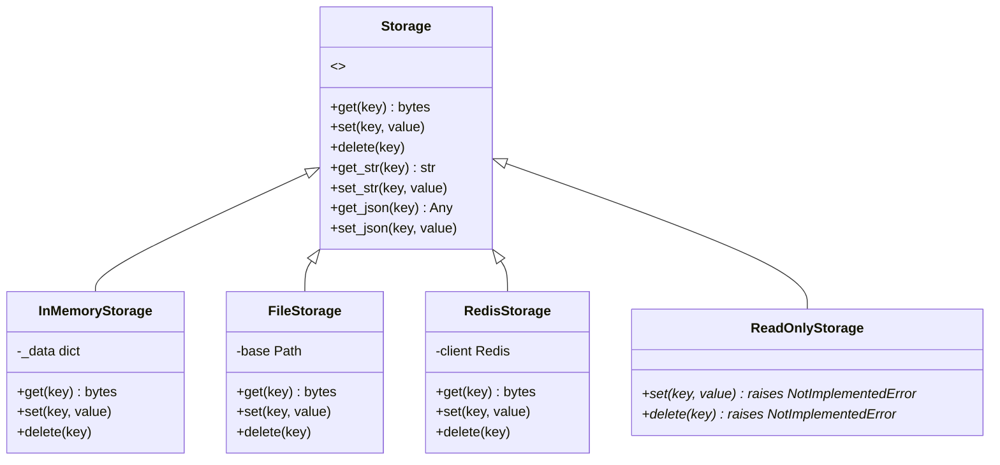
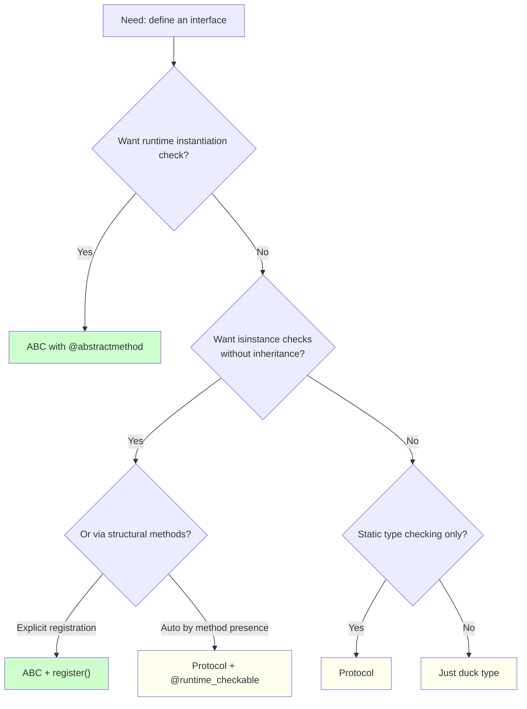

# 1. Abstract Base Classes

> [!note] Why this note exists
> Abstract Base Classes (ABCs) are Python's mechanism for **nominal interface definition**: you write a class with `@abstractmethod`-decorated methods, and Python refuses to let anyone instantiate it until every abstract method is implemented by a subclass. ABCs also support `isinstance` and `issubclass` checks, virtual subclass registration (`register()`), and mixin methods that work in terms of a small number of required abstract methods (so `collections.abc.Sequence` gives you `__contains__`, `__iter__`, `__reversed__`, `index`, and `count` for free if you implement just `__getitem__` and `__len__`). This note covers the `abc` module, `ABC` base class, `@abstractmethod` and the (deprecated) abstract property/classmethod/staticmethod decorators, concrete methods in ABCs, virtual subclasses, and when to choose an ABC over a `typing.Protocol` (see [[2. Protocols]]). ABCs power much of the standard library — `collections.abc`, `numbers`, `io`, `asyncio` — and understanding them is the prerequisite for designing clean inheritance hierarchies and writing code that "feels Pythonic" to consumers.

## Why It Matters

ABCs sit at the intersection of three Python features: inheritance, `isinstance`, and interface enforcement. Knowing them lets you:

- **Enforce interface contracts.** Subclasses *must* implement `save()`, `load()`, `delete()` — Python raises `TypeError` at instantiation if they don't. This catches missing methods at construction time, not at runtime call time.
- **Provide mixin methods.** `collections.abc.Mapping` gives you `__contains__`, `keys`, `values`, `items`, `get`, `__eq__`, `__ne__` if you implement `__getitem__`, `__iter__`, `__len__`. This is the canonical Python pattern for "implement a few methods, get many for free".
- **Make `isinstance` meaningful.** `isinstance(obj, Sequence)` doesn't require `obj`'s class to inherit from `Sequence` — it can be registered as a virtual subclass, or duck-typed (with `__subclasshook__`).
- **Document the interface.** An ABC's abstract methods *are* the interface. Reading an ABC is faster than reading prose docs.
- **Replace runtime type checks.** Instead of `if hasattr(obj, 'read') and hasattr(obj, 'write')`, use `isinstance(obj, io.IOBase)`.
- **Build plugin systems.** Define `Plugin` ABC with `name` and `run` abstract methods; subclasses auto-register (via `__init_subclass__`, see [[17. Metaprogramming/3. type and Dynamic Class Creation|type and Dynamic Class Creation]]); at startup, walk `Plugin.__subclasses__()`.
- **Understand the stdlib.** `collections.abc`, `numbers` (Number, Real, Rational, Integral), `io` (IOBase, RawIOBase, BufferedIOBase, TextIOBase), `asyncio` (Future, Task) — all use ABCs.
- **Bridge to structural typing.** `Protocol` (see [[2. Protocols]]) is the structural alternative; this note covers when to use which.

If you've ever written `class Plugin(ABC):` or wondered why `isinstance([1,2,3], collections.abc.Sequence)` returns `True` even though `list` doesn't inherit from `Sequence` — this note explains both.

## Background

### The problem ABCs solve

Without ABCs, Python has two ways to express "this object supports X":

1. **Duck typing** — try the operation, catch `AttributeError`. Flexible but verbose; see [[10. Pythonic Programming/7. EAFP and Duck Typing|EAFP and Duck Typing]].
2. **`isinstance(obj, SomeClass)`** — works, but requires `SomeClass` to actually be in `obj`'s MRO. What if you want to check "anything with `read` and `write` methods" without forcing every readable/writable class to inherit from a common base?

ABCs solve the second problem via **virtual subclass registration**:

```python
from abc import ABC

class Serializable(ABC):
    pass

class MyData: pass

Serializable.register(MyData)
print(issubclass(MyData, Serializable))  # True
print(isinstance(MyData(), Serializable))  # True
```

`MyData` doesn't inherit from `Serializable` — but `isinstance` claims it does. This is the "virtual subclass" pattern, used throughout the stdlib to make `isinstance` useful for built-in types.

### `abc.ABC` and `abc.ABCMeta`

```python
from abc import ABC, abstractmethod

class Animal(ABC):
    @abstractmethod
    def sound(self):
        ...

# Try to instantiate:
Animal()  # TypeError: Can't instantiate abstract class Animal with abstract method sound

class Dog(Animal):
    def sound(self):
        return "Woof"

Dog().sound()  # "Woof" — OK now
```

`ABC` is a helper class with `metaclass=ABCMeta`. `ABCMeta` is the metaclass (see [[17. Metaprogramming/4. Metaclasses|Metaclasses]]) that tracks abstract methods via the `__abstractmethods__` set; `type.__call__` checks this set and refuses to instantiate if it's non-empty.

You can use `ABCMeta` directly if you need to combine it with another metaclass:

```python
from abc import ABCMeta

class MyABC(metaclass=ABCMeta):
    pass
```

### The `@abstractmethod` decorator

```python
class Shape(ABC):
    @abstractmethod
    def area(self):
        """Return the area of the shape."""

    @abstractmethod
    def perimeter(self):
        """Return the perimeter of the shape."""
```

`@abstractmethod` sets `__isabstractmethod__ = True` on the function; `ABCMeta.__new__` collects these into `__abstractmethods__`. A subclass is concrete only when *every* name in `__abstractmethods__` is overridden with a non-abstract method (or attribute).

```python
class Circle(Shape):
    def __init__(self, r): self.r = r
    def area(self): return 3.14 * self.r ** 2
    # Forgot perimeter

Circle(1)  # TypeError: Can't instantiate abstract class Circle with abstract method perimeter

class Circle(Shape):
    def __init__(self, r): self.r = r
    def area(self): return 3.14 * self.r ** 2
    def perimeter(self): return 2 * 3.14 * self.r

Circle(1)  # OK
```

### `@abstractproperty`, `@abstractclassmethod`, `@abstractstaticmethod`

These were added in Python 3.2 and **deprecated in Python 3.3**. The modern way is to combine `@property`/`@classmethod`/`@staticmethod` with `@abstractmethod`:

```python
# DEPRECATED (still works, but discouraged)
from abc import abstractproperty, abstractclassmethod

class Old(ABC):
    @abstractproperty
    def x(self): ...
    @abstractclassmethod
    def from_dict(cls, d): ...

# MODERN
class New(ABC):
    @property
    @abstractmethod
    def x(self): ...

    @classmethod
    @abstractmethod
    def from_dict(cls, d): ...
```

Note the **decorator order**: `@abstractmethod` is the *innermost* (bottom) decorator. This is critical — `@abstractmethod` sets `__isabstractmethod__`, and the outer decorator (`@property`, `@classmethod`, `@staticmethod`) must preserve this attribute. The built-in decorators do, but custom decorators might not.

### Concrete methods in ABCs

ABCs can contain fully-implemented methods, often called **mixins** (see [[3. Mixins]]):

```python
class Stack(ABC):
    @abstractmethod
    def push(self, item): ...
    @abstractmethod
    def pop(self): ...

    def swap(self):
        """Swap the top two elements."""
        a = self.pop()
        b = self.pop()
        self.push(a)
        self.push(b)

    def peek(self):
        item = self.pop()
        self.push(item)
        return item
```

`swap` and `peek` are concrete — they're written in terms of the abstract methods. This is the mixin pattern: implement a small "kernel" of abstract methods, get many concrete methods for free.

`collections.abc` is the canonical example:

- `Sequence` requires `__getitem__` and `__len__`; provides `__contains__`, `__iter__`, `__reversed__`, `index`, `count`.
- `Mapping` requires `__getitem__`, `__iter__`, `__len__`; provides `__contains__`, `keys`, `items`, `values`, `get`, `__eq__`, `__ne__`.
- `Set` requires `__contains__`, `__iter__`, `__len__`; provides `__le__`, `__lt__`, `__eq__`, `__ne__`, `__gt__`, `__ge__`, `__and__`, `__or__`, `__sub__`, `__xor__`, `isdisjoint`.

This is enormous productivity leverage — implement 3 methods, get 10.

## Main content

### A complete ABC example

```python
from abc import ABC, abstractmethod

class Storage(ABC):
    """Persistent key-value storage interface."""

    @abstractmethod
    def get(self, key: str) -> bytes | None:
        """Return the bytes for `key`, or None if not found."""

    @abstractmethod
    def set(self, key: str, value: bytes) -> None:
        """Store `value` under `key`."""

    @abstractmethod
    def delete(self, key: str) -> None:
        """Remove `key`. No-op if not present."""

    # Concrete methods built on the abstract kernel:
    def get_str(self, key: str) -> str | None:
        raw = self.get(key)
        return raw.decode('utf-8') if raw is not None else None

    def set_str(self, key: str, value: str) -> None:
        self.set(key, value.encode('utf-8'))

    def get_json(self, key: str):
        import json
        raw = self.get_str(key)
        return json.loads(raw) if raw is not None else None

    def set_json(self, key: str, value) -> None:
        import json
        self.set_str(key, json.dumps(value))

class InMemoryStorage(Storage):
    def __init__(self):
        self._data = {}
    def get(self, key):
        return self._data.get(key)
    def set(self, key, value):
        self._data[key] = value
    def delete(self, key):
        self._data.pop(key, None)

class FileStorage(Storage):
    def __init__(self, base_dir):
        from pathlib import Path
        self.base = Path(base_dir)
        self.base.mkdir(parents=True, exist_ok=True)
    def _path(self, key):
        return self.base / key
    def get(self, key):
        p = self._path(key)
        return p.read_bytes() if p.exists() else None
    def set(self, key, value):
        self._path(key).write_bytes(value)
    def delete(self, key):
        p = self._path(key)
        if p.exists():
            p.unlink()

# Usage:
storage = InMemoryStorage()
storage.set_json('user:1', {'name': 'Alice'})
print(storage.get_json('user:1'))  # {'name': 'Alice'}
```

`InMemoryStorage` and `FileStorage` only implement 3 abstract methods; they inherit 4 concrete methods (`get_str`, `set_str`, `get_json`, `set_json`) for free.

### ABC hierarchy example



### Virtual subclasses via `register()`

```python
from abc import ABC

class Drawable(ABC):
    @abstractmethod
    def draw(self): ...

class MyWidget:
    def draw(self):
        print("drawing widget")

# MyWidget doesn't inherit from Drawable — but we can register it:
Drawable.register(MyWidget)
print(isinstance(MyWidget(), Drawable))  # True
print(issubclass(MyWidget, Drawable))   # True
```

`register()` doesn't transfer any methods — it just makes `isinstance`/`issubclass` return `True`. This is used by `collections.abc` to register built-in types:

```python
import collections.abc
print(isinstance([1,2,3], collections.abc.Sequence))  # True
# `list` is registered as a virtual subclass of Sequence.
```

You can also use `register` as a decorator:

```python
@Drawable.register
class MyOtherWidget:
    def draw(self): ...
```

### `__subclasshook__`: automatic virtual subclasses

`register()` is explicit. `__subclasshook__` is the automatic version — a classmethod that decides whether a given class should be considered a subclass:

```python
class Drawable(ABC):
    @abstractmethod
    def draw(self): ...

    @classmethod
    def __subclasshook__(cls, subclass):
        if cls is Drawable:
            if any('draw' in C.__dict__ for C in subclass.__mro__):
                return True
        return NotImplemented

class Widget:
    def draw(self): ...

print(isinstance(Widget(), Drawable))  # True — automatic!
```

This is how `collections.abc.Sequence` makes `isinstance([1,2,3], Sequence)` return `True` without explicit `register()`. The hook checks for the right dunder methods.

> [!warning]
> `__subclasshook__` is powerful but easy to get wrong. Most custom ABCs don't need it — use `register()` for explicit virtual subclasses, or just use `Protocol` (see [[2. Protocols]]) for structural typing.

### ABC vs Protocol: nominal vs structural

```python
# ABC (nominal): must explicitly inherit
class Drawable(ABC):
    @abstractmethod
    def draw(self): ...

class Widget(Drawable):  # explicit inheritance
    def draw(self): ...

isinstance(Widget(), Drawable)  # True

# Protocol (structural): any class with draw() qualifies
from typing import Protocol

class DrawableP(Protocol):
    def draw(self) -> None: ...

class Widget:  # no inheritance
    def draw(self) -> None: ...

# isinstance check requires @runtime_checkable
```

See [[2. Protocols]] for the full comparison. The short version: ABCs are nominal (you must inherit); Protocols are structural (you just need the methods). ABCs enforce at instantiation; Protocols enforce (if at all) only via static type checkers.

### Why use ABCs (vs just duck typing)



### Common ABCs in the stdlib

```python
# collections.abc — iterables, containers, sequences, mappings, sets
from collections.abc import (
    Iterable, Iterator, Generator, Reversible,
    Container, Collection, Sized,
    Sequence, MutableSequence,
    Mapping, MutableMapping,
    Set, MutableSet,
    Hashable, Callable, Awaitable, Coroutine, AsyncIterable, AsyncIterator,
)

# numbers — numeric tower
from numbers import Number, Complex, Real, Rational, Integral

# io — I/O base classes
from io import IOBase, RawIOBase, BufferedIOBase, TextIOBase

# asyncio — async primitives
from asyncio import Future, Task
```

When implementing a custom container, inherit from the appropriate `collections.abc` class to get mixin methods for free:

```python
from collections.abc import Mapping

class TreeDict(Mapping):
    def __init__(self):
        self._data = {}
    def __getitem__(self, key):
        return self._data[key]
    def __iter__(self):
        return iter(self._data)
    def __len__(self):
        return len(self._data)

t = TreeDict()
t._data['a'] = 1
print(t['a'])        # 1
print('a' in t)      # True — provided by Mapping
print(list(t.keys()))   # ['a'] — provided by Mapping
print(t.get('b', 0)) # 0 — provided by Mapping
```

### ABC and `__init_subclass__`: auto-registration

```python
class Plugin(ABC):
    _registry = []

    @abstractmethod
    def run(self): ...

    def __init_subclass__(cls, **kwargs):
        super().__init_subclass__(**kwargs)
        Plugin._registry.append(cls)

class CSVLoader(Plugin):
    def run(self): return "loading CSV"

class JSONLoader(Plugin):
    def run(self): return "loading JSON"

print([c.__name__ for c in Plugin._registry])  # ['CSVLoader', 'JSONLoader']
```

This combines ABCs (for interface enforcement) with `__init_subclass__` (for registration) — a powerful pattern for plugin systems.

### Enforcing abstract methods on properties

```python
class Config(ABC):
    @property
    @abstractmethod
    def api_key(self) -> str:
        """Subclasses must provide an api_key property."""

class ProdConfig(Config):
    @property
    def api_key(self) -> str:
        return "prod-key"

class BadConfig(Config):
    pass  # forgot api_key

ProdConfig().api_key  # OK
BadConfig()  # TypeError: abstract class
```

### Multiple ABCs

A class can inherit from multiple ABCs:

```python
from abc import ABC, abstractmethod
from collections.abc import Iterable, Sized

class DataSet(Iterable, Sized, ABC):
    @abstractmethod
    def mean(self): ...

# Subclass must implement __iter__, __len__ (from Iterable, Sized) and mean()
```

Just be careful about method conflicts — see [[3. Mixins]] for cooperative multiple inheritance patterns.

## Common Pitfalls

1. **Forgetting `@abstractmethod` on the abstract method.** Without it, the method is just a regular method that does nothing useful — no enforcement.

2. **Decorating with `@abstractmethod` outside (above) `@property`/`@classmethod`/`@staticmethod`.** Order matters: `@abstractmethod` must be the innermost (bottom) decorator.

3. **Using deprecated `@abstractproperty` / `@abstractclassmethod` / `@abstractstaticmethod`.** They still work but are discouraged. Use `@property` + `@abstractmethod` instead.

4. **Instantiating an ABC directly.** `Animal()` raises `TypeError` if `Animal` has abstract methods. The error message names the missing methods.

5. **Subclassing but forgetting one abstract method.** Same `TypeError` — Python lists the missing methods.

6. **Calling `super().abstract_method()` from a concrete implementation.** It works (returns the abstract method's body, often `...` or `raise NotImplementedError`), but it's not enforced. Make sure your abstract method body is `...` or `raise NotImplementedError`.

7. **Confusing `register()` with inheritance.** `register()` doesn't transfer methods or attributes — it only makes `isinstance`/`issubclass` return `True`.

8. **Forgetting that `register()` virtual subclasses don't get the ABC's concrete methods.** A registered virtual subclass gets *nothing* from the ABC except isinstance checks.

9. **Implementing `__subclasshook__` incorrectly.** Returning `True` for too many classes defeats the purpose; returning `NotImplemented` lets other hooks decide.

10. **Believing ABCs enforce interface at static-analysis time.** They enforce at *runtime instantiation*. Static type checkers (mypy, pyright) use `Protocol` for structural checks; ABCs are also recognised statically, but the runtime check is the main benefit.

11. **Using ABCs when duck typing suffices.** Don't add an ABC just to add one. If your code does `if isinstance(obj, Storage):`, an ABC is justified; if it just calls `obj.get()`, duck typing is enough.

12. **Forgetting that `__abstractmethods__` is a frozenset of names.** Subclass implementations must override each *name* — a different name (even with the same body) doesn't count.

13. **Defining an ABC with no abstract methods.** It works (the class is instantiable), but it's misleading — readers expect abstract methods. If you want a marker class with no abstract methods, use a plain class or `typing.Protocol`.

14. **Mixing metaclass-based ABCs with other metaclasses.** `ABCMeta` is a metaclass; combining with another metaclass requires a combined metaclass (see [[17. Metaprogramming/4. Metaclasses|Metaclasses]]).

15. **Using ABCs for performance.** `isinstance(obj, ABC)` is fast, but the abstraction overhead of extra method calls can be measurable in hot loops. Profile before optimising.

16. **Forgetting that `@abstractmethod` works on any callable, not just functions.** It works on `@property`, `@classmethod`, `@staticmethod`, and custom descriptors — as long as the outer decorator preserves `__isabstractmethod__`.

## Tips and Tricks

- **Inherit from `ABC` for new abstract classes.** It sets `metaclass=ABCMeta` automatically.
- **Use `ABCMeta` directly if you need a custom metaclass** combined with ABC behaviour.
- **`@abstractmethod` *below* `@property`/`@classmethod`/`@staticmethod`.** Always innermost.
- **Read `collections.abc` source** to see how mixin methods work. It's the canonical example.
- **Inherit from `collections.abc.Sequence` / `Mapping` / `Set`** to get mixin methods for free.
- **`register()` for virtual subclasses** — explicit, used for built-in types in the stdlib.
- **`__subclasshook__` for automatic virtual subclasses** — powerful but tricky; usually `Protocol` is better for structural typing.
- **Combine ABCs with `__init_subclass__`** for plugin registration.
- **ABCs work with static type checkers.** `mypy` and `pyright` understand them.
- **For "interface only" (no mixins), consider `Protocol`** — see [[2. Protocols]].
- **Concrete methods in ABCs are mixin methods.** They should be written in terms of the abstract methods, not external state.
- **`@abstractmethod` on `__init__`** forces subclasses to define their own `__init__`. Useful for "must configure" base classes.
- **`@abstractmethod` on `__enter__` and `__exit__`** for abstract context managers.
- **`@abstractmethod` on `__iter__`** for abstract iterables.
- **`@abstractmethod` on `__len__` and `__getitem__`** for abstract sequences.
- **For "must implement `__eq__`" ABCs, mark `__eq__` abstract** — subclasses are forced to define it.
- **`ABCMeta.__subclasshook__` is the structural-typing bridge** between ABC and Protocol worlds.
- **Test ABCs by checking `isinstance(Sub(), ABC)` returns `True` and `isinstance(ABC, type)` returns `True`** (the ABC is a class, not an instance).
- **For "abstract attribute" (not method)**, use `@property` + `@abstractmethod`. There's no `@abstractattribute`.
- **Reading `numbers.py`** shows how to layer numeric ABCs (Number → Complex → Real → Rational → Integral).
- **For "this method must be overridden but I provide a default"**, mark `@abstractmethod` and provide a body that `raise NotImplementedError`. Subclasses can call `super().method()` for the default behaviour.

## Active Recall

1. What module provides ABC support in Python? Name the two main exports.
2. What does `@abstractmethod` do? What happens if you try to instantiate a class with unimplemented abstract methods?
3. What's the correct decorator order for an abstract property? For an abstract classmethod?
4. Why were `@abstractproperty` / `@abstractclassmethod` / `@abstractstaticmethod` deprecated?
5. What's a "concrete method in an ABC"? Give an example from `collections.abc`.
6. What does `Drawable.register(MyWidget)` do? What doesn't it do?
7. What is `__subclasshook__`? When would you use it instead of `register()`?
8. Write an ABC `Storage` with abstract `get`/`set`/`delete` and concrete `get_json`/`set_json`.
9. How does `isinstance([1,2,3], collections.abc.Sequence)` return `True` even though `list` doesn't inherit from `Sequence`?
10. What's the difference between nominal and structural typing? Which one do ABCs provide?
11. When should you use an ABC vs a Protocol vs plain duck typing?
12. How does `ABCMeta` track abstract methods? (Hint: `__abstractmethods__`.)
13. Can a class inherit from multiple ABCs? What about method conflicts?
14. Write an ABC `Plugin` with `run` abstract and auto-registration via `__init_subclass__`.
15. Can `@abstractmethod` be applied to `__init__`? What does that enforce?
16. What happens if you call `super().abstract_method()` from a concrete implementation?
17. Does an ABC need at least one abstract method? What happens if it has none?
18. How does `collections.abc.Mapping` provide `keys()`, `items()`, `values()` for free?
19. Write a `__subclasshook__` that returns `True` for any class with a `draw` method.
20. What's the metaclass of an `ABC` subclass? How can you tell?

## Next Steps

- [[2. Protocols]] — the structural alternative to ABCs.
- [[3. Mixins]] — concrete-method patterns in ABCs and standalone mixin classes.
- [[4. Dataclasses]] — `@dataclass` works well with ABCs.
- [[5. Descriptors Deep Dive]] — descriptors + ABCs in real ORMs.
- [[17. Metaprogramming/3. type and Dynamic Class Creation]] — `__init_subclass__` for plugin registration.
- [[17. Metaprogramming/4. Metaclasses]] — `ABCMeta` is a metaclass; understand metaclasses to extend ABCs.
- [[8. Object-Oriented Programming/3. Inheritance]] — ABCs as a special case of inheritance.
- [[8. Object-Oriented Programming/4. Polymorphism and Duck Typing]] — when ABCs are unnecessary.
