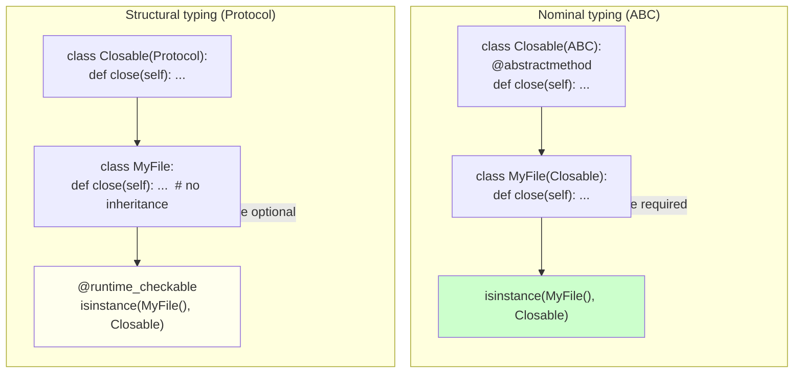
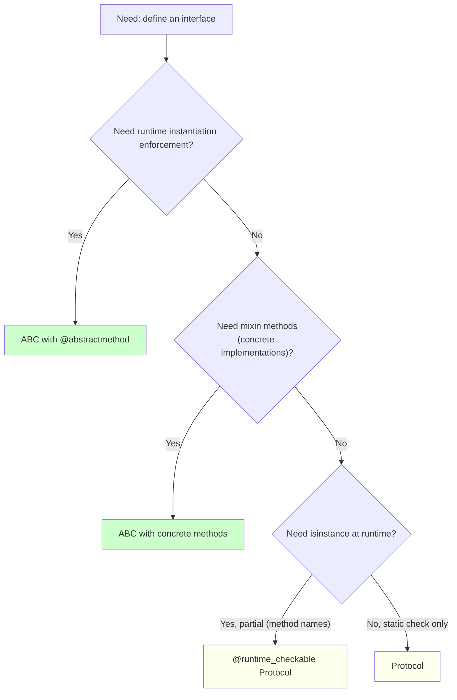

# 2. Protocols

> [!note] Why this note exists
> `typing.Protocol` (PEP 544, Python 3.8+) is the **structural typing** counterpart to ABCs. With a Protocol, you write a class-like definition listing the methods/attributes an object must have — and *any* class that has those methods is considered to satisfy the Protocol, *without inheriting from it*. This is "static duck typing": mypy and pyright enforce the contract at type-check time, and (with `@runtime_checkable`) you can use `isinstance` for partial runtime checks. This note covers how to define a Protocol, `@runtime_checkable`, comparison with ABCs (nominal vs structural), when to use each, and the limits of runtime checks. Protocols are the modern way to express interfaces in typed Python — they're how `typing.SupportsInt`, `typing.SupportsFloat`, `collections.abc` Protocol aliases, and most modern library APIs (e.g., `httpx.Auth`, `pydantic.BaseSettings`) express "anything that quacks like this". Read alongside [[1. Abstract Base Classes]] for the nominal-vs-structural comparison and [[11. Type Hinting/3. Protocols and Structural Typing|Protocols and Structural Typing]] for the type-hinting angle.

## Why It Matters

Protocols let you express contracts *without forcing inheritance*. Knowing them lets you:

- **Decouple interface from implementation.** A function can accept "anything with a `close()` method" without forcing every caller to inherit from `Closable`.
- **Retrofit types onto existing code.** `requests`, `numpy`, `pandas` objects can satisfy Protocols you define, even though they don't inherit from your base class.
- **Avoid metaclasses and ABCs.** For "interface only" use cases (no mixin methods), a Protocol is simpler and composes better.
- **Get static checking for free.** mypy/pyright flag Protocol violations at type-check time, before runtime.
- **Use `isinstance` checks where appropriate.** `@runtime_checkable` Protocols support `isinstance`, with caveats (only method signatures, not bodies).
- **Document intent.** A Protocol definition reads as "this is the shape of thing I need" — clearer than a prose docstring.
- **Combine with `typing` features.** Protocols can be generic, can have `Self`-returning methods, can be `final`, can be composed (`X & Y` intersection).
- **Bridge static and dynamic worlds.** Protocols are statically checked; `@runtime_checkable` adds partial runtime checking for when you can't trust types (e.g., plugin loading, RPC).

If you've ever written `def process(obj): obj.read(); obj.close()` and wished you could express "anything readable and closable" without an ABC — Protocols are the answer.

## Background

### Nominal vs structural typing

| | Nominal | Structural |
|---|---|---|
| Example languages | Java, C#, Python (with ABCs) | Go (interfaces), TypeScript, Python (with Protocols) |
| Rule | A type `T` satisfies interface `I` if `T` explicitly declares it does (via `extends`/`implements`) | A type `T` satisfies interface `I` if `T` has the methods/attributes `I` requires |
| Python mechanism | ABCs (subclassing) | Protocols (PEP 544) |
| `isinstance(obj, I)` | Works automatically | Only with `@runtime_checkable`, and only for method presence (not signature) |

```python
# Nominal (ABC)
from abc import ABC, abstractmethod
class Closable(ABC):
    @abstractmethod
    def close(self) -> None: ...

class MyFile(Closable):  # explicit inheritance required
    def close(self) -> None: ...

# Structural (Protocol)
from typing import Protocol
class ClosableP(Protocol):
    def close(self) -> None: ...

class MyFile:  # no inheritance
    def close(self) -> None: ...

def close_all(*items: ClosableP) -> None:
    for item in items:
        item.close()

close_all(MyFile(), open('/tmp/x'), open('/tmp/y'))  # OK — all have close()
```

### Protocol history

- **PEP 544** (Python 3.8, 2019) — formalised `typing.Protocol` and `@runtime_checkable`.
- **Python 3.7** had `typing_extensions.Protocol` as a backport.
- Before Protocols, the stdlib used ABCs with `__subclasshook__` for structural checks (e.g., `collections.abc.Hashable` works on any class with `__hash__`). Protocols replaced this pattern.
- `mypy` had its own `Protocol` before PEP 544; PEP 544 standardised it.

## Main content

### Defining a Protocol

```python
from typing import Protocol

class Drawable(Protocol):
    def draw(self) -> None: ...

def render(item: Drawable) -> None:
    item.draw()

class Circle:
    def draw(self) -> None:
        print("drawing circle")

class Square:
    def draw(self) -> None:
        print("drawing square")

render(Circle())  # OK — Circle has draw()
render(Square())  # OK — Square has draw()
```

`Circle` and `Square` don't inherit from `Drawable`. mypy/pyright infer structural matching: "Circle has a `draw(self) -> None` method, so it satisfies `Drawable`."

The body of the method in the Protocol is conventionally `...` (Ellipsis) — it's never called. (You can put a docstring there instead.)

### `@runtime_checkable`

```python
from typing import Protocol, runtime_checkable

@runtime_checkable
class Drawable(Protocol):
    def draw(self) -> None: ...

class Circle:
    def draw(self) -> None: ...

print(isinstance(Circle(), Drawable))  # True
```

Without `@runtime_checkable`, `isinstance(Circle(), Drawable)` raises `TypeError`. With it, `isinstance` returns `True` if the object has all the methods/attributes the Protocol requires.

> [!warning]
> `@runtime_checkable` only checks *method names exist*, not their signatures, parameter types, or return types. `isinstance(obj, Drawable)` returns `True` even if `obj.draw` takes 5 required arguments instead of 0. For full type checking, use a static checker (mypy/pyright).

### Methods, properties, and attributes

```python
from typing import Protocol

class User(Protocol):
    name: str           # attribute
    @property
    def display_name(self) -> str: ...   # property

    def greet(self, other: 'User') -> None: ...  # method with Protocol-typed param
```

`User` requires:
- A `name` attribute of type `str`.
- A `display_name` property of type `str`.
- A `greet` method taking another `User`.

Static checkers verify all three. Runtime `isinstance` only checks method names (not attributes or properties).

### Generic Protocols

```python
from typing import Protocol, TypeVar

T = TypeVar('T')

class Stack(Protocol[T]):
    def push(self, item: T) -> None: ...
    def pop(self) -> T: ...

def use_int_stack(s: Stack[int]) -> None:
    s.push(1)
    x: int = s.pop()

class IntStack:
    def push(self, item: int) -> None: ...
    def pop(self) -> int: ...

use_int_stack(IntStack())  # OK
```

Protocols can be generic — useful for container types, iterators, etc.

### Self-returning Protocols

```python
from typing import Protocol, Self

class Cloneable(Protocol):
    def clone(self) -> Self: ...

class Point:
    def __init__(self, x: int, y: int):
        self.x, self.y = x, y
    def clone(self) -> Self:
        return Point(self.x, self.y)  # actually, return type should be Point

# Note: Self (Python 3.11+) means "the type of the current class".
# For older Python, use a TypeVar bound to the class.
```

`Self` (PEP 673, Python 3.11+) is the modern way to express "returns an instance of the same class". For older versions, use a bound TypeVar.

### Protocols with default methods

```python
from typing import Protocol

class Greeter(Protocol):
    def greet(self) -> str:
        return "Hello"  # default implementation

    def farewell(self) -> str:
        return "Goodbye"
```

You can provide default method implementations in a Protocol — but they're only available if a class *explicitly inherits* from the Protocol. Structurally-matching classes (that don't inherit) don't get the defaults. This blurs the line between Protocol and ABC; prefer keeping Protocols pure (no defaults) and using ABCs for mixins.

### Composition: intersection

```python
from typing import Protocol

class Readable(Protocol):
    def read(self) -> bytes: ...

class Writable(Protocol):
    def write(self, data: bytes) -> None: ...

def copy(src: Readable, dst: Writable) -> None:
    dst.write(src.read())

# Or, a single function that takes both:
def transform(rw: Readable & Writable) -> None:  # Python 3.10+ intersection (PEP 604 doesn't cover intersection)
    data = rw.read()
    rw.write(data.upper())
```

> [!note]
> Python's type system supports intersection via `Readable & Writable` syntax only in some type checkers (pyright supports `&` for Protocol intersection). The portable way is multiple parameters: `def transform(r: Readable, w: Writable)` where both are the same object.

### Protocol vs ABC: full comparison



| Aspect | ABC | Protocol |
|---|---|---|
| Type system | Nominal | Structural |
| Inheritance required | Yes | No |
| `isinstance` check | Automatic | Only with `@runtime_checkable` (method names only) |
| Mixin methods | Yes (concrete methods) | Possible but discouraged |
| Static checking | Yes (mypy/pyright) | Yes (mypy/pyright) |
| Runtime instantiation enforcement | Yes (TypeError) | No |
| Composable with other ABCs/metaclasses | Yes (via MRO) | Yes (no metaclass involvement) |
| When to use | Need instantiation enforcement, mixins, or shared base class | Interface only, retrofit onto existing types, structural matching |

### When to use Protocol vs ABC



Use **Protocol** when:
- You want to express an interface without forcing inheritance.
- You want to type-check existing classes (requests, pandas, etc.) without modifying them.
- You're writing library code that should accept "anything that looks like X".
- You don't need mixin methods.

Use **ABC** when:
- You need to prevent instantiation of the base class.
- You want to provide mixin methods that subclasses inherit.
- You need `isinstance` to work automatically (without `@runtime_checkable`).
- You're writing an inheritance hierarchy with shared base behaviour.

### Real-world Protocol examples

- **`typing.SupportsInt`, `typing.SupportsFloat`, `typing.SupportsBytes`, `typing.SupportsComplex`, `typing.SupportsAbs`, `typing.SupportsRound`** — built-in Protocols for common operations.
- **`typing.Iterable`, `typing.Iterator`, `typing.Sized`, `typing.Container`, `typing.Hashable`** — aliases for `collections.abc` members, also Protocol-compatible.
- **`httpx.Auth`** — Protocol for HTTP authentication handlers.
- **`pydantic_settings.BaseSettings` sources** — Protocols for settings sources.
- **`pytest` fixture protocols** — Protocols for fixtures, hooks, plugins.
- **`asyncio` protocols** — `Protocol` (the async kind), `BufferedProtocol`, `DatagramProtocol` are nominally typed but conceptually Protocol-like.

### `Protocol` and `Protocol[T]` (generic)

```python
from typing import Protocol, TypeVar

K = TypeVar('K')
V = TypeVar('V')

class Mapping(Protocol[K, V]):
    def __getitem__(self, key: K) -> V: ...
    def __iter__(self): ...

def get_first(m: Mapping[str, int]) -> int | None:
    try:
        key = next(iter(m))
        return m[key]
    except StopIteration:
        return None
```

Generic Protocols let you express container-like interfaces with full type safety.

### Protocols and `__init__`

```python
class Config(Protocol):
    api_key: str
    base_url: str

class MyConfig:
    def __init__(self, api_key: str, base_url: str):
        self.api_key = api_key
        self.base_url = base_url

c: Config = MyConfig("key", "https://api.example.com")  # OK — has the attributes after __init__
```

A class satisfies a Protocol if it has the required attributes *after `__init__`*. Static checkers verify the `__init__` sets them.

### Combining Protocols and ABCs

You can use both:
- An ABC for runtime enforcement and mixins.
- A Protocol for the static interface used by external code.

```python
from abc import ABC, abstractmethod
from typing import Protocol

# Internal ABC: enforces interface, provides mixins
class _StorageBase(ABC):
    @abstractmethod
    def get(self, key: str) -> bytes | None: ...
    @abstractmethod
    def set(self, key: str, value: bytes) -> None: ...

    def get_str(self, key: str) -> str | None:
        raw = self.get(key)
        return raw.decode() if raw else None

# External Protocol: structural, for type hints in user code
class Storage(Protocol):
    def get(self, key: str) -> bytes | None: ...
    def set(self, key: str, value: bytes) -> None: ...

def use_storage(s: Storage) -> None:  # accepts _StorageBase AND any class with get/set
    s.set('k', b'v')
```

This pattern lets you have both runtime enforcement (via ABC) and flexible structural typing (via Protocol).

### Limits of `@runtime_checkable`

```python
@runtime_checkable
class Adder(Protocol):
    def add(self, a: int, b: int) -> int: ...

class BadAdder:
    def add(self):  # wrong signature!
        return 42

print(isinstance(BadAdder(), Adder))  # True — signature not checked!
```

`isinstance` with a `@runtime_checkable` Protocol only checks method *name* presence. The signature is verified statically by mypy/pyright, not at runtime.

### Protocol with `Self` and inheritance

```python
from typing import Protocol, Self

class Comparable(Protocol):
    def __lt__(self, other: Self) -> bool: ...

def min_(a: Comparable, b: Comparable) -> Comparable:
    return a if a < b else b

class Int:
    def __init__(self, x: int): self.x = x
    def __lt__(self, other: Self) -> bool:
        return self.x < other.x

print(min_(Int(1), Int(2)).x)  # 1
```

`Self` ensures `__lt__` compares two objects of the *same* class — not just any `Comparable`.

## Common Pitfalls

1. **Expecting `isinstance` to verify method signatures.** `@runtime_checkable` only checks method *names*. For full type checking, use a static checker.

2. **Using `isinstance` on a non-`@runtime_checkable` Protocol.** Raises `TypeError`. Add the decorator.

3. **Adding mixin methods to a Protocol.** They only work for classes that *explicitly inherit* from the Protocol — defeating the structural purpose. Use an ABC instead.

4. **Forgetting that Protocol methods are not called.** The body is conventionally `...` (Ellipsis). Putting real code there is misleading.

5. **Confusing Protocol (typing) with `asyncio.Protocol`.** They're completely different — `asyncio.Protocol` is a base class for async I/O handlers. The name collision is unfortunate.

6. **Defining a Protocol with non-method attributes only.** A Protocol with `x: int` and no methods works statically, but `@runtime_checkable` `isinstance` doesn't check attributes.

7. **Expecting Protocols to be enforced at runtime instantiation.** They aren't. ABCs are; Protocols aren't.

8. **Trying to subclass a Protocol with a regular class and expecting mixin behaviour.** Only the methods you explicitly define are inherited; the Protocol's "shape" doesn't add behaviour.

9. **Forgetting that `Self` requires Python 3.11+.** For older versions, use a `TypeVar` bound to the class.

10. **Using a Protocol where duck typing suffices.** If you're not using a static type checker, a Protocol adds no value over a plain class with a docstring.

11. **Defining a Protocol that's too narrow.** A Protocol with 10 required methods is hard to satisfy; consider breaking it into smaller Protocols.

12. **Defining a Protocol that's too broad.** A Protocol with `Any` everywhere provides no static safety.

13. **Forgetting that Protocol attributes (not methods) aren't runtime-checkable.** `isinstance(obj, P)` where `P` has `x: int` only checks methods, not whether `obj.x` exists.

14. **Combining Protocols with `Generic` incorrectly.** `class Stack(Protocol[T])` is correct; `class Stack(Protocol, Generic[T])` is the older form.

15. **Using `Protocol` as a base class for runtime classes.** `class MyStack(Stack): ...` works (explicit inheritance) but loses the structural-typing benefit — any class matching the shape is still accepted.

16. **Forgetting that Protocol composition (intersection) is not well-supported.** `A & B` for Protocols is supported by pyright but not by mypy as of 2024. Use multiple parameters or `Intersection` from `typing_extensions`.

## Tips and Tricks

- **Default to Protocols for "interface only" use cases.** Use ABCs when you need mixins or instantiation enforcement.
- **Use `@runtime_checkable` sparingly.** It's a partial check; static checkers do better.
- **`Protocol` methods use `...` (Ellipsis) as the body.** Convention, not enforced.
- **Generic Protocols via `Protocol[T]`** for container-like interfaces.
- **`Self` (3.11+) for self-returning methods.** Use bound TypeVar for older Python.
- **Compose Protocols via multiple inheritance:** `class ReadWrite(Readable, Writable, Protocol): ...` — this is *union* (requires all methods), not intersection.
- **For "this OR that" types, use `Union[A, B]` or `A | B`.** Protocols don't directly support union (intersection of two Protocols is the same as composing them).
- **Document Protocols with docstrings on the class and each method.** Static checkers use them for hover tooltips in IDEs.
- **`typing.Protocol` is preferred over `typing_extensions.Protocol`** in Python 3.8+.
- **For gradual typing of existing code, define Protocols that match existing classes.** No code changes needed in the existing classes.
- **`final` on a Protocol means it can't be subclassed.** Useful to lock in an interface.
- **`@runtime_checkable` checks method names only.** For attribute checks, write your own `isinstance`-like helper.
- **Use Protocols for plugin systems.** Define `Plugin` Protocol; plugins satisfy it without inheriting; loader uses `isinstance` (with `@runtime_checkable`) or just calls methods.
- **For "duck-typed but checked" APIs, define a Protocol and annotate.** Users get static checking without inheritance.
- **`reveal_type(x)` in mypy shows the inferred type.** Useful for debugging Protocol matching.
- **`typing.cast(MyProtocol, obj)` tells mypy "trust me, this satisfies the Protocol".** Use sparingly.
- **Reading the `typing` module source** is instructive — many built-in Protocols are defined there.
- **For "structural + nominal", define both a Protocol (for typing) and an ABC (for runtime).** See "Combining Protocols and ABCs" above.
- **`mypy --strict` enables Protocol checking.** Without it, mypy may silently accept non-matching types.
- **`Protocol` doesn't support `__init__` requirements directly.** A class satisfies a Protocol after `__init__` runs; if `__init__` doesn't set required attributes, the class doesn't satisfy the Protocol.

## Active Recall

1. What's the difference between nominal and structural typing? Which Python feature provides each?
2. Write a Protocol `Drawable` with a `draw` method. Use it as a type hint.
3. What does `@runtime_checkable` enable? What are its limits?
4. Can a class satisfy a Protocol without inheriting from it? How?
5. What's the conventional body for a Protocol method?
6. How do you define a generic Protocol? Give an example with `Stack[T]`.
7. What's `Self`? When would you use it in a Protocol?
8. When should you use a Protocol instead of an ABC?
9. When should you use an ABC instead of a Protocol?
10. Can you provide default method implementations in a Protocol? What's the caveat?
11. How does `isinstance` work with `@runtime_checkable` Protocols? What doesn't it check?
12. How do you compose two Protocols (require all methods of both)?
13. What's the difference between `asyncio.Protocol` and `typing.Protocol`?
14. Can a Protocol have attributes (not methods)? Are they runtime-checked?
15. How would you retrofit a Protocol onto `requests.Session` without modifying it?
16. Write a Protocol `Comparable` with `__lt__` using `Self`.
17. What's the intersection of two Protocols? How do you express it in Python?
18. Why are mixin methods in Protocols discouraged?
19. How would you combine a Protocol (for typing) with an ABC (for runtime enforcement)?
20. What does `mypy --strict` do for Protocol checking?

## Next Steps

- [[1. Abstract Base Classes]] — the nominal counterpart to Protocols.
- [[3. Mixins]] — concrete-method patterns; usually paired with ABCs, not Protocols.
- [[11. Type Hinting/3. Protocols and Structural Typing|Protocols and Structural Typing]] — the type-hinting angle.
- [[11. Type Hinting/1. Basic Type Hints|Basic Type Hints]] — foundations of typing.
- [[11. Type Hinting/2. Generics and TypeVar|Generics and TypeVar]] — generic Protocols.
- [[11. Type Hinting/5. mypy and pyright|mypy and pyright]] — the static checkers that enforce Protocols.
- [[8. Object-Oriented Programming/4. Polymorphism and Duck Typing|Polymorphism and Duck Typing]] — the runtime duck-typing story.
- [[10. Pythonic Programming/7. EAFP and Duck Typing|EAFP and Duck Typing]] — when to skip Protocols entirely.
