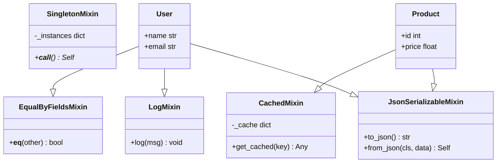
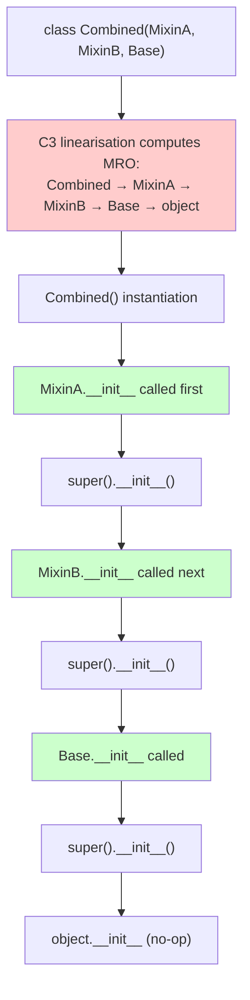

# 3. Mixins

> [!note] Why this note exists
> A mixin is a small, focused class that provides a single piece of behaviour (logging, serialisation, comparison, caching, persistence) designed to be combined with other classes via multiple inheritance. Mixins are *not* meant to be instantiated on their own — they're partial classes that contribute methods, expecting the host class to provide the rest. This note covers what makes a class a mixin (vs a base class), common mixin patterns from the stdlib and popular libraries, the pitfalls of multiple inheritance (MRO conflicts, attribute collisions, `super()` confusion), and **cooperative multiple inheritance** — the discipline of writing mixins that compose correctly with `super()`. Mixins are how `collections.abc` provides 10 methods from 3, how Django's class-based views compose (`LoginRequiredMixin + FormView`), and how Python's stdlib mixes functionality into `dict`, `list`, and `str` subclasses. Read alongside [[1. Abstract Base Classes]] (ABCs are often mixin providers) and [[8. Object-Oriented Programming/3. Inheritance]] (MRO basics).

## Why It Matters

Mixins let you build complex classes from small, reusable pieces. Knowing them lets you:

- **Compose behaviour, not inherit monoliths.** Instead of a `LoggedInFormViewWithCaching`, write `LoginRequiredMixin + CachedMixin + FormView` — each piece is testable and reusable.
- **Provide default implementations for ABCs.** `collections.abc.Mapping` is an ABC that's also a mixin: implement `__getitem__`, `__iter__`, `__len__` and you get 7 more methods.
- **Add cross-cutting concerns.** Logging, caching, auditing, serialisation, permission checking — each is a single mixin.
- **Use Django/Flask class-based views effectively.** Django's CBV system is built entirely on mixins; understanding the MRO is essential.
- **Avoid code duplication.** A `JsonSerializableMixin` written once can be applied to 100 classes.
- **Understand `super()`.** Cooperative multiple inheritance requires every class in the MRO to call `super().method()` — even methods that "shouldn't" need it. This is the single most important mixin discipline.
- **Reason about MRO.** Why does `class C(A, B)` have a specific MRO? Why does C3 linearisation matter? Mixins make these questions practical.
- **Build plugin systems.** Plugin mixins add features to a base plugin class without modifying it.

If you've ever struggled with `super()` not doing what you expect in a multiple-inheritance hierarchy, the answer is almost always "you need cooperative mixins".

## Background

### What is a mixin?

A mixin is a class that:

1. **Provides a single, focused piece of behaviour.** Not a full-featured class — just one feature.
2. **Is not meant to be instantiated alone.** It expects the host class to provide certain methods or attributes.
3. **Composes via multiple inheritance.** You combine multiple mixins with a base class.
4. **Doesn't extend the host's primary type identity.** A `LogMixin` doesn't make the host "a Log" — it adds logging.

Compare:

```python
# Base class: full-featured, meant to be inherited
class Animal:
    def __init__(self, name): self.name = name
    def describe(self): return f"Animal {self.name}"

# Mixin: focused, adds one feature, expects host to have certain attrs
class LogMixin:
    def log(self, msg):
        # Expects self.name to exist (provided by host)
        print(f"[{self.name}] {msg}")

# Concrete class: combines base + mixin
class Dog(Animal, LogMixin):
    def bark(self):
        self.log("Woof!")

d = Dog("Rex")
d.bark()  # [Rex] Woof!
```

`LogMixin` is a mixin: it adds logging and expects `self.name`. `Animal` is a base class: full-featured, meant to be inherited.

### Mixins vs ABCs vs base classes

| | Mixin | ABC | Base class |
|---|---|---|---|
| Purpose | Add a single feature | Define an interface | Provide shared implementation |
| Instantiable alone | No (usually) | No (if abstract) | Yes |
| Has abstract methods | Sometimes | Yes | No (usually) |
| Provides concrete methods | Yes | Sometimes | Yes |
| Combined via | Multiple inheritance | Single inheritance (usually) | Single inheritance |

The boundaries are fuzzy — `collections.abc.Mapping` is both an ABC (has abstract methods) and a mixin (provides concrete methods built on the abstracts).

### Common mixin patterns



## Main content

### Pattern 1: Serialisation mixin

```python
import json

class JsonSerializableMixin:
    """Adds to_json / from_json to any class with a __dict__."""
    def to_json(self) -> str:
        return json.dumps(vars(self))

    @classmethod
    def from_json(cls, data: str):
        obj = cls.__new__(cls)  # bypass __init__
        obj.__dict__.update(json.loads(data))
        return obj

class User(JsonSerializableMixin):
    def __init__(self, name, email):
        self.name = name
        self.email = email

u = User("Alice", "alice@example.com")
data = u.to_json()
print(data)  # {"name": "Alice", "email": "alice@example.com"}
u2 = User.from_json(data)
print(u2.name)  # Alice
```

The mixin assumes the host has a `__dict__` (which most classes do — but `__slots__` classes don't). For `__slots__` support, the mixin would need to know the slot names.

### Pattern 2: Logging mixin

```python
import logging

class LogMixin:
    """Adds a self.log method that uses a class-specific logger."""
    @property
    def logger(self):
        name = f"{type(self).__module__}.{type(self).__qualname__}"
        return logging.getLogger(name)

    def log(self, msg, level=logging.INFO):
        self.logger.log(level, msg)

class Worker(LogMixin):
    def run(self):
        self.log("Starting work")
        # ...
        self.log("Done")

logging.basicConfig(level=logging.INFO)
Worker().run()
# INFO:__main__.Worker:Starting work
# INFO:__main__.Worker:Done
```

The mixin provides `self.logger` and `self.log`. The host doesn't need to know about logging.

### Pattern 3: Comparison mixin

```python
from functools import total_ordering

@total_ordering
class EqualByFieldsMixin:
    """__eq__ and __lt__ based on a `_fields` tuple of attribute names."""
    _fields: tuple[str, ...] = ()

    def __eq__(self, other):
        if not isinstance(other, type(self)):
            return NotImplemented
        return all(getattr(self, f) == getattr(other, f) for f in self._fields)

    def __lt__(self, other):
        if not isinstance(other, type(self)):
            return NotImplemented
        return tuple(getattr(self, f) for f in self._fields) < tuple(getattr(other, f) for f in self._fields)

    def __hash__(self):
        return hash(tuple(getattr(self, f) for f in self._fields))

class Point(EqualByFieldsMixin):
    _fields = ('x', 'y')
    def __init__(self, x, y):
        self.x, self.y = x, y

print(Point(1, 2) == Point(1, 2))  # True
print(Point(1, 2) < Point(1, 3))   # True
print(Point(1, 2) <= Point(1, 2))  # True (from @total_ordering)
```

The mixin uses `_fields` to define equality. `@total_ordering` (from `functools`) fills in the missing comparison operators.

### Pattern 4: Caching mixin

```python
class CachedMixin:
    """Caches method results per-instance."""
    _cache: dict

    def __init__(self, *args, **kwargs):
        super().__init__(*args, **kwargs)  # cooperative
        self._cache = {}

    def get_or_compute(self, key, compute_fn):
        if key not in self._cache:
            self._cache[key] = compute_fn()
        return self._cache[key]

class ExpensiveCalculator(CachedMixin):
    def fib(self, n):
        return self.get_or_compute(('fib', n), lambda: self._fib(n))

    def _fib(self, n):
        if n < 2: return n
        return self.fib(n - 1) + self.fib(n - 2)

c = ExpensiveCalculator()
print(c.fib(50))  # fast — cached
```

### Pattern 5: Singleton mixin (using `__init_subclass__`)

```python
class SingletonMixin:
    _instances: dict = {}

    def __new__(cls, *args, **kwargs):
        if cls not in cls._instances:
            cls._instances[cls] = super().__new__(cls)
        return cls._instances[cls]

class Database(SingletonMixin):
    def __init__(self):
        print("Initializing")

d1 = Database()  # Initializing
d2 = Database()  # (no print — __init__ still called, but __new__ returns existing instance)
print(d1 is d2)  # True
```

Note: `__init__` is called every time, even when `__new__` returns an existing instance. This is a known singleton gotcha — guard with a `_initialised` flag if needed.

### Cooperative multiple inheritance: the `super()` discipline

The single most important rule for mixins: **every method that participates in multiple inheritance must call `super().method()`**, even if the superclass doesn't appear to have that method. This is because the MRO chains the calls.

```python
class Base:
    def greet(self):
        return "Hello"

class LoudMixin:
    def greet(self):
        return super().greet().upper() + "!!!"

class PoliteMixin:
    def greet(self):
        return super().greet() + " How are you?"

class Friendly(LoudMixin, PoliteMixin, Base):
    def greet(self):
        return super().greet() + " I'm friendly!"

print(Friendly().greet())
# HELLO!!! How are you? I'm friendly!
```

Wait, that's not quite right. Let me trace the MRO:

```python
print(Friendly.__mro__)
# Friendly -> LoudMixin -> PoliteMixin -> Base -> object
```

So:
1. `Friendly().greet()` calls `Friendly.greet`.
2. `Friendly.greet` calls `super().greet()` → `LoudMixin.greet`.
3. `LoudMixin.greet` calls `super().greet()` → `PoliteMixin.greet`.
4. `PoliteMixin.greet` calls `super().greet()` → `Base.greet`.
5. `Base.greet` returns `"Hello"`.

Working back up:
- `PoliteMixin.greet`: `"Hello" + " How are you?"` = `"Hello How are you?"`
- `LoudMixin.greet`: `"HELLO HOW ARE YOU?" + "!!!"` = `"HELLO HOW ARE YOU?!!!"`
- `Friendly.greet`: `"HELLO HOW ARE YOU?!!!" + " I'm friendly!"` = `"HELLO HOW ARE YOU?!!! I'm friendly!"`

So the output is `"HELLO HOW ARE YOU?!!! I'm friendly!"`.

The critical insight: every mixin called `super().greet()` even though it had no idea what came next in the MRO. This is **cooperative multiple inheritance** — each class contributes its piece and chains to the next. If any class had failed to call `super()`, the chain breaks.

### The `__init__` chain

```python
class Base:
    def __init__(self, **kwargs):
        super().__init__(**kwargs)  # cooperative
        self.base_attr = kwargs.get('base_attr')

class MixinA:
    def __init__(self, **kwargs):
        super().__init__(**kwargs)  # cooperative
        self.a_attr = kwargs.get('a_attr')

class MixinB:
    def __init__(self, **kwargs):
        super().__init__(**kwargs)  # cooperative
        self.b_attr = kwargs.get('b_attr')

class Combined(MixinA, MixinB, Base):
    pass

c = Combined(a_attr=1, b_attr=2, base_attr=3)
print(c.a_attr, c.b_attr, c.base_attr)  # 1 2 3
```

Using `**kwargs` is essential — each class pops what it needs and passes the rest to `super().__init__(**kwargs)`. This is the pattern used by Django's class-based views.

### MRO conflicts and how to resolve them

```python
class A:
    def foo(self): return "A"

class B:
    def foo(self): return "B"

class C(A, B):
    pass

print(C().foo())  # "A" — C's MRO is [C, A, B, object], so A.foo wins
print(C.__mro__)
# (<class 'C'>, <class 'A'>, <class 'B'>, <class 'object'>)
```

C3 linearisation computes the MRO deterministically. The rule: a class appears before its parents, and the relative order of parents is preserved. If the constraints can't be satisfied (e.g., `class D(B, A)` where `class C(A, B)` already exists and is a base), Python raises `TypeError`.

### Attribute conflicts

```python
class LoggingMixin:
    def __init__(self):
        super().__init__()
        self.label = "Logger"

class CachingMixin:
    def __init__(self):
        super().__init__()
        self.label = "Cache"

class Both(LoggingMixin, CachingMixin):
    pass

b = Both()
print(b.label)  # "Logger" — LoggingMixin runs first in MRO
```

Both mixins set `self.label`. The MRO order determines which wins. To avoid this, use unique attribute names (`_log_label`, `_cache_label`) or namespace prefixes.

### The diamond problem

```python
class A:
    def __init__(self):
        print("A.__init__")
        super().__init__()

class B(A):
    def __init__(self):
        print("B.__init__")
        super().__init__()

class C(A):
    def __init__(self):
        print("C.__init__")
        super().__init__()

class D(B, C):
    def __init__(self):
        print("D.__init__")
        super().__init__()

D()
# D.__init__
# B.__init__
# C.__init__
# A.__init__
```

The diamond problem (D inherits from B and C, both inherit from A) is solved by C3 linearisation: A's `__init__` is called exactly once, despite being an ancestor of both B and C. Without `super()`, A would be called twice (B's `A.__init__(self)` and C's `A.__init__(self)`).

### Mixin composition flow



### Mixin pitfalls

```python
# Pitfall 1: Mixin assumes attribute that host doesn't provide
class GreeterMixin:
    def greet(self):
        return f"Hello, {self.name}!"  # assumes self.name

class Item(GreeterMixin):
    pass  # no name attribute!

Item().greet()  # AttributeError: 'Item' object has no attribute 'name'

# Pitfall 2: Forgetting super().__init__()
class CounterMixin:
    def __init__(self):
        self.count = 0  # forgot super().__init__()!

class Base:
    def __init__(self):
        self.base_attr = 1

class Bad(CounterMixin, Base):
    pass

Bad()  # base_attr is never set!

# Pitfall 3: Mixin method conflicts
class SortAscMixin:
    def sort(self):
        return sorted(self.items)  # ascending

class SortDescMixin:
    def sort(self):
        return sorted(self.items, reverse=True)  # descending

class Both(SortAscMixin, SortDescMixin):
    def __init__(self):
        self.items = [3, 1, 2]

Both().sort()  # ascending (MRO: Both → SortAscMixin → SortDescMixin)
```

### Django class-based views: a real-world mixin system

```python
# Django-style mixins (simplified)
class View:
    def dispatch(self, request, *args, **kwargs):
        method = request.method.lower()
        handler = getattr(self, f'handle_{method}', self.http_method_not_allowed)
        return handler(request, *args, **kwargs)

    def http_method_not_allowed(self, request, *args, **kwargs):
        return f"405: {request.method} not allowed"

class LoginRequiredMixin:
    def dispatch(self, request, *args, **kwargs):
        if not request.user.is_authenticated:
            return "302: redirect to login"
        return super().dispatch(request, *args, **kwargs)

class TemplateView(View):
    template_name: str

    def get(self, request):
        return f"render {self.template_name}"

class MyView(LoginRequiredMixin, TemplateView):
    template_name = "home.html"

# Request flow:
# MyView().dispatch(request) → LoginRequiredMixin.dispatch
#   → checks auth → super().dispatch → View.dispatch
#   → routes to handle_get → TemplateView.get
```

Each mixin adds a layer (`LoginRequiredMixin` adds auth check; `TemplateView` adds `get` rendering). The `super()` chain handles the routing.

### When NOT to use mixins

- **When composition would be clearer.** `obj.logger.info(...)` is often clearer than mixing `LogMixin` into `obj`'s class.
- **When the mixin adds too much.** A "mixin" with 20 methods is a base class.
- **When the mixin would conflict with existing methods.** Two mixins defining `sort` is asking for trouble.
- **When you don't control the MRO.** If users will subclass your class with their own mixins, design for cooperation — but accept you can't predict everything.
- **When `@dataclass` or another decorator would do.** Many mixin patterns (comparison, repr) are now built-in.

### Mixin vs decorator

| | Mixin | Decorator |
|---|---|---|
| Mechanism | Multiple inheritance | Function that modifies class |
| Composition | `class C(A, B)` | `@dec_a @dec_b class C` |
| Methods added | Yes | Yes (via `cls.method = ...`) |
| Instance state | Yes (via `self`) | Yes (via `self`) |
| Multiple inheritance issues | Yes (MRO, conflicts) | No |
| When to use | When the host needs to *be* the type | When the host needs the behaviour |

For pure cross-cutting concerns, decorators compose better. For type relationships (is a Logger, is a Serializable), mixins are appropriate.

## Common Pitfalls

1. **Forgetting `super().__init__()`.** Without it, the chain breaks and other mixins/base classes don't get initialised.

2. **Using positional args in `__init__` of cooperative classes.** `def __init__(self, x)` breaks the chain because subclasses can't pass `x` along. Use `**kwargs`.

3. **Attribute name conflicts.** Two mixins setting `self.data` will collide. Use unique names or namespace prefixes.

4. **Method name conflicts.** Two mixins defining `sort` — only one wins (per MRO). Document this clearly or rename.

5. **Assuming `super()` calls the parent class.** It calls the *next class in the MRO*, which may not be the parent in the source code. This is the source of much confusion.

6. **Mixins that don't make sense alone.** A `LogMixin` instance by itself is useless. Document this with `__init_subclass__` checks or by making it an ABC.

7. **Deep MRO chains.** Five mixins deep, debugging `super()` calls is hard. Keep hierarchies shallow.

8. **Believing mixins are "just multiple inheritance".** They are, but with the discipline that each class is small, focused, and cooperative.

9. **Forgetting that `super()` is dynamic.** `super().method()` in `MixinA` might call `Base.method` or `MixinB.method` depending on the MRO of the concrete class — not the MRO of `MixinA`.

10. **Using class-level mutable attributes.** `class Mixin: items = []` — the list is shared across all instances of all classes using the mixin. Initialise in `__init__`.

11. **Instantiating a mixin directly.** Mixins usually aren't designed for direct use. Mark with `ABC` if you want to prevent it.

12. **Multiple `__new__` overrides.** `SingletonMixin` overrides `__new__`. Combining two `__new__`-overriding mixins is fragile.

13. **Believing mixins are exempt from `__slots__` rules.** `__slots__` and `__dict__` interact with mixins just like with regular classes.

14. **Forgetting that `__init_subclass__` fires for mixins too.** If your mixin defines `__init_subclass__`, it'll fire when subclasses are created.

15. **Mixing metaclasses via mixins.** If two mixins have different metaclasses (rare but possible), you'll hit metaclass conflict. See [[17. Metaprogramming/4. Metaclasses|Metaclasses]].

## Tips and Tricks

- **Every cooperative `__init__` should accept `**kwargs` and pass to `super().__init__(**kwargs)`.** Required for composable mixins.
- **Name mixin classes with the `Mixin` suffix.** Conventional and clear.
- **Use unique attribute names** (e.g., `_log_logger`, `_cache_data`) to avoid conflicts.
- **`super().method()` not `Base.method(self)`.** The latter breaks cooperative multiple inheritance.
- **Document required attributes/methods** in the mixin's docstring. "Expects host to provide `self.name`."
- **Test mixins in isolation** by creating a minimal host class.
- **For `__init__` chains, use `**kwargs`** — positional args don't compose.
- **`@total_ordering` (from `functools`)** fills in comparison operators if you define `__eq__` and one of `__lt__`/`__le__`/`__gt__`/`__ge__`.
- **Django CBV mixins are the canonical example** of cooperative multiple inheritance. Read `django.views.generic` source.
- **`collections.abc` provides mixin-style ABCs** — `Mapping`, `Sequence`, etc. give many methods for few abstracts.
- **For "is a Logger" type relationships, use a Mixin.** For "has logging capability", use composition (a `logger` attribute).
- **`functools.cached_property`** can replace a caching mixin in many cases.
- **`@dataclass`** can replace many comparison/serialisation mixins.
- **Keep mixins small and focused.** A 200-line mixin is a base class in disguise.
- **Use `__init_subclass__` to enforce mixin contracts** — e.g., require host to define certain attributes.
- **For plugins, combine `__init_subclass__`-based registration with a mixin interface.** See [[17. Metaprogramming/3. type and Dynamic Class Creation|type and Dynamic Class Creation]].
- **`super()` in `__new__`** works the same way as in `__init__` — use it for cooperative singletons.
- **`inspect.getmro(cls)` shows the MRO.** Indispensable for debugging cooperative hierarchies.
- **For mixins that add type information (e.g., `LogMixin` adds `logger`), use `Protocol`** for static typing without inheritance.
- **Mixin methods can be overridden in the host.** The host's method runs first (host is earlier in the MRO than the mixin).
- **For "abstract mixin" (requires host to provide a method), use ABC + @abstractmethod.** This gives you runtime enforcement.

## Active Recall

1. What is a mixin? How does it differ from a base class?
2. Why must cooperative mixins call `super().method()` even when the parent doesn't have that method?
3. Write a `LogMixin` that adds `self.log(msg)` using `logging`.
4. Write a `JsonSerializableMixin` with `to_json` and `from_json`.
5. What's the diamond problem? How does C3 linearisation solve it?
6. Why should cooperative `__init__` methods use `**kwargs`?
7. Write three mixins (A, B, C) that each add a piece to a `greet()` method via `super()`.
8. What's the MRO of `class D(B, C)` where `B(A)` and `C(A)`?
9. What happens if two mixins both define `sort`?
10. Why is `self.items = []` at class level a bug in a mixin?
11. How would you enforce that a mixin's host provides `self.name`?
12. What's the difference between a mixin and a class decorator? When would you use each?
13. Write a `SingletonMixin` using `__new__`. What's the `__init__` gotcha?
14. How does Django's `LoginRequiredMixin` work? Trace the `super()` chain.
15. Why is `super().method()` dynamic — not just calling the parent class?
16. What's the MRO of `class Friendly(LoudMixin, PoliteMixin, Base)`?
17. When should you NOT use a mixin? Give two examples.
18. How does `collections.abc.Mapping` function as both an ABC and a mixin?
19. Write an `EqualByFieldsMixin` that uses `_fields` and `@total_ordering`.
20. Why is `Base.method(self)` worse than `super().method()` in cooperative hierarchies?

## Next Steps

- [[1. Abstract Base Classes]] — ABCs are often mixin providers.
- [[2. Protocols]] — when to use structural typing instead of mixins.
- [[4. Dataclasses]] — `@dataclass` replaces many mixin patterns (comparison, repr).
- [[8. Object-Oriented Programming/3. Inheritance]] — MRO basics, single inheritance.
- [[8. Object-Oriented Programming/8. Composition vs Inheritance]] — when to prefer composition over mixins.
- [[17. Metaprogramming/4. Metaclasses]] — mixins that need metaclass cooperation.
- [[9. Standard Library Deep Dive/4. collections]] — `collections.abc` mixins in action.
- [[9. Standard Library Deep Dive/6. functools]] — `@total_ordering`, `@cached_property` as mixin alternatives.
