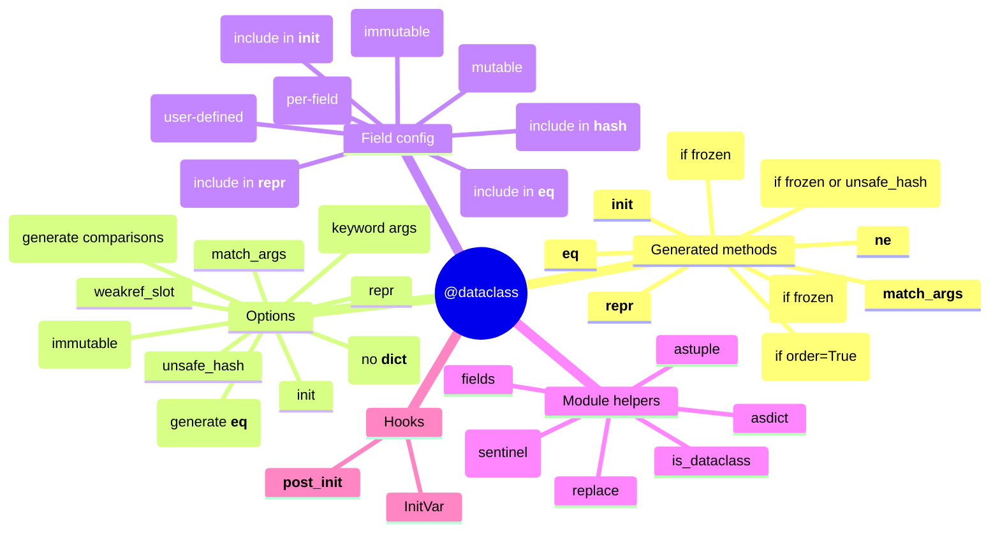
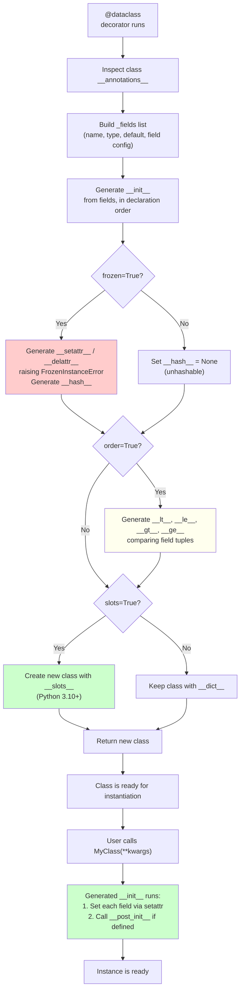

# 4. Dataclasses

> [!note] Why this note exists
> `@dataclass` (PEP 557, Python 3.7+) is a class decorator that auto-generates `__init__`, `__repr__`, `__eq__`, `__hash__`, `__lt__`/`__le__`/`__gt__`/`__ge__`, and `__setattr__`/`__delattr__` (for `frozen=True`) based on class-level type annotations. It eliminates the boilerplate of writing the same six methods for every "data holder" class — the kind of class that's just fields with maybe a little validation. This note covers the decorator's options (`frozen`, `eq`, `order`, `repr`, `slots`, `kw_only`, `match_args`, `init`), `field()` for per-attribute configuration (`default`, `default_factory`, `init`, `repr`, `compare`, `hash`, `metadata`), inheritance with dataclasses, the `__post_init__` hook, the `dataclasses` module helpers (`asdict`, `astuple`, `fields`, `replace`, `is_dataclass`), and the modernisation arc from Python 3.7 to 3.12. `@dataclass` is the modern replacement for `collections.namedtuple`, `typing.NamedTuple`, and hand-written value objects — read alongside [[4. Data Structures/3. Tuples and Named Tuples|Tuples and Named Tuples]] for the namedtuple comparison.

## Why It Matters

Dataclasses eliminate the most common Python boilerplate. Knowing them lets you:

- **Stop writing `__init__`, `__repr__`, `__eq__` by hand.** `@dataclass` generates them correctly, handling edge cases (inheritance, defaults, mutables) that hand-written versions often get wrong.
- **Use mutable defaults safely.** `field(default_factory=list)` is the correct way to have a per-instance list — `dataclass` rejects `x: list = []` at class creation time.
- **Make immutable value objects.** `@dataclass(frozen=True)` generates `__setattr__`/`__delattr__` that raise `FrozenInstanceError`. Immutable objects are easier to reason about, hashable, and safe for concurrent access.
- **Get ordering for free.** `@dataclass(order=True)` generates all six comparison operators, in declaration order.
- **Use slots for memory efficiency.** `@dataclass(slots=True)` (Python 3.10+) generates `__slots__`, saving 200+ bytes per instance — critical for large datasets.
- **Force keyword-only arguments.** `@dataclass(kw_only=True)` (Python 3.10+) prevents positional-argument confusion in classes with many fields.
- **Use `__post_init__` for validation and derived fields.** Run after `__init__` populates fields — perfect for validation, computing derived attributes, or converting types.
- **Serialise and replace easily.** `dataclasses.asdict`, `astuple`, `replace` provide dict/tuple conversion and copy-with-changes.
- **Inherit cleanly.** Dataclass inheritance handles defaults, overrides, and field ordering sensibly.
- **Use with type checkers.** mypy/pyright understand dataclasses — they check field types, default compatibility, and inheritance.
- **Use with `match` statements.** Dataclasses support structural pattern matching (Python 3.10+) via auto-generated `__match_args__`.

If you've ever written `def __init__(self, x, y): self.x = x; self.y = y` and `def __repr__(self): return f"Foo({self.x}, {self.y})"` for the hundredth time, dataclasses are the answer.

## Background

### Before dataclasses

```python
# Old-style value object (Python 3.6 and earlier)
class Point:
    def __init__(self, x, y):
        self.x = x
        self.y = y
    def __repr__(self):
        return f"Point({self.x!r}, {self.y!r})"
    def __eq__(self, other):
        if not isinstance(other, Point):
            return NotImplemented
        return self.x == other.x and self.y == other.y
    def __hash__(self):
        return hash((self.x, self.y))

# Or with namedtuple:
from collections import namedtuple
Point = namedtuple('Point', ['x', 'y'])  # immutable, but no methods, no defaults
```

Both have drawbacks:
- Hand-written: lots of boilerplate, easy to forget `__hash__`, mutable-default pitfalls.
- `namedtuple`: immutable (sometimes too much), inherits from `tuple` (surprising `isinstance`), no method bodies, no `__post_init__`.

`@dataclass` solves both:

```python
from dataclasses import dataclass

@dataclass(frozen=True)
class Point:
    x: int
    y: int
```

That's it. `__init__`, `__repr__`, `__eq__`, `__hash__` are all generated. Two lines of "real" code, six methods.

### PEP 557 history

- Python 3.7 (2018): `@dataclass` introduced (PEP 557).
- Python 3.10 (2021): `slots=True`, `kw_only=True` added (PEP 681).
- Python 3.11 (2022): `dataclass_transform` for third-party dataclass-like decorators (Pydantic, attrs).
- Python 3.12 (2023): no major changes; `@dataclass` is stable.
- The popular `attrs` library predates `@dataclass` and inspired much of its design. `attrs` is still more featureful (validators, converters, slots without 3.10+).

## Main content

### The basic decorator

```python
from dataclasses import dataclass

@dataclass
class User:
    name: str
    age: int
    email: str = ""  # default

u = User("Alice", 30)
print(u)  # User(name='Alice', age=30, email='')
print(u == User("Alice", 30))  # True (auto-generated __eq__)
```

By default, `@dataclass` generates:
- `__init__(self, name, age, email="")` — parameters in declaration order, with defaults for fields that have them.
- `__repr__` — `User(name='Alice', age=30, email='')`.
- `__eq__` — compares all fields.
- `__match_args__` — tuple of field names for pattern matching.
- `__hash__` — set to `None` (because the class is mutable by default, so unhashable).

### Decorator options

```python
@dataclass(
    init=True,         # generate __init__ (default: True)
    repr=True,         # generate __repr__ (default: True)
    eq=True,           # generate __eq__ (default: True)
    order=False,       # generate __lt__, __le__, __gt__, __ge__ (default: False)
    unsafe_hash=False, # generate __hash__ even if eq=True and frozen=False (default: False)
    frozen=False,      # make instances immutable (default: False)
    match_args=True,   # generate __match_args__ (default: True, 3.10+)
    kw_only=False,     # all fields are keyword-only (default: False, 3.10+)
    slots=False,       # generate __slots__ (default: False, 3.10+)
    weakref_slot=False, # add __weakref__ slot (default: False, 3.10+)
)
class Config: ...
```

### `frozen=True` for immutability

```python
@dataclass(frozen=True)
class Point:
    x: int
    y: int

p = Point(1, 2)
p.x = 5  # FrozenInstanceError: cannot assign to field 'x'
```

`frozen=True` generates `__setattr__` and `__delattr__` that raise `FrozenInstanceError` (subclass of `AttributeError`). It also makes the class hashable (via `__hash__` based on field values).

```python
print(hash(Point(1, 2)))  # works
print(Point(1, 2) == Point(1, 2))  # True
print({Point(1, 2), Point(1, 2)})  # {Point(x=1, y=2)} — deduplicated
```

> [!note]
> `frozen=True` does *not* make the field values themselves immutable. `Point(x=[1,2,3])` has a mutable list as `x`; you just can't reassign `p.x`. For deep immutability, use `tuple` instead of `list`, `frozenset` instead of `set`, etc.

### `eq` and `order`

```python
@dataclass(order=True)
class Version:
    major: int
    minor: int
    patch: int

print(Version(1, 0, 0) < Version(1, 0, 1))  # True
print(sorted([Version(2, 0, 0), Version(1, 9, 0), Version(1, 0, 5)]))
# [Version(major=1, minor=0, patch=5), Version(major=1, minor=9, patch=0), Version(major=2, minor=0, patch=0)]
```

`order=True` requires `eq=True` (the default). Comparison is by field tuple, in declaration order.

### `field()` for per-attribute configuration

```python
from dataclasses import dataclass, field

@dataclass
class Product:
    name: str
    price: float
    tags: list = field(default_factory=list)  # mutable default!
    internal_id: int = field(default=0, repr=False, compare=False)
    created_at: str = field(default_factory=lambda: "2024-01-01", metadata={"format": "ISO"})

p = Product("Widget", 9.99)
print(p)  # Product(name='Widget', price=9.99, tags=[], created_at='2024-01-01')
# Note: internal_id is hidden from repr

p2 = Product("Widget", 9.99, internal_id=42)
print(p == p2)  # True — internal_id excluded from compare
```

`field()` options:
- `default`: the default value (for immutables). Mutables use `default_factory`.
- `default_factory`: a zero-arg callable that returns the default (for mutables).
- `init`: include in `__init__`? Default `True`. If `False`, you must provide a default.
- `repr`: include in `__repr__`? Default `True`.
- `compare`: include in `__eq__`/`__hash__`/comparison? Default `True`.
- `hash`: include in `__hash__`? Default: same as `compare`.
- `metadata`: a mapping for user-defined metadata (read by other libraries).

### Mutable default gotcha (and the fix)

```python
# WRONG — shared mutable default
@dataclass
class Bad:
    items: list = []  # ValueError at class creation: mutable default not allowed

# RIGHT — default_factory
@dataclass
class Good:
    items: list = field(default_factory=list)

# RIGHT — tuple (immutable)
@dataclass
class AlsoGood:
    coords: tuple = ()
```

`@dataclass` actively rejects mutable defaults — it raises `ValueError` at class creation time. This is one of its best features.

### `slots=True` for memory efficiency (Python 3.10+)

```python
@dataclass(slots=True)
class Point:
    x: int
    y: int

p = Point(1, 2)
p.z = 3  # AttributeError — no __dict__, no arbitrary attrs
```

`slots=True` generates `__slots__`, which:
- Removes the per-instance `__dict__` (~200 bytes saved per instance).
- Speeds up attribute access (no dict lookup).
- Prevents adding arbitrary attributes.

For a million small objects, this saves hundreds of MB.

> [!warning]
> `slots=True` and `frozen=True` together generate a `__slots__` class with `__setattr__` raising `FrozenInstanceError`. Both work together correctly as of Python 3.10+.

### `kw_only=True` for keyword-only args (Python 3.10+)

```python
@dataclass(kw_only=True)
class Config:
    host: str
    port: int = 8080
    debug: bool = False

Config("localhost")  # TypeError: missing 1 required keyword-only argument: 'host'
Config(host="localhost")  # OK
Config(host="localhost", port=9000, debug=True)  # OK
```

`kw_only=True` forces all fields to be keyword-only — preventing the positional-argument confusion that comes with classes that have many fields.

You can also set `kw_only` per field:

```python
@dataclass
class Mixed:
    a: int
    b: int = field(kw_only=True, default=0)

Mixed(1, b=2)  # OK — a is positional, b is keyword-only
Mixed(1, 2)    # TypeError
```

### `__post_init__` for validation and derived fields

```python
from dataclasses import dataclass, field

@dataclass
class Rectangle:
    width: float
    height: float
    area: float = field(init=False)  # not in __init__

    def __post_init__(self):
        if self.width <= 0 or self.height <= 0:
            raise ValueError("Dimensions must be positive")
        self.area = self.width * self.height

r = Rectangle(3, 4)
print(r.area)  # 12
Rectangle(-1, 4)  # ValueError
```

`__post_init__` runs after `__init__` populates the fields. Use it for:
- Validation (raise on invalid input).
- Derived fields (`field(init=False)` — computed from other fields).
- Type conversion (e.g., parsing a string into a `datetime`).
- Logging or registration side effects.

### `InitVar` for init-only parameters

```python
from dataclasses import dataclass, field, InitVar

@dataclass
class Database:
    url: str
    timeout: int = 30
    init_query: InitVar[str | None] = None  # passed to __init__ but not stored

    def __post_init__(self, init_query: str | None):
        if init_query:
            print(f"Running init query: {init_query}")

db = Database("postgres://...", init_query="CREATE TABLE ...")
# Running init query: CREATE TABLE ...
print(db.__dict__)  # {'url': 'postgres://...', 'timeout': 30}  — no init_query
```

`InitVar` lets you pass parameters to `__init__` (and `__post_init__`) without storing them as fields.

### Inheritance with dataclasses

```python
@dataclass
class Base:
    x: int = 0

@dataclass
class Derived(Base):
    y: int = 0

d = Derived(x=1, y=2)
print(d)  # Derived(x=1, y=2)
```

Rules:
- Fields from the base class come first in `__init__`.
- If the base field has a default, the derived field must also have a default (or be `kw_only`).
- You can override a field's type, default, or `field()` config in the subclass.

```python
@dataclass
class Animal:
    name: str
    sound: str = "..."

@dataclass
class Dog(Animal):
    sound: str = "Woof"  # override default

Dog("Rex")  # Dog(name='Rex', sound='Woof')
```

### `dataclasses.asdict` and `astuple`

```python
from dataclasses import asdict, astuple

@dataclass
class Point:
    x: int
    y: int

p = Point(1, 2)
print(asdict(p))  # {'x': 1, 'y': 2}
print(astuple(p))  # (1, 2)
```

`asdict` recursively converts nested dataclasses (and lists/dicts of them). Useful for JSON serialisation.

### `dataclasses.replace`

```python
from dataclasses import replace

@dataclass(frozen=True)
class Point:
    x: int
    y: int

p = Point(1, 2)
p2 = replace(p, x=5)
print(p2)  # Point(x=5, y=2)
print(p)   # Point(x=1, y=2) — original unchanged (frozen)
```

`replace(obj, **changes)` creates a copy with the given fields changed. Works for both frozen and non-frozen classes.

### `dataclasses.fields`, `is_dataclass`

```python
from dataclasses import fields, is_dataclass

@dataclass
class User:
    name: str
    age: int

print(is_dataclass(User))  # True
print(is_dataclass(User("Alice", 30)))  # True
print([f.name for f in fields(User)])  # ['name', 'age']
print(fields(User)[0].type)  # <class 'str'>
print(fields(User)[0].default)  # MISSING (no default)
```

`fields(cls)` returns a tuple of `Field` objects with `.name`, `.type`, `.default`, `.default_factory`, `.repr`, `.hash`, `.compare`, `.metadata`, `.init`.

### Dataclass features overview



### Dataclass lifecycle and feature flow



### Comparison: dataclass vs namedtuple vs attrs vs Pydantic

| Feature | `@dataclass` | `namedtuple` | `attrs` | Pydantic |
|---|---|---|---|---|
| Stdlib | Yes (3.7+) | Yes | No | No |
| Mutable by default | Yes | No (immutable) | Configurable | Configurable |
| Type validation | No (just hints) | No | Optional (validators) | Yes (runtime) |
| Default factories | Yes (`field(default_factory=list)`) | Yes (`_field_defaults`) | Yes | Yes |
| Inheritance | Yes | Awkward | Yes | Yes |
| `__post_init__` | Yes | No | Yes (`__attrs_post_init__`) | Yes (`model_post_init`) |
| Serialisation | `asdict`/`astuple` | `._asdict()` | `attrs.asdict` | `model_dump`/`model_dump_json` |
| Slots | 3.10+ | Always | Yes | Yes |
| Frozen | Yes | Always | Yes | Yes |
| Performance | Fast | Fastest (C-level tuple) | Fast | Slower (validation overhead) |

Choose:
- **`@dataclass`** for most cases — stdlib, fast, no validation needed.
- **`namedtuple`** when you need tuple compatibility or absolute minimum memory.
- **`attrs`** when you need validators/converters and want a more battle-tested API.
- **Pydantic** when you need runtime validation (e.g., parsing untrusted JSON into typed objects).

### Real-world patterns

#### Configuration objects

```python
from dataclasses import dataclass

@dataclass(frozen=True)
class DatabaseConfig:
    host: str
    port: int = 5432
    user: str = "postgres"
    password: str = ""
    database: str = "postgres"

@dataclass(frozen=True)
class AppConfig:
    debug: bool = False
    db: DatabaseConfig = field(default_factory=lambda: DatabaseConfig(host="localhost"))

config = AppConfig(db=DatabaseConfig(host="db.example.com", port=5433))
```

#### DTOs (Data Transfer Objects)

```python
@dataclass
class UserDTO:
    id: int
    name: str
    email: str

    @classmethod
    def from_model(cls, user):
        return cls(id=user.id, name=user.name, email=user.email)

    def to_dict(self):
        from dataclasses import asdict
        return asdict(self)
```

#### Pattern matching

```python
@dataclass
class Point:
    x: int
    y: int

def classify(p: Point):
    match p:
        case Point(0, 0): return "origin"
        case Point(0, _): return "on y-axis"
        case Point(_, 0): return "on x-axis"
        case Point(x, y) if x == y: return "on diagonal"
        case Point(): return "elsewhere"
```

`@dataclass` auto-generates `__match_args__ = ('x', 'y')`, enabling positional pattern matching.

## Common Pitfalls

1. **Mutable defaults without `default_factory`.** `items: list = []` raises `ValueError` at class creation. Use `field(default_factory=list)`.

2. **Forgetting `frozen=True` for hashable dataclasses.** Mutable dataclasses are unhashable by default. Use `frozen=True` or `unsafe_hash=True`.

3. **`frozen=True` doesn't deeply freeze.** A `frozen` dataclass with a `list` field still has a mutable list. Use `tuple` for immutability.

4. **Default ordering in inheritance.** If a base field has a default, all subclass fields must too (unless `kw_only`).

```python
@dataclass
class Base:
    x: int = 0

@dataclass
class Bad(Base):
    y: int  # TypeError: non-default argument follows default argument

@dataclass(kw_only=True)
class Good(Base):
    y: int  # OK — kw_only bypasses the ordering rule
```

5. **Forgetting `__post_init__` is only called if `init=True`.** If you set `@dataclass(init=False)` and write your own `__init__`, you must call `__post_init__` manually.

6. **Storing unhashable fields in a frozen dataclass.** `@dataclass(frozen=True)` with a `list` field will fail when you try to hash the instance.

7. **Using `__init__` for validation instead of `__post_init__`.** The generated `__init__` doesn't call your custom `__init__` unless you override it. Use `__post_init__` for validation.

8. **Forgetting that `eq=True` (default) sets `__hash__` to `None` for mutable dataclasses.** You need `frozen=True` or `unsafe_hash=True` to make it hashable.

9. **`unsafe_hash=True` is unsafe for a reason.** It generates `__hash__` for mutable classes — if you mutate a field, the hash changes and the object gets "lost" in dicts/sets.

10. **`slots=True` doesn't work with default `__dict__`-based subclassing.** If a parent class has `__dict__` and a child has `slots=True`, the child still has `__dict__`. Use `slots=True` on the whole hierarchy.

11. **Forgetting that `field(init=False)` requires a `default` or `default_factory`.** Otherwise, the field is uninitialised.

12. **Believing `@dataclass` validates types.** It doesn't — type annotations are just hints. Use Pydantic or `attrs` with validators for runtime type checking.

13. **Using `dataclasses.asdict` on a frozen dataclass with non-dataclass fields.** `asdict` recursively copies; for non-dataclass fields, it uses `copy.deepcopy`. This can be slow for large nested structures.

14. **Forgetting that `match_args=True` (default) only generates positional match args.** Keyword matching works regardless.

15. **Combining `@dataclass` with custom `__init__`.** Set `init=False` and write your own — but you lose the convenience.

16. **Expecting `@dataclass(slots=True)` to work in 3.9 or earlier.** It's a 3.10+ feature.

17. **Forgetting that `dataclasses.field` is the only way to configure per-attribute options.** You can't do `x: int = field(default=0, repr=False)` inline — `field()` is the API.

18. **Using `@dataclass` for classes with significant behaviour.** If your class has 20 methods, `@dataclass` isn't the right tool. Use a regular class.

## Tips and Tricks

- **Default to `@dataclass` for value objects.** It's stdlib, fast, and type-checker-friendly.
- **Use `frozen=True` by default for value objects.** Immutable objects are easier to reason about.
- **Use `slots=True` for many small instances.** Memory savings are significant.
- **Use `kw_only=True` for classes with many fields.** Prevents positional-argument confusion.
- **Use `field(default_factory=list)` for mutable defaults.** Never `[]` or `{}` directly.
- **Use `__post_init__` for validation.** Raise on invalid input.
- **Use `InitVar` for parameters that shouldn't be stored.** E.g., a flag that affects `__post_init__`.
- **Use `dataclasses.asdict` for JSON serialisation.** For more complex cases, use Pydantic or Marshmallow.
- **Use `dataclasses.replace` for copies-with-changes.** Especially useful for frozen dataclasses.
- **Use `dataclasses.fields` for introspection.** Useful for writing generic serializers.
- **`from typing import dataclass_transform` (3.11+)** lets you write your own dataclass-like decorators that work with static checkers.
- **`@dataclass` + `@runtime_checkable Protocol`** is a powerful combination: dataclasses for storage, Protocols for interfaces.
- **For nested dataclasses, `asdict` recursively converts.** Use it.
- **For non-recursive dict conversion, use `vars(obj)` or `obj.__dict__`.** Faster but doesn't handle nested dataclasses.
- **`__match_args__` is auto-generated.** Use match statements on dataclasses.
- **`@dataclass(order=True)` for sortable value objects** — useful for versions, dates, priorities.
- **For `order=True` with mixed types, use `field(compare=False)` on non-comparable fields.**
- **`@dataclass(repr=False)` lets you write your own `__repr__`.** Useful for sensitive fields.
- **`@dataclass(eq=False)` for identity-based equality.** Use `id()`-based comparison.
- **For abstract dataclasses, inherit from `ABC` and use `@abstractmethod`** on `__post_init__` or any method.
- **Read PEP 557** for the full design rationale. It's short and well-written.
- **Compare with `attrs`** for a more featureful alternative. Many `@dataclass` features were inspired by `attrs`.

## Active Recall

1. What does `@dataclass` generate by default? (List the methods.)
2. How do you make a dataclass immutable? What gets generated?
3. Why does `items: list = []` raise `ValueError`? What's the fix?
4. What does `field(default_factory=list)` do? When would you use it?
5. What's `__post_init__` for? When is it called?
6. What's `InitVar`? When would you use it?
7. Write a `Point` dataclass with `frozen=True` and `order=True`.
8. How does inheritance work with dataclasses? What's the default ordering rule?
9. What's `dataclasses.asdict`? Does it recurse into nested dataclasses?
10. What's `dataclasses.replace`? Why is it useful for frozen dataclasses?
11. What's `__match_args__`? How does it relate to pattern matching?
12. What does `slots=True` do? When is it available?
13. What does `kw_only=True` do? When is it available?
14. How do you exclude a field from `__repr__`? From `__eq__`?
15. What's `unsafe_hash=True`? Why is it "unsafe"?
16. How would you validate inputs in a dataclass?
17. Can a dataclass be an ABC? How?
18. What's the difference between `@dataclass` and `namedtuple`?
19. What's the difference between `@dataclass` and `attrs`? And Pydantic?
20. Can you write a custom `__init__` for a dataclass? How?

## Next Steps

- [[1. Abstract Base Classes]] — combining `@dataclass` with ABCs.
- [[2. Protocols]] — Protocols + dataclasses for typed value objects.
- [[3. Mixins]] — adding behaviour to dataclasses via mixins.
- [[5. Descriptors Deep Dive]] — how `@dataclass` uses descriptors internally.
- [[4. Data Structures/3. Tuples and Named Tuples|Tuples and Named Tuples]] — the older alternative.
- [[11. Type Hinting/1. Basic Type Hints|Basic Type Hints]] — the typing system `@dataclass` builds on.
- [[11. Type Hinting/4. TypedDict and Literal|TypedDict and Literal]] — for dict-shaped data.
- [[17. Metaprogramming/5. Descriptors|Descriptors]] — `@dataclass` is implemented using descriptors and `__init_subclass__`.
