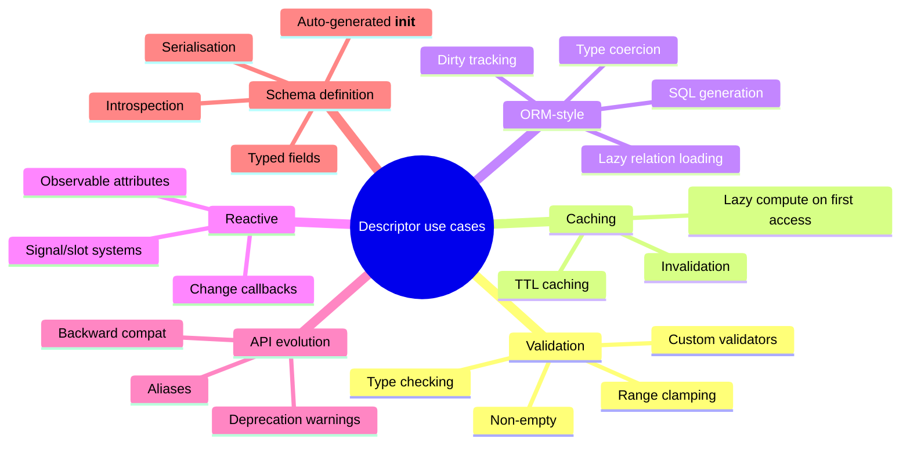
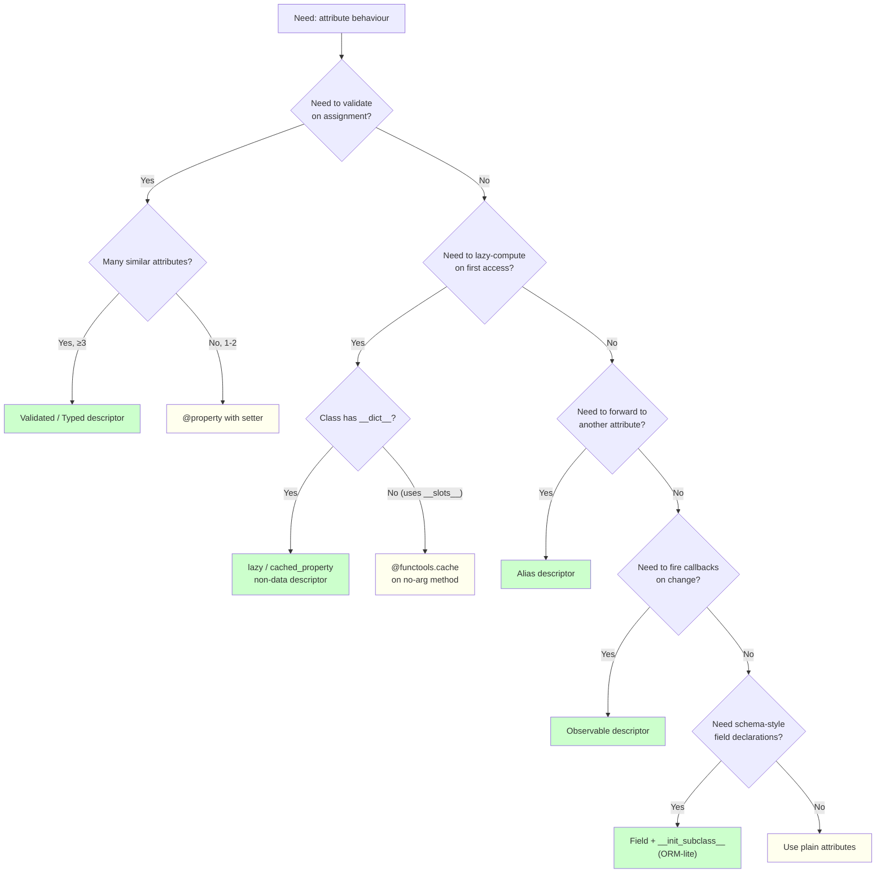

# 5. Descriptors Deep Dive

> [!note] Why this note exists
> [[17. Metaprogramming/5. Descriptors|Descriptors]] introduced the protocol (`__get__`, `__set__`, `__delete__`, `__set_name__`) and the data-vs-non-data distinction. This note is the **applied, real-world** treatment: reusable descriptors for class attributes, validation, lazy computation, typed fields, and the patterns used by production frameworks (Django fields, SQLAlchemy columns, Pydantic fields, attrs). It bridges from "I understand the protocol" to "I can write a descriptor that solves a real problem." If you've ever wondered how Django knows `User.name` is a `CharField(max_length=100)` *without* an explicit `__init__`, or how SQLAlchemy lazy-loads a `Post.author` relation on first attribute access, or how Pydantic validates types on assignment — the answer is descriptors. Read this after the foundational note; the deep dive assumes you understand the protocol and the lookup chain.

## Why It Matters

Descriptors are the mechanism behind every "declarative" Python API. Knowing how to write them lets you:

- **Build typed fields.** `name: str = TypedField(str, max_length=100)` — validation on assignment, like Pydantic or attrs.
- **Build lazy-loaded attributes.** `author = LazyRelation(lambda: load_author(self.id))` — DB query on first access, cached thereafter.
- **Build ORM-like schemas.** A `Model` class with `StringField`, `IntField`, `DateTimeField` descriptors; collect them into a schema via `__init_subclass__`; auto-generate `__init__`, SQL, and validators.
- **Build observable attributes.** `value = Observable(0)` — fire callbacks on set; useful for reactive UIs, signal/slot systems.
- **Build attribute aliases and deprecations.** `old_name = Alias('new_name')` — read/write to `new_name` while transparently forwarding `old_name`.
- **Build memoised computed properties.** A descriptor that computes on first access and caches, with optional TTL or invalidation.
- **Understand Django/SQLAlchemy/Pydantic internals.** Reading their descriptor implementations is the fastest way to understand their full power.
- **Avoid metaclasses.** Many use cases that "obviously need a metaclass" actually only need a descriptor + `__init_subclass__`.
- **Build configuration DSLs.** `host = ConfigField(default="localhost", env_var="HOST")` — declarative config with environment variable fallback.
- **Implement `@property` for repeating patterns.** If you have 10 similar properties, write one descriptor instead.

## Background

### Recap: the descriptor protocol

```python
class Descriptor:
    def __set_name__(self, owner, name):
        """Called once when the class is created. Tells you your name."""
        self.name = name
        self.storage = f'_desc_{name}'

    def __get__(self, obj, objtype=None):
        """Called on instance.attr or Class.attr."""
        if obj is None:
            return self  # accessed on the class
        return getattr(obj, self.storage, None)

    def __set__(self, obj, value):
        """Called on instance.attr = value."""
        setattr(obj, self.storage, value)

    def __delete__(self, obj):
        """Called on del instance.attr."""
        delattr(obj, self.storage)
```

The four hooks. `__set_name__` (3.6+) is the modern way to learn your name on the class. `__get__` is consulted by `__getattribute__` (see [[17. Metaprogramming/2. getattr, setattr, hasattr|getattr, setattr, hasattr]]). Data descriptors (those with `__set__` or `__delete__`) win over instance `__dict__`; non-data descriptors (only `__get__`) lose to it. See [[17. Metaprogramming/1. dict and Attribute Access|dict and Attribute Access]] for the full lookup chain.

### Storage strategies

A descriptor must store per-instance state somewhere. Options:

1. **A different attribute name on the instance.** `setattr(obj, f'_desc_{self.name}', value)`. Simple, works with `__dict__` and `__slots__` (if the slot exists).
2. **A `WeakKeyDictionary` keyed by instance.** `self._data[obj] = value`. Avoids polluting the instance namespace; supports any object (even without `__dict__`). Memory is reclaimed when the instance dies.
3. **A `_data` dict on the instance.** `obj._data[self.name] = value`. Centralised storage; useful for serialisation. Requires the host class to have a `_data` dict.
4. **The descriptor's own dict (NOT recommended).** `self.value = value` — shared across all instances! Almost always wrong.

```python
# Strategy 1: per-instance attribute
class TypedField:
    def __set_name__(self, owner, name):
        self.storage = f'_tf_{name}'
    def __get__(self, obj, objtype=None):
        if obj is None: return self
        return getattr(obj, self.storage, None)
    def __set__(self, obj, value):
        setattr(obj, self.storage, value)

# Strategy 2: WeakKeyDictionary
from weakref import WeakKeyDictionary
class WeakField:
    def __init__(self):
        self._data = WeakKeyDictionary()
    def __get__(self, obj, objtype=None):
        if obj is None: return self
        return self._data.get(obj)
    def __set__(self, obj, value):
        self._data[obj] = value

# Strategy 3: centralised dict
class DictField:
    def __set_name__(self, owner, name):
        self.name = name
    def __get__(self, obj, objtype=None):
        if obj is None: return self
        return obj._data.get(self.name)
    def __set__(self, obj, value):
        obj._data[self.name] = value
```

Pick based on needs:
- **Strategy 1** is fastest and most idiomatic. Use by default.
- **Strategy 2** for objects you don't want to add attributes to (e.g., proxies of built-ins) or when you can't predict slot names.
- **Strategy 3** for serialiser-friendly models (one dict per instance, easy to dump).

## Main content

### Reusable validation descriptor

```python
class Validated:
    """A field that runs a validator on set."""
    def __init__(self, *, type_=object, validator=None, default=None):
        self.type_ = type_
        self.validator = validator
        self.default = default
        self.name = None

    def __set_name__(self, owner, name):
        self.name = name
        self.storage = f'_val_{name}'

    def __get__(self, obj, objtype=None):
        if obj is None:
            return self
        return getattr(obj, self.storage, self.default)

    def __set__(self, obj, value):
        if not isinstance(value, self.type_):
            raise TypeError(
                f"{self.name} must be {self.type_.__name__}, got {type(value).__name__}"
            )
        if self.validator is not None:
            self.validator(self.name, value)
        setattr(obj, self.storage, value)

# Usage
def non_empty(name, value):
    if not value:
        raise ValueError(f"{name} must not be empty")

class User:
    name = Validated(type_=str, validator=non_empty, default="anonymous")
    age = Validated(type_=int, default=0)

u = User()
print(u.name)  # 'anonymous'
u.name = "Alice"
u.age = 30
u.age = "thirty"  # TypeError: age must be int, got str
u.name = ""  # ValueError: name must not be empty
```

This is the foundation of Pydantic, attrs validators, and most typed-attribute libraries.

### Type-checked descriptor (the `Typed` pattern)

```python
class Typed:
    def __init__(self, type_, *, default=None):
        self.type_ = type_
        self.default = default

    def __set_name__(self, owner, name):
        self.name = name
        self.storage = f'_typed_{name}'

    def __get__(self, obj, objtype=None):
        if obj is None:
            return self
        if not hasattr(obj, self.storage):
            setattr(obj, self.storage, self.default)
        return getattr(obj, self.storage)

    def __set__(self, obj, value):
        if not isinstance(value, self.type_):
            raise TypeError(
                f"{self.name} expects {self.type_.__name__}, got {type(value).__name__}"
            )
        setattr(obj, self.storage, value)

class Config:
    host = Typed(str, default="localhost")
    port = Typed(int, default=8080)
    debug = Typed(bool, default=False)
```

Note: `isinstance(True, int)` is `True` (because `bool` subclasses `int`). To reject `bool` for an `int` field:

```python
def __set__(self, obj, value):
    if type(value) is not self.type_ and not isinstance(value, self.type_):
        # ...
```

But usually, accepting `bool` as `int` is desirable. Don't over-engineer.

### Lazy property descriptor (cached on first access)

```python
class lazy:
    """Compute on first access, cache on the instance."""
    def __init__(self, func):
        self.func = func
        self.name = func.__name__
        self.__doc__ = func.__doc__

    def __get__(self, obj, objtype=None):
        if obj is None:
            return self
        value = self.func(obj)
        # Cache on the instance __dict__. Since `lazy` is a non-data descriptor
        # (only __get__), future reads hit the instance dict first and bypass us.
        obj.__dict__[self.name] = value
        return value

class Expensive:
    @lazy
    def fib_50(self):
        """Compute the 50th Fibonacci number."""
        print("computing...")
        a, b = 0, 1
        for _ in range(50):
            a, b = b, a + b
        return a

e = Expensive()
print(e.fib_50)  # prints "computing..." then 7778742049
print(e.fib_50)  # 7778742049 — cached, no print
```

This is `functools.cached_property` (Python 3.8+) in 15 lines. The trick: by being a *non-data* descriptor (only `__get__`), once we write to `obj.__dict__`, future reads use the dict and skip us.

> [!warning]
> `cached_property` doesn't work with `__slots__` (no `__dict__`). Use `@functools.cache` on a no-arg method instead.

### Lazy relation (ORM-style)

```python
class LazyRelation:
    """Loads the related object on first access, then caches."""
    def __init__(self, loader):
        self.loader = loader  # loader(obj) -> related object

    def __set_name__(self, owner, name):
        self.name = name
        self.storage = f'_rel_{name}'

    def __get__(self, obj, objtype=None):
        if obj is None:
            return self
        if not hasattr(obj, self.storage):
            related = self.loader(obj)
            setattr(obj, self.storage, related)
        return getattr(obj, self.storage)

    def __set__(self, obj, value):
        # Allow pre-loading or assigning
        setattr(obj, self.storage, value)

# Usage (simulating Django/SQLAlchemy)
def load_author(post):
    print(f"Querying DB for author of post {post.id}")
    return {"id": post.author_id, "name": "Alice"}

class Post:
    author = LazyRelation(load_author)

    def __init__(self, id, author_id):
        self.id = id
        self.author_id = author_id

p = Post(1, 42)
print("about to access author")
print(p.author)  # prints "Querying DB for author of post 1" then {'id': 42, 'name': 'Alice'}
print(p.author)  # cached — no DB query
```

This is exactly how Django's `ForeignKey` and SQLAlchemy's `relationship()` work — descriptors that trigger DB queries on first access.

### Observable / reactive descriptor

```python
class Observable:
    """Fires callbacks when the value changes."""
    def __init__(self, default=None):
        self.default = default

    def __set_name__(self, owner, name):
        self.name = name
        self.storage = f'_obs_{name}'
        self.callbacks_attr = f'_cbs_{name}'

    def __get__(self, obj, objtype=None):
        if obj is None:
            return self
        return getattr(obj, self.storage, self.default)

    def __set__(self, obj, value):
        old = getattr(obj, self.storage, self.default)
        setattr(obj, self.storage, value)
        if old != value:
            for cb in getattr(obj, self.callbacks_attr, []):
                cb(obj, self.name, old, value)

    def subscribe(self, obj, callback):
        """Helper to register a callback on an instance."""
        if not hasattr(obj, self.callbacks_attr):
            setattr(obj, self.callbacks_attr, [])
        getattr(obj, self.callbacks_attr).append(callback)

# Usage
class Counter:
    count = Observable(0)

def log_change(obj, name, old, new):
    print(f"{name} changed: {old} -> {new}")

c = Counter()
Observable.subscribe(c, log_change)  # type: ignore — or use a class method
c.count = 1   # count changed: 0 -> 1
c.count = 2   # count changed: 1 -> 2
c.count = 2   # (no callback — value didn't change)
```

This is the foundation of reactive UIs (PyQt signals/slots, Vue.js reactivity) and observable state systems (RxJS, ReactiveX).

### Alias descriptor (deprecation / rename)

```python
class Alias:
    """Forwards attribute access to another attribute."""
    def __init__(self, target):
        self.target = target

    def __get__(self, obj, objtype=None):
        if obj is None:
            return self
        import warnings
        warnings.warn(
            f"use {self.target!r} instead",
            DeprecationWarning,
            stacklevel=2,
        )
        return getattr(obj, self.target)

    def __set__(self, obj, value):
        setattr(obj, self.target, value)

class User:
    def __init__(self, username):
        self.username = username
    # Deprecated alias:
    name = Alias('username')

u = User("alice")
print(u.username)  # 'alice' (no warning)
print(u.name)      # 'alice' (with DeprecationWarning)
```

Useful for API evolution: rename an attribute, keep the old name working with a warning.

### Bounded / clamped descriptor

```python
class Clamped:
    """Clamps numeric values to [min, max]."""
    def __init__(self, low, high, default=None):
        self.low = low
        self.high = high
        self.default = default if default is not None else low

    def __set_name__(self, owner, name):
        self.name = name
        self.storage = f'_clamp_{name}'

    def __get__(self, obj, objtype=None):
        if obj is None:
            return self
        return getattr(obj, self.storage, self.default)

    def __set__(self, obj, value):
        clamped = max(self.low, min(self.high, value))
        setattr(obj, self.storage, clamped)

class Volume:
    level = Clamped(0, 100, default=50)

v = Volume()
v.level = 150
print(v.level)  # 100 (clamped)
v.level = -10
print(v.level)  # 0 (clamped)
```

Useful for game dev, audio, sliders, etc.

### Comparison: `@property` vs custom descriptor

| Aspect | `@property` | Custom descriptor |
|---|---|---|
| Verbosity | One decorator + method | A class with `__get__`/`__set__` |
| Reusability | Per-attribute | Reusable across many attributes |
| Configuration | Lambda or closure per use | `__init__` params |
| State | Stored however you want | Stored however you want |
| Inheritance | Each subclass redefines | Reusable, no subclass code |
| Use case | One-off computed/validated attribute | Many similar attributes |

Rule: if you have 3+ similar properties, write a descriptor. For 1-2, `@property` is fine.

### Real-world: Django field descriptor (simplified)

```python
class Field:
    """Simplified version of django.db.models.Field."""
    def __init__(self, *, max_length=None, default=None, null=False):
        self.max_length = max_length
        self.default = default
        self.null = null
        self.name = None
        self.column = None

    def __set_name__(self, owner, name):
        self.name = name
        self.column = name  # by default, column name = attribute name
        # Register with the model class
        if hasattr(owner, '_meta'):
            owner._meta.fields.append(self)

    def __get__(self, obj, objtype=None):
        if obj is None:
            return self  # Model.field returns the Field instance
        return obj.__dict__.get(self.column, self.default)

    def __set__(self, obj, value):
        if self.max_length and value and len(value) > self.max_length:
            raise ValueError(f"{self.name} too long (max {self.max_length})")
        if not self.null and value is None:
            raise ValueError(f"{self.name} cannot be null")
        obj.__dict__[self.column] = value

    def to_sql(self):
        """Generate SQL column definition."""
        sql_type = "VARCHAR" if self.max_length else "TEXT"
        sql = f"{self.column} {sql_type}"
        if self.max_length:
            sql += f"({self.max_length})"
        if not self.null:
            sql += " NOT NULL"
        return sql

class CharField(Field):
    def __init__(self, max_length, **kwargs):
        super().__init__(max_length=max_length, **kwargs)

class ModelMeta(type):
    def __new__(mcs, name, bases, ns):
        cls = super().__new__(mcs, name, bases, ns)
        cls._meta = type('Meta', (), {'fields': []})()
        for name, value in ns.items():
            if isinstance(value, Field):
                # __set_name__ already ran, but _meta wasn't ready
                cls._meta.fields.append(value)
        return cls

class Model(metaclass=ModelMeta):
    pass

class User(Model):
    name = CharField(max_length=100)
    email = CharField(max_length=255, null=True)

# Generate SQL:
for f in User._meta.fields:
    print(f.to_sql())
# name VARCHAR(100) NOT NULL
# email VARCHAR(255)

# Use:
u = User()
u.name = "Alice"
u.email = "alice@example.com"
print(u.name)  # Alice
u.name = "x" * 200  # ValueError
```

This is the essence of Django's ORM: `Field` is a descriptor that knows its column, validates on set, and contributes to SQL generation. The metaclass collects the fields. The full Django `Field` is ~3000 lines, but the core pattern is exactly this.

### Real-world: SQLAlchemy column (simplified)

```python
class Column:
    """Simplified version of sqlalchemy.Column."""
    def __init__(self, type_, *, primary_key=False, default=None):
        self.type_ = type_
        self.primary_key = primary_key
        self.default = default
        self.name = None

    def __set_name__(self, owner, name):
        self.name = name

    def __get__(self, obj, objtype=None):
        if obj is None:
            return self
        # Lazy-load from DB if not in instance state
        if not hasattr(obj, '_loaded'):
            obj._loaded = {}
        if self.name not in obj._loaded:
            print(f"SELECT {self.name} FROM {type(obj).__name__} WHERE id={obj.id}")
            obj._loaded[self.name] = f"loaded_{self.name}"
        return obj._loaded[self.name]

    def __set__(self, obj, value):
        if not hasattr(obj, '_loaded'):
            obj._loaded = {}
        obj._loaded[self.name] = value
        # Mark as dirty for UPDATE on commit
        if not hasattr(obj, '_dirty'):
            obj._dirty = set()
        obj._dirty.add(self.name)

class Integer: pass
class String: pass

class Base:
    pass

class User(Base):
    id = Column(Integer, primary_key=True)
    name = Column(String)

u = User()
u.id = 1
print(u.name)  # SELECT name FROM User WHERE id=1, then 'loaded_name'
u.name = "Alice"  # marks dirty
```

The key insight: `Column.__get__` triggers a DB query on first access (lazy loading), and `__set__` marks the object as dirty for the next `commit()` call. This is *exactly* how SQLAlchemy works.

### Real-world: Pydantic field (simplified)

```python
class FieldInfo:
    """Simplified version of pydantic.FieldInfo."""
    def __init__(self, type_, *, default=None, validator=None):
        self.type_ = type_
        self.default = default
        self.validator = validator

    def __set_name__(self, owner, name):
        self.name = name
        self.storage = f'_pyd_{name}'

    def __get__(self, obj, objtype=None):
        if obj is None:
            return self
        return getattr(obj, self.storage, self.default)

    def __set__(self, obj, value):
        # Coerce type
        if not isinstance(value, self.type_):
            try:
                value = self.type_(value)
            except (TypeError, ValueError) as e:
                raise TypeError(f"{self.name}: cannot coerce {value!r} to {self.type_.__name__}") from e
        # Run validator
        if self.validator:
            self.validator(value)
        setattr(obj, self.storage, value)

class PydanticModel:
    """Simplified Pydantic-style model."""
    def __init__(self, **kwargs):
        for name, value in kwargs.items():
            setattr(self, name, value)

class User(PydanticModel):
    id = FieldInfo(int)
    name = FieldInfo(str, validator=lambda v: None if v else (_ for _ in ()).throw(ValueError("empty")))
    email = FieldInfo(str, default="")

u = User(id="123", name="Alice")  # '123' coerced to int
print(u.id, u.name, u.email)  # 123 Alice (empty string default)
```

Pydantic's real `FieldInfo` is much more sophisticated (JSON schema generation, custom serializers, computed fields, etc.), but the core pattern is descriptor + `__set_name__` + type coercion.

### Combining descriptors with `__init_subclass__` for schema collection

```python
class Field:
    def __init__(self, type_):
        self.type_ = type_
        self.name = None

    def __set_name__(self, owner, name):
        self.name = name

    def __get__(self, obj, objtype=None):
        if obj is None: return self
        return obj.__dict__.get(self.name)

    def __set__(self, obj, value):
        if not isinstance(value, self.type_):
            raise TypeError(f"{self.name} expects {self.type_.__name__}")
        obj.__dict__[self.name] = value

class Schema:
    def __init_subclass__(cls, **kwargs):
        super().__init_subclass__(**kwargs)
        cls._fields = {
            name: value for name, value in vars(cls).items()
            if isinstance(value, Field)
        }
        # Auto-generate __init__
        def __init__(self, **kwargs):
            for name, value in kwargs.items():
                if name not in type(self)._fields:
                    raise TypeError(f"unexpected field: {name}")
                setattr(self, name, value)
            for name in type(self)._fields:
                if not hasattr(self, name):
                    raise TypeError(f"missing field: {name}")
        cls.__init__ = __init__

class User(Schema):
    id = Field(int)
    name = Field(str)

u = User(id=1, name="Alice")
print(u.id, u.name)  # 1 Alice
User(id=1)  # TypeError: missing field: name
User(id="x", name="Alice")  # TypeError: id expects int
```

This is a 30-line ORM/serialiser. Real frameworks add a metaclass for SQL generation, validators, serialisation, but the core is descriptors + `__init_subclass__` — *no metaclass required*.

### Descriptor use cases overview



### Descriptor decision flow (which pattern to use)



### The descriptor + `__init_subclass__` recipe

For "declarative schema" use cases (ORM, config, settings, serializers), the modern Python pattern is:

1. **Write a `Field` descriptor** that knows its name (via `__set_name__`) and validates on set.
2. **Use `__init_subclass__`** to collect all `Field` instances into a `_fields` registry on the class.
3. **Auto-generate `__init__`** that accepts keyword args, validates them, and sets attributes.
4. **Add helpers** like `to_dict()`, `from_dict()`, `to_json()`, etc., that iterate `_fields`.

This gives you 80% of an ORM or serialiser with zero metaclasses. Reach for a metaclass only when you need to customise *class creation* itself (e.g., SQL table generation that needs to happen at class definition time, before any instance exists).

## Common Pitfalls

1. **Storing per-instance state in the descriptor itself.** `self.value = value` is shared across all instances. Always store on `obj` (or in a `WeakKeyDictionary`).

2. **Forgetting `__set_name__`.** Without it, the descriptor doesn't know its name and can't choose a unique storage attribute. Pre-3.6 workaround: scan `owner.__dict__` in `__get__` to find yourself — slow and fragile.

3. **Infinite recursion via `__set__`.** `def __set__(self, obj, value): setattr(obj, self.name, value)` — if `self.name` is the same as the descriptor's name, this calls `__set__` again. Use a different storage name (e.g., `f'_desc_{self.name}'`).

4. **Forgetting to handle `obj is None` in `__get__`.** `Class.attr` calls `__get__(None, Class)`. Returning `None` is misleading; return `self` (the descriptor) for introspection.

5. **Confusing data and non-data descriptors.** A descriptor with only `__get__` is non-data — instance `__dict__` wins. If you want to validate on set, you need `__set__` (data descriptor).

6. **Not handling `__slots__`.** If the host class uses `__slots__`, the descriptor's storage attribute name must be in `__slots__` (or you need a different storage strategy, like `WeakKeyDictionary`).

7. **Using descriptors on instances.** Descriptors only intercept access from the class. `obj.x = MyDescriptor()` just stores the descriptor as a regular attribute.

8. **Forgetting `__delete__` when needed.** If `__set__` is overridden, `__delete__` should usually be too — otherwise `del obj.x` skips your logic.

9. **Validators that raise `TypeError` for value errors.** Use `ValueError` for invalid values, `TypeError` for wrong types.

10. **Believing descriptors validate at `__init__` time.** They validate at *assignment* time. If `__init__` writes via `obj.__dict__[name] = value`, the descriptor is bypassed.

11. **Storing mutable defaults in the descriptor.** `def __init__(self, default=[]): self.default = default` — the list is shared across all instances using this descriptor.

12. **Combining descriptors with `@dataclass` incorrectly.** `@dataclass` generates `__init__` that writes via `setattr`, which goes through descriptors. Good. But if you set `slots=True`, the descriptor's storage name must be a slot.

13. **Expecting descriptors to work after the class is created.** Adding a descriptor to an existing class (`Class.x = MyDescriptor()`) doesn't call `__set_name__`. Call it manually: `desc.__set_name__(Class, 'x')`.

14. **Using `type(value) is int` instead of `isinstance(value, int)`.** Rejects `bool` (which is usually desired) and int subclasses (usually undesired).

15. **Forgetting that `__getattribute__` overrides affect descriptors.** If a class overrides `__getattribute__` without calling `super()`, descriptors stop working.

16. **Memory leaks with `WeakKeyDictionary`.** If the descriptor holds strong references to instances (e.g., in a regular dict), they can't be garbage collected.

## Tips and Tricks

- **Default to storing under a private name** like `f'_desc_{self.name}'`. Simple, fast, works with most classes.
- **`__set_name__` is the modern way to learn your name** (3.6+). Use it.
- **For descriptors on `__slots__` classes, use `WeakKeyDictionary`** or carefully choose slot names.
- **`@property` for one-off attributes; descriptors for repeating patterns.**
- **Combine descriptors with `__init_subclass__`** to collect fields into a registry — no metaclass needed.
- **Validate in `__set__`, not in `__init__`.** That way, even `obj.x = new_value` is validated.
- **Use `isinstance(value, self.type_)`** for type checks, not `type(value) is self.type_`.
- **For lazy/cached descriptors, make them non-data** (only `__get__`) and cache in `obj.__dict__`. Future reads bypass the descriptor.
- **For "set once" descriptors, raise `AttributeError` after first `__set__`.**
- **For observable descriptors, fire callbacks only when the value actually changes** (compare old and new).
- **For aliases, use `getattr(obj, self.target)`** — supports chained aliases and lazy targets.
- **For deprecation warnings, use `warnings.warn(..., DeprecationWarning, stacklevel=2)`.**
- **For ORM-style dirty tracking, maintain a `_dirty` set in `__set__`** and clear it on commit.
- **For ORM-style lazy loading, query the DB in `__get__` on cache miss.**
- **`functools.cached_property` is the stdlib version of the lazy descriptor.** Use it instead of writing your own.
- **`functools.lru_cache` on a method is an alternative** to a cached descriptor, but it caches on the function, not the instance.
- **Pydantic, attrs, and `@dataclass` are descriptor-based.** Reading their source is the best way to learn real-world patterns.
- **Django's `Field` and SQLAlchemy's `Column` are the canonical ORM descriptors.** Reading their source is instructive.
- **For type coercion (Pydantic-style), try `self.type_(value)` in `__set__`** and catch `TypeError`/`ValueError`.
- **For JSON schema generation, walk `vars(cls)` looking for descriptor instances** and emit JSON Schema for each.
- **For testability, write descriptors as small classes with `__init__`, `__set_name__`, `__get__`, `__set__`** — easy to unit-test in isolation.

## Active Recall

1. Write a `Validated` descriptor that takes a `validator` callable and runs it on `__set__`.
2. Write a `lazy` descriptor (non-data) that caches on first access.
3. Write an `Observable` descriptor that fires callbacks on change.
4. Write an `Alias` descriptor that forwards to another attribute.
5. Write a `Clamped(low, high)` descriptor that clamps numeric values.
6. How would you collect all `Field` descriptors into a class-level `_fields` registry? (Hint: `__init_subclass__`.)
7. Write a simplified Django `CharField(max_length=100)` descriptor.
8. Write a simplified SQLAlchemy `Column` that lazy-loads on first `__get__`.
9. Why does `cached_property` not work with `__slots__`?
10. What's the difference between `@property` and a custom descriptor? When would you use each?
11. Why must `__set__` use a different storage name than the descriptor's name?
12. How would you handle `obj is None` in `__get__`? Why?
13. What's the "descriptor + `__init_subclass__` recipe"? When does it replace a metaclass?
14. Write a `Typed(int)` descriptor that rejects `bool`.
15. How would you implement "set once" semantics in a descriptor?
16. How would you track dirty fields for an ORM-style model?
17. How does Django's `ForeignKey` use descriptors to lazy-load relations?
18. How does Pydantic's `FieldInfo` coerce types?
19. Write a `ConfigField` descriptor that falls back to an environment variable.
20. Why is `WeakKeyDictionary` useful as descriptor storage?

## Next Steps

- [[17. Metaprogramming/5. Descriptors|Descriptors]] — the foundational protocol (read first if you haven't).
- [[17. Metaprogramming/1. dict and Attribute Access|dict and Attribute Access]] — the storage layer descriptors write to.
- [[17. Metaprogramming/2. getattr, setattr, hasattr|getattr, setattr, hasattr]] — the access layer that invokes descriptors.
- [[17. Metaprogramming/3. type and Dynamic Class Creation|type and Dynamic Class Creation]] — `__set_name__` is called at class creation.
- [[17. Metaprogramming/4. Metaclasses|Metaclasses]] — when you need to customise class creation itself (rare with modern descriptors).
- [[1. Abstract Base Classes]] — ABCs can use descriptors for abstract attributes.
- [[4. Dataclasses]] — `@dataclass` uses descriptors internally.
- [[9. Standard Library Deep Dive/6. functools|functools]] — `cached_property` and `lru_cache` as descriptor-based utilities.
