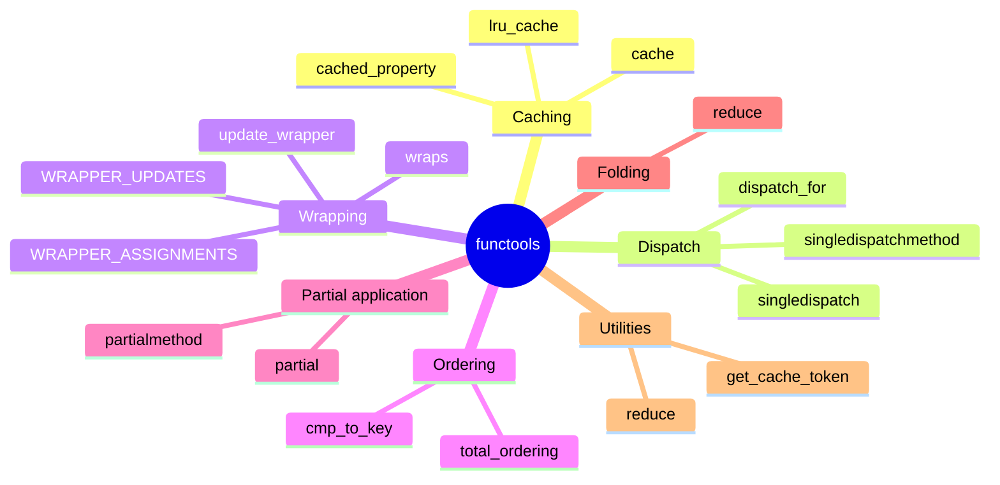
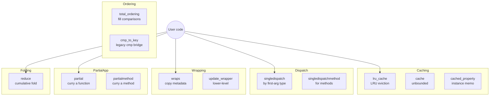

# 1. functools Deep Dive

> [!note] Why this note exists
> [[9. Standard Library Deep Dive/6. functools|functools (SLD)]] introduced the module at a tour level. This note is the **mastery** treatment: every public member of `functools` examined in depth, with implementation notes, performance characteristics, edge cases, and the why behind each design decision. After this note you should be able to choose the right `functools` tool for any given problem on instinct — and, more importantly, know when *not* to reach for one.

## Why It Matters

`functools` is the standard library's home for **higher-order functions** — functions that take or return other functions. Almost every nontrivial Python program benefits from at least one of its tools:

- `@lru_cache` / `@cache` turn pure functions into memoized ones in one line.
- `@wraps` is the difference between a decorator that plays nicely with `inspect`, `help`, Sphinx, and pytest, and one that doesn't.
- `@singledispatch` is Python's answer to ad-hoc polymorphism — replace `isinstance` ladders with registered overloads.
- `@total_ordering` writes four comparison methods for you.
- `@cached_property` memoizes a property on the instance.
- `partial` / `partialmethod` pre-fill arguments — the foundation of currying-style reuse.
- `reduce` is the universal fold (and the most overused member of the module).

Skip these tools and you write more boilerplate, hit more bugs, and miss opportunities for clean, declarative code. Use them carelessly and you get memory leaks (`@lru_cache` on a long-lived process holding large arguments), surprising identity bugs (`@cached_property` on a class with `__slots__`), or wrong dispatch (`@singledispatch` on abstract base classes).

## Background

### Higher-order functions

A **higher-order function** is one that accepts a function as an argument, returns a function, or both. `functools` provides both standalone HOFs (`reduce`, `partial`) and **decorators** — HOFs applied with the `@` syntax. `@decorator` above `def f(): ...` is sugar for `f = decorator(f)`.

### Memoization: the core idea

**Memoization** = cache the result of a function call keyed by its arguments. The next call with the same arguments returns the cached value instead of recomputing. Safe only for **pure functions** — same inputs always produce the same output, no side effects, no dependence on mutable global state.

```python
def fib(n):
    if n < 2: return n
    return fib(n-1) + fib(n-2)

# fib(40) ≈ 30 seconds — exponential blowup

from functools import lru_cache

@lru_cache(maxsize=None)
def fib(n):
    if n < 2: return n
    return fib(n-1) + fib(n-2)

# fib(40) is instant — O(n) instead of O(2^n)
```

The recursive version calls `fib(2)` millions of times; the memoized version calls it once per distinct `n`.

## Main content

### The full member list



### `@lru_cache` — memoize with LRU eviction

```python
from functools import lru_cache

@lru_cache(maxsize=128)
def expensive(x: int) -> int:
    print(f"computing {x}")
    return x * x

expensive(4)              # computing 4 -> 16
expensive(4)              # 16 (cached, no print)
expensive.cache_info()    # CacheInfo(hits=1, misses=1, maxsize=128, currsize=1)
expensive.cache_clear()   # empty the cache
```

Key facts:
- `maxsize` is the LRU bound. `None` = unbounded (the cache grows forever). `maxsize=128` evicts the least-recently-used entry when full.
- Arguments must be **hashable**. Lists and dicts can't be cached directly — convert to tuples or frozensets first.
- The cache is per-function, not per-instance. For instance methods, see `@cached_property` or pass `self` carefully.
- `typed=True` (3.3+) distinguishes `1` (int) from `1.0` (float) — they get separate cache entries.
- Cache is **not thread-safe by default** for write operations across the cache; reads are atomic on CPython due to the GIL, but for high-concurrency scenarios prefer a dedicated thread-safe cache.

#### Caching instance methods

```python
class Data:
    def __init__(self, raw):
        self.raw = raw

    @lru_cache(maxsize=None)
    def parsed(self):
        return json.loads(self.raw)
```

This **holds a reference to `self` in the cache, preventing garbage collection of the instance** — a classic memory leak. For instance methods, prefer `@cached_property` (which stores the value on the instance) or use a `weakref`-based cache.

#### Custom cache key (3.8+)

If your arguments aren't directly hashable but you can derive a key:

```python
@lru_cache(maxsize=128)
def process(text: str) -> int:
    return len(text)

# For unhashable args, wrap them:
def make_key(obj):
    if isinstance(obj, dict):
        return tuple(sorted(obj.items()))
    return obj
```

Python 3.8+ exposes `functools.cached_property` and you can also use `lru_cache` on free functions that take only hashable args.

### `@cache` (Python 3.9+) — unbounded memoization

`@cache` is shorthand for `@lru_cache(maxsize=None)`:

```python
from functools import cache

@cache
def fib(n):
    return n if n < 2 else fib(n-1) + fib(n-2)
```

Use `@cache` when you know the argument space is bounded (e.g., a function of a small enum) or when you'll explicitly clear the cache periodically. Use `@lru_cache(maxsize=N)` when unbounded growth would be a memory leak.

### `@cached_property` — memoized property on the instance

```python
from functools import cached_property

class DataSet:
    def __init__(self, numbers):
        self.numbers = numbers

    @cached_property
    def variance(self):
        print("computing variance...")
        m = sum(self.numbers) / len(self.numbers)
        return sum((x - m) ** 2 for x in self.numbers) / len(self.numbers)

ds = DataSet([1, 2, 3, 4, 5])
ds.variance   # computing variance... -> 2.0
ds.variance   # 2.0 (cached on instance, no recomputation)
```

Key facts:
- The computed value is stored as an instance attribute (`__dict__['variance']`). Subsequent accesses bypass the descriptor entirely.
- Requires `__dict__` — won't work with `__slots__` unless `'__dict__'` is included.
- Not thread-safe by default; concurrent first-access can compute twice. Python 3.12+ adds an optional lock.
- Use `__set_name__` (which `cached_property` implements) to know the attribute name at class creation.
- Invalidation: `del ds.variance` removes the cache; the next access recomputes.

```python
del ds.variance    # invalidate
ds.variance        # recomputes
```

### `@wraps` — copy metadata from the wrapped function

When you write a decorator without `@wraps`, the returned wrapper keeps its own `__name__` and `__doc__`:

```python
def timer(func):
    def wrapper(*args, **kwargs):
        ...
        return func(*args, **kwargs)
    return wrapper

@timer
def add(a, b):
    """Add two numbers."""
    return a + b

add.__name__   # 'wrapper'    <-- BAD
add.__doc__    # None          <-- BAD
```

With `@wraps`:

```python
from functools import wraps

def timer(func):
    @wraps(func)
    def wrapper(*args, **kwargs):
        ...
        return func(*args, **kwargs)
    return wrapper

@timer
def add(a, b):
    """Add two numbers."""
    return a + b

add.__name__   # 'add'         <-- GOOD
add.__doc__    # 'Add two numbers.'
add.__wrapped__   # <function add>  -- the original, for introspection
```

`@wraps` copies `__module__`, `__name__`, `__qualname__`, `__annotations__`, `__doc__`, and updates `__dict__`. It also sets `__wrapped__` to the original function — used by `inspect.signature()` to compute the visible signature.

### `update_wrapper` — the function `@wraps` is built on

```python
from functools import update_wrapper

def my_decorator(func):
    def wrapper(*args, **kwargs):
        return func(*args, **kwargs)
    update_wrapper(wrapper, func)
    return wrapper
```

`@wraps(func)` is just `update_wrapper(wrapper, func)` wrapped as a decorator factory. Useful when your decorator returns an object, not a function.

### `@total_ordering` — fill in missing comparison methods

```python
from functools import total_ordering

@total_ordering
class Money:
    def __init__(self, amount):
        self.amount = amount

    def __eq__(self, other):
        return self.amount == other.amount

    def __lt__(self, other):
        return self.amount < other.amount

Money(5) <= Money(10)   # True  -- auto-derived
Money(10) > Money(5)    # True  -- auto-derived
Money(5) == Money(5)    # True
```

Provide `__eq__` and **one** of `__lt__`, `__le__`, `__gt__`, `__ge__`; `@total_ordering` synthesizes the rest. The cost is a small runtime overhead per comparison — fine for most code, but if you need peak performance (e.g., sorting millions of items), write all four explicitly.

### `cmp_to_key` — bridge the old-style `cmp` world

Python 2 had `cmp(a, b)` returning `-1/0/1`. Python 3 removed `cmp` from `sort`. `cmp_to_key` converts a `cmp` function into a key class:

```python
from functools import cmp_to_key

def compare_versions(a, b):
    a_parts = [int(x) for x in a.split('.')]
    b_parts = [int(x) for x in b.split('.')]
    for x, y in zip(a_parts, b_parts):
        if x != y:
            return -1 if x < y else 1
    return 0

versions = ['1.10.0', '1.2.0', '1.1.0']
sorted(versions, key=cmp_to_key(compare_versions))
# ['1.1.0', '1.2.0', '1.10.0']
```

Use sparingly — Pythonic style prefers a real `key` function. Reach for `cmp_to_key` only when you have legacy `cmp` logic (or a third-party library that exposes one).

### `@singledispatch` — function overloading by type

```python
from functools import singledispatch

@singledispatch
def serialize(obj) -> str:
    raise TypeError(f"Unsupported type: {type(obj)}")

@serialize.register
def _(obj: int) -> str:
    return str(obj)

@serialize.register
def _(obj: list) -> str:
    return '[' + ','.join(serialize(x) for x in obj) + ']'

@serialize.register
def _(obj: dict) -> str:
    return '{' + ','.join(f'{serialize(k)}:{serialize(v)}' for k, v in obj.items()) + '}'

serialize(42)              # '42'
serialize([1, 2, 3])       # '[1,2,3]'
serialize({'a': 1})        # '{a:1}'
serialize(3.14)            # TypeError
```

Key facts:
- Dispatch is on the **first argument's runtime type**. Use `@singledispatchmethod` for methods (where the first arg is `self`).
- You can register either by passing the type explicitly (`@serialize.register(int)`) or by annotating the first parameter (`@serialize.register` + `def _(obj: int):`).
- Dispatch uses `type(obj).__mro__`, so subclasses inherit. Register an ABC (e.g., `Iterable`) to cover many concrete types.
- The original function (the `@singledispatch`-decorated one) is the fallback for unmatched types.

### `@singledispatchmethod` (Python 3.8+) — singledispatch for methods

```python
from functools import singledispatchmethod

class Visitor:
    @singledispatchmethod
    def visit(self, obj):
        raise TypeError(f"Unsupported: {type(obj)}")

    @visit.register
    def _(self, obj: int):
        return f"int: {obj}"

    @visit.register
    def _(self, obj: str):
        return f"str: {obj!r}"

v = Visitor()
v.visit(5)         # 'int: 5'
v.visit('hi')      # "str: 'hi'"
```

Works on instance methods, classmethods (when stacked with `@classmethod`), and even properties via stacking.

### `partial` — pre-fill arguments

```python
from functools import partial

def power(base, exponent):
    return base ** exponent

square = partial(power, exponent=2)
cube   = partial(power, exponent=3)

square(5)    # 25
cube(3)      # 27
```

`partial` returns a callable with bound positional/keyword arguments. See [[2. partial and singledispatch]] for the deep dive.

### `partialmethod` — `partial` for methods (unbound)

```python
from functools import partialmethod

class Cell:
    def __init__(self):
        self._alive = False

    def set_state(self, state):
        self._alive = state

    set_alive = partialmethod(set_state, True)
    set_dead  = partialmethod(set_state, False)

c = Cell()
c.set_alive()
c._alive   # True
```

`partialmethod` differs from `partial` in that it's designed to be used as a method descriptor — `self` is passed through automatically.

### `reduce` — the universal fold

```python
from functools import reduce

def product(seq):
    return reduce(lambda x, y: x * y, seq, 1)

product([1, 2, 3, 4, 5])   # 120
```

`reduce(f, iterable, init)` applies `f` cumulatively: `f(f(f(init, a), b), c)`. The `init` is optional; if omitted, the first element of the iterable is used as the initial value (and the iterable must be non-empty).

See [[4. map, filter, reduce]] for the deep dive — and for why Python 3 demoted `reduce` from a builtin to `functools`.

## Mermaid: functools capabilities map



## Code examples

### A memoized recursive parser

```python
from functools import lru_cache

@lru_cache(maxsize=4096)
def parse(tokens: tuple) -> 'AST':
    """Parses a tuple of tokens into an AST.

    Tuples are hashable; lists aren't — convert first.
    """
    ...
```

### A clean decorator with `@wraps`

```python
from functools import wraps
import time

def timed(func):
    @wraps(func)
    def wrapper(*args, **kwargs):
        start = time.perf_counter()
        try:
            return func(*args, **kwargs)
        finally:
            wrapper.last_call = time.perf_counter() - start
    wrapper.last_call = 0.0
    return wrapper

@timed
def slow():
    time.sleep(0.1)

slow()
print(slow.last_call)        # ~0.1
print(slow.__name__)         # 'slow'   (because of @wraps)
print(slow.__wrapped__)      # <function slow>  -- the original
```

### Singledispatch for a JSON-like serializer

```python
from functools import singledispatch
from datetime import datetime

@singledispatch
def to_json(obj):
    raise TypeError(f"Cannot serialize {type(obj).__name__}")

@to_json.register(int)
@to_json.register(float)
@to_json.register(bool)
def _(obj):
    return str(obj).lower() if isinstance(obj, bool) else str(obj)

@to_json.register(str)
def _(obj):
    return f'"{obj}"'

@to_json.register(list)
def _(obj):
    return '[' + ', '.join(to_json(x) for x in obj) + ']'

@to_json.register(dict)
def _(obj):
    return '{' + ', '.join(f'{to_json(k)}: {to_json(v)}' for k, v in obj.items()) + '}'

@to_json.register(datetime)
def _(obj):
    return f'"{obj.isoformat()}"'

to_json({'name': 'Alice', 'age': 30, 'active': True, 'ts': datetime.now()})
# {"name": "Alice", "age": 30, "active": true, "ts": "2024-01-01T00:00:00"}
```

### `total_ordering` on a value class

```python
from functools import total_ordering
from dataclasses import dataclass

@dataclass
@total_ordering
class Version:
    major: int
    minor: int
    patch: int

    def __eq__(self, other):
        return (self.major, self.minor, self.patch) == (other.major, other.minor, other.patch)

    def __lt__(self, other):
        return (self.major, self.minor, self.patch) < (other.major, other.minor, other.patch)

sorted([Version(1, 10, 0), Version(1, 2, 0), Version(2, 0, 0)])
# [Version(1, 2, 0), Version(1, 10, 0), Version(2, 0, 0)]
```

## Common Pitfalls

> [!warning] `@lru_cache` on methods leaks the instance
> Applying `@lru_cache` to an instance method holds a strong reference to `self` in the cache, preventing garbage collection. Either use `@cached_property` (for zero-arg methods) or accept the leak and clear the cache explicitly.

> [!warning] Unhashable arguments
> `@lru_cache` requires hashable args. Passing a list raises `TypeError`. Convert to tuple or frozenset, or use a manual cache with a `dict` and a custom key.

> [!warning] `@cached_property` + `__slots__`
> `cached_property` stores its result in `instance.__dict__`. If your class uses `__slots__` without `'__dict__'`, it raises `AttributeError`. Add `'__dict__'` to slots or use a manual `_cache` slot.

> [!warning] Singledispatch on ABCs may surprise you
> Registering `@serialize.register(Iterable)` dispatches on `isinstance(obj, Iterable)`, but Python checks the MRO in order — a more specific registration (e.g., `list`) wins. Always register the most specific types you need; the ABC registration is the fallback.

> [!warning] `reduce` with empty iterable and no initial value
> `reduce(f, [])` raises `TypeError`. Always pass an explicit initial value when the iterable could be empty.

> [!warning] `@wraps` doesn't preserve the signature
> `@wraps` copies `__name__`, `__doc__`, etc., but `inspect.signature(wrapper)` will still show `(*args, **kwargs)` unless you also call `functools.wraps(func)` (which sets `__wrapped__`, used by `inspect.signature` to walk back to the original). Modern Python does this automatically through `__wrapped__`.

> [!warning] Thread safety
> `@lru_cache` is not safe for high-concurrency writes; concurrent first-access on `@cached_property` can compute twice. Use a lock if correctness matters under heavy concurrency.

## Tips and Tricks

> [!tip] Inspect cache contents
> `lru_cache`-decorated functions expose `.cache_info()` (hits, misses, size, maxsize) and `.cache_clear()`. Use them in tests to verify cache behavior.

> [!tip] `cached_property` invalidation
> `del obj.attr` clears the cached value; the next access recomputes. Useful in tests where you mutate the underlying state.

> [!tip] Use `singledispatch` to replace Visitor pattern
> A common OOP pattern (Visitor) is replaced cleanly by `@singledispatch`. The function table lives in one place; new types just register new handlers. This is far more Pythonic than double-dispatch.

> [!tip] `partial` for callbacks
> GUI and async frameworks love `partial`: `button.on_click(partial(handle, user_id))` cleanly captures context.

> [!tip] Profile before caching
> Don't sprinkle `@lru_cache` everywhere — measure first. Caches add memory pressure and per-call hash overhead. Only cache functions that are both expensive and called repeatedly with the same args.

> [!tip] `@cache` for tiny lookups
> For pure functions over a small argument space (enum values, small int ranges), `@cache` is simpler than `@lru_cache(maxsize=None)`.

> [!tip] Use `__wrapped__` for testing
> If your decorator uses `@wraps`, you can access `func.__wrapped__` to test the original function directly, bypassing the wrapper. `inspect.unwrap(func)` walks any chain of wrappers.

> [!tip] Compose with `singledispatch` + `dataclass`
> A `@dataclass` with a `kind: Literal['A', 'B']` field plus `singledispatch` on the type gives you a clean variant-style dispatch — common in functional Python.

## Active Recall

1. What's the difference between `@lru_cache(maxsize=None)` and `@cache`? Which would you prefer for a function over a small set of enum-typed arguments?
2. Why does `@lru_cache` on an instance method cause a memory leak, and what are two alternatives?
3. `@cached_property` stores its value where? What happens if you `del obj.attr`?
4. `@wraps(func)` copies which attributes? What does it set `__wrapped__` to and why does `inspect.signature` care?
5. `@total_ordering` requires which two methods minimum? What's the runtime cost?
6. `@singledispatch` dispatches on what? Can you register an ABC? How does subclass resolution work?
7. `partial(func, a, b=1)` — when you call the result `(c)`, what gets passed to `func`?
8. `reduce(lambda a, b: a + b, [], 0)` returns what? What about `reduce(lambda a, b: a + b, [])`?
9. `cmp_to_key` exists for what historical reason? When would you reach for it today?
10. `@singledispatchmethod` differs from `@singledispatch` in what way?

## Next Steps

- [[2. partial and singledispatch]] — the deep dive on `partial`/`partialmethod` and `singledispatch`/`singledispatchmethod`, including when each beats inheritance.
- [[3. Immutable Patterns]] — pairs with `@cached_property` and `@lru_cache` (which require hashable, immutable-friendly data).
- [[4. map, filter, reduce]] — the full treatment of `reduce` and its relationship to comprehensions.
- [[10. Pythonic Programming/4. Decorators Deep Dive]] — `@wraps` is foundational; this is the decorator masterclass.
- [[9. Standard Library Deep Dive/6. functools|functools (SLD)]] — the lower-level tour, if you skipped it.
- [[15. Memory and Performance/6. Caching]] — broader caching strategies beyond `functools`.
